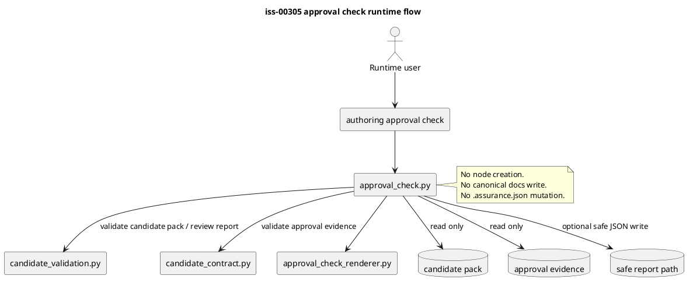

# iss-00305 Approval Stop Gate Reports — Issue 設計書

## 1. 等級と設計方針

`assurance classify --stage requirement` による authorized profile は `standard` である。ChatGPT analysis は stop-gate / authorization-like evidence の性質から `strict` を推奨したが、現行 runtime authority は `.assurance.json` の `authorized_profile=standard` を正とする。

このため、この Issue は Standard profile の設計書として作成しつつ、設計・計画・reviewer focus では strict 相当の fail-closed 観点を明示的に扱う。

## 2. 設計意図

この Issue は、ChatGPT authoring pack の candidate validation と、将来の node creation workflow の間に置く approval stop gate を実装する。

設計上の中心は次の 3 点である。

- `[N]` Candidate validation pass と human approval pass を分離する。
- `[N]` Approval check は read / validate / optional safe report write のみを行い、node creation や canonical mutation を行わない。
- `[N]` Approval evidence は candidate pack digest、scope、approver、approval statement、authority boundary を検査し、不一致・不足・self-approval を fail-closed にする。

## 3. 正本・根拠

| 種別 | パス・識別子 | この Issue への意味 |
|---|---|---|
| Issue requirement | `requirement.md` | approval check の scope / non-scope / AC を定義する |
| Parent Epic plan | `spec-dock/active/epic/plan.md` | C10 の位置づけ、relay policy、final Issue への PR defer を定義する |
| ChatGPT analysis | `artifacts/20260708t061422z-chatgpt-approval-stop-gate-planning-analysis.md` | schema、status model、実装順、テスト観点の提案 evidence |
| Draft artifacts | `artifacts/20260707t171312z-*`, `20260707t171313z-*` | initial scope と acceptance seed |
| Existing runtime | `src/spec_dock/assets/spec_dock/scripts/spec_dock_runtime/commands/authoring.py` | `authoring approval check` が deferred command として存在する現状 |
| Existing candidate validator | `application/authoring_pack/candidate_validation.py`, `domain/authoring_pack/candidate_contract.py` | pack root 解決、review report gate、tree digest、authority fields の既存 pattern |
| Existing renderers | `presentation/authoring_pack/*_renderer.py` | command ごとの JSON / text renderer pattern |
| Existing tests | `tests/cli_runtime/test_authoring.py` | authoring command の installed runtime regression lane |

## 4. 要件から設計への追跡

| 要件 | 設計ID | 設計上の扱い |
|---|---|---|
| AC-001 Help contract | DES-001 | deferred command を implemented command spec へ置換する |
| AC-002/003 Valid approval | DES-002 | approval evidence schema と result object を追加する |
| AC-004 Missing approval | DES-003 | approval path absent は `blocked` にする |
| AC-005 Stale digest | DES-004 | candidate pack digest / source manifest hash mismatch は `stale` にする |
| AC-006/007 Scope mismatch | DES-005 | requested / effective / parent scope mismatch は `blocked` にする |
| AC-008 Self approval | DES-006 | non-human actor と ChatGPT/tool self-approval は `rejected` にする |
| AC-009/010 Unsafe payload | DES-007 | forbidden authority claim / secret / raw transcript marker を拒否する |
| AC-011/012 Report path | DES-008 | safe report path guard を既存 pattern とそろえる |
| AC-013 No mutation | DES-009 | result に mutation boundary booleans を常時出力する |
| AC-015 Relay policy | DES-010 | PR delivery は `iss-00307` へ defer する |
| RB-003/RB-004 Freshness | DES-011 | candidate pack tree digest、candidate evidence file digest、source manifest hash を別々に照合する |

## 5. 継承制約と変更禁止領域

### 5.1 継承制約

- `[N]` Output authority は `evidence_only`。
- `[N]` Adoption status は `unreviewed`。
- `[N]` `bundle_generation_not_promotion=true`。
- `[N]` `pass` は command-local validation pass であり reviewer pass ではない。
- `[N]` `node_creation_performed=false`、`canonical_written=false`、`assurance_mutated=false`、`reviewer_pass_claimed=false`、`execution_ready=false`、`pr_ready=false` を維持する。

### 5.2 変更しないもの

| 対象 | 変更しない理由 |
|---|---|
| `authoring create-issues-from-zip` | Auto node creation は Epic deferred item |
| `authoring adopt` | Canonical adoption は Issue planning workflow の責務 |
| `.assurance.json` mutation | Assurance profile は ChatGPT / approval check が決めない |
| Existing candidate pack schema 全体 | C07 の責務。C10 は approval evidence との照合だけを追加する |
| Workflow docs / skill docs の全面改訂 | 後続 `iss-00306` の責務 |
| PR 作成 | final Issue `iss-00307` の責務 |

## 6. 現状

`commands/authoring.py` には `_DEFERRED_COMMANDS` として `authoring_approval_check` が登録されている。現行 command は implementation boundary を越えないが、approval evidence の有無や stale scope を検査できない。

既存 candidate validation は、candidate pack の tree digest、review report status、parent scope、authority boundary、unsafe payload を検査できる。Approval check はこの既存構造を再利用し、candidate validation pass の後に human approval evidence を照合する。

## 7. 目標設計差分

| Design ID | 種別 | 現在 | 目標 | 固定度 |
|---|---|---|---|---|
| DES-001 | CLI | `authoring approval check` は deferred | implemented command として args / runner / renderer を持つ | `[N]` |
| DES-002 | Domain | approval result がない | `ApprovalCheckResult` と approval evidence validator を持つ | `[N]` |
| DES-003 | Application | approval use case がない | `approval_check.py` が candidate pack と approval evidence を検査する | `[N]` |
| DES-004 | Status | stale / blocked / rejected の区別がない | deterministic status model を返す | `[N]` |
| DES-005 | Report | approval stop-gate report がない | safe report path に JSON report を書ける | `[N]` |
| DES-006 | Tests | deferred skeleton のみ | focused approval check tests を追加する | `[N]` |
| DES-011 | Freshness | candidate pack と source manifest の観測点が approval evidence だけに偏る | pack root tree digest、candidate evidence file digest、source manifest hash を別々の観測値として approval evidence / CLI expectation と照合する | `[N]` |

## 8. Runtime 構成



## 9. Approval evidence schema

Domain layer は最小 schema v1 を検査する。

```json
{
  "schema_version": 1,
  "approval_evidence_kind": "candidate_decomposition_approval",
  "approval_status": "approved",
  "approval_scope": "epic-issue-node-creation",
  "candidate_kind": "epic-issue",
  "requested_scope": {"scope_type": "epic", "scope_id": "epic-00295", "ref": "branch-or-context"},
  "effective_scope": {"scope_type": "epic", "scope_id": "epic-00295", "ref": "branch-or-context"},
  "candidate_pack": {
    "digest_algorithm": "sha256-tree-v1",
    "candidate_pack_digest": "<tree digest>",
    "source_manifest_hash": "<source manifest hash>",
    "candidate_ids": ["candidate-001"]
  },
  "approver": {"actor_type": "human", "id": "iwasawayuuta", "role": "scope_owner"},
  "approved_at": "2026-07-08T00:00:00Z",
  "approval_statement": "I approve this candidate decomposition for the stated scope before node creation.",
  "authority_boundary": {
    "node_creation_performed": false,
    "canonical_written": false,
    "assurance_mutated": false,
    "reviewer_pass_claimed": false,
    "execution_ready": false,
    "pr_ready": false
  }
}
```

`authority_boundary` が省略されても result は false values を出力する。ただし、payload 内に forbidden flag true、forbidden authority claim、secret marker、raw transcript marker がある場合は `rejected` にする。

## 10. Status model

| Status | 意味 | Exit |
|---|---|---|
| `pass` | human approval evidence が candidate pack / scope と一致した | 0 |
| `blocked` | approval missing、not approved、scope mismatch、candidate validation prerequisite missing | non-zero |
| `stale` | digest / source hash / parent trace が approval 時点と違う | non-zero |
| `rejected` | self-approval、forbidden authority claim、unsafe payload/path | non-zero |
| `fail` | malformed JSON、schema failure、required field invalid | non-zero |

## 11. CLI contract

```bash
./spec-dock/scripts/spec-dock authoring approval check \
  --input <stage-dir-or-pack-root> \
  --approval <approval-evidence.json> \
  --candidate-kind <initiative-epic|epic-issue> \
  --candidate-evidence <candidate-pack-or-index.json> \
  --expected-parent-initiative <init-id> \
  --expected-parent-epic <epic-id> \
  --expected-requested-scope <scope-type:scope-id> \
  --expected-effective-scope <scope-type:scope-id> \
  --expected-candidate-pack-digest <sha256-tree-v1> \
  --expected-candidate-evidence-digest <sha256> \
  --expected-source-manifest-hash <sha256> \
  --review-report <review-report.json> \
  --evidence-mode <github-synced|local-context> \
  --format <text|json> \
  --report-path <safe-report.json>
```

Conditional rule:

- `--candidate-kind initiative-epic` は `--expected-parent-initiative` を要求する。
- `--candidate-kind epic-issue` は `--expected-parent-epic` を要求する。
- `--review-report` は既存 candidate validation と同様に discovery を許容してよいが、明示 path も受ける。
- `--input` は現在の candidate pack root として扱い、既存 `tree_digest(pack_root)` と同じ意味論で `observed_candidate_pack_digest` を計算する。
- `--expected-candidate-pack-digest` は `observed_candidate_pack_digest` と approval evidence の `candidate_pack.candidate_pack_digest` に照合する。
- `--candidate-evidence` が指定された場合、対象 file の SHA-256 digest を `candidate_evidence_file_digest` として計算する。これは candidate pack tree digest とは別物であり、`--expected-candidate-evidence-digest` が指定された場合だけ照合する。
- `--candidate-evidence` JSON に `source_manifest_hash`、`source_digest`、または `metadata.source_manifest_hash` が存在する場合、observed source digest として扱い、`--expected-source-manifest-hash` と approval evidence の `candidate_pack.source_manifest_hash` に照合する。
- `--force`、`--create`、`--apply`、`--adopt`、`--execution-ready`、`--pr-ready` は追加しない。

## 11.1 Result fields

JSON output / report payload は次を含む。

- `candidate_evidence_path`
- `candidate_evidence_file_digest`
- `expected_candidate_evidence_digest`
- `expected_candidate_pack_digest`
- `observed_candidate_pack_digest`
- `expected_source_manifest_hash`
- `observed_source_manifest_hash`
- `comparisons.candidate_pack_digest`
- `comparisons.candidate_evidence_file_digest`
- `comparisons.source_manifest_hash`

Candidate pack tree digest、candidate evidence file digest、または source manifest hash の不一致は `status=stale` とし、`candidate_pack_digest_mismatch`、`candidate_evidence_file_digest_mismatch`、または `source_manifest_hash_mismatch` を finding に含める。

## 12. 変更対象

| Layer | Path | 変更 |
|---|---|---|
| Command | `src/spec_dock/assets/spec_dock/scripts/spec_dock_runtime/commands/authoring.py` | deferred command から approval check implementation へ置換 |
| Application | `src/spec_dock/assets/spec_dock/scripts/spec_dock_runtime/application/authoring_pack/approval_check.py` | use case と request object を追加 |
| Domain | `src/spec_dock/assets/spec_dock/scripts/spec_dock_runtime/domain/authoring_pack/candidate_contract.py` | approval result / schema helpers を追加 |
| Presentation | `src/spec_dock/assets/spec_dock/scripts/spec_dock_runtime/presentation/authoring_pack/approval_check_renderer.py` | text / JSON renderer を追加 |
| Tests | `tests/cli_runtime/test_authoring.py` | help / pass / blocked / stale / rejected / report path tests を追加 |
| Docs evidence | `spec-dock/active/issue/*` | planning / implementation evidence を更新 |

## 13. 実装計画への引き渡し

Plan は次を固定する。

- Red-first approval check help test。
- Valid approval pass test。
- Missing approval / stale digest / scope mismatch / self-approval negative tests。
- Safe / unsafe report path tests。
- No mutation assertions。
- Focused `pytest tests/cli_runtime/test_authoring.py -k "approval_check"`。
- `validate`、`assurance verify`、`git diff --check`。
- 中間 Issue の no-per-Issue-PR closeout。
