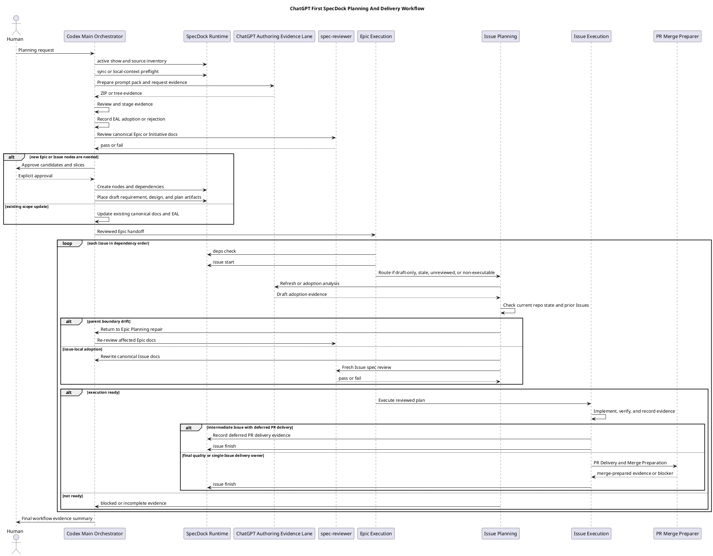
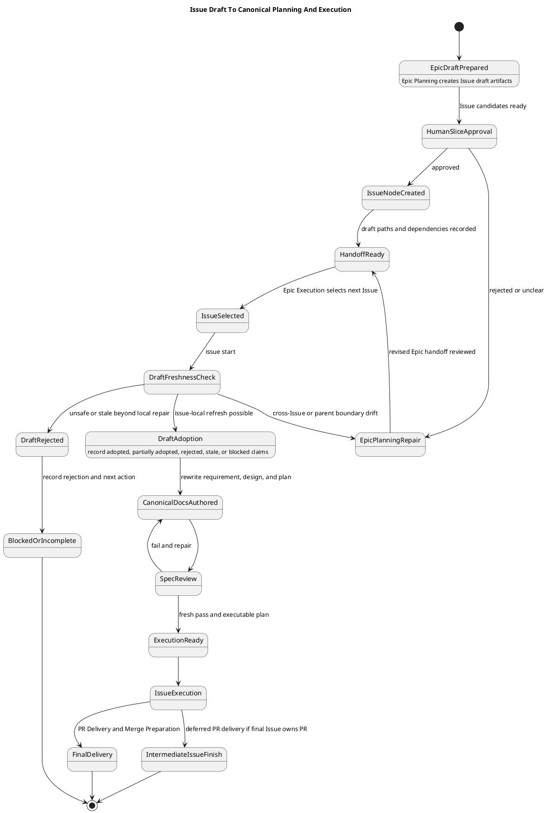

# 20260708t154900z-research ChatGPT First Issue Planning Timing And Epic Execution Workflow

## 位置づけ
- この artifact は、ChatGPT GPT-5.5 Pro Extended に依頼した workflow analysis の結果を、SpecDock の `iss-00309` 向けに採用判断しやすい形へ整理した research evidence である。
- ChatGPT の回答は advisory evidence であり、canonical authority ではない。
- canonical requirement / design / plan へ反映する場合は、`report.md` Evidence Adoption Ledger、canonical docs への再記述、必要な reviewer gate を通す。

## 調査目的
- ChatGPT-first planning workflow において、Issue Planning をいつ行うべきかを決める。
- Epic Planning、Issue Planning、Epic Execution、Issue Execution、final quality gate / PR delivery の責務境界を、実装時に迷わない粒度で言語化する。
- PlantUML で人間が追える workflow と lifecycle を表現する。

## ChatGPT への入力
- current branch:
  - `iss-00309-chatgpt-first-planning-skills-and-fallback-route-redesign`
- ChatGPT / Oracle session:
  - `specdock-issue-planning-timing`
- 添付した主な情報:
  - planning / execution / ChatGPT authoring skill files
  - Epic plan template
  - Epic / Issue / ChatGPT authoring workflow docs
  - `iss-00309` の既存 research / interview artifacts
- 主な前提:
  - ChatGPT-first が primary planning route。
  - `-manual` planning skills は human-approved emergency backup。
  - multi-Issue implementation Epic では final quality gate / PR delivery Issue が必須。
  - single-Issue / docs-only / no-op Epic は、skip rationale と completion evidence があれば final quality Issue を省略できる。

## 結論
- 採用すべき primary workflow は **Option 3+**。
- Option 3+ の意味:
  - Epic Planning では、Epic の正式 requirement / design / plan、Issue slicing、依存順、責務境界、各 Issue の draft requirement / draft design / draft plan、final quality gate / PR delivery Issue 方針までを作る。
  - ただし、各 Issue の canonical `requirement.md` / `design.md` / `plan.md` は Epic Planning 中に全件確定しない。
  - Epic Execution で各 Issue を `issue start` する直前、または直後の Issue Planning で、draft を current repository state、完了済み prior Issues、dependency state、未解決 ledger と照合し、採用 / 部分採用 / 棄却 / stale / blocked を判断して canonical docs へ正式化する。
  - Issue-local delta で吸収できない drift は、Issue Planning だけで処理せず Epic Planning repair / clarification / ADR へ戻す。

## 採用理由
- Option 1 の「Epic Planning 中に全 Issue Planning を正式完了する」方式は、実装直前の repository reality と先行 Issue の結果を反映しにくく、canonical Issue docs が stale になる。
- Option 2 の「Epic Planning は粗い Issue slice のみ、Issue Planning は各 Issue 直前にゼロから行う」方式は、cross-Issue consistency、dependency order、重複防止、Epic-level completeness が弱くなる。
- Option 3+ は、Epic 全体の整合性を Epic Planning で固定しつつ、Issue の正式仕様を実装直前に fresh 化できる。
- 現行 workflow も、Issue-local draft artifacts を evidence-only とし、canonical Issue docs は Issue Planning で採用・正式化する方向と整合している。

## 推奨ワークフロー

### Initiative Planning
- ChatGPT-first authoring:
  - Initiative requirement / design / plan、Epic candidates、分解案、比較案を evidence として生成する。
- Codex / SpecDock responsibility:
  - 既存 Initiative fit を確認する。
  - canonical Initiative docs へ再記述する。
  - EAL へ採否を記録する。
  - Epic candidate 作成前に人間承認を得る。
- gate:
  - fresh `spec-reviewer` pass。
  - Epic candidate / Epic node creation の human approval。

### Epic Planning
- ChatGPT-first authoring:
  - Epic requirement / design / plan。
  - Issue candidate list。
  - dependency order / tranche。
  - 各 Issue の draft requirement / draft design / draft plan。
  - final quality gate / PR delivery Issue candidate、または skip rationale。
- Codex / SpecDock responsibility:
  - Epic canonical docs を所有する。
  - Issue slicing と責務境界を確認する。
  - Issue draft artifacts の path index を作る。
  - Issue node 作成前に人間承認を得る。
- gate:
  - Epic R/D/P の fresh `spec-reviewer` pass。
  - Issue slice approval。
  - Issue node creation。
  - Issue-local draft artifacts 配置。

### Epic Execution
- ChatGPT-first authoring:
  - 原則として新規 authoring ではなく、必要時の stale draft refresh / drift analysis の evidence producer として使う。
- Codex / SpecDock responsibility:
  - reviewed Epic handoff と dependency order を読む。
  - `deps check` で次 Issue を一つだけ選ぶ。
  - `issue start` する。
  - Issue docs が draft-only / stale / unreviewed / non-executable なら Issue Planning へ戻す。
  - execution-ready なら Issue Execution へ渡す。
- gate:
  - dependency readiness。
  - active Issue guard。
  - handoff-ready と execution-ready の区別。

### Issue Planning
- ChatGPT-first authoring:
  - `zero-base`、`requirement-first`、`draft-adoption` の各 mode で primary evidence author として使う。
- Codex / SpecDock responsibility:
  - ChatGPT output と draft artifacts を evidence として採否判断する。
  - canonical `requirement.md` / `design.md` / `plan.md` を再記述する。
  - EAL、Spec Authoring Gate、fresh reviewer gate を通す。
- gate:
  - draft adoption matrix。
  - fresh `spec-reviewer` pass。
  - execution-ready handoff。

### Issue Execution
- ChatGPT-first authoring:
  - spec gap / review repair / difficult test strategy の分析補助として使えるが、execution-ready plan の代替にはしない。
- Codex / SpecDock responsibility:
  - reviewer-passed canonical docs と executable plan の範囲で実装する。
  - step evidence、review evidence、closure evidence を `report.md` に残す。
  - 中間 Issue では PR delivery を final quality Issue へ defer し、merge-prepared を主張しない。
- gate:
  - step reviewer gates。
  - S90 docs impact。
  - S99 final quality gate。
  - issue finish。

### Final Quality Gate / PR Delivery
- multi-Issue implementation Epic:
  - 末尾に final quality gate / PR delivery Issue を必須で作る。
  - 全 implementation Issues に依存する。
  - Epic-wide verification、manual test summary、review repair loop、PR Delivery Gate、Merge Preparation Gate を閉じる。
- single-Issue Epic:
  - 別の final quality Issue は不要。
  - その Issue の final quality gate が Epic gate を兼ねる。
- docs-only / no-op Epic:
  - skip rationale と completion evidence を Epic plan / report に残す。

## Issue Planning timing の決定

### 採用: Epic draft handoff + just-in-time canonical Issue Planning
- Epic Planning:
  - Issue を作成できるだけの十分な draft を全 Issue 分まとめて作る。
  - 各 Issue の canonical docs は確定しない。
- Issue Planning:
  - Issue Execution の直前に、draft を現在状態へ合わせて正式化する。
  - prior Issues の完了結果、変更された files、レビュー指摘、dependency state を反映する。
- Epic Execution:
  - 各 Issue を一つずつ進める。
  - Issue finish 後に次 Issue を start し、必要なら次 Issue Planning を行う。

### drift feedback rule
- Issue Planning で Issue-local に吸収してよい変更:
  - 実装対象 file の局所差分。
  - draft の表現修正。
  - acceptance seed の具体化。
  - test plan の具体化。
- Epic Planning repair / clarification / ADR へ戻す変更:
  - Issue 間責務境界が変わる。
  - dependency order が変わる。
  - final quality Issue の位置や責務が変わる。
  - sibling Issue の draft / acceptance seed が stale になる。
  - Epic E-RQ / E-AC の閉じ方が変わる。
  - shared architecture / workflow policy / rollout strategy が変わる。

## Issue Planning mode

### zero-base
- 入力:
  - user discussion、repo facts、parent context、関連 ADR / artifacts。
- 出力:
  - canonical `requirement.md`
  - canonical `design.md`
  - canonical executable `plan.md`
  - EAL / Spec Authoring Gate
  - Issue grade / verification strategy / reviewer focus
  - fresh `spec-reviewer` pass

### requirement-first
- 入力:
  - 人間または上流で作成済みの requirement。
- 出力:
  - requirement freshness check。
  - canonical `design.md`
  - canonical executable `plan.md`
  - requirement gap があれば requirement phase へ rollback。
  - fresh reviewer pass。

### draft-adoption
- 入力:
  - Epic Planning で作成された draft requirement / draft design / draft plan。
  - Epic handoff package。
  - prior Issue completion evidence。
  - current repository state。
- 出力:
  - draft adoption matrix。
  - canonical `requirement.md` / `design.md` / `plan.md`。
  - draft と canonical docs の差分理由。
  - Issue-local delta と Epic-level repair の分離。
  - fresh reviewer pass。

## Human Approval Gates
- Initiative Planning:
  - Epic candidates / Epic node creation 前。
- Epic Planning:
  - Issue slices / Issue node creation 前。
- Manual backup:
  - ChatGPT / browser / automation failure が hard / unrecoverable で、人間が明示承認した場合だけ。
- Scope expansion:
  - Issue Planning 中に parent boundary、sibling Issue、dependency order、final quality policy が変わる場合。
- Waiver / risk acceptance:
  - reviewer unavailable / denied / waiver は pass ではないため、進める場合は明示的 risk acceptance が必要。

## Skill Design Implications
- primary skills:
  - `spec-dock-initiative-planning`
  - `spec-dock-epic-planning`
  - `spec-dock-issue-planning`
- primary skills の Operating Spine:
  - 非 trivial planning では ChatGPT authoring pack を primary evidence route として先に使う。
  - ただし canonical adoption、reviewer gate、human gate は planning skill が所有する。
- manual backup skills:
  - `spec-dock-initiative-planning-manual`
  - `spec-dock-epic-planning-manual`
  - `spec-dock-issue-planning-manual`
  - description に human-approved emergency backup であることを明記する。
- `spec-dock-chatgpt-authoring`:
  - shared evidence lane のままにする。
  - canonical docs、reviewer gates、assurance state、execution readiness、PR delivery は所有しない。

## Template / Docs Implications

### Epic plan template
- 追加または強化するべき section:
  - Epic classification:
    - multi-Issue implementation / single-Issue / docs-only / no-op
  - final quality Issue:
    - required / skipped
  - required の場合:
    - Issue id
    - tranche: final
    - depends_on: all implementation Issues
    - responsibilities:
      - Epic-wide verification
      - reviewer repair loop
      - manual test summary
      - PR Delivery Gate
      - Merge Preparation Gate
    - intermediate Issue PR policy:
      - deferred PR delivery gate required
  - skipped の場合:
    - skip rationale
    - completion evidence
    - single-Issue gate owner

### `phase_plan_epic.md`
- Epic Planning checklist に追加するべきこと:
  - multi-Issue implementation Epic では final quality Issue が Issue list に存在する。
  - final quality Issue が全 implementation Issues に依存する。
  - single-Issue / docs-only / no-op skip rationale がある。
  - intermediate Issues の deferred PR delivery policy が明記されている。
  - final quality Issue は deferred PR delivery gate を使わず、通常 PR Delivery / Merge Preparation Gate を通す。

### `workflow_epic.md`
- Epic Planning stage の required handoff として、Issue drafts、Issue-local path index、final quality Issue policy を明文化する。
- Epic Execution stage では、中間 Issue が final quality Issue id、dependency edge、no-per-Issue-PR rationale、local completion evidence を `report.md` に残すことを明確化する。

### `workflow_issue.md`
- draft lifecycle を明文化する:
  - `unreviewed`
  - `adopted`
  - `partially_adopted`
  - `rejected`
  - `stale`
  - `blocked`
  - `superseded`
- execution-ready rule:
  - draft-only、validation-only、raw ChatGPT output では実装開始不可。

## PlantUML: End-to-End Workflow

## PlantUML: Issue Draft To Execution Lifecycle

## Rejected Alternatives

### Option 1: Epic Planning で全 Issue Planning を正式完了する
- 不採用。
- canonical Issue docs が実装直前に stale になりやすい。
- 先行 Issue の実装結果、レビュー指摘、ファイル変更、dependency drift を反映しにくい。
- 現行 workflow の「pre-start canonical Issue design / plan は本文化せず Issue Planning で正式化する」境界と衝突する。

### Option 2: Epic Planning は粗い Issue slice のみ、Issue Planning は各 Issue 直前に scratch
- 不採用。
- Issue 間の責務境界、重複防止、dependency order、Epic-level completeness が弱くなる。
- Epic Planning が持つべき integration checkpoint、readiness contract、final exit contract が不足する。

### Automatic fallback to manual route
- 不採用。
- ChatGPT / browser / capacity failure は wait / retry / recover が先。
- `-manual` route は hard / unrecoverable failure 後の human-approved emergency backup に限定する。

### 全 Epic に final quality Issue を必須化する
- 不採用。
- multi-Issue implementation Epic では必須。
- single-Issue Epic では、その Issue の final quality gate が Epic-level gate を兼ねる。
- docs-only / no-op Epic では、skip rationale と completion evidence があれば separate final quality Issue は過剰。

## 採用候補
- `requirement.md`:
  - ChatGPT-first workflow における draft handoff と just-in-time canonical Issue Planning を必須要求として追加する。
- `design.md`:
  - Epic Planning、Issue Planning、Epic Execution、Issue Execution、final quality Issue の責務境界を Option 3+ として表現する。
- `plan.md`:
  - skill separation、template update、workflow docs update、validation/test strategy を実装ステップ化する。
- `src/spec_dock/assets/spec_dock/templates/epic/plan.md`:
  - final quality Issue policy と skip rationale を強化する。
- `src/spec_dock/assets/spec_dock/docs/phase_plan_epic.md`:
  - Issue drafts と final quality Issue policy を Epic Planning checklist に追加する。
- `src/spec_dock/assets/spec_dock/docs/workflow_epic.md`:
  - Epic Execution が JIT Issue Planning を呼び出す条件と、deferred PR delivery policy を強化する。
- `src/spec_dock/assets/spec_dock/docs/workflow_issue.md`:
  - draft-adoption lifecycle と execution-ready rule を強化する。

## 未検証事項
- この artifact は workflow analysis であり、コード変更・template 変更・skill 変更はまだ行っていない。
- PlantUML の構文は別途 `plantuml` で確認する。
- provider assets と dogfooding workspace の同期は、実装フェーズで別途検証する。
