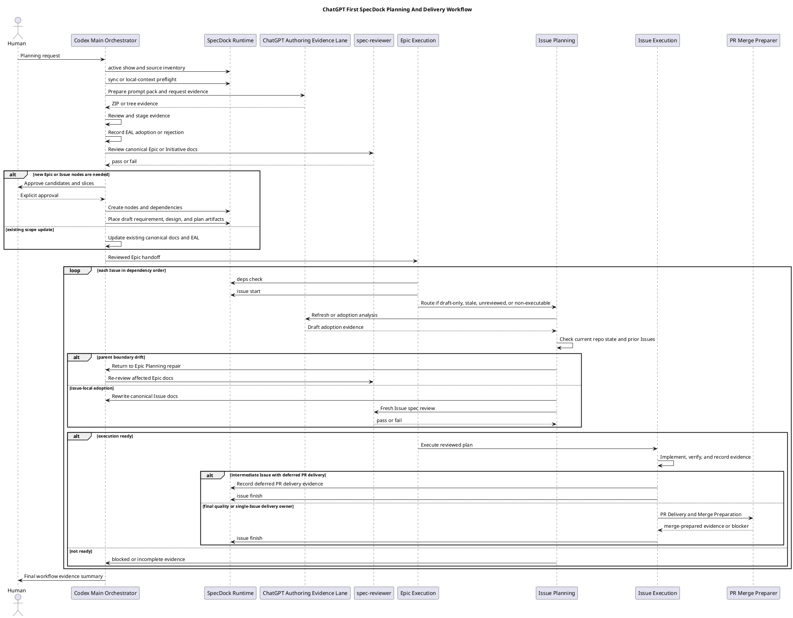
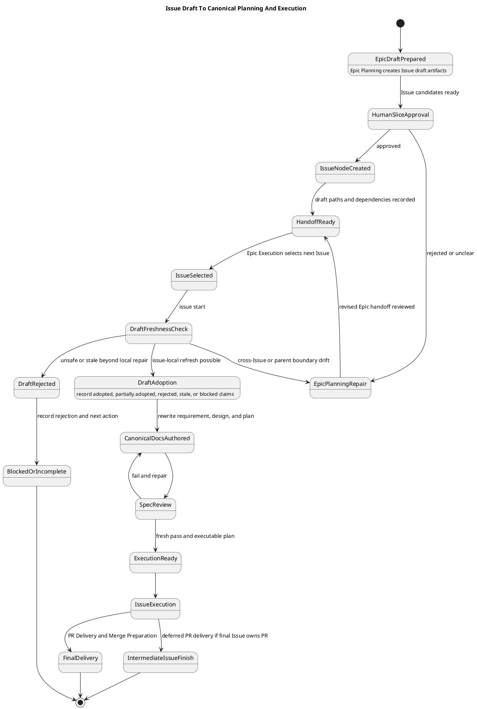

# 20260708t161533z-adr ChatGPT First Option 3 Plus Issue Planning Workflow

## 位置づけ
- 用途: ChatGPT-first planning workflow における Issue Planning timing と、Epic Planning / Epic Execution / Issue Planning / Issue Execution の責務境界を固定する。
- この ADR は `iss-00309` の accepted decision であり、後続の `requirement.md` / `design.md` / `plan.md`、provider-side skill docs、workflow docs、templates へ反映する。
- この ADR は research artifact をそのまま昇格するものではない。ChatGPT GPT-5.5 Pro Extended の分析、ユーザー判断、SpecDock の既存 workflow source を統合した decision record である。

## ADR 化基準 (必須)
- hard to reverse:
  - yes
- surprising without context:
  - yes
- real tradeoff:
  - yes
- ADR 化しない場合の反映先:
  - `requirement.md`
  - `design.md`
  - `plan.md`
- ADR として残す理由:
  - Issue Planning を Epic Planning 中に全件正式化するか、Issue Execution 直前に正式化するかは、SpecDock の planning / execution workflow 全体、skill responsibility、template contract、reviewer gate、PR delivery policy に影響する。
  - 後から文脈なしで見ると「Epic Planning で draft まで作るが canonical Issue docs は作らない」という設計は意外性がある。
  - stale planning と cross-Issue 不整合のどちらを避けるかという実質的 tradeoff がある。

## 結論（Decision） (必須)
- **Option 3+ を正式採用する。**
- Epic Planning は次を作成する:
  - Epic の canonical `requirement.md` / `design.md` / `plan.md`。
  - Issue slicing。
  - dependency order / tranche。
  - Issue 間の responsibility boundary。
  - 各 Issue の draft requirement / draft design / draft plan。
  - multi-Issue implementation Epic の final quality gate / PR delivery Issue candidate、または single-Issue / docs-only / no-op Epic の skip rationale。
- Epic Planning は、各 Issue の canonical `requirement.md` / `design.md` / `plan.md` を全件正式化しない。
- canonical Issue Planning は、Epic Execution 中に各 Issue を `issue start` する直前または直後に行う。
- Issue Planning は、Epic Planning で作成された draft artifacts を current repository state、prior completed Issues、dependency state、unresolved ledger と照合し、adopted / partially adopted / rejected / stale / blocked を判断して canonical Issue docs へ正式化する。
- Issue-local に吸収できない drift は Issue Planning 内で勝手に処理せず、Epic Planning repair / clarification / ADR へ戻す。
- ChatGPT output は evidence-only であり、canonical adoption、fresh reviewer pass、execution-ready、PR-ready、merge-ready を主張できない。

## 背景（Context） (必須)
- 背景/制約（なぜ今決める必要があるか）:
  - `iss-00309` では、planning skills を ChatGPT-first primary route として再設計し、従来 planning route を `-manual` suffix の human-approved emergency backup として分離する。
  - ChatGPT GPT-5.5 Pro Extended は大きな planning batch と ZIP/tree output に向くが、出力は証拠であり、SpecDock の canonical docs / reviewer gates / execution readiness を直接所有しない。
  - Epic Planning で全 Issue の正式計画まで確定すると、実装直前の repository reality や先行 Issue の結果に対して stale になりやすい。
  - Issue Planning を各 Issue 直前にゼロから行うと、cross-Issue consistency、dependency order、重複防止、Epic-level completeness が弱くなる。
- 前提:
  - ChatGPT-first が primary planning route。
  - `-manual` planning skills は human-approved emergency backup。
  - ChatGPT / browser capacity failure では wait / retry / recover を優先し、自動 manual fallback はしない。
  - multi-Issue implementation Epic では final quality gate / PR delivery Issue を必須にする。
  - single-Issue / docs-only / no-op Epic では、skip rationale と completion evidence があれば final quality Issue を省略できる。

### End-to-end workflow

## 選択肢（Options considered） (必須)
- 選択肢 A（Option 1）:
  - 概要:
    - Epic Planning が、全 child Issue の canonical `requirement.md` / `design.md` / `plan.md` まで upfront に正式化する。
  - 良い点（Pros）:
    - Epic Planning 完了時点で全 Issue の詳細が揃う。
    - 実装前の見通しは最も詳細になる。
  - 悪い点 / 制約（Cons）:
    - 実装直前の repository reality、prior Issue の変更、reviewer finding、dependency drift を反映しにくい。
    - 先に固めた canonical Issue docs が stale になりやすい。
  - 棄却理由:
    - stale canonical docs を生みやすく、SpecDock の execution-ready / fresh reviewer gate の考え方と相性が悪い。
- 選択肢 B（Option 2）:
  - 概要:
    - Epic Planning は coarse Issue slices のみを作り、各 Issue Planning は Issue Execution 直前にゼロから行う。
  - 良い点（Pros）:
    - 各 Issue Planning は最新 repository state に強く追従できる。
    - upfront planning の負荷が小さい。
  - 悪い点 / 制約（Cons）:
    - cross-Issue consistency、dependency order、重複防止、Epic-level completeness が弱くなる。
    - Issue ごとの planning が局所最適化し、Epic としての integration checkpoint / final exit contract が崩れる可能性がある。
  - 棄却理由:
    - Epic Planning が担うべき Issue slicing と handoff package の責務が不足する。
- 選択肢 C（Option 3+）:
  - 概要:
    - Epic Planning は全 Issue の draft requirement / draft design / draft plan と dependency / boundary を作り、canonical Issue Planning は Issue Execution 直前に draft-adoption / refresh として行う。
  - 良い点（Pros）:
    - Epic-level consistency と Issue-level freshness を両立できる。
    - ChatGPT の長時間推論と ZIP/tree output を、Epic-scale draft handoff として最大限活用できる。
    - Codex / SpecDock は canonical adoption、reviewer gate、execution readiness を保持できる。
  - 悪い点 / 制約（Cons）:
    - draft と canonical docs の二段階 lifecycle を skill / docs / templates に明確化する必要がある。
    - drift feedback rule が曖昧だと、Issue Planning が parent boundary を勝手に再定義するリスクがある。
  - 採用理由:
    - stale planning と cross-Issue inconsistency の両リスクを最も小さくできる。

### Issue draft lifecycle

## 判断理由（Rationale） (必須)
- ChatGPT-first workflow の強みは、大きな Epic scope をまとめて分析し、Issue draft package と dependency / boundary を一括生成できる点にある。
- 一方で、ChatGPT output は evidence-only であり、実装直前の repository state と fresh reviewer pass を置き換えない。
- Epic Planning は cross-Issue consistency を固定し、Issue Planning は execution-ready の直前で canonical docs を fresh 化する責務を持つ。
- Issue-local に閉じない drift を Epic Planning repair / clarification / ADR へ戻すことで、Issue Planning が parent boundary を局所判断で変える事故を防ぐ。
- final quality gate / PR delivery Issue は multi-Issue implementation Epic の末尾に置き、中間 Issue は PR delivery を defer する。single-Issue Epic では、その Issue の quality gate が Epic quality gate を兼ねる。

## 影響（Consequences） (必須)
- 良い影響（Positive）:
  - Epic-level consistency と Issue-level freshness を両立できる。
  - ChatGPT の長時間推論 / ZIP output を、Epic Planning の draft handoff package として活用できる。
  - Codex / SpecDock の canonical adoption、reviewer gate、execution readiness、PR delivery responsibility が曖昧にならない。
  - multi-Issue Epic の PR delivery と review repair loop を final quality Issue に集約できる。
- 悪い影響 / 将来負債（Negative / Debt）:
  - draft artifacts と canonical Issue docs の二段階 lifecycle が増える。
  - skill / docs / templates が二段階 workflow を明示しないと、old workflow と ChatGPT-first workflow が混線する。
  - PlantUML workflow 図と narrative docs を更新しないと、将来の agent が Option 1 または Option 2 に戻す可能性がある。
- 影響範囲（コード/テスト/運用/データ）:
  - `src/spec_dock/assets/install_root/.agents/skills/spec-dock-initiative-planning/SKILL.md`
  - `src/spec_dock/assets/install_root/.agents/skills/spec-dock-epic-planning/SKILL.md`
  - `src/spec_dock/assets/install_root/.agents/skills/spec-dock-issue-planning/SKILL.md`
  - `src/spec_dock/assets/install_root/.agents/skills/spec-dock-epic-execution/SKILL.md`
  - `src/spec_dock/assets/install_root/.agents/skills/spec-dock-issue-execution/SKILL.md`
  - `src/spec_dock/assets/install_root/.agents/skills/spec-dock-chatgpt-authoring/SKILL.md`
  - `src/spec_dock/assets/spec_dock/docs/workflow_epic.md`
  - `src/spec_dock/assets/spec_dock/docs/workflow_issue.md`
  - `src/spec_dock/assets/spec_dock/docs/workflow_chatgpt_authoring_pack.md`
  - `src/spec_dock/assets/spec_dock/docs/phase_plan_epic.md`
  - `src/spec_dock/assets/spec_dock/templates/epic/plan.md`
  - related tests for shipped assets / scaffold content / workflow docs where available.
- 移行/ロールバック:
  - 移行は provider assets を source of truth として更新し、dogfooding workspace で確認する。
  - ロールバックする場合は、この ADR を superseded にし、primary skill operating spine と Epic plan template の Option 3+ wording を戻す。
- 追加対応（Follow-ups / Epic / Issue / ADR）:
  - `requirement.md` / `design.md` / `plan.md` にこの ADR を反映する。
  - workflow docs に End-to-end workflow と Issue draft lifecycle の PlantUML 図を取り込む。
  - Epic plan template に final quality Issue policy、skip rationale、Issue draft path index、pre-start canonical boundary を強化する。
  - planning / execution skills に Option 3+ の operating spine と manual backup boundary を明示する。
  - `-manual` planning skills は human-approved emergency backup として分離する。

## 今後のインタビュー要否
- 現時点で、Option 3+ の採用判断そのものについて追加インタビューは不要。
- 後続実装時に確認が必要になり得るのは、方針判断ではなく実装粒度の確認である:
  - workflow 図をどの docs に重複配置せず置くか。
  - skill descriptions にどこまで図への導線を置くか。
  - existing Epics へ retroactive に Option 3+ を適用するか、今後の planning から適用するか。
- ただし現時点では、まず `iss-00309` の要件 / 設計 / 計画へこの ADR を反映すればよい。

## 参考（References） (任意)
- 関連仕様（requirement/design/plan/report）:
  - `report.md`
- 元になった artifacts（derived_from）:
  - `artifacts/20260708t154900z-research-chatgpt-first-issue-planning-timing-and-epic-execution-workflow.md`
  - `artifacts/20260708t152452z-interview-final-quality-gate-issue-scope-interview.md`
  - `artifacts/20260708t152310z-research-workflow-simulation-and-final-quality-gate-issue-analysis.md`
- 反映先（reflected_to）:
  - `report.md`
  - future `requirement.md`
  - future `design.md`
  - future `plan.md`
  - future provider-side workflow docs / skills / templates
- PR/実装:
  - 未作成
- 外部資料:
  - ChatGPT GPT-5.5 Pro Extended / Oracle session: `specdock-issue-planning-timing`
