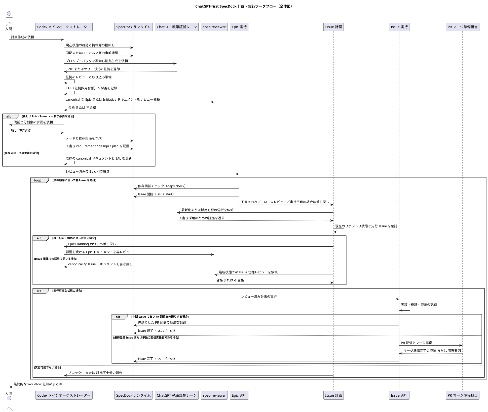
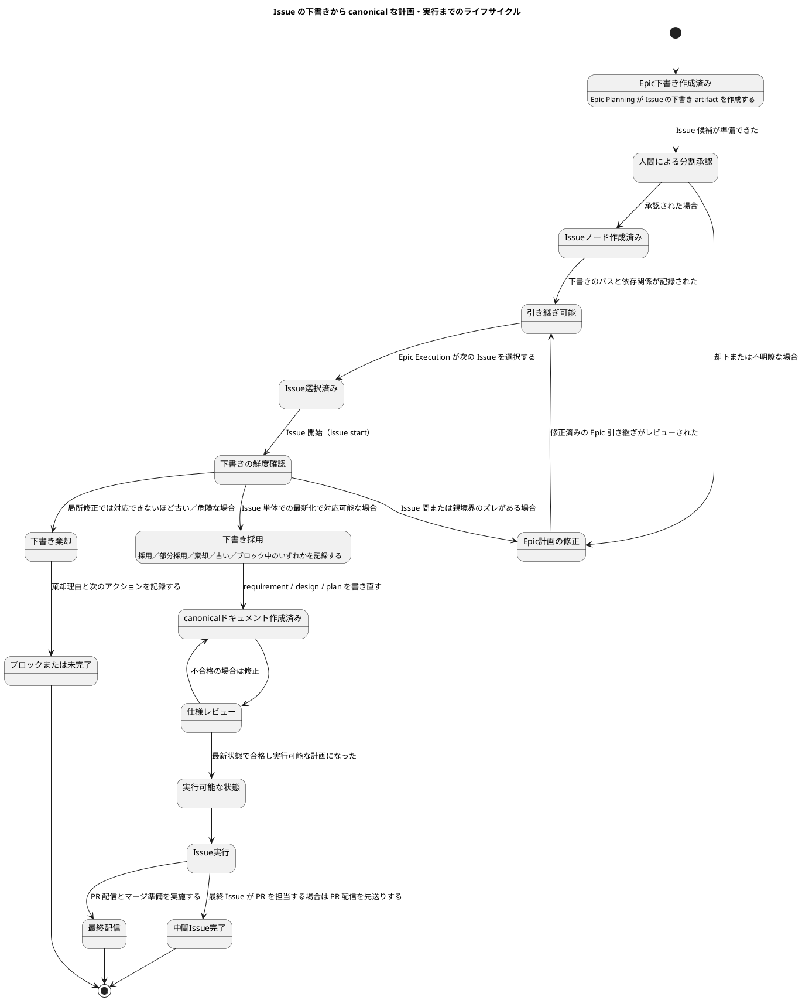

# ChatGPT First Issue Planning Workflow 解説資料（人間可読版）

> この資料は、`20260708t154900z-research-chatgpt-first-issue-planning-timing-and-epic-execution-workflow.md`（以下「元 research」）の内容を、**新しくチームに加わったメンバーでも読み解けるように**、構成・見出し・図解を整理し直したものです。
> 内容の要約・省略は行っていません。元 research に書かれているすべての判断・理由・仕様は、この資料の中にそのまま含まれています。
> 元 research は evidence（調査結果）であり、canonical な仕様ではありません。この資料もあくまで「元 research を読みやすくしたもの」であり、権威（authority）としての位置づけは元 research と同じ `synthesized`（人間による判断を経て採用されるべき参考資料）です。

---

## 1. この資料は何を決めようとしているのか

SpecDock は「ChatGPT-first」という考え方で計画（Planning）を進めています。これは、

- Initiative（構想）
- Epic（大きな塊のタスク）
- Issue（実際に手を動かして実装する単位）

といった各段階の計画を作るとき、**まず ChatGPT（GPT-5.5 Pro Extended など）に下書きを作らせ、それを人間・Codex 側が検証・採用して正式なドキュメントにする**という進め方です。

この元 research が答えようとした問いは、次の1つに集約されます。

> **「Issue Planning（Issue ごとの正式な要件・設計・計画を確定する作業）は、いつ行うのが正しいのか？」**

これを決めるために、ChatGPT に対して次の3つを依頼しました。

1. Issue Planning を行うタイミングの決定
2. Epic Planning → Issue Planning → Epic Execution → Issue Execution → 最終品質ゲート/PR配信、という各段階の「責務の境界線」を、実装時に迷わない粒度で言語化すること
3. 人間が目で追える workflow / lifecycle 図（PlantUML）を作ること

---

## 2. 調査の前提（ChatGPT に与えた情報）

ChatGPT にこの分析を依頼する際、以下を入力として渡しています。

- **作業ブランチ**: `iss-00309-chatgpt-first-planning-skills-and-fallback-route-redesign`
- **ChatGPT / Oracle セッション名**: `specdock-issue-planning-timing`
- **添付した主な情報**
  - planning / execution / ChatGPT authoring の各 skill ファイル
  - Epic plan のテンプレート
  - Epic / Issue / ChatGPT authoring の workflow ドキュメント群
  - `iss-00309` に既に存在する research / interview の artifact

さらに、以下を「動かせない前提条件」として ChatGPT に伝えています。

| 前提 | 内容 |
|---|---|
| ChatGPT-first が primary | 計画作成の主経路は ChatGPT による下書き作成である |
| `-manual` skill は非常用 | 人間が明示的に承認した場合の緊急バックアップに限定する |
| final quality gate の必須化 | 複数 Issue を持つ実装系 Epic では、最後に「最終品質ゲート／PR配信」専用の Issue が必須である |
| final quality Issue の省略条件 | Issue が1つしかない Epic、ドキュメントのみの Epic、何も変更しない（no-op）Epic では、省略理由（skip rationale）と完了証跡（completion evidence）があれば省略してよい |

---

## 3. 結論：採用する方式は「Option 3+」

ChatGPT は3つの選択肢（Option 1〜3）を比較検討し、それを発展させた **Option 3+** を推奨しました。SpecDock はこの Option 3+ を採用します。

### Option 3+ とは何か

一言で言うと、**「Epic 全体の一貫性は Epic Planning で先に固めるが、各 Issue の“正式版”ドキュメントは、その Issue に着手する直前に最新化してから確定する」**という方式です。

具体的には：

1. **Epic Planning** の段階で、以下をまとめて作成する。
   - Epic 自体の正式な requirement（要件）／design（設計）／plan（計画）
   - Issue への分割（Issue slicing）
   - Issue 間の依存順序
   - 各 Issue の責務境界
   - 各 Issue の **下書き**（draft）requirement / design / plan
   - 最終品質ゲート／PR配信用 Issue をどう扱うかの方針
2. ただし、この時点では **各 Issue の canonical（正式版）な `requirement.md` / `design.md` / `plan.md` は全部を確定させない**。
3. **Epic Execution** で、ある Issue に `issue start` する直前・直後のタイミングで、**Issue Planning** を実施する。
   - このとき、Epic Planning で作った下書きを、
     - 現在のリポジトリの状態
     - すでに完了した先行 Issue の結果
     - 依存関係の状態
     - まだ解決していない懸念事項（ledger）
   と照らし合わせて、「採用する／部分的に採用する／棄却する／古くなっている（stale）／ブロックされている」のいずれかを判断し、canonical なドキュメントとして正式化する。
4. Issue 単体の差分では吸収しきれないような「ズレ」（drift）が見つかった場合は、その場（Issue Planning）で処理せず、**Epic Planning まで差し戻して**修正・明確化・ADR（決定記録）を行う。

### なぜこの方式を選んだのか（他の選択肢との比較）

| 選択肢 | 内容 | 採否 | 理由 |
|---|---|---|---|
| **Option 1** | Epic Planning の段階で、すべての Issue の Issue Planning まで正式に完了させてしまう | 不採用 | 実装直前になると、リポジトリの実際の状態や先行 Issue の実装結果が反映されておらず、Issue の正式ドキュメントが「古い（stale）」ものになりやすい |
| **Option 2** | Epic Planning では粗い Issue の分割だけを行い、Issue Planning は各 Issue に着手する直前にゼロから作る | 不採用 | Issue 同士の責務の切り分け、重複防止、依存順序、Epic 全体としての網羅性（completeness）が弱くなってしまう |
| **Option 3+（採用）** | Epic 全体の整合性は Epic Planning で固定しつつ、各 Issue の正式仕様は実装直前に最新化する | **採用** | 両方の長所を両立できる。Epic レベルの一貫性を保ちながら、実装直前の現実に即した正式仕様を作れる |

さらに、現行の SpecDock workflow もすでに「Issue 単位の下書き artifact はあくまで evidence（証拠）として扱い、canonical な Issue ドキュメントは Issue Planning の段階で正式に採用する」という方向性を持っており、Option 3+ はこの既存方針と整合しています。

---

## 4. 推奨ワークフロー：各段階の役割分担

ここからは、Initiative → Epic → Issue という各階層で、「ChatGPT が何をするか」と「Codex / SpecDock（人間側の運用）が何をするか」を、段階ごとに整理します。

### 4-1. Initiative Planning（構想段階の計画）

| 主体 | 役割 |
|---|---|
| **ChatGPT-first authoring** | Initiative の requirement / design / plan、Epic の候補、分解案、比較案を「証拠（evidence）」として生成する |
| **Codex / SpecDock** | 既存の Initiative との整合性を確認し、canonical な Initiative ドキュメントとして書き直す。Evidence Adoption Ledger（EAL、採否記録）に記録する。Epic 候補を作る前に人間の承認を得る |

**ゲート（通過条件）**
- 最新状態での `spec-reviewer` によるレビュー通過
- Epic 候補・Epic ノード作成に対する人間の承認

### 4-2. Epic Planning（Epicレベルの計画）

| 主体 | 役割 |
|---|---|
| **ChatGPT-first authoring** | Epic の requirement / design / plan、Issue 候補一覧、依存順序・tranche（実行の束）、各 Issue の下書き requirement / design / plan、最終品質ゲート/PR配信用 Issue の候補（またはその省略理由） |
| **Codex / SpecDock** | Epic の canonical ドキュメントを所有する。Issue の分割と責務境界を確認する。Issue の下書き artifact への path index（参照先一覧）を作る。Issue ノードを作る前に人間の承認を得る |

**ゲート**
- Epic の requirement/design/plan に対する最新状態での `spec-reviewer` レビュー通過
- Issue 分割の承認
- Issue ノードの作成
- Issue 単位の下書き artifact の配置

### 4-3. Epic Execution（Epicの実行段階）

| 主体 | 役割 |
|---|---|
| **ChatGPT-first authoring** | 原則として新規の文書作成には使わない。古くなった下書きの更新（refresh）やズレの分析（drift analysis）が必要なときの、証拠生成役として使う |
| **Codex / SpecDock** | レビュー済みの Epic handoff（引き継ぎ内容）と依存順序を読む。`deps check` で次に着手する Issue を1つだけ選ぶ。`issue start` する。Issue のドキュメントが「下書きのまま」「古い」「未レビュー」「実行不可能」であれば Issue Planning に差し戻す。実行可能な状態（execution-ready）であれば Issue Execution に引き渡す |

**ゲート**
- 依存関係が満たされているか（dependency readiness）
- 同時に進行中の Issue が1つに限定されているか（active Issue guard）
- 「引き継ぎ可能（handoff-ready）」と「実行可能（execution-ready）」の区別が明確か

### 4-4. Issue Planning（Issueレベルの計画）

Issue Planning には3つの「モード」があります（詳細は5章）。

| 主体 | 役割 |
|---|---|
| **ChatGPT-first authoring** | `zero-base`（ゼロから作成）、`requirement-first`（要件先行）、`draft-adoption`（下書き採用）の各モードで、一次的な証拠作成者として使う |
| **Codex / SpecDock** | ChatGPT の出力と下書き artifact を証拠として、採用するかどうかを判断する。canonical な `requirement.md` / `design.md` / `plan.md` を書き直す。EAL、Spec Authoring Gate、最新状態での reviewer ゲートを通す |

**ゲート**
- 下書き採用マトリクス（draft adoption matrix）の作成
- 最新状態での `spec-reviewer` レビュー通過
- 実行可能な状態としての引き継ぎ（execution-ready handoff）

### 4-5. Issue Execution（Issueの実行段階）

| 主体 | 役割 |
|---|---|
| **ChatGPT-first authoring** | 仕様の抜け漏れ分析、レビュー指摘への対応分析、難しいテスト戦略の検討補助には使えるが、実行可能な計画（execution-ready plan）そのものの代わりにはしない |
| **Codex / SpecDock** | レビューを通過した canonical ドキュメントと実行可能な計画の範囲内で実装する。各ステップの証跡、レビューの証跡、クローズ（完了）の証跡を `report.md` に残す。中間 Issue では PR 配信を最終品質 Issue に先送り（defer）し、「マージ準備完了」を主張しない |

**ゲート**
- 各実装ステップでの reviewer ゲート
- S90（ドキュメントへの影響確認）
- S99（最終品質ゲート）
- issue finish（Issue の完了処理）

### 4-6. 最終品質ゲート／PR配信（Final Quality Gate / PR Delivery）

Epic の性質によって、扱いが変わります。

| Epic の種類 | 扱い |
|---|---|
| **複数 Issue を持つ実装系 Epic** | 末尾に「最終品質ゲート／PR配信」専用の Issue を**必須で**作る。この Issue はすべての実装系 Issue に依存する。Epic 全体の検証、手動テストのまとめ、レビュー指摘への対応ループ、PR配信ゲート、マージ準備ゲートをこの Issue で完了させる |
| **Issue が1つしかない Epic** | 別途の最終品質 Issue は不要。その唯一の Issue が持つ最終品質ゲートが、そのまま Epic 全体のゲートを兼ねる |
| **ドキュメントのみ／no-op（実質変更なし）の Epic** | Epic の plan や report に、省略理由（skip rationale）と完了証跡（completion evidence）を残せば、最終品質 Issue は不要 |

---

## 5. Issue Planning のタイミングをどう決めたか（詳細）

### 5-1. 採用する方式：「Epic 下書き引き渡し + Just-In-Time（直前）の正式化」

- **Epic Planning の段階**では、Issue を作成できるだけの十分な下書きを、**全 Issue 分まとめて**作成する。ただし、各 Issue の canonical ドキュメントはこの時点ではまだ確定させない。
- **Issue Planning の段階**（＝各 Issue の実行直前）で、下書きを現在の状態に合わせて正式なものにする。具体的には、先行 Issue の完了結果、変更されたファイル、レビューでの指摘、依存関係の状態を反映する。
- **Epic Execution の段階**では、各 Issue を1つずつ順番に進める。ある Issue が完了（finish）したら、次の Issue を開始（start）し、必要であれば次の Issue Planning を実行する。

### 5-2. 「ズレ（drift）」をどこで吸収するかのルール

Issue Planning の中で、Issue 単位の変更として吸収してよいものと、Epic Planning まで差し戻すべきものを明確に切り分けています。

**✅ Issue Planning の中で、Issue 単体として吸収してよい変更**
- 実装対象ファイルの局所的な差分
- 下書きの表現の修正
- 受け入れ基準（acceptance seed）の具体化
- テスト計画の具体化

**⚠️ Epic Planning の修正・明確化・ADR（決定記録）まで差し戻すべき変更**
- Issue 同士の責務境界が変わってしまう場合
- 依存関係の順序が変わってしまう場合
- 最終品質 Issue の位置づけや責務が変わってしまう場合
- 兄弟にあたる Issue の下書きや受け入れ基準が古くなって使えなくなってしまう場合（stale）
- Epic レベルの要件（E-RQ）や受け入れ基準（E-AC）の閉じ方が変わってしまう場合
- 共有されているアーキテクチャ、workflow のポリシー、ロールアウト戦略が変わってしまう場合

この切り分けにより、「Issue Planning が本来担うべきでない、Epic 全体に関わる判断」を Issue Planning の中で勝手に処理してしまう事故を防いでいます。

---

## 6. Issue Planning の3つのモード

Issue Planning には、入力される情報の種類によって3つのモードがあります。

### 6-1. `zero-base`（ゼロベース）

何もない状態から、Issue の仕様を新規に作るモードです。

- **入力**: ユーザーとの議論内容、リポジトリの事実、親（parent）の文脈、関連する ADR / artifact
- **出力**:
  - canonical な `requirement.md`
  - canonical な `design.md`
  - canonical な実行可能な `plan.md`
  - EAL（証拠採用台帳）／Spec Authoring Gate
  - Issue の等級（grade）／検証戦略／レビュー観点
  - 最新状態での `spec-reviewer` レビュー通過

### 6-2. `requirement-first`（要件先行）

要件だけがすでに人間または上流の工程で作られている場合のモードです。

- **入力**: 人間または上流で作成済みの requirement（要件）
- **出力**:
  - requirement の鮮度確認（古くなっていないかのチェック）
  - canonical な `design.md`
  - canonical な実行可能な `plan.md`
  - requirement に抜け漏れ（gap）があれば、requirement を作り直すフェーズへ差し戻す
  - 最新状態での reviewer レビュー通過

### 6-3. `draft-adoption`（下書き採用）

Epic Planning ですでに作られている下書きを、正式なものに引き上げるモードです。**Option 3+ の中核となるモード**です。

- **入力**:
  - Epic Planning で作成された下書き requirement / design / plan
  - Epic の handoff package（引き継ぎ一式）
  - 先行 Issue の完了証跡
  - 現在のリポジトリの状態
- **出力**:
  - 下書き採用マトリクス（draft adoption matrix）
  - canonical な `requirement.md` / `design.md` / `plan.md`
  - 下書きと canonical ドキュメントとの差分理由
  - 「Issue 単体で吸収すべき差分」と「Epic レベルの修正が必要な差分」の切り分け
  - 最新状態での reviewer レビュー通過

---

## 7. 人間の承認が必要になるタイミング（Human Approval Gates）

以下のタイミングでは、ChatGPT の出力をそのまま採用せず、**人間による明示的な承認**が必要です。

| タイミング | 内容 |
|---|---|
| **Initiative Planning** | Epic の候補・Epic ノードを作成する前 |
| **Epic Planning** | Issue の分割・Issue ノードを作成する前 |
| **手動バックアップの発動** | ChatGPT／ブラウザ／自動化ツールに、待機・再試行・復旧では解決できない致命的な障害が発生し、人間が明示的に承認した場合のみ |
| **スコープの拡大** | Issue Planning の途中で、親の境界、兄弟 Issue、依存順序、最終品質ポリシーが変わってしまう場合 |
| **免責事項／リスク受容** | レビュー担当者が不在／レビューが却下された／waiver（免除）が出された場合、それは「合格」を意味しないため、それでも先に進める場合は明示的なリスク受容が必要 |

---

## 8. Skill（実行単位）の設計への影響

### 8-1. 主要な（primary）skill

- `spec-dock-initiative-planning`
- `spec-dock-epic-planning`
- `spec-dock-issue-planning`

これらの主要 skill が共通して持つべき「運用の背骨（Operating Spine）」は次のとおりです。

> 些末ではない（non-trivial）計画作業では、まず ChatGPT authoring pack を一次的な証拠経路として使う。ただし、**canonical な採用判断、reviewer ゲート、人間による承認ゲートについては、この planning skill 自身が所有し続ける**。

つまり「下書きを作るのは ChatGPT、正式に採用して責任を持つのは skill（＝人間・Codex 側の運用）」という役割分担は、どの階層でも一貫しています。

### 8-2. 手動バックアップ skill

- `spec-dock-initiative-planning-manual`
- `spec-dock-epic-planning-manual`
- `spec-dock-issue-planning-manual`

これらは、あくまで「人間が承認した緊急時のバックアップ」であることを、skill の description（説明文）に明記する必要があります。

### 8-3. `spec-dock-chatgpt-authoring`

この skill は、**共有された証拠生成レーン（shared evidence lane）**のままにします。つまり、

- canonical なドキュメント
- reviewer ゲート
- assurance（保証）の状態
- 実行可能性（execution readiness）
- PR 配信

これらは `spec-dock-chatgpt-authoring` 自身は所有しません。あくまで「証拠を作る係」に徹します。

---

## 9. テンプレート／ドキュメントへの反映事項

### 9-1. Epic plan テンプレート（`src/spec_dock/assets/spec_dock/templates/epic/plan.md`）

追加・強化すべきセクション：

- **Epic の分類（Epic classification）**
  - 複数 Issue を持つ実装系（multi-Issue implementation）
  - Issue が1つのみ（single-Issue）
  - ドキュメントのみ（docs-only）
  - 実質変更なし（no-op）
- **最終品質 Issue（final quality Issue）**
  - 必須（required）か、省略（skipped）か
  - **必須の場合**に記載すべき項目：
    - Issue の id
    - tranche: `final`
    - `depends_on`: すべての実装系 Issue
    - 責務：
      - Epic 全体の検証
      - reviewer への対応ループ
      - 手動テストのまとめ
      - PR Delivery Gate
      - Merge Preparation Gate
    - 中間 Issue の PR ポリシー：PR 配信ゲートを先送り（defer）することが必須
  - **省略の場合**に記載すべき項目：
    - 省略理由（skip rationale）
    - 完了証跡（completion evidence）
    - Issue が1つの場合のゲート所有者（single-Issue gate owner）

### 9-2. `phase_plan_epic.md`

Epic Planning のチェックリストに追加すべき項目：

- 複数 Issue を持つ実装系 Epic では、最終品質 Issue が Issue 一覧の中に存在すること
- 最終品質 Issue が、すべての実装系 Issue に依存していること
- Issue が1つ／ドキュメントのみ／no-op の Epic では、省略理由が明記されていること
- 中間 Issue における「PR 配信を先送りする」ポリシーが明記されていること
- 最終品質 Issue は「先送りされた PR 配信ゲート」を使わず、通常の PR Delivery Gate / Merge Preparation Gate を通すこと

### 9-3. `workflow_epic.md`

- Epic Planning 段階の必須な引き継ぎ事項として、Issue の下書き群、Issue 単位の path index、最終品質 Issue のポリシーを明文化する
- Epic Execution 段階では、中間 Issue が `report.md` に、最終品質 Issue の id、依存エッジ、「なぜこの Issue 単体では PR を作らないか」の理由、ローカルな完了証跡を残すことを明確化する

### 9-4. `workflow_issue.md`

- 下書きのライフサイクル（状態遷移）を明文化する：
  - `unreviewed`（未レビュー）
  - `adopted`（採用済み）
  - `partially_adopted`（部分採用）
  - `rejected`（棄却）
  - `stale`（古い）
  - `blocked`（ブロック中）
  - `superseded`（置き換え済み）
- **実行可能ルール（execution-ready rule）**: 下書きのまま、検証のみの状態、ChatGPT の生出力のままでは、実装を開始できない

---

## 10. PlantUML 図解

以下の2つの図は、元 research にある PlantUML をベースに、**日本語での可読性を優先して**参加者名やラベルを日本語化したものです。構造・分岐・処理の流れは元図と完全に一致しています。

### 10-1. エンドツーエンドの Workflow 全体図

この図は、人間が計画リクエストを出してから、Epic 単位で複数の Issue を順番に処理し、最終的な成果物の要約が人間に返るまでの、一連の流れを示しています。

**読み方のポイント**
- 一番外側の `loop` は「Epic に含まれる Issue を、依存順に1つずつ処理していく」ことを表しています。同時に複数の Issue が進行することはありません。
- 中の1つ目の `alt`（親境界のズレ）は、5-2章の「Epic Planning まで差し戻すべき変更」に該当するケースです。
- 中の2つ目の `alt`（PR 配信の分岐）は、4-6章の「最終品質 Issue だけが PR 配信を担当し、中間 Issue は先送りする」というルールを表しています。

### 10-2. Issue の下書きから実行までのライフサイクル図

この図は、1つの Issue に着目したときに、「下書きが作られてから、実行が完了するまで」に、どのような状態を経由するかを示す状態遷移図です。

**読み方のポイント**
- 「下書きの鮮度確認」の分岐が、この資料全体の中心的な判断ポイントです。ここで「Epic 全体に関わるズレなのか」「Issue 単体で吸収できる差分なのか」を判定します（5-2章参照）。
- 「下書き採用」で記録される状態（採用／部分採用／棄却／古い／ブロック中）は、9-4章で説明した `workflow_issue.md` の下書きライフサイクルと対応しています。

---

## 11. 不採用にした代替案（Rejected Alternatives）

検討はしたが採用しなかった案とその理由を、改めて整理します。

### 11-1. Option 1: Epic Planning ですべての Issue Planning を正式完了する

- **不採用**
- canonical な Issue ドキュメントが、実装直前の時点では古くなって（stale に）なりやすい
- 先行する Issue の実装結果、レビューでの指摘、ファイルの変更、依存関係のズレを反映しにくい
- 現行の workflow が持つ「着手前（pre-start）の canonical な Issue design / plan は本文化せず、Issue Planning で正式化する」という境界線と衝突する

### 11-2. Option 2: Epic Planning は粗い Issue 分割のみ、Issue Planning は各 Issue の直前にゼロから作成する

- **不採用**
- Issue 同士の責務境界、重複の防止、依存順序、Epic 全体としての網羅性（completeness）が弱くなる
- Epic Planning が本来持つべき、統合の確認ポイント（integration checkpoint）、実行可能性の契約（readiness contract）、最終的な出口の契約（final exit contract）が不足する

### 11-3. 手動ルートへの自動フォールバック

- **不採用**
- ChatGPT／ブラウザ／利用上限などの失敗は、まず「待機（wait）」「再試行（retry）」「復旧（recover）」を優先すべきである
- `-manual` ルートは、致命的（hard）または回復不能（unrecoverable）な失敗が起きた後、人間が明示的に承認した場合の緊急バックアップに限定する

### 11-4. すべての Epic に最終品質 Issue を必須化する

- **不採用**
- 複数 Issue を持つ実装系 Epic では必須とする
- Issue が1つしかない Epic では、その唯一の Issue が持つ最終品質ゲートが Epic レベルのゲートを兼ねる
- ドキュメントのみ／no-op の Epic では、省略理由と完了証跡があれば、別途の最終品質 Issue を作ることは過剰である

---

## 12. この分析が canonical ドキュメントへどう反映されうるか（採用候補）

元 research では、この分析結果を各種 canonical ドキュメントへどう反映しうるかを、あくまで**候補**として整理しています（この時点ではまだ実際の変更は行われていません）。

| ドキュメント | 反映しうる内容 |
|---|---|
| `requirement.md` | ChatGPT-first workflow における「Epic 下書き引き渡し + Just-In-Time な canonical Issue Planning」を必須要求として追加する |
| `design.md` | Epic Planning、Issue Planning、Epic Execution、Issue Execution、最終品質 Issue の責務境界を、Option 3+ として表現する |
| `plan.md` | skill の分離、テンプレートの更新、workflow ドキュメントの更新、検証・テスト戦略を実装ステップとして具体化する |
| `src/spec_dock/assets/spec_dock/templates/epic/plan.md` | 最終品質 Issue のポリシーと省略理由の記載を強化する |
| `src/spec_dock/assets/spec_dock/docs/phase_plan_epic.md` | Issue の下書きと最終品質 Issue のポリシーを、Epic Planning のチェックリストに追加する |
| `src/spec_dock/assets/spec_dock/docs/workflow_epic.md` | Epic Execution が JIT（Just-In-Time）の Issue Planning を呼び出す条件と、PR 配信の先送りポリシーを強化する |
| `src/spec_dock/assets/spec_dock/docs/workflow_issue.md` | 下書き採用（draft-adoption）のライフサイクルと、実行可能ルール（execution-ready rule）を強化する |

---

## 13. まだ検証されていないこと（未検証事項）

この元 research は、あくまで **workflow の分析**であり、以下はまだ行われていません。

- コードの変更
- テンプレートの変更
- skill の変更

また、以下は今後の実装フェーズで別途検証する必要があります。

- この資料中の PlantUML の構文が、実際に `plantuml` コマンドで正しく描画できるかどうかの確認
- provider 側の asset と、dogfooding 用ワークスペースとの同期の検証

---

## 14. 用語の簡単な整理（新規メンバー向け）

| 用語 | 意味 |
|---|---|
| **Initiative** | 一番大きな単位の構想・取り組み |
| **Epic** | Initiative の中の、まとまった大きさのタスクの塊。複数の Issue に分解される |
| **Issue** | 実際に手を動かして実装する最小単位のタスク |
| **canonical** | 「正式版」「唯一の正しい版」という意味。下書き（draft）と対になる概念 |
| **draft（下書き）** | まだ正式採用されていない、下地となる草稿 |
| **EAL（Evidence Adoption Ledger）** | ChatGPT などが生成した証拠を、採用したか棄却したかを記録する台帳 |
| **spec-reviewer** | 仕様（requirement / design / plan）をレビューする役割・仕組み |
| **execution-ready（実行可能な状態）** | レビューを通過し、実際に実装を始めてよいと判断された状態 |
| **JIT（Just-In-Time）** | 「必要になった直前」というタイミングの考え方。ここでは Issue 着手直前に Issue Planning を行うことを指す |
| **drift（ズレ）** | 計画時点の想定と、実際の状態（実装結果・レビュー指摘・依存関係など）とのあいだに生じる乖離 |
| **final quality gate（最終品質ゲート）** | Epic 全体の完了前に通過すべき、最終的な品質確認とPR配信の関門 |

---

## 15. まとめ

- Issue Planning のタイミングは、「Epic Planning でまとめて下書きを作り、各 Issue の実行直前に正式化する」という **Option 3+** を採用する。
- Epic 全体の一貫性は Epic Planning が守り、Issue 単体の最新化は Issue Planning が担う、という**責務の二重構造**がこの方式の本質である。
- Issue 単体で吸収できる差分と、Epic Planning まで差し戻すべき差分を明確に切り分けるルールがある（5-2章）。
- Issue Planning には `zero-base` / `requirement-first` / `draft-adoption` の3モードがあり、Option 3+ の中心は `draft-adoption` モードである。
- 最終品質ゲート／PR配信は、Epic の性質（複数 Issue／単一 Issue／ドキュメントのみ）によって扱いが異なる。
- この方式は、skill の設計（primary skill と manual backup skill の分離）や、各種テンプレート・workflow ドキュメントへの反映候補として整理されているが、実際のコード・テンプレート・skill の変更はまだ行われていない。
