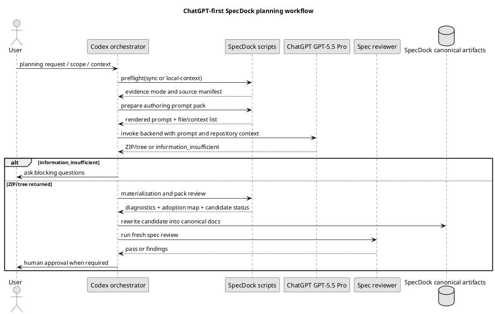

# ChatGPT First Planning Workflow Detailed Explanation

## 1. この資料の目的

前回の research artifact は、ChatGPT GPT-5.5 Pro Extended による分析結果を短く保存した evidence である。しかし、そのままでは次の実装者が次の疑問に答えにくい。

- 旧 manual workflow と ChatGPT-first workflow は何が根本的に違うのか。
- なぜ grade / specialist / phase gate を ChatGPT-facing prompt の中心から外すのか。
- Codex、ChatGPT、SpecDock script、reviewer、人間はそれぞれ何を担当するのか。
- Initiative / Epic / Issue planning で実際に何を作り、何を作らないのか。
- ZIP / authoring pack が返ってきた後、どの状態をもって成功とみなすのか。
- どの skill / docs / runtime script / tests を、どの順番で直せばよいのか。

この資料は、`iss-00309` の実装前に参照するための詳細説明資料である。結論だけでなく、判断理由、具体的な入出力、実装対象、例外処理、受け入れ条件まで書き下す。

## 2. 背景: 旧 manual workflow が複雑だった理由

旧 manual planning workflow は、Codex の token / context / 推論リソースを節約しながら品質を保つために設計されていた。

主な特徴は次の通りである。

- 要件、設計、実装計画を段階的に分ける。
- 設計は `system architect`、実装計画は `implementation planner` のように役割を分ける。
- 軽い Issue と重い Issue で grade を分け、品質ゲートの重さを変える。
- 各段階で reviewer を通し、手戻りを小さくする。
- Codex 本体がすべてを考え込まないように、sub-agent / template / grade / phase gate に処理を分散する。

これは、Codex のリソースを節約するには合理的だった。一方で、ChatGPT GPT-5.5 Pro Extended を planning authoring に使う場合、この前提が変わる。

ChatGPT 側には、長時間の推論、広い context、ZIP による複数ファイル出力を期待できる。そのため、旧 workflow の細かい役割分担をそのまま ChatGPT に押し付けると、むしろ性能を落とす。

## 3. 新しい基本方針

推奨する基本方針は次である。

> ChatGPT-first route は、旧 manual workflow を再現するルートではない。ChatGPT に十分な context と出力契約を渡し、仕様・設計・計画候補を evidence-only authoring pack として生成させる。Codex はそれを検査し、canonical artifact へ採用する。

この方針は、次の 4 つの原則に分解できる。

### 3.1 ChatGPT には作り方を縛りすぎない

ChatGPT に伝えるべきことは、主に次である。

- 対象 repository / branch。
- 現在の scope が Initiative / Epic / Issue のどれか。
- 入力として参照すべき requirement / design / plan / draft / ADR / artifact。
- 作ってほしいファイル群。
- 出力は ZIP または directory tree として返すこと。
- 返す成果物は canonical ではなく evidence-only candidate であること。
- 情報が足りない場合は無理に作らず `information_insufficient` を返すこと。

逆に、次は過剰に指示しない。

- 旧 manual workflow の内部手順。
- `system architect` や `implementation planner` のような sub-agent 構成。
- phase ごとの小刻みな draft / review 手順。
- Initiative / Epic planning における Issue grade の厳密な決定。
- ChatGPT の内部 reasoning の順番。

理由は、ChatGPT の強みが「まとまりの大きい planning task を一気に構造化すること」にあるためである。

### 3.2 ChatGPT output は evidence-only である

ChatGPT が返す requirement / design / plan は、完成度が高くてもそのまま SpecDock の正本ではない。

理由は次の通りである。

- ChatGPT は repository を読めるが、SpecDock の authority boundary を直接操作しない。
- ZIP が生成されたことと、SpecDock の canonical artifact として採用されたことは別である。
- ChatGPT は `.assurance.json`、review pass、Issue finish、PR mergeability を claim してはいけない。
- 採用前に Codex が local file として展開し、path / contents / forbidden claims / required files を検査する必要がある。
- 必要に応じて fresh reviewer と人間承認を通す必要がある。

したがって、ChatGPT output の正しい状態名は `candidate`、`draft evidence`、`authoring pack`、`evidence-only` である。

### 3.3 Script は権威ではなく境界である

SpecDock に実装する script は、ChatGPT を「賢くする」ためのものではない。主な役割は次である。

1. 実行前の preflight をする。
2. GitHub sync / local-context mode を明示する。
3. prompt template と入力 context を組み立てる。
4. backend command を呼び出す。
5. ZIP / tree が実際に materialize されたか確認する。
6. forbidden claims や required files を検査する。
7. Codex が canonical rewrite しやすい adoption map / diagnostics を出す。

Script がしてはいけないことは次である。

- ChatGPT output を自動で正本にする。
- review pass を claim する。
- Issue grade を最終決定する。
- `.assurance.json` を勝手に更新する。
- PR-ready / merge-ready / Issue finish / Epic complete を claim する。

### 3.4 Manual route は backup であり co-primary ではない

ChatGPT-first route は正規ルートである。ChatGPT が混雑している、tab 上限に達している、transient browser failure がある、という理由では manual route に落とさない。

原則は次である。

- tab 上限なら待機する。
- timeout したら再接続または並び直す。
- browser failure なら再起動・復旧を試みる。
- profile / login / Cloudflare などが原因なら状態を確認して復旧する。
- どうしても復旧できない場合のみ、人間の明示承認で manual route を使う。

つまり manual route は emergency backup であり、通常運用の代替ルートではない。

## 4. 全体ワークフロー

### 4.1 通常の流れ



### 4.2 状態を分ける

最も重要なのは、`success` を 1 種類にしないことである。

| 状態 | 意味 | 次の操作 |
|---|---|---|
| `backend_call_pass` | backend command は終了した | まだ ZIP/tree 成功とは限らない |
| `artifact_materialized_pass` | ZIP/tree が local に存在し展開可能 | pack review へ進む |
| `pack_review_pass` | required files / forbidden claims / structure を満たす | Codex が採用判断へ進む |
| `candidate_validation_pass` | candidate として矛盾や欠落が許容範囲 | canonical rewrite へ進む |
| `adoption_ready_for_orchestrator_review` | Codex が正本化レビューできる | reviewer / human gate へ進む |
| `information_insufficient` | 作るには情報不足 | clarification へ戻る |

この分離がないと、「ChatGPT が何か返した」ことを「SpecDock planning が完了した」と誤認する。

## 5. Scope 別の具体ワークフロー

## 5.1 Initiative Planning

Initiative planning の役割は、大きな仕事を Epic 境界へ分解することである。

### ChatGPT に渡す入力

- Initiative の目的。
- 既存 requirement / design / plan があればその path。
- 関連 ADR / artifact / 現在の repository state。
- 制約、非目標、優先順位。
- GitHub repository / branch context。

### ChatGPT に作らせるもの

```text
specdock-authoring-pack/
  summaries/initiative-summary.md
  candidates/initiative-requirement-candidate.md
  candidates/initiative-design-candidate.md
  candidates/initiative-plan-candidate.md
  candidates/epic-boundaries.md
  candidates/adr-candidates.md
  adoption/adoption-map.json
  adoption/eal-candidates.json
```

### 作らせないもの

- Epic の正式 requirement / design / plan。
- Issue の正式 requirement / design / plan。
- Issue grade の正式決定。
- review pass claim。
- Initiative completion claim。

### 判断ポイント

Initiative planning では、各 Epic の境界が重複せず、後続 Epic planning に渡せる情報が揃っていることが重要である。Epic の中身を作り込みすぎる必要はない。

## 5.2 Epic Planning

Epic planning は、この workflow の中心である。Epic 自体の requirement / design / plan を作り、配下 Issue の draft をまとめて生成する。

### ChatGPT に渡す入力

- Epic requirement または Epic の目的。
- 親 Initiative の boundary / constraints。
- 既存 artifacts / ADR / prior analysis。
- repository / branch context。
- 実装単位へ分解したい粒度。
- multi-Issue Epic なら final quality / PR delivery Issue を末尾に置く方針。

### ChatGPT に作らせるもの

```text
specdock-authoring-pack/
  summaries/epic-summary.md
  candidates/epic-requirement-candidate.md
  candidates/epic-design-candidate.md
  candidates/epic-plan-candidate.md
  candidates/issue-slices.md
  candidates/dependency-order.md
  candidates/final-quality-issue-policy.md
  drafts/issues/<issue-slug>/draft-requirement.md
  drafts/issues/<issue-slug>/draft-design.md
  drafts/issues/<issue-slug>/draft-plan.md
  adoption/path-index.json
  adoption/adoption-map.json
  adoption/eal-candidates.json
```

### 作らせないもの

- 配下 Issue の正式 requirement / design / plan。
- Issue grade の最終決定。
- Issue start / finish。
- PR-ready / merge-ready claim。
- Epic completion claim。

### Issue draft の位置づけ

Epic planning で作る Issue docs は、実装直前に使う draft である。正式版ではない。

理由は、Issue 実装直前には repository state が変わっている可能性があるからである。先にすべての Issue planning を正式化すると、後続 Issue の仕様が stale になりやすい。

推奨する流れは次である。

1. Epic planning で全 Issue の draft を作る。
2. 人間が Issue slice / order / boundary を確認する。
3. Epic execution で Issue を 1 つずつ start する。
4. 各 Issue の実装直前に draft adoption planning を行う。
5. その時点の repository state と draft を照合して正式 requirement / design / plan にする。

### Final quality / PR delivery Issue

Multi-Issue Epic では、最後の Issue として final quality / PR delivery Issue を置く。

この Issue の責務は次である。

- Epic 全体の quality gate。
- tests / lint / docs / generated scaffold validation。
- review findings の修正。
- PR description / evidence の整備。
- mergeable PR の作成。

各 Issue ごとに PR を作るのではなく、Issue を順番に finish し、最後に 1 つの PR を作る。

例外は次に限る。

- 単一 Issue Epic。
- docs-only で人間が final quality Issue 不要と判断した場合。
- no-op / research-only Epic。
- 明示的に例外 ADR または plan note がある場合。

## 5.3 Issue Planning

Issue planning は、複数のモードに分けない。最終的に作るものは常に同じである。

作るもの:

- 正式な Issue requirement。
- 正式な Issue design。
- 正式な Issue implementation plan。
- Grade recommendation。
- Reviewer focus。
- 必要に応じた補助 artifact / EAL candidates。

違うのは、入力 context の種類である。

### 入力 context の代表例

Issue planning の入力は、案件ごとに濃淡が異なる。代表的には次の 3 パターンがある。

| 入力 context | 典型ケース | ChatGPT がすべきこと |
|---|---|---|
| Requirement-heavy | 人間と Codex が先に requirement を固めている | Requirement を検査し、design / plan を補い、必要なら requirement の矛盾も修正候補として出す |
| Draft-heavy | Epic planning で draft requirement / design / plan が生成済み | Draft を現在の repository state と照合し、採用・修正・破棄すべき主張を整理して正式版にする |
| Context-heavy / zero-base | 要件が粗く、artifact / ADR / code context / 会話内容が主入力 | 不足情報を検出しつつ、可能なら requirement / design / plan を一括で立ち上げる |

これらは別 mode ではない。すべて `issue-planning` の同じ目的に向かう入力差分である。

### ChatGPT に渡す入力

- ユーザーの目的。
- 既存 requirement / design / plan があればその内容。
- Epic planning 由来の draft requirement / draft design / draft plan があればその内容。
- 親 Epic / Initiative の context。
- 関連 artifact / ADR / prior analysis。
- 現在の repository / branch state。
- 直前 Issue までの完了状況。
- 実装対象の code / tests / docs / templates。

### ChatGPT に作らせるもの

```text
specdock-authoring-pack/
  summaries/issue-summary.md
  candidates/issue-requirement-candidate.md
  candidates/issue-design-candidate.md
  candidates/issue-plan-candidate.md
  candidates/input-context-disposition.md
  candidates/grade-recommendation.md
  candidates/reviewer-focus.md
  adoption/adoption-map.json
  adoption/eal-candidates.json
```

### input-context-disposition

`input-context-disposition.md` は、入力として渡された requirement / draft / artifact / code context をどう扱ったかを説明する補助資料である。

Draft-heavy な場合は、Epic planning 由来の draft の各主張を次のように分類する。

| disposition | 意味 |
|---|---|
| `adopt` | 現在の repository state でもそのまま使える |
| `partially_adopt` | 一部修正すれば使える |
| `reject` | 現在の条件では採用しない |
| `stale` | 古くなっている |
| `blocked` | 判断に必要な情報が不足している |

Requirement-heavy な場合は、既存 requirement の前提、矛盾、未決事項、design / plan に反映した判断を整理する。

Context-heavy / zero-base な場合は、入力から確定できたこと、推測に留まること、追加質問が必要なことを整理する。

### 作らせないもの

- `authorized_profile` の最終決定。
- `.assurance.json` の更新。
- review pass claim。
- execution-ready claim。
- Issue finish claim。

### 判断ポイント

Issue planning の目的は、入力の種類にかかわらず「実装可能な正式 requirement / design / plan を作ること」である。したがって script / skill / prompt は複数 mode に分けず、単一の `issue-planning` に十分な入力 context を渡す設計にする。

## 6. Grade の扱い

### 6.1 なぜ Initiative / Epic planning では grade を中心にしないのか

Grade は本来、軽い作業に重すぎる品質ゲートを課さないための仕組みだった。これは Codex token / review cost の管理として意味があった。

しかし ChatGPT-first planning では、ChatGPT 側に planning reasoning をまとめて任せる。そこで Initiative / Epic の早い段階から grade を厳密に決めると、次の問題が起こる。

- Issue の実態が固まる前に品質ゲートを固定してしまう。
- Epic planning の主目的である boundary / dependency / slice の整理を邪魔する。
- ChatGPT に旧 manual workflow の制約を過剰に背負わせる。
- Draft Issue が stale になったときに grade も stale になる。

### 6.2 Grade を残す場所

Grade は formal Issue planning / execution planning に残す。

理由は、実装直前なら次を判断できるためである。

- 実際に触る file / layer。
- runtime / scaffold / installed assets への影響。
- migration / compatibility risk。
- test / review の重さ。
- manual validation の必要性。
- final PR に含める quality evidence。

### 6.3 ChatGPT の grade 出力形式

ChatGPT は grade を最終決定せず、recommendation として返す。

```yaml
recommended_grade: lite | standard | strict | critical
confidence: high | medium | low
not_authorized_profile_decision: true
rationale:
  scope_size: "..."
  affected_surfaces: ["..."]
  runtime_or_scaffold_impact: true | false
  compatibility_risk: "..."
  test_obligation: "..."
why_not_lower:
  - "..."
what_would_raise_grade:
  - "..."
what_would_lower_grade:
  - "..."
missing_facts:
  - "..."
```

Codex はこれを読み、SpecDock の formal grade / authorized profile / quality gate に反映するかを判断する。

## 7. information_insufficient の扱い

ChatGPT が十分な情報を得られない場合、低品質な ZIP を作らせるべきではない。代わりに `information_insufficient` を返させる。

### 7.1 返すべき場面

- 要件が曖昧で acceptance criteria がない。
- 親 Initiative / Epic の境界がわからない。
- GitHub repository / branch にアクセスできない。
- local-context mode なのに差分や必要 artifact が渡されていない。
- draft の出所が不明。
- repository state と draft が矛盾している。
- secret / private data が混ざっており安全に処理できない。

### 7.2 出力例

```yaml
status: information_insufficient
authority: evidence_only
adoption_status: unreviewed
bundle_generation_not_promotion: true
scope: epic
evidence_mode: github-synced
can_produce_zip: false
reason_codes:
  - missing_acceptance_criteria
  - ambiguous_scope
blocking_questions:
  - question: "この Epic は既存 planning skill の置換が目的ですか、それとも ChatGPT prompt template の追加だけが目的ですか?"
    why_needed: "出力すべき Issue slice と影響範囲が変わるため。"
safe_partial_findings:
  - finding: "manual route は backup として残す方針は一貫している。"
not_claimed:
  - canonical adoption
  - reviewer pass
  - execution-ready
  - PR-ready
```

### 7.3 Codex の対応

Codex は `information_insufficient` を失敗として握りつぶさない。次のどちらかに進む。

- blocking questions をユーザーに聞く。
- 足りない artifact / diff / context を追加して再実行する。

## 8. Skill 再構成の具体案

## 8.1 Primary ChatGPT-first skills

既存 skill 名は維持し、内部を ChatGPT-first route に寄せる。

対象:

- `spec-dock-initiative-planning`
- `spec-dock-epic-planning`
- `spec-dock-issue-planning`

各 skill に書くべきこと:

- まず ChatGPT-first route を使う。
- 対応する prompt template mode を選ぶ。
- authoring pack は evidence-only である。
- ZIP/tree が返っても canonical adoption ではない。
- `information_insufficient` なら clarification へ戻す。
- manual fallback は explicit human approval がある場合のみ使う。

## 8.2 Shared ChatGPT authoring skill

`spec-dock-chatgpt-authoring` は leaf workflow ではなく、planning skills が内部で使う shared lane として明確化する。

担当:

- GitHub sync / local-context mode の説明。
- backend command adapter contract。
- prompt template selection。
- ZIP/tree materialization validation。
- status separation。
- forbidden claims。
- manual fallback boundary。

## 8.3 Manual backup skills

Manual skills は残す。

対象:

- `spec-dock-initiative-planning-manual`
- `spec-dock-epic-planning-manual`
- `spec-dock-issue-planning-manual`

ただし位置づけは次にする。

- ChatGPT-first が使えないときの emergency backup。
- 明示的な人間承認が必要。
- tab 上限、timeout、transient browser failure だけでは使わない。
- 旧 workflow を維持するが、primary skill から fallback 条件を案内する。

命名は `manual` が最も無難である。`legacy` は劣化版のニュアンスが強く、`backup` は用途を表すが skill 名として主操作に見えにくい。現状の `*-manual` はユーザーにも意味が伝わりやすい。

## 9. Prompt template 設計

Prompt は Python 文字列に埋め込まず、provider-side Markdown assets として置く。

推奨配置:

```text
src/spec_dock/assets/spec_dock/system/chatgpt-authoring/prompts/
  shared/base.md
  initiative-planning.md
  epic-planning.md
  issue-planning.md
```

### 9.1 shared/base.md に入れる内容

- You are producing SpecDock planning evidence.
- You are not producing canonical SpecDock artifacts.
- Authority is `evidence_only`.
- Bundle generation is not promotion.
- Use repository / branch context.
- If repository access fails in github-synced mode, return repository access failure or information insufficient.
- Do not claim reviewer pass, execution-ready, PR-ready, merge-ready, Issue finish, Epic completion.
- Do not include secrets, local absolute host paths, nested archives, binaries, executables, symlinks.
- If information is insufficient, return `information_insufficient`.

### 9.2 initiative-planning.md

Focus:

- Initiative R/D/P candidates。
- Epic boundaries。
- Optional ADR candidates。
- EAL candidates。

Do not:

- Finalize Epic specs。
- Finalize Issue specs。
- Decide Issue grade。

### 9.3 epic-planning.md

Focus:

- Epic R/D/P candidates。
- Issue slices。
- Dependency order。
- Issue draft R/D/P。
- Final quality Issue policy。
- Path index。

Do not:

- Finalize child Issue docs。
- Claim execution readiness。
- Claim PR delivery。

### 9.4 issue-planning.md

Focus:

- Issue R/D/P candidates。
- Input context disposition。
- Grade recommendation。
- Reviewer focus。
- EAL candidates。

Used when:

- 人間と Codex が requirement を先に固めた Issue を正式化する。
- Epic planning で作られた draft Issue docs を正式化する。
- Artifact / ADR / code context / 会話内容から Issue docs を立ち上げる。

Important:

- これらは別 mode ではない。入力 context が違うだけで、出力は Issue requirement / design / plan candidates に揃える。
- Draft がある場合は `input-context-disposition.md` の中で draft claim disposition を行う。
- Requirement がある場合は `input-context-disposition.md` の中で requirement validation / repair notes を行う。
- Context が粗い場合は `information_insufficient` または blocking questions を返す。

## 10. Runtime script 設計

## 10.1 `prompt_pack_contract.py`

変更内容:

- planning mode は `initiative-planning` / `epic-planning` / `issue-planning` に揃える。
- `issue-planning` の input context type として `requirement-heavy` / `draft-heavy` / `context-heavy` を表現できるようにする。
- prompt template path constants を追加する。
- forbidden claims を追加する。
- `information_insufficient` allowed response を定義する。

Forbidden claims:

- canonical adoption。
- reviewer pass。
- authorized_profile decision。
- execution-ready。
- PR-ready。
- merge-ready。
- Issue finish。
- Epic completion。
- PR delivery。

## 10.2 `pack_prepare.py`

変更内容:

- Python hardcoded prompt から Markdown template rendering に寄せる。
- mode-specific template を選ぶ。
- shared/base.md と scope template を合成する。
- GitHub sync / local-context mode を prompt に明示する。
- input artifact list と source manifest を prompt に入れる。

成功条件:

- `initiative-planning` / `epic-planning` / `issue-planning` の prompt を生成できる。
- `issue-planning` prompt に、入力 context の種類と渡された sources が明示される。
- Prompt に authority boundary と information-insufficient contract が含まれる。
- Prompt に private local wrapper path が含まれない。

## 10.3 `backend_invoke.py`

変更内容:

- backend command の終了状態と artifact materialization を分ける。
- 出力 metadata に次のような fields を持たせる。

```yaml
backend_call_status: pass | fail | timeout | unavailable
artifact_materialization_status: pass | missing | invalid | not_requested | unknown
artifact_path: "..."
artifact_digest: "..."
next_review_command: "..."
```

重要:

- return code 0 は backend_call_status の成功でしかない。
- ZIP/tree が local に存在しなければ artifact_materialized_pass ではない。

## 10.4 `pack_review.py`

変更内容:

- Local materialized artifact validation step として位置づける。
- required files を検査する。
- forbidden claims を検査する。
- path traversal / hidden paths / nested archives / binaries / symlinks を拒否する。
- adoption-map / path-index の存在を検査する。

## 10.5 backend command adapter contract

SpecDock は Oracle / ChatGPT automation 本体を抱え込まない。

SpecDock が持つべき contract:

- backend command は設定で差し替え可能。
- 例: `SPECDOCK_CHATGPT_COMMAND` または config / CLI arg。
- 未設定なら明確な error。
- 個人環境の絶対 path は docs の example に留める。
- Product script に `/Users/.../.codex/skills/chatgpt-use/scripts/oracle-chatgpt` を直書きしない。

## 11. 実装順序

推奨する実装順は次である。

### Step 1: prompt assets を追加する

追加:

```text
src/spec_dock/assets/spec_dock/system/chatgpt-authoring/prompts/shared/base.md
src/spec_dock/assets/spec_dock/system/chatgpt-authoring/prompts/initiative-planning.md
src/spec_dock/assets/spec_dock/system/chatgpt-authoring/prompts/epic-planning.md
src/spec_dock/assets/spec_dock/system/chatgpt-authoring/prompts/issue-planning.md
```

理由:

- まず ChatGPT に渡す思想と出力契約を固定する。
- Script はこの template を読むだけにできる。

### Step 2: docs を更新する

更新:

```text
src/spec_dock/assets/spec_dock/docs/workflow_spec_authoring.md
src/spec_dock/assets/spec_dock/docs/workflow_chatgpt_authoring_pack.md
src/spec_dock/assets/spec_dock/docs/workflow_initiative.md
src/spec_dock/assets/spec_dock/docs/workflow_epic.md
src/spec_dock/assets/spec_dock/docs/workflow_issue.md
src/spec_dock/assets/spec_dock/docs/phase_plan_issue.md
```

目的:

- ChatGPT-first が primary route であることを明記する。
- Manual fallback は emergency backup とする。
- Grade は formal Issue planning に寄せる。
- Epic planning で Issue draft を作り、Issue execution 直前の Issue planning で入力 context として取り込む流れを説明する。

### Step 3: skills を更新する

更新:

```text
src/spec_dock/assets/install_root/.agents/skills/spec-dock-chatgpt-authoring/SKILL.md
src/spec_dock/assets/install_root/.agents/skills/spec-dock-initiative-planning/SKILL.md
src/spec_dock/assets/install_root/.agents/skills/spec-dock-epic-planning/SKILL.md
src/spec_dock/assets/install_root/.agents/skills/spec-dock-issue-planning/SKILL.md
```

目的:

- Codex が実際に従う動線を変える。
- 旧 manual workflow の追記ではなく、ChatGPT-first route を本文の中心にする。
- Manual route への fallback 条件を明確にする。

### Step 4: runtime scripts を更新する

更新:

```text
src/spec_dock/assets/spec_dock/scripts/spec_dock_runtime/domain/authoring_pack/prompt_pack_contract.py
src/spec_dock/assets/spec_dock/scripts/spec_dock_runtime/application/authoring_pack/pack_prepare.py
src/spec_dock/assets/spec_dock/scripts/spec_dock_runtime/application/authoring_pack/backend_invoke.py
src/spec_dock/assets/spec_dock/scripts/spec_dock_runtime/application/authoring_pack/pack_review.py
```

目的:

- Prompt template を script から使えるようにする。
- status separation を実装する。
- `information_insufficient` を valid outcome として扱う。
- ZIP/tree materialization の検査を強化する。

### Step 5: tests を追加する

追加候補:

```text
tests/cli_runtime/test_chatgpt_prompt_templates.py
tests/cli_runtime/test_authoring_pack_prepare_templates.py
tests/cli_runtime/test_authoring_backend_invoke_status_semantics.py
tests/cli_runtime/test_authoring_pack_review_materialization.py
tests/cli_runtime/test_chatgpt_first_skill_contracts.py
tests/cli_runtime/test_chatgpt_docs_contracts.py
tests/cli_runtime/test_installed_chatgpt_authoring_assets.py
```

最低限確認すること:

- Prompt assets が installed scaffold に含まれる。
- Prompt に forbidden authority claims が含まれない。
- Prompt に `information_insufficient` contract が含まれる。
- `issue-planning` が requirement-heavy / draft-heavy / context-heavy の入力 context を表現できる。
- backend success と artifact materialization success が区別される。
- Manual fallback は primary として案内されない。

## 12. 受け入れ条件

この Issue の完了条件は次である。

### Documentation / skill

- ChatGPT-first route が primary として記述されている。
- Manual route が emergency backup として記述されている。
- Initiative / Epic / Issue の出力範囲が明確である。
- Epic planning で Issue draft を作り、Issue planning 直前に入力 context として取り込んで正式版を作る流れが説明されている。
- Multi-Issue Epic の final quality / PR delivery Issue policy が説明されている。
- Grade が formal Issue planning に限定されることが説明されている。

### Prompt assets

- Shared base prompt が authority boundary を定義している。
- Scope-specific prompt が必要な file tree を定義している。
- `information_insufficient` が valid response として定義されている。
- Forbidden claims が明記されている。

### Runtime scripts

- Prompt template を読んで prompt を生成できる。
- GitHub sync / local-context mode が prompt に反映される。
- backend call status と artifact materialization status が分離される。
- pack review が ZIP/tree の構造と forbidden claims を検査できる。

### Tests

- prompt asset existence。
- prepare mode coverage。
- status separation。
- installed asset propagation。
- skill/docs contract。

## 13. 実装時に迷いやすい点

### 13.1 ChatGPT output をそのまま配置してよいか

そのまま canonical path に置かない。まず authoring pack として artifact に保存し、Codex が内容を読んで canonical docs に rewrite する。

### 13.2 ZIP が返ってきたら成功か

違う。ZIP が返るのは `artifact_materialized_pass` の候補でしかない。中身を `pack_review` で検査する。

### 13.3 Issue draft に grade を書かせるべきか

Epic planning 時点では advisory signal までにする。正式 grade recommendation は Issue planning / draft adoption 時点で出す。

### 13.4 ChatGPT が使えないとき、すぐ manual に行くか

行かない。待機、再接続、再起動、profile 復旧を試す。Manual は hard failure + explicit human approval のみ。

### 13.5 local diff があるときは実行禁止か

原則は GitHub synced mode を推奨する。ただし、ユーザーが明示的に local-context mode を選び、差分・artifact・source manifest を渡すなら実行可能にする。`-f` のような軽い bypass ではなく、明示的な mode 名にする。

## 14. まとめ

この設計の中心は、ChatGPT に旧 manual workflow を細かく再現させることではない。

中心は次である。

1. ChatGPT には十分な context と明確な output contract を渡す。
2. ChatGPT には仕様・設計・計画を自由に深く考えさせる。
3. 出力は evidence-only authoring pack として受け取る。
4. Codex / SpecDock scripts が materialization、validation、adoption boundary を管理する。
5. Manual workflow は非常時の backup として残す。
6. Grade は formal Issue planning / execution quality gate に限定して扱う。

この方向に寄せることで、ChatGPT GPT-5.5 Pro Extended の強みを活かしつつ、SpecDock の canonical artifact / reviewer / human approval / quality gate の安全性も維持できる。
