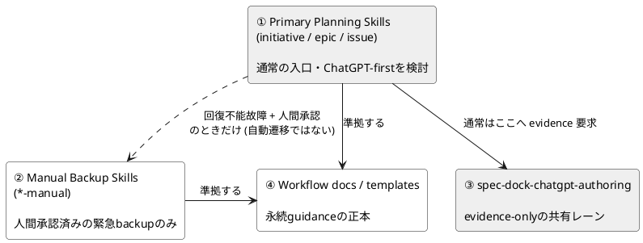
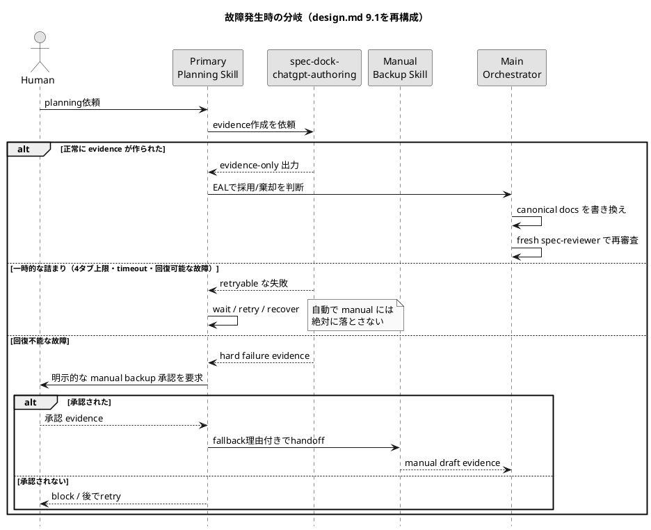
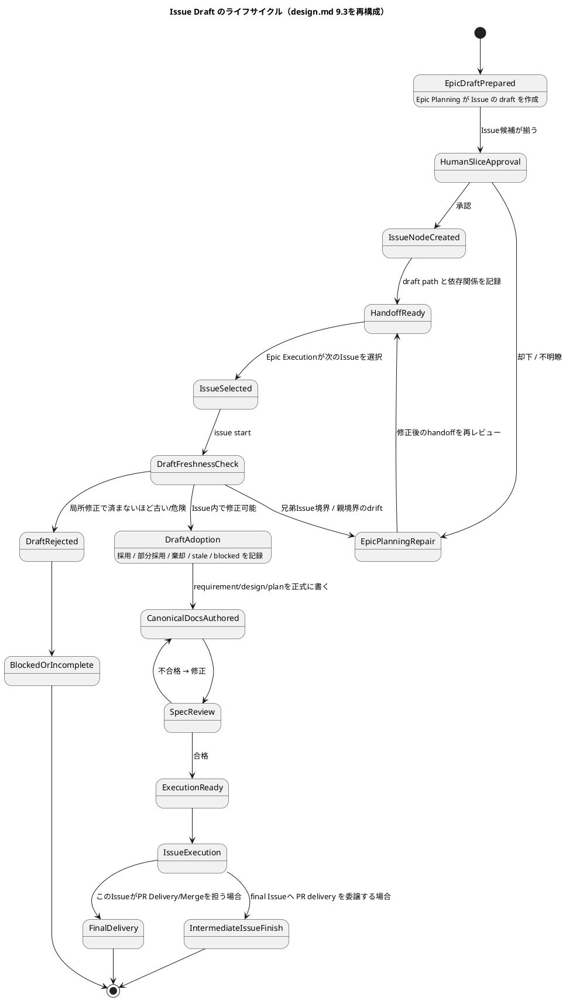
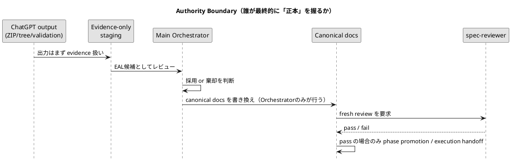
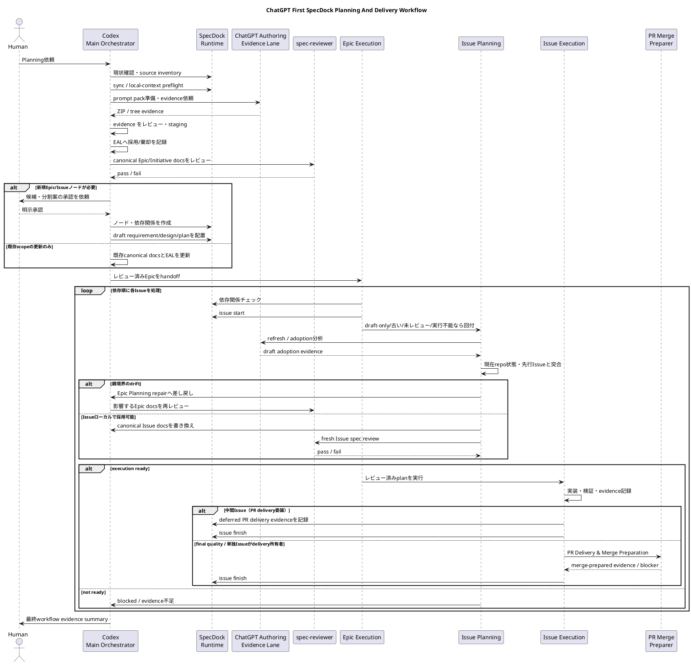
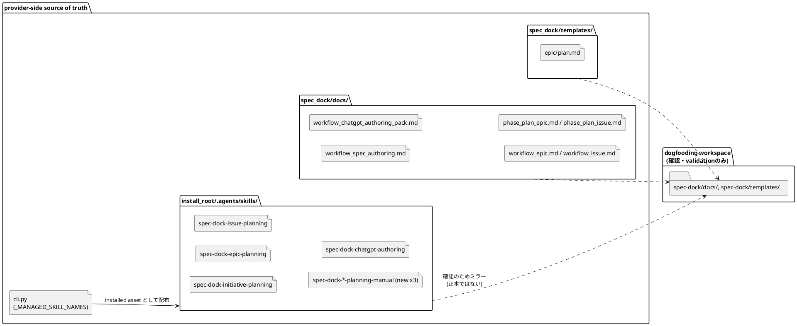

<title>iss-00309 オンボーディング資料 — ChatGPT-First Planning Redesign</title>

# iss-00309 オンボーディング資料
### ChatGPT First Planning Skills And Fallback Route Redesign

> このドキュメントは `requirement.md` / `design.md` / `plan.md` の内容を、新メンバーが1回読めば全体像を掴めるように再構成したサポート資料です。正本はあくまで元の3ファイルであり、本資料は理解のための補助教材という位置づけです。

---

## 0. まず結論だけ

このIssueがやることは一言で言うと：

**「Planningの入口をChatGPT-firstにして、昔ながらの手動routeは"緊急用バックアップ"として`-manual`という名前で温存する」**

- 既存のスキル名（`spec-dock-initiative-planning` 等）は変えない → これがChatGPT-first routeになる
- 昔のやり方は削除せず `-manual` サフィックス付きの別スキルとして残す
- 「ChatGPTが混んでる」「タイムアウトした」くらいでは manual に逃げない。**待つ・リトライする・復旧させる**が先
- manual を使えるのは「回復不能な故障」+「人間の明示的な承認」の両方が揃ったときだけ

---

## 1. 登場人物とレイヤー構造

このIssueの設計は4層のレイヤーで責務を分離しています。

| # | レイヤー | 何をする | どこまで権限を持つか |
|---|---|---|---|
| ① | **Primary planning skills**<br>`initiative` / `epic` / `issue` | 通常の入口。まずChatGPT-first evidence routeを検討する | canonical docsの採用・拒否判断まで |
| ② | **Manual backup skills**<br>`*-manual` | ChatGPT/browser/自動化が壊れたときの緊急脱出口 | human-approved emergency backupの証跡まで（自動遷移先ではない） |
| ③ | **spec-dock-chatgpt-authoring** | プロンプトパックとZIP/tree形式のドラフトを作る共有レーン | evidence-onlyのみ。canonical採用・reviewer合格・実行可否は一切主張しない |
| ④ | **Workflow docs / templates** | Option 3+、ドラフトのライフサイクル、final quality Issueポリシーを永続guidanceとして固定 | installed docs/templatesの正本 |



---

## 2. なぜこれをやるのか（背景）

- 親Epic `epic-00295` は「ChatGPT authoring pack」をinstalled runtime / installed skillの正式な仕組みに昇格させる取り組み
- ChatGPTはrequirement/design/planのドラフトやIssue分割案を**作れる**が、正本への採用・`.assurance.json`の変更・reviewer合格・実行可否（execution-ready）・PR可否は**主張できない** — これは一貫して守られるべき境界線
- 現状の課題は2つ：
  1. Primary planning skillsがChatGPT-first routeを十分に強制していない
  2. `-manual` backup skillsがまだ実在しない（provider-side installed skill pathに存在しない）

---

## 3. Primary route と Manual route の分岐ロジック

一番読み違えやすいポイントがここです。「ChatGPTが失敗したら即manualへ」ではありません。故障の種類によって扱いが完全に変わります。

| 故障の種類 | 扱い | manual route は使えるか |
|---|---|:---:|
| ChatGPTブラウザの4タブ上限で詰まる | wait / queue / retry | ❌ |
| タイムアウト | retry / evidence再生成 | ❌ |
| ブラウザ起動失敗 | restart / recover / retry | ❌ |
| バックエンドコマンド未設定 | セットアップ修復。`local-context`は明示指定時のみ | 原則❌ |
| GitHub同期がブロックされた | push/clean/reconcile、または明示的な`local-context` | 原則❌ |
| ZIPが安全性チェックで拒否された | 却下・再生成 | ❌ |
| **ツール/ブラウザ/providerの回復不能な故障** | 理由を記録し、**人間に承認を求める** | ✅ **明示承認後のみ** |
| 人間がmanual backupを承認しない | block または wait/retry/recover | ❌ |
| manual routeの出力にreviewer合格がない | evidence/draftのまま扱う | readiness主張なし |



---

## 4. Option 3+：Issueドラフトはいつ正式化されるのか

これが設計上もう一つの中核ポイントです。「Epic Planningの時点で子Issueの`requirement.md`/`design.md`/`plan.md`を全部作り切ってしまう」のではなく、**Issueの実行が始まる直前・直後**に正式化する、というタイミング設計（=Option 3+）です。

- **Epic Planning** が作るのは *ドラフト* の requirement / design / plan と、依存関係・境界のhandoffパッケージまで
- **canonical**（正本）な Issue の requirement.md / design.md / plan.md を作るのは、**Issue Planning** が Epic Execution 中に該当Issueへ着手する直前/直後に行う
- そのとき、現在のリポジトリ状態・完了済みの先行Issue・依存関係の状態・未解決のledgerと突き合わせてから採用する

なぜこうするか：Epicの計画時点で全Issueのcanonical docsを作り切ると、実装が進むにつれて前提が古くなり、後続Issueのドキュメントが「絵に描いた餅」になりやすいためです。



### 4.1 「Drift」が起きたときの判定基準

Issue Planning中に見つかった食い違い（drift）は、Issue内で吸収してよいものと、Epic Planningまで差し戻すべきものに分かれます。

| Issue内で吸収してよい | Epic Planningへ差し戻すべき |
|---|---|
| ローカルな文言・受け入れ条件の微調整 | 兄弟Issueの境界変更 |
| ローカルなテスト計画の具体化 | 依存関係の順序変更 |
| ファイルローカルな実装計画の更新 | final quality Issueの所在・責務 |
| 古いdraft文言の置き換え | 親Epicの E-RQ / E-AC のclosureへの影響 |
| 依存順序を変えない小さな依存evidenceの更新 | 共有アーキテクチャ、workflowポリシー、rollout戦略 |

### 4.2 入力の性質は3種類あるが、ワークフローは1つだけ

これも誤解しやすい点：「入力の種類ごとに別の処理モードがある」わけではありません。**ワークフローは常に同じ**で、違うのは入力の"性質（context framing）"だけです。

| 入力の性質 | 意味 | 出力 |
|---|---|---|
| `requirement-heavy` | 要件はほぼ明確。design/planの展開が主な作業 | canonical Issue R/D/P |
| `draft-heavy` | draftが既に存在。整形・整合性修復・最新状態への更新が主な作業 | canonical Issue R/D/P |
| `context-heavy` | 背景資料・artifact・コード状態・ADR・議論ログが主な入力。要件抽出と境界定義が必要 | canonical Issue R/D/P、または`information_insufficient` |

---

## 5. Final Quality Issue ポリシー（複数Issueをまとめる終端ゲート）

複数Issueで構成される実装系Epicには、**最後に品質を締めくくる専用Issue**（final quality gate / PR delivery Issue）が必要、というルールです。

- **Multi-Issue implementation Epic** → final quality gate / PR delivery Issue は**必須**
- **Single-Issue / docs-only / no-op Epic** → skip理由（skip rationale）と完了証跡（completion evidence）があれば、専用のfinal quality Issueを**省略可**

このロジックはEpicのテンプレート (`templates/epic/plan.md`) に以下のフィールドとして反映されます。

```text
Epic classification:
  - multi-Issue implementation / single-Issue / docs-only / no-op
Final quality Issue:
  - required / skipped
If required:
  - Issue id / tranche: final / depends_on: all implementation Issues
  - responsibilities: Epic-wide verification, reviewer repair loop,
                       manual test summary, PR Delivery Gate,
                       Merge Preparation Gate
  - intermediate Issue PR policy: deferred PR delivery gate required
If skipped:
  - skip rationale / completion evidence / single-Issue gate owner
```

---

## 6. 権限境界（Authority Boundary）— これだけは絶対に破れない一線

ChatGPT側の出力に対して、以下の主張は**どんな生成/更新テキストにも一切含めてはいけません**（design.md 8.1）。

> canonical adoption完了 / `.assurance.json`変更 / authorized_profile決定 / fresh reviewerパス取得 / execution-ready / PR-ready / merge-ready / Issue finish / Epic completion / PR delivery



**理解のコツ**：ChatGPTは「良い草案を書ける優秀なライター」であって、「承認印を押せる決裁者」ではない、という一点に尽きます。

---

## 7. Handoff-ready と Execution-ready の違い

用語が紛らわしいので明確化します。

| 状態 | 意味 |
|---|---|
| **handoff-ready** | Issueのdraft evidence・path index・依存関係が揃い、Issue Planningへ回せる状態 |
| **execution-ready** | canonical requirement.md/design.md/plan.mdが揃い、fresh `spec-reviewer`が合格し、実行可能なplanと必要な検証・delegation/fallback evidence・reviewer focus・未解決ledgerなしの`report.md`まで揃った状態 |

「handoff-readyなだけ」で実装を始めてはいけない、というのがこのIssueが守ろうとしている境界です。

---

## 8. エンドツーエンドの全体フロー

上記の要素を1枚にまとめた、Planningから実装完了までの通し図です（design.md 9.2を再構成）。



---

## 9. 変更対象ファイルの全体像

このIssueが実際に手を入れるファイル群です。dogfooding workspace (`spec-dock/`) は**確認用のミラー**であり、正本ではないことに注意してください。



---

## 10. 実装マイルストーン（plan.mdの要約）

実装は次の順で進みます。各マイルストーンは1コミット相当を想定しています。

| M | やること | 完了の目印 |
|---|---|---|
| M0 | 現状のスキル・docs・templateの棚卸し | baselineを`report.md`に記録 |
| M1 | `-manual`バックアップスキルを新規作成（3つ） | `human-approved emergency backup`の文言を含む |
| M2 | Primary planning skillsをChatGPT-first化 | `ChatGPT-first`文言・自動fallbackなしの明記 |
| M3 | `spec-dock-chatgpt-authoring`の境界を補強 | evidence-only文言・故障分類の追加 |
| M4 | `_MANAGED_SKILL_NAMES`へmanual skillsを追加 | installシミュレーションでmanual skillが出力される |
| M5 | Workflow docsへPlantUML/Option 3+を反映 | 本資料の図が実docsに転記される |
| M6 | Epic plan templateを更新 | final quality必須/省略フィールドが追加される |
| M7 | dogfooding workspaceのミラー確認 | provider側優先を`report.md`に記録 |
| M90 | テスト・静的チェック | `pytest` / `validate` / `diff --check`が通る |
| M95 | reviewer gate準備 | `report.md`にEAL/reviewer verdictを記録 |
| M99 | 最終ローカル品質チェック | 全検証コマンドの実行・blocker記録 |

---

## 11. 「やらないこと」（Out of Scope）— ここも重要

読み違えを防ぐために、明示的にスコープ外とされている項目です。

- ChatGPTにcanonical docsを直接更新させること、`.assurance.json`変更、authorized_profile決定、reviewer合格付与、execution-ready/PR-ready/merge-ready判定をさせること
- `authoring adopt` / `authoring create-issues-from-zip` / `authoring mark-reviewer-pass` などの新規コマンド実装
- GitHub Issue/PRの自動作成・自動close・自動merge
- `spec-reviewer` / `code-reviewer` / `qa-reviewer` の代替・bypass
- 既存workspaceの遡及的マイグレーション保証
- 全Epicへのfinal quality Issueの遡及的強制
- Single-Issue/docs-only/no-op Epicへのfinal quality Issue常時必須化

---

## 12. 用語ミニ辞典

| 用語 | 意味 |
|---|---|
| **EAL** (Evidence Adoption Ledger) | ChatGPT等の出力をどう採用/棄却したかを記録する台帳。`report.md`内に存在 |
| **canonical docs** | 正本となるドキュメント（requirement.md / design.md / plan.md）。draftではない |
| **draft_authority: evidence_only** | このドキュメントの元となった候補がまだ証拠段階であり、正式採用されていないことを示すフロントマター属性 |
| **strict profile** | このIssueが影響範囲の広さ（skill/workflow/template/複数Issue依存）ゆえに要求される高い審査グレード |
| **ADR** | Accepted Architecture Decision Record。Option 3+の採用など、確定した設計判断を固定する文書 |
| **drift** | 想定していた前提と実際のリポジトリ状態・依存関係にズレが生じること |

---

## 13. 読む順番のおすすめ（次に何を読むか）

1. `report.md` — EAL-001〜EAL-005の採用判断の詳細を確認
2. `artifacts/20260708t161533z-adr-...md` — Accepted ADR原文（Option 3+の一次資料）
3. `design.md` セクション7〜8 — 各スキルの現状ギャップと権限境界の原文
4. `plan.md` セクション9 — M0〜M99の詳細アクションと具体的なgrepコマンド

