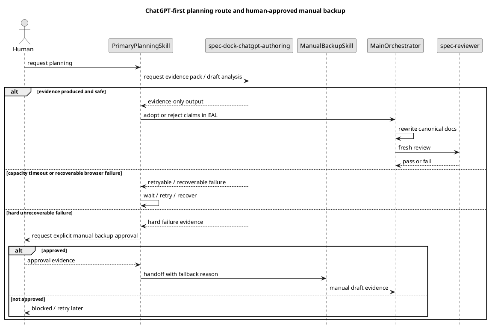
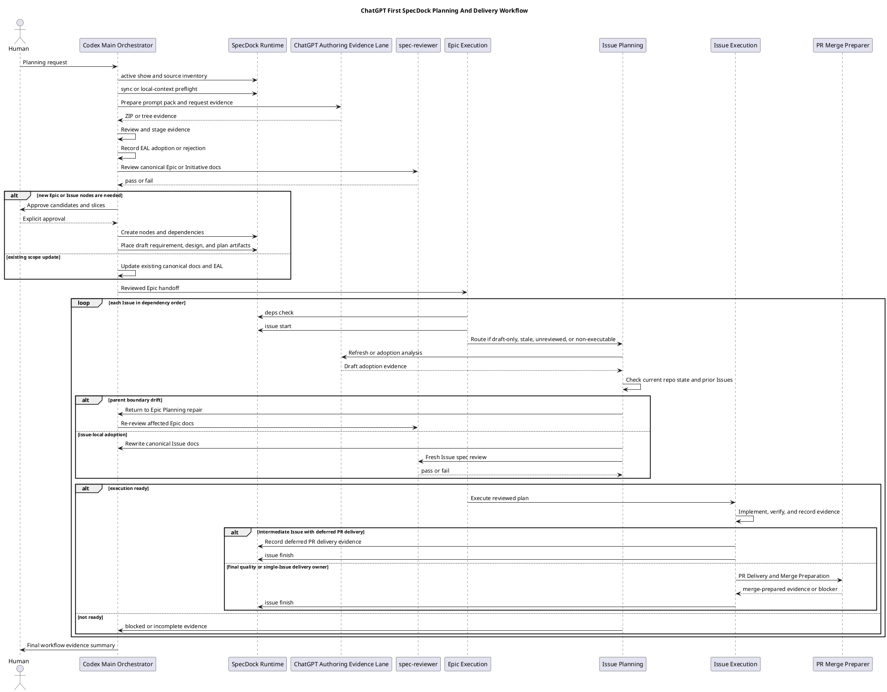
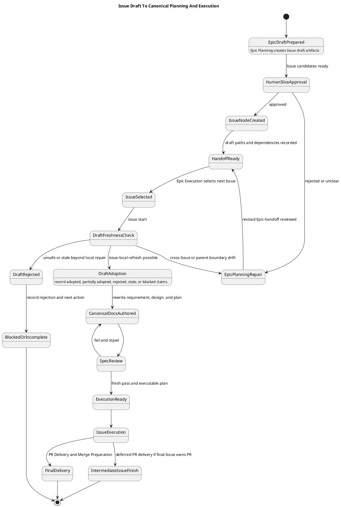

# iss-00309 ChatGPT First Planning Skills And Fallback Route Redesign — Issue 設計書（Strict）

## 0. 文書の位置づけ

この文書は `iss-00309` の canonical `design.md` 候補である。ChatGPT が生成した候補を Codex が比較・検査し、採用判断を `report.md` に記録して canonical docs へ統合した。fresh `spec-reviewer` pass を得るまでは承認済み・execution-ready ではない。

この設計書は実装手順書ではない。実装順序、commit boundary、具体 test command は `plan.md` で扱う。

## 1. 結論

この Issue の設計は、Planning route を次の 4 層に分ける。

| 層 | 責務 | Authority boundary |
|---|---|---|
| Primary planning skills | Initiative / Epic / Issue の通常 planning entrypoint。ChatGPT-first authoring evidence route を先に使う。 | canonical docs の main-orchestrator-owned adoption と planning gate まで。 |
| Manual backup skills | ChatGPT / browser / automation / provider が hard / unrecoverable failure になり、人間が明示承認した場合だけ使う従来 route。 | human-approved emergency backup evidence まで。primary route の自動 fallback 先ではない。 |
| Shared ChatGPT authoring skill | Prompt pack、ZIP/tree output、candidate / draft / validation evidence を作る shared evidence lane。 | evidence-only。canonical adoption / reviewer pass / readiness / PR delivery は所有しない。 |
| Workflow docs / templates | Option 3+、draft lifecycle、final quality Issue policy、handoff-ready vs execution-ready を durable guidance として固定する。 | installed docs/templates source of truth。ADR-only knowledge にしない。 |

Provider-side source of truth は次である。

```text
src/spec_dock/assets/install_root/.agents/skills/
src/spec_dock/assets/spec_dock/docs/
src/spec_dock/assets/spec_dock/templates/
src/spec_dock/cli.py
```

Dogfooding workspace `spec-dock/` は validation / confirmation surface であり、source of truth ではない。

## 2. Strict grade 確認

| 条件 | 該当 | 理由 |
|---|---|---|
| workflow / skill / agent導線を変更する | yes | Primary planning skills と manual backup skills の責務を変更・追加する。 |
| scaffold結果に影響する | yes | installed skills / docs / templates が `spec-dock init/update` で配布される。 |
| テンプレート契約を変更する | yes | Epic plan template に final quality Issue policy と Issue draft handoff を追加する。 |
| 複数Issueが依存する設計判断を含む | yes | Option 3+ と final quality Issue policy が Epic-wide workflow に影響する。 |
| rollback / compatibility / coexistence が必要 | yes | 既存 primary skill names を維持し、従来 route を `-manual` として coexist させる。 |

Critical へ引き上げない理由:

- Secret / credential / private data handling の新規処理は追加しない。
- GitHub mutation / PR creation / merge automation は scope 外。
- 既存 workspace の破壊的 migration は行わない。
- Installed managed assets の追加・更新であり、rollback は provider asset revert と ADR supersede で可能。

## 3. 設計契約

| Design ID | タグ | 契約 |
|---|---|---|
| DES-001 | `[N]` | Existing planning skill names は ChatGPT-first primary route として残す。 |
| DES-002 | `[N]` | `-manual` planning skills を human-approved emergency backup として追加する。 |
| DES-003 | `[N]` | ChatGPT capacity / timeout / browser automation failure は `wait` / `retry` / `recover` を先に行い、自動 manual fallback しない。 |
| DES-004 | `[N]` | Manual backup は hard / unrecoverable failure と explicit human approval evidence がある場合だけ利用可能とする。 |
| DES-005 | `[N]` | `spec-dock-chatgpt-authoring` は shared evidence lane に留め、canonical authority を持たない。 |
| DES-006 | `[N]` | Epic Planning は Issue draft R/D/P と dependency / boundary handoff を作るが、child Issue canonical docs は全件 upfront で正式化しない。 |
| DES-007 | `[N]` | Issue Planning は Issue start 直前または直後に draft adoption / refresh を行い、current repository state / prior completed Issues / dependency state / unresolved ledgers と照合する。 |
| DES-008 | `[N]` | Issue-local で吸収できない drift は Epic Planning repair / clarification / ADR へ戻す。 |
| DES-009 | `[N]` | Multi-Issue implementation Epic は final quality gate / PR delivery Issue を持つ。 |
| DES-010 | `[N]` | Single-Issue / docs-only / no-op Epic は skip rationale と completion evidence により separate final quality Issue を省略できる。 |
| DES-011 | `[N]` | `src/spec_dock/cli.py` `_MANAGED_SKILL_NAMES` に manual skills を追加し、primary skill names を user-facing primary order に残す。 |
| DES-012 | `[N]` | Accepted ADR / research の PlantUML diagrams は provider-side docs / templates に反映する implementation target とする。 |
| DES-013 | `[N]` | Provider-side assets を先に更新し、dogfooding workspace update は validation / mirror consistency として扱う。 |
| DES-014 | `[N]` | Unsupported `authoring` commands を supported examples として案内しない。 |

## 4. Normative Sources

| 種別 | Path / ID | 設計上の扱い |
|---|---|---|
| Parent Epic requirement | `epic-00295/requirement.md` | ChatGPT evidence-only、installed runtime / skill source-of-truth、delivery requirements を継承する。 |
| Parent Epic design | `epic-00295/design.md` | 4 plane architecture、status taxonomy、skill taxonomy、failure modes、PlantUML を継承する。 |
| Parent Epic plan | `epic-00295/plan.md` | C09 / C11 相当の skills/docs/template update と final quality policy を継承する。 |
| EAL-001 | `report.md` | fallback は auto ではなく human-approved emergency backup。 |
| EAL-002 | `report.md` | existing names primary、old route `-manual`。 |
| EAL-003 | `report.md` | final quality gate / PR delivery Issue policy。 |
| EAL-004 | `report.md` | Option 3+ timing。 |
| EAL-005 | `report.md` | accepted ADR を docs/skills/templates へ反映。 |
| Accepted ADR | `artifacts/20260708t161533z-adr-chatgpt-first-option-3-plus-issue-planning-workflow.md` | Option 3+、drift feedback、PlantUML、final quality policy を固定。 |
| Current skills | `src/spec_dock/assets/install_root/.agents/skills/*.md` | 既存 entrypoint と stop gates を更新対象にする。 |
| Current docs | `src/spec_dock/assets/spec_dock/docs/*.md` | Durable workflow guidance update target。 |
| Current templates | `src/spec_dock/assets/spec_dock/templates/epic/plan.md` | Epic handoff / final quality template update target。 |
| Installer registry | `src/spec_dock/cli.py` | Installed skill distribution update target。 |

## 5. Requirement-to-Design Traceability

| 要件 | 設計 |
|---|---|
| REQ-001 | DES-001, DES-003, DES-005 |
| REQ-002 | DES-002, DES-004, DES-011 |
| REQ-003 | DES-002, DES-004 |
| REQ-004 | DES-003 |
| REQ-005 | DES-005 |
| REQ-006 | DES-005, DES-007 |
| REQ-007 | DES-001, DES-005 |
| REQ-008 | DES-006, DES-009, DES-010 |
| REQ-009 | DES-006 |
| REQ-010 | DES-007 |
| REQ-011 | DES-008 |
| REQ-012 | DES-009 |
| REQ-013 | DES-010 |
| REQ-014 | DES-011 |
| REQ-015 | DES-012, DES-013 |
| REQ-016 | DES-009, DES-010, DES-012 |
| REQ-017 | DES-012 |
| REQ-018 | DES-013 |
| REQ-019 | DES-014 |
| REQ-020 | DES-011, DES-012, DES-013, DES-014 |

## 6. 判断範囲と昇格

| 判断 | 所有 | 理由 |
|---|---|---|
| Primary skill names を維持する | Issue owned / accepted by prior interview | `iss-00309` の target decision として user-approved。 |
| Manual backup skill names | Issue owned / accepted by prior interview | `-manual` suffix が user-approved。 |
| Option 3+ Issue Planning timing | ADR owned | Accepted ADR により fixed。Issue では反映のみ。 |
| Multi-Issue final quality policy | ADR / parent Epic inherited | accepted ADR と interview evidence により fixed。 |
| `authoring` runtime command implementation | Out of this Issue | Parent Epic の runtime implementation Issues が扱う。 |
| `authoring adopt` など deferred commands | Out of this Issue | Parent Epic requirement で scope out。 |
| Existing workspace retroactive migration | Out of this Issue | Provider update contract と別 issue / migration policy の対象。 |

Stop / escalate triggers:

- Manual route を automatic fallback にする必要が出た場合。
- `-manual` skill に従来 route を安全に抽出できず、primary skill に混在させる必要が出た場合。
- Option 3+ と異なる Issue Planning timing が必要になった場合。
- Multi-Issue implementation Epic で final quality Issue を置けない workflow constraint が判明した場合。
- `src/spec_dock/cli.py` 以外に undiscovered managed skill registry があり、distribution contract が不明な場合。
- Security / credential / external mutation の新規 scope が出た場合。

## 7. 現状と影響面

### 7.1 Current state

| Surface | Current responsibility | Gap |
|---|---|---|
| `spec-dock-initiative-planning` | Initiative docs / Epic decomposition / ChatGPT evidence relationship | ChatGPT-first primary route と manual fallback boundary が不十分。 |
| `spec-dock-epic-planning` | Epic docs / Issue slicing / Issue handoff | Option 3+ と final quality Issue policy をより明確にする必要がある。 |
| `spec-dock-issue-planning` | Issue R/D/P authoring, draft adoption | draft adoption timing と drift feedback rule を accepted ADR と一致させる必要がある。 |
| `spec-dock-chatgpt-authoring` | Shared evidence lane | Primary planning route との関係、manual fallback failure taxonomy を補強する必要がある。 |
| `-manual` skills | Missing | 従来 route の safe backup surface が存在しない。 |
| `src/spec_dock/cli.py` | Installed managed skill names | `-manual` skills が配布対象にない。 |
| `workflow_chatgpt_authoring_pack.md` | Evidence lane guide | ChatGPT-first primary route / manual backup boundary / Option 3+ diagrams の反映が必要。 |
| `workflow_epic.md` | Epic lifecycle / handoff | accepted ADR diagram / final quality Issue policy を stronger wording にする必要がある。 |
| `workflow_issue.md` | Issue lifecycle / execution | draft lifecycle / just-in-time canonical Issue Planning / drift repair を stronger wording にする必要がある。 |
| `templates/epic/plan.md` | Issue handoff and final quality sections | final quality required/skipped fields and skip evidence need concrete additions。 |

### 7.2 Target architecture by surface

#### Primary planning skills

Primary skills are user-facing entrypoints. Each must begin non-trivial planning by preparing or requesting ChatGPT evidence through `spec-dock-chatgpt-authoring`, when source constraints and backend/tool availability allow it. They must still own scope fit, source-grounded adoption, canonical rewrite, EAL, and reviewer gates.

Required updates:

- Add "ChatGPT-first primary route" to description and operating spine.
- Add `wait` / `retry` / `recover` before manual fallback.
- Add explicit stop if ChatGPT output is unreviewed / stale / unsafe / unverifiable.
- Add handoff back from ChatGPT authoring to planning skill for adoption.
- Add `-manual` route reference only as emergency backup, not normal step.

#### Manual backup skills

Manual backup skills are copies or distilled versions of the current non-ChatGPT-first planning kernels. They must be discoverable but clearly lower-priority.

Required contract:

- Name ends with `-manual`.
- Description includes `human-approved emergency backup`.
- Read-first section requires:
  - hard / unrecoverable ChatGPT / browser / automation / provider failure evidence;
  - explicit human approval;
  - fallback reason recorded in `report.md`;
  - no claim that manual use grants reviewer pass or execution readiness.
- Stop if failure is ordinary capacity / timeout / retryable browser failure.

#### Shared ChatGPT authoring skill

`spec-dock-chatgpt-authoring` remains shared and evidence-only.

Required update:

- It may be invoked by primary planning skills as the primary evidence route for non-trivial planning.
- It does not own canonical docs, reviewer gates, assurance state, execution readiness, PR delivery, Issue finish, or Epic completion.
- It must classify failure outcomes into:
  - retryable / recoverable;
  - blocked / stale evidence;
  - unsafe / rejected output;
  - hard / unrecoverable failure requiring possible human-approved manual backup.

#### Workflow docs

Workflow docs must be durable source for future agents. They must include narrative and diagrams, not only links to ADR.

Required docs:

- `workflow_spec_authoring.md`: evidence-only / EAL / fresh reviewer gate / primary-manual boundary.
- `workflow_chatgpt_authoring_pack.md`: primary route relationship and supported/deferred command boundary.
- `workflow_initiative.md`: Initiative planning ChatGPT-first / manual fallback overview.
- `workflow_epic.md`: Option 3+ draft handoff, Issue path index, final quality Issue policy.
- `workflow_issue.md`: draft adoption lifecycle, just-in-time planning, drift repair, draft-only not execution-ready.
- `phase_plan_epic.md`: checklist for final quality Issue required/skipped, Issue draft path index, intermediate deferred PR delivery.
- `phase_plan_issue.md` and/or `authoring/issue-plan.md`: Issue Planning adoption matrix and execution-ready criteria.
- `authoring/chatgpt-pack.md`: prompt/output contract and forbidden authority claims, if not already sufficient.

#### Epic plan template

`src/spec_dock/assets/spec_dock/templates/epic/plan.md` should be updated so future Epic plans cannot omit accepted ADR obligations.

Required fields:

```text
Epic classification:
  - multi-Issue implementation / single-Issue / docs-only / no-op
Final quality Issue:
  - required / skipped
If required:
  - Issue id
  - tranche: final
  - depends_on: all implementation Issues
  - responsibilities:
    - Epic-wide verification
    - reviewer repair loop
    - manual test summary
    - PR Delivery Gate
    - Merge Preparation Gate
  - intermediate Issue PR policy:
    - deferred PR delivery gate required
If skipped:
  - skip rationale
  - completion evidence
  - single-Issue gate owner
Issue-local draft path index:
  - draft-requirement
  - draft-design
  - draft-plan
Pre-start canonical Issue boundary:
  - canonical Issue docs are formalized by Issue Planning, not Epic Planning upfront
```

#### Issue Planning / Execution docs

Issue docs must separate `handoff-ready` from `execution-ready`.

- `handoff-ready`: Issue draft evidence / path index / dependencies exist and can be routed to Issue Planning.
- `execution-ready`: canonical `requirement.md` / `design.md` / `plan.md`, fresh `spec-reviewer` pass, executable plan, required verification, delegation / fallback evidence, reviewer focus, and unresolved-ledger-free `report.md`.

#### Installed asset distribution

`src/spec_dock/cli.py` `_MANAGED_SKILL_NAMES` must include manual skills. The order must keep primary skill names first.

Recommended ordering:

```python
_MANAGED_SKILL_NAMES = (
    "spec-dock-hub",
    "spec-dock-initiative-planning",
    "spec-dock-epic-planning",
    "spec-dock-epic-execution",
    "spec-dock-issue-planning",
    "spec-dock-issue-execution",
    "spec-dock-chatgpt-authoring",
    "spec-dock-initiative-planning-manual",
    "spec-dock-epic-planning-manual",
    "spec-dock-issue-planning-manual",
    ...
)
```

Alternative acceptable ordering is to place each `-manual` skill immediately after the corresponding primary skill, if docs and tests still show primary first and manual as backup.

## 8. Authority and failure handling

### 8.1 Authority boundary

```text
ChatGPT output / ZIP / tree / validation
  -> evidence-only
  -> review / stage / EAL candidate
  -> main orchestrator adoption or rejection
  -> canonical docs rewrite
  -> fresh spec-reviewer pass
  -> phase promotion / execution handoff
```

Forbidden claims in any generated or updated text:

- canonical adoption completed by ChatGPT;
- `.assurance.json` mutation by ChatGPT;
- authorized_profile decision by ChatGPT;
- fresh `spec-reviewer` / `code-reviewer` / `qa-reviewer` pass by ChatGPT;
- execution-ready;
- PR-ready;
- merge-ready;
- Issue finish;
- Epic completion;
- PR delivery.

### 8.2 Failure taxonomy

| Failure state | Primary handling | Manual route allowed? |
|---|---|---|
| ChatGPT tab capacity saturation | wait / queue / retry | no |
| Timeout | retry / regenerate evidence | no |
| Browser launch failure | restart / recover / retry | no |
| Backend command unset | setup / fail-closed / local-context if explicit | no by default |
| GitHub sync blocked | push/clean/reconcile or explicit `local-context` lower-authority evidence | no by default |
| ZIP unsafe / forbidden authority claim | reject / regenerate | no by default |
| Tool / browser / provider hard and unrecoverable failure | record reason and ask human for approval | yes, only after explicit approval |
| Human declines manual backup | block or wait/retry/recover | no |
| Manual route output lacks reviewer pass | remains evidence / draft | no readiness claim |

### 8.3 Drift handling

Issue Planning may absorb:

- local wording and acceptance seed refinement;
- local test plan concretization;
- file-local implementation plan refresh;
- stale draft wording replacement;
- small local dependency evidence updates that do not change dependency order.

Issue Planning must return to Epic Planning repair / clarification / ADR when drift changes:

- sibling Issue boundary;
- dependency order;
- final quality Issue location or responsibility;
- parent Epic E-RQ / E-AC closure;
- shared architecture;
- workflow policy;
- rollout strategy.

## 9. Diagrams

### 9.1 Primary / manual route boundary



### 9.2 End-to-end workflow to incorporate into docs



### 9.3 Issue draft lifecycle to incorporate into docs



## 10. File / directory change plan

```text
src/spec_dock/assets/install_root/.agents/skills/
  spec-dock-initiative-planning/SKILL.md
  spec-dock-epic-planning/SKILL.md
  spec-dock-issue-planning/SKILL.md
  spec-dock-initiative-planning-manual/SKILL.md       # new
  spec-dock-epic-planning-manual/SKILL.md             # new
  spec-dock-issue-planning-manual/SKILL.md             # new
  spec-dock-chatgpt-authoring/SKILL.md

src/spec_dock/assets/spec_dock/docs/
  workflow_spec_authoring.md
  workflow_chatgpt_authoring_pack.md
  workflow_initiative.md
  workflow_epic.md
  workflow_issue.md
  phase_plan_epic.md
  phase_plan_issue.md
  authoring/issue-plan.md
  authoring/chatgpt-pack.md

src/spec_dock/assets/spec_dock/templates/
  epic/plan.md

src/spec_dock/
  cli.py

tests/
  cli_runtime/
    # extend existing tests or add focused installed asset tests
```

Dogfooding mirrors to inspect after provider-side change:

```text
spec-dock/docs/
spec-dock/templates/
spec-dock/initiatives/.../epic-00295.../report.md
```

## 11. Interface / contract delta

| Contract | Before | After |
|---|---|---|
| Planning skill names | Existing names are general planning entries with ChatGPT evidence references. | Existing names are ChatGPT-first primary route. |
| Old planning route | Mixed into existing planning skill history / guidance. | Explicit `-manual` backup skills, human-approved emergency only. |
| ChatGPT failure handling | Evidence lane failures can be ambiguous. | `wait` / `retry` / `recover` before manual fallback; hard/unrecoverable + human approval required. |
| Issue Planning timing | Draft adoption exists but Option 3+ may remain artifact-local. | Provider docs/templates encode Epic draft handoff + just-in-time canonical Issue Planning. |
| Final quality Issue | Parent Epic defines relay policy but template guidance needs hardening. | Multi-Issue implementation Epic requires final quality Issue; skip conditions explicit. |
| Installed asset distribution | `_MANAGED_SKILL_NAMES` lacks `-manual` skills. | Manual skills installed by `spec-dock init/update`. |

## 12. Compatibility / rollback design

Compatibility commitments:

- Existing primary skill names remain stable.
- Existing non-ChatGPT route is not deleted; it is preserved as `-manual` backup.
- Consumer repos receive new managed skills via existing `spec-dock init/update` managed asset refresh.
- Existing workspace artifacts are not mass-migrated.
- Unsupported commands remain unsupported / omitted from examples.
- Existing `spec-dock-chatgpt-authoring` evidence contract remains stricter, not looser.

Rollback:

1. Revert provider-side skill/docs/template changes.
2. Remove `-manual` skill names from `_MANAGED_SKILL_NAMES`.
3. Supersede accepted ADR if the rollback changes Option 3+ or primary/manual route decisions.
4. Record rollback rationale in target Issue / Epic `report.md`.
5. Re-run installed asset simulation and docs consistency checks.

## 13. Verification implications

Tests / checks should cover:

- Manual skill files exist and have correct frontmatter `name`.
- Manual skill descriptions contain `human-approved emergency backup`.
- Primary skill descriptions and operating spines mention ChatGPT-first route.
- Primary skills do not say manual fallback is automatic.
- `spec-dock-chatgpt-authoring` forbidden claims remain forbidden.
- `_MANAGED_SKILL_NAMES` contains manual skills and primary names.
- `workflow_chatgpt_authoring_pack.md`, `workflow_epic.md`, `workflow_issue.md`, and `templates/epic/plan.md` include Option 3+ and final quality policy wording.
- PlantUML diagrams are present in docs/templates or a documented generated-docs section.
- `spec-dock init/update` simulation produces expected skill files.
- `git diff --check`, `./spec-dock/scripts/spec-dock validate`, and focused pytest pass.

## 14. Plan handoff

`plan.md` should implement in this order:

1. Baseline inventory and characterization.
2. Manual backup skill creation.
3. Primary planning skill route rewrite.
4. ChatGPT authoring skill relationship hardening.
5. Installer managed skill registry update.
6. Workflow docs / PlantUML incorporation.
7. Epic plan template update.
8. Dogfooding validation / mirror consistency.
9. Tests, static checks, reviewer gates, and report evidence.

Stop and re-plan if implementation discovers a second managed skill registry, a docs generator that overwrites manual edits, or a conflict between accepted ADR and current provider docs that cannot be resolved locally.
