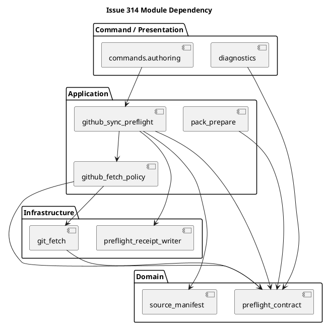
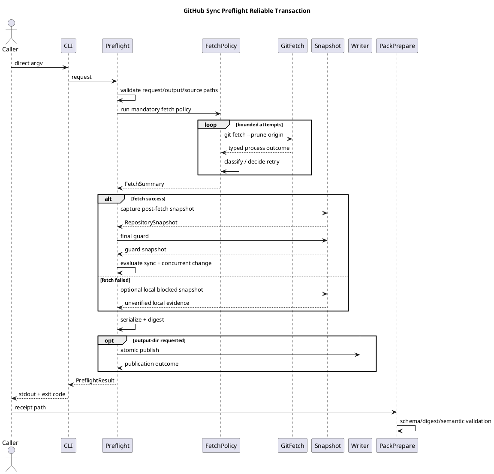

# Oracle Browser Transcript

Conversation: https://chatgpt.com/g/g-p-69fd45693ed48191a7defd8273c37115-for-codex-app/c/6a5443fc-0118-83ee-9e4d-6815ce357ac5

## Prompt

Required repository connector context:
- @GitHub chemitaro/spec-dock
- Current branch: iss-00314-harden-github-sync-preflight-fetch-and-receipt-contract
- Default branch: main
- MUST inspect this GitHub repository with the GitHub connector before answering.
- First inspect the current branch. If the current branch does not exist or cannot be opened, inspect the default branch instead.
- Hard failure condition: if the GitHub connector/app is unavailable, or if the repository, current branch, and default branch cannot be accessed, return immediately with exactly: repository access failed.
- Do not continue from attached files, prompt context, memory, or general knowledge when repository access fails.
- Attached files and prompt-provided context are supplementary only after repository access succeeds.

Use the attached follow-up brief and planning contracts to produce the complete Issue planning candidate set. Preserve evidence-only authority.

## Answer

# Candidate requirement.md

---

種別: 要件定義書（Issue）
ID: "iss-00314"
タイトル: "Harden GitHub Sync Preflight Fetch And Receipt Contract"
関連GitHub: ["#314"]
状態: "draft"
作成者: "ChatGPT evidence candidate"
最終更新: "2026-07-13"
親: ["epic-00295", "init-local-00003"]
-------------------------------------

## iss-00314 GitHub同期preflightのfetch・receipt契約を堅牢化する — Issue要件定義候補

> この文書は `requirement.md` の evidence-only 候補である。canonical adoption、reviewer pass、`.assurance.json` の変更、execution-ready、PR-ready、Issue完了を主張しない。main orchestrator が根拠を再確認し、Evidence Adoption Ledger に採否を記録して canonical artifact へ統合することを前提とする。

## 0. 根拠と入力状態

指定ブランチ `iss-00314-harden-github-sync-preflight-fetch-and-receipt-contract` は GitHub connector で参照でき、指定された HEAD `48a26046c185c9563d073543e66404c8c8c4178f` は Issue #314 の調査artifactを追加する commit として確認できた。 Issue node の `.meta.json` は `iss-00314`、親 `epic-00295`、GitHub Issue #314 との対応を記録している。

この候補セットでは、follow-up brief に示された次の値を検証済み入力ではなく、明示的に提供された planning context として使用する。

* input framing: `context-heavy`
* authorized profile: `strict`
* GitHub-synced preflight: `pass`
* source manifest hash: `f65cb99ce4d79bb1f3f600d1b579d0cb886036b5cfd1c67baf3a761e9dec1a87`
* original incident `chemitaro/taikyohiyou_project#2098` は successor `chemitaro/spec-dock#314` への移管後に close 済み。

現在の branch 上では、Issue `requirement.md` は未記入 scaffold、`design.md` と `plan.md` は assurance compose 待ちの placeholder である。GitHub 上の現在の requirement scaffold も目的欄などが未記入である。

## 1. 概要

### 1.1 目的

`authoring preflight github-sync` を、次の一つの SpecDock-owned operation として堅牢化する。

```text
固定argvの必須fetch
  -> 保守的な失敗分類
  -> 同一capability shapeでの限定retry
  -> fetch後のrepository/source観測
  -> concurrent-change検査
  -> versioned pass/blocked receipt
  -> 安全なatomic publication
```

これにより、fetch の非ゼロ終了を根拠に呼び出し側agentが shell syntax、raw `git fetch`、権限昇格、暗黙fallbackを追加する必要をなくし、成功時と失敗時の双方で検証可能な証跡を返す。

### 1.2 観測可能な成果

完了後に観測できること:

* `github-synced` preflight は、request safety check 後に `git fetch --prune origin` を必ず SpecDock 内部で実行する。
* fetch attempt の終了種別、終了コード、所要時間、分類、分類確度、retry判断を machine-readable receipt から確認できる。
* retry対象と高い確度で判断できた失敗だけが、同一 executable、argv、repository、remote、environment policy、permission shape、output policy のまま限定回数再試行される。
* timeout、authentication、configuration、lock、transport、unknown 等を完全に同定できない場合でも、推測で権限を変えず fail-closed に block できる。
* `--output-dir` を指定すると、shell redirect なしで固定名の JSON receipt が保存される。
* pass だけでなく blocked/stale result も、出力先が安全であれば保存される。
* repository、worktree、HEAD、upstream、remote-tracking HEAD、source manifest は fetch 後の整合した観測として記録される。
* 観測中に branch、HEAD、worktree、remote-tracking ref、source manifest が変化した場合は `concurrent_repo_change` として block される。
* existing JSON/text fields、exit code、`local-context`、explicit default-branch fallback、source-path safety が維持される。
* provider asset、dogfood projection、installed consumer runtime で同一の observable behavior が確認される。
* skill/docs は、fetch failure を権限昇格の証拠にしない運用を明示する。

完了後に観測できてはいけないこと:

* fetch failure を `synced` または `verified` と扱うこと。
* cached remote-tracking ref を fresh fetch evidence と無条件に扱うこと。
* fetch failure を理由に `require_escalated`、shell wrapper、redirect、pipe、`tee`、heredoc、command substitution、inline environment assignment を追加すること。
* agent-owned raw `git fetch` を標準復旧経路にすること。
* `local-context` または default branch へ暗黙に切り替えること。
* raw stderr/stdout、credential-bearing URL、credential helper output、complete environment、token、secret、private key、host-local private path を durable receipt に保存すること。
* Git lock file を自動削除すること。
* canonical `requirement.md`、`design.md`、`plan.md`、`report.md`、`.assurance.json` を receipt writer が上書きすること。
* このIssueの結果を canonical adoption、reviewer pass、execution-ready、PR-ready、merge-ready と表現すること。

### 1.3 Issueの種類

* [x] 既存振る舞いの変更
* [x] 既存振る舞いの不具合修正
* [x] 仕様・文書の明確化
* [x] CLI / script 挙動変更
* [x] workflow / skill / agent導線の変更
* [x] metadata / sync / validate の変更
* [x] 後方互換性を伴う変更
* [x] secret / credential redaction に関係する変更
* [ ] 破壊的migration
* [ ] GitHub repositoryへの新しいmutation
* [ ] canonical docsのruntime自動更新

## 2. 背景・現在の問題

### 2.1 現在の実装

現行実装は、source manifest、worktree、branch、local HEAD の一部を fetch 前に取得する。その後 `origin` の存在を確認し、`_refresh_origin()` を呼び出す。

`_refresh_origin()` 自体は shell を使わず、固定argvの `git fetch --prune origin` を `subprocess.run()` で実行し、stdout/stderrをcaptureする。ただし timeout、retry、非対話化、typed outcome はなく、非ゼロ時は文字列だけを返す。

caller はその文字列を public result に保存せず、`origin_fetch_failed` と一般的な remediation に集約する。

現在の `PreflightResult` は status、refs、heads、source manifest、blockers、remediation を持つが、schema version、fetch attempt、timeout、classification、confidence、diagnostic disposition、snapshot identity、publication evidence を持たない。

CLI は `--format` を持つが、preflight用の `--output-dir` または `--report-path` を持たない。一方、後続の `pack prepare` は入力preflight JSON fileを必要とする。 Command handler は result をstdoutへrenderするだけである。

### 2.2 原インシデント

原インシデントでは次が観測された。

1. direct argv の preflight は一度 pass し、local/remote SHA が一致した。
2. JSON を保存するため shell redirect を加えた再実行で `origin_fetch_failed` となった。
3. explicit raw `git fetch` は成功したが、後続のpreflight内部fetchは再度失敗した。
4. public result に詳細なfetch outcomeがなく、実原因は事後確定できなかった。
5. caller agent が sandbox/network restriction を推測し、preflight全体へ `require_escalated` とredirectを追加してユーザー承認を発生させた。
6. Epic directory内の `rules.md` symlink がsource validationで拒否された件は期待されたfail-closed behaviorであり、主因ではない。

### 2.3 問題の因果関係

```text
fetch nonzero
  -> origin_fetch_failedだけが残る
  -> retryable/permanent/policy/unknownを区別できない
  -> SpecDock-owned retry contractがない
  -> callerが権限不足を推測
  -> command/permission shapeを変更
  -> shell redirectも追加
  -> 不要なapproval
```

本Issueは、単にエラーメッセージを詳しくするのではなく、実行、分類、retry、snapshot、receipt publication の責任を SpecDock 内へ閉じる。

## 3. 親スコープとのtraceability

### 3.1 親Epic

Parent Epic 00295 は、authoring runtimeを evidence generation / validation plane とし、canonical adoption・readiness・PR delivery をauthority planeに残す。provider-side assetsをsource of truthとし、dogfood `spec-dock/` はimplementation authorityではない。

本Issueは主に次のEpic requirementsを補強する。

| Epic requirement    | 本Issueでのtrace                                            |
| ------------------- | -------------------------------------------------------- |
| `E-RQ-RT-003`       | machine-readable receiptとhuman-readable diagnosticsを拡張する |
| `E-RQ-RT-004`       | existing status taxonomyを維持する                            |
| `E-RQ-RT-005`       | passをcommand-local resultに限定する                           |
| `E-RQ-RT-006`       | canonical docsをwriterの対象外にする                             |
| `E-RQ-RT-007`       | explicit output destinationとownershipを導入する               |
| `E-RQ-GH-001`       | repo-aware invocation前のmandatory preflightを維持する          |
| `E-RQ-GH-002`       | repository/ref/source observationを追加・明確化する               |
| `E-RQ-GH-003`       | local/remote HEAD comparisonをfresh fetch後に行う             |
| `E-RQ-GH-004`       | unsafe/stale/diverged statesのfail-closedを維持する            |
| `E-RQ-GH-005`〜`006` | explicit fallback semanticsを変更しない                        |
| `E-RQ-GH-007`       | unavailable observationをverifiedにしない                     |
| `E-RQ-GH-008`〜`011` | `local-context`を明示modeとして維持する                            |
| `E-RQ-NF-001`       | fail-closed                                              |
| `E-RQ-NF-002`       | classification/retry decisionのdeterministic policy       |
| `E-RQ-NF-003`       | secret/private diagnosticを保存しない                          |
| `E-RQ-NF-004`       | provider sourceとdogfood projectionを分離する                  |
| `E-RQ-NF-005`       | docs/helpを実装と一致させる                                       |
| `E-RQ-NF-006`       | safe positive/negative fixtures                          |
| `E-RQ-NF-007`       | old workspaceのin-place migrationを新たに保証しない                |

親Epicはpreflightがclean/synced branchでpassし、dirty、ahead/behind/diverged、missing branch、origin mismatch等をblockすること、provider/installed双方でtestすることを受け入れ条件としている。

### 3.2 再定義しない上位境界

本Issueは次を再定義しない。

* ChatGPT outputのauthorityは `evidence_only`。
* canonical adoptionはmain orchestratorとfresh reviewer gateが所有する。
* `local-context`は明示選択であり、`github_sync: not_verified` を維持する。
* default branch fallbackはexplicit opt-inだけを許可する。
* source-path symlink、parent traversal、repo外absolute pathの拒否を緩めない。
* backend command selection、ZIP review/stage、candidate validation、approval checkのauthority boundary。
* GitHub connectorをruntime subprocessから直接起動する新しいproduct dependency。
* parent EpicのIssue relay/delivery方針。

## 4. Actorと代表シナリオ

### 4.1 Actor

| Actor                            | 役割                                                     |
| -------------------------------- | ------------------------------------------------------ |
| CLI利用者 / Codex agent             | direct argvでpreflightを要求し、stdoutまたはreceiptを消費する        |
| SpecDock command layer           | CLI入力を型付きrequestへ変換し、exit codeとpresentationを返す         |
| Preflight application service    | fetch、snapshot、評価、publicationを一つのoperationとして統括する      |
| Git fetch adapter                | 固定argv、非対話environment、timeout付きでchild processを実行する     |
| Git repository snapshot observer | post-fetch local/remote/source stateを観測する              |
| Receipt writer                   | explicit safe destinationへatomic JSON publicationを行う   |
| `authoring pack prepare`         | pass receiptを読み、内部整合とreceipt bindingを検証する              |
| Maintainer / operator            | permanent failureの設定・credential・network remediationを行う |
| Installed consumer repository    | provider assetから配布された同一runtime behaviorを利用する           |

### 4.2 代表シナリオ

#### SC-001: clean/synced branch

* 前提: worktree clean、named branch、origin/upstreamあり、local HEADとfresh remote-tracking HEADが一致。
* 操作: direct argvで `authoring preflight github-sync` を実行する。
* 結果: `status=pass`、`sync_state=synced`、`github_sync=verified`、fetch attempt、snapshot、source hashesが出力される。
* 観測点: stdout JSON/text、任意のreceipt file、exit code 0。

#### SC-002: retryable failure後の成功

* 前提: 最初のfetchだけが高確度の一時障害として終了し、次の同一fetchが成功する。
* 操作: preflightを一度だけ呼ぶ。
* 結果: SpecDock内部で限定retryされ、callerはcommand shapeを変えない。receiptには全attemptが記録される。
* 観測点: attempt count、classification、retry decision、最終status。

#### SC-003: permanentまたはunknown failure

* 前提: authentication、host identity、repository configuration、execution denial、unknown failureのいずれか。
* 操作: preflightを実行する。
* 結果: 自動権限昇格、fallback、raw fetchを行わず、bounded blocked receiptを返す。
* 観測点: blocker、failure class、confidence、redacted diagnostic、remediation、exit code 1。

#### SC-004: receipt保存

* 前提: 安全なexisting output directoryが明示される。
* 操作: `--output-dir <dir>` 付きでpreflightを実行する。
* 結果: stdout formatに関係なく固定名JSON receiptがatomicに公開される。
* 観測点: fileのvalid JSON、ownership marker、digest、mode、old/new file atomicity。

#### SC-005: concurrent repository change

* 前提: fetch後のsnapshot取得中またはpublication直前にsource、HEAD、branch、worktree、remote-tracking refが変化する。
* 操作: preflightを実行する。
* 結果: `concurrent_repo_change` でblockし、mixed-time snapshotをpassにしない。
* 観測点: snapshot IDs、guard result、blocker。

#### SC-006: pack preparation

* 前提: versioned pass receiptが保存されている。
* 操作: `authoring pack prepare --preflight <receipt>` を実行する。
* 結果: receipt kind/schema/digest/semantic fieldsが検証され、receipt digestとsnapshot IDがprompt pack provenanceへbindingされる。
* 観測点: `provenance.json`、`stale-if.json`、pack prepare result。

## 5. スコープ

### 5.1 MUST — 本Issueの実装・closure対象

1. Mandatory fixed fetchの維持。
2. fetch subprocessのtimeout、非対話environment、captured bytes、typed termination outcome。
3. 保守的なfailure taxonomyとclassification confidence。
4. retry対象をallowlistしたbounded same-capability retry。
5. pass/blocked/stale resultのversioned additive receipt schema。
6. bounded/redacted diagnostic。
7. optional `--output-dir` と固定receipt filename。
8. unsafe/canonical/symlink/non-regular/non-owned targetの拒否。
9. same-directory temporary fileとatomic replaceによるpublication。
10. github-synced modeにおけるpost-fetch snapshot。
11. source manifestを含むpre/post concurrent-change guard。
12. fetch failure時のcached remote refをunverifiedと明示すること。
13. existing stdout JSON/text fieldsとexit codeの互換性。
14. new receiptのdigest/semantic validationとpack provenance binding。
15. legacy unversioned preflight JSONの互換読み取り。
16. provider、dogfood、fresh install/update runtimeのparity検証。
17. installed skillとworkflow docsの運用契約更新。
18. focused unit、hermetic Git、CLI、path safety、projection/install tests。

### 5.2 SHOULD — 本Issueのclosureを妨げない後続候補

* `pack prepare` 実行時にcurrent repository identity、HEAD、worktree、source manifestを再計算してreceiptと比較する。
* explicit operator-configured evidence rootを導入し、repo-local ignored output rootを安全に許可する。
* timeout/cancellation時のchild process tree containmentをplatform別に強化する。
* legacy unversioned receiptの廃止時期をrelease policyとして定める。
* classifier fixture corpusを複数Git/SSH/credential helper versionへ拡張する。

### 5.3 LATER — 本Issueでは実装しない

* backend invocation直前のmandatory final fetch。
* preflight→pack prepare→backend invokeの単一orchestration command。
* immutable/digest-verified launcherまたはoperator-managed privileged capability。
* Git Trace2によるfailure analysis。
* 全authoring writerの共通atomic writerへの一括移行。
* POSIX `openat` / `dir_fd`を使ったcross-platform hostile-race hardening。
* runtimeからGitHub connectorを直接呼び出すintegration。
* raw Git permissionやdanger-full-accessの拡張。

### 5.4 対象外

* mandatory fetchの削除。
* `git ls-remote`、cached refs、connector observationだけによるfetch代替。
* agent-owned raw `git fetch`。
* retryのためのpermission/sandbox変更。
* Git lock fileの自動削除。
* `local-context`への自動降格。
* default branchへのsilent fallback。
* canonical docsまたは`.assurance.json`へのreceipt保存。
* public status taxonomyの大規模再設計。
* user-configurable retry/timeout optionの多数追加。
* 新しいthird-party dependency。

## 6. 機能要件

### RQ-FUNC-001: Mandatory fetch ownership

`github-synced` preflightは、request/destinationの安全性検査を通過した後、SpecDock内部で固定の `git fetch --prune origin` を実行しなければならない。

### RQ-FUNC-002: Fixed execution shape

全attemptは次を維持しなければならない。

* logical executable
* argv
* working repository
* remote name
* environment policy
* timeout policy
* output capture policy
* callerから観測されるpermission/sandbox context

SpecDockはfetch outcomeを理由にこのshapeを変更してはならない。

### RQ-FUNC-003: Noninteractive bounded execution

fetchはterminal promptを要求しないenvironmentで実行し、有限のtimeoutを持たなければならない。timeoutの具体値はmaintainer-confirmed design constantとし、要求定義では固定しない。

### RQ-FUNC-004: Typed attempt evidence

各attemptは少なくとも次を記録しなければならない。

* attempt number
* termination kind
* return codeまたはspawn/timeout/cancel outcome
* duration
* failure class
* classification confidence
* retryable decision
* bounded diagnostic metadata

### RQ-FUNC-005: Conservative classification

classificationはOS-level outcome、timeout、static repository facts、allowlisted diagnostic signalを用いる。exit codeまたはstderr単独をroot causeの確定証拠としてはならない。分類不能は `unknown` とする。

### RQ-FUNC-006: Bounded retry

retryはmaintainer-confirmed finite budgetを持ち、allowlisted retryable classに限る。authentication、host identity、repository configuration、execution denial、spawn failure、cancellation、unknownは自動retryしてはならない。

具体的attempt数、timeout、backoffはdesign constantとして確定し、実行中またはagent判断で変更してはならない。

### RQ-FUNC-007: No escalation or fallback

fetch failureを理由に次を行ってはならない。

* permission escalation
* shell syntax追加
* raw fetchへの切替
* default branch fallbackの追加
* `local-context`への切替
* lock file削除

### RQ-FUNC-008: Versioned additive receipt

receiptはschema versionとreceipt kindを持ち、既存top-level fieldsを削除・renameせず、fetch、repository、freshness、publication、digest evidenceをadditiveに保持しなければならない。

### RQ-FUNC-009: First-class output destination

preflightはoptionalなfirst-class output destinationを持ち、shell redirectなしでmachine-readable JSON receiptを保存できなければならない。

### RQ-FUNC-010: Safe atomic publication

receipt writerは次を満たさなければならない。

* fixed filename
* explicit destination
* symlink component拒否
* canonical/protected root拒否
* non-regular target拒否
* non-owned existing target拒否
* same-directory temporary file
* flushとfile fsync
* atomic replace
* best-effort parent directory durability
* failure時のprevious target保護
* success/blocked双方のpublication

### RQ-FUNC-011: Post-fetch snapshot

github-syncedのfinal sync評価に使う次の値は、fetch終了後に取得しなければならない。

* current branch
* local HEAD
* normalized origin identity
* upstream
* remote-tracking HEAD
* ahead/behind/diverged state
* worktree state
* source manifest
* remote observation source/disposition

### RQ-FUNC-012: Concurrent-change guard

snapshot取得前後およびreceipt公開直前のcritical stateが一致しない場合、preflightはpassしてはならない。

### RQ-FUNC-013: Unverified cached ref

fetchが成功していない場合、cached remote-tracking refを既存互換fieldへ出力することは許容できるが、必ず `unverified_cache` 等の明示dispositionを伴い、`github_sync=verified` にしてはならない。

### RQ-FUNC-014: Pack receipt binding

versioned receiptを `pack prepare` が消費する場合、receipt kind、schema、digest、pass semantics、fetch success、snapshot guardを検査し、receipt digestとsnapshot identityをprompt pack provenanceへ引き継がなければならない。

本IssueのMUST scopeでは、pack時点のcurrent repository再観測までは要求しない。その不保証をdocsとprovenanceで明示する。

### RQ-FUNC-015: Legacy compatibility

legacy unversioned preflight JSONは、既存required fieldsとsemantic checksを満たす限り引き続き読み取れること。legacy inputからnew receipt digestまたはcurrent freshnessを推測してはならない。

### RQ-FUNC-016: Projection parity

provider-side assetをimplementation sourceとし、dogfood projectionとfresh installed consumerでCLI、receipt、tests、docs/skillが同一のobservable contractを持たなければならない。

### RQ-FUNC-017: Documentation contract

installed skill/docsは次を明示しなければならない。

* direct argvで実行する。
* shell wrapper、pipe、redirect、`tee`、heredoc、command substitution、inline env assignmentを使わない。
* `origin_fetch_failed` またはfetch nonzeroを追加権限の証拠にしない。
* retryはSpecDockが所有する。
* raw `git fetch`を標準復旧経路にしない。
* `local-context`またはdefault branchへ暗黙fallbackしない。
* receiptはevidenceでありcanonical authorityではない。
* receipt publication時点以後のremote freshnessは別gateなしには保証しない。

## 7. 非機能要件

### RQ-NF-001: Fail-closed

classification、snapshot、publication、digest、path safetyのいずれかを確定できない場合、成功を推測してはならない。

### RQ-NF-002: Deterministic policy

同じcaptured process outcomeと同じrepository snapshotに対し、failure class、confidence、retry decision、blocker、statusをdeterministicに返すこと。timestampsや実所要時間の一致は要求しない。

### RQ-NF-003: Security and redaction

durable receiptおよびstdoutへ次を出してはならない。

* raw unbounded stdout/stderr
* credential-bearing URL
* URL userinfo/query credential
* credential helper output
* complete environment
* token、password、secret、private key
* host-local private path
* raw HTTP authorization material

diagnostic excerptとdigestはredaction後のsafe representationだけを対象とする。

### RQ-NF-004: Bounded resource use

attempt数、timeout、diagnostic bytes、existing target parse、retry delayはfinite boundを持つこと。具体値はdesignで一元化し、CLI callerが任意に拡張できないこと。

### RQ-NF-005: Testability

clock、sleeper、fetch executor、snapshot observer、writerをtest doubleに置換でき、real network、real GitHub、実時間backoffに依存せずpolicyを検証できること。

### RQ-NF-006: Hermetic integration

Git sync behaviorはlocal bare repositoryとfake executableで検証でき、external networkをrequired test dependencyにしないこと。

### RQ-NF-007: No new dependency

stdlibと既存runtime contractで実現し、新しいthird-party dependencyを導入しないこと。必要になった場合はplan amendmentを行う。

### RQ-NF-008: Portability

Linux/macOS/Windowsで意味論が同じであること。platform固有のdirectory fsync/process tree保証は、サポート可能な範囲を明示し、保証できない部分を成功扱いしない。

### RQ-NF-009: Evidence-only authority

receipt、pack provenance、tests、docs updateはいずれもcanonical adoption、reviewer pass、execution readiness、PR readinessを自己主張しない。

## 8. 振る舞い

### BH-001: clean sync

* Given: requestが安全で、fetchが成功し、post-fetch snapshotがclean/syncedである。
* When: github-synced preflightを実行する。
* Then: pass receiptを返す。
* And: fetch attempt、snapshot、source manifest、freshness dispositionが記録される。

### BH-002: retryable fetch failure

* Given: 最初のattemptがallowlisted retryable failureで、budgetが残る。
* When: preflightを実行する。
* Then: 同一shapeで内部retryする。
* And: callerへ追加permissionや再実行を要求しない。

### BH-003: permanent/unknown failure

* Given: failureがnon-retryableまたはunknownである。
* When: preflightを実行する。
* Then: retryせずblocked receiptを返す。
* And: actionableかつredactedなremediationを返す。

### BH-004: receipt publication

* Given: safe explicit output directoryがある。
* When: `--output-dir` 付きで実行する。
* Then: fixed filenameのJSON receiptをatomic publishする。
* And: stdout resultも既存formatで返す。

### BH-005: unsafe publication target

* Given: symlink、canonical root、repo内非許可先、non-regular target、non-owned targetのいずれか。
* When: receipt publicationを要求する。
* Then: targetを変更せずblockする。

### BH-006: concurrent repository change

* Given: snapshot中にcritical stateが変わる。
* When: final guardを実行する。
* Then: `concurrent_repo_change` でblockする。

### BH-007: fetch failure with cached ref

* Given: cached `origin/<ref>` があるがfetchは失敗する。
* When: preflightを実行する。
* Then: cached valueをfresh verified evidenceにしない。

### BH-008: pack binding

* Given: valid versioned pass receiptがある。
* When: pack prepareがreceiptを読む。
* Then: receipt digest/snapshotを検証・bindingする。
* And: current repository再検証を行っていないことを隠さない。

### BH-009: legacy caller

* Given: callerが `--output-dir` を使わず、既存fieldsだけを読む。
* When: preflightを実行する。
* Then:既存stdout/exit behaviorが維持される。

## 9. 受け入れ条件

### AC-001: mandatory fixed fetch

* Actor: CLI caller。
* 前提: safe github-synced request。
* 操作: preflightを実行する。
* 期待結果: logical command `git fetch --prune origin` が一度以上実行され、shellを介さない。
* 観測点: spy executor / integration fixture。
* 関連: `RQ-FUNC-001`, `RQ-FUNC-002`, `CON-002`。

### AC-002: structured success attempt

* 前提: fetch成功。
* 操作: JSON preflightを実行する。
* 期待結果: version、receipt kind、fetch status、attempt count、return code、duration、policy IDが出力される。
* 関連: `RQ-FUNC-004`, `RQ-FUNC-008`。

### AC-003: bounded retry

* 前提: 最初のattemptがallowlisted retryable class、次が成功。
* 操作: preflightを一度実行する。
* 期待結果: budget内でのみretryし、全attemptのexecution shapeが一致する。
* 関連: `RQ-FUNC-005`, `RQ-FUNC-006`。

### AC-004: non-retryable and unknown

* 前提: authentication、configuration、host identity、execution denial、spawn failure、cancel、unknown。
* 操作: preflightを実行する。
* 期待結果: 自動retryせずblocked resultを返す。
* 関連: `RQ-FUNC-005`〜`007`。

### AC-005: timeout and noninteractive mode

* 前提: child fetchがpolicy timeoutを超える。
* 操作: preflightを実行する。
* 期待結果: attemptはtimeoutとして終了し、terminal prompt待ちの無期限hangにならず、policyに従ってretryまたはblockする。
* 関連: `RQ-FUNC-003`, `RQ-NF-004`。

### AC-006: durable blocked receipt

* 前提: safe output directory、fetch permanent failure。
* 操作: `--output-dir`付きで実行する。
* 期待結果: exit code 1とblocked receipt fileの両方が得られる。
* 関連: `RQ-FUNC-008`〜`010`。

### AC-007: diagnostic redaction

* 前提: stderrにcredential URL、token、host path、non-UTF-8、上限超過textが含まれる。
* 操作: blocked receiptを生成する。
* 期待結果: unsafe valuesがstdout/fileへ現れず、safe code、redacted excerpt、redacted digest、byte count、truncation flagだけが残る。
* 関連: `RQ-NF-003`, `RQ-NF-004`。

### AC-008: pass receipt publication

* 前提: safe explicit output directory、clean/synced branch。
* 操作: textまたはJSON formatで `--output-dir` を指定する。
* 期待結果: stdout formatに関係なくfixed JSON receiptが作成される。
* 関連: `RQ-FUNC-009`, `RQ-FUNC-010`。

### AC-009: output path safety and atomicity

* 前提: symlink/canonical/non-regular/non-owned target、またはreplace前failure。
* 操作: receipt publicationを試みる。
* 期待結果: unsafe targetは変更されず、既存valid receiptはpartial writeで壊れない。
* 関連: `RQ-FUNC-010`。

### AC-010: post-fetch observation

* 前提: remoteがlocal cloneより先へ進んでいる。
* 操作: preflightを実行する。
* 期待結果: fetch後のremote-tracking HEADを観測し、`behind_remote` としてstaleにする。
* 関連: `RQ-FUNC-011`。

### AC-011: concurrent-change blocking

* 前提: source、branch、HEAD、status、remote refのいずれかがsnapshot中に変わる。
* 操作: preflightを実行する。
* 期待結果: passではなく `concurrent_repo_change` を返す。
* 関連: `RQ-FUNC-012`。

### AC-012: cached ref disposition

* 前提: cached remote refあり、fetch失敗。
* 操作: preflightを実行する。
* 期待結果: `github_sync=failed` かつremote evidence dispositionが`unverified_cache`または`unavailable`になる。
* 関連: `RQ-FUNC-013`。

### AC-013: additive compatibility

* 前提: existing callerが旧top-level keysとexit codeを利用する。
* 操作: new runtimeでpreflightを実行する。
* 期待結果:既存keysの意味とexit codeが維持され、new keysはadditiveである。
* 関連: `RQ-FUNC-008`, `RQ-FUNC-015`。

### AC-014: pack receipt integrity

* 前提: valid versioned pass receipt。
* 操作: pack prepareを実行する。
* 期待結果: kind/schema/digest/fetch/snapshot semanticsを検査し、receipt digest/snapshotをprovenanceへ記録する。
* 関連: `RQ-FUNC-014`。

### AC-015: tampered/inconsistent receipt

* 前提: digest mismatch、`status=pass`なのにfetch failed、unstable concurrent guard等。
* 操作: pack prepareを実行する。
* 期待結果: prompt packをpassとして作らずfail-closedにする。
* 関連: `RQ-FUNC-014`, `RQ-NF-001`。

### AC-016: unchanged existing semantics

* 前提: `local-context`、explicit fallback、unsafe source symlink、missing source等の既存fixture。
* 操作: new runtimeで既存testsを実行する。
* 期待結果:既存status/blocker/authority semanticsが維持される。
* 関連: `CON-004`, `CON-005`。

### AC-017: provider/dogfood/install parity

* 前提: provider source、checked-in dogfood projection、fresh init/update target。
* 操作: help、pass、blocked、receipt publication testsを実行する。
* 期待結果:三surfaceで同一contractを示す。
* 関連: `RQ-FUNC-016`。

### AC-018: skill/docs operation policy

* 前提: installed skill/docs。
* 操作: structural assertionsとdocs reviewを行う。
* 期待結果: direct argv、no shell、no escalation、SpecDock-owned retry、no implicit fallback、freshness boundaryが明記される。
* 関連: `RQ-FUNC-017`。

### AC-019: no authority escalation

* 操作: JSON/text/receipt/docsを検査する。
* 期待結果: canonical adoption、reviewer pass、execution-ready、PR-ready等の達成claimがない。
* 関連: `RQ-NF-009`。

### AC-020: full focused quality gate

* 操作: focused unit/CLI/hermetic Git/path safety/install tests、ruff、mypy、SpecDock validate、docs parityを実行する。
* 期待結果: required checksがpassし、意図しないgenerated/bytecode/worktree changesがない。
* 関連: 全MUST requirements。

## 10. 例外・エッジケース

| ID       | 条件                                                | 期待される扱い                                                            |
| -------- | ------------------------------------------------- | ------------------------------------------------------------------ |
| `EC-001` | `git` executable spawn失敗                          | retryせず`spawn_failure`、blocked                                     |
| `EC-002` | fetch timeout                                     | `timeout`としてbounded retryまたはblocked                                |
| `EC-003` | DNS/connection reset/5xx/throttleの明確なsignal       | probable transient class、budget内だけretry                            |
| `EC-004` | authentication/authorization/repository-not-found | private repo maskingを考慮して一群にし、retryせずoperator remediation          |
| `EC-005` | host key / certificate identity failure           | retryせず、policyを自動変更しない                                             |
| `EC-006` | local ref lock contention                         | short bounded retry、lockを削除しない                                     |
| `EC-007` | stderrだけではpermission sourceが不明                    | permission escalationせずunknownまたはnon-retryable                     |
| `EC-008` | empty stdout/stderr                               | unknown、fail-closed                                                |
| `EC-009` | non-UTF-8 diagnostic                              | replacement decode後redactし、raw bytesを保存しない                         |
| `EC-010` | diagnostic上限超過                                    | truncate flagとsafe digestを記録                                       |
| `EC-011` | output directory absent/non-directory             | publication開始前にblock                                               |
| `EC-012` | symlinkまたはbroken symlink target                   | reject/blockし、link先を変更しない                                          |
| `EC-013` | existing targetが他用途のfile/malformed JSON           | non-owned targetとして保存しない                                           |
| `EC-014` | write/fsync/replace failure                       | statusをblockedにし、previous targetを保持                                |
| `EC-015` | publicationだけ失敗しsync observationは成功               | top-level commandはblocked。sync evidenceとpublication evidenceを混同しない |
| `EC-016` | fetch失敗だがcached remote refあり                      | unverified cacheと明示しverifiedにしない                                   |
| `EC-017` | snapshot中のsource edit                             | concurrent changeとしてblock                                          |
| `EC-018` | snapshot中のcheckout/commit                         | concurrent changeとしてblock                                          |
| `EC-019` | user cancellation                                 | retryせずcancel outcome。success receiptを作らない                         |
| `EC-020` | legacy receipt                                    | legacyとして読み、new digest/freshnessを捏造しない                             |
| `EC-021` | versioned receiptのdigest mismatch                 | pack prepareをblock                                                 |
| `EC-022` | output先がrepo内                                     | first-PR候補設計ではblock。将来のignored evidence rootは別判断                   |
| `EC-023` | `local-context`                                   | fetch/retry/publicationのgithub-synced claimsを適用しない                 |
| `EC-024` | explicit default fallback                         | 既存requested/effective ref semanticsを維持                             |
| `EC-025` | source pathのsymlink                               | 既存blockを維持し、緩和しない                                                  |

## 11. 入出力契約例

### 11.1 Candidate CLI

```text
./spec-dock/scripts/spec-dock authoring preflight github-sync
  --repo-root <REPOSITORY_ROOT>
  --ref <BRANCH>
  --source-path <PATH>
  --format json
  --output-dir <EXISTING_EXTERNAL_OUTPUT_DIRECTORY>
```

実際にはshell wrapper、redirect、pipeを付けず、引数配列として実行する。

### 11.2 Candidate receipt filename

```text
github-sync-preflight.receipt.json
```

### 11.3 Candidate top-level shape

```json
{
  "schema_version": 1,
  "receipt_kind": "spec-dock.authoring.github-sync-preflight",
  "status": "blocked",
  "evidence_mode": "github-synced",
  "sync_state": "blocked",
  "github_sync": "failed",
  "requested_ref": "feature/example",
  "effective_ref": "feature/example",
  "local_head": "0123456789abcdef",
  "remote_head": "fedcba9876543210",
  "source_manifest_hash": "sha256-value",
  "fetch": {
    "status": "failed",
    "policy_id": "origin-fetch-v1",
    "attempt_count": 1,
    "final_failure_class": "remote_access_denied_or_not_found",
    "classification_confidence": "probable",
    "attempts": []
  },
  "freshness": {
    "remote_head_disposition": "unverified_cache",
    "snapshot_id": "sha256-value",
    "concurrent_change_check": "stable"
  },
  "publication": {
    "requested": true,
    "status": "published",
    "filename": "github-sync-preflight.receipt.json"
  },
  "blockers": ["origin_fetch_failed"],
  "remediation": ["inspect origin access without changing command permissions"],
  "authority": "evidence_only",
  "adoption_requires": "explicit_eal_disposition",
  "bundle_generation_not_promotion": true,
  "receipt_digest": {
    "algorithm": "sha256-canonical-json-v1",
    "value": "sha256-value"
  }
}
```

この例のenum、field、numeric valueはdesign候補であり、maintainer confirmation前のcanonical contractではない。

## 12. 互換性・migration

### 12.1 CLI互換性

* `--output-dir` はoptional additive flag。
* flagなしのstdout-only pathは維持する。
* `--format text|json` はstdoutだけを制御し、file receiptはJSON固定。
* `pass=0`、`blocked/stale=1`、argument contract error=2を維持する。
* first PRでは`--report-path`を併設しない。

### 12.2 JSON/text互換性

削除・renameしないfield:

* `status`
* `evidence_mode`
* `sync_state`
* `authority`
* `github_sync`
* `requested_ref`
* `effective_ref`
* `local_head`
* `remote_head`
* `source_manifest_hash`
* `source_paths`
* `source_hashes`
* `source_hash_mismatch_checked`
* `blockers`
* `remediation`
* `adoption_requires`
* `bundle_generation_not_promotion`

新fieldはadditiveにする。

### 12.3 Persisted receipt互換性

* new explicit schemaはversion 1。
* existing unversioned JSONは`legacy_unversioned`として一時互換。
* legacyを読む場合はreceipt digest/snapshot bindingなしと明示する。
* breaking schema changeはversion incrementを必要とする。
* automatic migrationまたは既存file rewriteは行わない。

### 12.4 Installed workspace

* `spec-dock init/update` でprovider assetから新runtime/docs/skillが配布される。
* old workspaceへの自動in-place data migrationは導入しない。
* new output fileはexplicit request時だけ作成する。

## 13. セキュリティ・プライバシー

* fetch operationは既存credential/helperを利用できる必要があるが、credential dataをreceiptへ保存しない。
* environmentはinherit-and-sanitize policyを使い、complete environmentは記録しない。
* logical executableとfixed argvは記録可能だが、credential-bearing argumentは存在させない。
* normalized origin identityはuserinfo、query、secretを除去する。
* diagnosticはredaction後のexcerptとdigestだけを保存する。
* redaction前streamのdigestも、low-entropy secret fingerprintとなり得るため保存しない。
* `GIT_TERMINAL_PROMPT=0` 等の非対話化を使う。
* third-party GUI credential helperを完全に抑止できない場合、その不保証を明示し、timeout/cancelでfail-closedにする。
* output fileはprivate-by-default permissionを用いる。
* repo内、canonical root、symlinked pathへの保存をfirst-PR success pathにしない。
* receiptはGitHub mutationを行わない。
* operation failureをpermission evidenceとして扱わない。

## 14. 制約

### CON-001: Provider-side authority

実装sourceは `src/spec_dock/assets/...`。`spec-dock/...` dogfood projectionのみを直接修正してはならない。

### CON-002: Fixed fetch

fetch unitは `git fetch --prune origin` を維持する。変更が必要ならrequirement/design amendmentを行う。

### CON-003: No shell / no escalation

shell syntax、permission escalation、raw agent fetchを解決策にしない。

### CON-004: Explicit evidence mode/fallback

`local-context`とdefault branch fallbackはexplicitな既存optionだけを使う。

### CON-005: Existing contract preservation

既存status、top-level fields、exit codes、source safetyを不要に変更しない。

### CON-006: Secret boundary

raw diagnostics、credentials、complete environmentをdurable evidenceにしない。

### CON-007: Canonical write prohibition

receipt writerはcanonical docs、`.assurance.json`、managed node metadataを変更しない。

### CON-008: Lock safety

Git lock fileを自動削除しない。

### CON-009: Bounded implementation scope

immutable launcher、Trace2、all-writer refactor、backend final fetch、connector integrationをfirst PRへ含めない。

### CON-010: No authority claim

result、docs、tests、reportはcanonical adoption、reviewer pass、readinessを自己主張しない。

## 15. 等級

### 15.1 推奨grade

* [x] `strict`

### 15.2 理由

* 公開CLIへadditive optionを追加する。
* machine-readable receipt schemaを追加する。
* Git/network/filesystem/subprocess behaviorを変更する。
* installed runtime、dogfood projection、skill/docsへ影響する。
* backward compatibilityとsecurity/redactionの検証が必要。
* concurrency/TOCTOUとatomic filesystem behaviorを扱う。
* provider/install parityが必要。

### 15.3 Critical escalation guard

次が必要になった場合は、strictのまま吸収せず再分類する。

* raw credential/helper outputの保存。
* privileged/immutable launcherの導入。
* destructive overwriteまたは既存user file削除。
* GitHubへの新しいcredentialed mutation。
* repo-wide writer migration。
* rollback不能schema migration。
* security boundaryをoperator approvalなしで変更すること。

## 16. 依存関係

### 前提

* Epic 00295のauthoring runtime、preflight、pack prepare、installed skill/docs。
* current branchの調査artifact。
* current preflight tests。
* strict planning contract。
* main orchestratorによるrequirement/design/plan candidate adoptionとfresh review。

### 後続候補

* pack時点current repository revalidation。
* backend invocation直前final fetch/check。
* generic authoring atomic writer。
* immutable launcher/capability。
* connector-visible observation gapの解消。

## 17. 設計・計画への引き渡し

Designで固定する事項:

1. 最小component split。
2. process outcomeとfailure taxonomy。
3. classification confidence。
4. retry decision tableとpolicy constants。
5. inherited/sanitized environment。
6. receipt schema/digest。
7. output path safetyとatomic writer。
8. post-fetch snapshotとconcurrent guard。
9. pack receipt integrity boundary。
10. CLI/text/JSON compatibility。
11. provider/dogfood/install projection。
12. rollback。
13. first PRとLATERの境界。

Planで分解する成果:

1. versioned fetch outcome tracer。
2. conservative classification/retry/redaction。
3. first-class atomic receipt publication。
4. post-fetch snapshot/concurrent guard。
5. pack receipt binding/legacy compatibility。
6. provider/dogfood/install parity。
7. docs/skill更新。
8. final QA/code/spec gate。

## 18. 未確定事項・maintainer decision

### Q-001: Output API

* 選択肢:

  * A: `--output-dir` + fixed filename。
  * B: `--report-path`。
  * C: 両方。
* 候補推奨: A。
* 理由: basename、拡張子、canonical filename等の入力面を減らす。
* 解決期限: canonical design adoption前。
* 影響: CLI、writer、tests、docs。

### Q-002: Retry/timeout constants

* 決める値:

  * total attempt budget
  * timeout per attempt
  * retry delay
  * jitterの有無
* 候補推奨:

  * total attempts 2
  * timeout 60 seconds/attempt
  * single fixed delay 250 ms
  * first PRではjitterなし
* 理由: bounded、deterministic、over-engineering回避。
* 解決期限: implementation start前。
* 注記: requirement自体はこの数値を固定しない。

### Q-003: Diagnostic bound

* 決める値: safe excerpt上限。
* 候補推奨: redaction後UTF-8 1024 bytes/attempt。
* digest対象: redacted full diagnostic。
* 解決期限: implementation start前。

### Q-004: Output root

* 選択肢:

  * A: first PRはexisting external directoryのみ。
  * B: repo-local ignored rootも許可。
  * C: operator-configured root。
* 候補推奨: A。B/Cはfollow-up。
* 理由: preflight自身がrepoをdirtyにすることとpath policy拡大を避ける。
* 解決期限: design adoption前。

### Q-005: Pack freshness boundary

* 選択肢:

  * A: first PRはreceipt integrity/bindingのみ。
  * B: current repo HEAD/source/worktreeをpack時に再観測。
  * C: backend直前まで統合。
* 候補推奨: AをMUST、BをSHOULD、CをLATER。
* 解決期限: design adoption前。

### Q-006: Remote observation terminology

Parent Epicはconnector-visible branch/HEADを要求するが、現行CLIのdefault observerはfetch後のlocal remote-tracking refを読む。本Issue候補はそれを `fetched_remote_tracking_ref` と正直に記録し、direct connector integrationはLATERとする。

* maintainer decision:

  * Epic wordingを実装に合わせて明確化するか。
  * 別Issueでconnector observationを追加するか。
* 解決期限: Issue closure前。first PR implementationはtruthful fieldがあれば進行可能。

### Q-007: PR delivery route

Issue 314はoriginal Epic sequence完了後のsuccessor maintenance Issueである可能性が高い。既存parent planの旧final Issueへ暗黙にdeliveryを再委譲してはならない。

* 候補推奨: standalone maintenance Issueとして通常のPR Delivery / Merge Preparation Gateを使う。
* 代替: parent Epic planに新しいfinal delivery Issueを明示し、dependency edgeを追加する。
* 解決期限: implementation start前、遅くともFinal Exit Contract確定前。

## 19. Candidate review checklist

* [ ] すべてのMUST requirementがdesign IDへ追跡されている。
* [ ] Q-001〜Q-005のmaintainer decisionがcanonical designへ反映されている。
* [ ] Q-006のparent Epic contract gapが隠されていない。
* [ ] Q-007のdelivery routeが明示されている。
* [ ] numeric defaultsがrequirementとして無断固定されていない。
* [ ] LATER項目がfirst PR acceptanceへ混入していない。
* [ ] authority boundaryが維持されている。
* [ ] fresh `spec-reviewer` verdictは別途必要である。

---

# Candidate design.md

---

種別: 設計書（Issue）
ID: "iss-00314"
タイトル: "Harden GitHub Sync Preflight Fetch And Receipt Contract"
Issue Grade: "strict"
状態: "draft"
作成者: "ChatGPT evidence candidate"
最終更新: "2026-07-13"
関連Requirement: ["requirement.md"]
関連Plan: ["plan.md"]
関連Report: ["report.md"]
親: ["epic-00295", "init-local-00003"]
-------------------------------------

## iss-00314 GitHub同期preflightのfetch・receipt契約を堅牢化する — Issue設計候補

> この設計はevidence-only候補である。以下の `[N]` は「この候補セット内でplanが依存する固定案」を意味し、canonical adoption済みという意味ではない。maintainerが選択を変更する場合は、requirement/design/planを整合させて再レビューする。

## 0. 設計コミットメント記号

| 記号    | 意味                               |
| ----- | -------------------------------- |
| `[N]` | 本候補planが前提とするnormative candidate |
| `[P]` | maintainer confirmationを要する有力案   |
| `[O]` | 未解決。implementation start前に解決     |
| `[E]` | 本Issue外。follow-up / Epic / ADR候補 |
| `[I]` | 説明例。実装拘束なし                       |

## 1. Strict grade確認

### Strictとする理由

* public CLI optionを追加する。
* JSON receipt schemaを追加する。
* subprocess、Git、filesystem、security redactionを変更する。
* provider、dogfood、installed runtimeへ波及する。
* backward compatibility、failure recovery、TOCTOUを扱う。
* step-local code reviewとissue-wide QA/code/spec reviewが必要である。

### Criticalへ引き上げない理由

本候補は既存fetchの実行を堅牢化し、credentialの保存・公開やGitHub mutationを新設しない。writerはcanonical/user-authored fileへの書込みを拒否し、outputはexplicit external directoryへ限定する。

次が必要になれば停止してCritical再分類する。

* raw credential/helper outputの保存。
* privileged immutable launcher。
* destructive target overwrite。
* repository外のcredentialed mutation。
* rollback不能migration。
* user file自動削除。
* broad shell/raw Git permission。

## 2. Executive design summary

### 2.1 設計結論

`run_github_sync_preflight()` を、一回のSpecDock-owned transactionとして再構成する。

```text
request safety
  -> mandatory fixed fetch with bounded policy
  -> local snapshot after fetch
  -> sync evaluation
  -> final concurrent-change guard
  -> versioned receipt serialization
  -> optional safe atomic publication
  -> stdout presentation
```

### 2.2 First-PR設計

First PRには次を含める。

1. typed process outcome。
2. conservative classifier + confidence。
3. bounded same-shape retry。
4. noninteractive/sanitized environment。
5. versioned additive receipt。
6. bounded/redacted diagnostic。
7. `--output-dir` + fixed filename。
8. receipt-specific atomic writer。
9. post-fetch snapshot。
10. concurrent-change guard。
11. pack receipt integrity/binding。
12. legacy compatibility。
13. provider/dogfood/install parity。
14. skill/docs guidance。

### 2.3 First PRに含めないもの

* immutable launcher。
* Trace2。
* all-writer refactor。
* `openat`/`dir_fd` hardening。
* backend invocation直前fetch。
* pack時点current repo full revalidation。
* direct GitHub connector integration。
* configurable retry knobs。
* generic workflow orchestration command。

## 3. Normative sources

| 種別                      | Path / ID                                                                                       | 意味                                                                      |
| ----------------------- | ----------------------------------------------------------------------------------------------- | ----------------------------------------------------------------------- |
| Parent Epic requirement | `epic-00295/requirement.md`                                                                     | GitHub sync、fail-closed、provider/install parity、evidence-only authority |
| Parent Epic design      | `epic-00295/design.md`                                                                          | plane separation、provider authority、layer ownership                     |
| Parent Epic plan        | `epic-00295/plan.md`                                                                            | original preflight sliceとfinal quality policy                           |
| Current implementation  | `application/authoring_pack/github_sync_preflight.py`                                           | fixed fetch、mixed-time observation、generic blocker                      |
| Current contract        | `domain/authoring_pack/preflight_contract.py`                                                   | existing additive compatibility surface                                 |
| Current CLI             | `commands/authoring.py`                                                                         | stdout-only preflight surface                                           |
| Current tests           | `tests/cli_runtime/test_authoring.py`                                                           | clean/dirty/ahead/behind/diverged/fallback/source safety baseline       |
| Installed skill         | `spec-dock-chatgpt-authoring/SKILL.md`                                                          | evidence laneとcurrent generic failure guidance                          |
| Research evidence       | `artifacts/20260713t014710z-research-chatgpt-pro-github-sync-preflight-reliability-analysis.md` | architecture/failure/output/freshness options                           |
| Original incident       | `taikyohiyou_project#2098`                                                                      | permission/shell escalation chain                                       |
| Follow-up brief         | planning attachment                                                                             | branch/profile/source hash/output obligations                           |

現行testsはclean/synced、source symlink、dirty/staged/untracked、ahead/behind/diverged、fetch-before-comparison、branch/fallback等を既に検証している。これらは置換せずregression baselineとして維持する。

## 4. Requirement-to-design traceability

| Requirement         | Design ID            | 扱い                                        |
| ------------------- | -------------------- | ----------------------------------------- |
| `RQ-FUNC-001`〜`003` | `DES-001`, `DES-002` | fixed fetch adapterとexecution policy      |
| `RQ-FUNC-004`       | `DES-003`            | typed attempt/result                      |
| `RQ-FUNC-005`       | `DES-004`            | conservative classification               |
| `RQ-FUNC-006`       | `DES-005`            | bounded retry                             |
| `RQ-FUNC-007`       | `DES-006`            | no escalation/fallback policy             |
| `RQ-FUNC-008`       | `DES-007`            | schema v1 additive receipt                |
| `RQ-FUNC-009`〜`010` | `DES-008`, `DES-009` | CLI output-dirとatomic writer              |
| `RQ-FUNC-011`〜`013` | `DES-010`, `DES-011` | post-fetch snapshotとfreshness disposition |
| `RQ-FUNC-014`〜`015` | `DES-012`            | pack bindingとlegacy path                  |
| `RQ-FUNC-016`       | `DES-013`            | provider/dogfood/install parity           |
| `RQ-FUNC-017`       | `DES-014`            | docs/skill contract                       |
| `RQ-NF-001`〜`009`   | `DES-003`〜`DES-015`  | failure/security/testability/rollback     |

## 5. Decision radius

### Issue-localに所有する判断

* subprocess outcomeのshape。
* failure taxonomyとconfidence。
* retry allowlist。
* receipt schema。
* output-dir/fixed filename。
* receipt writer safety。
* post-fetch snapshot。
* concurrent guard。
* pack receipt binding。
* docs wording。

### Implementationへ委譲する判断

* private helper names。
* regexの細部。ただし分類意味論を変更しない。
* fixture implementation。
* safe redaction helperの内部構造。
* serialization helperのprivate分割。
* platform capability probeの実装方法。

### 上位またはfollow-upへ送る判断

* runtimeからGitHub connectorを直接呼ぶか。
* immutable launcher/capability。
  -全writerの共通化。
* backend final fetch/orchestration。
* legacy schema deprecation release。
* repo-local approved evidence root。
* process-group cancellation hardening。

## 6. 目標設計契約

| Design ID | 契約                                                                                             |
| --------- | ---------------------------------------------------------------------------------------------- |
| `DES-001` | `[N]` github-synced preflightはrequest safety後、SpecDock-owned fixed fetchを実行する                  |
| `DES-002` | `[N]` fetch adapterはfixed argv、shellなし、timeout、noninteractive/sanitized env、bytes captureを所有する |
| `DES-003` | `[N]` process outcomeとattempt evidenceをimmutable dataで表現する                                     |
| `DES-004` | `[N]` classifierはhybridかつconservativeで、confidenceを返し、unknownへfail-closedする                     |
| `DES-005` | `[N]` retryはallowlisted classだけをsame-shapeでbounded実行する                                         |
| `DES-006` | `[N]` runtimeはpermission escalation、shell syntax、fallback、lock削除を行わない                          |
| `DES-007` | `[N]` existing top-level fieldsを維持するversioned additive receipt                                 |
| `DES-008` | `[P]` output APIはoptional `--output-dir`、file名は固定                                              |
| `DES-009` | `[N]` receipt-specific safe atomic writer。generic writer refactorはしない                          |
| `DES-010` | `[N]` github-synced final observationはfetch後に行う                                                |
| `DES-011` | `[N]` pre/post snapshot guardでmixed-time passを防ぐ                                               |
| `DES-012` | `[N]` pack prepareはv1 receipt integrityを検証・bindingし、legacyを互換readする                            |
| `DES-013` | `[N]` provider assetがsource、dogfood/installはprojection                                         |
| `DES-014` | `[N]` installed skill/docsへno-shell/no-escalation/freshness boundaryを記載                        |
| `DES-015` | `[N]` rollbackはadditive fields/flagを外せる。既存data migrationなし                                     |

## 7. 最小component split

過剰なclass hierarchyやgeneric frameworkを導入せず、次の分割とする。

```text
domain/authoring_pack/preflight_contract.py
  immutable public/result data and enums

application/authoring_pack/github_fetch_policy.py        [new]
  classifier, retry decision, attempt orchestration

application/authoring_pack/github_sync_preflight.py
  end-to-end use-case orchestration and sync evaluation

infra/authoring_pack/git_fetch.py                        [new]
  subprocess execution adapter

infra/authoring_pack/preflight_receipt_writer.py         [new]
  receipt-specific path validation and atomic publication

application/authoring_pack/pack_prepare.py
  versioned receipt validation and provenance binding

commands/authoring.py
  CLI option and dependency wiring

presentation/authoring_pack/diagnostics.py
  additive JSON/text rendering
```

### 分割理由

* subprocessとfilesystemはinfra concern。
* retry/classificationはapplication policy。
* immutable result shapeはdomain contract。
* end-to-end sequencingは既存application use case。
* writerは本Issue固有に閉じ、全authoring writerを一括抽象化しない。
* testabilityはProtocol階層ではなく、小さなcallable typeとdependency injectionで確保する。

### 最小dependency injection

```python
FetchExecutor = Callable[[GitFetchExecutionRequest], GitProcessOutcome]
SnapshotObserver = Callable[[SnapshotRequest], RepositorySnapshot]
ReceiptPublisher = Callable[[ReceiptPublicationRequest], PublicationOutcome]
Clock = Callable[[], datetime]
MonotonicClock = Callable[[], float]
Sleeper = Callable[[float], None]
```

default implementationはproduction adapter、testsはfake/spyを渡す。新しいDI containerは導入しない。

## 8. Data shapes

### 8.1 Failure taxonomy

```python
FetchFailureClass = Literal[
    "timeout",
    "transient_transport",
    "remote_throttled",
    "local_ref_lock_contention",
    "remote_access_denied_or_not_found",
    "host_identity_failure",
    "repository_configuration",
    "execution_or_filesystem_denied",
    "spawn_failure",
    "cancelled",
    "unknown",
]

TerminationKind = Literal[
    "exited",
    "timeout",
    "spawn_error",
    "cancelled",
]

ClassificationConfidence = Literal[
    "certain",
    "probable",
    "unknown",
]
```

### 8.2 Process outcome

```python
@dataclass(frozen=True)
class GitProcessOutcome:
    return_code: int | None
    termination: TerminationKind
    stdout: bytes
    stderr: bytes
    duration_ms: int
    os_error_kind: str | None = None
```

この型はraw process captureであり、そのままreceiptへserializeしない。

### 8.3 Classification

```python
@dataclass(frozen=True)
class FetchClassification:
    failure_class: FetchFailureClass | None
    confidence: ClassificationConfidence
    retryable: bool
    diagnostic_code: str | None
```

### 8.4 Safe diagnostic

```python
@dataclass(frozen=True)
class SafeDiagnostic:
    code: str | None
    excerpt: str | None
    redacted_sha256: str | None
    source_byte_count: int
    excerpt_byte_count: int
    truncated: bool
    redaction_applied: bool
```

`redacted_sha256` はredaction後のfull diagnosticをhashする。raw unredacted streamのhashは保存しない。

### 8.5 Fetch attempt/summary

```python
@dataclass(frozen=True)
class FetchAttempt:
    attempt_number: int
    duration_ms: int
    return_code: int | None
    termination: TerminationKind
    failure_class: FetchFailureClass | None
    confidence: ClassificationConfidence
    retryable: bool
    diagnostic: SafeDiagnostic


@dataclass(frozen=True)
class FetchSummary:
    status: Literal["success", "failed", "cancelled", "not_started", "not_applicable"]
    policy_id: str
    executable: str
    argv: tuple[str, ...]
    remote: str
    timeout_seconds: float
    environment_policy_id: str
    execution_policy_context: Literal["unreported"]
    attempts: tuple[FetchAttempt, ...]
```

### 8.6 Repository snapshot

```python
@dataclass(frozen=True)
class RepositorySnapshot:
    normalized_origin: str | None
    branch: str | None
    local_head: str | None
    upstream: str | None
    effective_ref: str | None
    remote_head: str | None
    remote_head_disposition: Literal[
        "fetched_remote_tracking_ref",
        "unverified_cache",
        "unavailable",
        "not_applicable",
    ]
    worktree_state: tuple[str, ...]
    source_manifest: SourceManifest
    snapshot_id: str
```

`normalized_origin` はuserinfo、query、credentialを除く。absolute local repo pathはdurable receiptへ保存しない。

### 8.7 Freshness evidence

```python
@dataclass(frozen=True)
class FreshnessEvidence:
    observed_at: str
    snapshot_id: str | None
    final_guard_snapshot_id: str | None
    concurrent_change_check: Literal[
        "stable",
        "changed",
        "not_run",
        "not_applicable",
    ]
    remote_head_disposition: str
```

### 8.8 Publication evidence

```python
@dataclass(frozen=True)
class PublicationEvidence:
    requested: bool
    status: Literal[
        "not_requested",
        "published",
        "failed",
        "rejected",
    ]
    filename: str | None
    blocker: str | None
```

absolute output pathはpersisted receiptへ含めない。callerは自身が指定したdirectoryとfixed filenameからpathを解決する。

## 9. Candidate policy constants

次はrequirementではなくmaintainer-confirmation対象のcandidate design valueである。

```text
FETCH_POLICY_ID               = origin-fetch-v1
MAX_ATTEMPTS                  = 2
TIMEOUT_SECONDS_PER_ATTEMPT   = 60
BACKOFF_SECONDS               = 0.25
JITTER                        = none in first PR
DIAGNOSTIC_EXCERPT_MAX_BYTES  = 1024
RECEIPT_SCHEMA_VERSION        = 1
RECEIPT_FILENAME              = github-sync-preflight.receipt.json
```

### 判断理由

* total attempts 2は「初回+一度の内部retry」に限定する。
* 60秒は無期限hangを防ぎつつ通常fetchへ余裕を与える候補値。
* 一回だけのretryにrandom jitterを導入する運用利益は小さく、deterministic testsを優先する。
* 1024 bytesはremediationに必要な短いsignalを残し、raw diagnostic over-captureを避ける候補値。
* CLIからbudget/timeoutを変更させず、policy IDで監査可能にする。

値を変更する場合はdesign/plan amendmentを行い、tests/docsを同時に更新する。

## 10. Fetch execution environment

### Inherited-but-sanitized policy

保持するもの:

* `PATH`
* `HOME`
* `SSH_AUTH_SOCK`
* proxy settings
* CA/certificate settings
* existing credential helper resolutionに必要なenvironment

強制・除去するもの:

```text
GIT_TERMINAL_PROMPT=0
LC_ALL=C
LANG=C

remove:
GIT_TRACE
GIT_TRACE_PACKET
GIT_TRACE_CURL
GIT_CURL_VERBOSE
GIT_TRACE2
GIT_TRACE2_EVENT
GIT_TRACE2_PERF
```

### 理由

* credential helperそのものを無効化すると既存の正常認証を壊すため、全面allowlistにはしない。
* terminal promptを止める。
* diagnostic classifierをlocaleに依存しにくくする。
* trace outputによるcredential/path over-captureを防ぐ。
* environment内容はreceiptへ保存せず、`environment_policy_id`だけを記録する。

### 制限

第三者GUI credential helperを完全に停止できる保証は置かない。timeout/cancellationでfail-closedとし、必要なplatform-specific suppressionはfollow-upとする。

## 11. Classification design

### 判定優先順位

1. cancellation。
2. timeout。
3. spawn/OSError。
4. static repository configuration facts。
5. high-confidence local ref lock signal。
6. host identity / access / configuration signal。
7. transient transport / throttling signal。
8. unknown。

### Exit codeの扱い

* `0` はsuccess。
* nonzeroはfailureの事実だけを示す。
* nonzeroだけからretryabilityまたはpermission requirementを決めない。

### stderrの扱い

* allowlisted signalとしてのみ使用する。
* Git/SSH/helper/provider差を考慮してconfidenceを`probable`以下にする。
* unmatched、ambiguous、multiple conflicting signalは`unknown`。
* “permission denied”という文字列だけでsandbox denialと断定しない。

### Failure decision table

| Class                               | Confidence       |   Retry | Final behavior                             |
| ----------------------------------- | ---------------- | ------: | ------------------------------------------ |
| `timeout`                           | certain          | budget内 | exhausted後blocked                          |
| `transient_transport`               | probable         | budget内 | exhausted後blocked                          |
| `remote_throttled`                  | probable         | budget内 | exhausted後blocked                          |
| `local_ref_lock_contention`         | probable/certain | budget内 | lock削除せずblocked                            |
| `remote_access_denied_or_not_found` | probable         |      no | operator access remediation                |
| `host_identity_failure`             | probable         |      no | host policy remediation                    |
| `repository_configuration`          | certain/probable |      no | origin/refspec remediation                 |
| `execution_or_filesystem_denied`    | certain/probable |      no | policy/filesystem inspection。no escalation |
| `spawn_failure`                     | certain          |      no | executable/config remediation              |
| `cancelled`                         | certain          |      no | abort                                      |
| `unknown`                           | unknown          |      no | fail-closed                                |

### Retry invariants

attempt間で次のserialized identityを比較し、異なればinternal contract violationとしてblockする。

```text
executable
argv
cwd/repository identity
remote
timeout
environment policy ID
output capture policy
execution policy context
```

## 12. Receipt schema

### 12.1 Versioning

* `schema_version: 1`
* `receipt_kind: "spec-dock.authoring.github-sync-preflight"`
* v1内はadditive fieldsのみ。
* field削除、rename、意味変更はversion increment。
* legacy unversioned resultは別pathで読む。

### 12.2 Top-level compatibility

既存fieldをtop-levelに維持する。new nested objects:

```text
repository
fetch
freshness
publication
receipt_digest
```

### 12.3 Receipt digest

1. `receipt_digest` fieldを除いたpayloadを作る。
2. UTF-8、`sort_keys=True`、compact separatorsでcanonical JSON化する。
3. SHA-256を計算する。
4. algorithm/valueを追加する。
5. persisted receiptを再読したconsumerは同じ規則で検証する。

### 12.4 Pass semantic invariant

versioned receiptが`status=pass`であるには少なくとも次が必要。

* `evidence_mode=github-synced`
* `fetch.status=success`
* `github_sync=verified`
* `sync_state=synced`
* `remote_head_disposition=fetched_remote_tracking_ref`
* `concurrent_change_check=stable`
* no blockers
* valid source manifest
* valid digest

`local-context`は別semantic invariantを使い、fetchは`not_applicable`。

### 12.5 Publication failure semantics

Sync evaluationとpublicationは別dimensionとして扱う。

例:

```text
status=blocked
sync_state=synced
github_sync=verified
publication.status=failed
blocker=receipt_publication_failed
```

これは「Git syncは観測できたが、requested durable artifact contractを満たせなかった」ことを意味する。pack prepareはtop-level statusがpassでないため進まない。

## 13. Output APIとsafe writer

### 13.1 CLI

```text
--output-dir <EXISTING_DIRECTORY>
```

* optional。
* `--format`はstdout format。
* persisted receiptはJSON固定。
* first PRでは`--report-path`を追加しない。

### 13.2 First-PR safe-root policy

`output_dir`は次を満たすexisting directoryに限定する。

* repository root外。
* lexical parent traversalなし。
* leaf/ancestorにsymlinkまたはbroken symlinkなし。
* canonical SpecDock roots外。
* regular directory。
* platform tempまたはcaller/operatorが用意した外部evidence directory。

repo-local outputはfirst PRでは `receipt_output_inside_repository` としてblockする。これによりpreflight自身がuntracked fileを作り、観測したclean stateを直後に破壊する問題を避ける。

### 13.3 Target ownership

targetが存在しない場合は新規作成できる。

targetが存在する場合、次を満たすreceiptだけ置換できる。

* regular file。
* symlinkではない。
* bounded JSON parseに成功。
* matching `receipt_kind`。
* supported schemaまたはknown legacy ownership marker。

その他は`non_owned_existing_receipt_target`として変更しない。

### 13.4 Atomic algorithm

```text
1. lstatでoutput dir/ancestors/targetを検査
2. same directoryにO_CREAT|O_EXCL temporary file
3. mode 0600
4. payload全量write
5. flush + fsync(temp file)
6. directory/targetを再検査
7. os.replace(temp, target)
8. supported platformではparent directory fsync
9. final targetがregular non-symlinkであることを確認
10. failure時はtempをbest-effort cleanup
```

POSIX hostile concurrent parent swapを完全に閉じる`openat/dir_fd`はLATER。first PRではpre/post lstat、outside-repo、same-directory replaceでriskを限定する。

### 13.5 Blocked receipt

fetch、snapshot、source hash、concurrent guard等のblocked/stale resultもpublishする。destination自体がunsafeな場合はfileを作らずstdoutでblockerを返す。

## 14. Freshness transaction

### 14.1 Local-context

現行pathを維持し、GitHub fetch transactionを適用しない。

### 14.2 Github-synced sequence

```text
T0 request/output/source path safety
T1 repository identity guard
T2 mandatory bounded fetch
T3 post-fetch snapshot start guard
T4 branch/HEAD/upstream/remote/worktree/source manifest observation
T5 sync contract evaluation
T6 final critical state guard
T7 receipt serialization/digest
T8 optional atomic publication
T9 stdout render
```

### 14.3 Source manifest

* lexical path/symlink safetyはT0。
* file content hashingはfetch後のT4。
* manifest hashing前後でcritical inventory/HEAD/worktreeを比較する。
  -変更を検知した場合は`concurrent_repo_change`。
* local-contextのexisting behaviorは別pathで維持する。

### 14.4 Snapshot ID

次のnormalized valuesをcanonical JSON化してhashする。

```text
normalized origin identity
branch
local HEAD
upstream
effective ref
remote HEAD
remote head disposition
worktree category digest
source manifest hash
```

absolute repo path、raw status lines、credential URLは含めない。

### 14.5 Fetch failure

fetch failure時もlocal source evidenceをbounded snapshotとして取得できるが、remote freshnessは次のいずれかにする。

* `unverified_cache`
* `unavailable`

`github_sync=failed`を維持し、passにしない。

## 15. Pack freshness validation boundary

### First PR — MUST

`pack prepare`はversioned receiptについて次を行う。

* schema/kind validation。
* digest recomputation。
* existing source manifest internal consistency。
* status/pass semantic invariant。
* fetch success。
* fetched remote disposition。
* stable concurrent guard。
* receipt digest、snapshot ID、observed_atをprompt pack provenance/stale-ifへcopy。
* tamper/inconsistent receiptをblock。
* legacy unversioned receiptを互換read。
* legacy inputからnew freshness claimを作らない。

### First PRでは保証しないこと

* pack実行時点のcurrent local HEAD再観測。
* pack実行時点のsource再hash。
* remote再fetch。
* backend invocation直前freshness。

docsとprovenanceは、receiptが「preflight observation時点」のevidenceであることを明記する。

### Follow-up — SHOULD/LATER

* SHOULD: pack時点のcurrent local state revalidation。
* LATER: backend直前final fetchまたはsingle orchestration。

## 16. CLI/presentation compatibility

### Command args

`AuthoringPreflightGithubSyncArgs` に次をadditive追加する。

```python
output_dir: Path | None
```

### Request

`GitHubSyncPreflightRequest` にoutput destinationを直接持たせるか、command layerがpublication requestを別途組み立てる。

候補推奨:

* use case requestに `output_dir: Path | None` を追加。
* application serviceがevaluationとpublicationを一つのcommand outcomeとして所有。
* rendererはfile I/Oを行わない。

### JSON

`result.to_dict()` にnew fieldsをadditive追加する。

### Text

既存key順を維持し、末尾に次を追加する。

```text
receipt_schema_version
receipt_kind
fetch_status
fetch_attempt_count
fetch_failure_class
fetch_classification_confidence
fetch_timeout_seconds
remote_head_disposition
snapshot_id
concurrent_change_check
publication_status
receipt_filename
```

diagnostic excerptをtextへ無条件に出さない。

### Exit code

* pass: 0
* blocked/stale/publication failure: 1
* invalid option/contract: 2
* cancellation: host CLI conventionに従う非ゼロ。candidateは130相当。

## 17. Provider/dogfood/install impact

### Provider source

```text
src/spec_dock/assets/spec_dock/scripts/spec_dock_runtime/
src/spec_dock/assets/install_root/.agents/skills/
src/spec_dock/assets/spec_dock/docs/
```

### Dogfood projection

```text
spec-dock/scripts/spec_dock_runtime/
.agents/skills/
spec-dock/docs/
```

### Installed consumer

`spec-dock init/update` でprovider assetsから配布する。

### Parity invariant

* providerのみをmanual sourceとして編集。
* dogfood mirrorはprovider内容から同期。
* init/update targetでpackage inclusionとruntime importを確認。
* help、pass、blocked、publication、docs wordingを三surfaceで検証。
* runtime bytecodeがconsumer repoをdirtyにしない既存invariantを維持する。

## 18. Module dependency diagram



依存方向:

```text
domain <- application <- commands
domain <- infra
application orchestrates infra via injected callable
presentation reads domain result only
```

## 19. Runtime sequence



## 20. Rollback

### Code rollback

* new flag、new nested fields、policy/writer modulesを削除して旧stdout pathへ戻せる。
* existing top-level fieldsは変更しないため、rollback前後のlegacy callerへの影響を限定する。
* raw user/canonical data migrationはない。

### Persisted receipt

* external receiptはevidence fileとして残す。
* rollback時に自動削除しない。
* old runtimeがextra JSON keysを無視できることをtestする。
* new pack prepareがlegacy receiptを読めるため、段階deployを許容する。

### Publication failure containment

* writer不具合が見つかった場合は `--output-dir` success pathをdisable/blockし、stdout-only preflightを維持できる。
* unsafe targetを自動修復・削除しない。

### Scope rollback trigger

次が必要になった場合は実装を止める。

* fixed fetch argv変更。
* status semanticsのbreaking change。
* canonical/repo-local targetへの書込み。
* raw diagnostics保存。
* new dependency。
* connector/launcher/backend orchestration追加。

## 21. Directory / file change plan

```text
src/spec_dock/assets/spec_dock/scripts/spec_dock_runtime/
├── application/
│   └── authoring_pack/
│       ├── github_fetch_policy.py                 # new
│       ├── github_sync_preflight.py               # modify
│       └── pack_prepare.py                        # modify
├── commands/
│   └── authoring.py                               # modify
├── domain/
│   └── authoring_pack/
│       └── preflight_contract.py                  # modify
├── infra/
│   └── authoring_pack/
│       ├── __init__.py                            # new if required
│       ├── git_fetch.py                           # new
│       └── preflight_receipt_writer.py            # new
└── presentation/
    └── authoring_pack/
        └── diagnostics.py                         # modify

src/spec_dock/assets/install_root/.agents/skills/
└── spec-dock-chatgpt-authoring/
    └── SKILL.md                                   # modify

src/spec_dock/assets/spec_dock/docs/
├── workflow_chatgpt_authoring_pack.md             # modify
└── authoring/
    └── chatgpt-pack.md                            # modify if receipt binding documented here

spec-dock/scripts/spec_dock_runtime/                # generated dogfood projection
.agents/skills/spec-dock-chatgpt-authoring/         # generated dogfood projection
spec-dock/docs/                                     # generated dogfood projection

tests/
├── unit/
│   └── authoring_pack/
│       ├── test_github_fetch_policy.py             # new
│       └── test_preflight_receipt_writer.py        # new
├── cli_runtime/
│   ├── test_authoring.py                           # extend
│   └── test_wrappers.py                            # extend as needed
└── unit/infra/
    └── test_init_update.py                         # extend
```

既存project layoutに `infra/authoring_pack` を追加することが不適切と判明した場合は、new infra modulesを既存 `infra/` 直下へ置く。意味論は変えず、path変更だけならplanのtarget file updateで処理できる。

## 22. Design open items

| ID      | 項目                       | Candidate resolution                 | Gate                       |
| ------- | ------------------------ | ------------------------------------ | -------------------------- |
| `O-001` | output flag              | `--output-dir` only                  | maintainer confirmation    |
| `O-002` | filename                 | `github-sync-preflight.receipt.json` | maintainer confirmation    |
| `O-003` | attempts/timeout/backoff | 2 / 60s / 250ms / no jitter          | maintainer confirmation    |
| `O-004` | diagnostic bound         | 1024 bytes after redaction           | maintainer confirmation    |
| `O-005` | output root              | existing external dir only           | maintainer confirmation    |
| `O-006` | pack boundary            | integrity/binding only in first PR   | maintainer confirmation    |
| `O-007` | remote terminology       | fetched remote-tracking refを正直に記録    | Epic/follow-up disposition |
| `O-008` | PR delivery route        | normal maintenance PR gate           | parent plan confirmation   |

`O-001`〜`O-006` が未解決のままimplementation startへ進めない。`O-007`はtruthful fieldを入れる限りfirst PRをblockしないが、Issue closure前にfollow-up/Epic dispositionを必要とする。`O-008`はFinal Exit前に必須。

---

# Candidate plan.md

---

種別: 実装計画書（Issue）
ID: "iss-00314"
タイトル: "Harden GitHub Sync Preflight Fetch And Receipt Contract"
Issue Grade: "strict"
状態: "draft"
作成者: "ChatGPT evidence candidate"
最終更新: "2026-07-13"
関連Requirement: ["requirement.md"]
関連Design: ["design.md"]
関連Report: ["report.md"]
親: ["epic-00295", "init-local-00003"]
-------------------------------------

## iss-00314 GitHub同期preflightのfetch・receipt契約を堅牢化する — Issue実装計画候補

> このplanはplanned contractの候補である。実装結果、Red/Green/Refactor、worker output、reviewer verdict、commit hashは `report.md` に記録する。この文書自体はimplementation開始許可、reviewer pass、execution-ready、PR-ready、completionを意味しない。

Strict Issue planはSpec-Locked Closure Index、step-local delegation contract、concrete test cards、S90、S99、Final Exit Contractを必要とする。  Current workflowでは、code/runtime/testsを含むstepはper-step `code-reviewer`、docs-only stepは`spec-reviewer`、S99は`qa-reviewer`、issue-wide `code-reviewer`、`spec-reviewer`を必要とする。

## 0. Plan readiness

Implementation start前に次を満たすこと。

* [ ] candidate `requirement.md` がmain orchestratorにより採否判断されている。
* [ ] candidate `design.md` がmain orchestratorにより採否判断されている。
* [ ] design `O-001`〜`O-006` がmaintainer判断でresolved。
* [ ] `O-007` のconnector/remote terminology dispositionがreport/Epic/follow-upに記録済み。
* [ ] `O-008` のPR delivery routeが明示済み。
* [ ] canonical requirementにblocking open questionがない。
* [ ] canonical designにblocking open itemがない。
* [ ] requirement/designそれぞれのfresh `spec-reviewer` verdictが`passed`。
* [ ] strict profileのauthority sourceが確認済み。
* [ ] `report.md` にSpec Authoring Gate、Evidence Adoption Ledger、Grade Specialist Evidence Gateが用意されている。
* [ ] system-architect / implementation-planner evidenceまたは有効なmanual fallback evidenceがreportにある。
* [ ] target branchとmainの差分を再確認し、planning inputsをstaleにするupstream changeがない。
* [ ] baseline focused testsの既知failureが0、または明示的にrecord済み。
* [ ] plan upfront approvalが得られている。

いずれかが未達ならimplementationへ進まず、`blocked` または `incomplete` をreportに記録する。

## 1. この計画で満たす要件ID

### Functional

`RQ-FUNC-001`〜`RQ-FUNC-017`

### Non-functional

`RQ-NF-001`〜`RQ-NF-009`

### Acceptance criteria

`AC-001`〜`AC-020`

### Edge cases

`EC-001`〜`EC-025`

### Constraints

`CON-001`〜`CON-010`

## 2. MUST / SHOULD / LATER execution boundary

### MUST — このplanのrequired closure

* S01: typed fixed-fetch tracer。
* S02: conservative classification/retry/redaction。
* S03: first-class safe atomic receipt publication。
* S04: post-fetch snapshot/concurrent-change guard。
* S05: versioned receipt integrity、pack binding、legacy compatibility。
* S06: provider/dogfood/install parity。
* S90: docs/skill impact resolution。
* S99: final quality gate。

### SHOULD — 本Issue closureではrequiredにしない

* pack実行時current repo revalidation。
* repo-local ignored output root。
* process-tree cancellation hardening。
* extended multi-version classifier corpus。
* legacy deprecation schedule。

### LATER — 実装禁止

* backend final fetch。
* orchestration command。
* immutable launcher。
* Trace2。
* generic all-writer refactor。
* `openat` / `dir_fd` hardening。
* direct connector integration。
* broad permission changes。

SHOULD/LATERを実装する必要が判明した場合、既存stepへ追加せずplan amendment、scope review、必要ならfollow-up Issueを先に行う。

## 3. 依存関係から導く実装順序

```text
S01 typed execution/result contract
  -> S02 classification/retry/redaction
      -> S03 receipt publication
      -> S04 stable post-fetch snapshot
          -> S05 pack receipt binding/compatibility
              -> S06 provider/dogfood/install parity
                  -> S90 docs/skill alignment
                      -> S99 final quality gate
```

順序の理由:

1. Receipt、retry、writerはtyped process outcomeに依存する。
2. Writerは最終receipt shapeがないと安全に固定できない。
3. Snapshot guardはfetch summaryとreceipt schemaの両方へ出力する。
4. Pack bindingは最終receipt semanticsへ依存する。
5. Projection/install parityはprovider implementationが安定してから閉じる。
6. Docsは実装contract確定後に更新する。
7. S99は全step-local review後にのみ実行する。

## 4. 許可変更面

### Code / runtime

* `src/spec_dock/assets/spec_dock/scripts/spec_dock_runtime/application/authoring_pack/github_sync_preflight.py`
* `src/spec_dock/assets/spec_dock/scripts/spec_dock_runtime/application/authoring_pack/github_fetch_policy.py`
* `src/spec_dock/assets/spec_dock/scripts/spec_dock_runtime/application/authoring_pack/pack_prepare.py`
* `src/spec_dock/assets/spec_dock/scripts/spec_dock_runtime/domain/authoring_pack/preflight_contract.py`
* `src/spec_dock/assets/spec_dock/scripts/spec_dock_runtime/infra/authoring_pack/**`
* `src/spec_dock/assets/spec_dock/scripts/spec_dock_runtime/commands/authoring.py`
* `src/spec_dock/assets/spec_dock/scripts/spec_dock_runtime/presentation/authoring_pack/diagnostics.py`

### Tests

* `tests/unit/authoring_pack/**`
* `tests/cli_runtime/test_authoring.py`
* `tests/cli_runtime/test_wrappers.py`
* `tests/unit/infra/test_init_update.py`
* narrowly required fixture/helper files。

### Docs / skill

* provider `spec-dock-chatgpt-authoring/SKILL.md`
* provider `workflow_chatgpt_authoring_pack.md`
* provider `authoring/chatgpt-pack.md` if receipt binding belongs there
* corresponding dogfood projections
* focused docs parity tests

### Generated projection

* `spec-dock/scripts/spec_dock_runtime/**`
* `.agents/skills/spec-dock-chatgpt-authoring/SKILL.md`
* `spec-dock/docs/**`

Projectionはprovider sourceから生成・同期し、独立implementation sourceとして編集しない。

## 5. 禁止変更

* unrelated authoring commands。
* ZIP review/stage/candidate validatorsの意味論。
* backend invocation final fetch。
* canonical Issue docsのruntime write。
* `.assurance.json` mutation。
* generic report writer全体。
* root permission/sandbox config。
* Git lock deletion。
* `local-context` authority。
* default fallback option。
* source path safety weakening。
* status taxonomyのbreaking change。
* new third-party dependency。
* parent Epic boundary/delivery policyの無記録変更。

## 6. マイルストーン一覧

| Milestone | Steps                   | 成果                                       | Commit candidate             |
| --------- | ----------------------- | ---------------------------------------- | ---------------------------- |
| `M0`      | Plan readiness/baseline | policy decisionsとbaseline                | approved-no-opまたはreport-only |
| `M1`      | S01–S02                 | typed fetch + bounded policy             | C1                           |
| `M2`      | S03                     | safe atomic receipt publication          | C2                           |
| `M3`      | S04                     | stable post-fetch snapshot               | C3                           |
| `M4`      | S05–S06                 | pack binding + projection/install parity | C4                           |
| `M90`     | S90                     | docs/skill contract                      | C5                           |
| `M99`     | S99                     | issue-wide quality and ledger closure    | C6 final ledger commit       |

## 7. ステップ一覧

| Step | Observable behavior                                    | Depends on     | Unblocks   | Primary worker | Reviewer            |
| ---- | ------------------------------------------------------ | -------------- | ---------- | -------------- | ------------------- |
| S01  | CLI receiptがtyped fetch success evidenceを返す            | Plan readiness | S02–S04    | `dev-coder`    | `code-reviewer`     |
| S02  | retryableだけsame-shape retryし、permanent/unknownをblockする | S01            | S03–S05    | `dev-coder`    | `code-reviewer`     |
| S03  | pass/blocked receiptをsafe external dirへatomic保存する      | S01–S02        | S05–S06    | `dev-coder`    | `code-reviewer`     |
| S04  | fetch後のstable snapshotだけをpassにする                       | S01–S02        | S05–S06    | `dev-coder`    | `code-reviewer`     |
| S05  | pack prepareがversioned receiptを検証・bindingする            | S03–S04        | S06        | `dev-coder`    | `code-reviewer`     |
| S06  | provider/dogfood/installが同一behaviorを示す                 | S01–S05        | S90/S99    | `dev-coder`    | `code-reviewer`     |
| S90  | installed docs/skillがoperation contractと一致する           | S01–S06        | S99        | `doc-writer`   | `spec-reviewer`     |
| S99  | full test/review/ledger gateを閉じる                       | all            | Final Exit | reviewers      | three-reviewer gate |

## 8. 要件 ↔ ステップ対応

| Requirement         | Owner step               |
| ------------------- | ------------------------ |
| `RQ-FUNC-001`〜`004` | S01                      |
| `RQ-FUNC-005`〜`007` | S02                      |
| `RQ-FUNC-008`〜`010` | S01, S03                 |
| `RQ-FUNC-011`〜`013` | S04                      |
| `RQ-FUNC-014`〜`015` | S05                      |
| `RQ-FUNC-016`       | S06                      |
| `RQ-FUNC-017`       | S90                      |
| `RQ-NF-001`         | S01–S05, S99             |
| `RQ-NF-002`         | S02, S99                 |
| `RQ-NF-003`         | S02–S03, S90, S99        |
| `RQ-NF-004`         | S02–S03                  |
| `RQ-NF-005`〜`006`   | S01–S06                  |
| `RQ-NF-007`         | all implementation steps |
| `RQ-NF-008`         | S03, S06, S99            |
| `RQ-NF-009`         | S01–S06, S90             |

## 9. Spec-Locked Closure Index

| Closure ID | Spec link                     | Observable input/state                 | Locked expectation                           | Bug class guarded                     | Required | Evidence level       | Owner   |
| ---------- | ----------------------------- | -------------------------------------- | -------------------------------------------- | ------------------------------------- | -------: | -------------------- | ------- |
| `CLOS-001` | `RQ-FUNC-001`, `AC-001`       | safe github-synced request             | fixed mandatory fetch is executed            | stale cached evidence / omitted fetch |      yes | CLI + spy            | S01     |
| `CLOS-002` | `RQ-FUNC-002`, `AC-001`       | all attempts                           | executable/argv/repo/remote/policy unchanged | capability drift                      |      yes | unit                 | S01/S02 |
| `CLOS-003` | `RQ-FUNC-003`, `AC-005`       | hanging child                          | finite timeout and noninteractive policy     | indefinite prompt/hang                |      yes | unit                 | S01/S02 |
| `CLOS-004` | `RQ-FUNC-004`, `AC-002`       | process result                         | typed attempt evidence emitted               | diagnostic flattening                 |      yes | CLI JSON             | S01     |
| `CLOS-005` | `RQ-FUNC-005`〜`006`, `AC-003` | retryable first failure                | bounded internal retry                       | caller-owned arbitrary retry          |      yes | unit + CLI           | S02     |
| `CLOS-006` | `RQ-FUNC-005`〜`007`, `AC-004` | auth/config/unknown/cancel             | no retry/escalation/fallback                 | permission inference                  |      yes | unit                 | S02     |
| `CLOS-007` | `RQ-NF-003`, `AC-007`         | secret/non-UTF8/large diagnostic       | no unsafe raw output                         | credential/path leakage               |      yes | unit + CLI           | S02     |
| `CLOS-008` | `RQ-FUNC-008`, `AC-013`       | JSON/text caller                       | additive schema, old keys preserved          | automation breakage                   |      yes | CLI contract         | S01/S05 |
| `CLOS-009` | `RQ-FUNC-009`, `AC-008`       | safe output dir                        | fixed JSON receipt without shell             | redirect approval regression          |      yes | CLI/filesystem       | S03     |
| `CLOS-010` | `RQ-FUNC-010`, `AC-006`       | blocked result                         | blocked receipt is persisted                 | lost failure evidence                 |      yes | CLI/filesystem       | S03     |
| `CLOS-011` | `RQ-FUNC-010`, `AC-009`       | unsafe/non-owned target                | no target corruption                         | symlink/traversal/overwrite           |      yes | unit + CLI           | S03     |
| `CLOS-012` | `RQ-FUNC-011`, `AC-010`       | remote moves before preflight          | evaluation uses post-fetch state             | mixed-time snapshot                   |      yes | hermetic Git         | S04     |
| `CLOS-013` | `RQ-FUNC-012`, `AC-011`       | repository changes during observation  | `concurrent_repo_change` block               | false synced pass                     |      yes | injected concurrency | S04     |
| `CLOS-014` | `RQ-FUNC-013`, `AC-012`       | fetch fails, cached ref exists         | cache marked unverified                      | offline verified claim                |      yes | unit + CLI           | S04     |
| `CLOS-015` | `RQ-FUNC-014`, `AC-014`〜`015` | v1 receipt                             | kind/digest/semantic validation and binding  | tampered/stale pack input             |      yes | pack CLI             | S05     |
| `CLOS-016` | `RQ-FUNC-015`, `AC-013`       | legacy unversioned receipt             | remains readable without new claims          | version skew breakage                 |      yes | pack CLI             | S05     |
| `CLOS-017` | `AC-016`                      | local-context/fallback/source fixtures | existing semantics unchanged                 | regression outside bug scope          |      yes | regression           | S04/S05 |
| `CLOS-018` | `RQ-FUNC-016`, `AC-017`       | provider/dogfood/install               | observable parity                            | provider-only fix                     |      yes | install integration  | S06     |
| `CLOS-019` | `RQ-FUNC-017`, `AC-018`       | installed docs/skill                   | no shell/escalation/fallback guidance        | agent workflow recurrence             |      yes | docs assertion       | S90     |
| `CLOS-020` | `RQ-NF-009`, `AC-019`         | outputs/docs                           | no authority self-claim                      | evidence promotion                    |      yes | structural scan      | S90/S99 |
| `CLOS-021` | `AC-020`                      | integrated diff                        | full tests/reviews/validate pass             | hidden integration regression         |      yes | full gate            | S99     |

Every required closure must appear in `report.md` Step Contract Closure、Test Contract Closure、Closure Coverageにpassまたは正当なapproved-no-opとして記録する。

## 10. Deferred hardening ledger

| ID        | Priority | Candidate                         | Required for Final Exit |
| --------- | -------- | --------------------------------- | ----------------------: |
| `FUP-001` | SHOULD   | pack時点current repo revalidation   |                      no |
| `FUP-002` | SHOULD   | repo-local ignored evidence root  |                      no |
| `FUP-003` | SHOULD   | process-tree cancellation         |                      no |
| `FUP-004` | LATER    | backend final fetch/orchestration |                      no |
| `FUP-005` | LATER    | immutable launcher                |                      no |
| `FUP-006` | LATER    | Trace2                            |                      no |
| `FUP-007` | LATER    | generic writer / openat hardening |                      no |
| `FUP-008` | LATER    | direct connector observation      |                      no |

Final Exit時、各deferred itemには次をreportへ記録する。

* scope外理由
* current Issueをblockしない理由
* revisit trigger
* follow-up Issue/ADR/Epic disposition、または未起票理由

---

## 11. S01 — Typed fixed-fetch vertical tracer

### Metadata

* depends on: Plan readiness
* unblocks: S02, S03, S04
* target files:

  * `domain/authoring_pack/preflight_contract.py`
  * `infra/authoring_pack/git_fetch.py`
  * `application/authoring_pack/github_sync_preflight.py`
  * `presentation/authoring_pack/diagnostics.py`
  * `tests/unit/authoring_pack/test_github_fetch_policy.py`
  * focused portions of `tests/cli_runtime/test_authoring.py`

### Behavior goal

Clean/synced CLI invocationが既存status/refs/source fieldsを維持しながら、versioned receipt metadataと一件のtyped successful fetch attemptを返す。

### Planned contract

* scope:

  * process outcome、attempt data、schema v1 skeleton、fixed fetch executor。
* test obligation:

  * public CLI success、fixed argv/environment、spawn/timeout shape、legacy field preservation。
* red or alternative evidence:

  * `red-required`。まずCLI JSONにnew schema/fetch fieldsがないことを示す。
* minimal green:

  * retry/classification regex、writer、concurrent guardはまだ作らず、一件のsuccess/failure outcomeをtyped resultへ通す。
* green verification:

  * focused unit + clean/synced CLI test。
* refactor guardrail:

  * existing source/fallback/local-context semanticsを変えない。
  * generic subprocess frameworkを作らない。
* amendment trigger:

  * fixed argv変更、new status、new dependency、environment全allowlist、public field削除が必要になった場合。

### Delegation contract

* delegated role:

  * `dev-coder`
* input docs:

  * canonical candidate requirement/design/plan
  * parent Epic requirement/design
  * current `github_sync_preflight.py`
  * current `preflight_contract.py`
  * current `commands/authoring.py`
  * current `diagnostics.py`
  * current preflight tests
* scope:

  * typed process/outcome tracerをprovider sourceへ実装する。
* source of truth:

  * `src/spec_dock/assets/spec_dock/scripts/spec_dock_runtime/**`
* allowed paths:

  * S01 target filesのみ。
* forbidden changes:

  * dogfood mirror先行編集
  * retry policy完成
  * writer実装
  * pack prepare変更
  * docs変更
  * local-context/fallback semantics変更
  * shell use
* acceptance criteria:

  * `CLOS-001`〜`CLOS-004`, `CLOS-008`のS01部分。
* required tests:

  * unit process outcome tests
  * clean/synced CLI JSON/text regression
* reviewer focus:

  * `code-reviewer`: layer ownership、fixed argv、raw diagnostic非serialize、additive compatibility。
* stop conditions:

  * existing contractをbreaking変更する必要がある。
  * current code layoutとdesign module splitが両立しない。
  * raw stderrをpublic resultへ入れる必要がある。
  * target外fileが必要。
* output required:

  * changed files
  * worker summary
  * Red/Green result
  * verification commands
  * unresolved risks
  * `Ledger Note` または `No material implementation decisions beyond the approved plan.`

### 具体テストケース一覧

* `tc-s01-001` acceptance: clean CLIがversioned typed fetch evidenceを返す

  * 前提: local bare originとclean/synced `main` branchを持つtemp repo。
  * 操作: `authoring preflight github-sync --format json` を実行する。
  * 期待結果: exit 0、existing fieldsが維持され、`schema_version=1`、receipt kind、`fetch.status=success`、attempt 1件、return code 0がある。
  * 失敗検出: fixed fetchは成功してもnew receipt evidenceが欠落する、またはexisting fieldsが変わる回帰。
  * 検証方法: `tests/cli_runtime/test_authoring.py` のred-first CLI test。
  * 関連 closure id: `CLOS-001`, `CLOS-004`, `CLOS-008`。

* `tc-s01-002` contract: fetch executable/argv/cwd/environment policyが固定される

  * 前提: spy fetch executor。
  * 操作: application preflightを一度実行する。
  * 期待結果: logical executable `git`、argv `fetch --prune origin`、repo cwd、shellなし、timeout/noninteractive policyがspyで観測される。
  * 失敗検出: command string化、remote/refのcaller依存、cwdずれ、shell wrapper。
  * 検証方法: `tests/unit/authoring_pack/test_github_fetch_policy.py`。
  * 関連 closure id: `CLOS-001`, `CLOS-002`, `CLOS-003`。

* `tc-s01-003` negative: spawn failureがtraceback/raw exceptionではなくtyped blocked evidenceになる

  * 前提: executorが`FileNotFoundError`相当outcomeを返す。
  * 操作: preflightを実行する。
  * 期待結果: nonzero result、`spawn_failure`、return code null、raw tracebackなし。
  * 失敗検出: exceptionがCLIをcrashさせる、またはgeneric stringだけへflattenされる。
  * 検証方法: unit testとfocused CLI fake executor test。
  * 関連 closure id: `CLOS-004`, `CLOS-006`。

### Step closure contract

S01をcloseできる条件:

* `CLOS-001`〜`004` pass。
* `CLOS-008`のadditive success shapeがpass。
* raw process bytesが`to_dict()`へ直接入らない。
* existing focused preflight testsがpass。
* per-step `code-reviewer` fresh passed。
* report更新済み。
* milestone M1はS02後にcommitするため、S01単独は`approved-no-op`ではなくworking step stateとして保持し、S02開始前のResult Approvalを明示する。

### Report evidence destination

* `実装記録（セッションログ）`
* `Implementation Delegation Gate`
* `Delegated Worker Evidence`
* `Step Contract Closure`
* `Test Contract Closure`
* `Closure Coverage`
* `Spec Interpretation / Decision Ledger`

### Step gate

1. worker verification。
2. report draft update。
3. per-step code-reviewer。
4. findingsをsame workerへbounded re-delegation。
5. fresh re-review。
6. S01 Step Result Approval。
7. S02へ進む。

---

## 12. S02 — Conservative classification, bounded retry, redaction

### Metadata

* depends on: S01 Result Approval
* unblocks: S03–S05
* target files:

  * new `application/authoring_pack/github_fetch_policy.py`
  * `infra/authoring_pack/git_fetch.py`
  * `preflight_contract.py`
  * `github_sync_preflight.py`
  * unit/CLI tests

### Behavior goal

Retryableと高い確度で分類されたfailureだけを同一shapeで最大budgetまでretryし、permanent/unknown/cancelled failureは一回でblockする。全diagnosticはbounded/redacted evidenceになる。

### Planned contract

* scope:

  * classifier、confidence、retry allowlist、policy constants、safe diagnostic。
* test obligation:

  * transient、timeout、throttle、lock、auth/not-found、host identity、config、permission、spawn、cancel、unknown、non-UTF8、secret、oversize。
* red:

  * `red-required`。fake attempt sequenceでcurrent implementationがretry/evidenceを持たないことを示す。
* green:

  * candidate policy constantsに従う最小implementation。
* refactor guardrail:

  * regexをsemantic truthにしない。
  * exit code単独で分類しない。
  * random jitter、Trace2、process group frameworkを追加しない。
* amendment trigger:

  * unknown retry、new retryable class、policy value変更、raw diagnostic保存、CLI retry knobsが必要になった場合。

### Delegation contract

* delegated role:

  * `dev-coder`
* input docs:

  * S01 result、candidate design sections 9–11、incident taxonomy、existing tests。
* allowed paths:

  * S02 target files。
* forbidden changes:

  * writer、pack prepare、docs、dogfood projection。
  * permission escalation、lock deletion。
* acceptance criteria:

  * `AC-003`〜`AC-007`。
* required tests:

  * pure classifier table tests。
  * retry sequence tests。
  * diagnostic redaction tests。
  * timeout/cancel tests。
* reviewer focus:

  * `code-reviewer`: false retry risk、confidence semantics、secret leakage、same-shape invariant、bounded resources。
* stop conditions:

  * reliable分類にTrace2やnetworkが必須となる。
  * credential helperを無効化しないとtestが通らない。
  * candidate numeric policyが未承認。
* output required:

  * classification table implementation summary
  * fixture corpus
  * same-shape evidence
  * Red/Green commands
  * unresolved classifier ambiguities
  * Ledger Note。

### 具体テストケース一覧

* `tc-s02-001` acceptance: transient first failure後に同一shapeで成功する

  * 前提: fake executorがtransient signal付きfailure、次にsuccessを返す。
  * 操作: preflightを一度実行する。
  * 期待結果: attempt 2件、最初はretryable/probable、二件目success、最終pass。
  * 失敗検出: caller retry要求、shape変更、budget超過、failureのまま終了。
  * 検証方法: pure policy unit test。
  * 関連 closure id: `CLOS-002`, `CLOS-005`。

* `tc-s02-002` negative: authentication/not-foundはretryしない

  * 前提: C localeのaccess denied/repository not found fixture。
  * 操作: policyを実行する。
  * 期待結果: attempt 1件、non-retryable、blocked remediation。
  * 失敗検出: credential failureをtransient扱いして再試行する回帰。
  * 検証方法: parametrized classifier/retry test。
  * 関連 closure id: `CLOS-006`。

* `tc-s02-003` negative: unknown failureはretryしない

  * 前提: nonzero、emptyまたはunmatched diagnostic。
  * 操作: policyを実行する。
  * 期待結果: class `unknown`、confidence `unknown`、attempt 1件、blocked。
  * 失敗検出:「一度だけなら安全」と推測retryする回帰。
  * 検証方法: unit test。
  * 関連 closure id: `CLOS-006`。

* `tc-s02-004` timeout: budget内だけretryする

  * 前提: fake executorが各attemptでtimeout outcome。
  * 操作: policyを実行する。
  * 期待結果: configured total attemptsで停止、各termination=`timeout`、最終blocked。
  * 失敗検出:無期限hang、budget超過、timeoutをsuccess扱い。
  * 検証方法: fake clock/sleeper unit test。実時間sleepは禁止。
  * 関連 closure id: `CLOS-003`, `CLOS-005`。

* `tc-s02-005` lock: ref lockを削除せず限定retryする

  * 前提: lock contention fixtureとsentinel lock file。
  * 操作: policyを実行する。
  * 期待結果: allowed retry後blockedまたはsuccess、sentinel fileは削除されない。
  * 失敗検出:自動lock cleanup、unbounded loop。
  * 検証方法: unit/filesystem fixture。
  * 関連 closure id: `CLOS-005`, `CLOS-006`。

* `tc-s02-006` security: diagnosticをredact/truncateする

  * 前提: credential URL、token、`/Users/...`、non-UTF-8、上限超過bytes。
  * 操作: safe diagnosticを生成する。
  * 期待結果: unsafe literalが結果に存在せず、redacted excerpt/digest/byte count/truncatedがある。
  * 失敗検出:stdout/JSON/fileへのsecret/path/raw bytes漏洩。
  * 検証方法: unit testとJSON serialization assertion。
  * 関連 closure id: `CLOS-007`。

* `tc-s02-007` cancellation: user cancelをretryしない

  * 前提: cancellation outcome。
  * 操作: policyを実行する。
  * 期待結果: attempt 1件、cancelled、nonzero、success receiptなし。
  * 失敗検出:cancelled operationのretryまたはpass。
  * 検証方法: unit test。
  * 関連 closure id: `CLOS-006`。

### Step closure contract

* `CLOS-002`, `CLOS-003`, `CLOS-005`, `CLOS-006`, `CLOS-007` pass。
* candidate policy constantsがsingle sourceにある。
* full environment/raw diagnosticsがresultにない。
* policy unit testsが実時間/networkなしでpass。
* per-step code-reviewer passed。
* S01+S02 diffをM1 commit candidateとして閉じる。

### Commit candidate C1

```text
refactor(authoring): model bounded GitHub preflight fetch outcomes
```

Commit前:

* report evidence記録。
* S01/S02 reviewer passed。
* focused tests pass。
* `git diff --check`。
* commit後clean check。

### Amendment trigger

* policy constants変更。
* class追加/削除。
* retry allowlist変更。
* jitter導入。
* host-specific helper suppression。
* raw stderr/digest policy変更。

---

## 13. S03 — First-class safe atomic receipt publication

### Metadata

* depends on: M1 committed
* unblocks: S05/S06
* target files:

  * `preflight_receipt_writer.py`
  * `commands/authoring.py`
  * `github_sync_preflight.py`
  * `diagnostics.py`
  * contract/tests

### Behavior goal

Callerがsafe external directoryを指定すると、shell redirectなしでpass/blocked/stale JSON receiptをfixed filenameへatomic publishできる。

### Planned contract

* scope:

  * optional `--output-dir`、path validation、ownership、atomic publication、publication evidence。
* test obligation:

  * pass、blocked、text format、unsafe path、repo-inside、symlink、non-owned、replace failure、old file preservation。
* red:

  * CLI helpにflagがなく、receiptが作られないtest。
* green:

  * existing outside-repo directoryのみを許可するreceipt-specific writer。
* refactor guardrail:

  * generic report writerへ拡張しない。
  * missing directoryのrecursive creationをfirst PRへ追加しない。
  * canonical/repo-local pathを許可しない。
* amendment trigger:

  * repo-local root、`--report-path`、automatic directory creation、generic writerが必要になった場合。

### Delegation contract

* delegated role:

  * `dev-coder`
* input docs:

  * design output API/writer sections、existing path safety patterns、CLI contract、S01/S02 result。
* allowed paths:

  * S03 target filesとfocused tests。
* forbidden changes:

  * pack prepare、snapshot ordering、docs。
  * canonical target allowlist。
  * broad filesystem abstraction。
* acceptance criteria:

  * `AC-006`, `AC-008`, `AC-009`。
* required tests:

  * writer unit matrix。
  * CLI pass/blocked publication。
  * atomic failure injection。
* reviewer focus:

  * `code-reviewer`: TOCTOU limits、symlink/ownership、old file preservation、file mode、publication status semantics。
* stop conditions:

  * external-only directory requirementがmaintainer未承認。
  * platformでatomic replaceの意味論が成立しない。
  * user-authored existing fileを上書きする必要がある。
* output required:

  * changed files
  * path policy summary
  * platform limitations
  * verification
  * Ledger Note。

### 具体テストケース一覧

* `tc-s03-001` acceptance: pass receiptをshellなしで保存する

  * 前提: clean/synced repoとexisting external temp directory。
  * 操作: CLIを`--output-dir`付きでdirect argv実行する。
  * 期待結果: stdoutはpass、fixed JSON fileが存在し、digest/ownership/kindがvalid。
  * 失敗検出:redirectが必要、file欠落、stdoutとfileのsemantic mismatch。
  * 検証方法: CLI integration test。
  * 関連 closure id: `CLOS-009`。

* `tc-s03-002` failure evidence: blocked fetch receiptを保存する

  * 前提: fake non-retryable fetch failureとsafe directory。
  * 操作: CLIを実行する。
  * 期待結果: exit 1、blocked stdout、blocked receipt fileが存在する。
  * 失敗検出:nonzero時にfileが失われる回帰。
  * 検証方法: CLI integration。
  * 関連 closure id: `CLOS-010`。

* `tc-s03-003` compatibility: text stdoutでもfileはJSON

  * 前提: default `--format text`。
  * 操作: `--output-dir`付きで実行する。
  * 期待結果: human text stdoutとmachine JSON fileの両方が得られる。
  * 失敗検出:output formatがfile encodingを変える。
  * 検証方法: CLI test。
  * 関連 closure id: `CLOS-008`, `CLOS-009`。

* `tc-s03-004` security: unsafe targetを変更しない

  * 前提: repo内、canonical root、leaf/ancestor symlink、broken symlink、non-directoryをparametrize。
  * 操作: publicationを要求する。
  * 期待結果: blocked/rejected publication evidence、target/link先に変化なし、fetch開始前blockが許容される。
  * 失敗検出:path traversal、canonical write、symlink following。
  * 検証方法: writer unit + CLI matrix。
  * 関連 closure id: `CLOS-011`。

* `tc-s03-005` ownership: non-owned existing fileを上書きしない

  * 前提: fixed targetにuser textまたはmalformed JSONが存在する。
  * 操作: preflightを実行する。
  * 期待結果:`non_owned_existing_receipt_target`、existing bytes unchanged。
  * 失敗検出:fixed filenameを理由にuser fileをreplaceする。
  * 検証方法: unit/CLI。
  * 関連 closure id: `CLOS-011`。

* `tc-s03-006` atomicity: replace前failureで旧receiptを保持する

  * 前提: valid owned old receiptとfault-injected fsync/replace。
  * 操作: new receipt publicationを行う。
  * 期待結果: command blocked、old receiptはvalid/unchanged、temporary fileはbest-effort cleanup。
  * 失敗検出:partial JSON、old file loss。
  * 検証方法: fake writer syscall adapterまたはmonkeypatch unit test。
  * 関連 closure id: `CLOS-011`。

* `tc-s03-007` publication separation: sync成功・write失敗

  * 前提: clean/synced snapshot、writer failure。
  * 操作: preflightを実行する。
  * 期待結果: top-level status blocked、sync evidenceは観測値を保ち、publication failed、pack利用不可。
  * 失敗検出:write失敗でもexit 0、またはsync failureと誤記。
  * 検証方法: application/CLI test。
  * 関連 closure id: `CLOS-010`, `CLOS-011`。

### Step closure contract

* `CLOS-009`〜`011` pass。
* pass/blocked fileが有効JSON。
* unsafe targetはunchanged。
* previous valid receiptはfailure時に保持。
* per-step code-reviewer passed。
* M2 commit candidate作成後clean。

### Commit candidate C2

```text
feat(authoring): publish GitHub preflight receipts atomically
```

### Amendment trigger

* arbitrary filename support。
* repo-local output。
* target directory自動作成。
* generic writerへの拡張。
* path policyのrelaxation。
* Windowsでdifferent semanticsが必要。

---

## 14. S04 — Post-fetch snapshot and concurrent-change guard

### Metadata

* depends on: M1 committed
* unblocks: S05/S06
* target files:

  * `github_sync_preflight.py`
  * snapshot-related contract/helper
  * source manifest integration
  * focused tests

### Behavior goal

Github-synced pass/stale/block判定は、fetch後に取得したstable repository/source snapshotだけを使用し、観測中の変更をpassにしない。

### Planned contract

* scope:

  * observation order、snapshot ID、guard、cached ref disposition。
* test obligation:

  * remote advance、source edit、branch/HEAD change、remote ref change、fetch failure with cache、local-context unchanged。
* red:

  * current mixed-order behaviorをcharacterizationし、injected concurrent mutationでfalse-stableになるtestを先に置く。
* green:

  * post-fetch hashingとpre/post guard。
* refactor guardrail:

  * repository lockを導入しない。
  * full raw status/pathをreceiptへ保存しない。
  * output directoryをsnapshot対象に含めない。
* amendment trigger:

  * global lock、source file inode-level algorithm、pack revalidation、connector observationが必要。

### Delegation contract

* delegated role:

  * `dev-coder`
* input docs:

  * design transaction/snapshot sections、source_manifest.py、current preflight tests。
* allowed paths:

  * S04 target files/tests。
* forbidden changes:

  * writer、pack prepare、docs。
  * source path safety weakening。
  * local-context authority変更。
* acceptance criteria:

  * `AC-010`〜`AC-012`, `AC-016`。
* required tests:

  * local bare remote integration。
  * injected concurrent-change tests。
  * legacy source/fallback regression。
* reviewer focus:

  * `code-reviewer`: observation ordering、guard completeness、false positive/negative、cached ref semantics、performance bound。
* stop conditions:

  * atomic repository snapshotを保証するためglobal lockが必要。
  * source manifest APIのbreaking change。
  * current testsとparent Epic contractに未解決矛盾。
* output required:

  * sequence change summary
  * snapshot fields
  * concurrency fixture
  * verification
  * Ledger Note。

### 具体テストケース一覧

* `tc-s04-001` acceptance: remote advanceをfetch後にstale判定する

  * 前提: local clone後、別cloneがremote branchへcommit/push。
  * 操作: preflightを実行する。
  * 期待結果: fetchがremote-tracking refを更新し、`behind_remote`、local/remote head mismatch、nonzero。
  * 失敗検出:cached refでpassする回帰。
  * 検証方法: existing hermetic Git testを維持・強化。
  * 関連 closure id: `CLOS-012`。

* `tc-s04-002` concurrency: source hashing中のeditをblockする

  * 前提: snapshot observer hookがmanifest hash途中でsource fileを変更する。
  * 操作: application preflightを実行する。
  * 期待結果:`concurrent_repo_change`、status blocked、pass receiptなし。
  * 失敗検出:mixed old/new source hashをstableとして公開する。
  * 検証方法: injected observer unit/integration。
  * 関連 closure id: `CLOS-013`。

* `tc-s04-003` concurrency: HEAD/branch changeをblockする

  * 前提: fetch後snapshotとfinal guardの間にcheckoutまたはcommitを行うhook。
  * 操作: preflightを実行する。
  * 期待結果:guard IDs mismatch、blocked。
  * 失敗検出:別HEADのlocal/remote/source valuesが一receiptに混在。
  * 検証方法: temp Git repo integration。
  * 関連 closure id: `CLOS-013`。

* `tc-s04-004` failure: cached remote refはunverified

  * 前提:origin ref cacheあり、fetch executorはfailure。
  * 操作: preflightを実行する。
  * 期待結果:`github_sync=failed`、remote disposition=`unverified_cache`、status non-pass。
  * 失敗検出:cached SHA一致を理由にverifiedとする。
  * 検証方法: unit/CLI。
  * 関連 closure id: `CLOS-014`。

* `tc-s04-005` regression: local-contextはfetchしない

  * 前提:valid local-context requestとspy fetch executor。
  * 操作: preflightを実行する。
  * 期待結果:fetch call 0、`github_sync=not_verified`、`sync_state=local_context`。
  * 失敗検出:github-synced transactionをlocal-contextへ誤適用。
  * 検証方法: existing local-context tests + spy。
  * 関連 closure id: `CLOS-017`。

* `tc-s04-006` regression: source symlink/fallback semantics

  * 前提:既存unsafe source、missing ref、explicit fallback fixtures。
  * 操作:new runtime testsを実行する。
  * 期待結果:existing blocker/status/requested/effective semanticsが維持される。
  * 失敗検出:TOCTOU refactorによる既存safety regression。
  * 検証方法:`tests/cli_runtime/test_authoring.py` focused regression。
  * 関連 closure id: `CLOS-017`。

### Step closure contract

* `CLOS-012`〜`014`, `CLOS-017`のS04部分pass。
* source manifestはgithub-syncedでfetch後に生成。
* final guard unstable時は必ずnon-pass。
* local-context/fallback/source safety regressionなし。
* per-step code-reviewer passed。
* M3 commit後clean。

### Commit candidate C3

```text
fix(authoring): verify stable post-fetch preflight snapshots
```

### Amendment trigger

* global repository lock。
* inode-level stable file reader。
* direct connector observation。
* pack/current state revalidation。
* receipt output inside repo。

---

## 15. S05 — Receipt integrity binding and legacy compatibility

### Metadata

* depends on: S03 + S04 committed
* unblocks: S06/S90
* target files:

  * `pack_prepare.py`
  * relevant prompt/provenance contract
  * preflight contract/serialization helpers
  * focused tests

### Behavior goal

`pack prepare` がversioned pass receiptのkind/schema/digest/fetch/freshness semanticsを検証し、receipt digestとsnapshot IDをprompt packへbindingする。legacy receiptはexisting behaviorで読み取れる。

### Planned contract

* scope:

  * v1 validation、digest verification、pass invariant、provenance/stale-if fields、legacy path。
* test obligation:

  * valid v1、tamper、inconsistent pass、legacy、extra fields、no current revalidation claim。
* red:

  * current pack prepareがnew receipt digestを検証しないtest。
* green:

  * schema-aware parserとbinding。
* refactor guardrail:

  * current repository再観測を追加しない。
  * backend invocation変更なし。
  * legacy receiptを無条件拒否しない。
* amendment trigger:

  * repo-root CLI追加、current HEAD/source revalidation、legacy rejection、new prompt pack required fileが必要。

### Delegation contract

* delegated role:

  * `dev-coder`
* input docs:

  * design receipt/pack boundary、current pack_prepare.py、provenance contract、pack tests。
* allowed paths:

  * S05 target files/tests。
* forbidden changes:

  * backend invoke。
  * ZIP review schema。
  * current repo revalidation。
  * docs（S90）。
* acceptance criteria:

  * `AC-013`〜`AC-016`。
* required tests:

  * pack prepare v1/legacy/tamper/inconsistent matrix。
  * additive JSON compatibility。
* reviewer focus:

  * `code-reviewer`: digest canonicalization、pass invariant、legacy downgrade、authority boundary、false freshness claim。
* stop conditions:

  * current repo revalidationなしではproduct requirementを満たせないと判明。
  * prompt pack breaking schemaが必要。
  * legacy supportがsecurity issueになる。
* output required:

  * v1/legacy compatibility matrix
  * provenance field list
  * test results
  * Ledger Note。

### 具体テストケース一覧

* `tc-s05-001` acceptance: valid v1 receiptをpackへbindingする

  * 前提:valid pass receipt、correct digest、stable snapshot。
  * 操作:`authoring pack prepare --preflight <receipt>`を実行する。
  * 期待結果:pack pass、provenanceにreceipt schema/kind/digest/snapshot/observed_at。
  * 失敗検出:receiptを検証せずsource fieldsだけ転記する。
  * 検証方法:CLI pack prepare test。
  * 関連 closure id:`CLOS-015`。

* `tc-s05-002` security/integrity: tampered receiptをblockする

  * 前提:receipt内容をdigest計算後に変更する。
  * 操作:pack prepareを実行する。
  * 期待結果:digest mismatch、nonzero、prompt pack pass outputなし。
  * 失敗検出:tampered preflight evidenceの採用。
  * 検証方法:CLI negative test。
  * 関連 closure id:`CLOS-015`。

* `tc-s05-003` semantic: `status=pass`とfailed fetchの矛盾をblockする

  * 前提:valid digestだが`status=pass`, `fetch.status=failed`。
  * 操作:pack prepareを実行する。
  * 期待結果:semantic inconsistency finding。
  * 失敗検出:syntactically valid forged pass receipt。
  * 検証方法:parametrized semantic test。
  * 関連 closure id:`CLOS-015`。

* `tc-s05-004` compatibility: legacy unversioned receiptを読む

  * 前提:existing required fieldsを持つlegacy receipt。
  * 操作:pack prepareを実行する。
  * 期待結果:existing behaviorでpass可能、provenanceはlegacy markerを持ち、new digest/snapshotを捏造しない。
  * 失敗検出:version rolloutでexisting automationを壊す、またはlegacyをnew freshnessとして表現する。
  * 検証方法:existing fixtureのlegacy test。
  * 関連 closure id:`CLOS-016`。

* `tc-s05-005` boundary: current repo freshnessを過大claimしない

  * 前提:v1 receipt作成後、repoが変化しているがfirst-PR pack policyは再観測しない。
  * 操作:pack prepareする。
  * 期待結果:provenanceはreceipt observation時点を示し、`current_repository_revalidated=false`相当の明示fieldまたはdocs contractを持つ。
  * 失敗検出:pack時点までfreshと誤認させる。
  * 検証方法:contract test/inspection。
  * 関連 closure id:`CLOS-015`。

* `tc-s05-006` compatibility: unknown additive v1 fieldsを許容する

  * 前提:valid v1 receiptにunknown additive field。
  * 操作:pack prepareする。
  * 期待結果:known invariantを満たせばpass。breaking意味変更は許容しない。
  * 失敗検出:additive evolutionを拒否する。
  * 検証方法:unit/CLI。
  * 関連 closure id:`CLOS-008`, `CLOS-015`。

### Step closure contract

* `CLOS-015`, `CLOS-016` pass。
* v1 tamper/inconsistencyはfail-closed。
* legacy current automation維持。
* pack outputはcurrent repo freshnessをclaimしない。
* per-step code-reviewer passed。
* S06後にM4 commit。

### Amendment trigger

* current repo revalidation。
* backend changes。
* legacy rejection。
* new required metadata file。
* schema version increment。

---

## 16. S06 — Provider/dogfood/install parity

### Metadata

* depends on: S01–S05 passed
* unblocks: S90/S99
* target files:

  * generated dogfood runtime projection
  * packaging/init/update tests
  * CLI parity tests
  * focused wrapper/tests if applicable

### Behavior goal

Authoritative provider implementationがdogfood projectionとfresh init/update consumerに完全に届き、help、pass、blocked、receipt publication、pack bindingが同じobservable behaviorを示す。

### Planned contract

* scope:

  * provider projection、package inclusion、init/update、consumer execution。
* test obligation:

  * provider/dogfood behavior、fresh init、update、module packaging、help、pass/blocked、no pycache dirty。
* red:

  * provider-only new moduleがinstalled packageに欠落するtest。
* green:

  * existing asset projection mechanismに従う。
* refactor guardrail:

  * dogfoodをsource of truthにしない。
  * installer architectureを再設計しない。
* amendment trigger:

  * package-data config、installer registry、migration contractの広い変更が必要。

### Delegation contract

* delegated role:

  * `dev-coder`
* input docs:

  * design projection section、pyproject package-data、existing init/update tests、Issue 307 installed simulation evidence。
* allowed paths:

  * provider/dogfood projection、focused packaging/install tests。
* forbidden changes:

  * unrelated installer behavior。
  * old workspace migration。
  * docs本文（S90）。
* acceptance criteria:

  * `AC-017`, `AC-020`のparity部分。
* required tests:

  * provider/dogfood import/behavior parity。
  * fresh init and update simulation。
  * package inclusion。
  * no bytecode dirtiness。
* reviewer focus:

  * `code-reviewer`: provider authority、missing hidden/module assets、projection drift、installed behavior。
* stop conditions:

  * installer-wide migrationが必要。
  * package data inclusionをbreaking変更する必要。
  * dogfood mirror生成方法が不明。
* output required:

  * parity matrix
  * install commands/results
  * changed projection files
  * Ledger Note。

### 具体テストケース一覧

* `tc-s06-001` acceptance: fresh installed runtimeがnew help/receipt contractを持つ

  * 前提:temp install targetとlocal source package。
  * 操作:`spec-dock init`後、installed `authoring preflight github-sync --help` とhermetic repo executionを行う。
  * 期待結果:`--output-dir`がhelpにあり、pass/blocked receipt behaviorがproviderと一致。
  * 失敗検出:new infra module/package asset欠落、provider-only success。
  * 検証方法:init simulation test。
  * 関連 closure id:`CLOS-018`。

* `tc-s06-002` compatibility: update targetへ新contractが届く

  * 前提:old installed fixture。
  * 操作:existing update mechanismを実行する。
  * 期待結果:managed runtime/docs/skillが更新され、user-authored filesを破壊せずnew helpを示す。
  * 失敗検出:initだけ成功しupdateがstale。
  * 検証方法:`tests/unit/infra/test_init_update.py`。
  * 関連 closure id:`CLOS-018`。

* `tc-s06-003` parity: providerとdogfoodが同一resultを返す

  * 前提:同じhermetic Git fixture。
  * 操作:provider runtime pathとdogfood runtime pathを実行する。
  * 期待結果:selected stable fields/status/blockers/receipt semanticsが一致。
  * 失敗検出:projection drift。
  * 検証方法:parameterized CLI parity test。
  * 関連 closure id:`CLOS-018`。

* `tc-s06-004` regression: runtime bytecodeでconsumer repoをdirtyにしない

  * 前提:PYTHONDONTWRITEBYTECODEを明示しないinstalled execution。
  * 操作:preflightを実行する。
  * 期待結果:untracked pycache/pycなし、status clean。
  * 失敗検出:new modulesがbytecode side effectを作る。
  * 検証方法:existing regression test拡張。
  * 関連 closure id:`CLOS-017`, `CLOS-018`。

* `tc-s06-005` packaging: new infra modulesがwheel/installへ含まれる

  * 前提:local source build。
  * 操作:isolated installしmodule import/CLIを実行する。
  * 期待結果:ImportErrorなし。
  * 失敗検出:asset package-data omission。
  * 検証方法:isolated local source install test。
  * 関連 closure id:`CLOS-018`。

### Step closure contract

* `CLOS-018` pass。
* provider/dogfood/fresh init/update matrix complete。
* package inclusion verified。
* no pycache/untracked regression。
* per-step code-reviewer passed。
* S05+S06をM4 commit。

### Commit candidate C4

```text
test(authoring): verify preflight receipt install parity
```

実装codeがS05に多く残る場合は、C4を次の二commitへ分けてもよい。

```text
feat(authoring): bind versioned preflight receipts to prompt packs
test(authoring): verify provider and installed preflight parity
```

分割時も各commit前のreport/review/clean gateを守る。

### Amendment trigger

* installer-wide changes。
* new package registry entry。
* migration。
* hidden asset packaging change。
* unrelated wrapper changes。

---

## 17. S90 — Docs impact resolution / docs refresh

### Metadata

* depends on: S01–S06 stable
* unblocks: S99
* primary worker: `doc-writer`
* reviewer: `spec-reviewer`

### Behavior goal

Installed skill/docsが実装済みCLI、fetch/retry、receipt、failure、freshness、authority boundaryを正確に説明し、agentが再びshell/permission escalationへ進まない。

### Required docs decision

Docs impactは`none`ではない。最低限、installed skillとChatGPT authoring workflowを更新する。

### Planned contract

* scope:

  * direct argv、no shell、no escalation、SpecDock-owned retry、output-dir、receipt semantics、pack boundary、operator remediation。
* evidence:

  * docs assertions、provider/dogfood parity、help comparison。
* docs-only verification:

  * structural grep/assertions、Markdown inspection、spec alignment review。
* refactor guardrail:

  * generic issue workflowを重複説明で肥大化させない。
  * LATER featuresをimplementedと書かない。
* amendment trigger:

  * public CLI/receipt fieldがdesignから変わる。
  * new reference docが必要。
  * docs scopeが複数workflowへ拡大する。

### Delegation contract

* delegated role:

  * `doc-writer`
* input docs:

  * approved requirement/design/plan
  * final implemented CLI help/schema
  * current installed skill
  * current workflow docs
  * S01–S06 worker summaries
* allowed paths:

  * provider skill/docsと対応dogfood projection
  * focused docs tests
* forbidden changes:

  * runtime code/tests except docs structural assertions
  * unrelated planning skills
  * canonical Issue report以外のIssue docs
  * future featuresをsupportedと記述
* acceptance criteria:

  * `AC-018`, `AC-019`。
* required docs-only verification:

  * direct argv/no-shell/no-escalation assertions
  * option/filename/freshness wording
  * provider/dogfood/install docs parity
* reviewer focus:

  * `spec-reviewer`: requirement/design/CLIとの一致、authority boundary、MUST/LATER区別、日本語ファースト。
* stop conditions:

  * implementation contractが未安定。
  * CLI helpとdesignが不一致。
  * direct connector/final fetch等の未実装機能を書かざるを得ない。
* output required:

  * changed docs
  * docs impact matrix
  * verification result
  * unresolved wording
  * Ledger Note。

### 必須文言

Skillには少なくとも次を含める。

```text
Run the SpecDock entrypoint as direct argv.
Do not add shell wrappers, redirects, pipes, tee, heredocs,
command substitution, or inline environment assignment.

A nonzero fetch result is not evidence that additional permissions are required.
Never add require_escalated or change sandbox/permission mode in response to a fetch result.

Use --output-dir to persist the preflight receipt.
Retry is owned by SpecDock and preserves the same execution shape.
Do not replace preflight with agent-owned raw git fetch.
Do not silently switch to local-context or default branch.
```

日本語primary proseとし、必要な英語contract文を併記してよい。

### 具体テストケース一覧

* `tc-s90-001` docs acceptance: no-shell/no-escalation guidance

  * 前提:installed provider skill text。
  * 操作:structural docs testを実行する。
  * 期待結果:direct argv、forbidden shell forms、fetch nonzero≠permission evidence、no escalationが存在。
  * 失敗検出:原インシデントと同じagent復旧を許容する曖昧なguidance。
  * 検証方法:`tests/cli_runtime/test_wrappers.py`またはfocused docs assertion。
  * 関連 closure id:`CLOS-019`。

* `tc-s90-002` contract: output/freshness wording

  * 前提:updated workflow docs。
  * 操作:docs inspection。
  * 期待結果:`--output-dir`、fixed receipt、blocked persistence、preflight observation時点、pack current revalidation非保証が記載。
  * 失敗検出:receiptをbackend直前までfreshと過大表現。
  * 検証方法:structural assertion + spec-review。
  * 関連 closure id:`CLOS-019`。

* `tc-s90-003` authority: forbidden claimsなし

  * 前提:updated skill/docs。
  * 操作:forbidden authority claim scan。
  * 期待結果:canonical adoption、reviewer pass、execution-ready、PR-ready等を達成claimとして含まない。
  * 失敗検出:evidence laneからauthority planeへの越権。
  * 検証方法:existing forbidden-claim assertion pattern。
  * 関連 closure id:`CLOS-020`。

* `tc-s90-004` parity: provider/dogfood/installed docs一致

  * 前提:provider sourceからprojection/install済み。
  * 操作:selected docs/skill contentまたはnormalized digestを比較。
  * 期待結果:三surfaceのoperational contract一致。
  * 失敗検出:provider docsのみ更新。
  * 検証方法:init/update parity test。
  * 関連 closure id:`CLOS-018`, `CLOS-019`。

### Step closure contract

* `CLOS-019`, `CLOS-020` pass。
* docs impact `none`ではなく、更新済み。
* doc-writer outputをparentがinspect/integrate。
* fresh spec-reviewer docs/spec alignment passed。
* M90 commit後clean。

### Commit candidate C5

```text
docs(authoring): define reliable preflight fetch and receipt usage
```

---

## 18. S99 — Final quality gate

S99は独立gateであり、per-step reviewを代替しない。

### Preconditions

* S01–S06、S90がStep Result Approval済み。
* 全milestoneがcommittedまたはvalid approved-no-op。
* unresolved decision/EAL entryなし。
* required closure rowのplan amendment漏れなし。
* docs/skill parity完了。
* delivery route決定済み。

### Verification commands候補

Repository conventionsとCIで最終確認し、実際のcommand差異はreportへ記録する。

```text
git diff --check

uv run pytest -q tests/unit/authoring_pack/test_github_fetch_policy.py
uv run pytest -q tests/unit/authoring_pack/test_preflight_receipt_writer.py

uv run pytest -q tests/cli_runtime/test_authoring.py -k "preflight or pack_prepare"
uv run pytest -q tests/cli_runtime/test_wrappers.py
uv run pytest -q tests/unit/infra/test_init_update.py

uv run ruff check src tests
uv run mypy src tests

./spec-dock/scripts/spec-dock validate
```

Installed simulation候補:

```text
uv build --wheel
uvx --isolated --from <ABSOLUTE_REPOSITORY_ROOT> spec-dock init <TEMP_INSTALL_TARGET>
<TEMP_INSTALL_TARGET>/spec-dock/scripts/spec-dock authoring preflight github-sync --help
```

Actual pass/blocked installed behaviorはlocal bare originを使うhermetic testで確認する。

Manual direct-argv evidence:

```text
./spec-dock/scripts/spec-dock
  authoring
  preflight
  github-sync
  --repo-root
  <REPOSITORY_ROOT>
  --ref
  <CURRENT_BRANCH>
  --source-path
  <EXPLICIT_SOURCE_PATH>
  --format
  json
  --output-dir
  <EXISTING_EXTERNAL_TEMP_DIRECTORY>
```

このmanual evidenceにredirect、pipe、`tee`、shell wrapperを付けない。

### S99 reviewer contracts

#### QA reviewer

* focus:

  * AC/EC/closure coverage。
  * retry/classifier/path/concurrency/install negative paths。
  * test sensitivityとhermeticity。
  * missing integration tests。
* fail conditions:

  * raw test countだけで十分性を主張。
  * unsafe path、secret、unknown failure、concurrency、install parityの欠落。
  * real network依存。
* required output:

  * pass/fail
  * missing tests
  * risk assessment
  * evidence references

#### Issue-wide code reviewer

* focus:

  * layer responsibility。
  * module splitの過不足。
  * fixed execution shape。
  * classifier false-positive retry。
  * writer safety。
  * snapshot ordering。
  * additive compatibility。
  * no generic scope creep。
* fail conditions:

  * applicationにsubprocess/path I/Oが再集中。
  * raw diagnostic leak。
  * status/field breaking change。
  * dogfood-only implementation。
  * LATER scope混入。
* required output:

  * pass/fail
  * blocking/non-blocking findings
  * affected closures

#### Final spec reviewer

* focus:

  * requirement/design/plan/report/implementation/tests/docsの一致。
    -全MUST closure。
  * SHOULD/LATER非混入。
  * unresolved decisions。
  * authority boundary。
  * parent Epic trace。
* fail conditions:

  * numeric policyが未承認。
  * connector-visible claimの誤表現。
  * backend freshnessの過大claim。
  * no-shell/no-escalation docs不足。
  * report closure不足。
* required output:

  * fresh pass/fail
  * target revision/hash
  * requirement coverage findings

いずれかがfailなら、findingを適切な`dev-coder`または`doc-writer`へbounded再委任し、focused verification後に該当reviewerをfresh再実行する。

### 具体テストケース一覧

* `tc-s99-001` integration:全MUST closure evidenceが存在する

  * 前提:final report draft。
  * 操作:Closure IndexとStep/Test Closureを照合する。
  * 期待結果:全required rowにowner step、verification、pass evidence。
  * 失敗検出:実装済みだがspec closure不明な状態。
  * 検証方法:manual/spec-review inspection。
  * 関連 closure id:`CLOS-021`。

* `tc-s99-002` full regression: focused/full checksがpassする

  * 前提:integrated diff。
  * 操作:上記command matrixを実行する。
  * 期待結果:required commands pass、known unrelated failureなし。
  * 失敗検出:unit passのみでinstall/docs/full regressionを見逃す。
  * 検証方法:command evidence。
  * 関連 closure id:`CLOS-021`。

* `tc-s99-003` security: secret/host-path/authority scan

  * 前提:final JSON/text/docs/tests。
  * 操作:representative secret fixturesとforbidden claim scan。
  * 期待結果:unsafe literalなし、authority boundary維持。
  * 失敗検出:durable evidence leak/overclaim。
  * 検証方法:automated assertions + reviewer inspection。
  * 関連 closure id:`CLOS-007`, `CLOS-020`, `CLOS-021`。

* `tc-s99-004` delivery readiness boundary

  * 前提:全local gates pass。
  * 操作:parent/delivery policyを確認する。
  * 期待結果:normal PR Delivery Gateまたは明示deferred gateのどちらか一方が選ばれ、merge-readyをprematureにclaimしない。
  * 失敗検出:old final Issueへのsilent defer、またはlocal testsだけでPR-ready claim。
  * 検証方法:report/parent plan inspection。
  * 関連 closure id:`CLOS-021`。

### S99 closure contract

* `CLOS-001`〜`CLOS-021`の全required rowがpass。
* qa-reviewer fresh passed。
* issue-wide code-reviewer fresh passed。
* final spec-reviewer fresh passed。
* reportのdecision/EAL/closure/reviewer/commit ledgers更新済み。
* no unresolved blocker/stale entry。
* final implementation diffは既にmilestone commitsで閉じている。
* final commitはreport/final evidence boundaryだけを閉じる。
* final commit後clean evidenceはexternal delivery evidenceへ記録する。

### Commit candidate C6

```text
chore(issue-00314): record final preflight hardening evidence
```

C6へ未commitのruntime/tests/docs差分を混ぜない。

## 19. Commit / reviewer mapping

| Commit | Scope                                    | Required reviewer before commit  |
| ------ | ---------------------------------------- | -------------------------------- |
| C1     | typed fetch + classifier/retry/redaction | per-step `code-reviewer` S01/S02 |
| C2     | output-dir + safe atomic writer          | per-step `code-reviewer` S03     |
| C3     | post-fetch snapshot/concurrent guard     | per-step `code-reviewer` S04     |
| C4     | pack binding + provider/install parity   | per-step `code-reviewer` S05/S06 |
| C5     | skill/docs                               | `spec-reviewer` S90              |
| C6     | final report/evidence ledger             | S99 three-reviewer passes        |

各commit前:

1. step report update。
2. reviewer passed。
3. relevant focused tests pass。
4. no next-step diff。
5. `git diff --check`。
6. commit。
7. `git status --short` clean確認。

## 20. Report evidence destinations

各stepは少なくとも次を更新する。

* `Spec Interpretation / Decision Ledger`
* `Evidence Adoption Ledger`
* `Objective Alignment Ledger`
* `Workflow-Scoped Authorization`
* `Implementation Delegation Gate`
* `Delegated Worker Evidence`
* `TDD / Red / Green / Refactor Evidence`
* `Step Contract Closure`
* `Test Contract Closure`
* `Closure Coverage`
* `Closure Delta`
* `Reviewer Gate Status`
* `Commit Evidence`
* `Docs Impact`
* `Final Quality Gate`

ChatGPT research採用時は、claim単位のadopted/partially_adopted/rejected/deferredを記録し、research artifact全体をauthorityとして扱わない。

## 21. Amendment triggers

次のいずれかを発見したら、report記録だけで進めずplan amendmentとre-reviewを行う。

* required closureの追加・削除・意味変更。
* fixed fetch argv/remote変更。
* retry class/budget/timeout/backoff変更。
* unknown failureのretry。
* public status/exit/keyのbreaking change。
* `--report-path`追加。
* repo-local output許可。
* canonical target write。
* raw diagnostic/digest policy変更。
* new dependency。
* direct connector/Trace2/launcher追加。
* pack current state revalidation追加。
* backend final fetch。
* all-writer refactor。
* source-path safety変更。
* local-context/default fallback authority変更。
* parent Epic/delivery route変更。
* Critical escalation condition。

## 22. Final Exit Contract

Issue local implementationを完了候補としてhandoffできるのは、次の全条件を満たした場合だけである。

### Specification

* canonical requirement/design/planにplaceholderがない。
* blocking open questionがない。
* design decisions `O-001`〜`O-008`にdispositionがある。
* fresh phase reviewer evidenceがある。
* strict specialist/fallback evidenceがreportにある。

### Implementation

* S01〜S06、S90がStep Result Approval済み。
  -全milestoneがcommittedまたはvalid approved-no-op。
* provider sourceがauthoritative。
* dogfood/install projection parityがpass。
* LATER scopeが混入していない。

### Verification

-全required closureがpass。

* focused/full pytest、ruff、mypy、SpecDock validate、diff checkがpass。
* hermetic Git、path safety、redaction、concurrency、legacy、install testsがpass。
* direct-argv manual evidenceがあり、shell syntaxを使っていない。
* runtimeがconsumer repoを意図せずdirtyにしない。

### Review

* per-step code/spec reviewがpass。
* S99 qa-reviewer pass。
* S99 issue-wide code-reviewer pass。
* S99 final spec-reviewer pass。
* reviewer outputはworker outputと独立している。

### Report

* Evidence Adoption LedgerにChatGPT researchの採否がある。
* no unresolved `blocked` / `stale` EAL entry。
* no `Status=open` decision entry。
* closure、delegation、reviewer、commit、docs、deferred hardeningが記録済み。
* secret/raw transcript/private reasoningをreportへ保存していない。

### Delivery

* maintainer-confirmed delivery routeを使用する。
* standalone maintenance routeなら通常のPR Delivery / Merge Preparation Gateへ進む。
* deferする場合は新しいfinal delivery Issue、dependency edge、理由、merge-ready非claimをparent plan/reportへ明記する。
* local closureだけでPR-ready/merge-readyを主張しない。
* final commit hashとpost-commit clean stateはexternal delivery evidenceとして記録する。

この契約の一項でも欠ける場合、結果は`blocked`または`incomplete`であり、completionを主張しない。

---

# Adoption review notes

## 1. Evidence status

* GitHub connectorでcurrent branchとIssue nodeを参照できたため、repository access failureではない。
* Branch HEAD `48a26046c185c9563d073543e66404c8c8c4178f` は調査artifact追加commitとして確認済み。
* Current branchのimplementation filesはまだIssue #314の修正を含まず、現行preflightはgeneric `origin_fetch_failed`、stdout-only output、mixed observation orderのままである。
* Current Issue `design.md` / `plan.md` はassurance compose待ちplaceholderである。候補を直接canonical authorityとして扱わず、compose/adoption/review workflowを通す必要がある。
* Branch上にIssue-local `.assurance.json` はGitHub connector inspectionでは見つからなかった。`strict` profileはfollow-up briefから提供されたplanning contextであり、repository fileとして独立確認済みとは扱っていない。
* Brief記載のpreflight passとsource manifest hashは、この回答内で再実行・再計算していない。
* Original incident #2098のclose状態はfollow-up briefに基づく。successor Issue #314自体はGitHub上でopenである。

## 2. Unsupported claimsとして棄却すべきもの

次はsource evidenceだけでは確定できないため、canonical requirementへ事実として採用してはならない。

* 原インシデントfetch failureの実root cause。
* stderrからsandbox denialを確定できるという主張。
* Git exit codeからretryabilityを確定できるという主張。
* third-party credential helperを `GIT_TERMINAL_PROMPT=0` だけで完全非対話化できるという主張。
* receipt作成後からbackend invocationまでremote freshnessが保証されるという主張。
* current default observerがGitHub connectorを直接観測しているという主張。
* candidate numeric defaultsが既に承認済みという主張。
* strict profileがbranch上のassurance artifactで確認済みという主張。
* current planがexecution-readyという主張。
* Issue 314のPR deliveryが旧 `iss-00307` へ自動的にdeferされるという主張。

## 3. Maintainer judgmentが必要な決定

1. `--output-dir`だけを追加するか、`--report-path`も追加するか。
2. fixed filename。
3. max attempts、timeout、backoff、jitter。
4. diagnostic excerpt上限。
5. output directoryをexisting external directoryだけに限定するか。
6. publication failure時にsync fieldsを観測値として維持するか。
7. legacy unversioned receiptのsupport期間。
8. first PRでpack receipt bindingまで含めるか。
9. remote-tracking refとconnector-visible evidenceのparent Epic上の整理。
10. standalone PR routeか新final-delivery Issueへのdeferか。
11. `infra/authoring_pack` の新directoryがcurrent package structureに適切か。
12. directory fsync/cancellationのplatform保証範囲。

本候補では実行可能性を得るため、次を有力案として使用した。

```text
--output-dir only
fixed filename: github-sync-preflight.receipt.json
max attempts: 2
timeout: 60 seconds per attempt
backoff: 250 ms
jitter: none
diagnostic excerpt: 1024 bytes after redaction
output root: existing directory outside repository
pack boundary: v1 integrity/binding only
delivery: normal maintenance PR route
```

これらはmaintainer confirmation前のproposalであり、requirement-level既成事実ではない。

## 4. Parent Epicとのconflict / gap

Parent Epic requirement/designはGitHub connector-visible branch/HEADをpreflight observationとして要求する。 しかし現行default observerはfetch後のlocal `refs/remotes/origin/<ref>`を読む。

本候補はIssue #314のscopeをfetch reliabilityへ限定し、次の形で矛盾を隠さない。

* receiptに `remote_observation_source=fetched_remote_tracking_ref` 相当を記録する。
* connector direct observationを実装済みと表現しない。
* direct connector integrationまたはEpic wording clarificationをfollow-up dispositionにする。

このgapを無視して`GitHub connector verified`と記録する案は採用対象外とする。

## 5. Assumptions

* Python 3.10+ stdlibを利用する。
* `origin` remote名と `git fetch --prune origin` は維持される。
* existing consumersはunknown additive JSON fieldsを無視できる。testsで確認が必要。
* `pack prepare`はlegacy unversioned JSONを現在のrequired fieldsで読める。
* output directoryをrepository外へ限定してもincident workflowを満たせる。
* provider assetからdogfood/install surfaceへ既存projection mechanismで反映できる。
* static path checks、local bare Git fixtures、dependency injectionでrequired testsをhermeticにできる。
* current mainとの差分にIssue #314のplanning premiseを無効化する変更はない。implementation start前に再確認が必要。

## 6. Evidence Adoption Ledger候補

Canonical `report.md`へは、少なくとも次の採否行をmain orchestratorが作成することを推奨する。

| Candidate EAL ID | Source claim                                                    | Candidate disposition                                  |
| ---------------- | --------------------------------------------------------------- | ------------------------------------------------------ |
| `EAL-314-001`    | mandatory fixed fetchを維持する                                      | adopted候補                                              |
| `EAL-314-002`    | bounded same-capability retry                                   | adopted候補                                              |
| `EAL-314-003`    | first-class output-dirとatomic blocked receipt                   | adopted候補、exact APIはmaintainer decision                |
| `EAL-314-004`    | post-fetch snapshot/concurrent guard                            | adopted候補                                              |
| `EAL-314-005`    | pack receipt integrity binding                                  | partially adopted候補。current repo revalidationはdeferred |
| `EAL-314-006`    | exact numeric defaults                                          | deferred until maintainer decision                     |
| `EAL-314-007`    | immutable launcher/Trace2/all-writer/openat/backend final-fetch | deferred/non-blocking follow-up                        |
| `EAL-314-008`    | connector-visible observerを現行実装済みとするclaim                       | rejected                                               |
| `EAL-314-009`    | fetch nonzeroをpermission evidenceとするclaim                       | rejected                                               |
| `EAL-314-010`    | ChatGPT candidateをcanonical/reviewer-pass済みとするclaim             | rejected                                               |

この候補セットは必要なplanning情報を提供できるため `information_insufficient` とは判定しない。ただし、implementation startには上記maintainer decisions、assurance/profile evidence、canonical integration、fresh phase reviewsが別途必要である。
