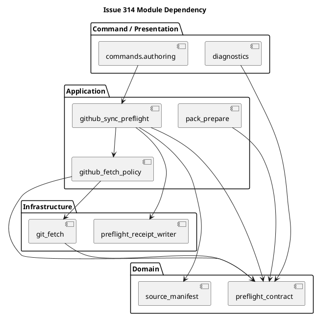
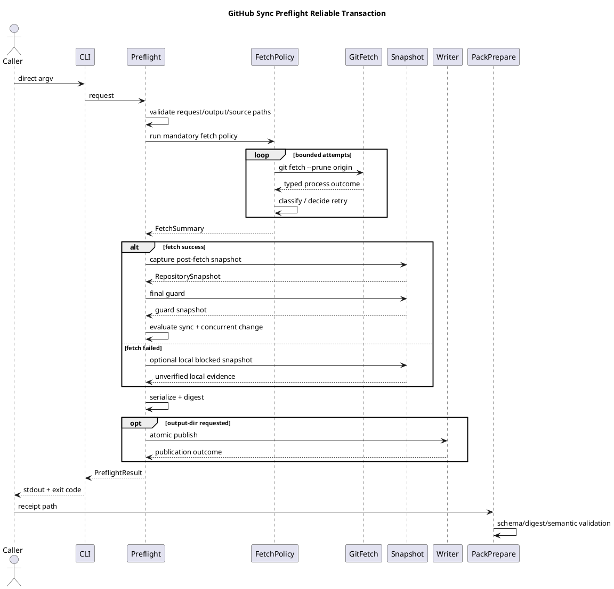

---

種別: 設計書（Issue）
ID: "iss-00314"
タイトル: "Harden GitHub Sync Preflight Fetch And Receipt Contract"
Issue Grade: "strict"
状態: "active"
作成者: "main orchestrator"
最終更新: "2026-07-13"
関連Requirement: ["requirement.md"]
関連Plan: ["plan.md"]
関連Report: ["report.md"]
親: ["epic-00295", "init-local-00003"]
-------------------------------------

## iss-00314 GitHub同期preflightのfetch・receipt契約を堅牢化する — Issue設計

> この設計はevidence-only候補である。以下の `[N]` は「この候補セット内でplanが依存する固定案」を意味し、canonical adoption済みという意味ではない。maintainerが選択を変更する場合は、requirement/design/planを整合させて再レビューする。

## 0. 設計コミットメント記号

| 記号    | 意味                               |
| ----- | -------------------------------- |
| `[N]` | 本候補planが前提とするnormative candidate |
| `[P]` | maintainer confirmationを要する有力案   |
| `[O]` | 未解決。implementation start前に解決     |
| `[E]` | 本Issue外。follow-up / Epic / ADR候補 |
| `[I]` | 説明例。実装拘束なし                       |

## 1. Strict grade確認

### Strictとする理由

* public CLI optionを追加する。
* JSON receipt schemaを追加する。
* subprocess、Git、filesystem、security redactionを変更する。
* provider、dogfood、installed runtimeへ波及する。
* backward compatibility、failure recovery、TOCTOUを扱う。
* step-local code reviewとissue-wide QA/code/spec reviewが必要である。

### Criticalへ引き上げない理由

本候補は既存fetchの実行を堅牢化し、credentialの保存・公開やGitHub mutationを新設しない。writerはcanonical/user-authored fileへの書込みを拒否し、outputはexplicit external directoryへ限定する。

次が必要になれば停止してCritical再分類する。

* raw credential/helper outputの保存。
* privileged immutable launcher。
* destructive target overwrite。
* repository外のcredentialed mutation。
* rollback不能migration。
* user file自動削除。
* broad shell/raw Git permission。

## 2. Executive design summary

### 2.1 設計結論

`run_github_sync_preflight()` を、一回のSpecDock-owned transactionとして再構成する。

```text
request safety
  -> mandatory fixed fetch with bounded policy
  -> local snapshot after fetch
  -> sync evaluation
  -> final concurrent-change guard
  -> versioned receipt serialization
  -> optional safe atomic publication
  -> stdout presentation
```

### 2.2 First-PR設計

First PRには次を含める。

1. typed process outcome。
2. conservative classifier + confidence。
3. bounded same-shape retry。
4. noninteractive/sanitized environment。
5. versioned additive receipt。
6. bounded/redacted diagnostic。
7. `--output-dir` + fixed filename。
8. receipt-specific atomic writer。
9. post-fetch snapshot。
10. concurrent-change guard。
11. pack receipt integrity/binding。
12. legacy compatibility。
13. provider/dogfood/install parity。
14. skill/docs guidance。

### 2.3 First PRに含めないもの

* immutable launcher。
* Trace2。
* all-writer refactor。
* `openat`/`dir_fd` hardening。
* backend invocation直前fetch。
* pack時点current repo full revalidation。
* direct GitHub connector integration。
* configurable retry knobs。
* generic workflow orchestration command。

## 3. Normative sources

| 種別                      | Path / ID                                                                                       | 意味                                                                      |
| ----------------------- | ----------------------------------------------------------------------------------------------- | ----------------------------------------------------------------------- |
| Parent Epic requirement | `epic-00295/requirement.md`                                                                     | GitHub sync、fail-closed、provider/install parity、evidence-only authority |
| Parent Epic design      | `epic-00295/design.md`                                                                          | plane separation、provider authority、layer ownership                     |
| Parent Epic plan        | `epic-00295/plan.md`                                                                            | original preflight sliceとfinal quality policy                           |
| Current implementation  | `application/authoring_pack/github_sync_preflight.py`                                           | fixed fetch、mixed-time observation、generic blocker                      |
| Current contract        | `domain/authoring_pack/preflight_contract.py`                                                   | existing additive compatibility surface                                 |
| Current CLI             | `commands/authoring.py`                                                                         | stdout-only preflight surface                                           |
| Current tests           | `tests/cli_runtime/test_authoring.py`                                                           | clean/dirty/ahead/behind/diverged/fallback/source safety baseline       |
| Installed skill         | `spec-dock-chatgpt-authoring/SKILL.md`                                                          | evidence laneとcurrent generic failure guidance                          |
| Research evidence       | `artifacts/20260713t014710z-research-chatgpt-pro-github-sync-preflight-reliability-analysis.md` | architecture/failure/output/freshness options                           |
| Original incident       | `taikyohiyou_project#2098`                                                                      | permission/shell escalation chain                                       |
| Follow-up brief         | planning attachment                                                                             | branch/profile/source hash/output obligations                           |

現行testsはclean/synced、source symlink、dirty/staged/untracked、ahead/behind/diverged、fetch-before-comparison、branch/fallback等を既に検証している。これらは置換せずregression baselineとして維持する。

## 4. Requirement-to-design traceability

| Requirement         | Design ID            | 扱い                                        |
| ------------------- | -------------------- | ----------------------------------------- |
| `RQ-FUNC-001`〜`003` | `DES-001`, `DES-002` | fixed fetch adapterとexecution policy      |
| `RQ-FUNC-004`       | `DES-003`            | typed attempt/result                      |
| `RQ-FUNC-005`       | `DES-004`            | conservative classification               |
| `RQ-FUNC-006`       | `DES-005`            | bounded retry                             |
| `RQ-FUNC-007`       | `DES-006`            | no escalation/fallback policy             |
| `RQ-FUNC-008`       | `DES-007`            | schema v1 additive receipt                |
| `RQ-FUNC-009`〜`010` | `DES-008`, `DES-009` | CLI output-dirとatomic writer              |
| `RQ-FUNC-011`〜`013` | `DES-010`, `DES-011` | post-fetch snapshotとfreshness disposition |
| `RQ-FUNC-014`〜`015` | `DES-012`            | pack bindingとlegacy path                  |
| `RQ-FUNC-016`       | `DES-013`            | provider/dogfood/install parity           |
| `RQ-FUNC-017`       | `DES-014`            | docs/skill contract                       |
| `RQ-NF-001`〜`009`   | `DES-003`〜`DES-015`  | failure/security/testability/rollback     |

## 5. Decision radius

### Issue-localに所有する判断

* subprocess outcomeのshape。
* failure taxonomyとconfidence。
* retry allowlist。
* receipt schema。
* output-dir/fixed filename。
* receipt writer safety。
* post-fetch snapshot。
* concurrent guard。
* pack receipt binding。
* docs wording。

### Implementationへ委譲する判断

* private helper names。
* regexの細部。ただし分類意味論を変更しない。
* fixture implementation。
* safe redaction helperの内部構造。
* serialization helperのprivate分割。
* platform capability probeの実装方法。

### 上位またはfollow-upへ送る判断

* runtimeからGitHub connectorを直接呼ぶか。
* immutable launcher/capability。
  -全writerの共通化。
* backend final fetch/orchestration。
* legacy schema deprecation release。
* repo-local approved evidence root。
* process-group cancellation hardening。

## 6. 目標設計契約

| Design ID | 契約                                                                                             |
| --------- | ---------------------------------------------------------------------------------------------- |
| `DES-001` | `[N]` github-synced preflightはrequest safety後、SpecDock-owned fixed fetchを実行する                  |
| `DES-002` | `[N]` fetch adapterはfixed argv、shellなし、timeout、noninteractive/sanitized env、bytes captureを所有する |
| `DES-003` | `[N]` process outcomeとattempt evidenceをimmutable dataで表現する                                     |
| `DES-004` | `[N]` classifierはhybridかつconservativeで、confidenceを返し、unknownへfail-closedする                     |
| `DES-005` | `[N]` retryはallowlisted classだけをsame-shapeでbounded実行する                                         |
| `DES-006` | `[N]` runtimeはpermission escalation、shell syntax、fallback、lock削除を行わない                          |
| `DES-007` | `[N]` existing top-level fieldsを維持するversioned additive receipt                                 |
| `DES-008` | `[N]` output APIはoptional `--output-dir`、file名は固定                                              |
| `DES-009` | `[N]` receipt-specific safe atomic writer。generic writer refactorはしない                          |
| `DES-010` | `[N]` github-synced final observationはfetch後に行う                                                |
| `DES-011` | `[N]` pre/post snapshot guardでmixed-time passを防ぐ                                               |
| `DES-012` | `[N]` pack prepareはv1 receipt integrityを検証・bindingし、legacyを互換readする                            |
| `DES-013` | `[N]` provider assetがsource、dogfood/installはprojection                                         |
| `DES-014` | `[N]` installed skill/docsへno-shell/no-escalation/freshness boundaryを記載                        |
| `DES-015` | `[N]` rollbackはadditive fields/flagを外せる。既存data migrationなし                                     |

## 7. 最小component split

過剰なclass hierarchyやgeneric frameworkを導入せず、次の分割とする。

```text
domain/authoring_pack/preflight_contract.py
  immutable public/result data and enums

application/authoring_pack/github_fetch_policy.py        [new]
  classifier, retry decision, attempt orchestration

application/authoring_pack/github_sync_preflight.py
  end-to-end use-case orchestration and sync evaluation

infra/authoring_pack/git_fetch.py                        [new]
  subprocess execution adapter

infra/authoring_pack/preflight_receipt_writer.py         [new]
  receipt-specific path validation and atomic publication

application/authoring_pack/pack_prepare.py
  versioned receipt validation and provenance binding

commands/authoring.py
  CLI option and dependency wiring

presentation/authoring_pack/diagnostics.py
  additive JSON/text rendering
```

### 分割理由

* subprocessとfilesystemはinfra concern。
* retry/classificationはapplication policy。
* immutable result shapeはdomain contract。
* end-to-end sequencingは既存application use case。
* writerは本Issue固有に閉じ、全authoring writerを一括抽象化しない。
* testabilityはProtocol階層ではなく、小さなcallable typeとdependency injectionで確保する。

### 最小dependency injection

```python
FetchExecutor = Callable[[GitFetchExecutionRequest], GitProcessOutcome]
SnapshotObserver = Callable[[SnapshotRequest], RepositorySnapshot]
ReceiptPublisher = Callable[[ReceiptPublicationRequest], PublicationOutcome]
Clock = Callable[[], datetime]
MonotonicClock = Callable[[], float]
Sleeper = Callable[[float], None]
```

default implementationはproduction adapter、testsはfake/spyを渡す。新しいDI containerは導入しない。

## 8. Data shapes

### 8.1 Failure taxonomy

```python
FetchFailureClass = Literal[
    "timeout",
    "transient_transport",
    "remote_throttled",
    "local_ref_lock_contention",
    "remote_access_denied_or_not_found",
    "host_identity_failure",
    "repository_configuration",
    "execution_or_filesystem_denied",
    "spawn_failure",
    "cancelled",
    "unknown",
]

TerminationKind = Literal[
    "exited",
    "timeout",
    "spawn_error",
    "cancelled",
]

ClassificationConfidence = Literal[
    "certain",
    "probable",
    "unknown",
]
```

### 8.2 Process outcome

```python
@dataclass(frozen=True)
class GitProcessOutcome:
    return_code: int | None
    termination: TerminationKind
    stdout: bytes
    stderr: bytes
    duration_ms: int
    os_error_kind: str | None = None
```

この型はraw process captureであり、そのままreceiptへserializeしない。

### 8.3 Classification

```python
@dataclass(frozen=True)
class FetchClassification:
    failure_class: FetchFailureClass | None
    confidence: ClassificationConfidence
    retryable: bool
    diagnostic_code: str | None
```

### 8.4 Safe diagnostic

```python
@dataclass(frozen=True)
class SafeDiagnostic:
    code: str | None
    excerpt: str | None
    redacted_sha256: str | None
    source_byte_count: int
    excerpt_byte_count: int
    truncated: bool
    redaction_applied: bool
```

`redacted_sha256` はredaction後のfull diagnosticをhashする。raw unredacted streamのhashは保存しない。

### 8.5 Fetch attempt/summary

```python
@dataclass(frozen=True)
class FetchAttempt:
    attempt_number: int
    duration_ms: int
    return_code: int | None
    termination: TerminationKind
    failure_class: FetchFailureClass | None
    confidence: ClassificationConfidence
    retryable: bool
    diagnostic: SafeDiagnostic


@dataclass(frozen=True)
class FetchSummary:
    status: Literal["success", "failed", "cancelled", "not_started", "not_applicable"]
    policy_id: str
    executable: str
    argv: tuple[str, ...]
    remote: str
    timeout_seconds: float
    environment_policy_id: str
    execution_policy_context: Literal["unreported"]
    attempts: tuple[FetchAttempt, ...]
```

### 8.6 Repository snapshot

```python
@dataclass(frozen=True)
class RepositorySnapshot:
    normalized_origin: str | None
    branch: str | None
    local_head: str | None
    upstream: str | None
    effective_ref: str | None
    remote_head: str | None
    remote_head_disposition: Literal[
        "fetched_remote_tracking_ref",
        "unverified_cache",
        "unavailable",
        "not_applicable",
    ]
    worktree_state: tuple[str, ...]
    source_manifest: SourceManifest
    snapshot_id: str
```

`normalized_origin` はuserinfo、query、credentialを除く。absolute local repo pathはdurable receiptへ保存しない。

### 8.7 Freshness evidence

```python
@dataclass(frozen=True)
class FreshnessEvidence:
    observed_at: str
    snapshot_id: str | None
    final_guard_snapshot_id: str | None
    concurrent_change_check: Literal[
        "stable",
        "changed",
        "not_run",
        "not_applicable",
    ]
    remote_head_disposition: str
```

### 8.8 Publication evidence

```python
@dataclass(frozen=True)
class PublicationEvidence:
    requested: bool
    status: Literal[
        "not_requested",
        "published",
        "failed",
        "rejected",
    ]
    filename: str | None
    blocker: str | None
```

absolute output pathはpersisted receiptへ含めない。callerは自身が指定したdirectoryとfixed filenameからpathを解決する。

## 9. Candidate policy constants

次を本Issueの採用済みdesign policy constantとする。

```text
FETCH_POLICY_ID               = origin-fetch-v1
MAX_ATTEMPTS                  = 2
TIMEOUT_SECONDS_PER_ATTEMPT   = 60
BACKOFF_SECONDS               = 0.25
JITTER                        = none in first PR
DIAGNOSTIC_EXCERPT_MAX_BYTES  = 1024
RECEIPT_SCHEMA_VERSION        = 1
RECEIPT_FILENAME              = github-sync-preflight.receipt.json
```

### 判断理由

* total attempts 2は「初回+一度の内部retry」に限定する。
* 60秒は無期限hangを防ぎつつ通常fetchへ余裕を与える採用値。
* 一回だけのretryにrandom jitterを導入する運用利益は小さく、deterministic testsを優先する。
* 1024 bytesはremediationに必要な短いsignalを残し、raw diagnostic over-captureを避ける採用値。
* CLIからbudget/timeoutを変更させず、policy IDで監査可能にする。

値を変更する場合はdesign/plan amendmentを行い、tests/docsを同時に更新する。

## 10. Fetch execution environment

### Inherited-but-sanitized policy

保持するもの:

* `PATH`
* `HOME`
* `SSH_AUTH_SOCK`
* proxy settings
* CA/certificate settings
* existing credential helper resolutionに必要なenvironment

強制・除去するもの:

```text
GIT_TERMINAL_PROMPT=0
LC_ALL=C
LANG=C

remove:
GIT_TRACE
GIT_TRACE_PACKET
GIT_TRACE_CURL
GIT_CURL_VERBOSE
GIT_TRACE2
GIT_TRACE2_EVENT
GIT_TRACE2_PERF
```

### 理由

* credential helperそのものを無効化すると既存の正常認証を壊すため、全面allowlistにはしない。
* terminal promptを止める。
* diagnostic classifierをlocaleに依存しにくくする。
* trace outputによるcredential/path over-captureを防ぐ。
* environment内容はreceiptへ保存せず、`environment_policy_id`だけを記録する。

### 制限

第三者GUI credential helperを完全に停止できる保証は置かない。timeout/cancellationでfail-closedとし、必要なplatform-specific suppressionはfollow-upとする。

## 11. Classification design

### 判定優先順位

1. cancellation。
2. timeout。
3. spawn/OSError。
4. static repository configuration facts。
5. high-confidence local ref lock signal。
6. host identity / access / configuration signal。
7. transient transport / throttling signal。
8. unknown。

### Exit codeの扱い

* `0` はsuccess。
* nonzeroはfailureの事実だけを示す。
* nonzeroだけからretryabilityまたはpermission requirementを決めない。

### stderrの扱い

* allowlisted signalとしてのみ使用する。
* Git/SSH/helper/provider差を考慮してconfidenceを`probable`以下にする。
* unmatched、ambiguous、multiple conflicting signalは`unknown`。
* “permission denied”という文字列だけでsandbox denialと断定しない。

### Failure decision table

| Class                               | Confidence       |   Retry | Final behavior                             |
| ----------------------------------- | ---------------- | ------: | ------------------------------------------ |
| `timeout`                           | certain          | budget内 | exhausted後blocked                          |
| `transient_transport`               | probable         | budget内 | exhausted後blocked                          |
| `remote_throttled`                  | probable         | budget内 | exhausted後blocked                          |
| `local_ref_lock_contention`         | probable/certain | budget内 | lock削除せずblocked                            |
| `remote_access_denied_or_not_found` | probable         |      no | operator access remediation                |
| `host_identity_failure`             | probable         |      no | host policy remediation                    |
| `repository_configuration`          | certain/probable |      no | origin/refspec remediation                 |
| `execution_or_filesystem_denied`    | certain/probable |      no | policy/filesystem inspection。no escalation |
| `spawn_failure`                     | certain          |      no | executable/config remediation              |
| `cancelled`                         | certain          |      no | abort                                      |
| `unknown`                           | unknown          |      no | fail-closed                                |

### Retry invariants

attempt間で次のserialized identityを比較し、異なればinternal contract violationとしてblockする。

```text
executable
argv
cwd/repository identity
remote
timeout
environment policy ID
output capture policy
execution policy context
```

## 12. Receipt schema

### 12.1 Versioning

* `schema_version: 1`
* `receipt_kind: "spec-dock.authoring.github-sync-preflight"`
* v1内はadditive fieldsのみ。
* field削除、rename、意味変更はversion increment。
* legacy unversioned resultは別pathで読む。

### 12.2 Top-level compatibility

既存fieldをtop-levelに維持する。new nested objects:

```text
repository
fetch
freshness
publication
receipt_digest
```

### 12.3 Receipt digest

1. `receipt_digest` fieldを除いたpayloadを作る。
2. UTF-8、`sort_keys=True`、compact separatorsでcanonical JSON化する。
3. SHA-256を計算する。
4. algorithm/valueを追加する。
5. persisted receiptを再読したconsumerは同じ規則で検証する。

### 12.4 Pass semantic invariant

versioned receiptが`status=pass`であるには少なくとも次が必要。

* `evidence_mode=github-synced`
* `fetch.status=success`
* `github_sync=verified`
* `sync_state=synced`
* `remote_head_disposition=fetched_remote_tracking_ref`
* `concurrent_change_check=stable`
* no blockers
* valid source manifest
* valid digest

`local-context`は別semantic invariantを使い、fetchは`not_applicable`。

### 12.5 Publication failure semantics

Sync evaluationとpublicationは別dimensionとして扱う。

例:

```text
status=blocked
sync_state=synced
github_sync=verified
publication.status=failed
blocker=receipt_publication_failed
```

これは「Git syncは観測できたが、requested durable artifact contractを満たせなかった」ことを意味する。pack prepareはtop-level statusがpassでないため進まない。

## 13. Output APIとsafe writer

### 13.1 CLI

```text
--output-dir <EXISTING_DIRECTORY>
```

* optional。
* `--format`はstdout format。
* persisted receiptはJSON固定。
* first PRでは`--report-path`を追加しない。

### 13.2 First-PR safe-root policy

`output_dir`は次を満たすexisting directoryに限定する。

* repository root外。
* lexical parent traversalなし。
* leaf/ancestorにsymlinkまたはbroken symlinkなし。
* canonical SpecDock roots外。
* regular directory。
* platform tempまたはcaller/operatorが用意した外部evidence directory。

repo-local outputはfirst PRでは `receipt_output_inside_repository` としてblockする。これによりpreflight自身がuntracked fileを作り、観測したclean stateを直後に破壊する問題を避ける。

### 13.3 Target ownership

targetが存在しない場合は新規作成できる。

targetが存在する場合、次を満たすreceiptだけ置換できる。

* regular file。
* symlinkではない。
* bounded JSON parseに成功。
* matching `receipt_kind`。
* supported schemaまたはknown legacy ownership marker。

その他は`non_owned_existing_receipt_target`として変更しない。

### 13.4 Atomic algorithm

```text
1. lstatでoutput dir/ancestors/targetを検査
2. same directoryにO_CREAT|O_EXCL temporary file
3. mode 0600
4. payload全量write
5. flush + fsync(temp file)
6. directory/targetを再検査
7. os.replace(temp, target)
8. supported platformではparent directory fsync
9. final targetがregular non-symlinkであることを確認
10. failure時はtempをbest-effort cleanup
```

POSIX hostile concurrent parent swapを完全に閉じる`openat/dir_fd`はLATER。first PRではpre/post lstat、outside-repo、same-directory replaceでriskを限定する。

### 13.5 Blocked receipt

fetch、snapshot、source hash、concurrent guard等のblocked/stale resultもpublishする。destination自体がunsafeな場合はfileを作らずstdoutでblockerを返す。

## 14. Freshness transaction

### 14.1 Local-context

現行pathを維持し、GitHub fetch transactionを適用しない。

### 14.2 Github-synced sequence

```text
T0 request/output/source path safety
T1 repository identity guard
T2 mandatory bounded fetch
T3 post-fetch snapshot start guard
T4 branch/HEAD/upstream/remote/worktree/source manifest observation
T5 sync contract evaluation
T6 final critical state guard
T7 receipt serialization/digest
T8 optional atomic publication
T9 stdout render
```

### 14.3 Source manifest

* lexical path/symlink safetyはT0。
* file content hashingはfetch後のT4。
* manifest hashing前後でcritical inventory/HEAD/worktreeを比較する。
  -変更を検知した場合は`concurrent_repo_change`。
* local-contextのexisting behaviorは別pathで維持する。

### 14.4 Snapshot ID

次のnormalized valuesをcanonical JSON化してhashする。

```text
normalized origin identity
branch
local HEAD
upstream
effective ref
remote HEAD
remote head disposition
worktree category digest
source manifest hash
```

absolute repo path、raw status lines、credential URLは含めない。

### 14.5 Fetch failure

fetch failure時もlocal source evidenceをbounded snapshotとして取得できるが、remote freshnessは次のいずれかにする。

* `unverified_cache`
* `unavailable`

`github_sync=failed`を維持し、passにしない。

## 15. Pack freshness validation boundary

### First PR — MUST

`pack prepare`はversioned receiptについて次を行う。

callerはpreflightで指定したexternal output directoryと固定filenameからreceipt pathを構成し、既存の `--preflight <path>` 入力として明示的に渡す。preflightからpack prepareへhost-local pathを自動伝播する新しいhidden stateは導入しない。

* schema/kind validation。
* digest recomputation。
* existing source manifest internal consistency。
* status/pass semantic invariant。
* fetch success。
* fetched remote disposition。
* stable concurrent guard。
* receipt digest、snapshot ID、observed_atをprompt pack provenance/stale-ifへcopy。
* tamper/inconsistent receiptをblock。
* legacy unversioned receiptを互換read。
* legacy inputからnew freshness claimを作らない。

### First PRでは保証しないこと

* pack実行時点のcurrent local HEAD再観測。
* pack実行時点のsource再hash。
* remote再fetch。
* backend invocation直前freshness。

docsとprovenanceは、receiptが「preflight observation時点」のevidenceであることを明記する。

### Follow-up — SHOULD/LATER

* SHOULD: pack時点のcurrent local state revalidation。
* LATER: backend直前final fetchまたはsingle orchestration。

## 16. CLI/presentation compatibility

### Command args

`AuthoringPreflightGithubSyncArgs` に次をadditive追加する。

```python
output_dir: Path | None
```

### Request

`GitHubSyncPreflightRequest` にoutput destinationを直接持たせるか、command layerがpublication requestを別途組み立てる。

候補推奨:

* use case requestに `output_dir: Path | None` を追加。
* application serviceがevaluationとpublicationを一つのcommand outcomeとして所有。
* rendererはfile I/Oを行わない。

### JSON

`result.to_dict()` にnew fieldsをadditive追加する。

### Text

既存key順を維持し、末尾に次を追加する。

```text
receipt_schema_version
receipt_kind
fetch_status
fetch_attempt_count
fetch_failure_class
fetch_classification_confidence
fetch_timeout_seconds
remote_head_disposition
snapshot_id
concurrent_change_check
publication_status
receipt_filename
```

diagnostic excerptをtextへ無条件に出さない。

### Exit code

* pass: 0
* blocked/stale/publication failure: 1
* invalid option/contract: 2
* cancellation: host CLI conventionに従う非ゼロ。candidateは130相当。

## 17. Provider/dogfood/install impact

### Provider source

```text
src/spec_dock/assets/spec_dock/scripts/spec_dock_runtime/
src/spec_dock/assets/install_root/.agents/skills/
src/spec_dock/assets/spec_dock/docs/
```

### Dogfood projection

```text
spec-dock/scripts/spec_dock_runtime/
.agents/skills/
spec-dock/docs/
```

### Installed consumer

`spec-dock init/update` でprovider assetsから配布する。

### Parity invariant

* providerのみをmanual sourceとして編集。
* dogfood mirrorはprovider内容から同期。
* init/update targetでpackage inclusionとruntime importを確認。
* help、pass、blocked、publication、docs wordingを三surfaceで検証。
* runtime bytecodeがconsumer repoをdirtyにしない既存invariantを維持する。

## 18. Module dependency diagram



依存方向:

```text
domain <- application <- commands
domain <- infra
application orchestrates infra via injected callable
presentation reads domain result only
```

## 19. Runtime sequence



## 20. Rollback

### Code rollback

* new flag、new nested fields、policy/writer modulesを削除して旧stdout pathへ戻せる。
* existing top-level fieldsは変更しないため、rollback前後のlegacy callerへの影響を限定する。
* raw user/canonical data migrationはない。

### Persisted receipt

* external receiptはevidence fileとして残す。
* rollback時に自動削除しない。
* old runtimeがextra JSON keysを無視できることをtestする。
* new pack prepareがlegacy receiptを読めるため、段階deployを許容する。

### Publication failure containment

* writer不具合が見つかった場合は `--output-dir` success pathをdisable/blockし、stdout-only preflightを維持できる。
* unsafe targetを自動修復・削除しない。

### Scope rollback trigger

次が必要になった場合は実装を止める。

* fixed fetch argv変更。
* status semanticsのbreaking change。
* canonical/repo-local targetへの書込み。
* raw diagnostics保存。
* new dependency。
* connector/launcher/backend orchestration追加。

## 21. Directory / file change plan

```text
src/spec_dock/assets/spec_dock/scripts/spec_dock_runtime/
├── application/
│   └── authoring_pack/
│       ├── github_fetch_policy.py                 # new
│       ├── github_sync_preflight.py               # modify
│       └── pack_prepare.py                        # modify
├── commands/
│   └── authoring.py                               # modify
├── domain/
│   └── authoring_pack/
│       └── preflight_contract.py                  # modify
├── infra/
│   └── authoring_pack/
│       ├── __init__.py                            # new if required
│       ├── git_fetch.py                           # new
│       └── preflight_receipt_writer.py            # new
└── presentation/
    └── authoring_pack/
        └── diagnostics.py                         # modify

src/spec_dock/assets/install_root/.agents/skills/
└── spec-dock-chatgpt-authoring/
    └── SKILL.md                                   # modify

src/spec_dock/assets/spec_dock/docs/
├── workflow_chatgpt_authoring_pack.md             # modify
└── authoring/
    └── chatgpt-pack.md                            # modify if receipt binding documented here

spec-dock/scripts/spec_dock_runtime/                # generated dogfood projection
.agents/skills/spec-dock-chatgpt-authoring/         # generated dogfood projection
spec-dock/docs/                                     # generated dogfood projection

tests/
├── unit/
│   └── authoring_pack/
│       ├── test_github_fetch_policy.py             # new
│       └── test_preflight_receipt_writer.py        # new
├── cli_runtime/
│   ├── test_authoring.py                           # extend
│   └── test_wrappers.py                            # extend as needed
└── unit/infra/
    └── test_init_update.py                         # extend
```

既存project layoutに `infra/authoring_pack` を追加することが不適切と判明した場合は、new infra modulesを既存 `infra/` 直下へ置く。意味論は変えず、path変更だけならplanのtarget file updateで処理できる。

## 22. Design decision disposition

| ID      | 項目                       | Candidate resolution                 | Gate                       |
| ------- | ------------------------ | ------------------------------------ | -------------------------- |
| `O-001` | output flag              | `--output-dir` only                  | adopted |
| `O-002` | filename                 | `github-sync-preflight.receipt.json` | adopted |
| `O-003` | attempts/timeout/backoff | 2 / 60s / 250ms / no jitter          | adopted |
| `O-004` | diagnostic bound         | 1024 bytes after redaction           | adopted |
| `O-005` | output root              | existing external dir only           | adopted; repo-local rootはfollow-up |
| `O-006` | pack boundary            | integrity/binding only in first PR   | adopted; current repo revalidationはfollow-up |
| `O-007` | remote terminology       | fetched remote-tracking refを正直に記録    | adopted; direct connectorはLATER |
| `O-008` | PR delivery route        | normal maintenance PR gate           | adopted |

`O-001`〜`O-008` は本designで解決済みである。実装中に変更が必要になった場合はplan amendmentとfresh re-reviewを必須とする。

---
