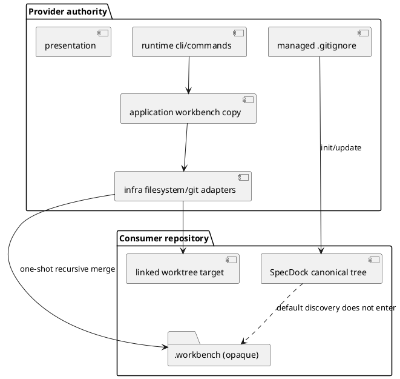
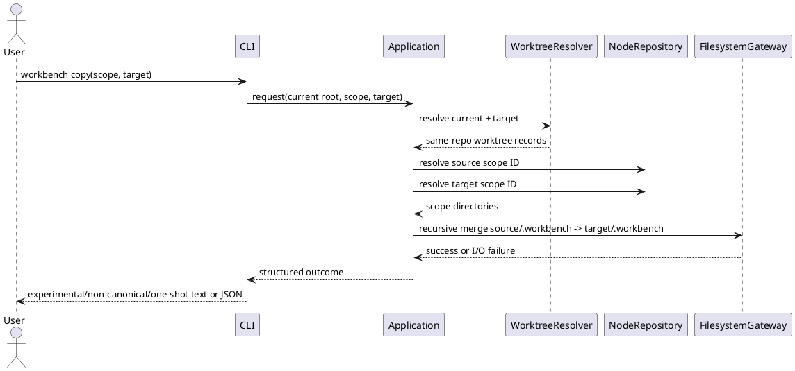

# epic-00312 Experimental Local Workbench And Worktree Handoff — 設計（どう実現するか）

## 全体像
- Workbenchは既存SpecDock node treeに置かれるが、node/artifact modelには参加しないreserved filesystem subtreeとする。
- 配置契約:
  - root/pre-scope: `<repo>/spec-dock/.workbench/YYYY-MM-DD/`
  - scoped: Initiative / Epic / Issue directory直下の `.workbench/`
- shipped `.gitignore` に `**/.workbench/` 相当のmanaged ruleを置き、root/scoped placementを一つの規則でignoreする。正確なpatternはfresh-init/updateと`git check-ignore` matrixで確定する。
- provider authorityは `src/spec_dock/assets/spec_dock/**`。dogfood `spec-dock/**` は`update`後のconsumer surfaceであり、別実装を持たない。
- Runtime変更は既存hybrid layered architectureに従う。
  - `cli/`: `workbench` command groupのparser/registry。
  - `commands/`: request構築、application呼出し、text/JSON outcome。
  - `application/`: source/target/scope resolutionとcopy orchestration。
  - `domain`またはapplication-local contract: placement/merge invariant。新しいpersistent modelは作らない。
  - `infra/`: Git worktree records、filesystem copy/merge、effective-ignore確認。
  - `presentation/`: experimental/non-canonical/one-shot表示とerror/result schema。

## 課題横断境界（cross-Issue boundary）
- Epicが固定する判断:
  - `.workbench/` はopaque、Git-ignored、non-canonical、disposable。
  - root Workbenchはcommand対象外。
  - scoped copyはcurrent source + one scope ID + one target worktreeの明示one-shot。
  - file内容/種類/拡張子/言語を分類せず、通常のrecursive filesystem copyを使う。
  - destination directoryを全置換せず、destination-onlyを保持し、same-relative-pathはsource wins。
  - no sync、no copy-back、no catalog/manifest/TTL。
- Issueに委譲するlocal delta:
  - exact command spelling、引数名、error code/result field名。
  - shared resolver抽出の単位、filesystem gateway/portの粒度。
  - 標準library primitiveの選択とOS差のtest fixture。
- forbidden parent boundary changes:
  - root bulk copy、automatic copy-on-create、content classifier、secret scanner、second storage/promotion system、cross-repository copy。
- cross-Issue invariant:
  - scanner isolationがcopy implementationより先に完成する。
  - final quality Issueがprovider/dogfood parity、docs、full validation、Epic PRを所有する。

## 設計スライス一覧（design slice catalog）
- DS-001 Ignore and opaque traversal foundation:
  - closes: E-RQ-001–005、E-RQ-013、E-RQ-015、E-RQ-017–018 / E-AC-001–002、010–011のfoundation部分。
  - owning Issue candidate: W1。
  - contract impact: `.gitignore`、default recursive discovery、delete/update preservation。
- DS-002 Scoped copy command:
  - closes: E-RQ-006–012、E-RQ-014、E-RQ-016のCLI surface / E-AC-003–009のCLI/copy部分。
  - owning Issue candidate: W2。
  - contract impact: CLI/application/infra/presentation。
- DS-003 Distribution and final quality:
  - closes: 全E-RQ/E-ACのconsumer確認とE-AC-012。
  - owning Issue candidate: W3 final quality/PR。
  - contract impact: package assets、dogfood mirror、docs、full regression、PR。

## コンポーネント / モジュール構成

## Opaque traversal設計
- `rglob`等の結果を後段filterするだけでは、Workbench内部を列挙・stat・readしてしまう。W1でdefault discovery callsiteをinventoryし、directory traversal段階で`.workbench` subtreeを降下対象から外すprunable walker/predicateへ寄せる。
- 共通predicateは「relative pathの任意componentが `.workbench`」をopaqueと判定する。User-facing supported placementはroot/scope直下に限るが、defensive discoveryはnested accidental `.workbench` も読まない。
- 適用対象:
  - current/legacy node metadata discovery。
  - validate/sync/deps/ADR/context/derived-state discovery。
  - authoring source manifestのsource selection。Directory recursive enumerationだけでなく、exact file/dir pathに`.workbench` componentを含む入力もsemantic sourceとして拒否する。
- 適用しない対象:
  - user/modelが行う通常filesystem操作。Authoring source selectionは通常file操作ではなくsemantic operationなので例外に含めない。
  - scoped Workbench copy command自身。
  - installerがmanaged assetをexact pathへ配置する処理。
- Inventoryでは各recursive callsiteを `default-semantic-discovery` / `explicit-user-operation` / `generated-known-tree` に分類し、前者だけを必須変更対象にする。全`rglob`の機械置換は行わない。

## Git ignore / installer設計
- Provider asset `src/spec_dock/assets/spec_dock/.gitignore`をauthorityとする。
- Installerにhidden `.gitignore` fallback/merge contractがある場合、fresh initとupdateの双方で同じruleが入るようprovider-side sourceを更新する。
- Updateは既存`.workbench/` contentへ触れず、managed ignore/runtime/docsだけを更新する。
- Test matrixはroot、Initiative、Epic、Issueの4 placementで`git check-ignore`を確認する。
- Global/user Git configに依存せず、consumer repositoryのmanaged ignoreだけで成立させる。

## CLI契約
- Candidate surface:
  - `spec-dock workbench copy --scope <init-|epic-|iss-id> --to <worktree-target>`
- Exact spellingはIssue-local deltaだが、次の意味は固定する。
  - source worktreeは現在のrepository root。`--from`は持たない。
  - scope IDはexactly one。root/date/path入力は受けない。
  - targetはexactly oneで、既存worktree commandのtarget semanticsを再利用する。
  - interactive prompt、自動copy、background syncは行わない。
- Target resolver:
  - current runtimeのstable worktree ID、absolute path、directory basename contractを共有する。
  - private helperを無理にimportせず、必要ならapplication-level shared resolverへ最小抽出する。
  - missing/ambiguous/stale/same-worktreeをcopy開始前にerrorとする。
- Scope resolver:
  - sourceとtargetそれぞれの`spec-dock/` treeを読み、scope IDを独立解決する。
  - source relative directory名をtargetへ転写しない。branch間rename/slug差を許容する。
  - sourceまたはtarget scopeがmissing/ambiguousならnodeを自動作成せずerrorとする。

## Copy / merge設計
- Content classification:
  - allowlist、denylist、extension table、language registry、MIME判定、secret scan、archive inspection、special-entry inventoryを実装しない。
  - recursive filesystem copyが扱うentryをそのままcopy対象とする。処理できない場合は通常I/O errorとして返す。
- Merge algorithm:
  1. source scoped `.workbench/` とtarget scope directoryを解決する。
  2. source scoped `.workbench/` が存在しない場合は`no_source` failureとし、target `.workbench/`を作成・変更しない。自動でrootへfallbackしない。
  3. target `.workbench/` を必要に応じて作る。
  4. source treeをrecursiveにdestinationへ重ねる。
  5. destination-only pathは削除しない。
  6. same-relative-path contentはsource側で上書きする。
- Python標準libraryを優先し、新規dependencyを導入しない。`shutil.copytree(..., dirs_exist_ok=True, symlinks=True)`相当の単純なmergeを基準に、既存destinationとsource-winsが成立する最小wrapperを置く。
- File/directory type collisionなど標準primitiveが処理できない状態は、独自にcontentを選別して回避せずcopy errorとする。全tree transaction/rollbackは作らない。
- Source descendant symlinkは参照先をdereferenceせずlink objectとして複製する。これはcontent/type selectionではなく、source scope外をreadしないpath-boundaryである。
- Source/target scope directoryとdestination `.workbench/` ancestryはrealpath/canonical containmentを検証し、destination ancestryのsymlinkを経由してtarget scope外へwriteしない。Workbench内部entryを用途/拡張子で分類するlogicは追加しない。
- Owner/ACL/xattr/device fidelityを保証しない。

## Application / port / adapter契約
- Candidate request:
  - `scope_id: str`
  - `target_selector: str`
  - `source_repo_root: Path`（command contextから注入）
- Candidate result:
  - `source_worktree`, `target_worktree`, `scope_id`, `source_path`, `target_path`, `copied/overwritten`等のnon-content metadata。
  - exact countsは標準copyを複雑化するなら必須にしない。成功/失敗とtarget locationを優先する。
- Port:
  - existing Git/worktree repository adapterでrecordsを取得。
  - source/targetごとに`NodeRepository(specdock_dir=...)`相当を利用。
  - filesystem copyは専用gatewayまたは既存`FilesystemGateway`の小さな拡張。command handlerへ再帰処理を置かない。
- Adapter errorはapplication failureへ変換し、presentationがtext/JSON contractを描画する。file contentsをexception message/outputへ含めない。

## 主要フロー

## 失敗設計
- Copy開始前:
  - repository/worktree target not found、ambiguous、stale、same worktree。
  - source/target scope missing/ambiguous。
  - source scoped Workbench missing (`no_source`、target mutationなし)。
  - resolved scopeがexpected worktree root外となるinvalid tree。
  - source/target scopeまたはdestination ancestryがsymlink/realpathによりcommand boundary外へ到達するinvalid path。
- Copy実行時:
  - permission、disk、path collision、標準primitiveで処理できないentry等のI/O error。
  - 独自classifierで別fileだけを選別して継続しない。successを返さない。
- 冪等性:
  - concurrent mutationがなければ再実行後のtarget contentは同じ。destination-onlyは残る。
- 部分失敗:
  - tree-wide atomicity/rollbackを保証しない。Error outputは再実行可能性とtarget pathを示すが、contentを列挙しない。
- Retry:
  - 自動retryなし。原因解消後に利用者が同じcommandを明示再実行する。

## Presentation / observability
- Help、成功text、失敗text、JSON、reference docsの全てで `experimental` を明示する。
- 成功時はsource/target worktree identity、scope ID、target Workbench pathを表示する。
- 失敗時はstable error code候補、scope/target identity、再実行可能な原因を表示する。
- `non-canonical`、`one-shot`、`no sync/copy-back`、root Workbench非対応をhelp/docsで明示する。
- File content、secret-like value、全entry listは表示しない。

## Delete / update設計
- Scope deleteとworktree removeの既存contractを変更してWorkbench blockerを追加しない。
- Existing removeがnonempty/untracked contentを扱う場合はそのcontractを維持する。Workbench専用backup/promotion warningを追加しない。
- Updateはmanaged assetsをrefreshするが、initiatives treeおよびunmanaged `.workbench/` contentをpreserveするexisting installer contractへ回帰testを追加する。

## 移行戦略
- Database/schema migrationなし。
- Fresh initとexisting consumer updateで同じexperimental surfaceを配布する。
- Existing repositoryに`.workbench/`があってもcontent migrationは行わず、新しいignore/opaque contractだけが適用される。
- Rollbackはmanaged runtime/docs/ignore変更のrevert。Workbench contentにmigration stateがないためdata rollbackはない。

## テスト戦略
- W1 unit/integration:
  - ignore placement matrix。
  - fake `.meta.json` / `meta.json` / ADR/dependency/source fileを含むWorkbenchをdefault discoveryが読まない。
  - large/broken scratch subtreeでも結果/処理対象が増えない。
  - explicit non-Workbench operationsの既存behaviorを維持。
  - delete/worktree removeとupdate preservation。
- W2 application/CLI:
  - target selector parity、missing/ambiguous/stale/same-worktree。
  - source/target scope independent resolutionとslug差。
  - source Workbench missingは`no_source` failureかつtarget mutationなし。
  - empty/nonempty destination、destination-only preserve、source wins、repeat run。
  - Python/config/binary/archive/`.env`/nested `.git`等を分類なしでcopy。
  - source symlinkをdereferenceせず複製し、destination ancestry経由のscope外writeを拒否する。
  - standard copy I/O failureをsuccessにせず、contentをoutputしない。
  - help、成功/失敗text、JSONのexperimental marker。
- W3 distribution/final:
  - fresh init、existing update、package-data、provider/dogfood inventory。
  - focused suites、`uv run pytest`、static analysis、manual two-worktree handoff。
  - docs/spec alignment、final `qa-reviewer` / `code-reviewer` / `spec-reviewer`。
- E-AC trace:
  - E-AC-001–002 -> W1 ignore/opaque traversal。
  - E-AC-003–008 -> W2 root exclusion/copy/application/presentation。
  - E-AC-009 -> W2 CLI/no-sync behavior + W3 reference docs alignment。
  - E-AC-010–011 -> W1 delete/update + W3 parity。
  - E-AC-012 -> W3 final quality/PR。

## 証跡採用（artifact adoption）
- Adopted:
  - 6件のuser-answer interviewとclarification synthesis。
  - ChatGPT 5.6 Proのlayering、scanner inventory、3-Issue構成、target/scope独立解決、provider parity提案。
- Refined:
  - ChatGPTのspecial-entry preflight/classificationは不採用。標準copy failureへ単純化。
  - 全tree collision preflight、symlink policy、詳細partial fieldsは必須product contractにせず、標準primitiveとminimal adapterへ委譲。
- Rejected:
  - root bulk copy、automatic copy、content scanner、catalog/manifest/TTL、sync/copy-back、dogfood-only implementation。
- Accepted ADR:
  - なし。Experimentalで非永続・可逆なboundaryであり、新しいauthority/storage modelを導入しない。

## 未確定事項
- Product decisionを妨げる未確定事項はない。
- Issue-local delta:
  - exact CLI spelling / error codes / result fields。
  - standard library primitiveの細部とcross-platform test範囲。
