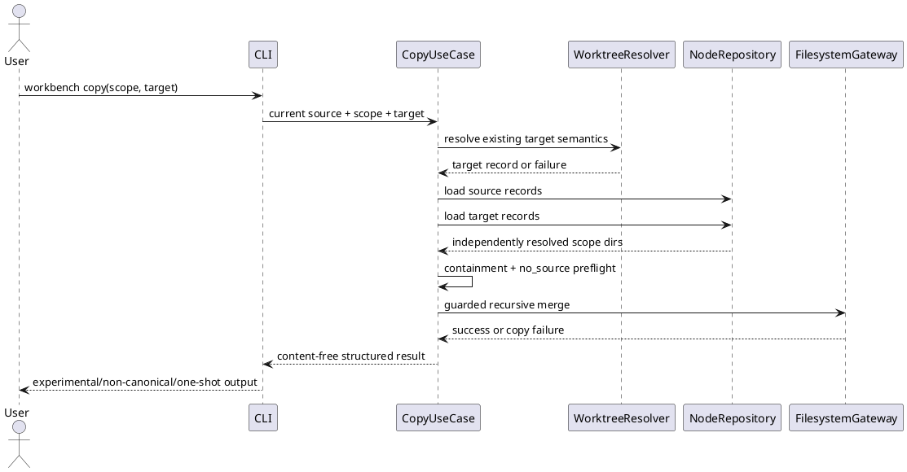

# iss-00316 Experimental Scoped Workbench Copy And Source Wins Merge — Issue 設計書（Standard）

## 1. Assuranceと設計方針
- `assurance classify --stage requirement`のauthorityは`standard`、`lite_candidate=false`。
- 新規experimental CLIとfilesystem境界を扱うため、Standardの必須gateに加えてsymlink/containment、failure、manual linked-worktreeのobligationを厚くする。
- Migration、persistent schema、existing file変換、credential処理、GitHub mutation、cross-Epic architecture判断は行わない。
- Public contractまたはdestructive semanticsを親要件より拡張する必要が生じた場合は、実装を止めてrequirement/assuranceを再分類する。

## 2. 正本と現状
| Source | 意味 |
|---|---|
| `requirement.md` RQ/AC/EC-316 | Issue-local観測契約 |
| Epic `requirement.md` E-RQ-006–012/014/016、E-AC-003–009 | W2境界とW5 relay |
| Epic `design.md` DS-002 | scoped one-shot copy設計背骨 |
| `application/worktree.py` | target inventory/selectorの現行意味論 |
| `infra/fs_repo.py` | 各SpecDock treeのnode record解決 |
| `cli/parser.py`、`cli/registry.py`、`cli/bootstrap.py` | runtime command wiring pattern |
| `application/contracts.py`、`application/ports.py`、`infra/fs_cli.py`、`presentation/cli_text.py` | use case/port/adapter/presentation boundary |
| `tests/cli_runtime/test_worktree.py` | selector regression surface |
| ChatGPT 5.6 Pro planning artifact | evidence-only候補。Exact symbol/pass claimは非authority |

現在はworktree lifecycle commandとselectorが存在するが、Workbench copy command、copy use case、recursive merge adapterは存在しない。Issue 315により`.workbench/`はdefault semantic discoveryからopaqueであるため、本commandは明示user operationとしてだけ内部を扱う。

## 3. 設計差分とtrace
| Design ID | Requirement | 設計契約 |
|---|---|---|
| DES-316-001 | RQ/AC-001 | `workbench copy`を独立command familyとして追加し、sourceはcurrent固定、scope/targetだけを入力する |
| DES-316-002 | RQ/AC-002 | Existing worktree inventory/selectorをapplication-level shared boundaryとして再利用する |
| DES-316-003 | RQ/AC-003 | Source/targetごとにSpecDock pathとnode inventoryを独立解決する |
| DES-316-004 | RQ/AC-004、EC-009 | 全selector/scope/path/source existence preflightをmutation前に行う |
| DES-316-005 | RQ/AC-005–006、EC-001/003/004 | Dedicated recursive merge adapterでdestination-only保持/source-wins/content opacityを実現する |
| DES-316-006 | RQ/AC-007–008、EC-002/005/008/009 | Lexical/physical containmentとnon-dereference traversalをfail-closedにする |
| DES-316-007 | RQ/AC-009 | Structured resultをcontent-free text/JSONへrenderする |
| DES-316-008 | RQ/AC-010 | Provider authority、focused regression、minimal dogfood/manual確認、Issue319 relayを閉じる |

## 4. 責任配置
### DES-316-001 Command surface
- Parserは`workbench copy`、full scope ID、target selector、既存共通output optionだけを公開する。
- `--from`、root/date/path selector、automatic mode、sync/copy-back optionは作らない。
- Registry/command handlerはparse済みrequestをapplication use caseへ渡し、filesystem判断を持たない。

### DES-316-002 Shared target resolution
- 現在`application/worktree.py`内にあるinventory構築とtarget selectionを、既存worktree commandとcopy use caseが共有できる最小application boundaryへ抽出する。
- Stable ID、absolute path、basename、ambiguous、branch-only、managed classificationの既存意味論を変更しない。
- Copy固有eligibilityはselector後に判定し、current worktree、bare、path missingをmutation前に拒否する。
- Exact helper/module名は実装自由度とするが、resolver複製は禁止する。

### DES-316-003 Independent scope resolution
- Source SpecDock pathはcurrent `ports.specdock_dir`、source repo rootは`ports.repo_root`を使う。
- Target SpecDock pathはcurrent repo rootに対するSpecDock directoryのrelative placementをtarget worktree rootへ適用し、literal `spec-dock` hard-codeを避ける。
- `NodeRepository.load_node_records(source_specdock)`と`load_node_records(target_specdock)`を別々に呼び、full IDに一致するnode directoryを各側で一意解決する。
- Source nodeのdirectory slug/pathをtargetへ転写しない。Unsupported ID kind、missing、duplicate/invalid inventoryは`side=source|target`を区別するstable failureとする。

### DES-316-004 Preflight transaction boundary
Mutation前の順序を次に固定する。

1. Current/source rootとSpecDock pathの安全性確認。
2. Git worktree inventory取得。
3. Existing semanticsでtarget selector解決。
4. Same-current/bare/path-missing eligibility確認。
5. Target SpecDock placementのlexical/physical containment確認。
6. Source/target node inventoryを独立loadしscope IDを解決。
7. Scope rootと`.workbench` rootのlexical/physical containment、ancestor type/symlinkを確認。
8. Source `.workbench`を`lstat`相当で確認し、missingは`no_source`、non-directory/symlink rootはunsafe/invalid failure。
9. Target `.workbench`が既存ならroot type/symlinkを確認。
10. 全preflight成功後だけmerge adapterを呼ぶ。

Step 1–9はtargetを作成・変更しない。Empty source Workbenchは存在するdirectoryなのでmerge開始後にtarget directoryを作成してsuccessできる。

### DES-316-005 Recursive merge adapter
- `FilesystemGateway`へWorkbench専用のrecursive merge operationを追加し、command/applicationからentry traversalを分離する。
- Source traversalは`follow_symlinks=False`相当とし、entry name/extension/contentによるclassifierを持たない。
- Destination parentは各段で`lstat`相当を使い、symlinkをdirectoryとして辿らない。

| Source entry | Destination entry | 動作 |
|---|---|---|
| directory | missing | directory作成後recursive copy |
| directory | real directory | destination-only childを残してrecursive merge |
| directory | non-directory/symlink | type collision failure、destinationを削除しない |
| ordinary leaf | missing | standard copy primitiveでcopy |
| ordinary leaf | ordinary leaf/symlink leaf | destination leaf/link自身だけを非dereference removeしsource leafで置換 |
| ordinary leaf | directory | type collision failure、subtreeを削除しない |
| symlink | missing/ordinary leaf/symlink leaf | `readlink` textを解決せずlink objectとして配置 |
| symlink | directory | type collision failure |
| unsupported special entry | any | skipせずcopy failure |

- `shutil.copytree(..., dirs_exist_ok=True, symlinks=True)`単独はexisting destination symlink ancestryを安全に扱えないため使用しない。小さいguarded traversalに限定し、generic filesystem frameworkへ拡張しない。
- Metadata fidelityは標準primitiveの範囲とし、owner/ACL/xattr/device fidelityは保証しない。

### DES-316-006 Symlink/containment/failure
- Lexical containmentはrelative path構成がexpected repo/specdock/scope root外へ出ないことを確認する。
- Physical containmentはrepo/specdock rootからscope/Workbenchまでの既存componentを、resolve-before-guardにせずcomponent単位で検査する。
- Scope rootまたはWorkbench root自体がsymlinkなら拒否する。Source descendant symlinkだけはopaque link objectとしてcopy対象にできる。
- Destination traversal位置のsymlinkは拒否する。同一leaf位置のdestination symlinkはlink自身だけを置換できる。
- External symlink targetはread/delete/writeしない。
- Copy開始後のI/O/type/race failureはsuccessに変換しない。Tree-wide rollback、atomicity、automatic retryは提供せず、structured failureに`mutation_started`相当の意味を持たせる。

### DES-316-007 Result/presentation
Application resultは次の意味だけを持つ。

- Success: command、experimental flag、source/target worktree identity、scope ID、target Workbench path、`canonical=false`、`one_shot=true`、`sync=false`。
- Failure: stable code、scope/target identity、side/reason、mutation開始有無、再実行判断に必要なgeneric message。
- File body、secret-like value、entry list、raw `OSError` text、canonical/review/adoption claimを含めない。

Error codeのexact token/field名は既存presentation conventionに合わせる実装自由度とするが、少なくともselector failure、target ineligible、invalid scope、`no_source`、unsafe path、copy failureを観測上区別する。

### DES-316-008 Distribution/compatibility
- Provider runtimeを一次変更し、dogfood側をprimary implementationにしない。
- 本Issueでfocused workbench/worktree/validate/sync/deps regression、minimal dogfood projection、manual two-worktree scenarioを確認する。
- Provider/dogfood inventory parity最終確定、package/fresh init/update、reference docs、full suite/static analysis、Epic PRはIssue 319へcommit/head/evidence付きでrelayする。

## 5. Runtime flow


## 6. Module dependency and change plan
```text
cli/parser + registry
  -> commands/workbench
    -> application/copy use case
      -> shared worktree target resolver
      -> NodeRepository port
      -> FilesystemGateway merge port
        -> infra Git/filesystem adapters
    -> presentation text/JSON
```

| Layer | Candidate change | Guardrail |
|---|---|---|
| `cli/` | parser/registry/bootstrap wiring | Worktree existing parse/output不変 |
| `commands/` | new thin Workbench handler | Filesystem logicを置かない |
| `application/` | request/result/use case/shared target boundary | Target resolver複製、scope path転写禁止 |
| `application/ports.py` | dedicated merge operation | Generic copy framework化しない |
| `infra/git_cli.py`/existing gateway | existing inventoryを再利用 | Git state mutationなし |
| `infra/fs_repo.py` | existing node record loadを各側で利用 | Workbench default discovery opacityを壊さない |
| `infra/fs_cli.py` | guarded recursive merge | Symlink dereference、classifier、rollback禁止 |
| `presentation/` | experimental content-free output | Raw file/OSError leakage禁止 |
| `tests/` | CLI/application/infra focused coverage | Private helperよりobservable behavior優先 |

Exact new module名はlocal styleと最小diffで決める。候補は`commands/workbench.py`とapplication側の単一copy moduleだが、実装者は既存layoutにより同等の小さい配置を選べる。

## 7. Compatibility、migration、rollback
- Migration/schema/persistent catalog: なし。
- Existing Workbench: move/rename/delete/normalizationなし。
- Existing worktree commands、validate/sync/deps: public semantics不変。
- Failure rollback: なし。原因解消後に利用者が同commandを明示再実行する。
- Feature rollback: New command wiring/use case/adapter/testsをrevertでき、existing workspace data変換は不要。
- Concurrent mutation/TOCTOU完全防止: non-goal。検査前提が崩れた場合はcopy failure。

## 8. 検証戦略
- Characterization: Existing worktree target selector ID/path/basename/ambiguity/branch-only/current/bare/path semantics。
- Application: Independent source/target inventory、different slug、all preflight no-mutation、empty/no_source、stable failures。
- Infra: Recursive source-wins merge、destination-only、idempotency、binary/`.env`/nested `.git`、type collision、symlink/ancestor containment、injected I/O fault。
- CLI/presentation: Help、parse prohibition、text/JSON semantic markers、content secrecy。
- Regression: Existing worktree、validate/sync/deps、Issue315 opacity。
- Manual: Two linked worktreesでdifferent slug、mixed content、destination-only、same leaf、symlink、basename/absolute selector、rerunを確認。
- Distribution relay: Minimal dogfood projectionを確認し、最終package/parity/full gateをIssue319へ記録する。

## 9. 棄却案
| 案 | 棄却理由 |
|---|---|
| `worktree copy`へ混在 | Workbench operationとworktree lifecycle責任が混ざる |
| `--from`/root/path selector | Current-source fixedとroot manual selectionを破る |
| Target resolver複製 | Existing ambiguity/branch/managed semanticsからdriftする |
| Source relative pathをtargetへ転写 | Branch間slug差で誤配置する |
| Whole target replacement | Destination-only data lossになる |
| `copytree(...dirs_exist_ok=True...)`単独 | Destination ancestry symlinkを安全に制御できない |
| Extension/MIME/secret classifier | Opaque scratch contractと単純性を破る |
| Transaction/manifest/counter | MVPに不要な状態と複雑性を増やす |
| Issue316でfinal parity/docs/PR | Issue319との責務二重化になる |

## 10. 実装自由度と停止条件
- 自由度: Exact class/helper/file/error token、internal result type、test fixture helper。
- 設計再レビュー必須: Root/cross-repo/automatic/sync追加、content classifier、destination destructive directory replacement、rollback/atomicity claim、new persistent state、existing worktree selector semantics変更。
- Requirementへ戻る条件: Parent W2/W5 boundary、observable copy semantics、authority/output contractを変更する必要が生じた場合。

## 11. 未確定事項
- Product/architectureのblocking open questionはない。
- Exact symbol/error field名とS90 docs no-op/最小update判断は実装・docs inventoryで確定し、観測契約を変える場合だけplan/designを再レビューする。
