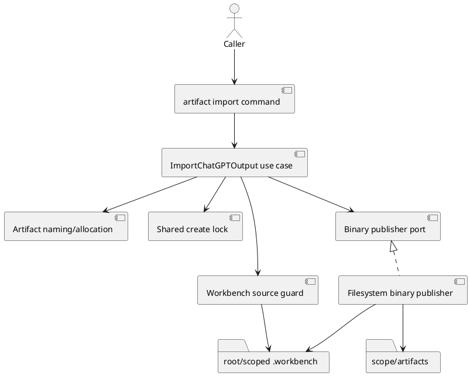

# iss-00317 Byte Preserving ChatGPT Output Artifact Import — Issue 設計書

## 1. 設計判断の要約

- `[N]` `artifact import chatgpt-output`を、template-based `new artifact`およびnode `import`と独立したCLI leaf/use caseとして追加する。
- `[N]` Importはsource bytesを解釈しない。Workbench境界の検証、binary staging、hash/byte-count検証、atomic no-replace publishだけを行う。
- `[N]` `chatgpt-output`はoperation kindであり、storage identityはexisting blank Artifactである。Typed type、template、reserved prefixを追加しない。
- `[N]` Importと`new artifact`は既存Artifact create lockおよびblank allocationを共有し、scan/allocationをlock内で行う。
- `[N]` Publish前failureとpublish後warningを分離する。後者ではcommitted finalをrollbackせず、retryを誘発しない結果を返す。
- `[N]` Imported fileはevidence-onlyである。Runtimeはcanonical docs、ADR、EAL、assurance stateを更新しない。
- `[P]` Atomic no-replace adapterはsame-directory staged fileからのPOSIX hard-link publicationを第一候補とする。ただしsource inodeを直接linkせず、contractを満たすnative primitiveへ置換可能とする。

Assurance classificationは`authorized_profile=standard`、`complexity_tier=normal`である。Public CLI追加を含むが、親Epic/accepted ADRで外部contractが確定済みであり、本Issueはその局所実装である。

## 2. 正本と設計境界

| 正本 | 適用内容 |
|---|---|
| `requirement.md` | RQ-317-001–013、AC-317-001–011、EC-317-001–008 |
| Parent Epic requirement/design | E-RQ-019–023、E-AC-013–015、DS-003 |
| `artifacts/20260713t031808z-adr-template-free-artifact-import-and-blank-filename-coexistence.md` | Template-free import、blank filename coexistence、no reservation |
| `artifacts/20260713t124754z-research-chatgpt-5-6-pro-issue-planning-evidence.md` | Evidence-only候補。採否は`report.md` EALで管理 |
| Current runtime/tests | Parser/registry/layering、Artifact grammar/allocation/create lock、validate/sync/ADR mirrorの現行契約 |

Provider authorityは`src/spec_dock/assets/spec_dock/**`である。Dogfood `spec-dock/**`は必要最小限のinstalled verification surfaceとし、別実装を持たない。

## 3. 現状と問題

### 3.1 再利用する現行契約

- `domain/artifacts.py`はtyped/blank filename grammar、timestamp、`01..99` collision suffix、duplicate stateを定義する。
- `application/create_artifact_doc.py`と`infra/artifact_store.py`はscope resolution、Artifacts directory setup、create serializationを提供する。
- `commands/new.py`とCLI parser/registry/bootstrapはcommand wiring、request/result、text/JSON conventionを提供する。
- Generic validationはfilename/duplicate stateを検査し、blank Artifact bodyへfrontmatterを要求しない。
- Sync projectionはArtifact directory stateを扱うが、本文またはimport provenanceを新規投影しない。ADR mirrorはtyped `adr`だけをsourceとする。

### 3.2 閉じるべきgap

- 現行`create_artifact_doc`はcandidate allocationをcreate lock取得前に行う。同一lockをimportと共有するだけでは、same-second competitor後のsuffix再allocationを保証できない。
- 現行template/text writerはUnicode textとtemplate bodyを生成するため、opaque bytesのimport経路に利用できない。
- Workbench path eligibility、source stability、binary hash、no-replace publication、post-commit warningを表現するport/resultがない。
- Existing delegated-authoring diff guardはUTF-8/frontmatter前提であり、raw importへ流用できない。このworkflow統合はIssue 318の責務である。

## 4. 目標コンポーネント

### DES-317-001 CLI separation

- `artifact` top-level command groupの`import` leafへMVP kind `chatgpt-output`を配置する。
- Input contractはkind、exactly one scope selector、`--file`、`--title`、optional `--slug`、global JSON conventionだけとする。
- Existing `new artifact` type list/template routingとtop-level node `import` commandは変更しない。
- Parserはargsをapplication requestへ変換するだけで、filesystem処理や本文readを行わない。

### DES-317-002 Request/result/error contract

Application requestは以下の意味フィールドを持つ。

- `import_kind = chatgpt-output`
- destination scope selector
- source path
- title
- optional explicit slug

Committed resultはcontent-freeに次を表す。

- import kind、storage identity `blank`
- Artifact ID、scope ID
- repo-relative source/destination
- SHA-256、byte count
- `committed=true`
- durability/cleanup/post-confirmation warning state

Pre-publish failureは`committed=false`、stable application error token、content-free contextを返す。Raw OS exception、absolute path、file bodyを公開しない。Post-publish warningはnon-committed failureへ変換しない。

### DES-317-003 Source eligibility guard

Application/infra境界でapproved source rootsを構築する。

1. Current worktreeの`spec-dock/.workbench/`。
2. Current graphでresolveできるInitiative/Epic/Issue directoryのdirect-child `.workbench/`。

Guardはcopy開始前に以下を確認する。

- Exactly one lowercase `.md` path。
- Repo rootからapproved Workbench root/sourceまでのlexical containment。
- Repo root、Workbench root、source ancestor、source自身のphysical pathにsymlinkがない。
- Sourceがregular fileであり、directory/special entryではない。
- Sourceからrename/hard-linkせず、command-owned staged inodeだけをpublishする。Existing formal Artifact全件のinode inventoryは行わない。

Root Workbenchの日付bucketは整理規約であってeligibility条件ではない。Sourceとdestination scopeは独立してよい。

### DES-317-004 Blank namingとshared allocation

- Titleまたはexplicit slugをexisting slug normalizationへ通し、`chatgpt-output-<normalized-slug>`をblank slugとして渡す。
- Typed parser/catalog/templateへ`chatgpt-output`を追加しない。Blank prefix reservationも追加しない。
- Existing timestamp、candidate scan、`01..99` suffix、duplicate validationを再利用する。
- Create lockを取得した後にdestination stateをscanし、candidateをallocateする共通境界を用意する。
- Existing `create_artifact_doc`も同じlock-internal allocationを利用する最小修正を行う。Rendered template bodyとexisting CLI resultは変えない。
- Lock取得後のexternal exact-path writerはatomic publicationの`EEXIST`で検知し、state rescan→次slot allocationをboundedに繰り返す。

### DES-317-005 Binary staging and verification

Binary publisher adapterはformal destinationと同じ`artifacts/` filesystem内に、generic Artifact scannerへ一致しないexclusive temporary fileを作る。

Publish前sequence:

1. Sourceをbinary read-onlyでopenし、initial identity/metadataを取得する。
2. Sourceからtempへchunked copyし、stream SHA-256とbyte countを計算する。
3. Tempをflush/file fsyncする。
4. Tempをdescriptor/pathから再読し、SHA-256とbyte countを照合する。
5. Publish直前にsource bytesを必ず再読してSHA-256/byte countを照合する。併せてopen descriptorの`fstat`とsource pathの`lstat`でdevice/inode/file type identityを必須確認し、replacement/unlinkを検知する。
6. 全照合に成功したtempだけをpublish可能とする。

Encoding detection、Unicode decode、Markdown/frontmatter parse、newline normalization、whole-file bufferingを行わない。Zero-byte、NUL、invalid UTF-8も同じbinary contractで処理する。

### DES-317-006 Atomic no-replace publication

- Final pathが不存在の場合だけ、verified tempを一操作でvisibleにするno-replace primitiveを使う。
- Overwrite可能な`os.replace`/check-then-write fallbackは禁止する。
- POSIXではtempからfinalへのhard-link creationとtemp unlinkを候補とする。このhard-linkはcommand-owned staged inodeからだけ行い、source inodeからは行わない。
- Native primitiveがcontractを満たさないhost/filesystemでは`publication_unsupported`としてfail closedする。
- `EEXIST`時はexisting bytesを触らずapplicationへcollisionを返し、bounded retryで別candidateをallocateする。
- Publish後にfinalのhash/byte countとArtifact duplicate stateを確認する。確認failureはfinalをrollbackしない。

### DES-317-007 Failure ownership

| Phase | 例 | Formal result | Source | Temp | Command result |
|---|---|---|---|---|---|
| Eligibility前 | outside/symlink/.MD/special | none | unchanged | none | pre-publish failure |
| Stage前/中 | create/read/write/hash/fsync/mutation | none | commandは不変 | cleanupを試行 | failure + cleanup state |
| Publish collision | `EEXIST` | existing unchanged | unchanged | owned | rescan/reallocate、bounded exhaustionでfailure |
| Publish unsupported | safe primitiveなし | none | unchanged | cleanupを試行 | pre-publish failure |
| Publish済み | directory fsync/temp cleanup/post-confirmation fault | committed finalを保持 | unchanged | stateを報告 | committed-with-warning |

Create lock release failureも、publish済みならcommitted-with-warning、publish前ならfailureとして扱う。Crash orphanの永続GC/catalogは追加しない。

### DES-317-008 Consumer and authority isolation

- Imported basenameはexisting blank grammarだけで識別され、generic validate/duplicate scanを通過する。
- Typed `adr`ではないためADR mirror sourceにならない。
- Syncへbody、source path、hash、import-kind catalogを新規投影しない。
- Commandはcanonical docs、EAL、ADR acceptance、assurance stateを編集しない。
- Raw importをdelegated-authoring evidence laneへ接続する規則/skillはIssue 318へrelayする。
- Package/fresh init/update/public docs/provider-dogfood final parity/full gateはIssue 319へrelayする。

## 5. Layer配置

| Layer | 責務 | 禁止事項 |
|---|---|---|
| `cli/` / `commands/` | Parser、registry、args→request、text/JSON outcome | Binary read、lock、allocation |
| `application/` | Scope/source resolution orchestration、lock、allocation/retry、result/warning統合 | Body parse、OS固有publication |
| `domain/` | Existing Artifact grammar、slug、candidate/duplicate contract | Filesystem I/O |
| application port | Narrow binary publish request/result/fault boundary | General transaction framework |
| `infra/` | `lstat`/containment、binary streams、hash/fsync、temp、no-replace、cleanup | Template rendering、authority判断 |
| `presentation/` | Content-free text/JSON | Body/absolute path/raw exception出力 |

Expected provider touchpointsはparser/registry/bootstrap/use-case contracts、`application/create_artifact_doc.py`のlock-internal allocation、new binary publisher adapter、focused testsである。Exact private symbol/file splitは意味論を維持する限りDevCoder裁量とする。

## 6. Concurrencyとlock order

1. Destination scopeをresolveし、source boundaryとdestinationの非変更preflightだけを行う。
2. Shared create lockを取得する。
3. Artifacts directory/rulesをsetupし、destination symlink/duplicate stateを再確認する。
4. Blank candidateをlock内allocateする。
5. Sourceをstage/verifyする。
6. Atomic no-replace publishする。
7. `EEXIST`ならtempを保持または安全に再stageし、state rescan後に次candidateへbounded retryする。
8. Post-publish stateを確認し、warningを分類する。
9. Owned tempをcleanupし、lockをtoken semanticsに従ってreleaseする。

MVPは単純性を優先し、hash中もcreate lockを保持してよい。Lock時間短縮のpre-stage framework、distributed lock、background recoveryは追加しない。

## 7. 検証設計

| Closure | 対応要件 | 必須証跡 |
|---|---|---|
| C317-01 | AC-001 | Parser/help/JSON、new artifact/node import regression |
| C317-02 | AC-002, EC-002 | Root/scoped Workbench、absolute/relative、outside/symlink/special rejection |
| C317-03 | AC-003, EC-001/003 | LF/CRLF/BOM/final newline/Japanese/NUL/invalid UTF-8/zero-byte hash identityとsource survival |
| C317-04 | AC-004, EC-004 | Blank parser、no reservation/type/template、same-second naming coexistence |
| C317-05 | AC-005 | Import/import、import/new、external writer collision、suffix exhaustion、existing bytes不変 |
| C317-06 | AC-006 | Same-size mutation、replace/unlink fault injection、formal no-write |
| C317-07 | AC-007, EC-005 | Temp/copy/hash/fsync/publication/cleanup pre-publish fault matrix |
| C317-08 | AC-008, EC-006/007 | Post-publish warning、final/source retention、retry-safe result |
| C317-09 | AC-009 | Text/JSON secrecy、stable error/warning tokens、absolute/raw body非露出 |
| C317-10 | AC-010 | validate/duplicate/sync/ADR mirror regression、delegated-authoring non-reuse relay |
| C317-11 | AC-011, EC-008 | Provider tests、manual Workbench→Artifact、Issue319 delivery relay |

Focused testsはdomain/application/infra/CLI/presentationの責任別に置く。Concurrency/fault testsはfake clock、barrier、fault-injectable adapterを使い、live networkへ依存しない。

## 8. Trade-off、risk、rollback

- Lock保持中にlarge fileを複数passするため待ち時間は増える。MVPではdata safetyと単純性を優先し、size limitやpre-stage concurrencyを追加しない。
- External mutationの全TOCTOUを一般保証しない。Identity/metadata/hash再確認とatomic no-replaceにより、owned boundaryで検知可能な変化とoverwriteを閉じる。
- Hard-link publicationはfilesystem依存である。Unsupported時にunsafe fallbackせずfail closedすることでportable safetyを維持する。
- Rollbackは新command/use case/adapter/wiringとlock-internal allocation refactorを戻す。Imported evidence fileの自動削除はしない。
- Existing `new artifact` regressionが見つかった場合、import機能を広げずshared allocation boundaryを修正する。

## 9. 非目標とrelay

- PDF/image/ZIP/directory/bundle/multiple-file import、RawCaptureBundle。
- Content/encoding/MIME/secret classifier、frontmatter/sidecar/receipt/catalog。
- Automatic import/promotion、EAL/canonical adoption automation。
- General transaction/journal/GC/recovery framework。
- Issue 318: ChatGPT-first checkpoint、delegated-authoring/raw import lane、skills/workflows。
- Issue 319: distribution docs、fresh init/update/package parity、manual recovery guidance、full quality gate、Epic PR。

## 10. Requirement trace

| Design | Requirement |
|---|---|
| DES-317-001/002 | RQ-001/002/011、AC-001/009 |
| DES-317-003 | RQ-003/004、AC-002/006、EC-002 |
| DES-317-004 | RQ-006/007、AC-004/005、EC-004 |
| DES-317-005 | RQ-005/008、AC-003/006/007、EC-001/003 |
| DES-317-006/007 | RQ-009/010、AC-005/007/008、EC-005/006/007 |
| DES-317-008 | RQ-011/012/013、AC-009/010/011、EC-008 |

## 11. 未解決事項

Product/parent判断を要する未解決事項はない。Exact error token、request/result field名、native no-replace primitive、private module splitは、上記の観測契約とclosureを変えない範囲で実装時に確定し、`report.md`へ記録する。
