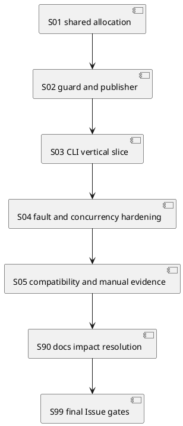

# iss-00317 Byte Preserving ChatGPT Output Artifact Import — 実装計画

## 1. 実行契約

- Assurance: `authorized_profile=standard`、`complexity_tier=normal`。
- Canonical requirement fresh pass: PLANNING-REQ-r2。
- Canonical design fresh pass: PLANNING-DES-r2。
- 実装はS01から一つずつ行い、各stepでDevCoder実装→focused verification→fresh code-reviewer pass→report closure→commit/pushを完了してから次へ進む。
- DevCoder、code-reviewer、qa-reviewer、spec-reviewerは本Epic中`gpt-5.6-sol`、reasoning `medium`を明示する。
- Runtime/code/tests/scaffold behaviorはDevCoderへ委任し、親agentは直接編集しない。
- Required closure、locked expectation、step ownerを変える場合はplan amendmentとfresh spec-reviewerを先に通す。

## 2. 許可変更面

| Surface | Allowed change |
|---|---|
| `src/spec_dock/assets/spec_dock/scripts/spec_dock_runtime/{cli,commands}/` | `artifact import chatgpt-output` parser/registry/handler |
| `.../application/` | Import use case、request/result/port、shared create allocation orchestration |
| `.../domain/` | Existing Artifact grammar/allocationの意味論不変な共有化 |
| `.../infra/` | Workbench source guard、binary stage/hash/fsync/no-replace publisher |
| `.../presentation/` | Content-free text/JSON success/failure/warning |
| `tests/{unit,cli_runtime}/` | Focused regression、fault injection、concurrency、CLI tests |
| `spec-dock/scripts/spec_dock_runtime/**` | Providerから生成・更新したdogfood runtime projectionだけ。手編集の別実装は禁止 |
| Active Issue `report.md` / `artifacts/` | Orchestratorがmanual evidenceとobserved ledgerだけを記録 |
| Active Issue docs | Orchestratorによるreport evidence、必要時のreviewed plan amendment |

Forbidden:

- `chatgpt-output` typed type/template/reserved prefix、frontmatter/sidecar/catalog。
- PDF/image/ZIP/directory/multiple-file import、content/secret classifier、automatic promotion。
- General transaction/journal/GC framework、Issue 318 workflow/skill変更、Issue 319 public docs/distribution work。
- Existing node `import` semantics、Workbench copy semantics、canonical/EAL/ADR/assurance automation。
- Active Issue report/evidence以外のconsumer canonical docs、workflow/skills、Issue318/319 node、dogfood-only implementation。

## 3. 実装依存

S01はexisting `new artifact`と新importの共通排他前提を閉じる。S02はfilesystem safetyを独立して閉じる。S03でpublic vertical pathを結線し、S04でrace/fault semanticsを硬化する。S05は既存consumer互換とmanual evidenceを確認する。S90でdocs impactを解決し、S99でIssue全体の品質とdeferred PR deliveryを判定する。

## 4. 仕様固定クロージャ索引（Spec-Locked Closure Index）

| ID | Required | Spec link | Input/state | Locked expectation | Defect class | Evidence level | Owner step |
|---|---|---|---|---|---|---|---|
| C317-01 | yes | AC-317-001 | CLI help/parse、new artifact/node import | 独立leafと最小args。既存command不変 | CLI contract collision | red-required | S03 |
| C317-02 | yes | AC-317-002, EC-317-002 | root/scoped WB、outside/.MD/dir/symlink/special | Eligible single `.md`だけread開始。拒否時external/formal不変 | boundary escape | red-required | S02 |
| C317-03 | yes | AC-317-003, EC-317-001/003 | LF/CRLF/BOM/no-final/Japanese/NUL/invalid UTF-8/empty | source/stage/final hash+bytes一致、source survival、no transform | byte corruption/source loss | red-required | S03 |
| C317-04 | yes | AC-317-004, EC-317-004 | same-second import/new blank | Blank grammar/suffix共存。type/template/reservationなし | naming incompatibility | red-required | S01/S03 |
| C317-05 | yes | AC-317-005 | import/import、import/new、external writer、suffix full | Existing bytes不変、別slot、exhaustion no-write | overwrite/race | red-required | S01/S04 |
| C317-06 | yes | AC-317-006 | same-size mutation、replacement、unlink | mandatory rehash+fstat/lstat mismatchでpre-publish fail | stale/mutated source publish | red-required | S02/S04 |
| C317-07 | yes | AC-317-007, EC-317-005 | temp/copy/hash/file-fsync/unsupported/retry/cleanup fault | formal/source lossなし、owned temp state observable | partial publication | red-required | S02/S04 |
| C317-08 | yes | AC-317-008, EC-317-006/007 | post-publish durability/cleanup/confirmation/release fault | final/source保持、committed path/hash/bytes warning | duplicate retry/data rollback | red-required | S04 |
| C317-09 | yes | AC-317-009 | all text/JSON outcomes | content/absolute/raw OS/canonical claim非露出 | secret/authority leak | red-required | S03/S04 |
| C317-10 | yes | AC-317-010 | validate/duplicate/sync/ADR mirror/delegated lane | Blank受理、body/provenance projection/ADR mirrorなし、diff guard非流用 | consumer regression | characterization-first | S05 |
| C317-11 | yes | AC-317-011, EC-317-008 | provider runtime + dogfood manual import + relay | manual import成功、report EAL、Issue319 relay、provider authority | incomplete delivery | manual-required | S05/S99 |

## 5. Implementation Delegation Gate（全step共通）

- Delegated role: `dev-coder`。
- Source of truth: reviewed `requirement.md`、`design.md`、本plan、parent Epic/ADR。
- Allowed changes: 対象stepのallowed pathsとtestsだけ。
- Forbidden changes: 上記Forbidden、別step、Issue318/319、canonical planning contract。
- Required verification: stepのconcrete cases、narrow tests、`git diff --check`。
- Stop conditions: requirement/design gap、closure変更、unexpected existing regression、unsafe no-replaceしか使えない、provider/dogfood authority衝突。
- Output required: changed files、Red/Green/refactor evidence、commands/results、risks、Ledger Noteまたは`No material implementation decisions beyond the approved plan.`。
- Review gate: runtime/code/test/scaffoldを含む各stepはfresh `code-reviewer` pass必須。S99はfresh code/QA/spec reviewer pass必須。
- Commit gate: reviewer pass後だけfocused commitを作り、clean/upstream stateをreportへ記録する。

## 6. S01 — Shared lock-internal Artifact allocation

### 目的

Existing `new artifact`を回帰させず、scan/setup/allocationをshared create lock内で行う再利用境界を作る。

### Allowed paths

- `application/create_artifact_doc.py`
- 必要最小限のapplication/domain/infra Artifact create helper
- Corresponding unit/CLI tests

### Planned contract / delegation

- Test obligation: Existing `new artifact`のpublic behaviorをcharacterizeし、allocation-before-lock raceだけをred-firstで閉じる。
- Pre-implementation evidence: `red-required`。Barrier/fixed clock testがcurrent candidate reuseを検出すること。
- Green verification: focused application/domain/CLI tests。
- Refactor guardrail: Template body、CLI output、typed/blank grammar、lock ownership/releaseを変更しない。
- Amendment trigger: Public naming/template/result contract変更が必要、または新lockが必要。
- Delegated role: `dev-coder`。Input docsはreviewed requirement/design/planとcurrent Artifact tests。
- Allowed/forbidden: 上記pathsのみ。Import CLI/publisher、docs、Issue318/319は禁止。
- Acceptance/reviewer: C317-04/05 prerequisite pass後、fresh `code-reviewer`。
- Stop/output: Existing regressionまたはscope外変更で停止。Changed files、Red/Green、commands、risk、Ledger Noteを返す。

### 具体テストケース一覧

- `TC317-S01-01` — 関連C317-04/C317-05
  - 前提: fixed clock、同一blank slug、同じArtifact scope、barrier付き2 create operation。
  - 操作: 両operationに同じ初期candidateを観測させ、先行operationをcommitしてから後行operationをlockへ進める。
  - 期待結果: 後行operationはlock内で再scan/allocationしdistinct suffix slotを得る。
  - 失敗検出: allocation-before-lockのcandidateを保持して後行が既存path failureになるraceを検出する。
  - 検証方法: focused application testをred-firstで追加し、同一testをgreen確認する。
  - 関連closure id: C317-04/C317-05。
- `TC317-S01-02` — 関連C317-04
  - 前提: Existing typed/blank fixture、fixed clock、occupied suffix `01..99` matrix。
  - 操作: Current `new artifact` text/JSON commandsを実行する。
  - 期待結果: Filename、template body、text/JSON、suffix/exhaustion semanticsがbaselineと一致する。
  - 失敗検出: Shared helper抽出がexisting public behaviorを変える回帰を検出する。
  - 検証方法: Existing CLI tests + focused characterization assertions。
  - 関連closure id: C317-04。

### Step closure contract

- Close: C317-04のshared allocation部分とC317-05のimport-compatible serialization prerequisiteがpass。
- Verification: focused domain/application/CLI new-artifact tests、`git diff --check`。
- Report: Red/Green/refactor、changed files、reviewer verdict、commit hash。
- Stop: Existing public `new artifact` contractを変えないと共有化できない場合はdesignへ戻る。

## 7. S02 — Workbench source guard and binary publisher

### 目的

CLIから独立したport/adapterとして、source eligibility、opaque staging、mandatory rehash、atomic no-replace、failure ownershipを閉じる。

### Allowed paths

- New/narrow application import contracts/port
- New/narrow infra source guard/binary publisher
- Corresponding unit infra/application tests

### Planned contract / delegation

- Test obligation: Path boundary、byte opacity、source stability、pre-publish fault/no-replaceをfake adapterで網羅する。
- Pre-implementation evidence: `red-required`。Missing guard/publisher contractで各negative/fault testが期待token前にfailすること。
- Green verification: focused infra/application tests。Fixtureごとにsource/temp/final hash/bytesをassertする。
- Refactor guardrail: Whole-file buffer、decode、source rename/link、unsafe replace、general transactionを導入しない。
- Amendment trigger: Safe no-replaceがsupported hostで成立しない、またはrequirement外alias inventoryが必要。
- Delegated role: `dev-coder`。Input docsはreviewed docs、Issue315/316 path patterns、current infra tests。
- Allowed/forbidden: 上記guard/port/adapter/testsのみ。CLI wiring、workflow/docsは禁止。
- Acceptance/reviewer: C317-02/03/06/07 primitive pass後fresh `code-reviewer`。
- Stop/output: Boundary leak/source mutation/unsafe fallbackで停止。Fault matrix、changed files、tests、Ledger Noteを返す。

### 具体テストケース一覧

- `TC317-S02-01` — C317-02
  - 前提: Root/scoped Workbenchのrelative/absolute regular `.md`、missing、outside、`.MD`、directory、source/ancestor symlink、FIFO fixture、external sentinel、existing formal Artifact。
  - 操作: Source eligibility preflightを各fixtureへ実行する。
  - 期待結果: Eligible `.md`だけacceptし、negative fixtureはcopy/publish開始前にstable failure。Source、external sentinel、formal Artifact bytesは不変。
  - 失敗検出: Missing pathの遅延failure、scope外read、symlink traversal、拒否時mutationを検出する。
  - 検証方法: temp repoのfocused infra/application parameterized test、read/publish fake call count 0 assertion。
  - 関連closure id: C317-02。
- `TC317-S02-02` — C317-03
  - 前提: LF/CRLF/BOM/no-final-newline/Japanese/NUL/invalid UTF-8/zero-byte fixturesとexclusive temp directory。
  - 操作: Chunked binary stage、file fsync、temp rereadを実行する。
  - 期待結果: Source/stream/temp SHA-256とbyte countが一致し、source path/bytesが残り、staged inodeはsource inodeと異なる。
  - 失敗検出: Decode/newline/template変換、whole-file text writer、source inode link/renameを検出する。
  - 検証方法: Focused binary publisher parameterized testとinode/hash assertion。
  - 関連closure id: C317-03。
- `TC317-S02-03` — C317-06
  - 前提: Stage完了後に停止できるbarrier、same-size mutation、path replacement、unlink variants。
  - 操作: Mutationを注入後、mandatory source reread、descriptor fstat、path lstat、publish判定を進める。
  - 期待結果: Hashまたはidentity mismatchでpublish前failしformal pathはない。Sourceにcommand由来の破壊なし。
  - 失敗検出: Stat-only検査やstale descriptorからmutated/replaced sourceをpublishする欠陥を検出する。
  - 検証方法: Deterministic barrier/fault-injectable application test。
  - 関連closure id: C317-06。
- `TC317-S02-04` — C317-07
  - 前提: Temp create/write、hash mismatch、file fsync、publication unsupported、cleanup faultを個別注入するadapter。
  - 操作: 各faultでstage/publish use caseを実行する。
  - 期待結果: Formal Artifactなし、source不変、owned temp cleanup stateとstable content-free failureを返す。
  - 失敗検出: Partial formal publication、source loss、raw OS exception/body leak、success誤分類を検出する。
  - 検証方法: Parameterized fault test + temp/formal/source filesystem assertions。
  - 関連closure id: C317-07。

### Step closure contract

- Close: C317-02、C317-03 publisher primitive部分、C317-06、C317-07 adapter部分がpass。
- Verification: focused infra/application tests、fixture SHA assertions、`git diff --check`。
- Report: Fault matrixとorphan stateをcontent-freeに記録。
- Stop: Supported test hostでsafe atomic no-replace primitiveが成立しない場合は実装継続せず報告する。

## 8. S03 — `artifact import chatgpt-output` vertical slice

### 目的

Parserからapplication/publisher/presentationまでhappy pathを結線し、blank namingとbyte identityをpublic CLIで成立させる。

### Allowed paths

- CLI parser/registry/bootstrap
- New command handler/use case/contracts
- Presentation text/JSON
- Focused command/presentation/CLI runtime tests

### Planned contract / delegation

- Test obligation: Public parser/help/resultとbinary happy pathをvertical sliceで閉じ、existing `new artifact`/node `import`をcharacterizeする。
- Pre-implementation evidence: `red-required` for new leaf; `covered-existing` + explicit regression for existing commands。
- Green verification: command/presentation/unit + CLI runtime binary fixtures。
- Refactor guardrail: Handlerへfilesystem logicを置かず、type/template/reservationを追加しない。
- Amendment trigger: Existing node `import` grammarやglobal JSON convention変更が必要。
- Delegated role: `dev-coder`。Input docsはreviewed docs/current parser-registry-bootstrap tests。
- Allowed/forbidden: 上記CLI/application/presentation/testsのみ。Publisher semanticsやdocs/skillsは禁止。
- Acceptance/reviewer: C317-01/03/04/09 public path pass後fresh `code-reviewer`。
- Stop/output: Body/absolute path leakまたはexisting command regressionで停止。Changed files、help/output snapshots、tests、Ledger Noteを返す。

### 具体テストケース一覧

- `TC317-S03-01` — C317-01
  - 前提: Runtime CLIとInitiative/Epic/Issue fixture。
  - 操作: `artifact import --help`、valid args、missing/multiple selector、missing file/title、unknown optionをparseする。
  - 期待結果: `chatgpt-output` leafと最小argsだけを公開し、invalid inputsはstable parse/application failure。
  - 失敗検出: `new artifact` flag化、複数scope許容、destination basename/encoding option追加を検出する。
  - 検証方法: Focused parser/command unit testとCLI `--help` snapshot assertions。
  - 関連closure id: C317-01。
- `TC317-S03-02` — C317-03/C317-04
  - 前提: Fixed clock、Workbench binary fixture matrix、destination Issue。
  - 操作: Each fixtureをCLI importし、created pathをparse/rehashする。
  - 期待結果: Blank grammar basename/suffix、source/final hash+bytes一致、source survival、no frontmatter/template。
  - 失敗検出: Text conversion、typed identity、reservation、source moveを検出する。
  - 検証方法: CLI runtime parameterized test + byte/hash/parser assertions。
  - 関連closure id: C317-03/C317-04。
- `TC317-S03-03` — C317-09
  - 前提: Secret-like body、absolute temp root、success/pre-publish failure fixtures。
  - 操作: Text/JSON modesを実行してstdout/stderr payloadをcaptureする。
  - 期待結果: Allowed content-free fieldsだけを含み、body/secret/absolute/raw OS/canonical-adopted-reviewed claimがない。
  - 失敗検出: Exception stringify/body echo/authority self-claimを検出する。
  - 検証方法: Presentation unit test + CLI negative string assertions。
  - 関連closure id: C317-09。
- `TC317-S03-04` — C317-01/C317-04
  - 前提: Existing `new artifact blank`、typed catalog、top-level node `import` fixture。
  - 操作: Blank slug `chatgpt-output-*`作成、typed help/catalog、node `import --help`とrepresentative parse/behavior regressionを実行する。
  - 期待結果: Blank作成は成功、typed type/template/reservationなし、node `import` help/parse/behaviorはbaseline不変。
  - 失敗検出: Command registry collision、reserved prefix rejection、node import shadowingを検出する。
  - 検証方法: Existing/new CLI runtime regression tests。
  - 関連closure id: C317-01/C317-04。

### Step closure contract

- Close: C317-01、C317-03、C317-04、C317-09のhappy/failure contractがpublic CLIでpass。
- Verification: focused command/presentation/CLI runtime tests、manual help inspection、`git diff --check`。
- Report: Exact command/result/error tokensとstorage identityを記録。
- Stop: Node `import`またはnew-artifact catalog変更が必要になった場合はdesign violationとして停止。

## 9. S04 — Collision and fault hardening

### 目的

Import/import、import/new、external writer raceとpre/post publish fault boundaryをdeterministicに閉じる。

### Allowed paths

- Import application/publisher/presentationとfocused concurrency/fault tests
- S01 shared allocation helperのmeaning-preserving correction

### Planned contract / delegation

- Test obligation: Race、bounded collision、pre/post commit faultをdeterministic barrier/fakeで網羅する。
- Pre-implementation evidence: `red-required`。各fault testが誤overwrite/誤classificationを観測すること。
- Green verification: Focused concurrency/fault suiteを3回連続実行しflakinessなし。
- Refactor guardrail: Sleep-based synchronization、unbounded retry、final rollback、new lock禁止。
- Amendment trigger: Retry bound/committed semanticsまたはclosure expectation変更が必要。
- Delegated role: `dev-coder`。Input docsはreviewed docsとS01–S03 committed state。
- Allowed/forbidden: Import/shared helper/fault testsのみ。Public scope/option/docs変更は禁止。
- Acceptance/reviewer: C317-05–09 fault portion pass後fresh `code-reviewer`。
- Stop/output: Nondeterministic test、existing bytes mutation、retry ambiguityで停止。Repeat logs、matrix、Ledger Noteを返す。

### 具体テストケース一覧

- `TC317-S04-01` — C317-05
  - 前提: Fixed clock、barrier、same scope/slug、sentinel existing bytes。
  - 操作: Import/importとimport/newを候補allocation/publish境界で競合させる。
  - 期待結果: Distinct slots、both committed、sentinel bytes不変。
  - 失敗検出: Candidate reuse、overwrite、deadlockを検出する。
  - 検証方法: Deterministic concurrency application/CLI testを3回連続実行。
  - 関連closure id: C317-05。
- `TC317-S04-02` — C317-05/C317-07
  - 前提: Publish直前にcandidateへsentinelを書くexternal-writer hookとfull suffix fixture。
  - 操作: `EEXIST`を注入後retry、さらにbounded retry/suffix exhaustionを実行する。
  - 期待結果: Transient collisionはrescan/next slot成功、exhaustionはformal/source mutationなしfailure。
  - 失敗検出: Existing overwrite、unbounded loop、transient collisionのterminal誤分類を検出する。
  - 検証方法: Fault-injectable publisher/application tests、exact path bytes assertions。
  - 関連closure id: C317-05/C317-07。
- `TC317-S04-03` — C317-06/C317-07
  - 前提: S02 mutation fixturesと各pre-publish fault point。
  - 操作: Full import orchestrationを各faultまで進める。
  - 期待結果: `committed=false`、new formalなし、source不変、owned temp cleanup stateが正確。
  - 失敗検出: Adapter単体では見えないorchestrator誤分類/partial stateを検出する。
  - 検証方法: Parameterized application/CLI integration test。
  - 関連closure id: C317-06/C317-07。
- `TC317-S04-04` — C317-08/C317-09
  - 前提: Successful publish後のdirectory fsync/temp unlink/post-confirmation/lock release fault hooks。
  - 操作: 各faultを個別注入してtext/JSON command outcomeをcaptureする。
  - 期待結果: Final/source保持、hash/bytes/pathを伴う`committed=true` warning、rollback/automatic retryなし。
  - 失敗検出: Committed resultをfailureに見せる、final削除、body/raw error leakを検出する。
  - 検証方法: Application + presentation/CLI parameterized post-commit test。
  - 関連closure id: C317-08/C317-09。

### Step closure contract

- Close: C317-05–09のfault/concurrency portionが全pass。
- Verification: focused deterministic testsを複数回、affected CLI tests、`git diff --check`。
- Report: Transient/terminal collision、pre/post commit matrix、warning tokens、repeat-run evidence。
- Stop: Flaky sleep-based testしか作れない場合はbarrier/fake adapter設計へ戻す。

## 10. S05 — Consumer compatibility and manual dogfood evidence

### 目的

Existing consumersを回帰させず、current dogfood Workbenchからformal Artifactへの一回importを証跡化し、Issue318/319 relayを確定する。

### Allowed paths

- Focused validation/sync/ADR/new-artifact regression tests
- 必要最小限のdogfood projection
- Active Issue report/artifact evidence（orchestrator管理）

### Planned contract / delegation

- Test obligation: Existing validate/sync/ADR/delegated-authoring boundariesのcharacterizationとmanual dogfood import。
- Pre-implementation evidence: `covered-existing` for consumers、`manual-required` for real Workbench import。
- Green verification: Focused regression + exact CLI/hash/validate manual commands。
- Refactor guardrail: Consumerへimport provenance/body parsingを追加せず、dogfood runtimeはprovider projectionだけ。
- Amendment trigger: Consumer contract変更またはpublic docs/skills更新が必要。
- Delegated role: Runtime regression/projectionは`dev-coder`。Manual evidence/EALはorchestrator。Inputはreviewed docsとS01–S04 commits。
- Allowed/forbidden: Focused tests、provider-generated dogfood runtime、active report/artifactのみ。他canonical docs/Issue318/319禁止。
- Acceptance/reviewer: C317-10/11 pass後fresh `code-reviewer`。Docs判断はS90へ渡す。
- Stop/output: Provider/dogfood divergenceまたはconsumer change必要で停止。Commands/SHA/changed paths/Ledger Noteを返す。

### 具体テストケース一覧

- `TC317-S05-01` — C317-10
  - 前提: Invalid UTF-8を含むimported blank Artifactとtyped ADR baseline。
  - 操作: Validate、duplicate scan、sync projection、ADR mirror collectionを実行する。
  - 期待結果: Blank file受理、body/provenance投影なし、imported fileはADR mirror sourceにならずtyped ADR baseline不変。
  - 失敗検出: Frontmatter decode要求、new projection/catalog、ADR誤認を検出する。
  - 検証方法: Focused validation/sync/ADR regression tests。
  - 関連closure id: C317-10。
- `TC317-S05-02` — C317-10
  - 前提: Existing delegated-authoring UTF-8/frontmatter guard testsとinvalid UTF-8 raw import。
  - 操作: Both lanesを個別実行しcallsite/diffをinspectする。
  - 期待結果: Importはguard非呼出、delegated laneはexisting rejection/validationを維持する。
  - 失敗検出: Raw importのguard流用またはexisting guard緩和を検出する。
  - 検証方法: Existing delegated-authoring tests + callsite `rg`/diff inspection。
  - 関連closure id: C317-10。
- `TC317-S05-03` — C317-11
  - 前提: Current worktree Workbench direct-childのsafe non-secret `.md` fixtureとactive Issue scope。
  - 操作: Provider-projected CLIでimportし、`shasum -a 256`/byte count/`validate`を実行する。
  - 期待結果: Source/final SHA+bytes一致、source残存、blank filename、validate pass。
  - 失敗検出: Provider/dogfood wiring gap、byte変換、source move、validator incompatibilityを検出する。
  - 検証方法: Exact manual commands/outputをreport Session Log/Test Contract Closureへ記録。
  - 関連closure id: C317-11。
- `TC317-S05-04` — C317-11
  - 前提: Manual import resultとreviewed parent Issue dependency map。
  - 操作: OrchestratorがEAL/decision/relay/deferred delivery evidenceをreportへ統合する。
  - 期待結果: Source/destination/hash/bytes/capture/adoption、Issue318 workflow relay、Issue319 distribution/recovery/final PR relayが追跡可能。
  - 失敗検出: Imported filenameからauthority/provenanceを自己推定、後続責務消失を検出する。
  - 検証方法: Report diff inspectionとfresh spec-reviewer（S90/S99）。
  - 関連closure id: C317-11。

### Step closure contract

- Close: C317-10、C317-11 manual/delivery portionがpass。
- Verification: focused validation/sync/ADR regression、manual CLI/hash/validate、provider/dogfood diff inspection。
- Report: Manual command/output、SHA、relay、unresolved delivery risk。
- Stop: Public docs/skills/package parity変更が必要ならIssue319/318へrelayし、本stepで拡張しない。

## 11. S90 — Docs impact resolution

### 目的

Final quality gate前にdocs/templates/README/workflow/skill/migration impactを判定し、Issue317で必要な更新またはIssue318/319へのdeferを閉じる。

### Planned contract / delegation

- Scope: Provider public docs/templates/README、workflow/skills、migration notes、Issue318/319 ownershipをinspectする。
- Test obligation: `inspect-only`。Runtime behaviorが未文書のままIssue317 finishされないこと。
- Pre-implementation evidence: Parent Epic planはpublic distributionをIssue319、workflow/skillをIssue318へ割当済み。
- Green verification: Docs impact matrix、defer owner/reason/dependency、spec-review result。
- Refactor guardrail: Issue318/319のcanonical nodeやshipped docsを本Issueで先取りしない。
- Amendment trigger: Runtimeを正しく使うためIssue317内で必須のshipped textが判明した場合。
- Delegated role: Impact `none/deferred`ならorchestrator inspection、更新が必要なら`doc-writer`。Inputはreviewed docs、S01–S05 diff、parent plan。
- Allowed paths: Impact updateが必要な場合だけ明示したprovider docs/template subset。Active reportはevidence記録可。
- Forbidden changes: Workflow/skills（Issue318）、public distribution/fresh init docs（Issue319）、source code。
- Acceptance/reviewer: Impact matrixとupdateまたはapproved-no-op/deferがfresh `spec-reviewer` docs/spec alignment pass。
- Stop/output: Owner conflictまたはruntime requirement gapでplan amendment。Changed docs/no-op rationale、inspection paths、review resultを返す。

### 具体テストケース一覧

- `TC317-S90-01` — C317-11
  - 前提: S01–S05 implementation diffとparent Issue318/319 allocation。
  - 操作: README/docs/templates/workflow/skills/migration notesへの影響をpath別にinspectする。
  - 期待結果: Issue317 update、Issue318 defer、Issue319 defer、N/Aのいずれかが根拠付きで一意に記録される。
  - 失敗検出: 必要docsの無記録欠落、後続Issueへの曖昧defer、scope先取りを検出する。
  - 検証方法: `git diff --name-only`、`rg` callsite/docs inventory、report Docs Impact ledger。
  - 関連closure id: C317-11。
- `TC317-S90-02` — C317-11
  - 前提: Docs impact matrixと必要ならdoc-writer diff。
  - 操作: Fresh spec-reviewerがrequirement/design/planとdocs/no-op/deferを照合する。
  - 期待結果: Passed。Updateはreview/commit、none/deferredはapproved-no-opとしてpost-check clean evidenceを持つ。
  - 失敗検出: Reviewerなしのnone claimまたは未commit docsを検出する。
  - 検証方法: Spec-review JSON、report Step Result Approval、commit/no-op ledger。
  - 関連closure id: C317-11。

### Step closure contract

- Close: Docs impact resolved、fresh spec-reviewer passed、commitまたはapproved-no-op、post-commit clean。
- Report: Docs impact、delegation/no-op、reviewer、defer IDs、Step Result Approval。
- 次stepはS90 Result Approval後だけ開始する。

## 12. S99 — Final Issue quality gates and finish readiness

### 目的

全closureとplanned scopeを統合検証し、Issue finish可能なclean commitを作る。

### Planned contract / delegation

- Test obligation: Full closure ledger、required commands、final QA→issue-wide code→spec、deferred PR delivery、post-commit state。
- Pre-implementation evidence: `covered-existing` for baseline suites、`manual-required` for lifecycle/delivery evidence。
- Green verification: Listed commands and fresh reviewer passes。
- Refactor guardrail: Final gateで新feature/refactorを追加しない。Findingはowner stepへ戻す。
- Amendment trigger: Required closure/spec expectation変更またはEpic boundary change。
- Delegated roles: Test correctionは`dev-coder`、final reviewersはfresh `qa-reviewer`→`code-reviewer`→`spec-reviewer`、lifecycle commandは`spec-manager`。
- Allowed paths: Finding ownerのreviewed follow-up、active report。Unrelated source/docs禁止。
- Acceptance: All closures、S01–S90 Result Approval、reviewers、deferred delivery、final commit/clean/upstream。
- Stop/output: Any failはrepair loop。Commands/results、review JSON、closure ledger、commit/upstream evidenceを返す。

### 具体テストケース一覧

- `TC317-S99-01` — C317-01–11
  - 前提: S01–S90 Result Approvalとall commits。
  - 操作: Focused unit/CLI/static/validate/assurance commandsを実行しclosure ledgerを照合する。
  - 期待結果: Required commands pass、C317-01–11 unresolvedなし、unexpected diffなし。
  - 失敗検出: Step-local passだけでintegration/lifecycle gapを見落とす欠陥を検出する。
  - 検証方法: 下記Final Exit command/evidence queue。
  - 関連closure id: C317-01–11。
- `TC317-S99-02` — C317-01–11
  - 前提: Final candidate diffとtest logs。
  - 操作: Fresh qa-reviewer→issue-wide code-reviewer→spec-reviewerを順に実行し、failならowner worker修正後fresh rerunする。
  - 期待結果: 三者すべてpassed、P0–P3 disposition記録済み。
  - 失敗検出: Stale/partial reviewer、waiver/provisionalをpass扱いする欠陥を検出する。
  - 検証方法: Reviewer JSONとreport Final Gate rows。
  - 関連closure id: C317-01–11。
- `TC317-S99-03` — C317-11
  - 前提: All reviewers passed、final report candidate、Epic planがPRをIssue319へ集約。
  - 操作: Deferred PR delivery fields、commit/push、clean/upstream、active issueを確認する。
  - 期待結果: Defer target `iss-00319`、dependency edge、no per-Issue PR理由、merge-prepared非主張、remaining PR/Merge gates、local finish条件が記録される。
  - 失敗検出: Intermediate Issueでmerge-preparedを誤主張、dirty/unpushed finish、relay欠落を検出する。
  - 検証方法: Report Deferred PR Delivery Gate、`git status --short`、`git rev-list --left-right --count @{upstream}...HEAD`、active show。
  - 関連closure id: C317-11。

### Step closure contract

- Close: 全C317 closure pass、全reviewer fresh passed、reportにplaceholder/blockerなし、focused/full risk-calibrated checks pass。
- Verification candidate:
  - `uv run pytest tests/unit`
  - `uv run pytest tests/cli_runtime`
  - affected static checks/project pre-commit lane
  - `git diff --check`
- Required lifecycle/evidence commands:
  - `./spec-dock/scripts/spec-dock assurance verify --issue iss-00317 --format json`
  - `./spec-dock/scripts/spec-dock validate`
  - `./spec-dock/scripts/spec-dock sync`（required sync判断をreportへ記録。必要なら実行、不要なら根拠付きapproved-no-op）
  - `./spec-dock/scripts/spec-dock active show`
- Full `uv run pytest`はIssue riskとruntimeを見て実行し、未実行ならIssue319 final Epic gateへの明示relayを残す。ただしIssue-local affected suitesは省略しない。
- Finish: final report commit/push、clean/upstream 0/0確認後、spec-managerが`issue finish`を実行する。

### Final Exit Contract

1. S01–S05/S90の各Result Approval（closure、verification、fresh reviewer、commit/approved-no-op、post-commit clean）を確認。
2. Required test/assurance/validate/sync判断をreportへ記録。
3. Fresh QA→issue-wide code→spec repair loopを全passまで実行。
4. Deferred PR Delivery Gateを`iss-00319`へ固定:
   - target: `iss-00319-installed-runtime-dogfood-parity-final-quality-and-mergeable-pr`。
   - dependency: Epic planのIssue317→Issue318→Issue319 chain。
   - reason: One final Epic PRへdistribution/full gateを集約するためper-Issue PRを作らない。
   - claim: Issue319 PR Delivery/Merge Preparation完了までmerge-preparedを主張しない。
   - remaining: Issue318 workflow integration、Issue319 package/fresh init/update/public docs/full gate/PR。
5. Final reportをcommit/pushし、clean/upstream 0/0、active Issue一致を確認。
6. Spec-managerだけが`issue finish`を実行する。

### Pre-S01 Assurance Gate

Plan fresh review pass後、S01のDevCoderを起動する前にspec-managerがsource bindingを正規手順で更新し、`./spec-dock/scripts/spec-dock assurance verify --issue iss-00317 --format json`をpassさせる。Pass outputとreport evidence gateを`report.md`へ記録するまでは実装開始不可とする。`stale_source_binding`はS01へ進めるwarningではなくblocking failureである。

## 13. Review failureとplan amendment

- Per-step code-reviewer fail: 同stepのDevCoderへbounded follow-upし、fresh reviewerを再実行する。親agentはsourceを直接修正しない。
- QA/spec fail: Findingをclosure/decision/EALへ統合し、必要なworkerへ再委任する。
- Requirement gap、design gap、closure expectation変更、Issue318/319 boundary変更: 実装を停止し、該当canonical phaseへ戻してfresh spec-reviewerを通す。
- P2/P3 nonblocking findingもreportへ採否を記録し、未処置のmaterial findingをfinish時に残さない。

## 14. 完了条件

- `artifact import chatgpt-output`がsingle Workbench Markdownをbyte-preserving copyし、sourceを残す。
- Blank filename coexistence/no reservation、no overwrite、pre/post publish semantics、content-free outputが検証済み。
- Existing new artifact/validate/sync/ADR/delegated-authoring boundariesが回帰していない。
- C317-01–11がobserved evidenceへ追跡できる。
- Fresh code/QA/spec reviewersがpassし、report/EAL/relay/commitsが完備する。
- Branchがcleanかつupstream同期済みで、Issue 317をfinishできる。
