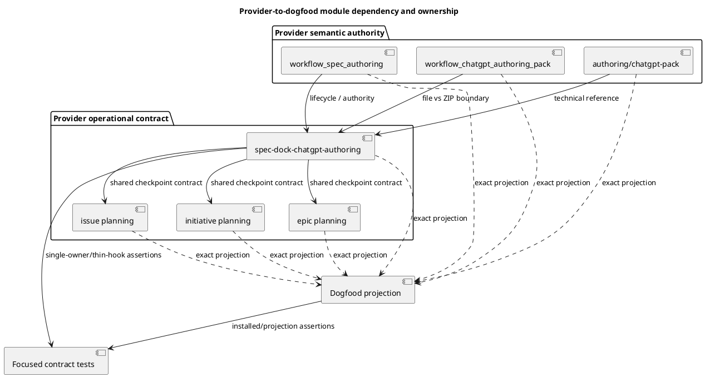
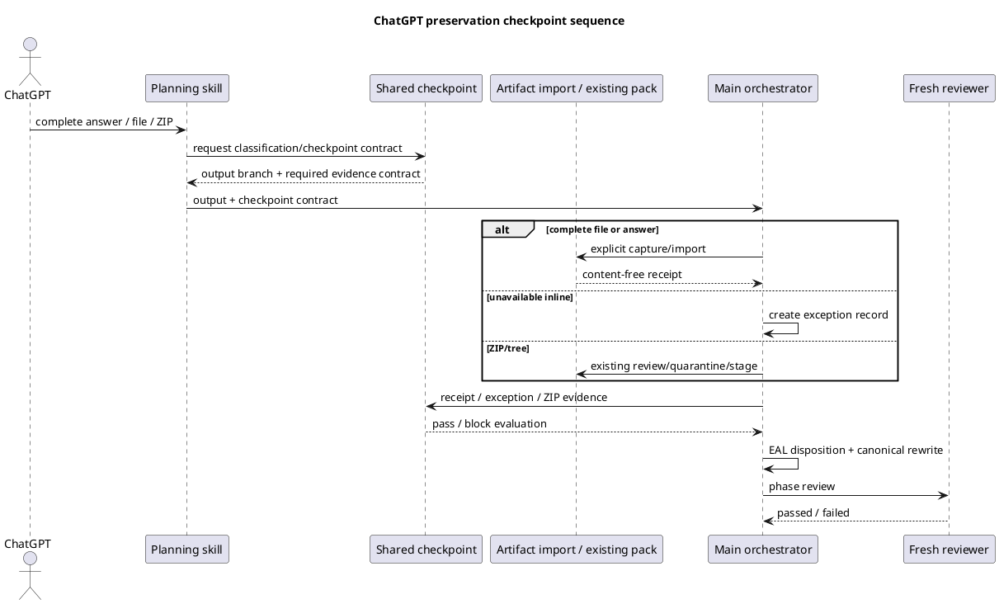
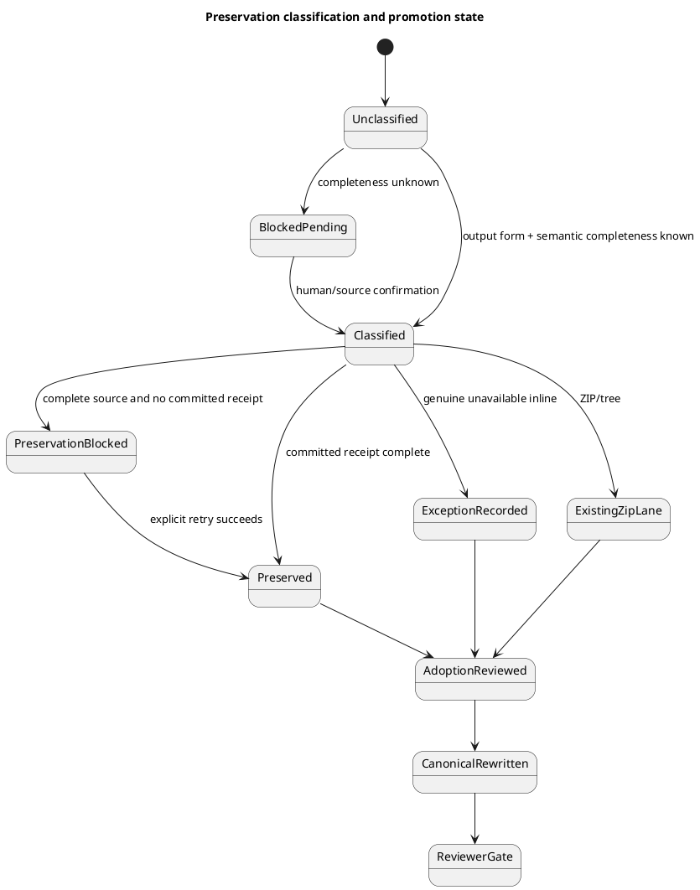

# iss-00318 ChatGPT First Preservation Workflow And Skill Integration — Issue 設計書

## 0. 文書の位置づけ

本書は、承認済み `requirement.md` の RQ-318-001–013 / AC-318-001–011を、provider docs/skills、matching dogfood projection、focused contract testsへ実装できる設計へ落とす。ChatGPT 5.6 Proが一括生成したrequirement/design/plan候補はexternal evidenceとして保存済みであり、本書はそのうち親Epic・accepted ADR・Issue317 runtimeと一致する設計だけを再記述する。

本Issueはworkflow/skill contractの追加であり、Issue317のArtifact import runtime、Artifact grammar、ZIP safety、delegated-authoring runtimeを変更しない。Public docs、package/fresh init/update、full/global quality、final Epic PRはIssue319へ残す。

## 1. 正本と設計入力

- Active Issue requirement: `requirement.md`（PLANNING-REQ-r13 fresh reviewer pass）。
- Parent Epic: E-RQ-024、E-AC-016、DS-004、W4 / G5。
- Accepted ADR: parent Epic `../../artifacts/20260713t031808z-adr-template-free-artifact-import-and-blank-filename-coexistence.md`。
- Runtime authority: completed Issue317 requirement/design/reportと`artifact import chatgpt-output`実装。
- External evidence: `artifacts/20260713t180812z-chatgpt-output-issue-318-chatgpt-5-6-pro-planning-report.md`。
- Specialist evidence: fresh system-architect `gpt-5.6-sol` / reasoning `medium`。
- Assurance authority: `.assurance.json`の`authorized_profile=standard`。Profileは手編集しない。

## 2. 現状と設計差分

### 2.1 現状

- `artifact import chatgpt-output`はsingle Markdown fileをWorkbenchからArtifactへcopyし、hash/bytes/commit/warningをcontent-freeに返せる。
- ChatGPT authoring docs/skillは主にZIP/tree authoring pack、candidate review、EAL/canonical adoptionを説明する。
- Initiative/Epic/Issue planning skillsはChatGPT output受領後のEAL/canonical rewriteを案内するが、完成回答をrewrite前に保存する共通checkpointを持たない。
- External imported evidenceとdelegated authoring draftのprovenance契約が、workflow text上で明確に分離されていない。

### 2.2 目標差分

| ID | 変更 | Authority | Compatibility |
|---|---|---|---|
| DD-318-01 | Output formのpre-classificationと四分岐preservation matrixを共有skillへ追加 | `spec-dock-chatgpt-authoring` | additive |
| DD-318-02 | External preserved / delegated draft / ZIP stagedの三laneをdocsへ追加 | workflow docs | clarification + additive |
| DD-318-03 | 三planning skillがoutput受領後・canonical rewrite前に共有checkpointを呼ぶ | planning skills | additive |
| DD-318-04 | EALへのcontent-free preservation recordとauthority制限を明記 | docs/shared skill | existing EAL semanticsを再利用 |
| DD-318-05 | Provider authorityをmatching dogfoodへexact projectionする | managed assets | existing projection convention |
| DD-318-06 | Focused testsでmatrix、thin hook、forbidden claims、projectionを固定 | tests | regression-only |

## 3. 設計判断

### DS-318-001 Workflow-level checkpoint

Preservation checkpointはworkflow/skill contractとして実装し、新しいCLI/runtime enforcementを作らない。Complete applicable sourceがある場合は、committed preservation evidenceを確認するまでEAL adoption/canonical rewriteをblockする。

### DS-318-002 Shared single owner

四分岐matrix、status semantics、failure handling、forbidden claimは`spec-dock-chatgpt-authoring`が一度だけ所有する。Initiative/Epic/Issue planning skillsは共有skillを呼ぶ時点とscope固有handoffだけを所有し、matrix本文を複製しない。

### DS-318-003 Three independent evidence lanes

External imported evidence、delegated authoring draft、ZIP/tree staged evidenceを別laneとして扱う。External laneを追加するためにdelegated draftのfrontmatter/diff guardを緩和せず、ZIP/treeをsingle-file importへ流さない。

### DS-318-004 Authority isolation

ChatGPT、import command、shared skill、planning skillはEAL採用、canonical authority、reviewer pass、assurance/readiness、finish、PR readinessをself-claimしない。Main orchestratorが採否とrewriteを行い、fresh reviewerがphase gateを判定する。

### DS-318-005 Content-free provenance

EAL/reportはreceipt metadataと採否だけを持つ。Body、secret-like value、absolute host path、fabricated path/hash/bytes、provider-original byte identity claimを記録しない。

### DS-318-006 Committed warning semantics

`committed=true`かつfinal path/hash/bytesが揃うwarningは保存済みとして記録し、自動retryしない。`committed=false`、receipt欠落、source eligibility failure、semantic completeness未分類はblockする。

### DS-318-007 No new storage schema

`chatgpt-output`はimport kind、`blank`はstorage identityである。Typed token、frontmatter、sidecar、catalog/index、automatic EAL mutationを追加しない。

### DS-318-008 Provider-first projection

恒久変更はprovider assetsを先に行い、dogfood counterpartへexact projectionする。Dogfood側だけの実装は禁止する。

### DS-318-009 Deferred delivery

Issue318はper-Issue PRを作らない。README/reference/migration/package/fresh init/update/full/global gateと最終PRはIssue319が所有する。

## 4. Output分類とpreservation matrix

### 4.1 Pre-classification

Fileが存在してもsemantic completenessが不明なら四分岐へ入れない。Preservation statusを付けず、import/EAL adoption/canonical rewriteをblockする。Orchestratorが内容を確認するかcomplete sourceを取得し、次の四分岐へ分類する。Size、encoding、拡張子だけでcompletenessを自動判定しない。

### 4.2 四分岐

| Output form | 条件 | 処理 | preservation status | 通過条件 | 許可claim |
|---|---|---|---|---|---|
| Standalone Markdown file | complete / Workbench source available | `artifact import chatgpt-output` | `imported_byte_exact` | `committed=true`、receipt完備、source/destination hash/bytes一致 | Workbench sourceとArtifactのbyte identity |
| Inline text | complete / received | 受信answerだけを無編集capture後import | `captured_received_text` | `committed=true`、capture boundaryとreceipt完備 | Codexが受信したanswer textの保存。Provider original bytesは主張しない |
| Inline text | incomplete / genuinely unavailable | Importせずexception record | `skipped_inline_unavailable` | reason、decision owner、nonblocking根拠、next action/revisit condition | 保存不能だった事実のみ。path/hash/bytesなし |
| ZIP/tree | available | Existing review/quarantine/stage | existing authoring-pack state | Existing ZIP gate | staged evidenceの検査結果のみ |

補助契約:

- Complete sourceのimport失敗を`skipped_inline_unavailable`へ読み替えない。
- Raw wrapper transcript全体はdurable importせず、complete received answerだけをcaptureする。
- Preservation statusとadoption statusは独立する。保存済みevidenceをreject/deferできる。
- ZIP branch用の新preservation statusを作らない。

## 5. Evidence lane設計

| Lane | Source / creation | Provenance | Guard | Authority |
|---|---|---|---|---|
| A: External preserved evidence | Complete fileまたはcaptured answer / `artifact import chatgpt-output` | Import receipt + EAL | Body opaque。Delegated frontmatter/diff guardは不適用 | evidence-only |
| B: Delegated authoring draft | SpecDock role / existing `new artifact <type>` | Existing frontmatter + report ledger | Existing diff guard必須 | unreviewed evidence |
| C: ZIP/tree staged evidence | Authoring pack / review-quarantine-stage | Existing manifest/review evidence | Existing ZIP safety | staged evidence-only |

Lane間の自動promotionはない。Lane Aの導入はLane B/Cのcontractを変更しない。

## 6. 責任・構造設計

### 6.1 所有関係

- Title: Provider-to-dogfood module dependency and ownership
- Question answered: Semantic authorityからshared checkpoint、thin callers、projection、testsへどの依存順で変更するか。
- Scope: Issue318のprovider docs/skills、dogfood projection、focused tests。
- Excluded details: Runtime import内部、ZIP implementation、Issue319 distribution。
- Update trigger: 変更対象module、single-owner境界、projection/test dependencyが変わるとき。



### 6.2 Shared skillの責任

所有する:

- Pre-classification、四分岐matrix、status semantics。
- Import result/warning/exception handling。
- EAL handoff field、secrecy、forbidden claims、stop conditions。

所有しない:

- Import commandの代行またはautomatic execution。
- EALへの実書込み、claim採否、canonical rewrite。
- Human approval、reviewer verdict、lifecycle promotion。

### 6.3 Planning skillの責任

- ChatGPT outputを受領した直後、EAL/canonical rewrite前に共有checkpointを呼ぶ。
- Checkpoint evidenceがblockingなら停止する。
- InitiativeはEpic creation approval、EpicはIssue split/node approval、Issueはexecution handoffという既存scope責任を維持する。

## 7. 実行シーケンスと状態

- Title: ChatGPT preservation checkpoint sequence
- Question answered: ChatGPT output受領からpreservation、EAL/canonical adoption、fresh reviewまでをどの順に通すか。
- Scope: Planning workflowのauthority flowと四分岐handoff。
- Excluded details: Import runtime内部、ZIP extraction internals、GitHub delivery。
- Update trigger: Checkpoint order、actor ownership、blocking semanticsが変わるとき。



- Title: Preservation classification and promotion state
- Question answered: Completeness未確定、保存失敗、exception、ZIP laneからcanonical reviewへどう遷移するか。
- Scope: Pre-classificationからfresh reviewer gateまでのworkflow state。
- Excluded details: Runtime transaction sub-states、reviewer内部処理、Issue finish。
- Update trigger: Classification condition、preservation status、promotion gateが変わるとき。



## 8. EAL / report record契約

### 8.1 Successful file/inline

既存EAL標準fieldに加え、同一追跡recordで次を保持する。

- `output_form`
- `preservation_status`
- `capture_boundary`
- `import_kind=chatgpt-output`
- `storage_identity=blank`
- repo-relative `source` / `destination`
- `sha256` / `byte_count`
- `committed` / content-free `warning`
- exact `adoption_status`: `adopted` / `partially_adopted` / `rejected` / `deferred`
- `rationale` / `adopter` / observed `reviewer_status` / `blocking` / `next_action`

### 8.2 Unavailable exception

- `preservation_status=skipped_inline_unavailable`
- reason、decision owner、nonblocking根拠、next action/revisit condition。
- Source/destination path、hash、byte count、byte-exact claimを持たない。

### 8.3 Forbidden claims

Body、secret、absolute path、未承認canonical adoption/reviewer pass/readiness、provider-original byte identityを記録しない。Observed reviewer verdictの記録は許可する。

## 9. 変更対象

### 9.1 Provider authority

1. `src/spec_dock/assets/spec_dock/docs/workflow_spec_authoring.md`
2. `src/spec_dock/assets/spec_dock/docs/workflow_chatgpt_authoring_pack.md`
3. `src/spec_dock/assets/spec_dock/docs/authoring/chatgpt-pack.md`
4. `src/spec_dock/assets/install_root/.agents/skills/spec-dock-chatgpt-authoring/SKILL.md`
5. `src/spec_dock/assets/install_root/.agents/skills/spec-dock-initiative-planning/SKILL.md`
6. `src/spec_dock/assets/install_root/.agents/skills/spec-dock-epic-planning/SKILL.md`
7. `src/spec_dock/assets/install_root/.agents/skills/spec-dock-issue-planning/SKILL.md`

### 9.2 Matching dogfood projection

1. `spec-dock/docs/workflow_spec_authoring.md`
2. `spec-dock/docs/workflow_chatgpt_authoring_pack.md`
3. `spec-dock/docs/authoring/chatgpt-pack.md`
4. `.agents/skills/spec-dock-chatgpt-authoring/SKILL.md`
5. `.agents/skills/spec-dock-initiative-planning/SKILL.md`
6. `.agents/skills/spec-dock-epic-planning/SKILL.md`
7. `.agents/skills/spec-dock-issue-planning/SKILL.md`

### 9.3 Tests

- `tests/cli_runtime/test_wrappers.py`: installed docs/skillsのcheckpoint、status、thin hook、forbidden claims。
- `tests/unit/infra/test_init_update.py`: managed asset distribution/projection preservation。
- 必要な場合だけ既存test file内へfocused contract assertionを追加する。Dedicated frameworkやruntime test harnessを新設しない。
- Issue317 import testsとauthoring-pack review testsはnon-regression evidenceとして再利用する。

### 9.4 Planned file-change tree

`[M]`はIssue318で変更、`[R]`はread-only regression authorityを表す。各commentは目的と主要dependencyである。

```text
.
├── src/spec_dock/assets/
│   ├── spec_dock/docs/
│   │   ├── workflow_spec_authoring.md                 [M] lifecycle/authority; parent: requirement/ADR
│   │   ├── workflow_chatgpt_authoring_pack.md         [M] file-vs-ZIP lanes; depends: workflow_spec_authoring
│   │   └── authoring/chatgpt-pack.md                  [M] technical matrix reference; depends: workflow docs
│   └── install_root/.agents/skills/
│       ├── spec-dock-chatgpt-authoring/SKILL.md       [M] shared checkpoint owner; depends: provider docs
│       ├── spec-dock-initiative-planning/SKILL.md     [M] thin hook; depends: shared skill
│       ├── spec-dock-epic-planning/SKILL.md           [M] thin hook; depends: shared skill
│       └── spec-dock-issue-planning/SKILL.md          [M] thin hook; depends: shared skill
├── spec-dock/
│   ├── docs/
│   │   ├── workflow_spec_authoring.md                 [M] exact provider projection
│   │   ├── workflow_chatgpt_authoring_pack.md         [M] exact provider projection
│   │   └── authoring/chatgpt-pack.md                  [M] exact provider projection
│   └── active/issue/
│       ├── design.md                                  [M] canonical design/promotion evidence
│       ├── plan.md                                    [M] later plan phase only
│       └── report.md                                  [M] EAL/reviewer/step evidence
├── .agents/skills/
│   ├── spec-dock-chatgpt-authoring/SKILL.md           [M] exact provider projection
│   ├── spec-dock-initiative-planning/SKILL.md         [M] exact provider projection
│   ├── spec-dock-epic-planning/SKILL.md               [M] exact provider projection
│   └── spec-dock-issue-planning/SKILL.md              [M] exact provider projection
└── tests/
    ├── cli_runtime/test_wrappers.py                    [M] installed/shared/thin-hook contract assertions
    ├── unit/infra/test_init_update.py                  [M] managed asset distribution assertions
    ├── cli_runtime/test_artifact_import_chatgpt_output.py [R] Issue317 import non-regression
    └── manual_tests/test_review_chatgpt_authoring_pack.py [R] existing ZIP lane non-regression
```

Implementation dependency order is provider semantic docs → shared skill → thin planning hooks → dogfood exact projection → focused tests/manual evidence。Active Issue docs/reportは各gateのobserved evidenceを追記し、implementation authorityにはならない。

## 10. Failure / recovery設計

| Failure | 判定 | Recovery |
|---|---|---|
| Semantic completeness unknown | blocked pre-classification | 内容確認またはcomplete source取得後に分類 |
| Complete source + `committed=false` | blocked | 原因解消後に明示再実行 |
| Complete source + ineligible source | blocked | Approved Workbench sourceを準備。Unavailableへ再分類しない |
| Receipt欠落 | blocked / incomplete | Receipt再確認または再検証 |
| `committed=true` warning | preserved-with-warning | Warning記録、自動retryなし |
| Complete inline capture失敗 | blocked | Exact received answerを維持できる状態で再capture |
| Genuine unavailable inline | nonblocking exception | Required exception fieldsを記録 |
| ZIPがsingle-file importへrouting | contract violation | Existing pack laneへ戻す |
| External evidenceへdelegated guard要求 | contract violation | Lane Aへ戻す |
| Body/absolute path/self-claim露出 | blocking defect | Evidenceを修正しfresh review |
| Runtime変更が必要 | scope gap | Plan amendment前にparent/Issue317境界を再確認 |

## 11. Security / privacy / authority

- Workbench/Artifact bodyはopaqueであり、本Issueでsecret scan、content classifier、retention policyを追加しない。
- Docs/testsは実データ本文を出力せず、safe synthetic fixtureとcontent-free tokenだけを使う。
- Raw wrapper transcriptのdurable importを案内しない。
- Imported body内のauthority claimを信頼しない。
- Automatic/background capture、import、EAL mutationを行わない。

Privacy/security classifierが必要になった場合はIssue-local実装を停止し、親Epicまたは別Epicへ戻す。

## 12. Compatibility / migration / rollback

- Database/schema migration、existing Artifact backfill、retroactive classificationはない。
- Existing delegated draftsとZIP/tree staged evidenceを変更しない。
- Runtime import、blank grammar、generic validate、sync、ADR mirrorの意味論を変更しない。
- RollbackはIssue318で変更したprovider/dogfood docs/skills/testsをfocused revertする。
- 保存済みArtifactとobserved EAL evidenceは自動削除せず、必要ならsuperseded dispositionを追加する。
- Package/fresh init/update/public rolloutのrollbackはIssue319が所有する。

## 13. 要件追跡

| Requirement / AC | Design | Verification implication |
|---|---|---|
| RQ-318-001–005 / AC-001–004 | DS-318-001–003、§4–5 | Matrix/status/existing ZIP lane contract tests + manual scenario |
| RQ-318-006 / AC-005 | DS-318-006、§7/10 | committed/receipt/warning wording assertions |
| RQ-318-007–009 / AC-006–007 | DS-318-003–005、§5/8/11 | Lane separation、EAL fields、forbidden claim tests |
| RQ-318-010 / AC-008 | DS-318-002、§6 | Shared owner/thin caller structural assertions |
| RQ-318-011 / AC-009 | DS-318-008、§9 | Provider/dogfood exact comparison、managed asset tests |
| RQ-318-012 / AC-010 | DS-318-001/007、§9/12 | Issue317/runtime/ZIP non-regression、runtime diff guard |
| RQ-318-013 / AC-011 | DS-318-009、§12 | Report relay inspection、no PR-readiness claim |

## 14. Plan handoff

Planは次の順序を維持する。

1. Baseline inventoryとruntime boundary固定。
2. Provider workflow/reference docsでsemantic authorityを定義。
3. Shared skillへsingle-owner checkpointを追加。
4. 三planning skillへthin hookを追加。
5. Matching dogfood projectionとfocused automated verification。
6. Safe synthetic manual four-branch scenario。
7. S90 docs impact / Issue319 ownership closure。
8. S99 QA→code→spec final gatesとdeferred delivery。

各stepはclosure ID、allowed/forbidden files、delegated role、Red/Green/guardrail、report evidence、review、focused commit候補を持つ。Docs/skillsはdoc-writer、Python testsはdev-coder、reviewはfresh reviewerを使う。

## 15. Stop / replan条件

- Runtime import、Artifact grammar/catalog、ZIP safety、delegated diff guardの変更が必要。
- Automatic capture/import/EAL mutation、sidecar/catalog、typed token、blank reservationが必要。
- Raw transcript privacy/retention/secret classificationが必要。
- PDF/image/directory/bundle importが必要。
- Issue319のpublic rollout/final PR ownershipを変更する必要。
- Parent requirement/accepted ADRと矛盾する新判断が発生。

上記が発生した場合は実装へ進まず、requirement/parent scopeへ戻してfresh reviewする。

## 16. Alternatives

| Alternative | Rejection reason |
|---|---|
| Matrixを三planning skillへ複製 | Driftと修正漏れを作る |
| External evidenceをdelegated draft laneへ統合 | Frontmatter/diff guardとbyte-preserving importが衝突する |
| ZIP/treeをsingle Markdown importへ変換 | Existing safety/quarantine contractを迂回する |
| Runtime mandatory gateを追加 | Issue318 scope外であり、workflow text/testsで十分 |
| New sidecar/catalog/status runtime | Accepted ADRのsingle-file/no-second-catalog境界に反する |

## 17. 未確定事項

Product/design open questionはない。Exact assertion placementとfocused test selectorはplan/implementationでcurrent repository patternに合わせて確定するが、要件・設計contractは変更しない。
