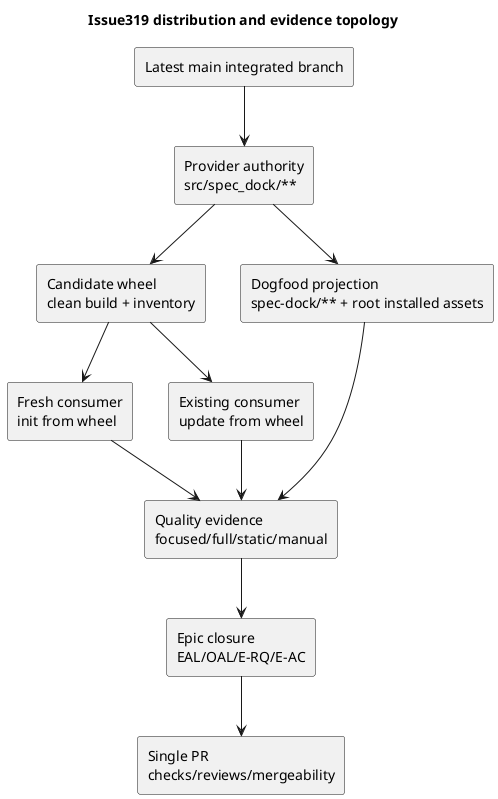
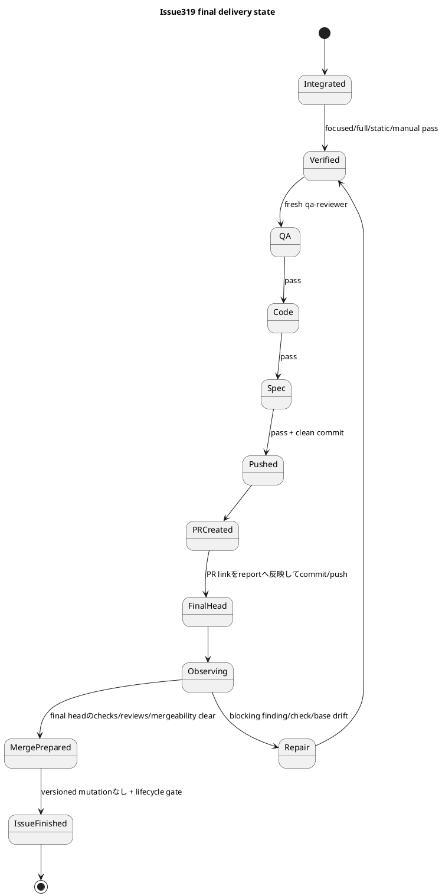

# iss-00319 Installed Runtime Dogfood Parity Final Quality And Mergeable PR — Issue 設計書（Standard）

## 0. 設計の位置づけ

本設計は、Issue315〜318でacceptedとなったcapabilityを変更せず、最新mainと統合したprovider assetsからpackage、fresh/existing consumer、dogfoodへ配布し、Epic final qualityと単一PR deliveryを閉じるための境界・責任・failure routingを定義する。

具体的なstep順、test ID、commit単位は`plan.md`で定義する。

### 設計タグ

- `[N]`: 必須契約。変更にはdesign再レビューが必要。
- `[P]`: 実行時に現物で確定する候補。
- `[E]`: Issue319外。owning Issue/Epic/ADRへrouteする。

## 1. Gradeと設計リスク

- Runtime assurance authority: `authorized_profile=standard`。
- RequirementのStrict候補はrisk signalであり、runtime authorityを上書きしない。
- Standard specialist evidenceとして、ChatGPT 5.6 Pro bundled analysisを保存・部分採用し、fresh spec-reviewerがcanonical designを判定する。
- 実装/repairを担当するDevCoderと全reviewerは`gpt-5.6-sol` / reasoning `medium`を用いる。

### Escalation guard

次の場合は実装を停止し、design/assuranceを再判定する。

- 新しいpublic CLI semantics、schema、migration、persistent data変換が必要になった。
- Existing Workbenchを削除・変換・再生成する必要が生じた。
- Accepted copy/import/preservation contractの変更が必要になった。
- Secret/credential本文を扱う実装やログが必要になった。
- Version/release policyのdurable decisionが必要になった。

## 2. Normative sources

| Priority | Source | Design authority |
|---|---|---|
| 1 | Accepted Artifact import ADR | Template-free blank coexistence、byte/source/no-overwrite authority |
| 2 | Parent Epic requirement/design/plan | E-RQ/E-AC、DS-001〜005、W5 final ownership |
| 3 | Issue315〜318 approved requirement/design/plan/report | Implemented capability、relay、non-goal、failure owner |
| 4 | Issue319 approved requirement | RQ-319-001〜016、AC-319-001〜016 |
| 5 | Current provider/runtime/package/docs/tests | Exact implementation/test placement |
| 6 | Preserved ChatGPT Artifact | Advisory candidate only; EAL採否が必要 |

## 3. Requirement-to-design trace

| Requirement / AC | Design |
|---|---|
| RQ-319-001 / AC-319-001〜002 | DS-319-001 Planning/preservation authority |
| RQ-319-002 / AC-319-003 | DS-319-002 Main integration gate |
| RQ-319-003〜006 / AC-319-004〜007 | DS-319-003 Distribution topology、DS-319-004 Update preservation、DS-319-005 Parity |
| RQ-319-007 / AC-319-008 | DS-319-006 Public docs impact |
| RQ-319-008〜009 / AC-319-009〜010 | DS-319-007 Quality matrix、DS-319-008 Platform gate |
| RQ-319-010 / AC-319-011 | DS-319-009 Installed integrated scenario |
| RQ-319-011 / AC-319-012 | DS-319-010 Epic closure ledgers |
| RQ-319-012〜014 / AC-319-013〜016 | DS-319-011 Ordered review/PR/lifecycle |
| RQ-319-015〜016 | DS-319-012 Secrecy/minimal repair |

## 4. Current stateと責任配置

### 4.1 Provider authority

| Surface | Authority | Projection/consumer |
|---|---|---|
| Installer/package | `src/spec_dock/cli.py`, `pyproject.toml`, `src/spec_dock/assets/**` | Installed target repo |
| Runtime CLI | `src/spec_dock/assets/spec_dock/scripts/spec_dock_runtime/**` | `spec-dock/scripts/**` |
| Shipped docs/templates/system | `src/spec_dock/assets/spec_dock/{docs,templates,system}/**` | `spec-dock/{docs,templates,system}/**` |
| Agent tooling | `src/spec_dock/assets/install_root/**` | root `.agents/**`, `.codex/**`, `.github/**` |
| Workbench ignore | `src/spec_dock/assets/spec_dock/.gitignore` | Installed/dogfood `spec-dock/.gitignore` |

`spec-dock/**`やroot installed assetsをprimary implementationとして直接直さない。Dogfood/fresh/update差分はprovider ownerへrouteしてからapproved projectionで更新する。

### 4.2 Current distribution gap

- Issue315〜318のprovider/dogfood局所parityはreview済み。
- Parent contract上のroot Workbenchは`<repo>/spec-dock/.workbench/`であり、current `spec-dock/.gitignore`でもignore済みである。Issue319ではrepository-root `.workbench/`や新しいroot managed ignoreを追加せず、candidate wheel由来のfresh/existing consumerとdogfoodで既存4 placement matrixを再検証する。
- Public root/docs、candidate wheel、fresh/existing consumer、full/static、Linux publication、manual integrated scenario、Epic closure、PRは未検証。
- Local branchはlive observationで`origin/main...HEAD = 31 53`。Final quality前に統合が必要。

## 5. Target distribution topology

### DS-319-001 Planning/preservation authority `[N]`

- ChatGPT bundled outputはscope-local Workbenchからbyte-preserving Artifactへimport済みとし、canonical採否はEALで分離する。
- Requirement → Design → Planのfresh review順を維持し、review前のdraftをexecution authorityにしない。
- Assurance `authorized_profile=standard`をobligation authorityとする。

### DS-319-002 Main integration gate `[N]`

- Distribution/quality baselineの前に`origin/main`をfetchし、merge-base/ahead-behind/conflictを観測する。
- Diverged時はnon-destructive mergeを標準候補とし、rebase/force push/history rewriteを自動選択しない。
- ConflictはpathごとにIssue315〜318/parent/current-main ownerへrouteし、accepted semanticsを推測で解決しない。
- Base driftがPR観測中に起きた場合も同じgateへ戻る。

### DS-319-003 Provider-to-consumer topology `[N]`

- Candidate wheelはclean managed tempでbuildし、archive inventoryをprovider expected inventoryと比較する。
- Fresh init/updateはinstalled candidate executableを使い、source checkout importや`PYTHONPATH` shortcutを禁止する。
- Dogfood refreshはproviderからのapproved update/projection pathを用いる。

### DS-319-004 Existing update preservation `[N]`

- Pre-feature baselineはS00で実在refから確定する。推測したcommitを使わない。
- Root/Initiative/Epic/Issue Workbenchにsafe binary/text sentinelとnested pathsを配置し、update前後のrelative path、entry type、bytes/hashを比較する。
- Managed assets更新とunmanaged Workbench preservationを別inventoryとして測る。
- Failure時はconsumer fixtureを保持し、削除・再作成でpassさせない。

### DS-319-005 Parity contract `[N]`

- Provider/dogfoodは対象surfaceごとにexact pair inventoryを持つ。
- Byte parity対象外はPlan/reportでexact relative pathまたはexact pairごとに列挙し、owner、理由、生成方向、再生成commandを明示する。Wildcard/category単位のblanket exceptionを許可しない。
- Mismatchをdogfood-only editで修復せず、provider changeまたはprojection defectへrouteする。

## 6. Public docs and compatibility

### DS-319-006 Public docs impact `[N]`

候補surface:

- `README.md`
- Provider/dogfood `docs/README.md`
- Provider/dogfood `docs/guide.md`
- Provider/dogfood `docs/reference_naming.md`
- Provider/dogfood `docs/reference_worktree.md`
- Existing Workbench/Artifact/ChatGPT authoring docs
- CLI help/text/JSON contract tests

Docsは次の単一semanticsを共有する。

1. Root Workbenchはdate-bucket/manual selectionで、bulk copy command対象外。
2. Scope-local Workbenchだけがexplicit `workbench copy`対象。
3. Copyはone-shot source-winsで、automatic sync/copy-backなし。
4. `artifact import chatgpt-output`はsingle Markdown bytes/sourceを保持するblank Artifact import。
5. Blank `chatgpt-output-*` filenameとの共存を許し、typed tokenを予約しない。
6. Workbench/Artifact/ChatGPT outputはcanonical authorityやreview passをself-claimしない。
7. Featureはexperimentalで、existing Workbench update migrationを行わない。

Dedicated migration fileは既存docsで表現不能と確認された場合だけ追加する。Version bump/lock changeもpackage/release contractが要求する場合だけ採用する。

## 7. Verification architecture

### DS-319-007 Layered quality matrix `[N]`

| Layer | Evidence | Failure owner |
|---|---|---|
| Focused W1 | ignore/opacity/authoring source/update/delete | Issue315 contract |
| Focused W2 | copy parser/application/infra/output/manual handoff | Issue316 contract |
| Focused W3 | Artifact import domain/application/infra/CLI/publication | Issue317 contract |
| Focused W4 | docs/skills/parity/preservation branches | Issue318 contract |
| Installer/package | wheel inventory、fresh init、existing update | Issue319 distribution |
| Full repo | unit、CLI runtime、integration、full pytest | Owning failing path |
| Static/format | configured mypy/Ruff/pre-commit gates | Owning source; no check disable |

- Narrow gateを先に実行し、修復後にaffected/full gateを再実行する。
- Historical countsはbaseline onlyで、latest head pass evidenceに使わない。
- Testをskip/disable/selector除外してgreen化しない。

### DS-319-008 Platform publication gate `[N]`

- macOS/local pathとLinux descriptor-backed no-replace pathを分離して記録する。
- Linux第一候補は`.github/workflows/provider-ci.yml`の`ubuntu-latest`上の`uv run pytest`とし、Artifact import publication testsがcollection/execution対象に含まれることを確認する。
- 利用不能ならpassにせず、PR blockerまたは明示riskとして扱い、required cross-platform acceptanceを勝手に縮小しない。

### DS-319-009 Installed integrated scenario `[N]`

Fresh installed consumerとtwo linked worktreesを用い、safe synthetic dataだけで次を観測する。

1. Root Workbenchから必要なfileだけをmanual selectionしてscope-localへ置く。
2. Source scope Workbenchをtarget worktree同scopeへexplicit copyする。
3. Complete Markdownを`artifact import chatgpt-output`でimportする。
4. Source/destination SHA-256、bytes、source survival、no overwriteを確認する。
5. EALにpreservation statusとadoption decisionを別fieldで記録する。
6. Fresh review後にcanonical rewriteする。

Output/reportには本文、secret-like value、absolute temp pathを残さない。

## 8. Epic closure and PR design

### DS-319-010 Epic closure ledgers `[N]`

- Epic reportにE-RQ-001〜024 / E-AC-001〜016をcurrent observed evidenceへmapする。
- EALはsource/claim/adoption/reason/evidence/owner/reviewer/blocking/next actionを持つ。
- OALはdistribution/final closureをprimary objectiveとし、docs/static/PR作業によるscope inversionを監視する。
- Unresolved `blocked`/`stale`を残してpromotionしない。`deferred`はnon-blocking reason/revisit conditionを持つ。

### DS-319-011 Ordered final review, PR, lifecycle `[N]`

- QA → code → specの順でfresh reviewし、全て`gpt-5.6-sol` / mediumを使う。
- S99 passまでPRを作成しない。
- PR作成後、PR URLをEpic/Issue reportへ反映する必要がある場合は先にreport commit/pushを行い、そのcommitをfinal headとしてchecks/review threads/mergeability/base driftを観測する。
- Repair後は影響gateからfresh rerunし、latest headへreview/checkをrebindする。
- Terminal observation後はversioned mutationを行わず`issue finish`する。観測結果はGitHub state、PR comment、final response等のexternal evidenceへ記録し、自己参照的なfinal report commitを作らない。
- Repairまたはreport変更が生じた場合は必ずVerified/final head observationへ戻る。
- PR mergeとGitHub Epic closeは別操作で、明示権限なしに行わない。

## 9. Secrecy, minimal repair, rollback

### DS-319-012 Evidence minimization `[N]`

- Workbench/Artifact本文、secret-like value、absolute host pathをlog/report/PR bodyに記録しない。
- Manual/test fixtureはsafe synthetic contentだけをversion controlへ入れる。
- Reviewer/workerへ渡すcontextも必要path/contractに限定する。
- Repairはfinding/owner単位のfocused diffにし、general refactor/new semanticsを混在させない。

Rollback単位:

- Main integration conflict repair
- Package/test additions
- Public docs/projection
- Quality repair
- Ledger/report/PR evidence

Issue315〜318のaccepted capabilityをIssue319 rollbackで再設計・撤去しない。Existing Workbenchを削除・再生成して回復しない。

## 10. Failure routing

| Failure | Route | Blocking scope |
|---|---|---|
| Main semantic conflict | Parent/current-main/Issue315〜318 owner | Final distribution全体 |
| Ignore/opacity regression | Issue315 contract | W1/fresh/update/full |
| Copy semantics/safety regression | Issue316 contract | W2/manual/full |
| Import byte/no-overwrite/publication regression | Issue317 contract | W3/manual/platform/full |
| Preservation/EAL/workflow regression | Issue318 contract | W4/manual/spec |
| Wheel/fresh/update/parity gap | Issue319 distribution | Package/consumer |
| Docs inconsistency | Issue319 docs、semantic gapならorigin contract | Docs/spec |
| Static/full failure | Failing path owner | Final review |
| PR check/review/base drift | Issue319 repair/integration | Merge-prepared claim |

## 11. Open decisions and execution handoff

Design時点でblocking open decisionはない。PlanのS00/S01で次をlive確定する。

- Latest `origin/main` divergence/conflict内容。
- Pre-feature update baseline ref。
- Exact candidate wheel inventory/command。
- Existing configured static/full commands。
- `.github/workflows/provider-ci.yml`でArtifact import publication testsがUbuntu full pytestへ含まれること。
- Repository-wide staticの既知relayである`scripts/authoring-pack/authoring_pack_review.py`と`scripts/authoring-pack/invoke_chatgpt_backend.py`のRuff drift、および追加driftの有無。
- Repository required PR checks/branch protection。
- Version/migration docs変更の実必要性。

これらは未検証であり、Planではpass claimではなく観測gateとして扱う。
