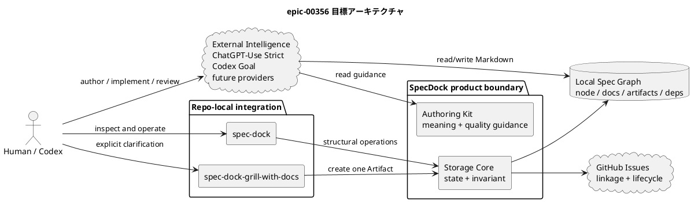
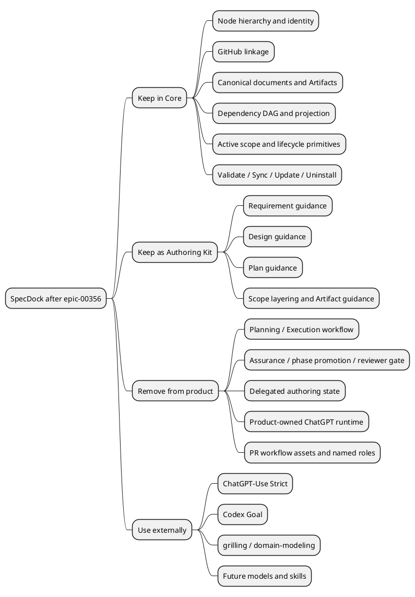
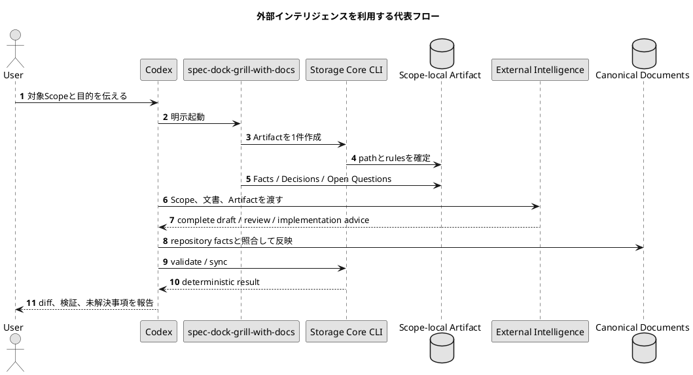
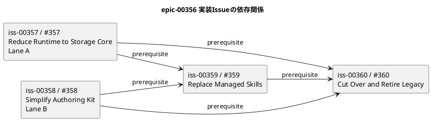
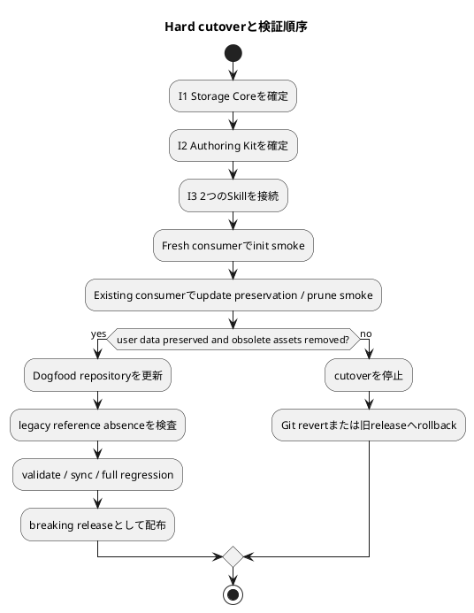

# epic-00356 新メンバー向け統合説明資料

> **対象:** 本日チームに参加し、SpecDockと本Epicの背景を初めて知るメンバー
> **読了目安:** 全体20〜30分、最初の「5分で分かる要約」だけなら5分
> **スナップショット:** 2026-08-08時点
> **位置づけ:** 本資料は理解を助けるEpic-local Artifactであり、仕様の正本ではない。

視覚レイアウトを優先する場合は、同内容の
[単体HTML版](20260807t155105z-disc-epic-00356-new-member-onboarding-guide.html)を参照する。

## 0. この資料の読み方

このEpicの情報は、要件定義書、設計書、実装計画書、レポート、議論記録に分散している。
本資料はそれらを一つの物語として読み直し、次の問いへ順番に答える。

1. なぜSpecDockを軽量化するのか。
2. 軽量化後も何を残し、何を製品から外すのか。
3. 新しい境界では、人間、Agent、ChatGPT、SpecDockがどう協働するのか。
4. 4つのIssueを、なぜこの単位と順序で進めるのか。
5. 既存利用者のデータをどう守りながら切り替えるのか。
6. 現在どこまで確定し、何が未解決なのか。

本文では、情報を次の3種類に分ける。

| 表示 | 意味 |
|---|---|
| **現在の事実** | `.meta.json`、GitHub、CLI、`report.md`で2026-08-08に確認できる状態 |
| **目標設計** | `requirement.md`、`design.md`、`plan.md`が提案する実装後の状態 |
| **注意事項** | 正本文書の不整合、未レビュー、実装前に解決すべき事項 |

## 1. 5分で分かる要約

### 1.1 一言でいうと

このEpicは、SpecDockを「開発作業を細かく指揮するワークフロー製品」から、
**仕様・作業構造を安全に保存する小さな基盤**へ戻す計画である。

目標の製品境界は、次の二つだけである。

- **Storage Core:** Initiative / Epic / Issue、仕様書、Artifact、依存関係、active scope、GitHub連携を安全に保存・操作する。
- **Authoring Kit:** `requirement.md`、`design.md`、`plan.md`を、特定のAIやワークフローに依存せず良く書くためのテンプレートとガイドを提供する。

ChatGPT、Codex Goal、将来の別モデル、外部Skillは、SpecDock内部の部品ではない。
それらはStorage CoreとAuthoring Kitを利用する**交換可能な外部インテリジェンス**になる。

### 1.2 なぜ変えるのか

現在のSpecDockは、仕様と依存関係の保存だけでなく、Planning、Review、Execution、
Assurance、ChatGPT連携、PR作成・監視・merge準備まで製品内で所有している。

この構成には、次の問題がある。

- モデル、ブラウザUI、Agent harness、レビュー手法の変化が、SpecDock本体の変更を誘発する。
- 多数のSkill、command、状態、証跡、テストを同時に保守する必要がある。
- 完全自動化を進めるほど、Issueの過剰分割や低価値な文書が増えやすい。
- 「構造を安全に保存する」という安定した責務と、「どう考え、どう実装するか」という変化の速い責務が混在する。

そこで、**構造の厳密さはSpecDockに残し、認知的な自由は外へ出す**。

### 1.3 何が変わるのか

| 分類 | 代表例 | 方針 |
|---|---|---|
| 残す | node階層、GitHub linkage、三文書、Artifact、dependency DAG、active、sync、validate | SpecDock Coreとして維持 |
| 整理して残す | Requirement / Design / Planテンプレートと作成ガイド | Authoring Kitとして簡素化 |
| 新しく限定する | `spec-dock`、`spec-dock-grill-with-docs` | managed Skillは原則この2つ |
| 製品から外す | Planning / Execution / Assurance / PR workflow / product-owned ChatGPT workflow | managed runtime・assetから削除 |
| 外部で利用する | ChatGPT-Use Strict、Codex Goal、`grilling`、`domain-modeling`、将来のAgent | Operator-owned / replaceable client |

### 1.4 どの順序で進めるのか

- `iss-00357`でRuntimeをStorage Coreまで縮める。
- `iss-00358`でAuthoring Kitを簡素化する。
- この2件が揃った後、`iss-00359`でmanaged Skillを2つへ置き換える。
- 最後に`iss-00360`でinstaller、update、uninstall、dogfood、移行、全体検証をまとめてcutoverする。

`iss-00357`と`iss-00358`は並行可能である。別の「最終品質Issue」は作らず、
`iss-00360`が統合と最終検証を兼ねる。

### 1.5 現在地

2026-08-08時点では、Epicと4つのIssue、依存関係だけが作成済みである。
実装は始まっていない。4つのIssue文書はscaffoldのままで、具体化も未実施である。

さらに、Epicの`requirement.md`はfresh reviewerで`fail`になっている。
したがって、依存関係上`ready=true`でも、planning完了やimplementation-readyを意味しない。

### 1.6 混同してはいけない三つの状態

| 状態 | 2026-08-08時点の実態 |
|---|---|
| **Current Product** | provider sourceには多数のmanaged Skillがあり、Runtime parser / registryにも`assurance`、`authoring`、`workflow`、`delegated-authoring`等が残っている。軽量化は未実装。 |
| **Current Planning** | Epic #356とIssue #357〜#360、依存edgeは作成済み。Requirement Reviewは`fail`、Design / Plan Reviewは未実施、各Issueはscaffold。 |
| **Target Product** | Storage Core + Authoring Kit + 2つのRepo-local Skill。旧workflow surfaceは削除され、外部インテリジェンスが交換可能になる。 |

GitHub Issueが作成済みであることは、Target Productが実装済みであることを意味しない。

## 2. 背景: SpecDockが抱えていた二つの責務

### 2.1 安定している責務

SpecDockが長期的に持つ価値は、ローカルGitリポジトリ内で次を一貫して管理することにある。

- Initiative / Epic / Issueの階層とstable ID
- GitHub Issueとの対応
- `requirement.md`、`design.md`、`plan.md`
- 調査、議論、ADRなどのScope-local Artifact
- 依存関係と循環検査
- active scope
- 人間向け・機械向けprojection
- `init`、`update`、`uninstall`時のmanaged asset管理

これらは、どのAIモデルを使っても基本的に変わらない。

### 2.2 変化が速い責務

一方、現在の製品は次のような「作業の進め方」まで所有している。

- Initiative / Epic / Issue planning workflow
- clarification、phase promotion、fresh reviewer gate
- assurance grade、specialist、delegated authoring
- Candidate / Review / Revision / Human Decision / Apply
- ChatGPT-first orchestrationとOracle固有の境界
- Issue / Epic execution workflow
- PR creation、observation、merge preparation
- named sub-agent roleとhost adapter

これらはモデル能力や利用環境によって最適解が変わる。安定したStorage Coreに同居させると、
SpecDock本体が外部環境の変化を受け続ける。

### 2.3 このEpicの中心判断

中心判断は「自動化をすべて捨てる」ことではない。

> **自動化の選び方をSpecDockが固定しない。**
> **SpecDockは、どの自動化からも安全に使える保存・構造基盤になる。**

人間やAgentは自由に考え、Markdownを編集できる。一方で、node作成、依存関係、GitHub linkage、
projectionのように破損すると困る構造変更はCLIだけが担う。

## 3. 目標アーキテクチャ

### 3.1 全体像



この図の重要点は、External IntelligenceからStorage Coreへ「モデル固有の依存」が入らないことだ。
外部の能力は、ローカル文書、Artifact、CLI、Git repositoryという安定した契約だけを使う。

### 3.2 責務境界

#### Storage Coreが持つもの

- node identity、directory hierarchy、parent chain
- GitHub Issue linkage
- canonical local documentsの配置
- Scope-local Artifact
- `.meta.json.depends_on`とDAG invariant
- ready / blocked / indeterminate projection
- active scopeとIssue lifecycle primitive
- `new`、`import`、`close`、`delete`
- `deps`、`active`、`issue start`、`issue finish`
- `worktree`、`workbench`
- `sync`、`validate`、`doctor`
- `init`、`update`、`uninstall`

Storage Coreは、Prompt、model、browser session、reviewer、grade、特定Skill名を知らない。

#### Authoring Kitが持つもの

- `requirement.md`: 何を、なぜ、どの条件で達成するか
- `design.md`: どの境界、契約、構造で実現するか
- `plan.md`: どの順序、検証、完了条件で実装するか
- Initiative / Epic / Issueごとのscope差
- 受け入れ条件、edge case、図表、rollback、検証の書き方
- Artifactから正本文書へ情報を整理する考え方

テンプレートは最小限にし、詳しい説明はAuthoring Guideへ集約する。

#### Repo-local Skillが持つもの

`spec-dock`は、Scope、parent、正本文書、Artifact、dependency、CLIをモデルへ案内する。
PlanningやImplementationの進め方は規定しない。

`spec-dock-grill-with-docs`は、ユーザーが明示的に起動した場合だけ、対象Scopeを調べ、
外部の`grilling`と`domain-modeling`を利用し、一つのArtifactにFacts、Decisions、Alternatives、
Open Questions、Authoring Briefを残す。三文書は自動変更しない。

#### External Intelligenceが持つもの

- 高負荷な要件整理、設計、レビュー、実装
- TDD、debugging、code reviewなどの実行方法
- ChatGPTや別モデルへの接続方法
- Prompt、session、browser、provider設定

外部能力が利用不能でも、Storage Coreは通常どおり利用できなければならない。

### 3.3 「残す・削除する・外へ出す」の構造



### 3.4 認知的自由と構造的安全

| 操作 | 誰が行うか | 理由 |
|---|---|---|
| Markdown本文の読取り・編集 | 人間またはAgent | 内容には文脈と判断が必要 |
| node作成・close・delete | SpecDock CLI | identityと階層を壊さないため |
| dependency追加・削除 | SpecDock CLI | cycleや不正edgeを保存前に拒否するため |
| GitHub linkage | SpecDock CLI | ローカルとGitHubの対応を一貫させるため |
| projection生成 | SpecDock CLI | 決定的で再生成可能にするため |
| 仕様作成・レビュー方法の選択 | Operator | 最適な外部能力を交換可能にするため |

## 4. 新しい利用イメージ

### 4.1 代表的な一連の流れ



この流れは例であり、SpecDockが強制するstate machineではない。別のAgentや人手だけでもよい。

### 4.2 ChatGPT-Use Strictとの境界

ChatGPT-Use StrictはOperator-ownedであり、SpecDockへ同梱しない。
使う場合は、Codexがrepository、branch、HEAD、対象pathを確定し、ChatGPTがGitHub上の正確な状態を読み、
Codexが結果をローカルへ反映して検証する。

SpecDockは次を保存しない。

- model名やprovider設定
- browser profileやcookie
- wrapper path
- ChatGPT session ID
- attachment/resultのprovider固有schema

### 4.3 `to-spec`と`to-tickets`を採用しない理由

本Epicは、外部Skillのうち`to-spec`や`to-tickets`を標準フローへ入れない。
仕様書の正本とIssue構造をSpecDockが既に持っており、別のtrackerやlabel state machineを導入すると、
二重の正本と新しい結合が生まれるためである。

## 5. 4つのIssueと依存関係

### 5.1 全体グラフ



SpecDockの表現では、次のとおりである。

```text
iss-00359 depends_on iss-00357, iss-00358
iss-00360 depends_on iss-00357, iss-00358, iss-00359
```

### 5.2 Issue一覧

| Issue | 目的 | 主な成果 | 依存 | 現在 |
|---|---|---|---|---|
| [`iss-00357` / #357](https://github.com/chemitaro/spec-dock/issues/357) | RuntimeをStorage Coreまで縮小 | command registry、core layer、削除inventory、core regression | なし | OPEN、文書scaffold |
| [`iss-00358` / #358](https://github.com/chemitaro/spec-dock/issues/358) | Authoring Kitと文書契約を簡素化 | templates、authoring guides、parity tests | なし | OPEN、文書scaffold |
| [`iss-00359` / #359](https://github.com/chemitaro/spec-dock/issues/359) | managed workflow Skill群を2 Skillへ置換 | `spec-dock`、`spec-dock-grill-with-docs`、obsolete inventory | 357、358 | OPEN、blocked、文書scaffold |
| [`iss-00360` / #360](https://github.com/chemitaro/spec-dock/issues/360) | distributionとdogfoodをhard cutover | init/update/uninstall、migration、smoke、docs、最終検証 | 357、358、359 | OPEN、blocked、文書scaffold |

### 5.3 `iss-00357`: Reduce Runtime to Storage Core

このIssueは、runtimeの「残すもの」を先に確定する。

主な作業:

- parser / registryからworkflow固有commandを削除する。
- domain / application / infra / presentationのworkflow実装とtestを削除する。
- node、artifact、deps、active、lifecycle、sync、validateなどCore操作を維持する。
- 旧command aliasやautomatic fallbackを残さない。
- dependency storage formatと既存node treeを変更しない。

完了時には「Coreとして何が利用できるか」がCLI helpとregressionで明確になる。

### 5.4 `iss-00358`: Simplify Authoring Kit and Document Contracts

このIssueは、良い仕様書を書く支援を残しながら、workflow固有の義務を除く。

削除対象の代表語彙:

- grade、reviewer gate、promotion
- Evidence Adoption Ledger
- delegated evidence、fallback evidence
- merge-prepared、execution-ready state machine

テンプレートは短くし、詳しい例や判断基準はguideへ移す。特定modelやSkill名に依存させない。

### 5.5 `iss-00359`: Replace Managed Workflow Skills with SpecDock Skills

I1とI2が確定した後、その契約をAgentへ伝える薄いintegrationを作る。

- `spec-dock`: CoreとAuthoring Kitへの案内役。別workflowを開始しない。
- `spec-dock-grill-with-docs`: 明示起動の対話支援。Artifactだけを作り、正本文書を自動変更しない。

外部`grilling` / `domain-modeling`がなければ、後者だけが明確に停止する。Coreは影響を受けない。

### 5.6 `iss-00360`: Cut Over Distribution and Retire Legacy Workflow Surfaces

最後のIssueは、横断的な整合を一つのdeliveryとして完成させる。

- fresh `init`の最小inventory
- existing consumerの`update`とobsolete cleanup
- `uninstall`の新旧inventory対応
- provider source、dogfood、installed consumerのparity
- README、migration、breaking release note
- fresh / existing consumer smoke
- 旧command、Skill、role、docs pointerのabsence check
- 全体のlint、test、validate、sync

ここが唯一のintegration / final verification Issueであり、別のfinal-quality Issueは作らない。

## 6. Migrationとデータ保護

### 6.1 Hard cutover

旧workflowと新境界を恒久的に併存させない。新Core、Authoring Kit、2つのSkill、installerを
同じreleaseで揃え、明確なbreaking changeとして切り替える。



### 6.2 保持するデータ

- `spec-dock/initiatives/**`配下のnode directory
- `.meta.json`とdependency edge
- Requirement / Design / Plan / Report
- Artifact / Discussion / accepted ADR
- GitHub linkage
- Workbenchのunmanaged content

### 6.3 削除対象

- SpecDock-managed planning / execution / clarification / authoring Skill
- managed PR workflow Skill
- managed host adapterとnamed agent role
- product-owned ChatGPT runtime
- obsolete workflow docs、templates、scripts、test
- 明示的にmanagedと判定できる旧asset

### 6.4 絶対に避けること

- user-owned `.agents/skills/*`、`.codex/*`、`.github/*`の削除
- historical documentの一括書換え
- 旧workflowを別名で再実装すること
- 新しいstate DB、receipt DB、review DBの導入
- Core schemaへのprovider名、model名、Prompt versionの埋込み

### 6.5 Rollback

新Core内部に旧workflow fallbackを残さない。問題があれば次を使う。

- Git revert
- 旧releaseへの明示的version rollback
- backupからmanaged assetを復元

この方針により、通常経路を単純に保ち、rollback経路だけを明示的にする。

## 7. 受け入れ条件を実装観点で読む

| 受け入れ領域 | 確認すること | 主担当Issue |
|---|---|---|
| Fresh install | Core、Kit、2 Skillだけが導入され、`validate`成功 | 360 |
| Command surface | 必要なCore commandは利用でき、旧workflow commandは不在 | 357、360 |
| Local authority | 三文書がローカル正本で、GitHub本文を正本にしない | 358、360 |
| Dependency graph | add/remove/check、cycle拒否、projection生成 | 357 |
| Authoring Kit | 旧gate語彙を除き、model-neutralなguideを提供 | 358 |
| Skill boundary | 2 Skillが責務を越えず、外部能力不在を安全に扱う | 359 |
| Existing update | node、文書、Artifact、deps、Workbenchを保持し旧managed assetだけprune | 360 |
| External smoke | 外部authoringとGoalベース実装が手動で成立 | 359、360 |
| Legacy retirement | 旧方針をcurrent routeから外し、新READMEで境界を説明 | 360 |

## 8. 検証戦略

### 8.1 自動検証

- Ruff / format / mypy
- Core unit / CLI regression
- installer `init` / `update` / `uninstall`
- packaged asset inventory
- provider / dogfood / installed consumer parity
- old command / Skill / roleのabsence regression
- fresh consumer smoke
- existing consumer preservation smoke
- SpecDock `validate` / `sync`

### 8.2 手動検証

- `spec-dock`がScope、文書、dependencyを正しく案内する。
- `spec-dock-grill-with-docs`が一つのScope Artifactを作る。
- external capability不在時に、限定された箇所だけが明確に停止する。
- ChatGPT-Use Strict等がAuthoring Kitを利用して三文書を作れる。
- Codex Goal等がIssueのPlanを入力に実装できる。

外部browserや特定modelそのものはCIへ固定しない。外部能力の交換可能性を守るためである。

## 9. 現在の状態と計画上の注意

### 9.1 現在確認できる状態

- Epic `epic-00356` / GitHub [#356](https://github.com/chemitaro/spec-dock/issues/356) はOPEN。
- `iss-00357`〜`iss-00360` / GitHub #357〜#360はOPEN。
- dependency edgeは計画どおり5本登録済み。
- `iss-00357`と`iss-00358`は構造上dependency-ready。
- `iss-00359`と`iss-00360`はdependency-blocked。
- 各Issueの三文書は未具体化のscaffold。
- Epicの要件・設計・計画は、提供ZIPからwhole-file copyされたdraft。

### 9.2 reviewerで未解決の事項

Epic requirementのfresh `spec-reviewer`は`fail`である。主な指摘は次のとおり。

1. 正本文書に`<EPIC_ID>`、`<GITHUB_ISSUE_NUMBER_OR_URL>`が残り、実体の`epic-00356` / #356と一致しない。
2. 残す`issue start` / `issue finish` / readiness projectionのreplacement semanticsが未定義。
3. `init-00322`をsupersedeするauthority、対象node、dispositionが文書上で不十分だった。
4. 外部能力をoptionalとする設計と、手動external smokeを受入条件にする記述の関係が曖昧。

この説明資料は指摘を整理するが、正本文書を修正したり、reviewer passへ昇格させたりしない。

### 9.3 `init-00322`に関する現在の差分

正本文書は、historical `init-00322` dataを保持し、I4でcurrent routeから外す計画だった。
しかし、文書作成後の2026-08-07に、ユーザーの明示指示で`init-00322`と配下Epic / Issueは
SpecDockから再帰削除され、対応するGitHub Issueもcloseされた。

したがって、実装前に次を正本文書へ反映する必要がある。

- 「将来I4でretireする」ではなく「既にretire済み」というbaseline更新
- historical data保持要件と実際の削除の扱い
- I4のlegacy retirement成果物から、完了済み作業と残作業を分離すること

### 9.4 `report.md`内のstaleな一行

`report.md`前半には4 Issue作成済みと記録されている一方、Spec Authoring Gate表のplan行には
「4 Issueは未作成」という、materialization前の記述が残っている。live `.meta.json`とGitHubでは
4 Issueが存在するため、本資料では「nodeは作成済み、Issue仕様は未具体化」を現在の事実として扱う。
この不整合を説明資料側で隠さず、正本レポートの更新事項として残す。

### 9.5 dependency-readyとimplementation-readyは別

SpecDockのdependency checkが`ready=true`でも、それは先行nodeがないという構造上の状態だけを示す。
現時点ではIssue仕様が未具体化であり、Epic requirement reviewも失敗している。
したがって、`iss-00357`や`iss-00358`を直ちに実装開始してよい、という意味ではない。

## 10. 実装時の判断ルール

新メンバーが変更を検討するときは、次を守るとEpicの意図から外れにくい。

1. **Provider sourceを先に直す。** `src/spec_dock/assets/`が配布物のauthorityで、`spec-dock/`はdogfood projectionである。
2. **Coreとworkflowを混同しない。** 構造invariantは残すが、認知的な進め方は製品へ戻さない。
3. **データ互換性を優先する。** workflow互換性のために旧commandやaliasを恒久維持しない。
4. **managed / user-ownedを識別する。** pruneはSpecDockが管理すると証明できるassetだけに限定する。
5. **外部providerをschemaへ入れない。** 接続はRepo-local / Operator-owned Skill側で行う。
6. **技術レイヤーではなく契約単位で完了させる。** I1〜I4の境界を守る。
7. **projectionを実装authorityにしない。** provider sourceを変更し、dogfood側で確認する。
8. **未解決事項を暗黙に決めない。** Epicの正本へ戻して明示的に解決する。

## 11. 新メンバーの最初の一日

### 11.1 推奨する読む順番

1. 本資料の「5分で分かる要約」と「目標アーキテクチャ」を読む。
2. [`requirement.md`](../requirement.md)で、目的・原則・受け入れ条件・禁止事項を確認する。
3. [`design.md`](../design.md)で、Core / Kit / Skill / external boundaryを確認する。
4. [`plan.md`](../plan.md)で、4 Issueの責務と依存関係を確認する。
5. [`report.md`](../report.md)で、reviewer failureと現在地を確認する。
6. 担当Issueが決まった後、そのIssueの三文書を具体化する。

### 11.2 状態確認コマンド

```bash
git status --short
./spec-dock/scripts/spec-dock active show
./spec-dock/scripts/spec-dock deps check --id epic-00356 --github --json
./spec-dock/scripts/spec-dock validate
```

これらは状態確認であり、Issueの実装開始を自動承認するものではない。

### 11.3 担当を始める前の確認

- Epic requirementの未解決findingがどう処理されたか。
- 担当IssueのRequirement / Design / Planが具体化・レビュー済みか。
- provider source、dogfood projection、testの対象範囲が明確か。
- 既存user dataとmanaged assetの境界がテスト可能か。
- dependency上の前提Issueが完了しているか。

## 12. 用語集

| 用語 | このEpicでの意味 |
|---|---|
| Storage Core | node、文書、Artifact、依存関係、active、GitHub linkageを保持する決定的な基盤 |
| Authoring Kit | Requirement / Design / Planを良く書くためのmodel-neutralなtemplateとguide |
| External Intelligence | ChatGPT、Codex Goal、外部Skillなど交換可能な認知・実行能力 |
| canonical document | node directory直下の`requirement.md`、`design.md`、`plan.md`などの正本 |
| Artifact | 調査、議論、分析、候補をScope-localに保存する非正本の作業面 |
| managed asset | SpecDock installerが導入・更新・削除の責任を持つファイル |
| user-owned asset | 利用者が所有し、SpecDockが勝手にpruneしてはならないファイル |
| dogfood projection | providerが配布する仕組みを、このリポジトリ自身で利用・検証する側の`spec-dock/` |
| hard cutover | 旧workflowとの恒久dual modeを作らず、新境界へ明示的に切り替えること |
| dependency-ready | 依存関係だけを見た構造上の実行可能性。仕様やレビュー完了は保証しない |
| provider neutrality | model、browser、外部Skillの固有情報をCore契約へ入れないこと |

## 13. よくある質問

### Q1. SpecDockはAIを使わなくなるのか

使わなくなるのではない。AIを製品内部へ固定せず、外から交換可能に使う。

### Q2. 仕様書作成支援も削除するのか

削除しない。Authoring Kitとして残す。ただしreviewer gateやprovider固有workflowは必須にしない。

### Q3. なぜMarkdown編集をCLI経由にしないのか

文書内容は人間やAgentが文脈を理解して編集する方が柔軟だからである。
破損しやすいnode構造やdependencyだけをCLIへ限定する。

### Q4. なぜ旧command aliasを残さないのか

workflow compatibilityを残すと、削除したはずの責務と保守コストが継続するためである。
必要なrollbackはGitまたは旧releaseで行う。

### Q5. なぜ4 Issueなのか

Runtime、文書契約、Skill integration、distribution cutoverは独立して検証できる契約だからである。
これ以上のplanning-only / review-only / final-quality分割は、解消したい過剰運用を再生産する。

### Q6. `iss-00357`と`iss-00358`はすぐ並行実装できるか

依存グラフ上は並行可能だが、現在はIssue文書がscaffoldでEpic reviewも未通過である。
実装開始には別途、仕様の具体化と現在の開始条件確認が必要である。

## 14. 情報源と正本の優先順位

本資料に矛盾を見つけた場合は、次の順に現在の事実を確認する。

1. `.meta.json`、SpecDock CLI、GitHubのlive state
2. [`report.md`](../report.md)の観測・reviewer記録
3. [`requirement.md`](../requirement.md)、[`design.md`](../design.md)、[`plan.md`](../plan.md)
4. 本資料
5. 過去の議論Artifact

主な導出元:

- [`requirement.md`](../requirement.md)
- [`design.md`](../design.md)
- [`plan.md`](../plan.md)
- [`report.md`](../report.md)
- [`Epic materialization guide`](20260807t114012z-disc-epic-materialization-guide.md)
- [`ChatGPT 4.6 Proとの議論記録`](20260807t114013z-disc-chatgpt-46-pro-core-simplification-discussion.md)
- GitHub [#356](https://github.com/chemitaro/spec-dock/issues/356)、[#357](https://github.com/chemitaro/spec-dock/issues/357)、[#358](https://github.com/chemitaro/spec-dock/issues/358)、[#359](https://github.com/chemitaro/spec-dock/issues/359)、[#360](https://github.com/chemitaro/spec-dock/issues/360)

## 15. まとめ

epic-00356の狙いは、SpecDockの価値を減らすことではなく、**最も安定した価値だけを製品境界へ残すこと**である。

- 構造とデータはStorage Coreが守る。
- 良い仕様書の書き方はAuthoring Kitが伝える。
- 考え方、レビュー、実装方法は外部インテリジェンスへ委ねる。
- Runtime、Kit、Skills、Cutoverの4契約に分けて進める。
- 既存利用者のデータを守りながら、旧workflowとのdual modeを作らず切り替える。

ただし現在はplanning途中である。正本文書のreviewer findingと、`init-00322`削除後のbaseline差分を
解消してから、各Issueを具体化し、実装へ進む必要がある。
