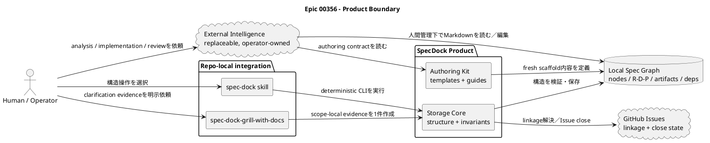
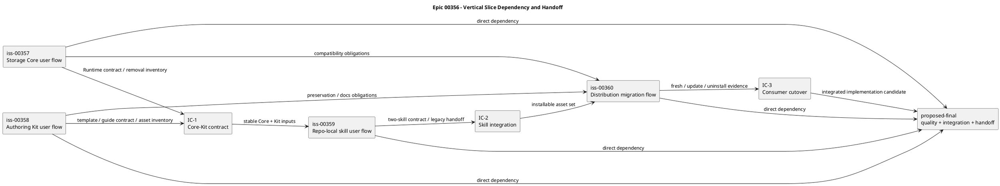

# epic-00356 SpecDock Core Simplification and External Intelligence Boundary — 設計

## 0. 後続決定と設計適用境界（2026-09-24）

Issue [#409](issues/iss-00409-scope-active-work-cli-redesign/design.md) が、三階層の `scope` / `active` / `work`、`artifact create --type`、CLI・Runtime・installer/schema migrationの現行詳細設計を所有する。本書の初回Core簡素化に関する旧 `issue start/finish`、optional positional Artifact type、357/360担当割当は履歴であり、#409と競合する現行設計ではない。Storage Core、Authoring Kit、External Intelligence境界およびデータ保全は引き続き本Epicの設計原則とする。

## 1. 設計概要

Target architectureは、安定した構造責務と変化の速い認知責務を分離する。

- **Storage Core**はdeterministicな構造操作とinvariantを所有する。
- **Authoring Kit**は文書の意味、薄いtemplate、詳細guideを所有する。
- **Repo-local skills**はCore / Kitへのnavigationと明示的なoperator actionを支援する。
- **External Intelligence**はoperator-owned clientであり、Runtime adapter、authority、gateではない。
- **Local Spec Graph + GitHub linkage**をdurable work structureとする。
- **Artifact / Report**はevidence / result summaryとし、durable decisionはR/D/Pまたはaccepted ADRへ置く。

## 2. Product boundary

この図は、SpecDock内に残す責務と、交換可能な外部clientへ移す責務を示す。

- **Title:** Current workflow-heavy productからTarget boundaryへの分離
- **Question answered:** 何をSpecDock内に残し、何を外部clientへ移すか。
- **Scope:** product responsibility、data flow、authority boundary。
- **Excluded details:** class / function名、installer file list、test command。
- **Update trigger:** retained / removed responsibility、external client contract、canonical authorityが変わるとき。



## 3. 初回Vertical sliceとhandoff（履歴）

以下はIssue 357〜360の初回Core簡素化時のhandoff図である。#409の現行CLI再設計の所有図ではない。既存Issue IDと依存の記録は保持する。

- **Title:** Existing Issue IDを保つvertical-slice dependency
- **Question answered:** どのIssueがどのend-to-end valueを所有し、何を次へ渡すか。
- **Scope:** Issue 357〜360、最終Issue候補、integration checkpoint。
- **Excluded details:** intra-Issue task ordering、branch name、commit structure。
- **Update trigger:** Issue dependency、ownership、handoff artifact、最終Issue候補のscopeが変わるとき。



品質・統合・handoff用の最終Issueは設計上の候補であり、人間承認まではnodeを作成しない。

## 4. 三階層Work lifecycleとevidence boundary

初回Coreの `issue start/finish`、`--force`、close→全active clear→post-syncは履歴である。#409の [D-04〜D-11](issues/iss-00409-scope-active-work-cli-redesign/design.md) を現行の文法・状態遷移・失敗回復契約とする。

- `active set TARGET`は選択だけを変更し、blocked Scopeも選択できる。
- `work start TARGET`はInitiative / Epic / Issue共通で、開始条件と依存を確認し、canonical branchを確保・checkoutしてからactiveを設定する。別作業への切替は`--switch-active`を明示する。
- `work finish TARGET`は対象をcompletedにし、選択中なら対象以下だけを解除する。親をcompletedにする場合、現在の全子孫がcompletedであることを要する。Git branch/HEADは変えず、Review / Plan / Test / Reportをgateにしない。
- `scope close TARGET`はactive/Gitを変更しない。`--reason`省略はcompleted、取り止めは明示`--reason not-planned`のみ。completed親への同一理由の再closeでも現在の子孫完了guardを先に再評価し、成立時だけno-opにする。
- GitHub失敗時に選択を保持し、remote成功後のactive解除失敗は別のpartial failureとして記録する。旧暗黙post-syncは契約に含めない。

## 5. 責務モデル

### 5.1 Storage Core

所有する責務:

- Node identity、parent chain、directory placement、GitHub linkage
- `.meta.json.depends_on`とDAG invariant
- active ID / pathとgenerated context pointer
- `active set`、三階層の`work start` / `work finish`、`scope close`（#409の現行契約）
- Artifact filename / collision / lock / symlink / path safety
- Current作成可能型とHistorical認識型の機械契約
- generic one-file import
- node scaffold mechanism
- sync / validate / doctor / worktree / workbench / deterministic mutation
- privacy-safe CLI outputとpartial-failure diagnostics

所有しない責務:

- Planning Level、quality level、review status、implementation handoff status
- model / provider / browser / Oracle selection
- evidence adoption、正本昇格、reviewer gate
- plan / test / reportの完了判断
- PR state machine

### 5.2 Authoring Kit

所有する責務:

- R/D/P/Reportの意味とscope layering
- Fresh template content
- Base authoring guide
- 一つのIssue `plan.md`と4 Completion Guide
- Artifact type semanticsとCurrent / Historical navigation
- durable decision reflection guidance
- link / vocabulary / template inventory / provider-dogfood parity expectations

parser、registry、lifecycle、dependency algorithm、installer prune executionは所有しない。

### 5.3 Repo-local skills

`spec-dock` skill:

- Current scope、parent chain、正本文書、Artifact、dependency、CLI helpへの入口を提供する。
- deterministic CLIによる構造操作を支援する。
- 撤去したworkflowを再実装せず、planning / implementation methodを強制しない。

`spec-dock-grill-with-docs` skill:

- explicit invocationでのみ動く。
- local docs / artifactsを読み、利用可能なexternal capabilityでclarificationを支援する。
- scope-local evidence Artifactを正確に1件生成する。
- R/D/Pを自動変更しない。
- external capabilityがない場合はno-writeで明示停止する。
- 用途に応じて`research` / `interview` / `disc` / `decision-candidate`を使い、`analysis` typeを作らない。

### 5.4 Distribution

Installer / updaterはmanaged asset inventoryとprune boundaryを所有する。Node-local正本文書とhistorical evidenceはuser-owned preservation surfaceとする。Provider source、dogfood、installed consumerは同じTarget contractを持つが、既存user contentのbyte equalityをprovider asset parityと混同しない。

## 6. Data / file contract

### 6.1 Authority hierarchy

| Surface | Role | Runtime gate |
|---|---|---|
| Epic / Issue `requirement.md` | why / what / acceptance | none |
| Epic / Issue `design.md` | boundary / structure / contract | none |
| Epic / Issue `plan.md` | sequence / verification / exit | none |
| accepted ADR | durable architecture decision | none |
| Artifact | research / question / synthesis / candidate evidence | none |
| thin `report.md` | optional-content result summary | none |
| `.meta.json.depends_on` | dependency graph source | dependency-only readiness |
| active manifest | selected ID + path | #409のWork開始・終了時の選択整合guard |

### 6.2 Artifact set

```text
CURRENT_CREATABLE = {
  blank, research, interview, disc, decision-candidate, adr
}

HISTORICAL_RECOGNIZABLE = {
  pr-repair-batch, draft-requirement, draft-design, draft-plan,
  scratch, note, legacy discussions, imported historical forms
}
```

初回Coreのhistorical inventoryはIssue 357の実装前inventoryで固定した。「新規作成できない」と「既存を認識できない」を同一にしない。

現行CLIは#409の `artifact create --scope TARGET --type TYPE --title TITLE [--slug SLUG]` と `artifact import file PATH --scope ARTIFACT_SCOPE` である。`--type`は必須で、旧optional positional typeは初回Coreの履歴である。Current 6種を作成でき、Historical typeは認識して保持するが新規作成しない。generic importは単一fileをopaqueに保存する。

### 6.3 Report

Fresh scope template:

```markdown
# Result Summary

## Outcome

## Verification

## Residual Risks / Follow-ups
```

必要な場合だけ`Notes`を追加する。内容が空でもvalidとする。Existing Reportはrewriteせず、RuntimeはReport path / contentsをlifecycle、dependency、quality、completion判定に使わない。

### 6.4 Planning Level

```text
templates/issue/plan.md
  -> docs/authoring/issue-plan.md
      -> docs/authoring/issue-plan-levels/{light|standard|strict|critical}.md
```

Level選択、理由、risk factor、再評価条件は通常の`plan.md`本文に書く。Runtime、`.meta.json`、active manifest、dependency projectionへ複製しない。履歴はGit diffで確認する。

## 7. 初回Sliceの履歴と現行所有権

以下の357〜360表とshared-file protocolは初回Core簡素化の履歴である。#409のCLI/Runtime/installer/schema migration、help、tests、consumer cutoverは#409が一体で所有し、旧357/360へ再割当しない。Authoring Kitとskillの非競合責務は維持する。

### 7.1 初回所有表

| Surface | 357 | 358 | 359 | 360 | Final候補 |
|---|---|---|---|---|---|
| Runtime parser / registry / commands | owns | no edit | consumes | packages | verifies |
| lifecycle / active / deps | owns | meaningのみ文書化 | consumes | packages | verifies |
| templates / authoring guides | mechanismのみ | owns content | consumes | packages | verifies |
| artifact semantics | implements | owns wording | consumes | packages | verifies |
| node scaffold | owns mechanism | owns file content | consumes | packages | verifies |
| repo-local skills | inventory handoff | guide-path handoff | owns | packages / prunes | verifies |
| installer managed inventory | removal inventory | asset inventory | skill inventory | owns | verifies |
| existing consumer preservation | Runtime fixtures | doc fixtures | skill compatibility | owns migration | cross-checks |
| full regression / change-set assembly | targeted only | targeted only | targeted only | consumer integration | owns |

Shared-file protocol:

1. 357 / 358はprovider-vs-dogfood pathを別branchで同時に大量編集しない。
2. 357はRuntime mechanismとcontract fixtureを作り、template proseは358に残す。
3. 358はRuntime symbolを参照するtestをcontract-levelに限定し、parser / registryを直接編集しない。
4. IC-1でscaffold fixture、Artifact catalog、Report path、help wordingを統合する。
5. 360がpackage inventoryを切り替えるまで、359はobsolete managed skillを物理pruneしない。
6. Final候補はfeature redesignを行わず、統合で発見したdefectだけを修正する。

## 8. Migration architecture

### 8.1 Fresh consumer

- Target managed assetsだけをinstallする。
- single R/D/P + thin Report templateを配布する。
- Current 6 Artifact template、Base + 4 Level Guide、2 repo-local skillを配布する。
- removed Runtime surface / docs / skillが存在しない。

### 8.2 Existing consumer update

- managed ownership inventoryに基づいてobsolete managed assetをpruneする。
- existing node-local R/D/P/Report、Artifact、Discussion、ADR、`.assurance.json`を保持する。
- generated stateは再生成する。
- missing external capabilityをinstall blockerにしない。
- partial prune / copy failureは再実行可能なdiagnosticを残す。

### 8.3 Uninstall

- current managed assetとknown legacy managed assetをownership boundary内で除去する。
- user-owned specs / evidenceを削除しない。
- partial successを黙って成功扱いせず、recovery contractを残す。

## 9. Failure mode

| Failure | Required behavior |
|---|---|
| GitHub close fails | activeを保持し、再実行方法を返す |
| work finishのclose succeeds but active clear fails | close済み可能性、active recovery、再実行をpartial successとして示す |
| projection failure | #409の明示syncとlifecycle結果を区別する。旧暗黙post-syncを再導入しない |
| dependency blocked | #409の`work start`は開始せず、`--switch-active`でも依存を迂回しない |
| blocked Scope selection | `active set`は選択を許可する |
| historical Artifact present | validateを壊さず、新規作成だけ拒否する |
| removed command invoked | unknown commandまたは明示的なmigration guidance。旧backendへfallbackしない |
| external grilling unavailable | 正本を書かず、misleading successを返さず、operator actionを示す |
| update prune ownership ambiguous | delete前にfailし、inventory evidenceを返す |
| existing Report heavy | bytesを保持し、Runtime gateを起動しない |

## 10. Verification design

- **Unit:** artifact parser / sets、active data、dependency check、lifecycle ordering、installer inventory function
- **Application integration:** start / finish failure matrix、generic import、Assuranceなしscaffold、authority非依存
- **CLI:** #409のhelp inventory、旧入口negative test、明示Artifact `--type`、三階層Work、privacy-safe output
- **Asset:** template exact catalog、Level Guide link、Current禁止語彙、provider / dogfood parity
- **Consumer:** fresh init、existing update、uninstall、partial failure、historical fixture preservation
- **Skill:** 2 skillだけ、provider-owned AI callなし、evidence Artifact 1件、正本自動変更なし
- **Cross-slice:** Core + Kit + Skills + Distributionのend-to-end smoke
- **Delivery:** package build、full suite、diff audit、independent review evidence、coherent change-set assembly

Exact removed module / test / asset listは、各implementation branchの開始時に再計算する。これはProduct decisionではなく、初回357/360の履歴inventoryである。#409 cutoverのexact inventoryと検証は#409計画で所有する。
