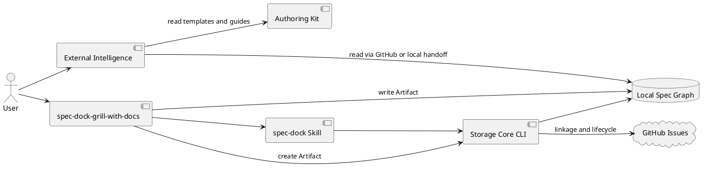

# <EPIC_ID> SpecDock Core Simplification and External Intelligence Boundary — 設計（どう実現するか）

## 1. 設計判断

### D-001 単独Epicとして実施する

本変更はSpecDock自身のarchitecture boundaryを縮小する一つのcoherent contractである。
既存の`init-local-00003`はopen-endedなarchitecture initiativeであり、新規Initiativeを作らない。

`init-00322 GPT 56 ChatGPT First Intelligence Architecture`は本変更の親にしない。
同InitiativeはPlanningからDeliveryまでの自動化を目標とし、本Epicの「製品所有workflowを撤去する」
方向と矛盾するため、cutover時のsupersede対象とする。

### D-002 Storage CoreとAuthoring Kitを別の責務として残す

```text
External Intelligence
  ├── ChatGPT-Use Strict
  ├── Matt Pocock Skills
  ├── Codex Goal
  └── future providers
          │
          ▼
Repo-local Skills
  ├── spec-dock
  └── spec-dock-grill-with-docs
          │
          ▼
SpecDock
  ├── Storage Core
  └── Authoring Kit
```

Storage Coreはstateとinvariantを、Authoring Kitは文書の意味と品質基準を所有する。
外部インテリジェンスは交換可能なClientであり、Coreのdependencyではない。

### D-003 認知的自由と構造的安全を分離する

- Markdown:
  - Agentが直接読取り・編集できる。
- Structure:
  - node、hierarchy、dependency、GitHub linkage、projectionはCLIだけが変更する。
- Workflow:
  - SpecDockは規定しない。
- Validation:
  - ファイル構造とgraph invariantだけを決定的に検証する。

## 2. 対象アーキテクチャ

### 2.1 Storage Core

#### Node graph

- Initiative
- Epic
- Issue
- stable ID
- parent chain
- GitHub Issue linkage

#### Knowledge storage

- canonical `requirement.md`
- canonical `design.md`
- canonical `plan.md`
- optional `report.md`
- Scope-local `artifacts/`
- accepted ADR
- optional Workbench

#### Work graph

- `.meta.json.depends_on`
- add / remove / check
- cycle validation
- ready / blocked / indeterminate projection
- `index*.json`
- `tree*.json`
- dependency JSON / PlantUML
- dashboard

#### Lifecycle and utility

- `new`
- `import`
- `close`
- `delete`
- `active`
- `issue start`
- `issue finish`
- `worktree`
- `workbench`
- `sync`
- `validate`
- `doctor`
- `update`
- `uninstall`

WorktreeとWorkbenchはworkflowではなく、isolation / staging primitiveとして残す。

### 2.2 削除するRuntime surface

Runtime registryから次を削除する。

- `assurance`
- `authoring`
- `delegated_authoring`
- `workflow` / `guidance`
- product-owned ChatGPT planning / review / revise / apply
- workflow state / runbook / context routing
- reviewer / specialist / grade interpretation

対応するdomain、application、infra、presentation、parser、wrapper、testsも削除する。
Core側にdeprecated aliasやautomatic fallbackを残さない。

### 2.3 Authoring Kit

推奨ディレクトリ概念:

```text
spec-dock/
├── templates/
│   ├── initiative/
│   ├── epic/
│   └── issue/
└── docs/
    ├── authoring/
    │   ├── overview.md
    │   ├── requirement.md
    │   ├── design.md
    │   ├── plan.md
    │   ├── scope-layering.md
    │   └── artifacts.md
    └── reference/
```

既存pathを大きく変更する必要はない。重要なのは、文書の意味をworkflow gateから分離すること。

#### Canonical authority

- `requirement.md`: 何を、なぜ、どの条件で達成するか
- `design.md`: どの境界、契約、構造で実現するか
- `plan.md`: どの順序、検証、完了条件で実装するか

#### Evidence

- `artifacts/`: 分析、調査、Interview、Review、Alternative、外部出力
- `report.md`: 任意の簡潔な実行・結果記録。必須state machineにしない
- Workbench: disposable staging

#### Template方針

Templateには完成文書に残る見出しと短い説明だけを置く。
詳細な例、判断基準、optional section、diagram catalogはAuthoring Guideへ置く。

削除する語彙:

- grade
- reviewer gate
- promotion
- EAL
- delegated evidence
- fallback evidence
- merge-prepared
- execution-ready state machine

## 3. Skill設計

### 3.1 `spec-dock`

#### Invocation

- Model-invoked
- Repository Scope
- SpecDock managed Skill

#### 責務

- explicit / active Scopeの解決
- parent chain、canonical docs、Artifact、dependencyの案内
- Markdownは直接編集可能であることを伝える
- structure mutationはCLIへ誘導する
- Authoring KitとCLI helpへのcontext pointerを提供する
- invoking workflowを優先する

#### 非責務

- Planning / Review / Implementation workflow
- ChatGPT呼出し
- Matt Skillの起動
- reviewer選択
- PR delivery

Skill本文にCLI syntax、Artifact schema、template全文を複製せず、current local help / rulesへ誘導する。

### 3.2 `spec-dock-grill-with-docs`

#### Invocation

- User-invoked
- `allow_implicit_invocation: false`
- Repository Scope
- SpecDock managed integration Skill

#### 外部能力

現在の実装は外部の次を利用する。

- `grilling`
- `domain-modeling`

これらをSpecDockへvendorしない。存在しない場合は、不完全な独自代替を実行せず、必要能力が
利用できないことを明示して停止する。

#### 処理

1. explicit Scope、なければactive Scopeを解決する。
2. Scope、parent docs、existing artifacts、関連code / tests、CONTEXT / ADRを読む。
3. SpecDock CLIで`interview`または`analysis` Artifactを一つ作る。
4. 返されたpathとrulesを使用する。
5. `grilling`と`domain-modeling`でFact / Decisionを解決する。
6. Artifactへ次を簡潔に残す。
   - Goal
   - Facts established
   - Decisions resolved
   - Alternatives considered
   - Rejected alternatives
   - Open questions
   - Authoring brief
7. Shared termだけをCONTEXTへ反映する。
8. ADR基準を満たす判断だけADR化する。
9. canonical Requirement / Design / Planは自動作成しない。
10. Userがshared understandingを確認した時点で完了する。

#### Provider neutrality

Skill名とArtifact本文はCapability中心にする。
Core metadataへMatt固有versionを必須化しない。任意provenanceのみ許可する。

## 4. 外部Authoring境界

### 4.1 ChatGPT-Use Strict

Operator-owned SkillとしてSpecDock外に置く。

概念フロー:

```text
Codex
  ├── Scopeと関連pathを解決
  ├── branchをpush
  └── exact repository / branch / HEADを確定
          │
          ▼
ChatGPT-Use Strict
  ├── GitHubからexact branchを読む
  ├── Authoring Kitを読む
  ├── parent docs / artifacts / code / testsを読む
  └── complete requirement / design / planを返す
          │
          ▼
Codex
  ├── local canonical docsへ反映
  ├── diffとrepository factsで検証
  └── validate / tests / commit
```

SpecDockはwrapper、browser、model、session、attachment、result schemaを所有しない。

### 4.2 External development skills

- TDD、debugging、code review等はlocal canonical docsを入力として利用できる。
- `to-spec` / `to-tickets`を標準導入しない。
- Issue作成とdependency mutationはCodexがSpecDock CLIで行う。

## 5. Distribution設計

### 5.1 Managed Skill

`_MANAGED_SKILL_NAMES`相当は二つだけにする。

```text
spec-dock
spec-dock-grill-with-docs
```

旧managed Skill、host adapter、named Agent role、consumer向けPR workflow assetをobsolete inventoryへ移す。

### 5.2 Installer

- `init`: 最小assetだけを導入する。
- `update`: managed dataをrefreshし、obsolete managed workflow assetをpruneする。
- `uninstall`: 新しいinventoryとlegacy inventoryの両方を安全に除去できる。
- User-owned `.agents/skills/*`、`.codex/*`、`.github/*`を誤削除しない。
- provider sourceとdogfood projectionの二重管理が必要な範囲を縮小する。

### 5.3 Existing workspace

- node treeとdocumentsはin-placeで保持する。
- `.assurance.json`等の旧workflow metadataはhistorical unmanaged dataとして残すか、
  明示的なobsolete managed fileだけを削除する。
- 既存`report.md`とArtifactを書換えない。
- 新Coreは旧gate stateを解釈しない。

## 6. Migration / Cutover

### Hard cutover

Workflow compatibilityを残さない。

1. New Core / Authoring Kit / Skillsを同一releaseへ揃える。
2. Fresh consumerでinit smokeを行う。
3. Existing consumerでupdate preservation / prune smokeを行う。
4. Dogfood repositoryを新構成へ更新する。
5. 旧command、Skill、agent role、docs pointerの残存を検査する。
6. `init-00322`と未完了child workをsupersededとして整理する。
7. Major versionまたは明確なbreaking release noteで公開する。

### Rollback

- Git revert
- 旧releaseへの明示的version rollback
- backupからmanaged assetを復元

新Core内に旧workflow fallbackを残さない。

## 7. データフロー



## 8. 失敗設計

### External Skillがない

- `spec-dock-grill-with-docs`だけが明確に停止する。
- Storage Coreと`spec-dock` Skillは通常利用できる。

### External providerが利用不能

- SpecDockは影響を受けない。
- Codexまたは別ProviderでAuthoring Kitを使用できる。

### Update途中のobsolete cleanup failure

- User dataを変更しない。
- removed / remaining managed pathsを構造化して返す。
- retry可能なcleanupを案内する。

### Historical docsが旧workflow語彙を含む

- Historical evidenceとして保持する。
- current template / guide / Skillから参照しない。
- 一括rewriteしない。

## 9. テスト戦略

### Core

- node / hierarchy / identity
- dependency DAG
- artifact path safety
- active / issue lifecycle
- sync / projection
- update / uninstall preservation

### Removed surface

- public parser / registryに旧commandがない
- packaged assetsに旧Skill / role / wrapperがない
- current docsに旧workflow entrypointがない
- `rg` / inventory regressionで再混入を検出する

### Authoring Kit

- provider / installed / dogfood parity
- templatesに旧gate語彙がない
- guideがRequirement / Design / Planの役割を説明する
- templateが過剰なpolicy cacheになっていない

### Skills

- `spec-dock`がworkflowを開始しない
- `spec-dock-grill-with-docs`が一つのScope Artifactを使う
- canonical docsを自動変更しない
- external dependency absenceを明確に扱う

### Consumer smoke

- fresh init
- existing update
- uninstall / reinstall
- node + artifact + deps + validate + sync
- manual external intelligence smoke

## 10. 未確定事項

なし。
