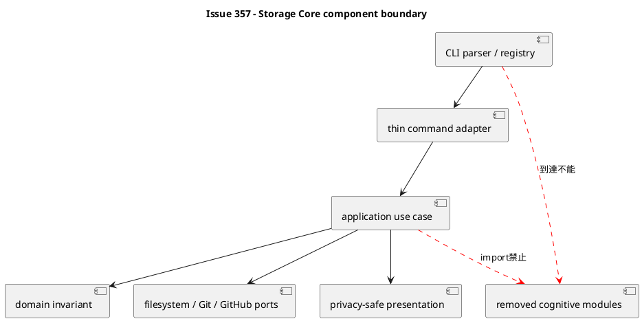
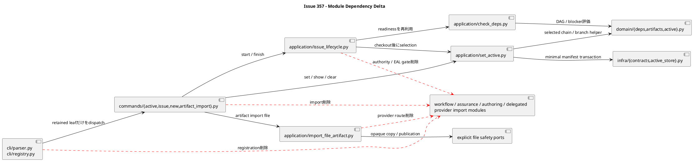

# iss-00357 Reduce Runtime to Storage Core — 設計

## 1. 設計目標

構造管理を行うStorage Coreと、撤去する認知的workflowをcode boundaryで分離する。保持するcommand pathはworkflow、Profile、Assurance、reviewer、Evidence Adoption Ledger、provider固有importをimportせず、外部Intelligenceがなくても決定的に動作する。

本IssueはRuntimeを小さくするだけでなく、active selection、Issue start / finish、dependency-only readiness、Artifact作成 / import、Fresh scaffoldを一つの利用者flowとして成立させる。

## 2. Requirement trace

| Requirement | 設計上の実現箇所 |
|---|---|
| `RQ-357-001` Storage Core command surface | §4、§13 |
| `RQ-357-002` active selection | §5 |
| `RQ-357-003` Issue start | §6 |
| `RQ-357-004` Issue finish | §7 |
| `RQ-357-005` Artifact creation | §9 |
| `RQ-357-006` Generic file import | §10 |
| `RQ-357-007` Fresh scaffold | §11 |
| `RQ-357-008` Compatibility | §5、§9、§12、§15 |
| `RQ-357-009` Cross-Issue handoff | §14 |

## 3. Target component boundary



TargetのModule Dependency Deltaは次とする。



赤破線はTargetで存在してはならない依存である。`domain/active.py`はbranch推定とselection helperを保持し、Active Manifestのdata classは既存の`infra/contracts.py`で直接縮小する。別domain modelへ移動しない。

原則:

- `cli/`は構文とdispatchだけを所有する。
- `commands/`はrequest / result変換とpresentation選択だけを所有する。
- `application/`はmutation順序、rollback、port呼出しを所有する。
- `domain/`はID、DAG、Artifact grammar、structural invariantを所有する。
- `infra/`はfilesystem、Git、GitHub、serializationを所有する。
- `presentation/`は機密情報を出さず、部分成功を区別して表示する。

## 4. CLI / registry contract

Target parser / registryはRequirement `RQ-357-001`の完全inventoryをそのまま実装する。保持する主なsurfaceはnode `new` / `import`、`active`、`issue`、`deps`、generic `artifact import file`、`close` / `delete`、`worktree` / `workbench`、`update` / `uninstall`、`sync` / `validate` / `doctor`である。

撤去する登録:

```text
assurance
authoring
guidance
workflow
delegated-authoring
artifact import chatgpt-output
```

parserから消すだけでなく、registry key、bootstrap wiring、alias / fallback、retained moduleからのimportを切る。`active set`からcheckout、GitHub、dependency、force用flagを除き、branch操作は`issue start`へ集約する。

物理moduleは次の順で扱う。

1. retained / removed / shared import inventoryを作る。
2. parser / registryの到達性を切る。
3. retained applicationからworkflow依存を外す。
4. shared safety primitiveをretained側へ残す。
5. import graphでunreachableと証明できたmoduleだけを削除する。

## 5. Active state

### 5.1 Target model

実在型`ActiveManifestEntry`を次の構造へ縮小する。

```python
@dataclass(frozen=True)
class ActiveManifestEntry:
    id: str
    path: str | None
```

`ActiveManifest`はInitiative / Epic / Issueの選択chainを保持する。JSONは`schema_version: 2`を維持し、top-levelのgenerated `updated_at`と各entryの`id`、repo-relative `path`だけを書く。

### 5.2 Compatibility

- loaderはlegacy entryの`authority`、`grants`、`promotion_record`等の未知・余剰fieldを無視して読める。
- readだけではfileを書き換えない。
- 次の明示的active mutationまたはbranch-derived regenerationでminimal schemaへ正規化する。
- absolute legacy pathはrepo内の`spec-dock/...`へ安全にcanonicalizeできる場合だけ受理する。
- `.meta.json`、R/D/P/Report、Artifactはactive migrationで変更しない。

### 5.3 `active set` flow

```text
TargetRefをlocal graphで解決
  -> Initiative / Epic / Issue chainを選択
    -> repo-relative id / path manifestを組み立てる
      -> active.json、active symlink、Context Packをtransactionalにcommit
```

GitHub network state、dependency、unfinished guard、quality、authority、Reportは読まない。blocked Issueも選択できる。commit失敗時はsnapshotからmanifest、Context Pack、managed pointerを復元する。

Context Packはactive ID / path、canonical R/D/P/Report / Artifact path、dependency view等のnavigation情報を持てるが、authority、grants、promotion、reviewer、EAL、Planning Levelを表示しない。

## 6. `issue start`

### 6.1 Flow

```text
Issue targetを解決
  -> active manifestを読む
    -> 別active IssueのGitHub stateでunfinished guard
      -> check_deps()と同じstatus_context / domain.deps経路でreadiness確認
        -> branch decision / checkout
          -> selection-only set_active
            -> post-mutation sync
```

dependency algorithmを`issue_lifecycle.py`へ複製せず、`application/check_deps.py`が用いるgraph、status context、`domain.deps`、deps readerを再利用する。direct / inherited blockerを同じ順序とidentityで返す。

### 6.2 Unfinished truth table

Requirement `RQ-357-003`の表をそのまま実装する。判断元はactive manifestとlinked GitHub stateであり、現在branchは診断情報にだけ使う。

- 同じactive Issueまたは別active Issueが`CLOSED`: dependency確認へ進む。
- 別active Issueが`OPEN`: `--force`なしで停止する。
- state `UNKNOWN`、linkなし、取得失敗、active node解決不能: fail-closed。`--force`だけがこのguardを迂回できる。
- main、non-Issue branch、detached HEADでも判定を変えない。

`--force`はdependency blocker、invalid target、checkout失敗、active write失敗を迂回しない。

### 6.3 Partial failure

- checkout失敗: active stateを変更しない。
- checkout成功後にactive writeが失敗: active stateはsnapshotへ戻す。branchが切り替わった事実と復旧commandを明示する。
- post-sync失敗: activeは設定済みでprojection staleとし、再sync手順を返す。

## 7. `issue finish`

```text
active IssueとGitHub linkageを解決
  -> close_node(run_post_sync=false)
    -> close成功 / already closed
      -> clear_active
        -> post_mutation_sync
```

Requirement / Design / Plan、test、review、Report、EAL、delegated artifact、authority、promotion recordを読まない。finish transition用のauthority / grant writeも行わない。

新しい例外階層は導入せず、既存のphase別`RuntimeError`、`IssueFinishResult`、`post_sync` result、非0 exitへ次を写像する。

| Phase | Result contract |
|---|---|
| GitHub close失敗 | active保持、close未完了、retry guidance |
| already closed | 成功としてclearへ進む |
| close成功後のclear失敗 | `github_issue_number`、close完了、`already_closed`、`active_cleared=false`、sync未実行を確定値として示すpartial success |
| clear成功後のsync失敗 | active cleared、projection stale、manual sync guidance |
| 全成功 | issue ID、GitHub number、already_closed、active_cleared、sync result |

## 8. Dependency-only readiness

`deps check`、sync projection、`issue start`は一つのdomain readinessを共有する。

```text
ready = direct blockersが解決済み
    AND inherited blockersが解決済み
    AND dependency graphがvalid
```

R/D/P/Report、review、authority、Planning Level、evidence adoptionは入力にしない。GitHub / cache stateが不明なdependencyは既存fail-closed契約に従ってblockerとして表示する。direct / inherited blocker解決前後で`ready=false / true`が一致するtestを持つ。

## 9. Artifact domain

### 9.1 Creationとrecognitionの分離

```python
CURRENT_CREATABLE_ARTIFACT_TYPES = (
    "blank", "research", "interview", "disc", "decision-candidate", "adr",
)
```

domain APIは少なくとも次を区別する。

- `can_create(type)`: Current六種だけtrue。
- `parse_existing_filename(name)`: Currentと明示Historical grammarを認識。
- `is_malformed_candidate(path)`: timestamp intentがある真の不正形式だけを診断。

Historical grammar:

- timestamp typed: `pr-repair-batch`、`draft-requirement`、`draft-design`、`draft-plan`、`scratch`、`note`
- grandfathered sequential: `NNN-(adr|disc|note)-<slug>.md`
- generic import: `YYYYMMDDtHHMMSSz[-NN]--<original-basename>`
- `discussions/`配下のbaseline timestamp / sequential form

Historicalは作成不可だが、既存fileをその型だけでmalformedにしない。unknown timestamp-intent、duplicate slot / ID、unsafe pathは診断を維持する。Historical tokenをblank slugとして誤分類しない。

### 9.2 Creation flow

`new artifact [type]`のtypeはoptional positional、defaultは`blank`、explicit `blank`も同じflowとする。`--type`別構文を追加しない。

- typed Current → `templates/artifacts/<type>.md`
- blank → blank templateを使うがfilenameへ`blank` tokenを入れない
- Historical / unknown → Current六種を表示してno-write拒否
- collision suffix、99枯渇、create lock、symlink、path escape、scope mismatchの既存安全性を維持

Template proseは358が所有し、357はresolutionと安全性だけを所有する。

## 10. Generic file import

`artifact import file`はtyped Markdown作成とは独立したuse caseとして保持する。

- target selectorは既存のroot / Initiative / Epic / Issueを維持する。
- 明示された一つのregular fileを扱う。
- bytesを解釈・変換しない。
- external sourceはbasenameだけをdiagnosticに出し、absolute path、content、hashを漏らさない。
- traversal、symlink、unsafe component、collisionを拒否する。
- `committed`、`publication_state`、`cleanup_state`、`retry_disposition`を区別する。

provider固有`chatgpt-output`のparser、command、application、Workbench constraint、docs / testsを除くが、generic importが使う`explicit_file_source_guard`と`explicit_file_artifact_publisher`は残す。shared portを名称だけで削除しない。

## 11. Fresh node scaffold

新しいscaffolderを導入せず、既存`copy_scaffolded_tree()`と`create_node.py`のscope directory copyをcharacterizationして縮小する。

357の責務:

- scope template directoryの選択
- replacementとdeterministic copy
- destination collision preflight
- partial copy rollback / diagnostic
- `.meta.json`とrules linkの構造生成
- Profile / Assurance非依存
- provider / dogfood Runtime mechanism parity

358の責務:

- R/D/P/Report template本文
- Guide linkとReport heading
- Current Artifact semantic wording

Fresh Initiative / Epic / IssueはR/D/P/Reportを各一つ持つ。`.assurance.json`、Profile選択、draft routingを要求しない。`.workbench/`等の保持物は358 / 360のasset inventoryに従い、本Issueがtemplate proseを決めない。

## 12. `validate` / `doctor` boundary

構造検証として次を保持する。

- node ID、parent chain、GitHub linkage、dependency graph / cycle
- required structural path、symlink、filename、duplicate / collision
- generated stateの再生成可能性

次を検証gateから外す。

- delegated authority artifact
- Evidence Adoption Ledger
- reviewer / promotion / Profile / Assurance
- Report本文、Planning Level、R/D/Pの内容品質

empty thin Report、heavy Report、EAL文字列、legacy authority metadata、`.assurance.json`の有無や内容は`validate` / `doctor`結果を変えない。ただし同じfixtureに独立した構造破損がある場合は通常どおり診断する。

## 13. Module / file change architecture

主な変更候補:

```text
src/spec_dock/assets/spec_dock/scripts/spec_dock_runtime/
├── cli/{parser.py,registry.py,bootstrap.py}
├── commands/{active.py,issue.py,new.py,artifact_import.py}
├── application/{contracts.py,ports.py,set_active.py,issue_lifecycle.py,
│                check_deps.py,sync_state.py,validate_tree.py,
│                create_artifact_doc.py,create_node.py,import_file_artifact.py}
├── domain/{active.py,artifacts.py,deps.py}
├── infra/{contracts.py,active_store.py,template_scaffolder.py}
└── presentation/...
```

Action contract:

- **Modify:** 上記のretained path。`infra/contracts.py`の既存`ActiveManifestEntry`を直接変更し、`domain/active.py`へ型を移さない。
- **Delete候補:** `application/import_artifact.py`とworkflow / Assurance / authoring / delegatedのmodule群。ただしE00でretained importなしを証明したpathだけ。
- **Add候補:** CLI absence / import graphを独立検証するtest fileだけ。新しいRuntime layerやcompatibility adapterは追加しない。
- **Keep shared:** generic importのexplicit-file safety port / publisher、structural GitHub / filesystem adapter、`copy_scaffolded_tree()`。

`application/import_artifact.py`とworkflow / Assurance / authoring / delegated modulesは、E00 inventoryでretained importがないことを確認後に削除候補とする。provider側を正本として変更し、対応するdogfood Runtimeはprojectionとして同期・検証する。

Testはsurfaceごとに既存fileへ追加し、必要な場合だけ`test_storage_core_cli.py`等の専用contract testを作る。巨大な一ファイルへ全契約を集約しない。

## 14. Cross-Issue ownership / handoff

| 宛先 | 357が渡すもの | 357が決めないもの |
|---|---|---|
| 358 / IC-1 | scope file、Report path / non-gating、Current六種、Historical grammar、one-plan、machine-readable fixture | template prose、Guide本文 |
| 359 | retained CLI inventory、Current syntax、removed command absence | skill本文 |
| 360 | removed module / provider asset inventory、legacy preservation obligation、migration注意 | installer prune実装 |

IC-1 fixtureは358 Design §12の値を実装し、Epic orchestratorが結果をEpic-local `disc`とEpic reportへ統合する。ICはRuntime gateではない。

## 15. Migrationとrollback

### 15.1 Migration

1. retained behaviorをcharacterizationする。
2. command registrationをTargetへ縮小する。
3. lifecycle / active / validationから認知的gateを切る。
4. Artifact creation / recognition / generic importを分離する。
5. no-Assurance scaffoldを成立させる。
6. unreachable moduleを削除する。
7. provider / dogfood Runtime parityとmigration noteを確認する。

Existing active JSONのextra field、`.assurance.json`、heavy Report、R/D/P、Historical Artifactは書き換えない。activeは次の明示mutation時だけminimal writeへ移る。

### 15.2 Rollback

coherent boundary単位で逆順に戻す。moduleを復元する場合も、Target外command registrationを自動で復元しない。data migrationを伴わないため、rollbackはcode / generated projection中心とする。部分失敗でnode-local文書を復元対象にしない。

## 16. Errorとobservability

| Failure | 観測可能な結果 | 保存状態 |
|---|---|---|
| invalid target | targetと期待kindを示す | 不変 |
| dependency blocked | direct / inherited blockerを列挙 | 不変 |
| unfinished / unknown active | stateと`--force`境界、復旧手順 | 不変 |
| checkout failure | Git要約 | active不変 |
| active write failure | rollback結果とbranch side effect | active復元 |
| GitHub close failure | retry guidance | active保持 |
| clear failure after close | GitHub close完了、already_closed値、sync未実行を含むpartial success | active残存 |
| post-sync failure | projection stale | active clear済み |
| Artifact create rejection | Current六種と理由 | fileなし |
| generic import failure | committed / cleanup / retryを区別 | 明示 |

CLI help / registry absence、serialized active JSON、dependency projection、lifecycle phase result、Artifact filenameを主要観測点とする。

## 17. Test strategy

| Contract | 主な検証 |
|---|---|
| CLI surface | retained help、removed invocation no-write、import file only、import graph |
| active | blocked Issue selection、port非呼出し、minimal JSON、legacy read、rollback |
| start | truth table、direct / inherited deps、force boundary、checkout / write failure |
| finish | open / closed / close / clear / sync failure、evidence非参照 |
| readiness | deps checkとprojectionのready正負一致 |
| Artifact | Current六種、blank ambiguity、Historical grammar、malformed negative、安全性 |
| import | root / Initiative / Epic / Issue、opaque bytes、privacy、partial publication |
| scaffold | 三scopeのR/D/P/Report、no Assurance、copy rollback、IC-1 |
| compatibility | heavy Report、EAL、authority、Assurance、Historical fixtureのmutation invariance |
| projection | provider / dogfood Runtime parity、Context Pack最小化 |

既存testが欠陥を検出できる場合は保持・更新し、期待値が旧workflowを固定するtestは削除ではなくTarget negative / absence testへ置き換える。

## 18. Trade-offと採用しなかった案

| 案 | 判断 | 理由 |
|---|---|---|
| Active Manifest schema versionを上げる | 不採用 | v2の余剰field寛容読取で可逆移行できる |
| `active set --checkout`を互換保持 | 不採用 | selection-onlyを二義的にし、branch ownershipが重複する |
| start内にreadinessを再実装 | 不採用 | `deps check` / projectionとdriftする |
| Historicalをすべてunknown許容 | 不採用 | 真のmalformedを検出できなくなる |
| provider importとgeneric importを一括削除 | 不採用 | opaque file importの安全primitiveを失う |
| finish用の新例外hierarchy | 不採用 | 既存result / phase errorで契約を表現できる |

新規ADRは不要である。active checkout撤去、branch非依存guard、Historical grammarは承認済みEpic / Requirementを実装可能にするIssue-local具体化である。

## 19. 設計完了条件

- `RQ-357-001`〜`RQ-357-009`と`AC-357-001`〜`AC-357-014`に実装・検証先がある。
- retained graphとremoved cognitive graphの境界が一意である。
- 357 / 358 / 359 / 360のownershipが衝突しない。
- Requirementと本Designに対するfresh spec reviewがpassしてからPlanへ進む。

## 20. 根拠

- 正本Requirement: `requirement.md`
- 親Epic: `../../requirement.md`、`../../design.md`、`../../plan.md`
- 承認済みDraft 1: `artifacts/20260809t125146z-draft-design-strict-vertical-slice-design.md`
- Runtime baseline: `src/spec_dock/assets/spec_dock/scripts/spec_dock_runtime/`
