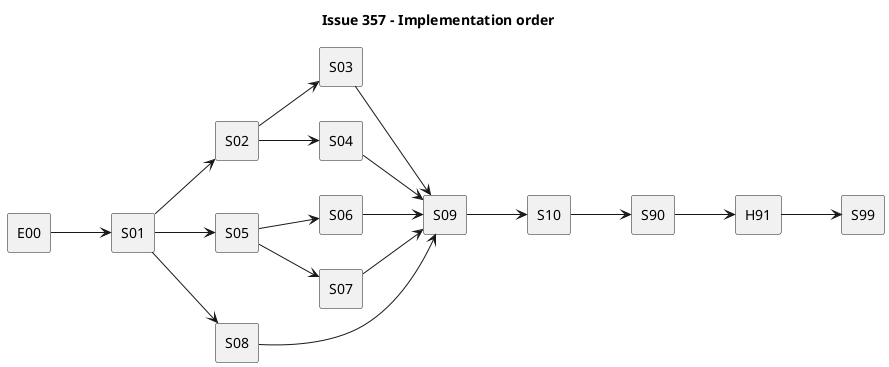

# iss-00357 Reduce Runtime to Storage Core — 実装計画

## 1. 計画の目標

承認済みRequirement / Designを、保持するStorage Coreの利用者flowごとの縦スライスとして実装する。各実装ステップは一つの観測可能な振る舞いを閉じ、test、review、report evidenceが揃うまで次の依存stepへ進めない。

このPlanは実装開始を許可する正本である。PR作成、merge、Issue close、Epic完了は別workflowであり、このPlanの承認だけでは実行しない。

## 2. Planning Level

- Selected level: `strict`
- 理由: public CLI、Runtime lifecycle、active serialization、dependency semantics、Historical compatibility、provider / dogfood projectionを同時に変更するため。
- Risk factors: legacy active JSON、GitHub部分失敗、unsafe file input、既存Historical evidence、removed / retained import graph。
- Re-evaluation: user-owned data migration、不可逆なformat変更、security / privacy boundary拡大が必要になった場合は`critical`候補としてPlanを停止し、Requirement / Designへ戻す。
- Completion Guide: `spec-dock/docs/authoring/issue-plan-levels/strict.md`。Target Guideがまだ未実装の場合は、本PlanのStrict obligationを優先する。

## 3. Source of record

- Canonical: `requirement.md`、`design.md`、本`plan.md`
- Parent: `../../requirement.md`、`../../design.md`、`../../plan.md`
- Approved Draft 1 evidence: `artifacts/20260809t125145z-draft-requirement-strict-vertical-slice-requirement.md`、`artifacts/20260809t125146z-draft-design-strict-vertical-slice-design.md`、`artifacts/20260809t125147z-draft-plan-strict-vertical-slice-plan.md`
- Baseline code revision: `2c75e0c02cb65a6e74040a72dc161d342d661091`
- 実装中のdurable decisionは本Planで暗黙に決めず、Designまたはaccepted ADRへ昇格する。

## 4. 実行順序と依存



S02〜S04とS05〜S08は論理上並行可能だが、parser / registry、`set_active.py`、`domain/artifacts.py`、bootstrapを共有するstepは同時編集しない。Issue 358とはDesign §14のownershipを守り、357はtemplate proseと`docs/guide.md`を編集しない。

## 5. Spec-Locked Closure Index

| Closure ID | Spec | Observable state | Locked expectation | Guarded bug class | Required | Evidence level | Verification path | Report destination | Owner |
|---|---|---|---|---|---|---|---|---|---|
| `CL-357-001` | `AC-357-001` | root / subcommand helpとremoved invocation | Target inventoryだけが到達可能 | alias / hidden backend残存 | yes | red-required | CLI negative test、import graph | report Closure Coverage | S01 |
| `CL-357-002` | `AC-357-002` | active JSON / Context Pack | authority等をtarget writeしない | workflow metadata再永続化 | yes | red-required | serialization assertion | report S02 | S02 |
| `CL-357-003` | `AC-357-003` | blocked Issueへの`active set` | network / deps非参照でselection成功 | selectionとreadiness再結合 | yes | red-required | port spy、CLI test | report S02 | S02 |
| `CL-357-004` | `AC-357-004` | start truth tableとmutation order | guard→deps→checkout→active→sync | force bypass / premature write | yes | red-required | lifecycle matrix | report S03 | S03 |
| `CL-357-005` | `AC-357-005` | finish phase results | close→clear→sync、evidence非参照 | premature clear / hidden gate | yes | red-required | mutation-order spy | report S04 | S04 |
| `CL-357-006` | `AC-357-006` | Current Artifact作成 | Current六種だけ、安全に作成 | catalog drift / overwrite | yes | red-required | CLI / domain / filesystem | report S05 | S05 |
| `CL-357-007` | `AC-357-007` | generic import | opaque一file、安全・privacy維持 | content変換 / leak | yes | covered-existing + delta | import suites | report S07 | S07 |
| `CL-357-008` | `AC-357-008` | Fresh三scope | AssuranceなしでR/D/P/Report | scaffold / Profile結合 | yes | red-required | Fresh fixture | report S08 | S08 |
| `CL-357-009` | `AC-357-009` | legacy evidence mutation | Core結果とvalidateが内容非依存 | old gate復活 | yes | red-required | mutation-invariance | report S09 | S09 |
| `CL-357-010` | `AC-357-010` | Historical / malformed fixtures | catalog内保持、真の不正を診断 | data破壊 / accept-all | yes | red-required | fixture matrix | report S06 | S06 |
| `CL-357-011` | `AC-357-011` | help / Runtime docs | Current semanticsだけを推奨 | docs drift | yes | manual-required | docs inspection / link | report S90 | S90 |
| `CL-357-012` | `AC-357-012` | provider / dogfood Runtime | expected parity | projection drift | yes | red-required | manifest diff | report S10 | S10 |
| `CL-357-013` | `AC-357-013` | downstream handoff | IC-1 / 359 / 360 inventoryが具体的 | ownership gap | yes | manual-required | handoff matrix | report H91 | H91 |
| `CL-357-014` | `AC-357-014` | deps check / projection | blocker前後でready false / true | always-ready projection | yes | red-required | deps matrix | report S03 | S03 |
| `CL-357-015` | `RQ-357-001`, `EC-357-001` | `active set` / `issue start` target指定 | positional / `--id` / `--github-issue`とstartの照会上限を保持し、invalid targetは常にno-write | selector退行 / forceによるinvalid target迂回 | yes | red-required | selector positive / negative matrix | report S01/S03 | S01/S03 |

locked expectationを変える必要が出た場合、そのstepを停止し、canonical R/D/Pを修正してfresh spec reviewを受ける。test期待値だけを実装へ合わせて変更しない。

### 5.1 Requirement / edge / Design trace

| 正本契約 | Closure / owner step | 閉じる観測点 |
|---|---|---|
| `RQ-357-001` | `CL-357-001/015`, S01/S10 | retained / removed CLI、selector、invalid target no-write、到達不能module |
| `RQ-357-002` | `CL-357-002/003/015`, S02/S03 | selection-only active、minimal manifest、target validation |
| `RQ-357-003` | `CL-357-004/014/015`, S03 | unfinished guard、dependency-only readiness、selectorと照会上限 |
| `RQ-357-004` | `CL-357-005`, S04 | close → clear → syncとpartial result |
| `RQ-357-005` | `CL-357-006/010`, S05/S06 | Current作成とHistorical認識の分離 |
| `RQ-357-006` | `CL-357-007`, S07 | opaqueなgeneric file importと安全境界 |
| `RQ-357-007` | `CL-357-008`, S08 | Assurance非依存のFresh四文書 |
| `RQ-357-008` | `CL-357-009/010/012`, S06/S09/S10 | Existing証跡保持、旧gate非再起動、projection parity |
| `RQ-357-009` | `CL-357-013`, H91 | IC-1 / 359 / 360 handoff |
| `EC-357-001` | `CL-357-015`, S01/S03 | invalid active / start targetは明確なerrorとno-write |
| `EC-357-002` | `CL-357-003`, S02 | blocked Issueもselection可能 |
| `EC-357-003`〜`006` | `CL-357-004/014/015`, S03 | force境界、unknown fail-closed、checkout / persistence failure |
| `EC-357-007`〜`009` | `CL-357-005`, S04 | close / clear / syncのphase別partial result |
| `EC-357-010/011` | `CL-357-006/010`, S05/S06 | type / collision / symlink / escape / scope mismatch rejection |
| `EC-357-012` | `CL-357-009`, S09 | heavy Report / AssuranceでCore結果不変 |
| Design §4〜§8 | S01〜S04 | CLI、active model、start / finish、dependency-only readiness |
| Design §9〜§12 | S05〜S09 | Artifact、import、Fresh scaffold、validate / doctor境界 |
| Design §13〜§17 | E00/S10/H91/S99 | module delta、ownership、rollback、observability、test strategy |

## 6. 共通delegation contract

- E00とreport統合: main orchestrator。
- S01〜S10: bounded stepごとにfresh `dev-coder`。
- S90: `doc-writer`。Runtime sourceやtestを変更しない。
- 各code step: fresh `code-reviewer` passが必要。
- test十分性: milestoneまたはS99でfresh `qa-reviewer`。
- canonical R/D/P/reportの更新: main orchestratorだけ。
- worker output: changed files、実行check、失敗と回復、残余risk、report転記用evidence、`No material implementation decisions beyond the approved plan.`または具体的Ledger Note。
- workerがscope、interface、data format、locked expectationを変える必要を見つけた場合は実装せず停止する。

## 7. 実装ステップ

### E00 — Exact retained / removed / shared inventory

**振る舞い目標:** 削除前に、Target CLIから到達するmodule、撤去するmodule、generic import等のshared primitiveを正確に分類する。

**許可:** parser / registry / bootstrap / import graph / tests / docsのread-only調査、main orchestratorによるreport記録。

**禁止:** source削除、registration変更、metadata / deps / active変更。

**具体テストケース:** `rg`とPython import inspectionで、Requirementの全retained leafにregistry ownerがあり、全removed leafに到達経路があるbaselineを一覧化する。shared primitiveはconsumer symbolまで記録する。

**Step Closure Contract:** retained / removed / sharedの各rowにpath、symbol、consumer、予定Action、owner Issueがあり、report差分がfresh `spec-reviewer`のdocs/spec alignment reviewをpassする。曖昧rowは解消するまでS01へ進まない。M0 commit候補は`docs(iss-00357): Runtime baseline inventoryを記録`。

### S01 — Storage Core CLI surface

**振る舞い目標:** root helpとregistryがTarget inventoryだけを公開し、removed commandはno-write parser errorになる。

**Allowed paths:** `cli/{parser,registry,bootstrap}.py`、command registration、対応dogfood Runtime、CLI contract tests。

**Forbidden:** backend物理削除、template、skill、installer、lifecycle semantics。

**ケース概要（規範的なテストカードは§8）:**

| ID | Given / When | Then |
|---|---|---|
| `TC-357-S01-01` | root helpを表示 | retained top-levelが全てありremoved五groupがない |
| `TC-357-S01-02` | removed groupを実行 | non-zero、state / file変更なし、alias fallbackなし |
| `TC-357-S01-03` | `artifact import --help` | `file`だけがあり`chatgpt-output`がない |
| `TC-357-S01-04` | `active set --help` | target selectorだけがありcheckout / GitHub / force flagがない |

**Verification:** `uv run pytest tests/cli_runtime/test_storage_core_cli.py tests/cli_runtime/test_wrappers.py`。

**Step Closure Contract:** `CL-357-001`のRed→Green、fresh code-review pass、report evidence、focused diff。Commit候補: `refactor(runtime): Storage Core CLI surfaceに限定`。

### S02 — Selection-only active

**振る舞い目標:** valid scopeをdependency / GitHub / evidence非参照で選択し、minimal manifestをtransactionalに保存する。

**Allowed paths:** `application/set_active.py`、`infra/{contracts,active_store}.py`、Context Pack presentation、対応tests / dogfood Runtime。

**Forbidden:** `issue start`順序変更、user-owned metadata migration、`active set` checkout復活。

**ケース概要（規範的なテストカードは§8）:**

| ID | Given / When | Then |
|---|---|---|
| `TC-357-S02-01` | dependency-blocked Issueをset | forceなしで選択成功、deps / GitHub port未呼出し |
| `TC-357-S02-02` | active JSONを書出し | schema v2、entryはid / pathだけ |
| `TC-357-S02-03` | authority等を持つlegacy JSONをread | read成功、read-onlyではbyte不変、次mutationでminimal化 |
| `TC-357-S02-04` | persistence途中失敗 | manifest / Context Pack / pointerを旧snapshotへ復元 |

**Verification:** `uv run pytest tests/cli_runtime/test_active.py tests/unit/application/test_set_active.py tests/unit/domain/test_active.py tests/unit/infra/test_active_store.py`。

**Step Closure Contract:** `CL-357-002/003`をcloseし、serialized fixtureとport spyをreportへ記録。Commit候補: `refactor(active): selection-only stateへ縮小`。

### S03 — `issue start`とdependency-only readiness

**振る舞い目標:** branchに依存しないunfinished guard、shared dependency check、checkout、active write、syncの順序を固定する。

**Allowed paths:** `application/{issue_lifecycle,check_deps,set_active,status_context}.py`、`domain/deps.py`、`commands/issue.py`、contracts / tests / dogfood Runtime。

**Forbidden:** dependencyのforce bypass、unknown stateのfinished推測、`active set`へのreadiness再導入。

**ケース概要（規範的なテストカードは§8）:**

| ID | Given / When | Then |
|---|---|---|
| `TC-357-S03-01` | 別active=`OPEN`、main / Issue / non-Issue branch | forceなしで全てblock |
| `TC-357-S03-02` | 別active=`UNKNOWN` / linkなし / fetch失敗 | fail-closed、actionable diagnostic |
| `TC-357-S03-03` | `--force`とdependency blocker | unfinished guardだけ通過しdepsで停止 |
| `TC-357-S03-04` | checkout失敗 | active unchanged |
| `TC-357-S03-05` | checkout成功、active write失敗 | active rollback、branch side effectを表示 |
| `TC-357-S03-06` | direct / inherited blocker前後 | deps check / projection / startが同じreadyを返す |

**Verification:** `uv run pytest tests/cli_runtime/test_issue_lifecycle.py -k issue_start tests/unit/application/test_check_deps.py tests/unit/domain/test_deps.py`。

**Step Closure Contract:** `CL-357-004/014`の全truth-table rowとmutation-order spyがpassし、fresh code reviewで重複readinessがない。Commit候補: `refactor(issue): startをdependency-only lifecycleへ変更`。

### S04 — Thin `issue finish`

**振る舞い目標:** close → clear → syncを守り、quality / evidenceを一切読まない。

**Allowed paths:** lifecycle、close、clear、post-sync、result / presentation、対応tests / dogfood Runtime。

**Forbidden:** close前transition write、Report / EAL / authority parse、新completion gate。

**ケース概要（規範的なテストカードは§8）:**

| ID | Given / When | Then |
|---|---|---|
| `TC-357-S04-01` | linked Issue=`OPEN` | close後にclear、sync一回 |
| `TC-357-S04-02` | linked Issue=`CLOSED` | already_closed=trueでclear / sync |
| `TC-357-S04-03` | close failure | active保持、retry guidance |
| `TC-357-S04-04` | close成功、clear failure | close確定、active残存、sync未実行をpartial success表示 |
| `TC-357-S04-05` | clear成功、sync failure | active clear済み、projection stale |
| `TC-357-S04-06` | Report / Assurance / EALを変えてfinish | outcome不変 |

**Verification:** `uv run pytest tests/cli_runtime/test_issue_lifecycle.py -k issue_finish`。

**Step Closure Contract:** `CL-357-005`全phaseとno-gate spyがpass、fresh code review。Commit候補: `refactor(issue): finishをclose clear syncへ縮小`。

### S05 — Current Artifact creation

**振る舞い目標:** optional positional typeでCurrent六種だけを安全に作成する。

**Allowed paths:** `commands/new.py`、`application/create_artifact_doc.py`、`domain/artifacts.py`、artifact store / presentation、対応tests / dogfood Runtime。templateはread-only。

**Forbidden:** template prose、`analysis`追加、Historical routing、`--type`追加。

**ケース概要（規範的なテストカードは§8）:** omitted / explicit blank、五typed success、blank filename tokenなし、unknown / analysis / historical no-write、same-second suffix、99枯渇、lock、symlink、escape、scope mismatch。

**Verification:** `uv run pytest tests/cli_runtime/test_new.py -k artifact tests/unit/domain/test_artifacts.py`。

**Step Closure Contract:** `CL-357-006`のpositive / negative / safety matrixがpassし、358 template contractとの差分はIC-1へ記録。Commit候補: `feat(artifact): Current六種の作成契約へ統一`。

### S06 — Historical recognition

**振る舞い目標:** Historical catalogを保持し、新規作成は拒否しつつ真のmalformedを診断する。

**Allowed paths:** Artifact filename parser / validation / doctor、Historical fixtures、対応dogfood Runtime。

**Forbidden:** accept-all、existing file rename / rewrite / delete、Current navigation編集。

**ケース概要（規範的なテストカードは§8）:** timestamp typed六Historical、sequential adr / disc / note、generic import、legacy Discussionをpositive fixtureとし、unknown timestamp-intent、duplicate、broken timestamp、unsafe pathをnegative fixtureとする。

**Verification:** `uv run pytest tests/unit/domain/test_artifacts.py tests/cli_runtime/test_validate.py tests/cli_runtime/test_doctor.py`。

**Step Closure Contract:** `CL-357-010`をcloseし、baseline repositoryのHistorical filesがcatalog理由だけで失敗しない。Commit候補: `fix(artifact): Historical recognitionを明示catalog化`。

### S07 — Generic file import only

**振る舞い目標:** `artifact import file`のopaque / safety / privacy契約を保ち、provider routeを除く。

**Allowed paths:** `commands/artifact_import.py`、`application/import_file_artifact.py`、explicit-file ports / publisher、presentation、tests / dogfood Runtime。

**Forbidden:** shared safety primitive削除、bytes変換、external absolute path / content / hash出力。

**ケース概要（規範的なテストカードは§8）:** root / Initiative / Epic / Issue、UTF-8 / binary、symlink / traversal / unsafe basename、collision、publication前後失敗、cleanup failure、privacy output、removed route absence。

**Verification:** `uv run pytest tests/cli_runtime/test_artifact_import_file.py tests/unit/application/test_import_file_artifact.py`。

**Step Closure Contract:** `CL-357-007`既存testが欠陥感応性を持つことを確認し、provider-specific testはabsence testへ置換。Commit候補: `refactor(artifact): generic file importだけを保持`。

### S08 — No-Assurance Fresh scaffold

**振る舞い目標:** 既存copy mechanismでFresh三scopeへR/D/P/Reportを作り、Profile / Assuranceに依存しない。

**Allowed paths:** `application/create_node.py`、template scaffolder / ports、scaffold fixture、Runtime tests / dogfood Runtime。358-owned template本文はread-only。

**Forbidden:** profile selection、Assurance compose、新scaffolder、template prose変更。

**ケース概要（規範的なテストカードは§8）:** Initiative / Epic / Issueごとに四文書一つ、`.assurance.json`なし、二層stagingのhandled failure rollback、canonical collision no-write、同時createで完成tree一つ、Report空本文でstructural flow成功、IC-1 manifest一致。same-UID非協調tamperingは検知時にcompetitor保全を優先し、SIGKILL / power loss / filesystem corruptionはrecovery保証外とする。

**Verification:** `uv run pytest tests/cli_runtime/test_new.py tests/cli_runtime/test_runtime_new_doc_s09.py`。

**Step Closure Contract:** `CL-357-008`をcloseし、content mismatchは358へ、mechanism mismatchだけを357で修正。Commit候補: `refactor(scaffold): Assurance非依存の四文書生成へ変更`。

### S09 — Historical consumer invariance

**振る舞い目標:** 旧evidenceの内容がCore behaviorやvalidation gateを変えないことをend-to-end証明する。

**Allowed paths:** integration fixture、`validate_tree.py`、doctor structural gate、必要なlifecycle / active removal、tests / dogfood Runtime。

**Forbidden:** fixture内容の正規化、Historical file削除、structural validation弱体化。

**ケース概要（規範的なテストカードは§8）:** empty thin / heavy Report、EAL文字列、delegated authority metadata、`.assurance.json`、Planning Level、legacy active extra field、draft / repair Artifactを個別に変え、active / deps / start / finish / validate / doctorの構造結果が不変であることを比較する。

**Verification:** `uv run pytest tests/cli_runtime/test_validate.py tests/cli_runtime/test_doctor.py tests/cli_runtime/test_issue_lifecycle.py -k 'invariance or legacy'`。

**Step Closure Contract:** `CL-357-009`をcloseし、structural破損fixtureだけは診断されるnegative controlを含む。Commit候補: `refactor(runtime): legacy evidence gateを撤去`。

### S10 — Unreachable module deletionとRuntime parity

**振る舞い目標:** retained CLIがremoved cognitive moduleをimportせず、provider / dogfood Runtimeが一致する。

**Allowed paths:** E00でDelete承認されたRuntime modules / tests / wrappers、provider / dogfood projection、absence / parity tests。

**Forbidden:** install_root skill、installer inventory、358-owned docs / templates、generic safety shared module。

**ケース概要（規範的なテストカードは§8）:** retained command import smoke、removed module / registry key / alias absence、generic import shared port presence、provider / dogfood owned Runtime manifest byte parity。

**Verification:** `uv run pytest tests/cli_runtime/test_storage_core_cli.py tests/cli_runtime/test_wrappers.py`に加え、次の明示source manifest比較を実行する。`__pycache__`と`.pyc`は収集対象外で、許容差分はゼロである。

```sh
diff -u \
  <(cd src/spec_dock/assets/spec_dock/scripts && find spec_dock_runtime -type f -name '*.py' -print | LC_ALL=C sort | xargs shasum -a 256) \
  <(cd spec-dock/scripts && find spec_dock_runtime -type f -name '*.py' -print | LC_ALL=C sort | xargs shasum -a 256)
```

**Step Closure Contract:** `CL-357-001/012`を再確認し、削除rowごとにno retained consumer evidenceがある。Commit候補: `refactor(runtime): 到達不能なworkflow moduleを削除`。

### S90 — Runtime docs impact resolution

**振る舞い目標:** CLI help、Runtime reference、migration noteがTarget semanticsを説明する。

**Allowed paths:** 357-owned Runtime reference / migration docs、help snapshot。`doc-writer`が担当。

**Forbidden:** Authoring Guide / template prose、skill、installer手順の先取り、旧workflowのCurrent推奨。

**ケース概要（規範的なテストカードは§8）:** retained syntax、active/start/finish、Artifact Current/Historical、generic import、removed command migration note、broken link、forbidden Current recommendationを検査する。

**Step Closure Contract:** `CL-357-011`、fresh spec-review pass、docs diffが357 ownership内。Commit候補: `docs(runtime): Storage Coreの操作と移行を更新`。

### H91 — IC-1 / 359 / 360 handoff

**振る舞い目標:** 後続が推測せず作業できるmachine / human readable inventoryをIssue reportへ確定する。

**Required handoff:** IC-1 fixture result、retained CLI + syntax、removed command / module inventory、shared primitive、Historical preservation list、known migration risk、owner / destination。

**Step Closure Contract:** `CL-357-013`、fresh spec review、未割当rowなし。IC-1自体のpass/failはEpic orchestratorが管理する。H91のreport差分はS90 docs commitへ同梱し、S90が既にclosedなら`docs(iss-00357): downstream handoffを記録`でcommitする。

### S99 — Final Issue quality gate

**振る舞い目標:** Issue-local実装が全required closureを満たし、次のintegrationへ渡せることを独立確認する。

**Verification sequence:**

```sh
uv run pytest tests/cli_runtime/test_storage_core_cli.py
uv run pytest tests/cli_runtime/test_active.py tests/cli_runtime/test_issue_lifecycle.py
uv run pytest tests/cli_runtime/test_new.py tests/cli_runtime/test_artifact_import_file.py
uv run pytest tests/cli_runtime/test_validate.py tests/cli_runtime/test_doctor.py
uv run pytest tests/unit
make lint
uv run pytest
./spec-dock/scripts/spec-dock validate
git diff --check
git status --short
```

`uv run pytest --run-full-regression`、consumer init / update / uninstall matrix、cross-Issue release smokeは人間承認待ちの最終統合Issue候補が所有する。S99ではIssue 357の変更に原因がある追加testだけを実行する。

**Step Closure Contract:** fresh `qa-reviewer`、issue-wide `code-reviewer`、`spec-reviewer`がpassし、Closure Index全required rowにevidenceがあり、open Ledger Noteがない。M99 final commit候補は`docs(iss-00357): 最終実装証跡を確定`。

## 8. 規範的なStep-local execution / delegation contract

§7は読みやすさのための概要である。実装委任、Red / Green、テスト、停止判断、review、report更新は本節を規範とする。各stepは記載されたgateを単独で満たすまで完了扱いにしない。

### E00 contract — Exact inventory

- Depends on: 承認済みR/D/Pとbaseline `2c75e0c02cb65a6e74040a72dc161d342d661091`。
- Unblocks: S01、S05、S08、S10。
- Target files: Runtime、tests、docsのread-only inventoryと`report.md`のE00 evidence。
- Planned obligation: retained / removed / sharedをpath、symbol、consumer、Action、owner付きで確定する。
- Redまたは代替証拠: `inspect-only`。変更前registry / import graph / shared consumerを保存し、テスト不要理由は「behaviorを変更しないため」とする。
- Bounded implementation: sourceを変更せず、inventoryだけをreportへ反映する。
- Green verification: 全retained leafと全removed entryにownerがあり、shared primitiveにconsumerがある。
- Refactor guardrail: 調査中にregistration、metadata、deps、activeを変更しない。
- Amendment trigger: inventoryがRequirementのpublic CLI inventoryを変える場合は停止しR/D/Pを修正する。
- Report destination: `report.md`の`Step Contract Closure` E00と`Delegated Worker Evidence`。
- Delegation contract:
  - delegated role: `repo-analyst`。
  - input docs: Requirement §5、Design §3 / §13、Plan `CL-357-001/012/013`。
  - allowed paths: repository全体のread-only調査、Issue `report.md`へのmain orchestrator転記。
  - forbidden changes: source、tests、docs、metadata、deps、active、Git state。
  - acceptance criteria: inventory全rowが一意なActionとownerを持つ。
  - required verification: registry / import / consumer symbolの相互照合。
  - reviewer focus: retained consumerを持つmoduleがDeleteへ分類されていないこと。
  - stop conditions:曖昧なowner、動的到達経路、公開surface変更の発見。
  - output required: evidence、参照path / symbol、risk、推奨次action、material decisionなしの明記。
- `tc-e00-001` inspect: Runtime inventory completeness
  - 前提: baseline checkoutと承認済みCLI inventoryがある。
  - 操作: parser / registryからleafを列挙し、import graphとtest / docs consumerへ逆引きする。
  - 期待結果: 全leafとmoduleがretained / removed / sharedの一つへ分類され、ownerとActionがある。
  - 失敗検出: 未分類、複数owner、consumerがあるDelete候補を一件でも検出する。
  - 検証方法: `rg`、import inspection、path / symbol照合結果をreportへ保存する。
  - 関連 closure id: `CL-357-001`, `CL-357-012`, `CL-357-013`。
- Step gate: main orchestratorがreportを更新し、曖昧rowゼロを確認する。fresh `spec-reviewer`がE00 report evidenceとapproved R/D/Pのdocs/spec alignmentをpassした後、M0 commit候補`docs(iss-00357): Runtime baseline inventoryを記録`を作成し、`git status --short`で意図しない残差がないことを確認してからS01へ進む。report差分があるため`approved-no-op`は使わない。

### S01 contract — Storage Core CLI surface

- Depends on: E00。Unblocks: S02、S05、S08。
- Target files: `cli/{parser,registry,bootstrap}.py`、command registration、対応dogfood Runtime、CLI contract tests。
- Planned obligation: root / subcommand helpとdispatchをTarget inventoryへ限定し、保持selectorを公開する。
- Redまたは代替証拠: `red-required`。removed group / routeの到達とselector契約の不足を先に失敗testで示す。
- Bounded implementation: registration / dispatchだけを最小変更し、backend削除はS10へ残す。
- Green verification: `CL-357-001/015`のpositive / negative CLI matrixがpassする。
- Refactor guardrail: lifecycle、active serialization、template、skill、installerを変更しない。
- Amendment trigger: retained command / flagの追加削除、alias互換の新判断が必要なら停止する。
- Report destination: `report.md`のS01 closure、Test Contract Closure、Reviewer Gate Status。
- Delegation contract:
  - delegated role: fresh `dev-coder`。
  - input docs: Requirement `RQ-357-001`, `EC-357-001`, `AC-357-001`; Design §3 / §4 / §13; `CL-357-001/015`。
  - allowed paths: 本step Target filesだけ。
  - forbidden changes: backend物理削除、lifecycle semantics、docs / template / skill / installer。
  - acceptance criteria: removed routeがparser error / no-write、retained inventoryとselectorがhelp / dispatchに存在する。
  - required tests: `tests/cli_runtime/test_storage_core_cli.py`、`tests/cli_runtime/test_wrappers.py`のfocused cases。
  - reviewer focus: hidden alias / registry key、no-write、公開syntax互換。
  - stop conditions: public inventoryの未確定、shared registrationの破壊、scope外sourceが必要。
  - output required: changed files、Red / Green、focused test、残余risk、report用evidence、material decision有無。
- `tc-s01-001` acceptance: retained / removed command inventory
  - 前提: E00 inventoryとstate snapshotがある。
  - 操作: root help、全retained leaf help、removed五groupと`artifact import chatgpt-output`を実行する。
  - 期待結果: retainedだけが到達可能で、removed invocationはnon-zeroかつsnapshot不変である。
  - 失敗検出: removed help / dispatch / aliasが一つでも成功する、またはfile / stateが変わる。
  - 検証方法: CLI runner、help snapshot、before / after tree hash。
  - 関連 closure id: `CL-357-001`。
- `tc-s01-002` acceptance: selector surface and invalid active target
  - 前提: positional、`--id`、`--github-issue`で解決できるvalid targetとinvalid targetがある。
  - 操作: `active set --help`を検査し、各selectorとinvalid targetを実行する。
  - 期待結果: 三selectorを保持し、checkout / GitHub / force flagはなく、invalid targetは明確なerrorとno-writeになる。
  - 失敗検出: selector欠落、削除flag残存、invalid targetによるmanifest / Context Pack変更。
  - 検証方法: parser test、port spy、before / after hash。
  - 関連 closure id: `CL-357-015`。
- Step gate: report更新 → fresh `code-reviewer` pass → mainのstep result approval。commit候補は§7のS01に従う。

### S02 contract — Selection-only active

- Depends on: S01。Unblocks: S03 / S04。Target files: `application/set_active.py`、`infra/{contracts,active_store}.py`、Context Pack presentation、対応tests / dogfood Runtime。
- Planned obligation: valid targetをreadiness非参照で選択し、`ActiveManifestEntry`の`id` / `path`だけをtransactionalに保存する。
- Redまたは代替証拠: `red-required`。blocked Issue、legacy extra fields、persistence failureのcharacterizationを先に失敗させる。
- Bounded implementation: existing schema v2 loader / storeを縮小し、新model / schema versionを作らない。
- Green verification: `CL-357-002/003`がport spy、serialization、rollbackでpassする。
- Refactor guardrail: `issue start`順序、user-owned metadata、checkoutを変更しない。
- Amendment trigger: schema v2で互換readできない、またはmigration writeが必要なら停止する。
- Report destination: `report.md`のS02 closure / Test Contract Closure / Reviewer Gate Status。
- Delegation contract:
  - delegated role: fresh `dev-coder`。
  - input docs: `RQ-357-002`, `EC-357-002`, `AC-357-002/003`; Design §5; `CL-357-002/003`。
  - allowed paths: 本step Target filesだけ。
  - forbidden changes: lifecycle、deps semantics、GitHub、metadata migration、active checkout。
  - acceptance criteria: selection-only、minimal serialization、legacy tolerant read、transactional rollback。
  - required tests: active CLI / application / infra focused suites。
  - reviewer focus: port非呼出し、schema v2、partial write復元、Context Pack整合。
  - stop conditions: schema変更、新authority field、readiness再導入、scope外file。
  - output required: changed files、serialized fixture、spy log、rollback evidence、risk、material decision有無。
- `tc-s02-001` acceptance: blocked Issue selection and minimal state
  - 前提: dependency-blocked target、legacy extra-field manifest、GitHub / deps fail-fast spyがある。
  - 操作: positional / `--id` / `--github-issue`で`active set`し、保存JSONとContext Packを読む。
  - 期待結果: 全selectorでselection成功、deps / GitHub未呼出し、entryは`id` / `path`だけ、legacy read-onlyはbyte不変である。
  - 失敗検出: port呼出し、authority等の再永続化、selector間の結果差。
  - 検証方法: CLI / application test、spy、JSON exact assertion、hash比較。
  - 関連 closure id: `CL-357-002`, `CL-357-003`, `CL-357-015`。
- `tc-s02-002` failure: transactional persistence rollback
  - 前提: manifest / Context Pack / pointerの旧snapshotと、各write phaseを失敗させるadapterがある。
  - 操作: 各phaseで`active set`を失敗させる。
  - 期待結果: 旧snapshotへ復元され、partial stateを残さない。
  - 失敗検出: 三surfaceのいずれかが新旧混在する。
  - 検証方法: phase injectionとbefore / after byte比較。
  - 関連 closure id: `CL-357-002`。
- Step gate: focused testsとreport更新後、fresh `code-reviewer`がserialization / rollbackをpassする。

### S03 contract — `issue start` and dependency-only readiness

- Depends on: S02。Unblocks: S09。Target files: lifecycle / check_deps / status context / Issue command / deps domain / tests / dogfood Runtime。
- Planned obligation: target validation → unfinished guard → dependency check → checkout → active write → syncの順を固定する。
- Redまたは代替証拠: `red-required`。branch×GitHub state truth table、selector、照会上限、invalid / force、partial failureを先に失敗させる。
- Bounded implementation: existing `check_deps`を再利用し、active setへreadinessを戻さない。
- Green verification: `CL-357-004/014/015`のorder / state / projection matrixがpassする。
- Refactor guardrail: forceはunfinished guardだけを迂回し、invalid targetとdependency blockerを迂回させない。
- Amendment trigger: selectorまたはGitHub照会上限の互換を変える、unknownをfinished扱いする必要がある場合は停止する。
- Report destination: `report.md`のS03 closure / Test Contract Closure / Reviewer Gate Status。
- Delegation contract:
  - delegated role: fresh `dev-coder`。
  - input docs: `RQ-357-003`, `EC-357-001/003/004/005/006`, `AC-357-004/014`; Design §6 / §8; `CL-357-004/014/015`。
  - allowed paths: 本step Target filesだけ。
  - forbidden changes: dependency force bypass、active set readiness、finish、template / docs。
  - acceptance criteria: selector互換、branch非依存guard、shared deps結果、mutation order、phase別diagnostic。
  - required tests: lifecycle start、check_deps application、deps domain focused suites。
  - reviewer focus: validationが最初、force境界、no premature write、projection整合。
  - stop conditions: GitHub state意味変更、新dependency semantics、scope外checkout設計。
  - output required: changed files、truth table、mutation spy、Red / Green、risk、material decision有無。
- `tc-s03-001` acceptance: retained selectors and lookup limit
  - 前提: 同一Issueをpositional / `--id` / `--github-issue`で解決でき、既存GitHub照会上限を観測できるadapterがある。
  - 操作: 各selectorと照会上限指定で`issue start`する。
  - 期待結果: 同じtargetと順序で成功し、指定limitが既存GitHub lookupへ渡る。
  - 失敗検出: selector欠落、limit無視、selectorごとのmutation差。
  - 検証方法: CLI parameterized testとport call assertion。
  - 関連 closure id: `CL-357-015`。
- `tc-s03-002` failure: invalid target cannot be forced
  - 前提: invalid positional / id / GitHub Issueとstate snapshotがある。
  - 操作: 各invalid targetを通常時と`--force`付きで実行する。
  - 期待結果: 全てtarget validationで停止し、checkout / deps / active / syncを呼ばずno-writeである。
  - 失敗検出: forceで先へ進む、またはいずれかport / fileが変わる。
  - 検証方法: port spyとbefore / after hash。
  - 関連 closure id: `CL-357-015`。
- `tc-s03-003` acceptance: lifecycle truth table and dependencies
  - 前提: active state `OPEN/CLOSED/UNKNOWN/linkなし/fetch失敗`、main / Issue / non-Issue branch、direct / inherited blocker fixtureがある。
  - 操作: force有無でstartし、blocker解決前後のdeps check / projectionを比較する。
  - 期待結果: branchに関係なくunfinishedはblock、unknownはfail-closed、forceはunfinished guardだけを通過し、blocker前後でready false / trueが一致する。
  - 失敗検出: branch依存、unknown通過、dependency bypass、projectionとの不一致。
  - 検証方法: parameterized matrix、call-order spy、projection snapshot。
  - 関連 closure id: `CL-357-004`, `CL-357-014`。
- `tc-s03-004` failure: checkout failure leaves active unchanged
  - 前提: target validation、unfinished guard、dependency checkが成功し、checkout portだけが失敗するfixtureとactive / Context Packのbefore snapshotがある。
  - 操作: `issue start`を実行してcheckoutを失敗させる。
  - 期待結果: active writeとsyncを呼ばず、active manifest / Context Pack / pointerがbefore snapshotのままで、checkout failureのactionable diagnosticを返す。
  - 失敗検出: active / Context Pack / pointer変更、sync呼出し、checkout failureの隠蔽。
  - 検証方法: call-order spy、before / after byte比較、exact diagnostic assertion。
  - 関連 closure id: `CL-357-004`。
- `tc-s03-005` failure: active persistence rollback after checkout
  - 前提: checkout成功後にactive persistenceだけを失敗させるadapter、旧active snapshot、branch side effectを観測するport spyがある。
  - 操作: `issue start`を実行し、active write phaseで失敗させる。
  - 期待結果: active関連stateを旧snapshotへ復元し、syncを呼ばず、checkout済みbranch side effectと再試行手順を明示する。
  - 失敗検出: partial active state、sync呼出し、branch side effectを表示しない、rollback failureの隠蔽。
  - 検証方法: phase injection、call-order spy、before / after byte比較、result / diagnostic assertion。
  - 関連 closure id: `CL-357-004`。
- Step gate: report更新、fresh `code-reviewer`がorder / force / selector / projectionをpassし、mainが承認する。

### S04 contract — Thin `issue finish`

- Depends on: S02。Unblocks: S09。Target files: lifecycle / close / clear / post-sync / result presentation / tests / dogfood Runtime。
- Planned obligation: GitHub close → active clear → post-syncだけを実行し、phase結果を正確に返す。
- Redまたは代替証拠: `red-required`。open / already closed、三phase failure、legacy evidence mutationを先に失敗させる。
- Bounded implementation: existing result / error contractを使い、新quality gateや例外階層を作らない。
- Green verification: `CL-357-005`の全phaseとnon-gating matrixがpassする。
- Refactor guardrail: close前transition write、Report / Assurance / EAL parseを禁止する。
- Amendment trigger: GitHub close確定状態を既存resultで表現できない場合はDesignへ戻す。
- Report destination: `report.md`のS04 closure / Test Contract Closure / Reviewer Gate Status。
- Delegation contract:
  - delegated role: fresh `dev-coder`。
  - input docs: `RQ-357-004`, `EC-357-007/008/009`, `AC-357-005`; Design §7; `CL-357-005`。
  - allowed paths: 本step Target filesだけ。
  - forbidden changes: evidence parse、new completion gate、start / deps、template / docs。
  - acceptance criteria: exact order、idempotent closed path、phase別partial result、retry guidance。
  - required tests: `test_issue_lifecycle.py -k issue_finish`。
  - reviewer focus: clear失敗時もGitHub closed確定、sync未実行、active残存の区別。
  - stop conditions: 新しいdurable state / gateが必要、phase order変更。
  - output required: changed files、phase spy、result snapshots、risk、material decision有無。
- `tc-s04-001` acceptance: finish phase matrix
  - 前提: linked IssueがOPEN / CLOSED、close / clear / syncを個別に失敗させられるadapterがある。
  - 操作: 各組合せで`issue finish`を実行する。
  - 期待結果: openはclose→clear→sync、closedはalready_closed=true、close失敗はactive保持、clear失敗はclosed確定 / active残存 / sync未実行、sync失敗はclosed / cleared / staleを返す。
  - 失敗検出: 順序逆転、premature clear、確定状態の曖昧化。
  - 検証方法: call-order spyとexact result assertion。
  - 関連 closure id: `CL-357-005`。
- `tc-s04-002` negative control: evidence independence
  - 前提: thin / heavy Report、Assurance、EALを変えた同一lifecycle fixtureがある。
  - 操作: 各fixtureでfinishする。
  - 期待結果: port callsとresultが同一である。
  - 失敗検出: evidence内容による停止 / 結果差。
  - 検証方法: parameterized result comparisonとfile-read spy。
  - 関連 closure id: `CL-357-005`, `CL-357-009`。
- Step gate: report更新後、fresh `code-reviewer`がphase resultとnon-gatingをpassする。

### S05 contract — Current Artifact creation

- Depends on: S01 / E00。Unblocks: S06 / S07。Target files: new artifact command、creation use case、Artifact domain / store / presentation、tests / dogfood Runtime。
- Planned obligation: optional positional typeでblank + five typedのCurrent六種だけを安全に作成する。
- Redまたは代替証拠: `red-required`。catalog、unknown / Historical、collision / symlink / escape / scope mismatchを先に失敗させる。
- Bounded implementation: filename / lock / atomic publishの既存primitiveを再利用し、template proseを変更しない。
- Green verification: `CL-357-006`のtype / safety matrixがpassする。
- Refactor guardrail: `analysis`、`--type`、Historical作成routeを追加しない。
- Amendment trigger: Current六種またはfilename grammarを変える必要がある場合は停止する。
- Report destination: `report.md`のS05 closure / Test Contract Closure / Reviewer Gate Status。
- Delegation contract:
  - delegated role: fresh `dev-coder`。
  - input docs: `RQ-357-005`, `EC-357-010/011`, `AC-357-006`; Design §9; `CL-357-006`。
  - allowed paths: 本step Target filesだけ。
  - forbidden changes: template本文、Historical routing、generic import、skill / installer。
  - acceptance criteria: 六種success、blank tokenなし、unknown no-write、deterministic safety rejection。
  - required tests: `test_new.py -k artifact`、domain Artifact tests。
  - reviewer focus: public positional interface、atomicity、path / symlink / lock safety。
  - stop conditions: catalog / template不一致、shared primitive変更がS07へ影響。
  - output required: changed files、type matrix、failure matrix、risk、IC-1 note、material decision有無。
- `tc-s05-001` acceptance: Current six creation contract
  - 前提: root / Initiative / Epic / Issue scopeと固定時刻がある。
  - 操作: type省略、明示blank、`research` / `interview` / `disc` / `decision-candidate` / `adr`を作成する。
  - 期待結果: 正しいCurrent filenameが生成され、blankにtype tokenがなく、same-secondは決定的suffixになる。
  - 失敗検出: catalog外type、overwrite、scope外作成、非決定suffix。
  - 検証方法: CLI / domain parameterized testとfilesystem exact assertion。
  - 関連 closure id: `CL-357-006`。
- `tc-s05-002` failure: invalid type and filesystem safety
  - 前提: unknown / analysis / Historical type、99 collision、lock、symlink、escape、scope mismatch fixtureがある。
  - 操作: 各条件で作成を試みる。
  - 期待結果: Current六種を示すerrorで拒否し、partial artifactを残さない。
  - 失敗検出: file作成、overwrite、root逸脱、cleanup残骸。
  - 検証方法: negative CLI / domain testとbefore / after tree hash。
  - 関連 closure id: `CL-357-006`, `CL-357-010`。
- Step gate: report更新とfocused tests後、fresh `code-reviewer`がinterface / safetyをpassする。

### S06 contract — Historical recognition

- Depends on: S05。Unblocks: S09。Target files: Artifact filename parser / structural validation / doctor、Historical fixtures、tests / dogfood Runtime。
- Planned obligation: 明示Historical catalogを認識し、新規作成は拒否し、真のmalformedだけを診断する。
- Redまたは代替証拠: `red-required`。全positive catalogとunknown timestamp-intent等のnegative controlを先に固定する。
- Bounded implementation: recognitionだけを変更し、既存fileをrename / rewrite / deleteしない。
- Green verification: `CL-357-010`のpositive / negative matrixがpassする。
- Refactor guardrail: accept-allやCurrent navigation編集を禁止する。
- Amendment trigger: baseline既存形式が明示catalog外なら、勝手に追加せずR/D/Pへ戻す。
- Report destination: `report.md`のS06 closure / Test Contract Closure / Reviewer Gate Status。
- Delegation contract:
  - delegated role: fresh `dev-coder`。
  - input docs: `RQ-357-005/008`, `EC-357-010/011`, `AC-357-010`; Design §9 / §12; `CL-357-010`。
  - allowed paths: 本step Target filesだけ。
  - forbidden changes: existing file mutation、Current作成、navigation / templates。
  - acceptance criteria: catalog全形式valid、malformed matrix diagnostic、Historical creationなし。
  - required tests: Artifact domain、validate、doctor focused suites。
  - reviewer focus: false positive / false negative、保存、unsafe path診断。
  - stop conditions: catalog追加判断、data migration、structural validation弱体化。
  - output required: changed files、fixture catalog、positive / negative evidence、risk、material decision有無。
- `tc-s06-001` compatibility: Historical catalog and malformed controls
  - 前提: timestamp typed六Historical、sequential adr / disc / note、generic import、legacy Discussionと、unknown timestamp-intent / duplicate / broken timestamp / unsafe pathがある。
  - 操作: `validate` / `doctor`とfilename recognitionを実行する。
  - 期待結果: catalog内は非malformedかつbyte不変、negativeだけがactionable diagnosticになる。
  - 失敗検出: catalog内拒否、unknown受理、file mutation。
  - 検証方法: parameterized fixture、diagnostic assertion、SHA-256比較。
  - 関連 closure id: `CL-357-010`。
- Step gate: report更新後、fresh `code-reviewer`がcatalog境界と不変性をpassする。

### S07 contract — Generic file import only

- Depends on: S05。Unblocks: S09。Target files: generic import command / use case / explicit-file ports / publisher / presentation、tests / dogfood Runtime。
- Planned obligation: opaque一file importのsafety / privacyを保持し、provider-specific routeだけを外す。
- Redまたは代替証拠: `covered-existing + delta`。既存testsの欠陥感応性を確認し、removed route absenceだけをRed追加する。
- Bounded implementation: shared explicit-file safety / publisherを保持し、bytesを変換しない。
- Green verification: `CL-357-007`のscope / binary / failure / privacy matrixがpassする。
- Refactor guardrail: source absolute path、content、hashを出力しない。
- Amendment trigger: shared primitiveにretained consumerがない、またはprivacy contract変更が必要なら停止する。
- Report destination: `report.md`のS07 closure / Test Contract Closure / Reviewer Gate Status。
- Delegation contract:
  - delegated role: fresh `dev-coder`。
  - input docs: `RQ-357-006`, `AC-357-007`; Design §10 / §13; `CL-357-007`。
  - allowed paths: 本step Target filesだけ。
  - forbidden changes: Current create、template、Historical mutation、privacy output拡大。
  - acceptance criteria: four scopes、UTF-8 / binary byte exact、unsafe rejection、atomic publish、private output。
  - required tests: generic import CLI / application focused suites。
  - reviewer focus: shared primitive retention、cleanup、symlink / traversal、output leakage。
  - stop conditions: opaque contract変更、新external publishing、scope外primitive削除。
  - output required: changed files、existing coverage assessment、delta test、risk、material decision有無。
- `tc-s07-001` acceptance: opaque import and failure safety
  - 前提: four scopes、UTF-8 / binary source、symlink / traversal / unsafe basename / collision / publisher failure fixtureがある。
  - 操作: `artifact import file`を各条件で実行し、removed provider routeも試す。
  - 期待結果: valid sourceはbyte exactで一file、invalid / failureはpartialなし、outputにabsolute path / content / hashがなく、removed routeは到達不能である。
  - 失敗検出: bytes変換、cleanup残骸、privacy leak、provider route成功。
  - 検証方法: CLI / application test、byte比較、captured output scan。
  - 関連 closure id: `CL-357-007`, `CL-357-001`。
- Step gate: report更新後、fresh `code-reviewer`がshared safety / privacyをpassする。

### S08 contract — No-Assurance Fresh scaffold

- Depends on: S01 / E00。Unblocks: S09。Target files: create-node application、existing template-copy port / fixture、Runtime tests / dogfood Runtime。
- Planned obligation: Fresh三scopeへR/D/P/Reportを一つずつ作り、Assurance / Profileに依存しない。
- Redまたは代替証拠: `red-required`。scope manifest、no-Assurance、rollback、collision、empty-valid Reportを先に失敗させる。
- Bounded implementation: existing `copy_scaffolded_tree` mechanismのfd-aware extensionを、held parent / mode `0700` outer transaction / held payloadの二層stagingで使い、payloadをouter fdからcanonical parent fdへatomic no-replace publishする。358-owned proseをread-onlyにする。
- Green verification: `CL-357-008`とIC-1 input manifestがpassする。
- Refactor guardrail: new scaffolder、Profile selector、Assurance composeを禁止する。
- Amendment trigger: 358のcontent contractと不一致なら358 / IC-1へ戻し、Runtimeでproseを補正しない。
- Report destination: `report.md`のS08 closure / Test Contract Closure / Reviewer Gate Status。
- Delegation contract:
  - delegated role: fresh `dev-coder`。
  - input docs: `RQ-357-007`, `AC-357-008`; Design §11 / §14; `CL-357-008`。
  - allowed paths: 本step Target filesだけ。
  - forbidden changes: template prose、Profile / Assurance、installer / skill。
  - acceptance criteria: three scopes、四文書exact、Assuranceなし、canonical完成前不可視、通常同時createのno-replace、handled failureのowned cleanup、tampering検知時competitor保全、content / mechanism routing。
  - required tests: new CLI scaffoldとdedicated Fresh fixture。
  - reviewer focus: existing copy mechanism、outer / payloadのfd ownership、cross-dirfd no-replace commit、handled failure rollback、collision、明示threat boundary。
  - stop conditions: template content変更、new file contract、scaffold structure決定が必要。
  - output required: changed files、fresh manifest、rollback evidence、IC-1 input、risk、material decision有無。
- `tc-s08-001` acceptance: Fresh three-scope scaffold
  - 前提: 358-owned approved template tree、Initiative / Epic / Issue empty target、outer mkdir / open / identity、payload create / open、copy / rules / meta / publish failure adapter、collision adapter、Darwin / Linux no-replace capability、同時create fixtureがある。
  - 操作: 各scopeを作成し、success / failure時のtreeを検査する。outer mkdir成功後からopen / identity確定前のI/O failureとsame-UID tampering fixtureを別々に注入する。
  - 期待結果: R/D/P/Report各一つ、`.assurance.json`なし、empty Reportがstructural flowを通る。commit前handled failure / collisionはcanonical partialなし、identity確認済みowned transactionを回収し、同時createは一完成treeだけをpublishする。outer identity未確定failure / tamperingではcanonical不在、競合entry不変、identity不明hidden entryを削除しない。
  - 失敗検出: Profile / Assurance access、重複 / 欠落、content補正、canonical partial、owned outer / payload残骸、competitor overwrite / delete、post-commit rollback。
  - 検証方法: CLI test、file manifest、port spy、before / after hash。
  - 関連 closure id: `CL-357-008`。
- Step gate: report更新後、fresh `code-reviewer`がmechanism / ownership / atomicityをpassする。

### S09 contract — Historical consumer invariance

- Depends on: S03 / S04 / S06 / S07 / S08。Unblocks: S10。Target files: integration fixtures、validate / doctor structural path、必要なlegacy consumer removal、tests / dogfood Runtime。
- Planned obligation: legacy evidence内容がactive / deps / start / finish / validate / doctorのCore結果を変えないことを証明する。
- Redまたは代替証拠: `red-required`。各evidence tokenを一要素ずつ変えるmutation testとstructural negative controlを先に固定する。
- Bounded implementation: legacy gate consumerだけを外し、fixture contentを正規化せずstructural validationを保持する。
- Green verification: `CL-357-009`のinvariance matrixがpassする。
- Refactor guardrail: Historical file削除、accept-all、new workflow gateを禁止する。
- Amendment trigger: 文書contentを読む新しいCore要件が必要なら停止する。
- Report destination: `report.md`のS09 closure / Test Contract Closure / Reviewer Gate Status。
- Delegation contract:
  - delegated role: fresh `dev-coder`。
  - input docs: `RQ-357-008`, `EC-357-012`, `AC-357-009`; Design §12 / §17; `CL-357-009`。
  - allowed paths: 本step Target filesだけ。
  - forbidden changes: fixture rewrite / delete、structural validation弱体化、docs / template。
  - acceptance criteria: evidence mutationでCore結果不変、structural破損だけを診断。
  - required tests: validate / doctor / lifecycle focused invariance suites。
  - reviewer focus: file-read dependency除去、negative control、legacy tolerance。
  - stop conditions: data migration、meaningful structural rule変更、owner Issue不一致。
  - output required: changed files、mutation matrix、negative control、risk、material decision有無。
- `tc-s09-001` compatibility: legacy evidence mutation invariance
  - 前提: thin / heavy Report、EAL、authority metadata、`.assurance.json`、Planning Level、legacy active extra field、draft / repair Artifactを個別変更できるfixtureがある。
  - 操作: 各variantでactive / deps / start / finish / validate / doctorを実行し、構造破損variantも一つ実行する。
  - 期待結果: evidence variant間のCore結果は同一、構造破損だけが診断される。
  - 失敗検出: content依存のpass / fail差、negative controlの見逃し。
  - 検証方法: parameterized result snapshotとfile-read spy。
  - 関連 closure id: `CL-357-009`, `CL-357-010`。
- Step gate: report更新後、fresh `code-reviewer`とmilestone `qa-reviewer`がinvariance / negative controlをpassする。

### S10 contract — Module deletion and parity

- Depends on: S09 / E00。Unblocks: S90。Target files: E00でDelete承認されたRuntime modules / tests / wrappers、provider / dogfood projection、absence / parity tests。
- Planned obligation: retained CLIから到達不能な旧moduleだけを削除し、明示Python source manifestをbyte一致させる。
- Redまたは代替証拠: `red-required`。removed import / registry absenceとsource manifest driftを先に失敗させる。
- Bounded implementation: E00 Delete rowだけを消し、shared generic-import safetyを保持する。
- Green verification: focused testsと§7の明示manifest `diff`がexit 0、許容差分ゼロ。
- Refactor guardrail: `__pycache__` / `.pyc`を比較対象にせず、曖昧なdirectory diffでgateしない。
- Amendment trigger: retained consumerがDelete候補を参照、またはmanifest外source変更が必要なら停止する。
- Report destination: `report.md`のS10 closure / Test Contract Closure / Reviewer Gate Status。
- Delegation contract:
  - delegated role: fresh `dev-coder`。
  - input docs: `RQ-357-001/008`, `AC-357-001/012`; Design §3 / §13; `CL-357-001/012`、E00 inventory。
  - allowed paths: 本step Target filesだけ。
  - forbidden changes: install_root、installer、358 docs / templates、shared retained primitive。
  - acceptance criteria: removed symbols不在、retained import成功、provider / dogfood Python source manifest一致。
  - required tests: Storage Core CLI、wrappers、retained import smoke、explicit manifest diff。
  - reviewer focus: orphan import、shared deletion、parityの決定性、unplanned file。
  - stop conditions: E00 inventory外Delete、retained consumer、zero-diffを満たせないprojection。
  - output required: changed / deleted files、consumer proof、test結果、manifest diff、risk、material decision有無。
- `tc-s10-001` acceptance: deletion safety and deterministic parity
  - 前提: E00 inventory、provider / dogfoodのPython source tree、removed / retained import listがある。
  - 操作: retained import smoke、removed symbol / registry scan、§7の`find '*.py' | sort | shasum` manifest diffを実行する。
  - 期待結果: retainedはimport可能、removed / aliasは不在、shared portは存在、二manifestは差分ゼロである。
  - 失敗検出: orphan import、removed reachability、shared欠落、manifest exit non-zero。
  - 検証方法: CLI / import tests、`rg`、明示manifest command。
  - 関連 closure id: `CL-357-001`, `CL-357-012`。
- Step gate: report更新後、fresh `code-reviewer`がdelete inventory / parityをpassする。

### S90 contract — Runtime docs impact

- Depends on: S10。Unblocks: H91。Target files: Design §14で357-ownedとされたRuntime reference / migration docs、help snapshots。
- Planned obligation: retained syntax、active / start / finish、Artifact、generic import、removed migrationをCurrentとして正しく説明する。
- Redまたは代替証拠: `manual-required`。docs-onlyのため自動behavior Redは不要だが、変更前のbroken / stale link・forbidden Current wording inspectionを保存する。
- Bounded implementation: Runtime reference / migrationだけを変更し、358 Authoring Guideを編集しない。
- Green verification: link / vocabulary inspectionとfresh spec reviewで`CL-357-011`をcloseする。
- Refactor guardrail: 旧workflowをCurrent推奨に戻さない。
- Amendment trigger: Authoring prose / skill / installer説明の変更が必要ならowner Issueへhandoffする。
- Report destination: `report.md`のS90 closure / Docs Impact / Reviewer Gate Status。
- Delegation contract:
  - delegated role: fresh `doc-writer`。
  - input docs: `RQ-357-001〜009`, `AC-357-011`; Design §14; S01〜S10 verified evidence。
  - allowed paths: 本step Target filesだけ。
  - forbidden changes: source / tests、template / Authoring Guide、skill / installer。
  - acceptance criteria: syntax / semantics / migrationがverified Runtimeと一致し、link切れとCurrent旧推奨がない。
  - required verification: docs inspection、link scan、helpとの照合。
  - reviewer focus: 日本語の明確さ、正本との一致、Current / Historical境界。
  - stop conditions: verified behaviorとdocsの矛盾、ownership外文書が必要。
  - output required: changed docs、inspection結果、link evidence、risk、material decision有無。
- `tc-s90-001` manual: Runtime documentation contract
  - 前提: S01〜S10のverified CLI / lifecycle / Artifact inventoryがある。
  - 操作: docsのsyntax、semantic、migration linkとCurrent推奨語を検査する。
  - 期待結果: retained behaviorだけを推奨し、removed routeには移行説明があり、link切れがない。
  - 失敗検出: helpとの差、旧workflowのCurrent推奨、broken link。
  - 検証方法: help snapshot照合、relative-link scan、fresh spec review。
  - 関連 closure id: `CL-357-011`。
- Step gate: mainがreport更新し、fresh `spec-reviewer` pass後だけ完了する。

### H91 contract — Cross-Issue handoff

- Depends on: S90。Unblocks: S99とEpic IC-1 / Issue 359 / 360。Target files: Issue `report.md`とEpic-local IC evidenceだけ。
- Planned obligation: retained / removed / shared / Historical / migration / ownerを機械・人間双方が読める形で確定する。
- Redまたは代替証拠: `manual-required`。実装変更がないためtest不要。未割当 / 重複rowを検出するmanifest inspectionを代替証拠とする。
- Bounded implementation: handoff evidenceだけを作り、後続Issueのcanonical docsを編集しない。
- Green verification: `CL-357-013`全rowにowner / destination / evidenceがあり、IC-1 inputが揃う。
- Refactor guardrail: IC-1 passを本stepで代行しない。
- Amendment trigger: owner未確定、359 / 360 scope変更、IC contract変更。
- Report destination: `report.md`のH91 closure / Handoff / Delegated Worker Evidence。
- Delegation contract:
  - delegated role: main orchestrator。
  - input docs: Design §14、Epic Plan IC-1、S01〜S90 report evidence、`CL-357-013`。
  - allowed paths: Issue report、Epic-local evidence artifact / report。
  - forbidden changes: 358 / 359 / 360 canonical docs、implementation、metadata / deps / active。
  - acceptance criteria: exact inventory、owner、destination、risk、IC-1 fixture inputが完全。
  - required verification: duplicate / missing / unowned row inspection。
  - reviewer focus: downstreamがrepo再調査せず開始できる具体性。
  - stop conditions: material ownership gap、IC-1 input不足。
  - output required: handoff manifest、inspection結果、risk、material decision有無。
- `tc-h91-001` manual: handoff completeness
  - 前提: 全step closure evidenceとEpic IC-1 contractがある。
  - 操作: retained CLI、removed module、shared primitive、Historical catalog、migration riskをowner / destinationへ割り当てる。
  - 期待結果: 重複・欠落・未割当がなく、各rowが実証evidenceへlinkする。
  - 失敗検出: ownerなし、曖昧なpath、実装結果と不一致。
  - 検証方法: manifest inspectionとfresh spec review。
  - 関連 closure id: `CL-357-013`。
- Step gate: report更新とfresh `spec-reviewer` pass。H91 evidenceをS90 docs commitへ同梱し、S90が既にclosedなら専用docs commitを作成してpost-commit clean checkを行う。

### S99 contract — Final Issue quality gate

- Depends on: H91。Unblocks: implementation-ready handoff / PR preparation。Target files: test failureに直接必要な357-owned code / tests / docsとIssue `report.md`。
- Planned obligation: 全required closure、targeted / ordinary checks、independent QA / code / spec reviewを閉じる。
- Redまたは代替証拠: `covered-existing + delta`。各stepのRedを集約し、未対応closureはS99で隠さずowner stepへ戻す。
- Bounded implementation: failure原因が357-ownedかつ承認済みcontract内の場合だけ修正する。
- Green verification: §7 Verification sequence、全closure evidence、fresh三reviewがpassする。
- Refactor guardrail: S99でscope / expectation / architectureを変更しない。
- Amendment trigger: locked expectation変更、cross-Issue failure、full-regression / release scopeが必要。
- Report destination: `report.md`のClosure Coverage、Test Contract Closure、Reviewer Gate Status、Residual Risks。
- Delegation contract:
  - delegated role: fresh `qa-reviewer`、fresh issue-wide `code-reviewer`、fresh `spec-reviewer`。修正は必要時だけfresh `dev-coder`。
  - input docs: canonical R/D/P、全step report evidence、Epic IC contract。
  - allowed paths: 357-owned failure原因だけ。
  - forbidden changes: 他Issue ownership、new scope、PR / merge / finish、full-regressionの無断実行。
  - acceptance criteria: `CL-357-001`〜`015` closed、open Ledger Noteなし、全required checks pass。
  - required tests: §7 S99 sequenceとreviewerが必要と認定したIssue-local追加test。
  - reviewer focus: closure trace、欠陥感応性、unplanned diff、handoff readiness。
  - stop conditions: P0 / P1、unclosed closure、scope外failure、material amendment。
  - output required: check一覧、review結果、closure evidence、残余risk、ready / not-ready判定。
- `tc-s99-001` gate: complete closure and regression signal
  - 前提: E00〜H91がstep gateを通過し、focused evidenceがreportにある。
  - 操作: §7 Verification sequence、closure audit、fresh QA / code / spec reviewを実行する。
  - 期待結果: 全required checkとreviewがpassし、unplanned diff / open noteがなく、PR前のIssue-local実装完了を判定できる。
  - 失敗検出: skipped check、evidenceなしclosure、P0 / P1、scope外diff。
  - 検証方法: command log、review JSON、closure-to-evidence audit。
  - 関連 closure id: `CL-357-001`〜`CL-357-015`。
- Step gate: main orchestratorがreportへ最終判定を記録し、M99 final commit候補`docs(iss-00357): 最終実装証跡を確定`を作成して`git status --short`で意図しない残差がないことを確認する。PR、merge、Issue finishは実行しない。

## 9. Milestone / commit候補

| Milestone | Steps | Commit candidate | Gate |
|---|---|---|---|
| M0 Baseline | E00 | `docs(iss-00357): Runtime baseline inventoryを記録` | report update + inventory inspection + fresh `spec-reviewer` docs/spec alignment pass + post-commit clean check |
| M1 Active / lifecycle | S01〜S04 | `refactor(runtime): Storage Core lifecycleへ縮小` | focused tests + code review |
| M2 Artifact / scaffold | S05〜S09 | `refactor(artifact): Current作成とHistorical互換を分離` | focused tests + code review |
| M3 Removal / parity | S10 | `refactor(runtime): 旧workflow到達経路を撤去` | absence + parity + code review |
| M4 Docs / handoff | S90 / H91 | `docs(runtime): Storage Core移行契約を確定` | spec review |
| M99 Final ledger | S99 | `docs(iss-00357): 最終実装証跡を確定` | final QA / code / spec review + post-commit clean check |

実際のcommit分割はdiffのcoherenceを優先する。commit候補を理由に未完stepをまとめない。commit作成時はユーザーの明示依頼とgit commit workflowに従う。

## 10. Rollback / forward recovery

- registration、active/lifecycle、Artifact、scaffold、module deletion、docsを別boundaryとしてrevertできるよう保つ。
- user-owned document / metadata migrationを行わないため、rollbackでnode contentを書き戻さない。
- active minimal write後に旧codeへ戻す場合もschema v2のid / pathは旧loaderで読めることをS02で確認する。
- module復元時にremoved commandをCurrentへ自動登録しない。
- partial lifecycle failureは再実行可能な状態とcommandをreportへ残す。

## 11. Exit criteria

- `CL-357-001`〜`CL-357-015`がすべてclosed。
- E00 inventoryと実diffが一致し、unplanned Runtime / docs / asset変更がない。
- 357 / 358 ownership違反がなく、IC-1 inputが用意されている。
- targeted / unit / ordinary fast suite / lint / validate / diff checkがpass。
- fresh QA / code / spec reviewがpass。
- reportに実装結果、検証、残余risk、handoffが反映されている。
- PR、merge、Issue finishはこのExit後も自動実行しない。
