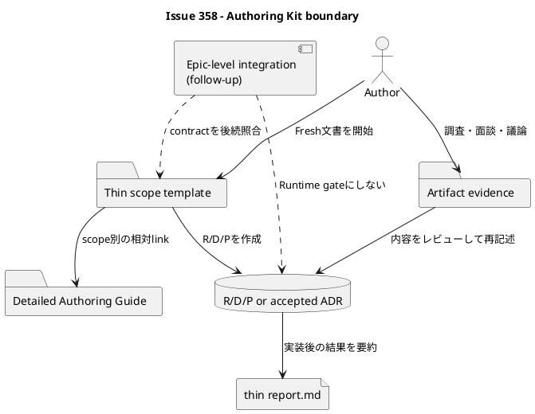

# iss-00358 Simplify Authoring Kit and Document Contracts — 設計

## 1. 設計目標

Thin TemplateとDetailed Guideを分離し、Fresh Initiative / Epic / Issueの仕様を、特定のmodel、provider、workflow state、Assurance Profileに依存せず作成できるAuthoring Kitへ置き換える。

本設計が所有するのは文書の内容、配置、導線、検証契約である。Runtime parser、node copy mechanism、Artifact filename allocation、skill、installer pruneは所有しない。358はこの契約とEpic-level統合入力を独立に完了し、後続Epic統合でmechanismとcontentを照合できる。

## 2. Requirement trace

| Requirement | 設計上の実現箇所 |
|---|---|
| `RQ-358-001` Thin scope templates | §4、§5 |
| `RQ-358-002` Document responsibility | §5、§6 |
| `RQ-358-003` Scope layering | §6 |
| `RQ-358-004` Planning Level | §7 |
| `RQ-358-005` Artifact semantics | §8 |
| `RQ-358-006` Authority boundary | §9 |
| `RQ-358-007` Current / Historical navigation | §10 |
| `RQ-358-008` Projection / compatibility / handoff | §11〜§14 |

## 3. CurrentとTarget

### 3.1 Current

- R/D/P templateにworkflow、Grade、reviewer、promotion、EAL、delegated authoringが混在する。
- Issue Design / PlanはAssurance compose待ちのplaceholderである。
- `issue-profiles/`、Assurance section、draft routing、重いReport scaffoldがFresh authoringの前提になっている。
- Current docsとHistorical docsが同じ導線にあり、利用者が旧workflowを標準手順と誤認できる。

### 3.2 Target



Targetではtemplateは完成文書の骨格だけを持ち、説明、例、選択基準、anti-patternはGuideに置く。RuntimeはMarkdown本文を状態として読まない。

## 4. 358が所有するasset tree

次は358が新設または編集するauthoring-owned treeであり、post-360の完全treeではない。表にない`.workbench/`、`docs/rules/`、flat `reference_*.md`、Historical assetを本Issueで暗黙削除しない。

```text
src/spec_dock/assets/spec_dock/
├── templates/
│   ├── initiative/{requirement,design,plan,report}.md
│   ├── epic/{requirement,design,plan,report}.md
│   ├── issue/{requirement,design,plan,report}.md
│   ├── artifacts/{blank,research,interview,disc,decision-candidate,adr}.md
│   └── README.md
└── docs/
    ├── README.md
    ├── guide.md
    └── authoring/
        ├── overview.md
        ├── requirement.md
        ├── design.md
        ├── issue-plan.md
        ├── report.md
        ├── scope-layering.md
        ├── artifacts.md
        ├── historical.md
        └── issue-plan-levels/
            ├── light.md
            ├── standard.md
            ├── strict.md
            └── critical.md
```

対応する`spec-dock/{templates,docs}/`をdogfood projectionとする。provider sourceが正本であり、dogfood側だけを先行編集しない。

### 4.1 File-change contract

| Action | Provider path | 主な依存 |
|---|---|---|
| Modify | `templates/{initiative,epic,issue}/{requirement,design,plan,report}.md` | §5のthin contract、scope別Guide link |
| Modify | `templates/artifacts/{blank,research,interview,disc,decision-candidate,adr}.md` | §8のCurrent semantics |
| Modify | `templates/README.md`、`docs/README.md`、`docs/guide.md` | §10のCurrent入口 |
| Modify | `docs/authoring/issue-plan.md`、`docs/authoring/scope-layering.md` | §6、§7のBase contract |
| Add | `docs/authoring/{overview,requirement,design,report,artifacts,historical}.md` | Current Overviewと文書別Guide |
| Add | `docs/authoring/issue-plan-levels/{light,standard,strict,critical}.md` | `issue-plan.md`への独立差分 |
| Add | `tests/unit/infra/test_authoring_kit_assets.py` | file / heading / link / vocabulary / parity contract |
| Modify | `tests/unit/infra/test_artifact_templates.py` | Current六種とHistorical保持を分離 |
| Addまたは既存fixtureへ限定追加 | Existing文書preservation test | §14の全user-owned surface |

同じActionをdogfood projectionへ適用する。Module Dependency DiagramはN/Aである。本IssueはRuntime moduleを追加・変更せず、代わりに次の文書依存を固定する。

```text
docs/README.md / docs/guide.md
  -> docs/authoring/overview.md
      -> 文書別Guide、scope-layering.md、artifacts.md、historical.md
templates/*/{requirement,design,plan,report}.md
  -> 対応する文書別Guide
templates/issue/plan.md
  -> issue-plan.md
      -> 選択した一つのissue-plan-levels/*.md
```

## 5. Thin Template contract

### 5.1 共通規則

すべてのscope templateは次を満たす。

- 完成文書に残るfrontmatterと見出しを持つ。R/D/Pは各sectionの一行promptを持ち、Reportは§5.4のempty-valid exact shapeを優先して三つの必須sectionを空本文で開始する。
- placeholderは既存scaffolderが置換できる`<INIT_ID>`、`<EPIC_ID>`、`<ISS_ID>`、title、date、parent、GitHub linkageに限定する。
- R/D/Pの`状態`初期値は`draft`とし、Reportには承認状態や完了状態を持たせない。
- Guideの長文、full example、anti-pattern、workflow手順を複製しない。
- `Grade`、`Assurance`、`artifact_state`、`EAL`、reviewer、authority、promotion、delegated authoring、phase gate、PR statusを含めない。
- commentを削除しないと完成しない構造にしない。

### 5.2 Guide link

各scope templateは、Fresh nodeから解決するscope別相対Markdown linkを一つ持つ。

| Scope | nodeから`spec-dock/docs/authoring/`まで | 検証方法 |
|---|---|---|
| Initiative | `../../docs/authoring/` | Fresh Initiative fixtureからlink解決 |
| Epic | `../../../../docs/authoring/` | Fresh Epic fixtureからlink解決 |
| Issue | `../../../../../../docs/authoring/` | Fresh Issue fixtureからlink解決 |

Provider template自体の置き場所ではなく、scaffold後のnode pathを基準に解決する。template testはscope別の仮想destinationへrenderし、link targetがprovider / dogfoodの双方に存在することを確認する。

### 5.3 文書別の最小契約

| 文書 | 最小frontmatter | 必須見出し | Guide |
|---|---|---|---|
| Requirement | 種別、ID、タイトル、状態=`draft`、最終更新、parent | 目的、背景、観測可能な要件、スコープ、失敗・境界条件、受け入れ条件、制約・前提 | `authoring/requirement.md` |
| Design | 種別、ID、タイトル、状態=`draft`、最終更新、依存=`requirement.md`、parent | 設計目標、Current / Target、責務・Interface、data / failure、変更対象、移行・互換性・rollback、testability、risk | `authoring/design.md` |
| Plan | 種別、ID、タイトル、状態=`draft`、最終更新、依存=`requirement.md, design.md`、parent | 目標、順序・依存、実装step、検証、rollback、exit / handoff。IssueだけPlanning Levelを追加 | Initiative / Epicはscope layering、Issueは`authoring/issue-plan.md` |
| Report | 種別、ID、タイトル、最終更新、依存=`requirement.md, design.md, plan.md`、parent | `Outcome`、`Verification`、`Residual Risks / Follow-ups`。`Notes`はoptional | `authoring/report.md` |

Initiative / EpicのR/D/Pは同じ名前でも§6の責務差を反映する。Reportは全scopeで同じ結果要約契約とする。

### 5.4 Report exact shape

```markdown
# Result Summary

## Outcome

## Verification

## Residual Risks / Follow-ups
```

必要な場合だけ`## Notes`を追加する。empty-validとは、file、frontmatter、上記三見出しが存在し、各section本文が空でも有効という意味である。zero-byte fileはTarget templateではない。Existing Reportはこの形へ正規化しない。

## 6. 文書責務とscope layering

Guideは「どこに書くか」を次のように固定する。

| 文書 | 所有する問い | 所有しないもの |
|---|---|---|
| Requirement | なぜ、何を、誰に、どこまで、何をもって成功か | module構造、実装順、test実装詳細 |
| Design | Requirementを満たす責務、構造、interface、data、failure、migration | business acceptanceの再定義、作業進捗 |
| Plan | approved R/Dを実行する順序、分担、検証、rollback、exit | 未承認のdurable design decision |
| Report | 実際のOutcome、Verification、残余risk | durable decision、planning / quality gate |

| Scope | 所有する判断 | 下位scopeへ渡すもの |
|---|---|---|
| Initiative | 戦略problem / outcome、投資境界、複数Epic依存、広いrisk | Epic outcomeとportfolio constraint |
| Epic | coherentなproduct / architecture outcome、vertical slice、cross-Issue contract、integration | Issueごとのvalue、ownership、dependency、acceptance seed |
| Issue | 一つのend-to-end value、実装・test・docs・migration・rollback | 親の目的やslice方向を再定義しない |

Initiative / EpicへIssueのmicro-stepやPlanning Levelを複製しない。Issueで親契約を変える必要が見つかった場合は、Issue内で暗黙決定せず親R/Dへ戻す。

## 7. Planning Level architecture

### 7.1 File contract

```text
templates/issue/plan.md
  -> docs/authoring/issue-plan.md
      -> docs/authoring/issue-plan-levels/{light|standard|strict|critical}.md
```

`issue-plan.md`がBase Guideである。四つのCompletion GuideはBaseとの差分を独立に説明し、level間の順読を要求しない。`plan-light.md`等の別canonical fileは作らない。

### 7.2 Selection contract

- failure impactとrecovery difficultyで選ぶ。
- 文書量、工数、Priority、Severity、dependency readiness、handoff statusでは選ばない。
- 未指定時の`standard`は執筆上の推奨にできるが、Runtime defaultではない。
- selected level、理由、risk factor、再評価条件はIssue `plan.md`本文へ書く。
- Runtime、`.meta.json`、active manifest、`.assurance.json`へ複製しない。

各Guideはexpected finished state、必須のverification / negative test、rollback / migration、security / privacy / operability、正当なN/A、escalation triggerを説明する。

`docs/authoring/issue-plan.md`の`## Planning Levelの選び方`に、次の識別可能なexample tableを置く。

| Example ID | 状態 | 結論 |
|---|---|---|
| `LEVEL-EX-POS-01` | 影響が局所的で即時revert可能 | `light`候補 |
| `LEVEL-EX-POS-02` | public contract / migrationで影響が広く回復が難しい | `strict`候補 |
| `LEVEL-EX-POS-03` | security / privacyまたは不可逆でincident recoveryが必要 | `critical`候補 |
| `LEVEL-EX-NEG-01` | Priorityだけが高い | levelを上げる根拠にしない |
| `LEVEL-EX-NEG-02` | 工数またはdependency blockerだけが大きい | levelを上げる根拠にしない |
| `LEVEL-EX-NEG-03` | Severity labelだけが高く、実際のimpact / recovery根拠がない | labelだけでは決めない |

asset contract testは見出し、六つのExample ID、各level / negative conclusion tokenを検査する。文章の完全一致ではなく、例が消失・逆転した場合に失敗するstructural assertionとする。

## 8. Artifact semantic contract

Current creation catalogは`blank`、`research`、`interview`、`disc`、`decision-candidate`、`adr`の六種とする。TemplateとGuideは用途を説明するが、filename allocationとHistorical parserは357が所有する。

- `blank`: 自由形式evidence。
- `research`: 一つのsourceに根差した調査。
- `interview`: 質問と回答。
- `disc`: 複数証拠の統合とtrade-off。
- `decision-candidate`: 未採用の選択肢。
- `adr`: architecture decision candidate / record。accepted状態だけがdurableになり得る。

`analysis`、repair、`draft-*`、Profile用templateをCurrent catalogに置かない。Historical fileの物理削除は360へ渡し、358ではCurrentから除外する意味だけを固定する。

## 9. Authority flow

```text
Artifact evidence
  -> 人間またはagentによるsynthesis / review
    -> Requirement / Design / Plan または accepted ADR
      -> implementation
        -> thin Report result summary
```

Artifact、外部ZIP、delegated draft、ChatGPT outputは存在だけで採用済みにならない。Reportもdurable decision storeにならない。Authoring Guideはこの境界を平易に説明するが、mandatory EAL schemaや特定review workflowは導入しない。

## 10. Current / Historical navigation

### 10.1 Current allowlist

`docs/README.md`と`docs/guide.md`の第一導線は次に限定する。

- Storage Coreの操作reference
- `docs/authoring/overview.md`
- Requirement / Design / Issue Plan / Report / Scope Layering / Artifact Guide
- 四つのPlanning Level Completion Guide
- Current六種のArtifact

358完了時点では、まだ存在が保証されないrepo-local skillへのlinkをCurrent navigationへ追加しない。358は359向けhandoff manifestに、将来のexact targetとして`.agents/skills/spec-dock/SKILL.md`と`.agents/skills/spec-dock-grill-with-docs/SKILL.md`を記録する。

359は二つのskill pathを実在させた後にだけ、`docs/authoring/overview.md`の予約済み`Agent assistance`節へこの二linkを追加できる。この限定編集は§13のsingle-editor原則に対する明示handoffであり、authoring semanticsの変更は禁止する。IC-2でlink解決を確認し、360がinstalled consumerで再検証する。

### 10.2 Historical page

`docs/authoring/historical.md`をexact pathとする。旧Profile、Assurance、workflow、draft、repair、provider固有authoringは「既存証跡として保持するが新規利用しない」と説明し、Currentの推奨手順へlinkしない。

禁止語彙testはCurrent allowlistだけに適用する。Historical page、compatibility fixture、既存node-local fileは旧語彙を含めてよい。

## 11. Projectionとparity

| 比較 | 契約 |
|---|---|
| provider ↔ dogfood managed authoring asset | 358-owned manifestに対してbyte-exact |
| provider template ↔ Fresh scaffold | placeholder置換後のfile catalog、heading、link、内容構造（Epic-level後続統合で実施。358のS09完了条件ではない） |
| installed consumer | Issue 360で検証 |
| Existing node-local docs | parity対象外。byte hash preservation対象 |

358-owned manifestは§4のfileを列挙し、directory全体の曖昧な比較を行わない。environment-specific generated fileはmanifestへ含めない。

## 12. Epic-level IC-1 contract input

358は次の値をmachine-readableな契約入力として提供する。Epic orchestratorは、358と関係するRuntime / scaffold Issueが完了した後にこの入力を消費し、実生成との照合を別のEpic-level統合確認として行う。358のIssue完了は、その後続確認に依存しない。

```text
scope_files = [requirement.md, design.md, plan.md, report.md]
contract_version = s09-2026-08-11
consumer = epic-00356-authoring-integration
report_required_headings = [Outcome, Verification, Residual Risks / Follow-ups]
report_optional_heading = Notes
report_empty_content_valid = true
report_runtime_gate = false
current_artifact_types = [blank, research, interview, disc, decision-candidate, adr]
issue_plan_files = [plan.md]
base_plan_guide = docs/authoring/issue-plan.md
level_guides = docs/authoring/issue-plan-levels/{light,standard,strict,critical}.md
planning_level_runtime_owned = false
```

IC-1はEpic orchestratorが後続で行う文書上の統合確認であり、358のRuntime gateではない。content / Guide / heading mismatchは358へ、copy / parser / filename mismatchは該当Runtime Issueへroutingする。統合確認が未実施でも、358-owned contract入力と本Issueの品質ゲートがpassすれば358は完了できる。

## 13. Ownershipと変更境界

| Surface | 358 | 357 / 359 / 360 |
|---|---|---|
| scope template prose、Guide、navigation | owns | consume / package |
| Artifact template semantics | owns wording | 357 owns parser / filename |
| `create_node.py`、Runtime CLI | no edit | 357 owns |
| skill本文 / install_root | no edit | 359 owns |
| installer inventory / prune | no edit | 360 owns |
| obsolete assetの物理削除 | inventoryだけ | 360 owns |

`docs/guide.md`は358をsingle editorとする。Runtime IssueのCore help factsは後続Epic統合で参照し、同じfileを並行編集しない。`docs/authoring/overview.md`は358完了後、359が予約済み`Agent assistance`節の二linkだけを追加でき、それ以外の変更は358またはEpicへ戻す。

## 14. Migration、compatibility、rollback

1. providerへTarget Guideとthin templateを追加する。
2. dogfood projectionへ同じbytesを反映する。
3. Current navigationをTargetへ切り替える。
4. Historical pathと360向けobsolete inventoryを確定する。
5. Epic-level IC-1用のcontract inputを固定し、後続統合でFresh scaffoldと照合できる状態にする。

本Issueは既存node-local content migration、`.assurance.json`変換、legacy rename、obsolete assetの物理pruneを行わない。rollbackはnavigation → Artifact docs → Guide / templateの逆順とし、providerとdogfoodを同じ変更単位で戻す。

保存fixtureはcanonical R/D/P、thin / heavy Report、Current六種、Historical Artifact、Discussion、ADR、`.assurance.json`、Profile由来node-local文書のhashを変更前後で比較する。360が実際のupdate / uninstallでも同じ保存義務を再検証する。

## 15. Failure、observability、testability

| Failure | 検出 | 対応 |
|---|---|---|
| template / Guide link切れ | scope別Fresh link test | 対象assetを修正しhandoff停止 |
| provider / dogfood drift | owned-manifest byte diff | 片側だけを完了扱いしない |
| Currentへ旧workflow語彙が再流入 | path-aware vocabulary test | Current assetを修正 |
| Historical fileが誤ってCurrentになる | allowlist / inventory test | navigationとcatalogを修正 |
| Existing bytesが変化 | preservation hash test | migrationを停止し差分をrollback |
| Runtime couplingが必要になる | forbidden-path diff / test | 358で実装せず357またはEpicへ戻す |

主要test surface:

- `tests/unit/infra/test_authoring_kit_assets.py`を専用contract testの候補とする。
- `tests/unit/infra/test_artifact_templates.py`はCurrent六種とHistorical保持を分けて検証する。
- Fresh scaffoldとの実生成比較はEpic-level統合が消費する。358内では358-owned manifest、render後link、Report / Artifact / Planning Levelの契約fixtureを検証する。
- Planning Level example contractは`LEVEL-EX-POS-01`〜`03`と`LEVEL-EX-NEG-01`〜`03`の存在、結論token、Runtime非依存を検証する。
- `tests/unit/infra/test_init_update.py`には358-local意味契約を集中させず、360のconsumer migrationだけを残す。

## 16. Trade-offと採用しなかった案

| 案 | 判断 | 理由 |
|---|---|---|
| templateへ全説明を埋め込む | 不採用 | 複製とdriftを増やす |
| level別Plan fileを作る | 不採用 | one-plan契約に反する |
| Planning LevelをRuntime metadataにする | 不採用 | docs-only承認に反する |
| 358でlegacy assetを物理削除する | 不採用 | 360のownershipとpreservationを侵す |
| provider tree全体をparity比較する | 不採用 | Historical / generated差分とowned assetを混同する |

`docs/authoring/historical.md`、scope別相対link、専用asset testの配置は、承認済み要件を実装可能にするIssue-local設計具体化であり、新しいProduct workflowを追加しない。新規ADRは不要である。

## 17. 設計完了条件

- `RQ-358-001`〜`RQ-358-008`の責務と検証先が一意である。
- 357 / 359 / 360のownershipを侵食する変更がない。
- Current / Historical、Fresh / Existing、provider / dogfood / installedの比較軸が混同されていない。
- 358-owned contract inputでIssue単独の完了を判定でき、Epic-level IC-1は後続統合確認として明示されている。
- Requirementと本Designに対するfresh spec reviewがpassしてからPlanへ進む。

## 18. 根拠

- 正本Requirement: `requirement.md`
- 親Epic: `../../requirement.md`、`../../design.md`、`../../plan.md`
- 承認済みDraft 1: `artifacts/20260809t125149z-draft-design-strict-vertical-slice-design.md`
- Product Owner interview: `artifacts/20260808t083300z-interview-issue-profile-and-draft-routing.md`、`artifacts/20260808t085519z-interview-planning-level-authoring-architecture-adoption.md`、`artifacts/20260809t025001z-interview-target-report-contract.md`
