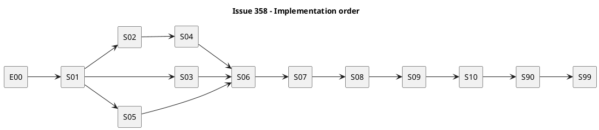

# iss-00358 Simplify Authoring Kit and Document Contracts — 実装計画

## 1. 計画の目標

承認済みRequirement / Designを、Fresh authoringの利用者flowごとの縦スライスとして実装する。Thin Template、Detailed Guide、Planning Level、Report、Artifact authority、Current / Historical navigation、parity、preservationを一つずつ観測可能にし、Issue 357のmechanismとIC-1で一致させる。

このPlanは実装開始を許可する正本である。PR作成、merge、Issue close、Epic完了、obsolete assetの物理pruneは別scopeであり、自動実行しない。

## 2. Planning Level

- Selected level: `strict`
- 理由: shipped template / docs contract、Fresh scaffold、Existing document preservation、provider / dogfood parity、後続skill / installer handoffへ影響するため。
- Risk factors: path / link drift、CurrentとHistoricalの混同、template肥大化、既存node rewrite、Issue 357とのshared contract不一致。
- Re-evaluation: user-owned fileの不可逆migration、security / privacy instruction、installer ownership変更が必要になった場合は実装を停止し、親Epicと該当Issueへ戻す。
- Completion Guide: `spec-dock/docs/authoring/issue-plan-levels/strict.md`。Target Guideがまだ未実装の場合は、本PlanのStrict obligationを優先する。

## 3. Source of record

- Canonical: `requirement.md`、`design.md`、本`plan.md`
- Parent: `../../requirement.md`、`../../design.md`、`../../plan.md`
- Approved Draft 1 evidence: `artifacts/20260809t125148z-draft-requirement-strict-vertical-slice-requirement.md`、`artifacts/20260809t125149z-draft-design-strict-vertical-slice-design.md`、`artifacts/20260809t125150z-draft-plan-strict-vertical-slice-plan.md`
- Product decisions: `artifacts/20260808t083300z-interview-issue-profile-and-draft-routing.md`、`artifacts/20260808t085519z-interview-planning-level-authoring-architecture-adoption.md`、`artifacts/20260809t025001z-interview-target-report-contract.md`
- Baseline code revision: `2c75e0c02cb65a6e74040a72dc161d342d661091`

## 4. 実行順序と依存



S02〜S05は論理上並行可能だが、`docs/authoring/`、scope template、test manifestを共有するため、一つのworktreeではstep単位に順序化する。Issue 357とはRuntime / template proseのownershipを分け、IC-1以前に互いの所有fileを編集しない。

## 5. Allowed / forbidden paths

### 5.1 Allowed

- `src/spec_dock/assets/spec_dock/templates/{initiative,epic,issue}/`
- `src/spec_dock/assets/spec_dock/templates/artifacts/`
- `src/spec_dock/assets/spec_dock/templates/README.md`
- `src/spec_dock/assets/spec_dock/docs/{README.md,guide.md}`
- `src/spec_dock/assets/spec_dock/docs/authoring/`
- 上記の`spec-dock/` dogfood projection
- `tests/unit/infra/test_authoring_kit_assets.py`
- `tests/unit/infra/test_artifact_templates.py`
- bounded preservation / Fresh scaffold contract fixtures

### 5.2 Forbidden

- `src/spec_dock/assets/spec_dock/scripts/`配下のRuntime / CLI / parser / registry
- `src/spec_dock/cli.py`とinstaller inventory / prune
- `src/spec_dock/assets/install_root/`とskill本文
- Issue 357 / 359 / 360のcanonical docs、metadata、deps、active state
- Existing node-local R/D/P/Report/Artifact/Discussion/ADRのrewrite
- `issue-profiles/`、Assurance、legacy templateの物理prune
- level別canonical Plan、Runtime Planning Level metadata、新Artifact type

## 6. Spec-Locked Closure Index

| Closure ID | Spec | Observable state | Locked expectation | Guarded bug class | Required | Evidence level | Verification path | Report destination | Owner |
|---|---|---|---|---|---|---|---|---|---|
| `CL-358-001` | `AC-358-001` | Fresh template catalog | 各scopeにR/D/P/Report一つ | duplicate / missing doc | yes | red-required | catalog test | report S02/S04 | S02/S04 |
| `CL-358-002` | `AC-358-002` | template content | thin、policy混在なし | template再肥大化 | yes | red-required | heading / size / forbidden test | report S02 | S02 |
| `CL-358-003` | `AC-358-003`の文書責務 / scope部分 | Guideとscope semantics | link可能、四文書 / 三scope責務が正しい | empty / wrong Guide | yes | red + manual | contract test + spec review | report S01 | S01 |
| `CL-358-004` | `AC-358-004` | Issue Plan / Guide tree | one Plan、Base + 四独立Guide | multi-plan / chain inheritance | yes | red-required | file / link test | report S03 | S03 |
| `CL-358-005` | `AC-358-005` | Level本文変更 | Runtime / metadata不変 | hidden parser | yes | shared evidence | 357 IC-1 test | report S09 | S09 |
| `CL-358-006` | `AC-358-006` | Fresh Report | 三必須heading、empty-valid、non-gating | heavy gate復活 | yes | red-required | report contract test | report S04 | S04 |
| `CL-358-007` | `AC-358-007` | Artifact Guide / catalog | Current六種だけ | analysis / draft再流入 | yes | red-required | catalog / nav test | report S05 | S05 |
| `CL-358-008` | `AC-358-008` | authority guidance | durable先はR/D/P/accepted ADR | evidence自動昇格 | yes | red + manual | content contract + spec review | report S05 | S05 |
| `CL-358-009` | `AC-358-009` | Current assets | old workflow mandatory語なし | Current導線の逆戻り | yes | red-required | path-aware vocabulary | report S06 | S06 |
| `CL-358-010` | `AC-358-010` | provider / dogfood | owned manifest byte parity、link有効 | projection drift | yes | red-required | parity / link test | report S07 | S07 |
| `CL-358-011` | `AC-358-011` | Existing fixture | 全user-owned byte hash不変 | update rewrite | yes | red-required | preservation matrix | report S08 | S08 |
| `CL-358-012` | `AC-358-012` | 357 Fresh scaffold | IC-1 contract一致 | mechanism / content drift | yes | joint-required | shared fixture | report S09 | S09 |
| `CL-358-013` | `AC-358-013` | 359 / 360 handoff | exact manifest、未割当なし | downstream推測 | yes | manual-required | handoff matrix | report S10 | S10 |
| `CL-358-014` | `AC-358-014` | Level example table | impact / recoveryで選び、label単独を否定 | urgency / effort誤分類 | yes | red-required | Example ID contract test | report S03 | S03 |
| `CL-358-015` | `AC-358-003`のArtifact Guide導線部分 | Current navigationからArtifact Guideへ到達 | S05のArtifact GuideがS06のCurrent入口からlink可能 | Guide実装前の早期close / broken route | yes | red + manual | Artifact / navigation link test + spec review | report S05/S06 | S05/S06 |

locked expectationを変える必要がある場合はstepを停止し、canonical R/D/Pを修正してfresh spec reviewを受ける。

### 6.1 Requirement / edge / Design trace

| 正本契約 | Closure / owner step | 閉じる観測点 |
|---|---|---|
| `RQ-358-001` | `CL-358-001/002/006`, S02/S04 | 三scopeのthin R/D/P/Reportと禁止field |
| `RQ-358-002` | `CL-358-003`, S01 | 四文書責務と責務混在禁止 |
| `RQ-358-003` | `CL-358-003`, S01 | 三scopeの責務差と親scope非再定義 |
| `RQ-358-004` | `CL-358-004/005/014`, S03/S09 | one Plan、docs-only Level、impact / recovery選択 |
| `RQ-358-005` | `CL-358-007/009/015`, S05/S06 | Current六種とHistoricalの分離、Artifact Guide導線 |
| `RQ-358-006` | `CL-358-008`, S05 | durable decision / Artifact / Reportのauthority flow |
| `RQ-358-007` | `CL-358-009/015`, S06 | Current / Historical navigationとArtifact Guideへの到達 |
| `RQ-358-008` | `CL-358-010/011/012/013`, S07/S08/S09/S10 | parity、preservation、IC-1、handoff |
| `EC-358-001/002` | `CL-358-009`, S06 | Currentだけのvocabulary negative、Historical positive control |
| `EC-358-003/004` | `CL-358-004/005/014`, S03/S09 | Runtime metadataとlevel別Planを拒否 |
| `EC-358-005` | `CL-358-006`, S04 | heavy gate / ledgerをReportへ戻さない |
| `EC-358-006/007` | `CL-358-010`, S07 | provider / dogfood driftとbroken linkを検出 |
| `EC-358-008` | `CL-358-011`, S08 | Existing user-owned bytes不変 |
| `EC-358-009` | `CL-358-012`, S09 | IC-1不一致でhandoff停止 |
| Design §4 / §5 | E00/S02/S04/S07 | exact Add / Modify manifest、Thin Template、Report exact shape |
| Design §6〜§10 | S01/S03/S05/S06 | 文書責務、scope、Planning Level、Artifact、authority、navigation |
| Design §11〜§14 | S07/S08/S09/S10 | projection、preservation、IC-1、359 / 360 handoff |
| Design §15〜§18 | S08/S09/S90/S99 | migration / rollback、failure、test、completion boundary |

## 7. 共通delegation contract

- S01〜S06とS90の文書 / template本文: bounded stepごとに`doc-writer`。
- 同じstepのcontract test: 文書変更完了後にfresh `dev-coder`。同時編集しない。
- S07〜S09のfixture / parity / preservation test: fresh `dev-coder`。
- 文書意味: fresh `spec-reviewer`。test code: fresh `code-reviewer`。
- test十分性: milestoneまたはS99でfresh `qa-reviewer`。
- canonical R/D/P/report: main orchestratorだけが更新する。
- worker output: changed files、checks、残余risk、report用evidence、`No material implementation decisions beyond the approved plan.`または具体的Ledger Note。
- Runtime、skill、installer、Existing user contentへ触れる必要を見つけた場合は編集せず、owner Issueへ戻す。

## 8. 実装ステップ

### E00 — Asset / link / preservation baseline

**振る舞い目標:** 変更前のprovider / dogfood assetとCurrent / Historical / Existing保存対象の候補inventoryを固定し、後続stepがmaterialize / ownership確定すべき入力を明示する。

**許可:** read-only tree / link / content / hash調査、main orchestratorのreport記録。

**禁止:** asset、node content、metadata、active、depsの変更。

**ケース概要（規範的なテストカードは§9）:** Design §4.1のAdd / Modify action、provider / dogfood現行parity、scope templateの実際のcopy depth、保存対象候補と既存source / hash、obsolete asset候補を一覧化する。現存しない保存fixtureのbytes / hashはS08でmaterializeして確定する。Design §4外のsurfaceは削除せず`owner pending S10`として記録する。

**Step Closure Contract:** Design §4.1の各rowにpath、baseline Action、358 owner、既存時のbefore hash、planned testがあり、preservation候補はS08のmaterialization input、Design §4外surfaceはno-delete / `owner pending S10`として明示される。E00は`CL-358-010`のbaseline evidenceだけを閉じ、`CL-358-011/013`はS08 / S10で閉じる。曖昧な物理削除rowがない。M0 commit候補は`docs(iss-00358): Authoring asset baselineを記録`。

### S01 — Authoring Guide foundationとscope responsibility

**振る舞い目標:** Overviewから四文書責務と三scope責務へ到達し、何をどこへ書くかを理解できる。

**Allowed paths:** `docs/authoring/{overview,requirement,design,report,scope-layering}.md`、必要なREADME / Guide link、dogfood projection、専用contract test。

**Forbidden:** Planning Level詳細、Artifact filename、skill linkの先行有効化、Runtime手順。

**ケース概要（規範的なテストカードは§9）:** Overviewから四文書Guideとscope responsibilityへ到達し、責務matrixとCurrentの禁止語彙を確認する。evidence IDは§9の`tc-s01-001`だけを使用する。

**Verification:** `uv run pytest tests/unit/infra/test_authoring_kit_assets.py -k 'guide or scope'`。

**Step Closure Contract:** `CL-358-003`、link test、fresh spec review。Commit候補: `docs(authoring): 文書責務とscope Guideを導入`。

### S02 — Thin R/D/P templates

**振る舞い目標:** 三scopeのR/D/Pが最小見出しと一行prompt、scope別Guide linkだけで開始できる。

**Allowed paths:** `templates/{initiative,epic,issue}/{requirement,design,plan}.md`、templates README、dogfood projection、asset tests。

**Forbidden:** Report、Artifact template、workflow / reviewer / EAL / assurance field、full example。

**ケース概要（規範的なテストカードは§9）:** 三scope各R/D/P一つ、Design §5.3の必須frontmatter / heading、scope別render後link、forbidden field、削除用commentなし、Initiative / EpicにPlanning Levelなし。

**Verification:** `uv run pytest tests/unit/infra/test_authoring_kit_assets.py -k 'template and not report'`。

**Step Closure Contract:** `CL-358-001/002`のR/D/P部分、provider / dogfood同時差分、fresh spec / code review。Commit候補: `feat(authoring): thin RDP templateへ置換`。

### S03 — One Issue PlanとPlanning Level Guides

**振る舞い目標:** 一つのIssue `plan.md`からBase Guideと選択した一つのCompletion Guideを独立に使える。

**Allowed paths:** `templates/issue/plan.md`、`docs/authoring/issue-plan.md`、`docs/authoring/issue-plan-levels/`、dogfood projection、asset tests。

**Forbidden:** `plan-light.md`等、Runtime metadata、cross-level順読、priority / effort default。

**ケース概要（規範的なテストカードは§9）:** one Plan、Base + 四独立Guide、positive / negative example、Runtime / metadata非所有を確認する。evidence IDは§9の`tc-s03-001/002`だけを使用する。

**Verification:** `uv run pytest tests/unit/infra/test_authoring_kit_assets.py -k 'plan or level'`。

**Step Closure Contract:** `CL-358-004/014`、fresh spec / code review。Commit候補: `docs(authoring): one-planと四Completion Guideを導入`。

### S04 — Thin Report

**振る舞い目標:** Fresh全scopeに三必須headingのReportが常設され、空本文でもvalidである。

**Allowed paths:** `templates/{initiative,epic,issue}/report.md`、`docs/authoring/report.md`、dogfood projection、report contract tests。

**Forbidden:** Decision Ledger、EAL、Authoring / Reviewer / Completion Gate、approved / completed state、Existing Report normalization。

**ケース概要（規範的なテストカードは§9）:** 三scopeReport一つ、exact三heading、optional Notes、empty body valid、zero-byteではない、forbidden ledger / gate語なし。

**Verification:** `uv run pytest tests/unit/infra/test_authoring_kit_assets.py -k report`。357の実生成との照合はS09だけで行う。

**Step Closure Contract:** `CL-358-001/006`、fresh spec / code review。Commit候補: `feat(authoring): thin Report契約へ置換`。

### S05 — Artifact semanticsとauthority boundary

**振る舞い目標:** Current六種の用途とdurable reflection先を説明し、evidenceの自動昇格を禁止する。

**Allowed paths:** `templates/artifacts/`のCurrent六種、`docs/authoring/artifacts.md`、dogfood projection、catalog tests。

**Forbidden:** filename parser、Historical file削除、`analysis`、draft / repair Current route、mandatory EAL。

**ケース概要（規範的なテストカードは§9）:** Current六template exact catalog、六用途 / reflection先、single-source researchとmulti-source disc、accepted ADRだけauthority、external ZIP / draft / Report no-auto-promotion、Historical physical retention。

**Verification:** `uv run pytest tests/unit/infra/test_artifact_templates.py tests/unit/infra/test_authoring_kit_assets.py -k artifact`。

**Step Closure Contract:** `CL-358-007/008`、fresh spec / code review。Commit候補: `docs(artifact): Current六種とauthority境界を明示`。

### S06 — Current / Historical navigation

**振る舞い目標:** Current入口がStorage CoreとAuthoring Kitだけを推奨し、旧surfaceはHistoricalとして説明される。

**Allowed paths:** `docs/{README.md,guide.md}`、`docs/authoring/{overview,historical}.md`、templates README、dogfood projection、link / vocabulary tests。

**Forbidden:** obsolete asset物理削除、未実装skillのlive link、Historical fixtureへの禁止語彙scan。

**ケース概要（規範的なテストカードは§9）:** Current allowlistの全link、Historical exact path、旧語彙のCurrent negative / Historical positive control、Currentからold workflowへの推奨linkなし、skill予約節はlinkなしでhandoff説明だけ。

**Verification:** `uv run pytest tests/unit/infra/test_authoring_kit_assets.py -k 'navigation or vocabulary or link'`。

**Step Closure Contract:** `CL-358-009`、broken linkゼロ、fresh spec / code review。Commit候補: `docs(authoring): CurrentとHistorical導線を分離`。

### S07 — Provider / dogfood parity

**振る舞い目標:** Design §4.1のowned assetがprovider / dogfoodでbyte一致し、render後linkが有効である。

**Allowed paths:** owned-manifest / parity test、必要な片側projection修正。

**Forbidden:** directory全体の曖昧比較、Existing node-local docsをparity対象にする、installed consumer検証。

**ケース概要（規範的なテストカードは§9）:** Add / Modify全pathの存在、byte parity、scope別template render後link、Current catalog / navigationの同一性、environment-specific file除外の明示。

**Verification:** `uv run pytest tests/unit/infra/test_authoring_kit_assets.py -k 'parity or link'`。

**Step Closure Contract:** `CL-358-010`、差分ゼロまたは明示allowlistのみ、fresh code review。Commit候補はS01〜S06のprojection commitへ同梱できる。

### S08 — Existing document preservation

**振る舞い目標:** Authoring asset変更が既存user-owned node contentを一byteも変更しないことを証明する。

**Allowed paths:** preservation fixture / test、358-owned asset copyのsimulation、必要なtest helper。

**Forbidden:** installer migration実装、fixtureの正規化、node-local content rewrite。

**ケース概要（規範的なテストカードは§9）:** E00 candidate inventoryからcanonical R/D/P、thin / heavy Report、Current六種、draft / repair / scratch / note / generic import、Discussion、accepted / candidate ADR、`.assurance.json`、Profile由来文書を含むfull fixtureをmaterializeし、materialization直後のbaseline SHA-256とasset適用simulation後のSHA-256一致を固定する。

**Verification:** `uv run pytest tests/unit/infra/test_authoring_kit_assets.py -k preservation`。

**Step Closure Contract:** `CL-358-011`、E00 candidate inventoryの全categoryが実在fixture / baseline SHA-256へ解決され、全fixture row不変、negative controlで意図的変更を検出、fresh QA / code review。Commit候補: `test(authoring): Existing文書保持を固定`。

### S09 — IC-1 Core / Kit contract

**振る舞い目標:** 357のmechanismが358のfile / Report / Artifact / one-plan contractを実際に生成・保持する。

**Entry:** S01〜S08完了、357のFresh scaffold / Artifact mechanism evidenceが利用可能。

**ケース概要（規範的なテストカードは§9）:** scope_files四件、Report三heading / empty-valid / non-gating、Current六type、Historical policy、one Issue Plan、Guide path、Planning Level Runtime非所有、provider / dogfood relative shape。

**Mismatch routing:** content / Guide / headingは358へ、copy / parser / filename / Runtime behaviorは357へ戻す。358からRuntimeを修正しない。

**Step Closure Contract:** `CL-358-005/012`。Epic orchestratorがIC-1 evidenceをEpic-local `disc`とEpic reportへ統合し、pass前に359 handoffを有効化しない。mismatch修正がなくてもreport / IC evidence差分をM4 commitへ同梱する。

### S10 — 359 / 360 handoff manifest

**振る舞い目標:** skillとdistributionの後続作業がpath / ownershipを推測せず開始できる。

**359 handoff:** Authoring Guide path、semantic summary、予約済み`Agent assistance`節、将来のexact skill target `.agents/skills/spec-dock/SKILL.md`と`.agents/skills/spec-dock-grill-with-docs/SKILL.md`、限定編集規則。

**360 handoff:** Fresh asset manifest、obsolete asset manifest、retain / replace / historical-only / prune分類、全preservation list、provider / dogfood parity、installed consumer再検証義務。

E00で`owner pending S10`としたDesign §4外surfaceは、ここで359 / 360またはretain-onlyへ一意に割り当てる。S10より前に物理削除ownerを推測しない。

**Step Closure Contract:** `CL-358-013`、E00のpending rowを含め重複 / 欠落 / owner未設定rowなし、fresh spec review。Commit候補: S90 docs commitへ同梱可能。

### S90 — Docs impact resolution

**振る舞い目標:** Issue全体がdocs変更であることを前提に、全導線、用語、例、migration / Historical説明を最終確認する。

**ケース概要（規範的なテストカードは§9）:** all relative links、provider-neutral Japanese-first wording、Current allowlist、Historical exclusions、Planning Level examples、359 reserved handoff、360 inventory link、README first-read route。

**Step Closure Contract:** fresh `spec-reviewer` pass、docs impactを`none`にせず、S09 / S10 evidenceを含むM4 docs commitとpost-commit clean checkで閉じる。

### S99 — Final Issue quality gate

**Verification sequence:**

```sh
uv run pytest tests/unit/infra/test_authoring_kit_assets.py
uv run pytest tests/unit/infra/test_artifact_templates.py
uv run pytest tests/cli_runtime/test_new.py
uv run pytest tests/cli_runtime/test_validate.py
uv run pytest tests/unit/infra/test_init_update.py
make lint
uv run pytest
./spec-dock/scripts/spec-dock validate
git diff --check
git status --short
```

`uv run pytest --run-full-regression`、actual fresh / update / uninstall consumer matrix、cross-Issue release smokeは人間承認待ちの最終統合Issue候補が所有する。Issue 358の変更に起因する追加testだけはS99で実行する。

**Step Closure Contract:** fresh `qa-reviewer`、issue-wide `code-reviewer`、`spec-reviewer`がpassし、Closure Index全required rowにevidenceがあり、open Ledger Noteがない。

## 9. 規範的なStep-local execution / delegation contract

§8は成果の概要である。実装委任、Red / Green、docs-only代替証拠、停止判断、review、report更新は本節を規範とする。`doc-writer`と`dev-coder`は同一stepを同時編集せず、文書asset確定後にcontract testを追加する。

### E00 contract — Asset / link / preservation candidate baseline

- Depends on: 承認済みR/D/Pとbaseline `2c75e0c02cb65a6e74040a72dc161d342d661091`。Unblocks: S01〜S08。
- Target files: Design §4.1対象のread-only inventory、preservation / Design §4外candidate inventory、Issue `report.md` E00 evidence。
- Planned obligation: Add / Modify、provider / dogfood hash、link、copy depth、preservation候補、Design §4外no-delete rowを固定する。未作成fixtureのbytes / hashとpending ownerをE00完了条件にしない。
- Redまたは代替証拠: `inspect-only`。behavior変更なしのためtestは不要で、before manifest / hash / link scanを代替証拠とする。
- Bounded implementation: assetやuser contentを変えずreportだけを更新する。
- Green verification: 全Design §4.1 rowにAction / 358 owner / 既存時のbefore hash / test ownerがあり、preservation候補はS08 input、Design §4外rowはno-delete / `owner pending S10`である。
- Refactor guardrail: obsolete候補を358のDeleteへ分類しない。
- Amendment trigger: Design §4.1外の変更、user-owned rewrite、Runtime / installer変更が必要なら停止する。
- Report destination: `report.md`のE00 `Step Contract Closure` / `Delegated Worker Evidence`。
- Delegation contract:
  - delegated role: `repo-analyst`。
  - input docs: Requirement §5〜§9、Design §4 / §11 / §14、Plan Closure Index。
  - allowed paths: repositoryのread-only調査、Issue reportへのmain orchestrator転記。
  - forbidden changes: asset、source、tests、user content、metadata / deps / active / Git state。
  - acceptance criteria: Design manifest完全性、baseline parity、preservation candidate category完全性、Design §4外surfaceのno-delete明示。
  - required verification: tree / link / hash / copy-depth inspection。
  - reviewer focus: Historical / `.workbench` / rules / flat referencesの暗黙Deleteがないこと。
  - stop conditions: Design §4.1 rowのaction / 358 owner不明、baseline drift、Design §4外surfaceをDeleteへ分類した場合。preservation fixture未materializeとS10 owner pendingは停止条件ではない。
  - output required: manifest、hash、link evidence、risk、material decision有無。
- `tc-e00-001` inspect: baseline asset and preservation candidate manifest
  - 前提: provider / dogfood assetと、既存repositoryから収集可能なpreservation候補がある。
  - 操作: Design §4.1 path、relative links、scope copy depth、preservation categoryごとのcandidate source / 既存SHA-256、Design §4外surfaceを収集する。
  - 期待結果: Design §4.1 rowにAction / 358 owner / 既存hash / planned testがあり、preservation未materialize rowはS08へ、Design §4外rowはno-delete / S10へ明示的にroutingされる。
  - 失敗検出: Design §4.1未収集path、provider / dogfood説明不能差分、preservation category欠落、暗黙Delete。
  - 検証方法: explicit manifest、relative-link scan、既存SHA-256一覧、S08 / S10 routingをreportへ保存する。
  - 関連 closure id: `CL-358-010`。`CL-358-011/013`のcandidate evidenceは収集するがcloseしない。
- Step gate: mainがreportを更新し、曖昧rowゼロを確認する。fresh `spec-reviewer`がE00 report evidenceとapproved R/D/Pのdocs/spec alignmentをpassした後、M0 commit候補`docs(iss-00358): Authoring asset baselineを記録`を作成し、`git status --short`で意図しない残差がないことを確認してからS01へ進む。report差分があるため`approved-no-op`は使わない。

### S01 contract — Authoring Guide foundation

- Depends on: E00。Unblocks: S02 / S03 / S05。Target files: `docs/authoring/{overview,requirement,design,report,scope-layering}.md`、Design §4.1 navigation entry、dogfood projection、Guide contract tests。
- Planned obligation: Overviewから四文書責務と三scope責務へ到達でき、禁止する責務混在を説明する。
- Redまたは代替証拠: `red-required`。missing link / heading / responsibility tokenとforbidden workflow wordingを先に失敗させる。
- Bounded implementation: Guide foundationだけを追加し、Planning Level詳細 / Artifact / Runtime手順を後続へ残す。
- Green verification: `CL-358-003`のlink / meaning contractとfresh spec reviewがpassする。
- Refactor guardrail: provider-specific agent workflowをAuthoring contractにしない。
- Amendment trigger: 四文書 / 三scope責務またはpathを変える必要があれば停止する。
- Report destination: `report.md`のS01 closure / Test Contract Closure / Reviewer Gate Status。
- Delegation contract:
  - delegated role: fresh `doc-writer`、asset確定後のtestだけfresh `dev-coder`。
  - input docs: `RQ-358-002/003`, `AC-358-003`; Design §4 / §6; `CL-358-003`。
  - allowed paths: 本step Target filesだけ。
  - forbidden changes: templates、Planning Level / Artifact詳細、Runtime / skill / installer、Existing content。
  - acceptance criteria: 全link有効、責務 / 禁止混在 / scope継承が正本どおり説明される。
  - required verification: authoring asset testsのguide / scope cases、manual semantic review。
  - reviewer focus: 意味の正確さ、親scope非再定義、日本語first-readability。
  - stop conditions: path / responsibilityのmaterial変更、scope外assetが必要。
  - output required: changed docs / tests、Red / Green、link結果、risk、material decision有無。
- `tc-s01-001` acceptance: four-document and three-scope Guide contract
  - 前提: Current navigation rootとDesign §6 responsibility matrixがある。
  - 操作: Overviewから各Guideへ移動し、R/D/P/Reportの問い・禁止混在とInitiative / Epic / Issueの責務を検査する。
  - 期待結果: relative linkが全て解決し、四文書と三scopeの意味、親scope非再定義が明記される。
  - 失敗検出: link切れ、空Guide、責務入替、mandatory agent workflow語。
  - 検証方法: link / heading / token testとfresh spec review。
  - 関連 closure id: `CL-358-003`。
- Step gate: report更新 → fresh `code-reviewer`（test）とfresh `spec-reviewer`（意味）pass → main approval。

### S02 contract — Thin R/D/P templates

- Depends on: S01。Unblocks: S04 / S07。Target files: `templates/{initiative,epic,issue}/{requirement,design,plan}.md`、templates README、dogfood projection、asset tests。
- Planned obligation: 三scopeのR/D/Pを最小frontmatter / heading / prompt / scope別Guide linkへ置換する。
- Redまたは代替証拠: `red-required`。catalog、exact headings、forbidden workflow fields、rendered linkを先に失敗させる。
- Bounded implementation: R/D/Pだけを変更し、ReportはS04、Guide本体はS01 / S03が所有する。
- Green verification: `CL-358-001/002`のR/D/P部分がpassする。
- Refactor guardrail: full example、削除用comment、Initiative / Epic Planning Levelを入れない。
- Amendment trigger: Design §5 exact shape外のfield / headingが必要なら停止する。
- Report destination: `report.md`のS02 closure / Test Contract Closure / Reviewer Gate Status。
- Delegation contract:
  - delegated role: fresh `doc-writer`、asset確定後のtestだけfresh `dev-coder`。
  - input docs: `RQ-358-001`, `AC-358-001/002`; Design §4.1 / §5; `CL-358-001/002`。
  - allowed paths: 本step Target filesだけ。
  - forbidden changes: Report / Artifact template、Guide prose、Runtime / skill / installer、Existing nodes。
  - acceptance criteria: nine R/D/P templatesがthinでscope別Guide linkを持ち、禁止fieldがない。
  - required verification: template catalog / heading / link / vocabulary test。
  - reviewer focus: minimality、placeholder置換可能性、frontmatter / link exactness。
  - stop conditions: scope別shapeの新判断、Design外path、existing content migration。
  - output required: changed templates / tests、Red / Green、manifest、risk、material decision有無。
- `tc-s02-001` acceptance: thin R/D/P template matrix
  - 前提: three scopesとDesign §5.3 exact contractがある。
  - 操作: 各scopeのR/D/Pをcatalog、renderし、frontmatter、heading、one-line prompt、Guide link、forbidden fieldsを検査する。
  - 期待結果: 各scopeにR/D/P一つ、link有効、thin contract一致、workflow / reviewer / EAL / Assurance fieldなし。
  - 失敗検出: duplicate / missing、link切れ、policy prose、Planning Levelのscope違反。
  - 検証方法: parameterized asset testとfresh spec review。
  - 関連 closure id: `CL-358-001`, `CL-358-002`。
- Step gate: report更新、fresh code / spec review pass後だけ完了する。

### S03 contract — One Issue Plan and Planning Level Guides

- Depends on: S01。Unblocks: S06 / S09。Target files: `templates/issue/plan.md`、`docs/authoring/issue-plan.md`、`docs/authoring/issue-plan-levels/*.md`、dogfood projection、asset tests。
- Planned obligation: canonical Plan一つ、Base Guide一つ、独立した四Completion Guideとimpact / recovery選択例を提供する。
- Redまたは代替証拠: `red-required`。multi-plan / cross-level chain / Runtime metadata / positive-negative examplesを先に失敗させる。
- Bounded implementation: docs / templateだけを変更し、Runtime parser / `.meta.json`を変更しない。
- Green verification: `CL-358-004/014`がpassする。`CL-358-005`のRuntime非所有はS09で最終確認する。
- Refactor guardrail: priority / severity / effort / readinessをLevel判定に使わない。
- Amendment trigger: level数、one-plan、selection criteriaを変える必要がある場合は停止する。
- Report destination: `report.md`のS03 closure / Test Contract Closure / Reviewer Gate Status。
- Delegation contract:
  - delegated role: fresh `doc-writer`、asset確定後のtestだけfresh `dev-coder`。
  - input docs: `RQ-358-004`, `EC-358-003/004`, `AC-358-004/014`; Design §7; `CL-358-004/014`。
  - allowed paths: 本step Target filesだけ。
  - forbidden changes: level別Plan、Runtime / metadata、Initiative / Epic Level、other Guide prose。
  - acceptance criteria: one Plan、Base + four independent Guides、example IDs / conclusion tokens、forbidden signalの否定。
  - required verification: plan / level asset tests、Runtime / metadata no-diff inspection。
  - reviewer focus: impact / recovery rule、独立性、wrong-signal rejection。
  - stop conditions: Runtime fallback、cross-level inheritance、新classification。
  - output required: changed docs / templates / tests、Red / Green、example matrix、risk、material decision有無。
- `tc-s03-001` acceptance: one-plan and independent Completion Guides
  - 前提: Issue template catalogとBase / four level target pathsがある。
  - 操作: file catalogとlinksを検査し、各Completion GuideをBaseから単独で読む。
  - 期待結果: canonical `plan.md`一つ、四GuideはBaseへlinkし、別levelの順読を要求しない。
  - 失敗検出: `plan-light.md`等、missing Guide、cross-level mandatory link。
  - 検証方法: file / link / forbidden path test。
  - 関連 closure id: `CL-358-004`。
- `tc-s03-002` acceptance: selection examples reject wrong signals
  - 前提: `LEVEL-EX-POS-01`〜`03`、`LEVEL-EX-NEG-01`〜`03`のcontractがある。
  - 操作: impact / recovery例とpriority / severity / dependency / handoff状態だけの例を評価する。
  - 期待結果: 前者は所定Level、後者はlabel単独でLevelを決めない結論tokenを持つ。
  - 失敗検出: urgency / effort / readinessだけでLevel確定、required example欠落。
  - 検証方法: example ID / conclusion token testとfresh spec review。
  - 関連 closure id: `CL-358-014`。
- Step gate: report更新、fresh code / spec review pass後だけ完了する。

### S04 contract — Thin Report

- Depends on: S02。Unblocks: S06。Target files: `templates/{initiative,epic,issue}/report.md`、`docs/authoring/report.md`、dogfood projection、358-owned report asset tests。
- Planned obligation: 三scopeのReportをexact三必須heading + optional Notes、empty-valid、non-gatingにする。
- Redまたは代替証拠: `red-required`。heading / empty body / forbidden gate / ledgerをasset testで先に失敗させる。
- Bounded implementation: 358-owned Report assetだけを閉じ、357のscaffolder / `tests/cli_runtime/test_new.py`は触れない。
- Green verification: `CL-358-001/006`のReport asset contractだけがpassする。
- Refactor guardrail: Existing Reportを正規化せず、approved / completed stateをtemplateへ入れない。
- Amendment trigger: exact headingやempty-valid意味を変える必要がある場合は停止する。
- Report destination: `report.md`のS04 closure / Test Contract Closure / Reviewer Gate Status。
- Delegation contract:
  - delegated role: fresh `doc-writer`、asset確定後のtestだけfresh `dev-coder`。
  - input docs: `RQ-358-001`, `EC-358-005`, `AC-358-001/006`; Design §5.4; `CL-358-001/006`。
  - allowed paths: 本step Target filesだけ。
  - forbidden changes: Runtime / CLI test、357 file、Existing Report、ledger / gate schema。
  - acceptance criteria: three Report templates、exact headings、empty body valid、zero-byteでない、forbidden語なし。
  - required verification: `test_authoring_kit_assets.py -k report`だけ。
  - reviewer focus: exact shape、non-gating、scope independence、hidden 357 dependencyなし。
  - stop conditions: Runtime変更、report semanticsのmaterial変更、Existing migration。
  - output required: changed docs / templates / tests、Red / Green、shape evidence、risk、material decision有無。
- `tc-s04-001` acceptance: thin Report asset contract
  - 前提: three scope Report templatesとDesign §5.4 exact shapeがある。
  - 操作: frontmatter / heading / empty body / Notes / forbidden gate語を検査する。
  - 期待結果: 各scopeにReport一つ、三必須heading、optional Notes、本文空でもvalid、zero-byteでなくledger / gate語がない。
  - 失敗検出: heading差、state field、heavy ledger、357 Runtime testへの依存。
  - 検証方法: 358-owned asset testとfresh spec review。
  - 関連 closure id: `CL-358-001`, `CL-358-006`。
- Step gate: report更新、fresh code / spec review pass。357 evidenceを要求しない。

### S05 contract — Artifact semantics and authority

- Depends on: S01。Unblocks: S06。Target files: Current六template、`docs/authoring/artifacts.md`、dogfood projection、Artifact asset tests。
- Planned obligation: Current六種の用途 / reflection先とR/D/P/accepted ADRだけのdurable authorityを説明する。
- Redまたは代替証拠: `red-required`。exact catalog、type semantics、auto-promotion禁止、Historical保持を先に失敗させる。
- Bounded implementation: Design §4.1 pathだけを変更し、`docs/rules/**`とRuntime filename parserを触らない。
- Green verification: `CL-358-007/008`と`CL-358-015`のArtifact Guide側入力がasset testとfresh spec reviewでpassする。`CL-358-015`の最終closeはS06で行う。
- Refactor guardrail: `analysis`、draft / repair Current route、mandatory EALを追加しない。
- Amendment trigger: Current type / authority flow / Historical policy変更が必要なら停止する。
- Report destination: `report.md`のS05 closure / Test Contract Closure / Reviewer Gate Status。
- Delegation contract:
  - delegated role: fresh `doc-writer`、asset確定後のtestだけfresh `dev-coder`。
  - input docs: `RQ-358-005/006`, `AC-358-003/007/008`; Design §8 / §9; `CL-358-007/008/015`。
  - allowed paths: 本step Target filesだけ。
  - forbidden changes: `docs/rules/**`、Runtime / parser、Historical file、Existing Artifact、new type。
  - acceptance criteria: exact six templates、用途 / reflection、accepted ADR authority、no auto-promotion。
  - required verification: Artifact template / Authoring asset tests、manual semantic review。
  - reviewer focus: single vs multi-source guidance、candidate vs accepted ADR、evidence-only boundary。
  - stop conditions: catalog / filename change、rule docsの必要、new durable authority。
  - output required: changed docs / templates / tests、Red / Green、catalog evidence、risk、material decision有無。
- `tc-s05-001` acceptance: Current six and durable reflection
  - 前提: blank / research / interview / disc / decision-candidate / adr templatesとArtifact Guideがある。
  - 操作: exact catalog、各用途、reflection先、research / disc、candidate / accepted ADR、external ZIP / draft / Report扱いを検査する。
  - 期待結果: Currentは六種だけで、durable判断はR/D/P/accepted ADRへ人が反映し、evidenceは自動昇格しない。
  - 失敗検出: analysis / draft route、candidate authority化、mandatory EAL、Historical削除。
  - 検証方法: catalog / semantic token testとfresh spec review。
  - 関連 closure id: `CL-358-007`, `CL-358-008`, `CL-358-015`。
- Step gate: report更新、fresh code / spec review pass後だけ完了する。

### S06 contract — Current / Historical navigation

- Depends on: S03 / S04 / S05。Unblocks: S07。Target files: `docs/{README.md,guide.md}`、`docs/authoring/{overview,historical}.md`、templates README、dogfood projection、link / vocabulary tests。
- Planned obligation: Current入口をStorage Core + Authoring Kitへ限定し、旧surfaceをHistoricalとして説明する。
- Redまたは代替証拠: `red-required`。Current allowlist、broken link、Current negative / Historical positive vocabulary controlを先に失敗させる。
- Bounded implementation: navigation / historical explanationだけを変更し、obsolete assetを物理削除しない。
- Green verification: `CL-358-009/015`と`EC-358-001/002/007`がpassする。
- Refactor guardrail: 未実装skill linkを有効化せず、予約節はhandoff説明だけにする。
- Amendment trigger: obsolete prune、Current allowlist変更、skill target変更が必要なら停止する。
- Report destination: `report.md`のS06 closure / Test Contract Closure / Reviewer Gate Status。
- Delegation contract:
  - delegated role: fresh `doc-writer`、asset確定後のtestだけfresh `dev-coder`。
  - input docs: `RQ-358-007`, `EC-358-001/002/007`, `AC-358-003/009`; Design §10 / §13; `CL-358-009/015`。
  - allowed paths: 本step Target filesだけ。
  - forbidden changes: obsolete physical delete、skill live link、Historical fixture、Runtime / installer。
  - acceptance criteria: Current allowlist / links、Historical exact page、path-aware vocabulary、reserved handoff。
  - required verification: navigation / vocabulary / link tests。
  - reviewer focus: false positiveを避けるpath-aware scan、first-read route、Current旧推奨なし。
  - stop conditions: Historical contentをCurrentへ戻す、broken external target、owner Issue変更。
  - output required: changed docs / tests、Red / Green、link / vocabulary evidence、risk、material decision有無。
- `tc-s06-001` acceptance: path-aware Current / Historical route
  - 前提: Current allowlist、Historical page、旧workflow語を含むHistorical fixtureがある。
  - 操作: Current全link、first-read route、Current / Historicalの旧語彙、reserved skill sectionをscanする。
  - 期待結果: Current linkはArtifact Guideを含め全て有効で旧workflow推奨なし、Historical旧語は許容、skill linkは未有効である。
  - 失敗検出: broken link、Current旧語、Historical false positive、未実装skill live link。
  - 検証方法: path-aware link / vocabulary testとfresh spec review。
  - 関連 closure id: `CL-358-009`, `CL-358-015`。
- Step gate: report更新、fresh code / spec review pass後だけ完了する。

### S07 contract — Provider / dogfood parity

- Depends on: S06。Unblocks: S08。Target files: Design §4.1 owned-manifest / parity / rendered-link testsと、必要な片側projection修正。
- Planned obligation: Add / Modify assetをprovider / dogfoodでbyte一致させ、scope別render後linkを有効にする。
- Redまたは代替証拠: `red-required`。owned path drift / missing / broken rendered linkを先に失敗させる。
- Bounded implementation: explicit Design manifestだけを比較し、Existing node / directory全体を対象にしない。
- Green verification: `CL-358-010`が許容差分ゼロでpassする。
- Refactor guardrail: environment-specific除外は明示rowだけとし、曖昧globで隠さない。
- Amendment trigger: Design §4.1外のprojection差、normalized comparisonが必要なら停止する。
- Report destination: `report.md`のS07 closure / Test Contract Closure / Reviewer Gate Status。
- Delegation contract:
  - delegated role: fresh `dev-coder`。
  - input docs: `RQ-358-008`, `EC-358-006/007`, `AC-358-010`; Design §4.1 / §11; `CL-358-010`。
  - allowed paths: 本step Target filesだけ。
  - forbidden changes: Existing node、installed consumer、Runtime / installer、manifest外asset。
  - acceptance criteria: owned path存在、byte parity、rendered link有効、zero unexplained diff。
  - required tests: authoring asset parity / link focused suite。
  - reviewer focus: manifest completeness、determinism、projection片側修正の正本方向。
  - stop conditions: source authority逆転、Design外file、unexplained normalization。
  - output required: changed tests / projection、Red / Green、manifest diff、risk、material decision有無。
- `tc-s07-001` acceptance: explicit owned-manifest parity
  - 前提: Design §4.1 Add / Modify manifestとscope別render fixtureがある。
  - 操作: 各pathの存在 / bytesを比較し、rendered templateからGuide linkを解決する。
  - 期待結果: 全pathが存在しprovider / dogfood byte一致、全relative linkが解決する。
  - 失敗検出: missing / extra owned row、byte drift、broken link、曖昧除外。
  - 検証方法: explicit manifest testとfresh code review。
  - 関連 closure id: `CL-358-010`。
- Step gate: report更新後、fresh `code-reviewer`がmanifest / parity / linkをpassする。

### S08 contract — Existing document preservation

- Depends on: S07 / E00。Unblocks: S09。Target files: preservation fixture / tests、358-owned asset copy simulation、bounded test helper。
- Planned obligation: Authoring asset変更が既存user-owned contentを一byteも変更しないことを証明する。
- Redまたは代替証拠: `red-required`。E00 candidate inventoryから全preservation surfaceをmaterializeし、asset適用前baseline SHA-256と意図的mutation negative controlを先に固定する。
- Bounded implementation: test / fixtureだけを変更し、thin Report、candidate ADR、profile-derived文書を含む不足categoryはfixtureとして明示生成する。migration / rewriteは実装しない。
- Green verification: `CL-358-011`の全categoryが実在fixtureとbaseline SHA-256を持ち、simulation後も全row不変でnegative controlを検出する。
- Refactor guardrail: fixture normalizationやhash対象省略を禁止する。
- Amendment trigger: Existing content変更が必要、または360 migration proofを358へ持ち込む場合は停止する。
- Report destination: `report.md`のS08 closure / Test Contract Closure / Reviewer Gate Status。
- Delegation contract:
  - delegated role: fresh `dev-coder`。
  - input docs: `RQ-358-008`, `EC-358-008`, `AC-358-011`; Design §14 / §15; `CL-358-011`、E00 preservation candidate manifest。
  - allowed paths: 本step Target filesだけ。
  - forbidden changes: installer / update behavior、node-local content、fixture normalization、Runtime。
  - acceptance criteria: canonical docs / thin and heavy Reports / all Artifact / Discussion / accepted and candidate ADR / Assurance / profile-derived docsがfixtureとbaseline SHA-256を持ち、byte不変。
  - required tests: preservation matrix + negative control。
  - reviewer focus: full surface、hash timing、simulation fidelity、360との境界。
  - stop conditions: user data mutation、test-onlyで証明不能、scope外update実装。
  - output required: changed tests / fixtures、hash matrix、negative control、risk、material decision有無。
- `tc-s08-001` compatibility: full Existing preservation surface
  - 前提: E00 candidate inventoryがcategory / candidate source / synthetic-requiredを区別している。
  - 操作: canonical R/D/P、thin / heavy Report、Current六種、draft / repair / scratch / note / generic import、Discussion、accepted / candidate ADR、`.assurance.json`、profile-derived docsを含むfixtureをmaterializeし、直後のbaselineと358-owned asset適用simulation後の全file SHA-256を比較する。一件を意図的に変えるnegative controlも実行する。
  - 期待結果: 通常simulationは全hash一致、negative controlだけが確実に失敗する。
  - 失敗検出: hash差、対象欠落、mutation見逃し。
  - 検証方法: explicit path / SHA-256 matrixとfresh QA / code review。
  - 関連 closure id: `CL-358-011`。
- Step gate: report更新後、fresh `code-reviewer`とmilestone `qa-reviewer`がpassする。

### S09 contract — IC-1 Core / Kit contract

- Depends on: S08かつIssue 357のFresh scaffold / Artifact mechanism evidence。Unblocks: S10。Target files: shared IC-1 fixture / evidence、358-owned mismatch修正、Issue / Epic report。
- Planned obligation: 357のmechanismによる実生成を358の四文書 / Report / Artifact / one-plan / Guide contractと照合する。
- Redまたは代替証拠: `red-required`。共有fixtureでcontent / mechanism mismatchを検出し、Planning Level文言mutationでもRuntime結果不変を確認する。
- Bounded implementation: content / Guide / heading mismatchだけを358で修正し、copy / parser / filename / Runtime mismatchは357へ戻す。
- Green verification: `CL-358-005/012`と`EC-358-003/009`がIC-1 evidenceでpassする。
- Refactor guardrail: Runtime非所有とIssue間single-writerを守る。
- Amendment trigger: mismatch owner不明、IC schema変更、357未完、Runtime変更が必要なら停止する。
- Report destination: Issue `report.md`のS09 closureとEpic report / Epic-local IC-1 evidence。
- Delegation contract:
  - delegated role: Epic main orchestrator、必要な358 content修正はfresh `doc-writer`、shared fixtureはfresh `dev-coder`。
  - input docs: `RQ-358-004/008`, `EC-358-003/009`, `AC-358-005/012`; Design §12; `CL-358-005/012`; 357 verified evidence。
  - allowed paths: shared IC fixture / evidence、358-owned content mismatch、Issue / Epic report。
  - forbidden changes: 357 Runtime、359 / 360 docs、metadata / deps / active、IC pass前handoff。
  - acceptance criteria: exact Fresh manifest、thin Report、Current six、one Plan、Guide paths、Runtime Level非所有。
  - required tests: shared Fresh scaffold / non-gating / content-mutation fixture。
  - reviewer focus: mismatch routing、Runtime independence、cross-Issue evidence completeness。
  - stop conditions: 357 evidence不足、mechanism mismatch、material contract drift。
  - output required: IC-1 result、mismatch owner、changed files、test evidence、risk、material decision有無。
- `tc-s09-001` integration: Core / Kit fresh contract
  - 前提: S01〜S08 pass、357のFresh scaffold / Artifact mechanismが利用可能である。
  - 操作: three scopesを実生成し、scope_files四件、Report shape / non-gating、Current six、Historical policy、one Plan、Guide pathを照合する。
  - 期待結果: 358 contractと一致し、content mismatchは358、mechanism mismatchは357へ一意にroutingされる。
  - 失敗検出: missing / duplicate、owner曖昧、IC failなのにhandoff有効化。
  - 検証方法: shared fixture、manifest diff、Epic-local IC evidence。
  - 関連 closure id: `CL-358-012`。
- `tc-s09-002` negative control: Planning Level is docs-only
  - 前提: 同一Fresh IssueでPlanning Level本文だけが異なるvariantがある。
  - 操作: scaffold / active / deps / lifecycle結果を比較し、`.meta.json` / Runtime stateもscanする。
  - 期待結果: Runtime結果は同一でLevel field / parserが存在しない。
  - 失敗検出: contentによるRuntime差、metadata / parser追加。
  - 検証方法: shared result snapshot、file / symbol scan。
  - 関連 closure id: `CL-358-005`, `CL-358-014`。
- Step gate: IC-1 evidenceとreport更新後、fresh code / spec reviewがpassし、Epic orchestratorがhandoff可を記録する。

### S10 contract — 359 / 360 handoff manifest

- Depends on: S09。Unblocks: S90 / Issue 359 / 360。Target files: Issue `report.md`、Epic-local handoff evidence、358-owned reserved navigation説明だけ。
- Planned obligation: exact path / semantic / owner / retain-replace-historical-prune分類を後続へ渡す。
- Redまたは代替証拠: `manual-required`。implementation test不要の理由はhandoff evidenceのみのstepであるため。duplicate / missing / unowned row inspectionを代替証拠とする。
- Bounded implementation: handoff manifestだけを作り、skill本文 / installer / pruneを実行しない。
- Green verification: `CL-358-013`がE00の全`owner pending S10` rowを消化し、重複 / 欠落 / owner未設定ゼロでpassする。
- Refactor guardrail: reserved linkを359実装前にliveにしない。
- Amendment trigger: skill target、360分類、preservation ownerの変更が必要なら停止する。
- Report destination: Issue `report.md`のS10 closure / HandoffとEpic report。
- Delegation contract:
  - delegated role: main orchestrator。
  - input docs: `RQ-358-008`, `AC-358-013`; Design §13 / §14; `CL-358-013`; IC-1 pass evidence。
  - allowed paths: 本step Target filesだけ。
  - forbidden changes: skill / installer / Runtime、obsolete delete、359 / 360 canonical docs。
  - acceptance criteria: 359 exact Guide / skill targets、360 full asset classification / preservation / parity obligation、retain-onlyを含むDesign §4外surfaceの一意owner。
  - required verification: duplicate / gap / ownership inspection、fresh spec review。
  - reviewer focus: downstreamがrepo再調査不要な具体性、reserved link timing。
  - stop conditions: IC-1未pass、owner未確定、path / classificationのmaterial変更。
  - output required: handoff manifest、inspection evidence、risk、material decision有無。
- `tc-s10-001` manual: 359 / 360 handoff completeness
  - 前提: IC-1 pass、Design §13 / §14 exact contracts、S01〜S09 evidenceがある。
  - 操作: 359のGuide / semantic / exact skill targetと、E00 pending inventoryを含む360のretain / replace / historical-only / prune全assetをowner / destinationへ割り当てる。
  - 期待結果: 重複・欠落・未割当ゼロで、各rowがverified evidenceへlinkし、skill linkは予約状態である。
  - 失敗検出:曖昧path、ownerなし、IC evidenceなし、live link先行。
  - 検証方法: manifest inspectionとfresh spec review。
  - 関連 closure id: `CL-358-013`。
- Step gate: report更新とfresh `spec-reviewer` pass。S10 handoff evidenceをS90 docs commitへ同梱し、post-commit clean checkを行う。

### S90 contract — Docs impact resolution

- Depends on: S10。Unblocks: S99。Target files: Design §4.1で358-ownedのREADME / Guide / authoring docs / templatesとIssue report。
- Planned obligation: 全導線、用語、例、Historical説明、reserved handoffを最終的に一貫させる。
- Redまたは代替証拠: `manual-required`。docs-only finalizationのため新behavior Redは不要で、全relative link / allowlist / wording inspectionを代替証拠とする。
- Bounded implementation: 358-owned docsだけを修正し、Runtime / skill / installerを触らない。
- Green verification: all link / vocabulary / example / route inspectionとfresh spec reviewがpassする。
- Refactor guardrail: docs impactを`none`とせず、HistoricalとCurrentを混ぜない。
- Amendment trigger: Design §4.1外のdocs、material semantics、live skill linkが必要なら停止する。
- Report destination: `report.md`のS90 closure / Docs Impact / Reviewer Gate Status。
- Delegation contract:
  - delegated role: fresh `doc-writer`。
  - input docs: canonical R/D/P、S01〜S10 verified evidence、Design §4.1。
  - allowed paths: 本step Target filesだけ。
  - forbidden changes: source / tests、Runtime / skill / installer、Existing content。
  - acceptance criteria: links zero broken、Japanese-first / provider-neutral、Current allowlist、Historical exclusion、examples / handoff一貫。
  - required verification: link / vocabulary / wording inspectionとfresh spec review。
  - reviewer focus: onboarding clarity、正本との一致、Current / Historical分離。
  - stop conditions: verified behaviorとdocs矛盾、ownership外変更。
  - output required: changed docs、inspection結果、risk、material decision有無。
- `tc-s90-001` manual: complete documentation route
  - 前提: S01〜S10のverified asset / IC / handoffがある。
  - 操作: README first-read、全relative link、Current allowlist、Historical exclusion、Level examples、reserved handoffを通読 / scanする。
  - 期待結果: link切れがなく、旧workflowをCurrent推奨せず、新メンバーが正しいGuideへ到達できる。
  - 失敗検出: broken / circular mandatory route、英語のみの説明、Current / Historical混在、live skill link。
  - 検証方法: automated link scan、manual read-through、fresh spec review。
  - 関連 closure id: `CL-358-003`, `CL-358-009`, `CL-358-013`。
- Step gate: report更新後、fresh `spec-reviewer` passで完了する。

### S99 contract — Final Issue quality gate

- Depends on: S90。Unblocks: implementation-ready handoff / PR preparation。Target files: test failureに直接必要な358-owned assets / testsとIssue `report.md`。
- Planned obligation: 全closure、targeted / ordinary checks、fresh QA / code / spec reviewを閉じる。
- Redまたは代替証拠: `covered-existing + delta`。各stepのRedを集約し、未対応はowner stepへ戻す。
- Bounded implementation: failure原因が358-ownedかつ承認済みcontract内の場合だけ修正する。
- Green verification: §8のVerification sequence、全closure evidence、fresh三reviewがpassする。
- Refactor guardrail: S99でscope / semantics / path contractを変更しない。
- Amendment trigger: locked expectation変更、cross-Issue / installer failure、full-regression / release scopeが必要。
- Report destination: `report.md`のClosure Coverage / Test Contract Closure / Reviewer Gate Status / Residual Risks。
- Delegation contract:
  - delegated role: fresh `qa-reviewer`、fresh issue-wide `code-reviewer`、fresh `spec-reviewer`。修正は必要時だけfresh `dev-coder` / `doc-writer`。
  - input docs: canonical R/D/P、全step report evidence、IC-1 / handoff evidence。
  - allowed paths: 358-owned failure原因だけ。
  - forbidden changes: Runtime / skill / installer、他Issue、new scope、PR / merge / finish、full-regression無断実行。
  - acceptance criteria: `CL-358-001`〜`015` closed、open Ledger Noteなし、全required checks pass。
  - required tests: §8 S99 sequenceとreviewerが認定したIssue-local追加test。
  - reviewer focus: trace completeness、test defect sensitivity、unplanned diff、preservation / IC evidence。
  - stop conditions: P0 / P1、unclosed closure、scope外failure、material amendment。
  - output required: check一覧、review JSON、closure evidence、残余risk、ready / not-ready判定。
- `tc-s99-001` gate: complete authoring contract
  - 前提: E00〜S90のstep gatesとIC-1がpassし、reportにevidenceがある。
  - 操作: §8 Verification sequence、closure audit、fresh QA / code / spec reviewを実行する。
  - 期待結果: 全required check / reviewがpassし、unplanned diff / open noteなしでIssue-local完了を判定できる。
  - 失敗検出: skipped check、evidenceなしclosure、P0 / P1、ownership外diff。
  - 検証方法: command log、review JSON、closure-to-evidence audit。
  - 関連 closure id: `CL-358-001`〜`CL-358-015`。
- Step gate: main orchestratorがreportへ最終判定を記録し、M99 final commit候補`docs(iss-00358): 最終実装証跡を確定`を作成して`git status --short`で意図しない残差がないことを確認する。PR、merge、Issue finishは実行しない。

## 10. Milestone / commit候補

| Milestone | Steps | Commit candidate | Gate |
|---|---|---|---|
| M0 Baseline | E00 | `docs(iss-00358): Authoring asset baselineを記録` | report update + asset / hash inspection + fresh `spec-reviewer` docs/spec alignment pass + post-commit clean check |
| M1 Guide / template | S01〜S04 | `feat(authoring): thin templateとGuide契約を導入` | asset tests + spec / code review |
| M2 Artifact / navigation | S05〜S06 | `docs(authoring): ArtifactとCurrent導線を整理` | link / vocab + spec review |
| M3 Parity / preservation | S07〜S08 | `test(authoring): parityと既存文書保持を固定` | QA / code review |
| M4 IC / handoff | S09〜S90 | `docs(authoring): 後続handoffを確定` | IC-1 + spec review |
| M99 Final ledger | S99 | `docs(iss-00358): 最終実装証跡を確定` | final QA / code / spec review + post-commit clean check |

実際のcommit分割はdiffのcoherenceを優先し、未完stepをまとめない。commit作成時はユーザーの明示依頼とgit commit workflowに従う。

## 11. Rollback / compatibility

- providerとdogfood projectionを同じcommit boundaryで戻す。
- navigation → Artifact docs → Planning Guides → scope templatesの逆順でrevertする。
- node-local content migration、`.assurance.json`変換、legacy renameを行わない。
- IC-1 mismatchでRuntime policyを358へ追加しない。
- obsolete assetの物理削除を360より前に行わない。
- compatibility mode、dual Current route、Runtime Planning Level fallbackを導入しない。

## 12. Exit criteria

- `CL-358-001`〜`CL-358-015`がすべてclosed。
- Design §4.1のAdd / Modify manifestと実diffが一致する。
- provider / dogfood parity、link、vocabulary、preservation testがpass。
- IC-1がpassし、359 / 360 handoff manifestが具体的である。
- targeted / unit / ordinary fast suite / lint / validate / diff checkがpass。
- fresh QA / code / spec reviewがpass。
- reportに実装結果、検証、残余risk、handoffが反映されている。
- PR、merge、Issue finish、Epic完了、legacy pruneはこのExit後も自動実行しない。
