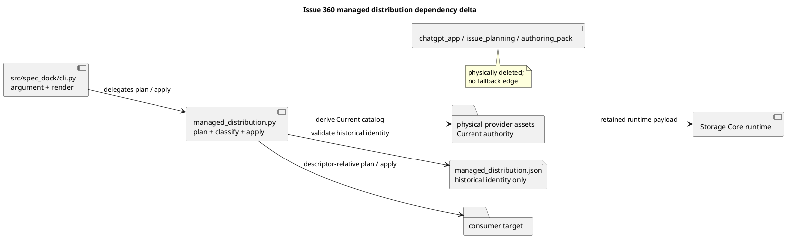

# iss-00360 Cut Over Distribution and Retire Legacy Workflow Surfaces — 設計

## 1. 設計状態と基準

本設計のscopeと受け入れ条件は`requirement.md`を正本とする。

設計時のimplementation baselineは次である。

* Repository: `chemitaro/spec-dock`
* Branch: `iss-00360-cut-over-distribution-and-retire-legacy-workflow-surfaces`
* Issue 359 final head: `948d0cf0dedb84ca34e51a4adc0995820aa011f6`
* Integrated main merge: `a6ded0d9a838b40cdcd741fa473cd264b801f245`
* Issue 359 PR: `#363`、merged。GitHub Issue 359はclosed、Issue 360 dependency checkは`ready=true`

Requirementはfresh review round 3でP0 / P1なしのpassを得た。Epic Planが要求するIC-1 / IC-2は、Issue 357〜359 owner report、merged PR、current main上のfresh testsをEpic main orchestratorが再照合し、Epic-local ArtifactとEpic Reportへ2026-08-13の`pass`を記録した。Issue 359 report自身のIC-2 self-approvalは行っていない。本書は親handoff gateを満たしたDesign review candidateであり、fresh Design review、formal `issue start`、Strict final reviewが完了するまではimplementation handoffを表さない。Formal `issue start`はdependency解消後に再試行したが、未コミットの本Issue文書を保護するcheckout safetyで停止したため、active selectionを継続する。

Gate充足時にIssue 359のexact final head、二skill inventory、report handoffを再照合する。差分が本設計のinterfaceまたはownership decisionを変える場合は、実装前に本書へ戻る。

## 2. 設計判断の要約

1. Current assetの正本は物理的なprovider treeとし、Target file一覧を別manifestへ複製しない。
2. Provider-privateな`managed_distribution.json`は、物理treeから消えるobsolete exact fileと、safe migrationに必要なhistorical identityだけを保持する。
3. `src/spec_dock/managed_distribution.py`を一つの深いmoduleとし、CLIへはplanとapplyの小さなinterfaceだけを公開する。
4. Fresh、update、recognized workspaceへの`init --force`、uninstallは同じclassifierとpath-safety実装を使う。
5. Exact path、workspace marker、consumer-side manifestの自己申告だけではownershipを認めない。Regular fileはprovider-private manifestに登録したknown SHA-256、symlinkはknown type + normalized link targetで判断する。Consumer-side durable manifestを使う場合も、そのmanifest自身のknown historical identityと、provider-privateに固定したtarget path + target identityの両方が一致しなければならない。
6. Ownership不明のcollision / obsolete candidateは保持し、全mutation前にoperationをblockする。
7. `spec-dock/{docs,templates,scripts,system}`はinstaller-owned treeとしてrefresh / uninstallできるが、`initiatives/**`とroot / node Workbench payloadは別のpreserve surfaceとする。
8. Operation全体のatomic rollbackは約束しない。Full preflight、phase marker、idempotent retry、post-verifyによるforward recoveryを契約にする。
9. `.github/workflows/ci.yml`はStorage Coreの決定論的な`sync` / `validate` CIとして維持する。

## 3. Moduleとinterface

### 3.1 Target architecture

```text
installer CLI
  parse / render only
        |
        v
managed_distribution module
  build_distribution_plan(...)
  apply_distribution_plan(...)
        |
        +-- physical provider asset tree
        +-- provider-private historical identity manifest
        +-- local target filesystem
```

`managed_distribution`は、多数のasset、ownership rule、path check、phase recoveryを二つのinterfaceの背後へ隠す深いmoduleとする。これを削除すると同じ分類・安全規則がinit / update / uninstallへ再分散するため、独立moduleとして置く価値がある。

Filesystemはlocal-substitutable dependencyであり、`tmp_path` consumerで実物を検証できる。Production用とtest用の二Adapterが必要なremote seamではないため、filesystem portやrepository classを追加しない。

### 3.2 External interface

概念interfaceは次とする。最終的なPython型名はlocal styleへ合わせても、callerが学ぶsurfaceを増やさない。

```python
def build_distribution_plan(
    *,
    operation: Literal["fresh", "update", "uninstall"],
    target_root: Path,
    assets_root: Path,
    specs_mode: Literal["keep", "remove"] | None = None,
) -> DistributionPlan: ...

def apply_distribution_plan(plan: DistributionPlan) -> DistributionResult: ...
```

Interface contract:

* `build_distribution_plan`はread-onlyで、全pathを`create`、`adopt`、`upgrade`、`refresh-tree`、`prune`、`preserve`、`block`へ分類する。
* 一件でも`block`があればplanはapply不可であり、CLIはwriteを開始しない。
* `apply_distribution_plan`はvalidatedかつapply可能なplanだけを受け付ける。
* Resultはoperation、status、last completed phase、relative action list、retry commandを返す。
* Error / resultへsource content、credential、repository外absolute evidence pathを含めない。

CLI側の`init`、`update`、`uninstall`はargument、workspace admission、text / JSON renderingだけを持つ。Asset inventoryやownership判断をCLI handlerへ複製しない。

### 3.3 Internal model

Plan内部では少なくとも次を区別する。

| Model | 内容 |
|---|---|
| `AssetIdentity` | regular fileのSHA-256、またはsymlinkのnormalized targetとfile type |
| `AssetRule` | relative path、surface、current / obsolete、allowed identity、mutation policy |
| `PathIdentitySnapshot` | root / ancestor / targetのdevice、inode、`ctime_ns`、file type、link count、content / link identity。apply時の再bindに使う |
| `DistributionAction` | operation、path、classification、reason、source identity、expected final identity |
| `DistributionPlan` | schema / package version、全action、blocking reason、phase order |
| `DistributionResult` | status、phase、applied / pending / preserved action、retry guidance |

これらはimplementation detailである。Manifest recordをそのままCLI出力やpublic Python interfaceにしない。

## 4. Asset authority

### 4.1 Current physical authority

Current Targetは次のphysical sourceから導出する。

| Surface | Provider authority | Consumer destination |
|---|---|---|
| Managed scaffold | `src/spec_dock/assets/spec_dock/{docs,templates,scripts,system}/**` | `spec-dock/{docs,templates,scripts,system}/**` |
| Scaffold ignore policy | `src/spec_dock/assets/spec_dock/.gitignore` | `spec-dock/.gitignore` |
| Version marker | installed package version | `spec-dock/spec-dock.version` |
| Repo-local skills | `src/spec_dock/assets/install_root/.agents/skills/{spec-dock,spec-dock-grill-with-docs}/**` | 同じrelative path |
| Storage Core CI | `src/spec_dock/assets/install_root/.github/workflows/ci.yml` | `.github/workflows/ci.yml` |
| Root workbench seed | `src/spec_dock/assets/spec_dock/templates/root/.workbench/README.md` | `spec-dock/.workbench/README.md`（Freshのみ） |
| Shortcut | installer-generated canonical identity | `spec -> spec-dock/scripts/spec-dock` |
| Generated state | Runtime / installer rules | `spec-dock/{active,.agent}/**` |

`install_root`の全通常fileをCurrent external assetとして列挙する既存のphysical discoveryは維持できる。ただし360完了時のphysical treeは二skill treeと`ci.yml`だけでなければならない。`.gitignore`は必須provider assetとし、現行`_DEFAULT_SPEC_DOCK_GITIGNORE` fallbackは削除する。Package内にsourceがなければprovider/package defectとして全mutation前にblockする。Fresh / update / uninstallではmissing、current-identical、known historical、unknownのCurrent reusable fileとして単一planへ含め、bytesとmodeをpost-verifyする。`spec-dock.version`は実行中package versionをCurrent identityとするgenerated managed markerで、recognized updateの最後に確定する。Malformed / unrecognized version markerだけでownershipを推定しない。

### 4.2 Provider-private historical identity manifest

新しいauthorityは`src/spec_dock/assets/managed_distribution.json`とする。これはconsumerへ配置するassetではない。

概念schema:

```json
{
  "schema_version": 1,
  "recognized_workspace_versions": [
    {
      "version": "0.2.3",
      "anchors": [
        {"path": "spec-dock/scripts/spec-dock", "kind": "regular", "sha256": "..."},
        {"path": "spec-dock/.gitignore", "kind": "regular", "sha256": "..."}
      ]
    }
  ],
  "historical_current_identities": [
    {"path": ".github/workflows/ci.yml", "kind": "regular", "sha256": "..."}
  ],
  "trusted_consumer_manifests": [
    {
      "path": ".agents/host-adapters/meta.json",
      "kind": "regular",
      "sha256": "...",
      "claims": [
        {"path": ".codex/agents/spec-manager.toml", "kind": "regular", "sha256": "..."}
      ]
    }
  ],
  "obsolete_exact_files": [
    {
      "path": ".agents/skills/spec-dock-hub/SKILL.md",
      "surface": "legacy-skill",
      "identities": [{"kind": "regular", "sha256": "..."}],
      "on_unknown": "preserve-and-block"
    }
  ],
  "historical_shortcuts": [
    {"path": "spec", "kind": "symlink", "target": "spec-dock/scripts/spec-dock"}
  ]
}
```

Exact field名は実装時に簡素化できるが、次の不変条件を持つ。

* Pathはrepository-relative POSIX exact file pathだけである。
* Absolute path、drive prefix、`..`、backslash、glob、directory entryを拒否する。
* SHA-256は検証済みlowercase hexだけである。
* Current physical pathとobsolete pathの一致または祖先子孫overlapを拒否する。
* 同じpath / identityのduplicateと矛盾policyを拒否する。
* Historical identityは実際の過去provider source、tag、wheel、sdistのいずれかへtraceできる。
* Recognized workspace versionは実際の過去provider / wheel / sdistから再現したexact versionとversion-specific anchor identityだけを列挙し、rangeや推測値を登録しない。
* Traceできないlegacy candidateはdigestを推測せず、identityなしの`preserve-and-block`とする。

Current bytesはphysical sourceから都度計算する。ManifestへCurrent catalogやCurrent digestを二重記録しない。

Consumer-side ownership evidenceのtrust contractは次へ限定する。

1. `spec-dock.version`やworkspace directoryの存在はoperation admissionにだけ使い、個別fileのownership evidenceにしない。
2. Consumer-side manifestのpath、file type、bytesが`trusted_consumer_manifests`のknown historical identityと一致しなければ、その内容をparseしてownership claimに使わない。
3. Manifest自身が一致しても、consumer manifestから任意pathを採用しない。Provider-private recordに同じtarget pathがあり、target file自身もrecordのkind + SHA-256またはnormalized link targetと一致する場合だけownershipを証明する。
4. Direct historical target identityが一致する場合はmanifest欠損でも証明可能とする。Trusted manifestはidentity setの選択を補助するだけで、target mismatchを上書きしない。
5. Current identity、direct historical identity、trusted manifest + target identityの順で評価し、いずれにも一致しない、manifestがinvalid / unknown、claimが競合する場合は`preserve-and-block`とする。
6. 現行`.agents/host-adapters/meta.json`の`owner`、path、workspace markerだけを信頼しない。Known historical manifest bytesとprovider-private target identityの組だけを移行証拠にする。

### 4.3 廃止するauthority

`src/spec_dock/assets/install_root/.agents/host-adapters/meta.json`はTargetから削除する。そこにあるhost adapter、native shim、bootstrap-only、obsolete listの複合責務は廃止し、360で必要なhistorical identityだけを新manifestへ移す。

次もCurrent authorityとして残さない。

* `_MANAGED_SKILL_NAMES`の旧18 skill list
* `_LEGACY_MANAGED_SKILL_NAMES`の旧3 skill list
* required host adapter / native shim validator定数
* bootstrap-only `.codex/config.toml` migration
* host-specific source / delegate contract

## 5. Target / removed inventory

### 5.1 Repo-local Target

Repo-local managed skillは次の二つだけである。

* `.agents/skills/spec-dock/SKILL.md`
* `.agents/skills/spec-dock-grill-with-docs/SKILL.md`
* `.agents/skills/spec-dock-grill-with-docs/agents/openai.yaml`
* `.agents/skills/spec-dock-grill-with-docs/scripts/finalize-artifact.py`

非skill install-root assetは`.github/workflows/ci.yml`だけである。`.codex/**`、`.github/agents/**`、`.agents/host-adapters/**`はTargetに含めない。

### 5.2 Managed scaffold Target

TemplateはRequirement I360-RQ-004、docsはI360-RQ-005のallowlistへ限定する。`scripts`はStorage Core wrapper、Runtime package、Current READMEだけを持ち、`system`はCurrent active-none fallbackとRuntime system dataだけを持つ。

Target allowlistをphysical treeの検証から導出し、test内の別catalogを意味の正本にしない。Test fixtureは期待値としてexact catalogを固定するが、installerの実行時入力にはしない。

### 5.3 Physical removal

357 handoffの次をprovider Runtimeとdogfood projectionから削除する。

* `scripts/spec-dock-chatgpt`
* `scripts/authoring-pack/**`
* `chatgpt_app.py`
* `cli/chatgpt_parser.py`、`cli/chatgpt_registry.py`
* `commands/issue_planning.py`
* `application/issue_planning.py`、`application/issue_planning_prompt.py`
* `domain/issue_planning_candidate.py`、`domain/issue_planning_contracts.py`
* `infra/issue_planning_*.py`
* `presentation/issue_planning.py`
* 各layerの`authoring_pack/**`
* shared `app.py`、`bootstrap.py`、`contracts.py`、`ports.py`のplanning-only symbol / route

Old-only test、fixture、manual helperも削除する。Storage Coreと共有されるtest fileでは旧assertionだけを除き、retained behaviorを残す。

Docs / template / skill / shimのremoved catalogはRequirementのexact listを使う。Historical Issue ArtifactやReportに同じ語が残ることは許容し、Current source / help / navigationと区別する。

### 5.4 File change planとdependency delta

Legendは`[A] Add`、`[M] Modify`、`[D] Delete`、`[R] Read-only verification`とする。Directory rowの`[D]`は列挙したold-only treeだけを指し、consumerでprefix deletionを許可する意味ではない。

```text
src/spec_dock/
├── managed_distribution.py                                      [A]
├── cli.py                                                       [M]
├── assets/
│   ├── managed_distribution.json                               [A]
│   ├── install_root/
│   │   ├── .agents/skills/{spec-dock,spec-dock-grill-with-docs}/** [R]
│   │   ├── .github/workflows/ci.yml                            [R]
│   │   ├── .agents/host-adapters/**                            [D]
│   │   ├── .agents/skills/<old-18-and-legacy-3>/**              [D]
│   │   ├── .codex/**                                           [D]
│   │   └── .github/agents/**                                   [D]
│   └── spec_dock/
│       ├── .gitignore                                          [R]
│       ├── docs/**                                             [M/D]
│       ├── templates/**                                        [M/D]
│       ├── system/**                                           [M]
│       └── scripts/
│           ├── spec-dock                                      [R]
│           ├── spec-dock-chatgpt                              [D]
│           ├── authoring-pack/**                              [D]
│           └── spec_dock_runtime/
│               ├── app.py                                     [M]
│               ├── cli/bootstrap.py                            [M]
│               ├── cli/{chatgpt_parser,chatgpt_registry}.py    [D]
│               ├── commands/issue_planning.py                  [D]
│               ├── application/{contracts,ports}.py            [M]
│               ├── application/{issue_planning,issue_planning_prompt}.py [D]
│               ├── domain/{issue_planning_candidate,issue_planning_contracts}.py [D]
│               ├── infra/issue_planning_*.py                   [D]
│               ├── presentation/issue_planning.py              [D]
│               └── {application,domain,infra,presentation}/authoring_pack/** [D]

spec-dock/                                                       [dogfood projection only]
├── {docs,templates,scripts,system}/**                           [M/D]
├── .gitignore                                                  [R]
├── initiatives/**                                              [R]
├── active/**                                                   [R/generated]
└── .agent/**                                                   [R/generated]

repo-local dogfood tooling
├── .agents/skills/{spec-dock,spec-dock-grill-with-docs}/**     [R]
├── .agents/skills/<old-18-and-legacy-3>/**                      [D]
├── .agents/host-adapters/**                                    [D]
├── .codex/**                                                   [D]
├── .github/agents/**                                           [D]
└── .github/workflows/ci.yml                                    [R]

tests/
├── unit/infra/test_managed_distribution.py                     [A]
├── unit/infra/test_init_update.py                              [M]
├── cli_runtime/test_distribution_cutover.py                    [A]
├── cli_runtime/test_storage_core_cli.py                        [M]
├── cli_runtime/test_chatgpt_cli.py                             [D]
├── {unit,integration}/**/test_issue_planning*.py               [D]
├── unit/authoring_pack/**                                      [D]
├── fixtures/authoring_pack/**                                  [D]
└── manual_tests/test_*authoring_pack*.py                       [D]

README.md                                                       [M]
pyproject.toml                                                  [R]
setup.py                                                        [R]
```

`pyproject.toml`の`assets/**/*`は新manifestとTarget assetsを既に包含するため、S10 / S80でarchive memberを検証し、現物に不足がある場合だけDesign amendment後に変更する。`setup.py`はstale-build contamination guardとしてread-only確認し、removed assetの再混入をtestで防ぐ。

Dependency delta:

- **Title:** Issue 360 managed distribution dependency delta
- **Question answered:** Installerの三operationがどの単一moduleへ委譲し、Current / historical authorityとconsumer mutationをどう分離し、旧planning graphへのedgeを消すか。
- **Scope:** `src/spec_dock/cli.py`、新`managed_distribution`、provider assets / historical manifest、consumer target、retained Storage Core Runtime。
- **Excluded details:** class / function内部のalgorithm、個別test case、dogfoodのgenerated file内容。
- **Update trigger:** Public module interface、authority source、dependency direction、削除対象planning graph、consumer mutation boundaryが変わるとき。



Shared editは`app.py`のlegacy helper、`cli/bootstrap.py`のplanning gateway / callbacks、`application/contracts.py::UseCases.planning_*`、`application/ports.py`のplanning-only views / errors / gatewayだけを除去する。`dispatch`、Storage Coreのbootstrap assembly、generic Artifact port、retained use caseを削除しない。Provider側を先に変更し、dogfood Runtimeはprovider treeから同期して直接別実装しない。

## 6. Ownership classifier

### 6.1 Classification table

| Operation | Target state | Provenance | Classification |
|---|---|---|---|
| Fresh | missing Current | N/A | `create` |
| Fresh | Current-identical | current physical identity | `adopt` |
| Fresh | non-identical Current collision | ownershipを推定しない | `preserve` + `block` |
| Fresh | obsolete-looking path | 調べない | unmanagedとして`preserve` |
| Update / `init --force` | missing Current | recognized workspace | `create` |
| Update / `init --force` | Current-identical | current physical identity | `adopt` |
| Update / `init --force` | historical Current | known historical identity | `upgrade` |
| Update / `init --force` | non-identical Current | ownership不明 | `preserve` + `block` |
| Update / uninstall | obsolete exact path | known historical identity | `prune` |
| Update / uninstall | obsolete exact path | mismatch / identityなし | `preserve` + `block` |
| Any | exact file pathにdirectory | N/A | `block` |
| Any | parent symlink / non-directory | N/A | `block` |
| Any | unknown sibling | N/A | `preserve` |

Freshのobsolete-looking external skillを保持する場合、removed-surface absenceは「SpecDockが配置したasset」とFresh開始時snapshotとの差分へ適用する。利用者所有のpre-existing pathをSpecDock product surfaceと誤分類しない。

### 6.2 File identity

Regular fileはcontent SHA-256とfile typeで照合する。ModeはTarget postconditionとして検証するが、modeだけをownership evidenceにしない。

Symlinkはlink自身を`lstat` / `readlink`し、normalized relative targetとfile typeを照合する。外部targetをfollowしてhashしない。Canonical `spec` shortcut以外のcurrent symlink、identity未登録のobsolete symlink、dangling symlinkはblockする。

Hard linkは通常fileとしてbytesを読めるが、replace / pruneが別名inodeへ影響し得る。`st_nlink > 1`のmutation対象はownershipが証明されてもblockし、operatorへlink解除を要求する。Byte-identical read-only adoptionは許容する。

### 6.3 Apply-time identity再検証

Preflight snapshotだけをmutation authorityにしない。Applyはrepository rootをanchorとして各parent componentをdescriptor-relativeかつno-followで再openし、`PathIdentitySnapshot`のdevice、inode、`ctime_ns`、file typeを照合する。Existing targetはmutation直前にも`lstat` / descriptor identity、link count、content SHA-256またはlink targetを再検証する。Missing targetはheld parent内のprivate staging nameをexclusive createし、canonical destinationへのpublishはsupported no-replace primitiveだけを使う。

Data write前とpublish / replace / prune直前にrootからpathを再bindし、held parentがrepository外へ移動していないことを確認する。差異、symlink化、inode / `ctime_ns`変更、unexpected hard link、destination出現を検出した場合は当該actionとoperationを停止する。Open済みobjectやreplacementを元pathnameからcleanupせず、user replacementを保持し、partial markerとoperator recoveryを返す。

POSIX pathnameのreplace / unlinkに対し、同一UIDの非協調processが最終identity check後の極小windowで意図的にraceすることまで原子的にcompare-and-deleteするportable primitiveは前提にしない。通常の独立SpecDock processとhandled filesystem failureを保証範囲とし、same-UID hostile tampering、SIGKILL、power loss、filesystem corruptionは検知時のfail-closed / forward recovery境界として明記する。Unsupported OS / filesystemで必要なno-follow / no-replace primitiveを実現できないmutationは実行せずblockする。

### 6.4 Directory cleanup

Obsolete file削除後のempty parent cleanupは、manifest pathから導出したbounded root内だけで行う。Unknown childが一件でもあればdirectoryを残す。Recursive delete、glob delete、prefix-only deleteを行わない。

Managed scaffold四treeとgenerated `active` / `.agent`は別契約でrecursive operationを許すが、root自体と全ancestorがreal directoryであることをpreflightする。

## 7. Operation flow

### 7.1 共通preflight

全operationはwrite前に次を完了する。

1. Target rootとoperation admissionを確認する。
2. Physical sourceとhistorical manifestをload / validateする。
3. Current、obsolete、managed scaffold、generated、preserve rootのoverlapを検証する。
4. Target filesystemをno-followでscanし、各exact pathを分類する。
5. 全actionとblockerを確定する。
6. Source catalog、source bytes、executable modeを検証する。
7. Blockerがあればrelative path、理由、operator actionだけを返して終了する。

Current実装のようにskill preflight後、scaffoldを先に書き、その後別planをapplyする順序は廃止する。Installer全surfaceを一つのplanへ含める。

Apply時は§6.3のidentity再検証を各actionで行う。Preflight後のpath snapshot差分はwarn-and-continueせずpartial / blocked resultとし、別actionへ進まない。

### 7.2 Fresh init

Freshは`spec-dock` managed workspaceが存在しない状態とする。

1. Current collisionだけをpreflightする。Obsolete-looking pathをprune候補にしない。
2. Apply開始markerを置く。
3. Managed scaffold、root Workbench seed、Current external asset、shortcutをmaterializeする。
4. `initiatives`、`active`、`.agent`を初期化する。
5. Runtime wrapperだけへexpected executable modeを設定する。
6. Target catalog / bytes / modeをpost-verifyする。
7. `spec-dock.version`を最後に確定し、markerを除去する。

Non-identical Current collisionはwarn-and-continueせず、全write前にblockする。

### 7.3 Existing updateと`init --force`

`update`はvalid `spec-dock.version`またはvalid retry markerを要求する。`init --force`がexisting workspaceを扱う場合も同じrecognized update semanticsを使い、単なる`spec-dock/` directory存在だけでownershipを推定しない。

`spec-dock.version` admission contract:

1. Markerはno-followで取得したlink count 1のregular fileだけを許可する。Symlink、directory、hard link、read errorはblockする。
2. BytesはASCIIのcanonical `MAJOR.MINOR.PATCH\n` exactly one lineだけを許可する。各componentは`0`またはleading zeroなしのdecimalとし、BOM、空白、CRLF、追加行、pre-release、local suffixを許可しない。
3. Parsed versionはprovider-private manifestの`recognized_workspace_versions` exact entryと一致し、そのversion entryが要求する`spec-dock/scripts/spec-dock`と`spec-dock/.gitignore`のversion-specific anchor kind / SHA-256も一致しなければならない。Marker単独ではrecognized workspaceにしない。
4. 実行中package versionも同じcanonical grammarを満たさなければmutationをblockする。Dev fallbackは`pyproject.toml`のcanonical versionを使い、`0.0.0+unknown`では実行しない。
5. Target versionがexecuting versionよりolderまたはequalならupdate / existing `init --force`を許可し、post-verify後にexecuting versionへ更新する。Targetがnewerならdowngradeを許可せずzero-write blockする。Syntactically validでもallowlistにないversionはunknownとしてblockする。
6. Version-specific anchor mismatch / missingは通常admissionをblockする。Valid `.distribution-retry.json`が同じpackage version / operation / target root identityを示すpartial stateだけは§8.1のforward retryとして別途admitし、通常workspaceと誤分類しない。

Command別のadmissionは次とする。

| Marker / workspace state | Fresh `init` | existing `init --force` / `update` | uninstall |
|---|---|---|---|
| workspace absent | Fresh planを許可 | not applicable | block |
| recognized older / equal version + anchors | `--force`なしはexisting error | update semanticsを許可 | dry-run / applyを許可 |
| recognized newer version | existing error | downgradeとしてzero-write block | 古いpackageによるuninstallをzero-write block |
| missing version | existing error | valid same-operation distribution retry以外block | valid legacy uninstall retryだけrerunを許可 |
| malformed / unknown / symlink / hard-link version | existing error | markerを保持してzero-write block | markerを保持してzero-write block |
| valid version、anchor mismatch / missing | existing error | zero-write block | valid uninstall retryがない限りzero-write block |

Uninstallはrecognized older / equal workspaceならversion markerを個別file ownershipとしてではなくoperation admissionだけに使う。各removalは§4.2 / §6のidentity classifierを別途満たす。`--remove-specs`の明示もinvalid workspace admissionを迂回しない。

Root `spec-dock/.workbench/README.md`はFresh seedであり、recognized updateでmissingなら再作成せず、existingならrewriteしない。Updateは`.workbench/**`をpreserve rootとして扱う。`.gitignore`は四managed tree外のCurrent reusable targetとしてmissing / identical / historical / unknownへ分類し、unknown contentはpreserve-and-blockする。Valid version markerは個別asset ownershipではなくworkspace admissionに使い、post-verify後に実行中package versionへ更新する。

Apply phase:

1. `preflight-complete`
2. retry marker作成
3. `managed-scaffold-refresh`
4. `current-external-materialize`
5. `obsolete-prune`
6. generated state / mode整合
7. `post-verify`
8. version marker更新
9. retry marker除去

Managed scaffold refreshは四つのowned rootだけをprovider treeへ同期する。`initiatives/**`、root `.workbench/**`、active source metadataへ到達するpathをplanへ入れない。

### 7.4 Uninstall

Dry-runはplanだけを返す。`--apply`は`--keep-specs`または`--remove-specs`のexactly-oneを要求する。

* Managed scaffold四rootはrecognized workspace内のinstaller-owned treeとして安全なrecursive removal対象にする。
* Current / obsolete external assetは同じidentity classifierを使う。
* Generated `active/**`、`.agent/**`、valid version / retry markerはmanaged generated stateとして扱う。
* Root `spec-dock/.workbench/README.md`はcurrent / known historical identityならremoveできる。Modified、symlink、unknown identityは周辺のunmanaged payloadとともに保持し、blockする。
* `--keep-specs`では`initiatives/**`を一切actionへ入れない。
* `--remove-specs`だけが`initiatives/**`を明示的なrecursive removal対象にする。
* Root / scope Workbench unknown payload、unknown sibling、ownership不明external fileを残す。
* Cleanupは空になったknown boundary directoryだけをbottom-upで除去する。

Uninstallもplan確定前にretry markerを書かない。Apply可能なplanだけがmarkerを最初のmutationとして作成する。

## 8. Partial failureとforward recovery

### 8.1 Marker

`spec-dock/.distribution-retry.json`をinit / update専用のapply markerとして新設する。Uninstallは既存`spec-dock/.uninstall-retry.json`とschema `{schema_version: 1, managed_by: "spec-dock", purpose: "uninstall-rerun"}`を変更せず使用し、新markerへ移行しない。これによりpartially-uninstalled consumerの既存admission contractを維持する。

Markerはcredentialやabsolute pathを含めず、次だけを持つ。

* schema version
* operation
* target package version
* target repository rootのdevice / inode identity
* last completed phase
* retry purpose

Markerはfull preflight後に作成し、phase境界ごとにatomic file replacementで更新する。成功時だけ削除する。

Marker admission:

| State | init / update | uninstall |
|---|---|---|
| valid version、markerなし | normal admission | normal admission |
| valid `.distribution-retry.json`だけ | same package / operationのforward retryだけ許可 | blockし、先にdistribution recoveryを要求 |
| valid `.uninstall-retry.json`だけ | block。Fresh / updateへ誤降格しない | version欠損でもuninstall rerunを許可 |
| 両marker | block。operationを推定しない | block。operator diagnosisを要求 |
| invalid / symlink / unknown marker | markerを保持して全mutation前にblock | markerを保持して全mutation前にblock |

Uninstall markerは全remove actionとpost-verifyの後に最後のmanaged fileとして除去する。`--remove-specs`でもmarkerを先に失わない。Init / update markerはpackage versionとoperationを持ち、別package versionまたは別operationのretryには使わない。

### 8.2 Recovery contract

Operation全体をtransactionまたはrollback可能とは呼ばない。各apply actionをidempotentにし、再実行時はtarget current identityを`adopt`、残存historical identityを`upgrade` / `prune`へ再分類する。

Failure resultは次を区別する。

* `not-started`: preflight block、永続差分なし
* `partial`: markerあり、完了phaseとretry commandを提示
* `post-verify-failed`: apply済みだがTarget不一致、成功と報告しない
* `complete`: post-verify、version更新、marker除去済み

Backward package installで旧workflowを再配置することをrollback手段にしない。Partial cutoverは同じTarget packageでforward recoveryする。

## 9. Preservation

Runtime planはnode-local file内容を読んでownership判定しない。Mutation allowlistがpreserve rootと交差しないことを構造的に検証する。

TestではRequirement I360-RQ-010のfixtureについてbefore / afterを次で比較する。

* relative path
* `lstat` file type
* SHA-256（regular file）またはlink target（symlink）
* executable / permission mode

Existing 358 preservation fixtureを再利用し、profile由来文書、heavy Report、`.assurance.json`、Discussion、ADR、opaque Artifactを追加・欠落なく継承する。

## 10. Provider / dogfood / package / consumer parity

Parityはblanket directory equalityではなくsurface別に定義する。

| Pair | 比較 |
|---|---|
| Provider ↔ dogfood | Target catalog、bytes、executable mode。明示したgenerated exclusionを除く |
| Provider ↔ wheel / sdist | package member catalog、bytes、mode、manifest inclusion |
| Provider ↔ Fresh | SpecDock-created Target destinationのcatalog、bytes、mode |
| Provider ↔ Updated | Managed Target destinationのcatalog、bytes、mode |
| Preserve fixture before ↔ after | path、type、bytes / link target、mode |
| Removed surface scan | provider、dogfood、archive、Fresh、Updatedでabsence |

Package archiveから直接consumerを作り、working checkoutへの偶発的fallbackを許さない。Absolute local path、secret-like file、binary、cache、interaction log、unexpected hidden payloadをarchive member / content scanする。

## 11. Docs cutover

Public入口はrepository root `README.md`とする。Package metadataも同じREADMEを使うため、removed command / skillを残さない。

Installed入口:

* `docs/README.md`
* `docs/guide.md`
* `docs/migration.md`

三者からmigrationへ到達できるようにし、Current command / skill / ownership / recoveryを同じprovider sourceで説明する。

Retained `scripts/README.md`、`system/**/*.md`、`templates/README.md`、Workbench READMEは、Markdown link graphとpath-aware vocabulary scanへ含める。Historical pageまたはnode-local evidenceはscan allowlistで分離し、単純なrepository-wide禁止語scanで過去証跡を改変しない。

## 12. Test design

### 12.1 Module interface

`build_distribution_plan` / `apply_distribution_plan`をtest surfaceとし、init / update / uninstall別のprivate classifierを直接testしない。

* missing / current-identical / historical / unknownのclassification
* Freshでobsolete-looking external pathを無視すること
* Current CI、二skill、shortcutのcollision
* obsolete skill、profile、native shimのproven / modified / unknown
* unsafe path、parent symlink、hard link、exact directory conflict
* current / obsolete / preserve overlap
* block時zero-write

### 12.2 Consumer matrix

`tmp_path`上の実filesystemで次を検証する。

* Fresh empty
* Fresh unrelated files
* Fresh obsolete同名external skill
* Fresh non-identical Current CI collision
* update unmodified historical
* update modified / ownership unknown
* update mixed / partially-applied
* update preservation fixture
* recognized workspaceへの`init --force`がupdateと同じplan / resultになること
* `spec-dock/` directoryだけがあるunrecognized targetへの`init --force`がFreshへ誤降格せずzero-write blockすること
* valid distribution retry markerで同じoperationだけをforward retryし、uninstall marker / invalid marker / 両markerをblockすること
* uninstall dry-run / keep / remove
* uninstall current / legacy / mixed / partial
* failure injection後のretry
* repeated operation convergence

Fault injectionはmoduleのpublic apply結果を観測し、productionへtest-only portを公開しない。Private phase seamをmonkeypatchして各phase後のfailureを発生させる。

### 12.3 Retained and removed behavior

* Storage Core parser / registry / lifecycle / Artifact / import testsを維持する。
* `test_storage_core_cli.py`の「planning backendは360までretained」という暫定expectationをremovedへ更新する。
* Old-only authoring-pack / issue-planning testとfixtureを削除する。
* Shared test fileではretained assertionを残す。
* Import closure、CLI help、wrapper、docs link、package memberのnegative scanを追加する。

### 12.4 Installed smoke

Wheelとsdist由来consumerで、Requirement I360-RQ-015の357〜359 representative flowを実行する。GitHub mutationはstub / fake boundaryを使い、live repositoryへ書かない。

## 13. Security、privacy、operability

### Security

* No-follow traversal、exact path、hard-link mutation blockでrepository外write / deleteを防ぐ。
* Manifest pathとdigestをuntrusted package dataとしてvalidateする。
* User-owned collisionをownership未証明のまま置換しない。

### Privacy

* Diagnosticへfile content、secret、absolute evidence pathを出さない。
* Package scanでcredential / interaction log / local path混入を拒否する。

### Operability

* Dry-run action listとJSON resultを維持する。
* Partial resultはlast phaseとretry commandを返す。
* Deterministic Storage Core CIを残し、Fresh consumerでも`sync` / `validate`を再現できる。

Security / privacy incident、repository外mutation、不可逆なpreserve data lossが見つかった場合はPlanning Levelを`critical`へ上げ、実装を停止する。

## 14. 選ばなかった案

### 14.1 Exact pathだけで旧assetを削除

同名external skillや利用者が再利用したGitHub / Codex fileを区別できず、data lossになるため採用しない。

### 14.2 Current catalogをJSONへ全複製

Physical provider treeとmanifestの二重正本になり、追加・削除時にdriftするため採用しない。Manifestは物理treeから失われるhistorical identityだけを持つ。

### 14.3 Consumer CIを全撤去

現行`ci.yml`はcognitive PR workflowではなくStorage Coreの決定論的検証である。親Epicのremoved contractから撤去を導けないため維持する。

### 14.4 Filesystem portを公開

Local filesystemは`tmp_path`で代替でき、production / testの二Adapterを必要としない。Shallowな抽象化になるため追加しない。

### 14.5 全operationのatomic rollback

複数directory、file mode、symlinkを跨ぐportable transactionを新設するとscopeとfailure surfaceが増える。Full preflightとforward retryで回復可能にし、atomicityを主張しない。

## 15. Requirement / acceptance trace

| Requirement | Design section |
|---|---|
| I360-RQ-001 | §1 |
| I360-RQ-002〜006 | §4、§5、§11 |
| I360-RQ-007〜009 | §6、§7 |
| I360-RQ-010〜011 | §7.4、§9 |
| I360-RQ-012〜013 | §6、§8、§13 |
| I360-RQ-014〜015 | §10、§12 |
| I360-RQ-016 | §11 |

| Acceptance | Design / verification |
|---|---|
| I360-AC-001 | §4.1、§5.1、§10、Fresh catalog test |
| I360-AC-002 | §5.3〜5.4、§12.3、removed import / help scan |
| I360-AC-003 | §5.2、§10、template catalog / archive scan |
| I360-AC-004 | §11、docs link / Current vocabulary scan |
| I360-AC-005 | §5.1、§6、skill / adapter absence scan |
| I360-AC-006 | §6.1、§7.2、§12.2、Fresh matrix |
| I360-AC-007 | §6.1、§7.3、legacy update matrix |
| I360-AC-008 | §9、preservation hash matrix |
| I360-AC-009 | §4.2、§6、unknown / modified negative matrix |
| I360-AC-010 | §4.2、§6.1、classifier positive / negative unit test |
| I360-AC-010A | §4.1、§6.1、Current reusable collision matrix |
| I360-AC-011 | §4.2、§6.2〜6.4、manifest / path race tests |
| I360-AC-012 | §4.2、§6.1、block時snapshot / zero-write test |
| I360-AC-013 | §7.4、§8、uninstall state / marker matrix |
| I360-AC-014 | §7.4、§9、keep / remove preservation matrix |
| I360-AC-015 | §6.3、§8、phase fault injection / retry convergence |
| I360-AC-016 | §10、provider / dogfood / archive / consumer parity |
| I360-AC-017 | §10、archive prohibited-content scan |
| I360-AC-018 | §12.4、installed 357〜359 smoke |
| I360-AC-019 | §11、root / installed migration link and help comparison |
| I360-AC-020 | §11、retained Markdown path-aware scan |
| I360-AC-021 | §1、Epic IC Artifacts / report、formal start evidence |
| I360-AC-022 | §8、§10〜13、Issue report / IC-3 input review |

Implementation Planは、gate再確認、historical identity lock、RED test、deep module、physical cutover、consumer migration、package / parity、docs、full verification、IC-3 handoffの順へ分解する。
