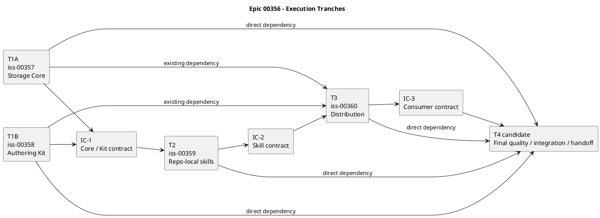

# epic-00356 SpecDock Core Simplification and External Intelligence Boundary — Vertical Slice計画

## 1. 計画方針

Existing Issue ID、GitHub linkage、history、dependency edgeを維持しつつ、各Issueをend-to-end vertical sliceとして再定義する。Issue draftはplanning evidenceであり、各Issueの正本化と実装開始判断は後続のIssue planningで行う。

Runtimeの`ready`はdependency-onlyのまま維持する。本計画のplanning handoffは文書上の契約であり、Runtime state、gate、metadataではない。

## 2. Tranche

| Tranche | Work item | Goal | Parallelism | Exit evidence |
|---|---|---|---|---|
| T0 — Contract preparation | Epic / Issue candidate review | 採用済み判断、vertical slice、ownership、dependencyを固定する | docs-only | EAL、source identity、shared-file map、phase review |
| T1 — Parallel foundation | `iss-00357` + `iss-00358` | Storage Core user flowとAuthoring Kit user flowを個別に成立させる | 並行可 | targeted test、removal / asset inventory、IC-1 input |
| IC-1 — Core / Kit | 357 + 358 integration | scaffold、Artifact catalog、Report contract、help / docs wordingを一致させる | joint | contract matrix、provider / dogfood fixture、conflict resolution |
| T2 — Skill integration | `iss-00359` | 二つのrepo-local skillからCore / Kitをend-to-end利用できるようにする | T1後 | skill test、no-write negative、legacy handoff inventory |
| IC-2 — Skill checkpoint | 359 integration | installable skill setとdocs pointerを固定する | joint | skill catalog、guide link、absence matrix |
| T3 — Distribution | `iss-00360` | Fresh / update / uninstallをTarget distributionへ切り替える | T2後 | consumer matrix、migration / rollback evidence、IC-3 input |
| IC-3 — Consumer | 360 integration | provider / dogfood / installed contractとhistorical preservationを確認する | joint | fresh / existing / uninstall report、parity / preservation hash |
| T4 — Proposed final | 品質・統合・handoff Issue候補 | 全sliceの最終品質、統合、defect-only repair、deliverable handoff evidenceを閉じる | 357〜360後 | full suite、cross-slice smoke、diff audit、handoff package |

T4は人間がIssue node作成を承認した場合にだけ実施する。

## 3. Dependency graph

Existing direct edgeを維持する。

| Work item | Direct dependencies | 理由 |
|---|---|---|
| `iss-00357` | none | Runtime mechanismを独立に定義・実装できる |
| `iss-00358` | none | Authoring semantics / assetを独立に定義・実装できる |
| `iss-00359` | `iss-00357`, `iss-00358` | Stable Core commandとKit guide / template contractの両方を消費する |
| `iss-00360` | `iss-00357`, `iss-00358`, `iss-00359` | Runtime、asset、skillの完成inventoryをpackage cutoverする |
| 最終Issue候補 | `iss-00357`, `iss-00358`, `iss-00359`, `iss-00360` | 全implementation sliceの統合結果を独立に検証する |

`iss-00357`と`iss-00358`は並行workstreamとする。dependency edgeがないことをshared-file conflictがないことと混同せず、IC-1で共有契約を統合する。

- **Question answered:** 並行可能なslice、統合checkpoint、後続dependencyは何か。
- **Scope:** Issue 357〜360と人間承認待ちの最終Issue候補。
- **Excluded details:** branch名、commit ID、Issue内の細かなtask順序。
- **Update trigger:** dependency、tranche、checkpoint、最終Issue採否が変わるとき。

## 4. Sliceごとのend-to-end demonstration

### 4.1 `iss-00357` — Storage Core user flow

1. Assurance / Profileなしでfresh fixtureを作成する。
2. blocked Issueを`active set`で選択できることを示す。
3. `issue start`がunfinished guardとdependencyを評価し、`--force`がdependencyを迂回しないことを示す。
4. Artifact type omitted、explicit `blank`、typed 5種、generic file importを実行する。
5. `issue finish`がGitHub close、active clear、post-syncを順番に行い、Report / Review / EALを読まないことを示す。
6. Historical `.assurance.json`、draft / repair Artifact、heavy Reportがあっても旧workflow gateを再開しないことを示す。
7. Removed commandがhelp / parser / registryに存在しないことを示す。

主所有はRuntime mechanism、CLI、test、historical compatibilityである。Template proseは358へ渡す。

### 4.2 `iss-00358` — Authoring Kit user flow

1. Initiative / Epic / Issue templateからsingle R/D/P + thin Reportを生成する。
2. Common Guideとscope-specific guidanceでR/D/P responsibilityを理解できることを示す。
3. Issue `plan.md`が一つで、`docs/authoring/issue-plan.md`から選択したCompletion Guideを参照できることを示す。
4. Current 6 Artifact typeの用途と正本反映先を明確にする。
5. Current navigationが旧workflow、phase promotion、Profile、EAL、change-set statusを標準経路として案内しないことを確認する。
6. Provider / dogfood parity、link、catalog、Current禁止語彙testを通す。
7. Existing node-local documentのbytesが変更されないことを確認する。

主所有はtemplate / guide content、navigation、Artifact wording、existing-doc preservationである。parser / registryは編集しない。

### 4.3 `iss-00359` — Repo-local skill user flow

1. `spec-dock` skillがcurrent scope、正本文書、Artifact、dependency、CLI helpを案内する。
2. Agentがdeterministic CLIで構造操作を行い、planning / review gateを偽装しない。
3. Explicit `spec-dock-grill-with-docs`がlocal contextを読み、evidence Artifactを正確に1件残す。
4. SkillがR/D/Pを自動変更しない。
5. External capability unavailable時はno-writeと明示的なnext actionになる。
6. 旧managed workflow skill contractを新skillから参照しない。
7. skill behavior testとdocs link testを通す。

### 4.4 `iss-00360` — Distribution migration user flow

1. Fresh initがTarget assetだけを配布する。
2. Existing updateがobsolete managed assetをpruneし、node-local spec / evidence / historical dataを保持する。
3. Uninstallがmanaged boundary内を除去し、user-owned specを削除しない。
4. provider / dogfood / installed consumerのTarget inventoryを一致させる。
5. interrupted update / pruneを診断でき、再実行できることを示す。
6. migration guide、release impact、removed command guidanceをCurrent docsと一致させる。
7. 357〜359のintegrated smokeをpackage consumerで実行する。

### 4.5 Proposed final — Quality / integration / handoff

1. 357〜360のintegrated branch / candidateを一つのsource identityで固定する。
2. Full test suite、static check、package build、fresh / update / uninstall matrix、cross-slice smokeを実行する。
3. Removed surface absenceとhistorical preservationを独立に再確認する。
4. Failureがあればfeature scopeを増やさず、defectだけを修正する。
5. Diff、generated change、docs、migration note、commit boundaryをauditする。
6. deliverable handoffに必要なevidenceを組み立てる。

この候補は自らIssue作成、提出、merge、Issue close、Epic完了を決定しない。

## 5. Issue planning handoff契約

各Issueのimplementation handoff候補に必要な文書上の条件を次とする。Runtime `ready`とは無関係である。

- Requirement / Design / Planがplaceholderでなく、Issue-specific contentを持つ。
- source identity、existing ID、GitHub linkage、dependency edgeが一致する。
- 採用済み判断を未決化・逆転していない。
- End-to-end user-observable outcomeとnegative outcomeを明示する。
- code、test、docs、migration or compatibilityを同じIssue scopeに含める。
- owner / non-owner surfaceとshared-file protocolを明示する。
- acceptance、failure、rollback / recovery、historical preservationをtestableにする。
- unresolved human decisionがある場合、blocking / non-blockingと判断者を明示する。
- Issue completionをReport / EAL / reviewer gateに依存させない。
- Planning Levelはdocs-only recommendationと理由を`plan.md`へ書き、Runtime stateにしない。
- implementation file inventoryをexact branch上で再確認する。
- Strict bundleのdraftだけでhandoff条件を満たしたと判定しない。

### 5.1 Issue-local draft path index

次のファイルはChatGPT-use-strict packからbyte-exact copyしたplanning evidenceであり、各Issue planningが正本R/D/Pへ採否を判断する入力である。`draft-design`のCurrent runtime作成が旧Assurance contractを要求したため、Assurance / Profileを変更せずscope-local Artifactへ直接保存した。12ファイルはsourceとの`cmp`一致とSHA-256を確認済みである。

| Issue | Draft requirement | Draft design | Draft plan | Handoff state |
|---|---|---|---|---|
| `iss-00357` | `artifacts/20260809t125145z-draft-requirement-strict-vertical-slice-requirement.md` | `artifacts/20260809t125146z-draft-design-strict-vertical-slice-design.md` | `artifacts/20260809t125147z-draft-plan-strict-vertical-slice-plan.md` | evidence copied; Issue planning review required |
| `iss-00358` | `artifacts/20260809t125148z-draft-requirement-strict-vertical-slice-requirement.md` | `artifacts/20260809t125149z-draft-design-strict-vertical-slice-design.md` | `artifacts/20260809t125150z-draft-plan-strict-vertical-slice-plan.md` | evidence copied; Issue planning review required |
| `iss-00359` | `artifacts/20260809t125151z-draft-requirement-strict-vertical-slice-requirement.md` | `artifacts/20260809t125152z-draft-design-strict-vertical-slice-design.md` | `artifacts/20260809t125153z-draft-plan-strict-vertical-slice-plan.md` | evidence copied; 357 / 358 and IC-1 handoff required |
| `iss-00360` | `artifacts/20260809t125154z-draft-requirement-strict-vertical-slice-requirement.md` | `artifacts/20260809t125155z-draft-design-strict-vertical-slice-design.md` | `artifacts/20260809t125156z-draft-plan-strict-vertical-slice-plan.md` | evidence copied; 357〜359 and IC-2 handoff required |

各pathは該当Issue directoryを基準とする。最終Issue候補はnodeが存在せず、人間承認前なのでIssue-local Artifactを作成しない。候補R/D/PはEpic-local validated pack内に保持する。

## 6. Integration checkpoint

### IC-0 — Candidate review

確認対象:

- exact source identity
- EAL / adoption map
- vertical slice index
- responsibility boundary
- Issue draft
- 最終Issue候補

ID / linkage保持、採用済み判断の後退がないこと、authority自己主張がないこと、隠れたhorizontal Issueがないこと、最終候補が4 Issueすべてに依存することを確認する。

### IC-1 — Core / Kit contract

次の共有契約だけを固定する。

- Fresh node fileは一つのR/D/P + thin Report
- Report path / minimal heading / empty-valid semantics
- Current 6 Artifact typeとexact spelling
- Historical recognition policy
- optional positional Artifact typeとblank filename rule
- Authoring docs path
- RuntimeがPlanning Levelを知らないこと
- provider / dogfood fixture shape

共有workflow state machineを再導入しない。

### IC-2 — Skills contract

- managed skill名とentry file
- `spec-dock`のinput / output / no-go behavior
- `spec-dock-grill-with-docs`のexplicit invocation、evidence 1件、正本非変更
- guide pathとCLI help reference
- missing external capability behavior
- 旧skill removalの360へのhandoff

### IC-3 — Distribution contract

- fresh installed inventory
- update prune inventory
- preserve inventory
- uninstall boundary
- provider / dogfood / installed parity definition
- migration / recovery message
- integrated smoke entrypoint

### IC-4 — Final exit review

全implementation Issue後、かつ人間が最終Issueを承認した場合だけ行う。

- exact integrated source identity
- required suiteとconsumer matrix
- unresolved defect list
- docs / migration / changelog consistency
- generated / managed asset diff audit
- coherent change-set assemblyとindependent review evidence
- evidenceなしの成功自己主張がないこと

### 6.1 Checkpoint実行契約

ICはIssue nodeでもRuntime gateでもない。Epic orchestratorが文書上のhandoffを管理するための統合確認であり、dependency `ready`や`issue start`の意味を変更しない。

| IC | Owner | Entry | Verification | Evidence destination | Pass transition | Fail transition |
|---|---|---|---|---|---|---|
| IC-0 | Epic main orchestrator | Strict pack reviewとcandidate validationが完了 | source identity、ID / linkage、EAL、slice / ownership、authority boundary | Epic `report.md` EAL / Spec Authoring Gate、repo-local staged evidence | Epic R/D/Pのphase reviewへ進む | 正本化を止め、Strict evidenceまたは正本を修正する |
| IC-1 | Epic main orchestrator。357 / 358 ownerが入力を提供 | 357 / 358のIssue planningと実装handoff evidenceが揃う | Fresh node、Report、Artifact catalog、optional type、guide path、provider / dogfood fixture | Epic-local `disc` Artifact `ic-1-core-kit-contract`とEpic `report.md` | 359 ownerへ文書上のhandoffを承認する | 359のplanning / implementation handoffを止め、357 / 358のownerへ戻す |
| IC-2 | 359 owner + Epic main orchestrator | 359のskill behavior / catalog / absence evidenceが揃う | 2 skill contract、guide link、missing capability、legacy removal inventory | Epic-local `disc` Artifact `ic-2-skill-contract`とEpic `report.md` | 360 ownerへ文書上のhandoffを承認する | 360のplanning / implementation handoffを止め、359へ戻す |
| IC-3 | 360 owner + Epic main orchestrator | fresh / update / uninstall consumer evidenceが揃う | install / prune / preserve / uninstall / parity / recovery | Epic-local `disc` Artifact `ic-3-consumer-contract`とEpic `report.md` | 人間承認済み最終IssueまたはEpic closure reviewへ進む | 最終handoffを止め、360または原因sliceへ戻す |
| IC-4 | 人間が作成を承認した最終Issueのowner + Epic main orchestrator | 357〜360のexact integrated source identityが揃う | full suite、consumer matrix、diff、docs、residual defect、independent review | Final Issue `report.md`、必要なscope-local Artifact、Epic `report.md` | 人間へdeliverable handoffを提示する | 提出・merge・close判断を止め、defect ownerへ戻す |

IC failureはRuntime metadataを変更せず、Evidence destinationへblocking理由、owner、再開条件を記録する。

## 7. Test strategy

| Test family | 357 | 358 | 359 | 360 | Final候補 |
|---|---:|---:|---:|---:|---:|
| Unit / domain | primary | targeted | targeted | targeted | rerun |
| CLI parser / registry | primary | absence scan | consumes | installed smoke | rerun |
| lifecycle failure | primary | no-gate invariant | consumes | installed smoke | rerun |
| artifact safety / import | primary | semantic catalog | consumes | installed smoke | rerun |
| template / link / vocabulary | contract fixture | primary | pointer | packaged parity | rerun |
| skill behavior | no | no | primary | installed smoke | rerun |
| fresh / update / uninstall | fixture only | preservation fixture | skill inventory | primary | primary rerun |
| historical compatibility | Runtime primary | docs primary | non-regression | consumer primary | cross-check |
| full regression / build | affected suite | affected suite | affected suite | broad suite | primary |
| diff / change-set audit | no | no | no | handoff | primary |

各Issueは狭いtestから始める。通常laneは`uv run pytest`、full regressionは明示的に`uv run pytest --run-full-regression`を使う。`-m full_regression`だけを実行許可として使用しない。

## 8. 要件・受け入れ条件のクロージャ対応

### 8.1 E-RQ対応

| Requirement | Primary owner | Design / plan contract | Verification | Completion evidence |
|---|---|---|---|---|
| E-RQ-001 Runtime workflow / Profile / Assurance撤去 | 357、359、360 | Design §5、§7、Plan 4.1 / 4.3 / 4.4、IC-2 / IC-3 | parser / registry / module / docs / managed asset absence | 各Issue targeted result + IC-2 / IC-3 Artifact |
| E-RQ-002 Planning Level docs-only | 358、359、360 | Design §6.4、Plan 4.2、IC-1 / IC-2 | Runtime / metadata absence、Guide link / behavior | 358 artifact / docs test、IC-1 / IC-2 Artifact |
| E-RQ-003 Thin `issue finish` | 357、360 | Design §4.3 / §9、Plan 4.1 / 4.4 | close / clear / sync positive・partial-failure matrix、EAL非参照 | 357 result、360 installed smoke、Final rerun |
| E-RQ-004 active / readiness限定 | 357、360 | Design §4.1 / §4.2、Plan 4.1 | blocked selection、dependency-only start、`--force` negative | 357 result、360 consumer smoke |
| E-RQ-005 Artifact interface単純化 | 357、358、360 | Design §6.2、Plan 4.1 / 4.2、IC-1 | omitted / explicit blank / 5 typed、historical recognition | 357 behavior result、358 catalog、IC-1 Artifact |
| E-RQ-006 Import file only | 357、360 | Design §6.2、Plan 4.1 / 4.4 | generic one-file import、provider route absence | 357 result、360 installed smoke |
| E-RQ-007 Thin Report | 357、358、360 | Design §6.3、Plan 4.1 / 4.2、IC-1 | fresh scaffold、empty-valid、existing bytes保持、gate非参照 | 357 mechanism、358 content、IC-1 / IC-3 Artifact |
| E-RQ-008 repair / draft Current撤去 | 357、358、359、360 | Design §6.2 / §7、Plan各slice | Current creation / navigation / managed skill absence、Historical保持 | 各Issue result、IC-3 Artifact |
| E-RQ-009 durable decision置き場 | 358、359 | Design §6.1、Plan §5 | Guide / skillがR/D/P・accepted ADRへ案内し、Artifact / Reportをauthorityにしない | 358 docs result、359 skill result、IC-2 Artifact |

### 8.2 E-AC対応

| Acceptance criterion | Primary owner | Verification / closure | Completion evidence |
|---|---|---|---|
| E-AC-001 Removed surface | 357、359、360 | Runtime / docs / skill / installed inventoryのabsenceとalias negative | 357 / 359 / 360 result、IC-2 / IC-3 |
| E-AC-002 Thin lifecycle | 357、360 | active / start / finish orderingとfailure matrix | 357 result、360 smoke、Final rerun |
| E-AC-003 Artifact contract | 357、358、360 | Current 6種、Historical recognition、generic import | 357 behavior、358 catalog、IC-1 / IC-3 |
| E-AC-004 Fresh authoring contract | 357、358、360 | single R/D/P + thin Report、empty-valid、existing preservation | 357 mechanism、358 asset、IC-1 / IC-3 |
| E-AC-005 Planning Level | 358、359、360 | Base + 4 Guide、Runtime / metadata absence | 358 docs test、359 pointers、360 parity |
| E-AC-006 Skill boundary | 359、360 | 2 skill、no canonical auto-write、no provider-owned invocation、missing capability | 359 result、IC-2、360 installed smoke |
| E-AC-007 Consumer migration | 360 | fresh / update / uninstall、managed prune、user data保持、partial recovery | 360 consumer matrix、IC-3 |
| E-AC-008 Parity / negative verification | 358、359、360 | provider / dogfood / installed parity、link、語彙、removed absence | 各Issue test、IC-3、Final rerun |
| E-AC-009 Vertical slice completion | 357〜360 | 各Issueのcode / test / docs / compatibility handoffとIC契約 | 各Issue report / artifacts、IC-1〜IC-3 |
| E-AC-010 Final integration | 人間承認後の最終Issue | 4 direct dependency、full regression、cross-slice smoke、defect-only repair、diff / handoff | Final Issue report / artifacts、IC-4、Epic report |

Epic closure時、上表の各行を`report.md`のE-AC達成状況へ反映する。T4が不採用の場合、E-AC-010を満たさないままEpic完了とせず、Product OwnerがRequirementを変更する必要がある。

## 9. Rolloutとdocs impact

### 9.1 Rollout順序

1. 357と358を並行実装し、IC-1で契約を統合する。
2. Stable Core / Kitに対して359を統合する。
3. 360でdistributionをcutoverする。
4. 人間が承認した場合、最終品質・統合・handoff sliceを実行する。
5. その証拠を人間へ渡し、release / submission / merge判断は外部で行う。

### 9.2 置換・再案内するdocs

- Current docs entrypointをworkflow / phase promotion / ChatGPT planning packからStorage Core + Authoring Kitへ変更
- CLI referenceからassurance / authoring / guidance / workflow / delegated-authoring / provider固有importを除去
- Authoring overviewとR/D/P/Report guide
- Planning Level Completion Guide
- Artifact Current / Historical catalog
- Issue lifecycle reference
- migration / compatibility guide
- skill entrypoint guide
- update / uninstall recovery

Historical docsはexisting repositoryにevidenceとして残せるが、Current contractとしてlinkしない。

### 9.3 Release communication

- 撤去した機能
- 保持するCore commandと意味
- 新しいArtifact syntax
- Planning Levelがdocs-onlyであること
- Reportが常設、optional-content、non-gatingであること
- 既存evidenceを保持すること
- update / uninstall ownership boundary
- External Intelligenceがoperator-ownedで交換可能であること

## 10. Rollback / recovery

| Stage | Rollback / recovery |
|---|---|
| 357 Runtime | provider Runtime changeをrevertし、user dataを保持する。format migrationがないことをtargeted fixtureで確認する |
| 358 assets | managed template / docs sourceをrevertし、existing node-local docsを上書きしない |
| 359 skills | 360 cutover前だけ旧provider skill inventoryを復元可能とし、正本文書を変換しない |
| 360 distribution | ambiguous delete前に停止し、package asset inventoryを復元し、partial updateのdiagnosticで再実行する |
| Final候補 | defect-only integration commitを個別にrevertし、feature scopeを黙って再開しない |

各stageは対応testを実行せずにrollback安全性を主張しない。rollbackできない場合はforward recoveryだけであることを明記する。

## 11. Final exit契約

次は最終Issue候補に必要なevidenceであり、現時点で達成済みではない。

- 4 implementation Issueをexact reviewed commitで統合している。
- Full test suite、required static / package checkの結果を記録している。
- Fresh install、existing update、uninstall、provider / dogfood / installed parity matrixを完了している。
- Historical fixtureがnode ID、GitHub linkage、R/D/P/Report、Artifact、Discussion、ADR、`.assurance.json`の保持を証明する。
- Removed parser / registry / module / docs / skill / template surfaceがfallbackなしで不在である。
- Thin lifecycleとArtifact semanticsのpositive / negative testが通る。
- Planning LevelがRuntime / metadataに実装されていない。
- External capability不在でもCoreが動き、正本へ自動書込みしない。
- Docs、migration、CLI help、skill guidance、release impactが一致する。
- Residual riskとdeferred non-blockerが明示される。
- Diff auditでaccidental generated file、機密、対話ログ、local absolute path、意図しないbinary / hidden managed payloadがない。
- Change-setのscopeとcommit historyが一貫し、independent review evidenceがある。
- 正本昇格、提出、merge、Issue close、Epic完了のauthorityは人間に残る。

## 12. 人間アクション

- 本計画のvertical-slice remapを確認する。
- 品質・統合・handoff用の最終Issueを作成するか判断する。
- 承認する場合はnumeric ID / GitHub linkageを割り当て、357〜360すべてへのdirect dependencyを登録する。
- 各Issue planningでexact file inventory、shared-file ownership、docs-only Planning Levelを確定する。
