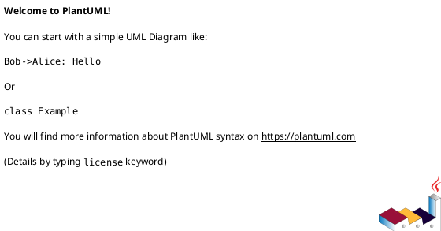

# epic-local-00001 Centralize scoped placeholder rules via symlinks — 設計（HOW）

## 全体像
- target boundary:
  - scope child directory placeholder の source-of-truth と materialization contract
- impacted area:
  - provider-side docs/templates
  - installer asset sync
  - runtime node creation scaffolding
  - docs 参照導線
- existing relation:
  - 現状は `initiative/epics/new-epic` と `epic/issues/new-issue` が空ディレクトリ保持と create entrypoint を兼ねており、`discussions/rules.md` は scope ごとに実体コピーされる。
  - 変更後は `docs/rules/` 側の中央管理 rules 実体を source-of-truth とし、新規 node では `rules.md` symlink のみを置く。

### UML（推奨: module / context）

## 契約
### Data boundary
- SoR:
  - `spec-dock/docs/rules/<scope-kind>/<child-kind>.md` 配下の中央管理 rules markdown
- consistency model:
  - provider assets の中央実体を installer が consumer repo に配布し、runtime は node 作成時に `docs/rules/` を指す相対 symlink を明示生成する。
- reference map:
  - `docs/rules/initiative/epics.md`:
    - `workflow_epic.md`
    - `reference_naming.md`
  - `docs/rules/epic/issues.md`:
    - `workflow_issue.md`
    - `reference_github.md`
    - `reference_naming.md`
  - `docs/rules/{initiative,epic,issue}/discussions.md`:
    - discussion command 導線 docs
    - `phase_requirement.md`
    - `phase_design.md`
    - `reference_naming.md`

## データモデル
- model / table changes:
  - 永続データモデル変更なし。
- invariants:
  - `epics/`, `issues/`, `discussions/` の `rules.md` は repo 内相対 symlink である。
  - symlink target は managed `docs/rules/` 配下の rules 実体を指す。
  - wrapper script は新規 scaffold に含まれない。

### UML（任意: data model）

## 主要フロー
- Flow-A:
  1. installer が provider-side assets を consumer repo に同期する。
  2. `docs/rules/` 配下に中央管理 rules 実体が展開される。
  3. runtime は新規 node 作成時に child directory と `rules.md` symlink を生成する。
- Flow-B:
  1. `new initiative` / `new epic` / `new issue` が template tree を展開する。
  2. create flow が `discussions/rules.md` と `epics|issues/rules.md` を相対 symlink として作成する。
  3. `new doc` は `discussions/` 配下の markdown 採番だけを見て従来どおり動作する。

### UML（任意: sequence / flow）

## 失敗設計
- failure mode:
  - docs 原本の配置先が docs 体系と噛み合わず discoverability を損ねる。
  - runtime create flow が symlink を生成できず、欠損または実体ファイルを作る。
  - preflight collision が symlink を見落とす。
- retry:
  - `spec-dock update` / runtime `new` を再実行可能にするが、symlink 生成失敗時は fail-closed のままにする。
- idempotency:
  - 既存 target がある場合は従来どおり作成失敗とする。
- partial failure:
  - create lock と partial write handling を維持し、symlink 作成失敗時も中途半端な create を残しにくくする。

## 移行戦略
- migration strategy:
  - provider-side assets の `docs/rules/` に中央管理 rules 実体を追加する。
  - wrapper を templates から除去し、runtime create flow に child-directory symlink 作成を追加する。
  - 既存 checked-in scope tree は移行対象にしない。
- dual write/read if needed:
  - なし。placeholder contract は一度に切り替える。
- rollback:
  - symlink-aware 変更を戻せば、実体ファイルコピーに復帰可能。

## 観測性 / セキュリティ
- observability:
  - tests と `find ... -type l` で symlink contract を観測する。
- role / auth:
  - なし。
- audit / pii:
  - なし。

## テスト戦略
- Unit:
  - create flow の symlink helper が相対 target を正しく解決すること。
  - create plan / collision 判定が `rules.md` を含めて正しく扱うこと。
- Integration:
  - `init/update` 後の scaffold に `docs/rules/` 原本が揃うこと。
  - `new initiative` `new epic` `new issue` 後の child directories が `rules.md` symlink を持つこと。
- E2E:
  - 新規生成 node で `new doc` や active flow に退行がないこと。
- E-AC mapping:
  - E-AC-001 -> installer / update tests
  - E-AC-002 -> runtime new tests
  - E-AC-003 -> new doc / validate regression tests

## 関連 ADR
- なし:
  - issue スコープで完結する additive hardening として扱う。

## 未確定事項
- なし:
  - `docs/rules/` は最小記述、詳細規約は既存 workflow / naming docs 参照で確定する。
