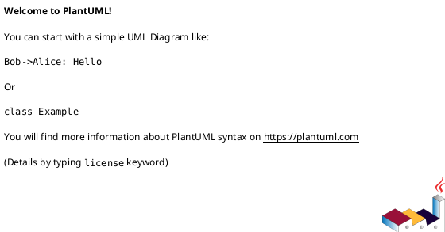

# iss-00031 Replace Wrapper Scripts With Symlink Rules — 設計（HOW）

## 目的・制約
- 目的:
  - scaffold placeholder を wrapper/copy 依存から中央管理 symlink 依存へ置き換える。
- MUST / MUST NOT:
  - MUST: provider docs/assets / installer / runtime / tests を一貫して更新する。
  - MUST NOT: node 配下で rules 実体を複製しない。
- 非交渉制約:
  - lower-case path 維持、既存 discussion/new flow 非退行。
- 前提:
  - symlink を扱える runtime/installer 実装に変更可能である。

## 既存実装 / 規約の理解
- 参照した実装 / docs:
  - `src/spec_dock/assets/spec_dock/templates/initiative/epics/new-epic`
  - `src/spec_dock/assets/spec_dock/templates/epic/issues/new-issue`
  - `src/spec_dock/assets/spec_dock/templates/*/discussions/rules.md`
  - `spec-dock/docs/workflow_epic.md`
  - `spec-dock/docs/workflow_issue.md`
  - `src/spec_dock/assets/spec_dock/scripts/spec_dock_runtime/application/create_node.py`
  - `src/spec_dock/cli.py`
  - `tests/cli_runtime/test_new.py`
  - `tests/cli_runtime/test_wrappers.py`
- 現状理解:
  - runtime node creation は template tree を `copy_scaffolded_tree()` で materialize する。
  - installer `init/update` は `shutil.copytree()` ベースで assets を同期する。
  - canonical な user-facing rules source-of-truth は checked-in `spec-dock/docs/rules/**` に置くのが自然であり、provider-side `src/spec_dock/assets/spec_dock/docs/rules/**` は package に同梱する authoring/source copy として扱う。
- 採用するパターン:
  - `spec-dock/docs/rules/**` を user-facing rules の正本とし、provider-side `src/spec_dock/assets/spec_dock/docs/rules/**` はそれを配布するための source copy とする。
  - runtime create flow が新規 node 作成時に `rules.md` symlink を明示配置する。
- 採用しないもの:
  - wrapper script を `rules.md` に名前変更するだけの延命。
  - `system/` や `templates/` を文書原本とする方式。
  - `rules.md` 内容を scope ごとに実体複製する方式。
- 影響範囲:
  - docs layout
  - runtime create logic
  - installer asset sync
  - runtime / init-update / wrapper tests

## 採用方針 / トレードオフ
- 論点:
  - canonical な user-facing SoR と provider-side source copy の役割分担をどう明示するか。
  - symlink 配置を汎用 scaffolder で吸収するか、create flow に局所化するか。
- 選択肢:
  - `system/` 原本 + generic symlink-aware scaffolder
  - `docs/rules/` 原本 + create flow による明示 symlink 配置
- 決定:
  - 後者。canonical な user-facing rules SoR は `spec-dock/docs/rules/**` に固定し、provider-side `src/spec_dock/assets/spec_dock/docs/rules/**` は package 同梱用の authoring/source copy としてのみ扱うことで、権威的に見える tree を 2 つ残さない。

## インターフェース契約
- API / function / protocol / data boundary:
  - installer は provider-side `src/spec_dock/assets/spec_dock/docs/rules/**` を source copy として配布し、installed / checked-in 側では `spec-dock/docs/rules/**` を canonical な user-facing rules SoR にできること。
  - runtime `new` 系は child directory 作成後に `rules.md` symlink を作成できること。
  - runtime `new` 系コマンドの public CLI contract は変えない。
- `docs/rules` reference contract:
  - `initiative/epics.md` は `workflow_epic.md` と `reference_naming.md` を参照する。
  - `epic/issues.md` は `workflow_issue.md`, `reference_github.md`, `reference_naming.md` を参照する。
  - `*/discussions.md` は discussion command 導線と naming 参照に留め、採番詳細は既存 docs へ寄せる。

### UML（推奨: module / dependency）

## クラス / インターフェース詳細設計（必要時）
- Class / Interface:
  - `create_node` 周辺の node scaffold 生成ロジック
- responsibility:
  - テンプレ展開後に child directory と `rules.md` symlink を追加する。
- collaboration:
  - installer は provider-side source copy から `spec-dock/docs/rules/**` を配り、runtime create flow はその canonical tree を target にする。

### UML（任意: class / interface）

## 変更計画
- Add:
  - `docs/rules/` 配下の中央管理 rules markdown 実体
  - symlink 観測テスト
- Modify:
  - wrapper 依存の template 構造
  - runtime create flow の child-directory 生成
  - installer の docs 配布対象
  - runtime new tests / init-update tests / docs
- Delete:
  - `templates/initiative/epics/new-epic`
  - `templates/epic/issues/new-issue`
  - wrapper 前提の tests
- Move/Rename:
  - なし
- Read only:
  - active-state store, discussion sequencing core logic

## 要件 → 設計マッピング
- AC-001 -> installer が `docs/rules/` 原本を配布する
- AC-002 -> runtime new scaffold が `rules.md` symlink のみを生成する
- AC-003 -> existing discussion scan/tests を保持する
- EC-001 -> symlink helper / create-flow tests
- constraint -> lowercase path / no wrapper coexistence

## テスト戦略
- Unit:
  - create flow の symlink helper が相対リンクを作成する
- Integration:
  - `test_new` で `rules.md` symlink と wrapper absence を確認
  - `test_init_update` で `docs/rules/` 原本配置と wrapper 廃止前提の docs を確認
- E2E / manual:
  - `spec-dock init/update` 後に新規 node を作って symlink を inspect
- migration / rollback / feature flag if needed:
  - feature flag なし、revert で rollback

## 要件 / 例外 -> verification mapping
- AC-001 -> installer/update tests
- AC-002 -> runtime new tests
- AC-003 -> new doc / validate regression
- EC-001 -> symlink target generation test
- EC-002 -> discussion sequence tests existing coverage
- constraint -> uppercase path scan、wrapper absence assertions

## リスク / 移行 / ロールバック（必要時）
- packaged assets や OS 差で symlink が崩れるリスクがあるため、installer/runtime それぞれで明示テストを置く。
- 既存 checked-in wrapper は out of scope と明記し、新規生成 contract だけを保証する。

## 未確定事項
- なし:
  - `docs/rules/` 本文は最小の役割とコマンド導線に留める。
