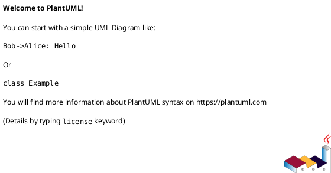

# <ADR_ID> <ADR_TITLE>

## 位置づけ
- 用途: 長期的に参照される architecture / contract / migration decision を固定する。
- authority default: `accepted`。通常は doc type から推定し、例外時だけ front matter の `authority` で override する。
- `disc` / `research` / `interview` / `scratch` の文脈をもとに作成してよいが、元文書を昇格させず、この ADR と必要な `requirement.md` / `design.md` / `plan.md` へ反映する。
- 汎用議事録、質問票、調査ログ、raw capture の代替にしない。

## 結論（Decision） (必須)
- **未決（TBD）**: この ADR は「議題が上がった時点」で作成し、結論はユーザー/レビュアーが最終決定した後に更新する。
- （注意）コーディングエージェントは、ユーザーの明示的な決定なしに結論を埋めない。
- ステータス運用:
  - 結論が未決の間は `状態: draft` のままにする
  - 結論が確定したら `accepted` にする
- 決定（決定後に記入）:
  - ...

## 背景（Context） (必須)
- 背景/制約（なぜ今決める必要があるか）:
  - ...
- 前提:
  - ...

### 図表（UML / 任意） (任意)

## 選択肢（Options considered） (必須)
- 選択肢 A（Option A）:
  - 概要:
    - ...
  - 良い点（Pros）:
    - ...
  - 悪い点 / 制約（Cons）:
    - ...
  - 棄却理由（棄却する場合）:
    - ...
- 選択肢 B（Option B）:
  - 概要:
    - ...
  - 良い点（Pros）:
    - ...
  - 悪い点 / 制約（Cons）:
    - ...
  - 棄却理由（棄却する場合）:
    - ...

### 図表（UML / 任意） (任意)

## 判断理由（Rationale） (必須)
- ...

### 図表（UML / 任意） (任意)

## 影響（Consequences） (必須)
- 良い影響（Positive）:
  - ...
- 悪い影響 / 将来負債（Negative / Debt）:
  - ...
- 影響範囲（コード/テスト/運用/データ）:
  - ...
- 移行/ロールバック:
  - ...
- 追加対応（Follow-ups / Epic / Issue / ADR）:
  - ...

### 図表（UML / 任意） (任意)

## 参考（References） (任意)
- 関連仕様（requirement/design/plan/report）:
  - ...
- 元になった discussion docs（derived_from）:
  - ...
- 反映先（reflected_to）:
  - ...
- PR/実装:
  - ...
- 外部資料:
  - ...

### 図表（UML / 任意） (任意)

