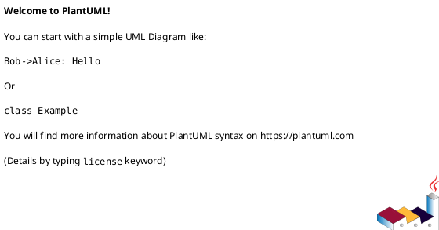

# <INTERVIEW_ID> <INTERVIEW_TITLE>

## 位置づけ
- 用途: 人間から目的、制約、期待、判断基準、未決事項を引き出し、回答を記録する。
- authority default: `raw`。通常は doc type から推定し、例外時だけ front matter の `authority` で override する。
- 技術的に調べられることは先に docs / code / tests / ADR / discussions / primary source を確認する。
- trivial な yes/no は、重要な判断、後続反映、回答証跡が必要なら `interview` を使い、そうでなければ issue comment や `scratch` で足りる。
- 回答から論点整理が必要になったら `disc`、追加調査が必要になったら `research`、長期判断が固まったら `adr` を新規作成する。

## ヒアリング概要 (必須)
- 対象者:
  - ...
- 回答が必要な理由:
  - ...
- 反映予定先:
  - `requirement.md`:
    - ...
  - `design.md`:
    - ...
  - `plan.md`:
    - ...
  - `adr`:
    - ...

## 質問ブロック（必要な数だけ繰り返す） (必須)

### 質問 1
- 質問主題:
  - ...
- 回答してほしいこと:
  - ...
- なぜ質問するのか:
  - ...
- 背景:
  - ...
- 詳細説明:
  - ...
- 事前分析:
  - 確認済みの docs / code / tests / ADR / discussions / primary source:
    - ...
  - まだ人間判断が必要な理由:
    - ...
- 回答案:
  - A:
    - ...
  - B:
    - ...
- 選択肢比較:
  - 評価軸:
    - ...
- メリット:
  - A:
    - ...
  - B:
    - ...
- デメリット:
  - A:
    - ...
  - B:
    - ...
- リスク:
  - ...
- ベストプラクティス分析:
  - ...
- 推奨案:
  - ...
- 未回答時の影響:
  - ...
- 回答欄:
  - ...
- 回答後フォローアップ:
  - 反映先:
    - ...
  - 追加で作る discussion docs:
    - ...

## 図解（任意）

