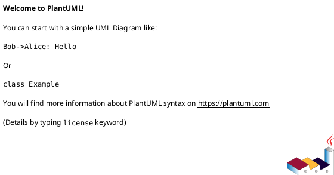

# <INTERVIEW_ID> <INTERVIEW_TITLE>

## 位置づけ
- 用途: 重要判断について、回答前に作る一問一答の正式質問シート。
- `status` は質問 lifecycle、`authority` は回答 / synthesis の権限、`adoption_status` は canonical docs への採用状態を表す。これらを混同しない。
- 未回答で作成するときは `status: unanswered`、`authority: proposed`、`adoption_status: unreviewed` を使う。
- 回答後は同じ file にユーザー回答、採用判断、反映先への含意を追記する。別 file や chat だけで完了扱いにしない。
- 技術的に調べられることは先に docs / code / tests / ADR / discussions / primary source を確認する。
- 軽微な yes/no は chat や `scratch` で足りる場合がある。requirement / design / plan / ADR / scope / workflow / template / agent role に影響する場合はこの formal sheet を使う。
- 回答から新しい高影響な曖昧さが出た場合、この file に複数質問を追加せず、次の unanswered `interview` を作成する。
- 複数の質問を束ねる分析は `disc`、追加調査は `research`、長期判断は `adr` に分ける。

## 質問の目的 (必須)
- 何を判断したいか:
  - ...
- なぜ local context だけでは閉じないか:
  - ...
- 回答が変える可能性がある artifact:
  - `requirement.md`:
    - ...
  - `design.md`:
    - ...
  - `plan.md`:
    - ...
  - `adr`:
    - ...

## 質問 (必須)
- 質問:
  - ...
- 回答してほしい形式:
  - ...
- 一度に聞く本質的な質問はこの 1 件だけ:
  - yes

## Source-grounded context (必須)
- 確認済みの docs / code / tests / ADR / discussions / primary source:
  - ...
- 確認済みの事実:
  - ...
- 残っている曖昧さ:
  - ...
- 用語 / 境界 / edge case:
  - ...

## 回答案 (必須)
- Option A:
  - 内容:
    - ...
  - tradeoff:
    - ...
- Option B:
  - 内容:
    - ...
  - tradeoff:
    - ...

## Codex の分析 (必須)
- 評価軸:
  - ...
- 比較:
  - ...
- リスク:
  - ...
- 未回答時の影響:
  - ...

## Codex の推奨案 (必須)
- 推奨:
  - ...
- 理由:
  - ...

## ユーザー回答 (回答後に必須)
- 回答:
  - ...
- 回答日時:
  - ...
- 回答者:
  - ...

## 追加確認の要否 (回答後に必須)
- 追加確認:
  - none | required
- required の場合:
  - 次の unanswered `interview` として切り出す質問:
    - ...

## 採用判断 (回答後に必須)
- adoption_status:
  - adopted | partially_adopted | rejected | deferred | stale | blocked
- authority update:
  - proposed | user-approved | synthesized
- 採用 / 非採用の理由:
  - ...
- reflected_to:
  - ...

## requirement / design / plan / ADR への含意 (必須)
- `requirement.md`:
  - ...
- `design.md`:
  - ...
- `plan.md`:
  - ...
- `adr`:
  - ...

## 図解（必要な場合のみ）

## 詳細 tradeoff / 具体シナリオ / edge case（必要な場合のみ）
- ...

## 後続 reflection proposal（必要な場合のみ）
- `disc` / `report` / canonical docs へ送る提案:
  - ...
