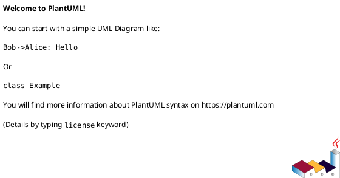

# <EPIC_ID> <EPIC_TITLE> — 設計（HOW）

## 全体像
- target boundary:
  - ...
- impacted area:
  - ...
- existing relation:
  - ...
- parent diagrams referenced:
  - ...

## Component / Module View
- Title:
  - ...
- Question answered:
  - ...
- Scope:
  - ...
- Excluded details:
  - ...
- Update trigger:
  - ...

### UML（推奨: component / module）

## Package Dependency
- Title:
  - ...
- Question answered:
  - ...
- Scope:
  - ...
- Excluded details:
  - ...
- Update trigger:
  - ...

### UML（推奨: package dependency / package dependency delta）

## Domain Model（DDD 必要時）
- ubiquitous language refs:
  - ...
- aggregate root:
  - ...
- entity / value object:
  - ...
- domain event / policy / specification:
  - ...
- invariants:
  - ...
- diagram metadata:
  - Title:
    - ...
  - Question answered:
    - ...
  - Scope:
    - ...
  - Excluded details:
    - persistence schema / full implementation classes
  - Update trigger:
    - aggregate / entity / value object / event / invariant が変わるとき

### UML（任意: domain model / aggregate）
- N/A: reason

## 契約
### API（必要時）
- API-001:
  - Request:
  - Response:
  - Errors:

### Event（必要時）
- EVT-001:
  - Producer:
  - Consumer:
  - Payload:

### Data boundary
- SoR:
  - ...
- consistency model:
  - ...

## データモデル
- model / table changes:
  - ...
- invariants:
  - ...
- diagram metadata:
  - Title:
    - ...
  - Question answered:
    - ...
  - Scope:
    - ...
  - Excluded details:
    - domain model の代替にはしない
  - Update trigger:
    - persistence model / migration impact が変わるとき

### UML（任意: data model）
- N/A: reason

## 主要フロー
- Flow-A:
  1. ...
  2. ...
  3. ...
- Flow-B:
  - ...
- diagram metadata:
  - Title:
    - ...
  - Question answered:
    - ...
  - Scope:
    - ...
  - Excluded details:
    - exhaustive internal call graph
  - Update trigger:
    - participant / message / transaction boundary が変わるとき

### UML（推奨: main sequence）

## State / Activity（必要時）
- State:
  - N/A: reason
- Activity:
  - N/A: reason
- diagram metadata:
  - Title:
    - ...
  - Question answered:
    - ...
  - Scope:
    - ...
  - Excluded details:
    - implementation order
  - Update trigger:
    - lifecycle / workflow branch / terminal state が変わるとき

### UML（任意: state / activity）
- N/A: reason

## 失敗設計
- failure mode:
  - ...
- retry:
  - ...
- idempotency:
  - ...
- partial failure:
  - ...

## 移行戦略
- migration strategy:
  - ...
- dual write/read if needed:
  - ...
- rollback:
  - ...

## 観測性 / セキュリティ
- observability:
  - ...
- role / auth:
  - ...
- audit / pii:
  - ...

## テスト戦略
- Unit:
  - ...
- Integration:
  - ...
- E2E:
  - ...
- E-AC mapping:
  - E-AC-001 -> ...

## 関連 ADR
- adr-...:
  - ...

## 未確定事項
- Q-001:
  - 質問:
  - 選択肢:
    - A:
      - ...
    - B:
      - ...
  - 推奨案:
    - ...
  - 影響範囲:
    - ...
