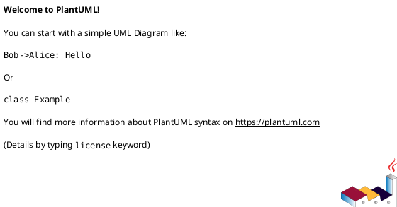

# <EPIC_ID> <EPIC_TITLE> — 設計（どう実現するか）

> このテンプレートは design scaffold / evidence slot です。必要な境界、図、契約、未確定事項を書き始めるための starting shape であり、workflow / compliance authority ではありません。詳細な lifecycle policy や field semantics は skills / docs / accepted ADRs / reviewer gates を参照します。

## 作成方針
- この文書は Epic が固定する Issue 横断の設計境界と契約を記述する。
- 日本語ファーストで作成し、ファイルパス、コマンド、コード識別子、SpecDock 固定語は原文のまま扱ってよい。
- Scope ownership と authority flow は `docs/authoring/scope-layering.md` を参照し、この template には責務表を複製しない。
- DDD / EDA は必須前提にしない。対象システムの既存アーキテクチャが明確な場合だけ、その語彙に合わせて整理する。
- Issue-level の実装手順、TDD の細かなサイクル、private implementation design を必須にしない。

## 全体像
- 対象境界:
  - ...
- 影響領域:
  - ...
- 既存関係:
  - ...
- 参照する親 diagram:
  - ...

## 課題横断境界（cross-Issue boundary）
- Epic が固定する判断:
  - ...
- Issue に委譲する local delta:
  - ...
- forbidden parent boundary changes:
  - ...
- cross-Issue invariant:
  - ...

## 設計スライス一覧（design slice catalog）
- DS-001:
  - 目的:
    - ...
  - closes:
    - E-RQ:
      - ...
    - E-AC:
      - ...
  - owning Issue candidate:
    - ...
  - contract impact:
    - ...
  - expected evidence:
    - ...

## コンポーネント / モジュール構成（Component / Module View）
- タイトル:
  - ...
- 答える問い:
  - ...
- 範囲:
  - ...
- 含めない詳細:
  - ...
- 更新条件:
  - ...

### 図表（UML / 推奨: コンポーネント / モジュール）

## パッケージ依存（Package Dependency）
- タイトル:
  - ...
- 答える問い:
  - ...
- 範囲:
  - ...
- 含めない詳細:
  - ...
- 更新条件:
  - ...

### 図表（UML / 推奨: パッケージ依存 / 依存差分）

## ドメインモデル（Domain Model / DDD 必要時）
- ユビキタス言語の参照:
  - ...
- 集約ルート:
  - ...
- エンティティ / 値オブジェクト:
  - ...
- ドメインイベント / ポリシー / 仕様:
  - ...
- 不変条件:
  - ...
- diagram メタデータ:
  - タイトル:
    - ...
  - 答える問い:
    - ...
  - 範囲:
    - ...
  - 含めない詳細:
    - persistence schema / full implementation classes
  - 更新条件:
    - aggregate / entity / value object / event / invariant が変わるとき

### 図表（UML / 任意: domain model / aggregate）
- N/A: 理由

## 契約
### 契約ポートフォリオ（contract portfolio）
- API / CLI:
  - ...
- event / metadata:
  - ...
- docs / template:
  - ...
- system of record:
  - ...
- compatibility expectation:
  - ...

### インターフェース契約（API / 必要時）
- API-001:
  - リクエスト:
  - レスポンス:
  - エラー:

### イベント契約（Event / 必要時）
- EVT-001:
  - 生成元:
  - 利用先:
  - ペイロード:

### データ境界
- データの authoritative source / system of record:
  - ...
- 一貫性モデル:
  - ...

## 証跡採用（artifact adoption）
- raw evidence:
  - `artifacts/`:
    - ...
- accepted ADR:
  - ...
- `report.md` Evidence Adoption Ledger:
  - ...
- canonical docs へ反映する範囲:
  - ...

## データモデル
- model / table 変更:
  - ...
- 不変条件:
  - ...
- diagram メタデータ:
  - タイトル:
    - ...
  - 答える問い:
    - ...
  - 範囲:
    - ...
  - 含めない詳細:
    - domain model の代替にはしない
  - 更新条件:
    - persistence model / migration impact が変わるとき

### 図表（UML / 任意: data model）
- N/A: 理由

## 主要フロー
- Flow-A:
  1. ...
  2. ...
  3. ...
- Flow-B:
  - ...
- diagram メタデータ:
  - タイトル:
    - ...
  - 答える問い:
    - ...
  - 範囲:
    - ...
  - 含めない詳細:
    - exhaustive internal call graph
  - 更新条件:
    - participant / message / transaction boundary が変わるとき

### 図表（UML / 推奨: main sequence）

## 状態 / アクティビティ（State / Activity / 必要時）
- State:
  - N/A: 理由
- Activity:
  - N/A: 理由
- diagram メタデータ:
  - タイトル:
    - ...
  - 答える問い:
    - ...
  - 範囲:
    - ...
  - 含めない詳細:
    - implementation order
  - 更新条件:
    - lifecycle / workflow branch / terminal state が変わるとき

### 図表（UML / 任意: state / activity）
- N/A: 理由

## 失敗設計
- 失敗モード:
  - ...
- リトライ:
  - ...
- 冪等性:
  - ...
- 部分失敗:
  - ...
- rollback boundary:
  - ...

## 移行戦略
- 移行戦略:
  - ...
- 必要時の dual write/read:
  - ...
- ロールバック:
  - ...

## 観測性 / セキュリティ
- 観測性:
  - ...
- ロール / 認可:
  - ...
- 監査 / PII:
  - ...

## テスト戦略
- 単体:
  - ...
- 統合:
  - ...
- E2E:
  - ...
- E-AC 対応:
  - E-AC-001 -> ...
- reviewer focus:
  - ...

## 関連 ADR
- adr-...:
  - ...

## 未確定事項
- Q-001:
  - 質問:
  - 選択肢:
    - A:
      - ...
    - B:
      - ...
  - 推奨案:
    - ...
  - 影響範囲:
    - ...
