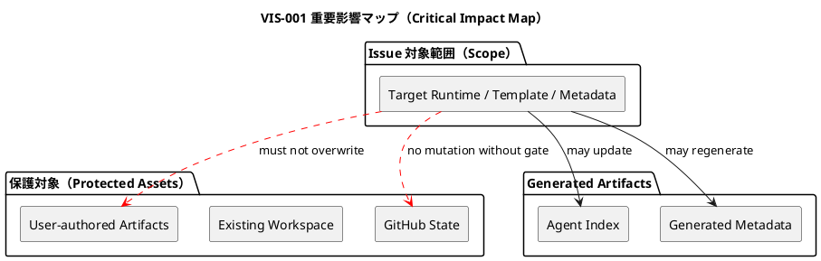
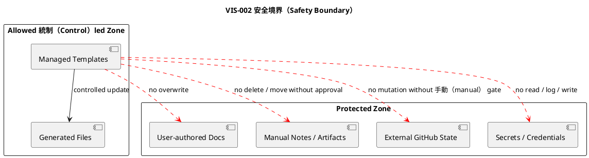
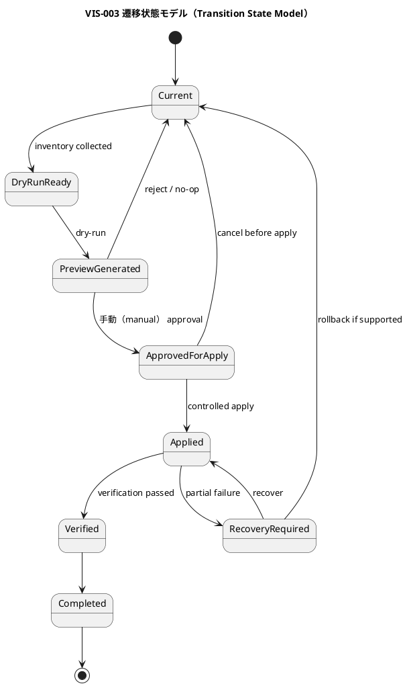
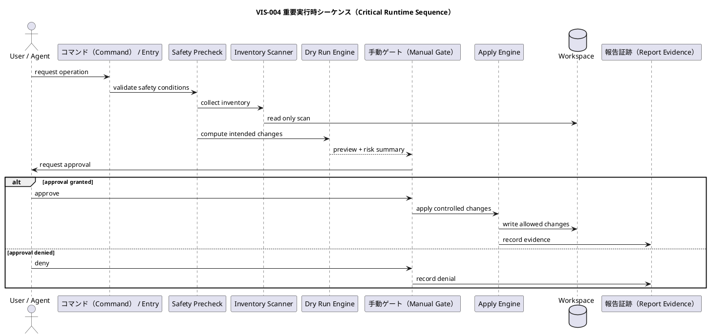
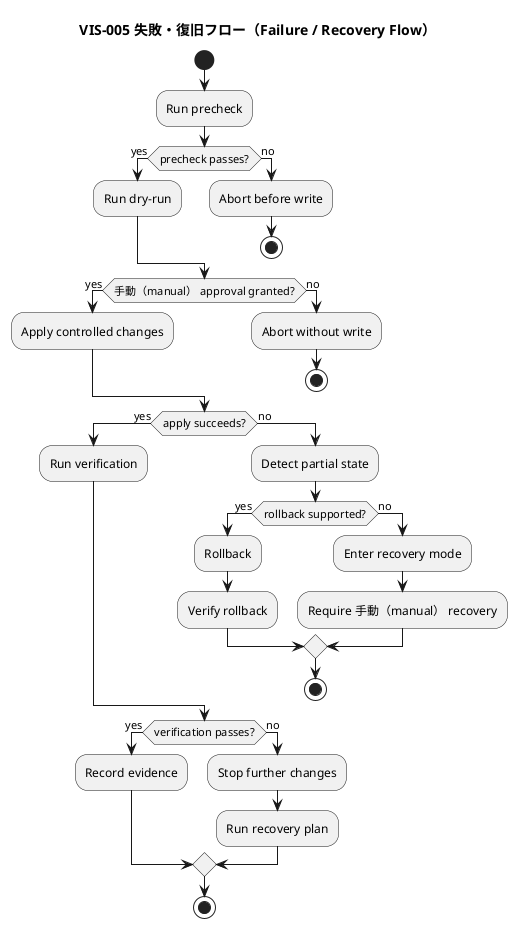
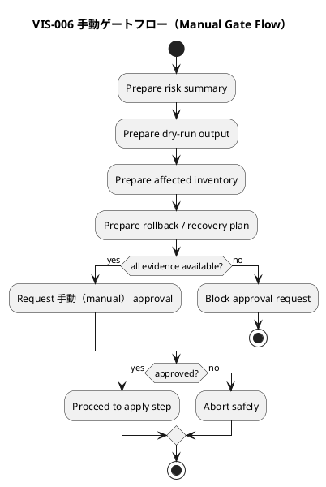

# <ISS_ID> <ISS_TITLE> — Issue 設計書（Critical）

この文書は、Critical grade のIssueに対する安全性重視の設計書である。

`critical` gradeでは、単に実装内容を設計するだけでは不十分である。破壊的変更、不可逆変更、セキュリティ・プライバシー（security / privacy）、workspace layout migration、metadata / sync / lifecycle、GitHub状態変更、ユーザー作成物への影響、切り戻し（rollback）困難性など、失敗時の被害が大きい変更を安全に扱うために設計する。

この文書は実装手順書ではない。実装順序、TDDサイクル、migration dry-run順序、手動（manual） gate実行順、具体的なコマンドは `plan.md` で扱う。

---

## 0. 文書の位置づけ

### この文書が定義すること

- Critical gradeとして扱う理由
- 変更のblast radius
- safety objective
- 変更対象と変更禁止対象
- public / shared contractへの影響
- workspace / metadata / generated artifactsへの影響
- ユーザー作成物（user-authored artifacts）への影響
- destructive operationの有無と防止策
- transition architecture
- valid intermediate states
- migration / update / rollback / forward-only方針
- partial failure / recovery方針
- セキュリティ・プライバシー（security / privacy） / credential / GitHub stateへの影響
- 手動（manual） approval gate
- 設計上のno-go条件
- `plan.md` へ渡すverification / safety / review要件

### Criticalで扱ってはいけないもの

| 判断 | 扱い |
|---|---|
| 複数Initiativeにまたがるarchitecture方針変更 | ADRまたはInitiative設計へ昇格 |
| 全体Event Envelope変更 | ADRへ昇格 |
| 全体metadata model変更 | ADRまたはarchitecture designへ昇格 |
| security policy変更 | Security / Architecture承認へ昇格 |
| data retention / privacy policy変更 | Initiative / compliance / ADRへ昇格 |
| GitHub mutation policy変更 | ADRまたはtool policyへ昇格 |
| destructive migrationの承認 | Manual approval必須。必要なら別Critical Issueへ分割 |

### 中止条件（No-Go Conditions）

以下に該当する場合、このIssueは実装に進めない。

- [ ] 影響範囲が不明である
- [ ] destructive operationの有無が不明である
- [ ] ユーザー作成物（user-authored artifacts）の保護方針が不明である
- [ ] rollbackまたはforward-only方針が不明である
- [ ] migration対象のinventoryが不明である
- [ ] partial failure時の状態が不明である
- [ ] セキュリティ・プライバシー（security / privacy）影響が不明である
- [ ] GitHub state変更の有無が不明である
- [ ] 手動（manual） gateの承認者が不明である
- [ ] 上位判断が未承認である
- [ ] 失敗時の復旧方法がない

### 設計コミットメント

| タグ | 意味 | 変更条件 |
|---|---|---|
| `[N]` | 実装が必ず従う設計契約 | 設計書の更新・再承認が必要 |
| `[S]` | 安全性・復旧性に関する必須契約 | 変更には手動（manual） approvalが必要 |
| `[M]` | 人間承認なしに進めてはいけない条件 | 承認記録が必要 |
| `[P]` | 現時点の設計仮説 | 意味論と安全契約を維持すれば変更可能 |
| `[I]` | 理解のための例示 | 実装を拘束しない |
| `[O]` | 未解決事項 | 指定された段階までに解決する |
| `[E]` | この Issue の判断範囲外 | 上位文書（Epic・Initiative・ADR）へ昇格する |

---

## 1. 等級 Critical（Critical Grade）確認

### 1.1 Criticalとして扱う理由

- 推奨grade:
  - `critical`
- criticalにする理由:
  - ...
- strictでは不足する理由:
  - ...
- 主な変更対象:
  - ...
- 最大のリスク:
  - ...
- 失敗時の影響:
  - ...
- 必要な手動（manual） gate:
  - ...

### 1.2 Critical 開始条件（Trigger）確認

- [ ] セキュリティ・プライバシー（security / privacy） / secret / credential に関係する
- [ ] GitHub上の状態変更を伴う
- [ ] workspace layoutを移行する
- [ ] ユーザー作成物（user-authored artifact）を移動・変換・上書き・削除する可能性がある
- [ ] `.meta.json`、`.assurance.json`、`.agent/*.json` の意味を変更する
- [ ] sync / validate / active / lifecycle挙動を変更する
- [ ] 移行（migration）が必要
- [ ] rollback不能またはforward-only migrationになる
- [ ] destructive operationの可能性がある
- [ ] 失敗時に部分的な不整合が残り得る
- [ ] 既存workspace互換性に影響する
- [ ] public / shared contractに重大な影響がある
- [ ] 複数EpicまたはInitiativeに影響する
- [ ] 手動承認なしに進めると危険

### 1.3 リスク Critical要約（Critical Risk Summary）

| リスク識別子（Risk ID） | リスク（Risk） | 影響（Impact） | 統制（Control） | 残余リスク（Residual Risk） |
|---|---|---|---|---|
| RISK-001 | ... | ... | ... | 低 / 中 / 高（low / medium / high） |
| RISK-002 | ... | ... | ... | 低 / 中 / 高（low / medium / high） |

### 1.4 残余リスク受容（残余リスク（Residual Risk） Acceptance）

| 残余リスク（Residual Risk） | 許容可否 | 承認者 | 備考 |
|---|---|---|---|
| ... | 受容 / 却下 / 不明（accepted / rejected / unknown） | ... | ... |

---

## 2. 安全性要約（Executive Safety Summary）

### 2.1 このIssueで変わること

- ...
- ...

### 2.2 このIssueで絶対に変えないこと

- ...
- ...

### 2.3 安全目的（Safety Objective）

- `[S]` ...
- `[S]` ...
- `[S]` ...

### 2.4 手動ゲート要約（手動ゲート（Manual Gate） Summary）

| ゲート識別子（Gate ID） | ゲート（Gate） | 必須タイミング（Required Before） | 承認者（Approver） |
|---|---|---|---|
| MG-001 | ... | implementation / migration / release | ... |
| MG-002 | ... | destructive step / final merge | ... |

### 2.5 実行・中止要約（Go / No-Go Summary）

| 条件 | Go条件 | No-Go条件 |
|---|---|---|
| 影響範囲 | ... | ... |
| 移行（migration） | ... | ... |
| 切り戻し（rollback） | ... | ... |
| security/privacy | ... | ... |
| 外部状態変更（GitHub mutation） | ... | ... |

---

## 3. 設計意図

- 問題:
  - ...
- 現状の制約:
  - ...
- 要件上必要な変化:
  - ...
- 互換性上の制約:
  - ...
- 安全性上の制約:
  - ...
- 既存利用者・既存workspaceへの影響:
  - ...

採用する設計方針:

- `[N]` ...
- `[S]` ...
- `[S]` ...
- `[P]` ...

---

## 4. 正本・根拠（Normative Sources）

| 種別 | パス・識別子（Path / ID） | 関連箇所 | このIssueへの意味 |
|---|---|---|---|
| 課題要件（Issue Requirement） | `requirement.md` | `AC-...` / `BH-...` / `CON-...` | ... |
| エピック設計（Epic Design） | ... | ... | ... |
| イニシアチブ設計（Initiative Design） | ... | ... | ... |
| ADR（意思決定記録） | ... | ... | ... |
| アーキテクチャ規則（Architecture Rule） | ... | ... | ... |
| セキュリティ・プライバシーポリシー（Security / Privacy Policy） | ... | ... | ... |
| ポリシー（GitHub policy） | ... | ... | ... |
| 現行文書（Current docs） | ... | ... | ... |
| 既存コードパターン（Existing code pattern） | ... | ... | ... |
| 既存テスト（Existing tests） | ... | ... | ... |
| 既存移行ロジック（Existing migration logic） | ... | ... | ... |

---

## 5. 要件・リスク・統制の追跡（Requirement / Risk / 統制（Control） Traceability）

### 5.1 要件から設計への追跡（Requirement-to-Design Traceability）

| 要件識別子（Requirement ID） | 内容の要約 | 設計識別子（Design ID） | 設計上の扱い | 備考 |
|---|---|---|---|---|
| AC-001 | ... | DES-001 | ... | ... |
| AC-002 | ... | DES-002 | ... | ... |
| BH-001 | ... | DES-003 | ... | ... |
| CON-001 | ... | DES-004 | ... | ... |

### 5.2 リスクから統制への追跡（Risk-to-統制（Control） Traceability）

| リスク識別子（Risk ID） | リスク（Risk） | 統制識別子（Control ID） | 統制（Control）内容 | 検証（Verification） |
|---|---|---|---|---|
| RISK-001 | ... | CTRL-001 | ... | `EVD-...` |
| RISK-002 | ... | CTRL-002 | ... | `EVD-...` |

### 5.3 安全契約一覧（安全契約（Safety Contract） Index）

| 安全識別子（Safety ID） | 安全契約（Safety Contract） | 関連Risk | 関連設計識別子（Design ID） |
|---|---|---|---|
| SAFE-001 | ... | `RISK-...` | `DES-...` |
| SAFE-002 | ... | `RISK-...` | `DES-...` |

---

## 6. 判断範囲と昇格（Decision Radius / Escalation）

| 判断識別子（Decision ID） | 判断 | 所有/委譲/昇格 | 理由 | 関連設計識別子（Design ID） |
|---|---|---|---|---|
| DEC-001 | ... | 所有（owned） | ... | `DES-...` |
| DEL-001 | ... | 実装へ委任（delegated to implementation） | ... | `DES-...` |
| ESC-001 | ... | 上位文書（Epic・Initiative・ADR） / Security Review | ... | `DES-...` |

No-Go判断:

| 中止条件識別子（No-Go ID） | 条件 | 理由 | 解除条件 |
|---|---|---|---|
| NG-001 | ... | ... | ... |
| NG-002 | ... | ... | ... |

---

## 7. 継承制約と変更禁止領域

- `[N]` ...
- `[S]` ...

保護対象（Protected Assets）:

| Asset | 種別 | 保護方針 | 変更可否 |
|---|---|---|---|
| ... | user-authored / generated / external / metadata | preserve / backup / read-only / N/A | no / controlled / yes |

---

## 8. 現状と棚卸し（Current State and Inventory）

### 8.1 現在の構造

| 種別 | パス・対象（Path / Target） | 現在の責務 | 備考 |
|---|---|---|---|
| 文書（docs） | ... | ... | ... |
| テンプレート（template） | ... | ... | ... |
| script / CLI | ... | ... | ... |
| スキル（skill） | ... | ... | ... |
| metadata | ... | ... | ... |
| generated artifact | ... | ... | ... |
| GitHub state | ... | ... | ... |
| テスト（test） | ... | ... | ... |
| コード（code） | ... | ... | ... |

### 8.2 移行・更新対象の棚卸し（Migration / Update Inventory）

| 棚卸し識別子（ID）Inventory ID） | 対象 | 種別 | 所有者 | 変更方針 |
|---|---|---|---|---|
| INV-001 | ... | ファイル・ディレクトリ・メタデータ・生成物・GitHub・外部（file / directory / metadata / generated / GitHub / external） | ユーザー・システム・混在（user / system / mixed） | 保持・変換・再生成・読み取り専用（preserve / transform / regenerate / read-only） |
| INV-002 | ... | ... | ... | ... |

### 8.3 影響面（影響（Impact） Surface）

| 影響面（Surface） | 影響 | 理由 | 対応 |
|---|---|---|---|
| CLI behavior | はい / いいえ / 不明（yes / no / unknown） | ... | ... |
| テンプレート契約（Template contract） | はい / いいえ / 不明（yes / no / unknown） | ... | ... |
| ワークスペースscaffold（Workspace scaffold） | はい / いいえ / 不明（yes / no / unknown） | ... | ... |
| Metadata / sync | はい / いいえ / 不明（yes / no / unknown） | ... | ... |
| 外部連携（GitHub integration） | はい / いいえ / 不明（yes / no / unknown） | ... | ... |
| Existing workspaces | はい / いいえ / 不明（yes / no / unknown） | ... | ... |
| セキュリティ・プライバシー（Security / privacy） | はい / いいえ / 不明（yes / no / unknown） | ... | ... |

---

## 9. 目標安全設計契約（Target Safety Design Contract）

| 設計識別子（Design ID） | 種別 | 現在（Current） | 目標（Target） | 固定度 |
|---|---|---|---|---|
| DES-001 | 振る舞い（behavior） | ... | ... | `[N]` |
| DES-002 | contract | ... | ... | `[N]` |
| DES-003 | safety | ... | ... | `[S]` |
| DES-004 | 移行（migration） | ... | ... | `[S]` |
| DES-005 | 切り戻し（rollback） | ... | ... | `[S]` |
| DES-006 | 手動（manual） gate | ... | ... | `[M]` |
| DES-007 | 検証（verification） | ... | ... | `[N]` |

Safety Guarantees:

| 保証識別子（Guarantee ID） | 保証内容 | 関連Risk | 関連設計識別子（Design ID） |
|---|---|---|---|
| GUAR-001 | ... | `RISK-...` | `DES-...` |
| GUAR-002 | ... | `RISK-...` | `DES-...` |

Safety Invariants:

- `[S]` ...
- `[S]` ...
- `[S]` ...

---

## 10. 視覚的な設計概要（Visual Design Overview）

Criticalでは、影響範囲、transition、failure / recovery、手動（manual） gate、セキュリティ・プライバシー（security / privacy） boundary などを必要に応じて図示する。

### 図表一覧（Diagram Index）

| 図識別子（Diagram ID） | 種類 | 固定度 | 目的 | 関連設計識別子（Design ID） |
|---|---|---|---|---|
| VIS-001 | context / impact | `[P]` | 影響範囲を示す | `DES-...` |
| VIS-002 | safety boundary | `[S]` | 保護対象と禁止経路を示す | `SAFE-...` |
| VIS-003 | transition state | `[S]` | migration中間状態を示す | `DES-...` |
| VIS-004 | sequence | `[P]` | 実行時協調を示す | `DES-...` |
| VIS-005 | failure / recovery | `[S]` | 失敗時復旧を示す | `DES-...` |
| VIS-006 | 手動（manual） gate | `[M]` | 手動承認点を示す | `DES-...` |

### VIS-001: 重要影響マップ（Critical Impact Map）

### VIS-002: 安全境界（Safety Boundary）

### VIS-003: 遷移状態モデル（Transition State Model）

### VIS-004: 重要実行時シーケンス（Critical Runtime Sequence）

### VIS-005: 失敗・復旧フロー（Failure / Recovery Flow）

### VIS-006: 手動ゲートフロー（Manual Gate Flow）

---

## 11. 振る舞い設計（Behavioral Design）

Criticalでは、正常系だけでなく、安全系・拒否系・dry-run・手動（manual） gate・recoveryも振る舞いとして扱う。

### 振る舞い設計 DES-BEH-001:

- 固定度:
  - `[N]` / `[S]`
- 関連Requirement:
  - `AC-...`
- 関連Risk:
  - `RISK-...`
- 関連Diagram:
  - `VIS-...`
- 開始条件（Trigger）:
  - ...
- Preconditions:
  - ...
- Decision rules:
  - ...
- Postconditions:
  - ...
- Safety guarantee:
  - ...
- Failures:
  - ...
- Recovery:
  - ...
- Must not happen:
  - ...

---

## 12. 責任と境界モデル（Responsibility and Boundary Model）

| 構成要素・作業成果物（Building Block / Artifact） | 責任 | 禁止事項（Must Not Do） | 関連設計識別子（Design ID） | 関連図（Diagram） |
|---|---|---|---|---|
| ... | ... | ... | `DES-...` | `VIS-...` |

Safety Decision Owner:

| Safety Decision | 担当（Owner） | 手動ゲート（Manual Gate）要否 | 備考 |
|---|---|---|---|
| ... | ... | はい / いいえ（yes / no） | ... |

---

## 13. インターフェース・契約設計（Interface / Contract Design）

### 13.1 契約影響要約（Contract 影響（Impact） Summary）

| Contract種別 | 影響 | 互換性 | 備考 |
|---|---|---|---|
| 公開CLI契約（Public CLI contract） | なし / 互換 / 変更あり / 破壊的 / 不明（none / compatible / changed / breaking / unknown） | 互換 / 破壊的 / N/A（compatible / breaking / N/A） | ... |
| 公開API契約（Public API contract） | なし / 互換 / 変更あり / 破壊的 / 不明（none / compatible / changed / breaking / unknown） | 互換 / 破壊的 / N/A（compatible / breaking / N/A） | ... |
| イベント・メッセージ契約（Event / message contract） | なし / 互換 / 変更あり / 破壊的 / 不明（none / compatible / changed / breaking / unknown） | 互換 / 破壊的 / N/A（compatible / breaking / N/A） | ... |
| テンプレート契約（Template contract） | なし / 互換 / 変更あり / 破壊的 / 不明（none / compatible / changed / breaking / unknown） | 互換 / 破壊的 / N/A（compatible / breaking / N/A） | ... |
| メタデータ・生成インデックス（Metadata / generated index） | なし / 互換 / 変更あり / 破壊的 / 不明（none / compatible / changed / breaking / unknown） | 互換 / 破壊的 / N/A（compatible / breaking / N/A） | ... |
| ワークスペースscaffold（Workspace scaffold） | なし / 互換 / 変更あり / 破壊的 / 不明（none / compatible / changed / breaking / unknown） | 互換 / 破壊的 / N/A（compatible / breaking / N/A） | ... |
| 外部状態契約（GitHub state contract） | なし / 互換 / 変更あり / 破壊的 / 不明（none / compatible / changed / breaking / unknown） | 互換 / 破壊的 / N/A（compatible / breaking / N/A） | ... |
| セキュリティ・プライバシー契約（Security / privacy contract） | なし / 互換 / 変更あり / 破壊的 / 不明（none / compatible / changed / breaking / unknown） | 互換 / 破壊的 / N/A（compatible / breaking / N/A） | ... |

### 13.2 契約差分（Contract Delta）

| 契約識別子（ID）Contract ID） | 対象 | 現在（Current） | 目標（Target） | 互換性 | 固定度 |
|---|---|---|---|---|---|
| CTR-001 | ... | ... | ... | 互換 / 破壊的 / N/A（compatible / breaking / N/A） | `[N]` |
| CTR-002 | ... | ... | ... | 互換 / 破壊的 / N/A（compatible / breaking / N/A） | `[N]` |

Breaking Change Design:

- Breaking change:
  - はい / いいえ / 不明（yes / no / unknown）
- 対象:
  - ...
- 代替案:
  - ...
- 互換期間:
  - ...
- migration:
  - ...
- 手動（manual） approval:
  - required / not required

---

## 14. データ・状態・ワークスペース・メタデータ差分（Data / State / Workspace / Metadata Delta）

| 対象 | 現在（Current） | 目標（Target） | 互換性 | 関連図（Diagram） |
|---|---|---|---|---|
| ... | ... | ... | ... | `VIS-...` |

Workspace Layout 影響（Impact）:

| 項目 | 影響 | 対応 |
|---|---|---|
| 新規ディレクトリ | はい / いいえ / 不明（yes / no / unknown） | ... |
| 既存ディレクトリrename | はい / いいえ / 不明（yes / no / unknown） | ... |
| 既存ファイル移動 | はい / いいえ / 不明（yes / no / unknown） | ... |
| 既存ファイル削除 | はい / いいえ / 不明（yes / no / unknown） | destructive; 手動（manual） gate required |
| 既存ユーザー作成物への影響 | はい / いいえ / 不明（yes / no / unknown） | ... |
| legacy path対応 | required / not required / unknown | ... |

User-authored Artifact 影響（Impact）:

| 対象 | 影響 | 保護策 | Manual ゲート（Gate） |
|---|---|---|---|
| ... | none / read / move / transform / overwrite / delete / unknown | ... | はい / いいえ（yes / no） |

---

## 15. 移行アーキテクチャ（Transition Architecture）

### 現在・目標・移行中状態（Current / Target / Transitional States）

| State 識別子（ID） | 状態 | 有効性 | 説明 |
|---|---|---|---|
| TS-000 | 現在（Current） | valid | ... |
| TS-100 | ドライラン（Dry-run） ready | valid / invalid | ... |
| TS-200 | Dual support | valid / invalid | ... |
| TS-300 | Migrated | valid / invalid | ... |
| TS-400 | 目標（Target） | valid | ... |
| TS-ERR | Partial failure | invalid / recoverable | ... |

Transition Rules:

| Rule 識別子（ID） | From | To | 条件 | Manual ゲート（Gate） |
|---|---|---|---|---|
| TR-001 | TS-000 | TS-100 | ... | いいえ（no） |
| TR-002 | TS-100 | TS-200 | ... | はい / いいえ（yes / no） |

Transition Invariants:

- `[S]` ...
- `[S]` ...

---

## 16. 移行・更新・ロールバック設計（Migration / Update / Rollback Design）

- migration required:
  - はい / いいえ（yes / no）
- migration mode:
  - dry-run first / explicit apply / automatic / 手動（manual） only
- destructive operation:
  - はい / いいえ / 不明（yes / no / unknown）
- backup required:
  - はい / いいえ（yes / no）
- 手動（manual） approval required:
  - はい / いいえ（yes / no）

Migration Steps設計:

| Migration ステップID（Step ID） | 意味 | 安全条件 | Failure時の扱い |
|---|---|---|---|
| MIG-001 | inventory collection | read-only | abort |
| MIG-002 | dry-run preview | no write | abort |
| MIG-003 | apply controlled change | 手動（manual） gate required | recover / rollback |
| MIG-004 | 検証（verification） | no new writes | recovery if failed |

ロールバック方針（Rollback Strategy）:

- rollback可能:
  - はい / いいえ（yes / no） / partial / unknown
- rollback対象:
  - ...
- rollbackできないもの:
  - ...
- rollback方法:
  - ...
- rollback verification:
  - ...

---

## 17. 失敗・部分失敗・復旧設計（Failure / Partial Failure / Recovery Design）

| Failure 識別子（ID） | 条件 | 期待される扱い | 状態変更 | Recovery | 観測点 |
|---|---|---|---|---|---|
| FAIL-001 | ... | ... | なし / 部分的 / rollback / 不明（none / partial / rollback / unknown） | ... | ... |
| FAIL-002 | ... | ... | なし / 部分的 / rollback / 不明（none / partial / rollback / unknown） | ... | ... |

Partial Failure States:

| State 識別子（ID） | 状態 | 安全性 | 検出方法 | Recovery |
|---|---|---|---|---|
| PFS-001 | ... | safe / unsafe / unknown | ... | ... |

Recovery 中止条件（No-Go Conditions）:

- [ ] partial failureを検出できない
- [ ] unsafe stateから回復できない
- [ ] rollbackもforward recoveryもない
- [ ] ユーザー作成物（user-authored artifact）を復元できない

---

## 18. セキュリティ・プライバシー・認証情報設計（Security / Privacy / Credential Design）

| 項目 | 影響 | 備考 |
|---|---|---|
| 認証 | none / affected / unknown | ... |
| 認可 | none / affected / unknown | ... |
| 機密情報（secret / token / credential） | none / affected / unknown | ... |
| 個人情報 / 機微情報 | none / affected / unknown | ... |
| ログ出力 | none / affected / unknown | ... |
| 外部API権限（GitHub API） | none / affected / unknown | ... |

Data Classification:

| Data | Classification | Allowed Location | Must Not Appear In |
|---|---|---|---|
| ... | public / internal / sensitive / secret | ... | logs / report / CLI output / GitHub comment |

Logging / Reporting Rules:

- `[S]` secretsをreport.mdに記録しない
- `[S]` credentialsをCLI outputへ出力しない
- `[S]` private dataをGitHub commentへ出力しない

---

## 19. GitHub 状態変更設計（GitHub State Mutation Design）

GitHub上の状態を変更する場合のみ記述する。該当しない場合は `N/A` と明記する。

| 対象 | 変更（Mutation） | 自動 / 手動 | Manual ゲート（Gate） | Rollback |
|---|---|---|---|---|
| 課題（Issue） | ... | automatic / 手動（manual） | はい / いいえ（yes / no） | ... |
| Label | ... | automatic / 手動（manual） | はい / いいえ（yes / no） | ... |
| Comment | ... | automatic / 手動（manual） | はい / いいえ（yes / no） | ... |
| PR | ... | automatic / 手動（manual） | はい / いいえ（yes / no） | ... |

Safety:

- `[S]` mutation前に対象IDを明示する
- `[S]` destructive mutationを行わない
- `[S]` comment投稿内容にsecret / private dataを含めない
- `[M]` mutation実行前に手動（manual） gateを通す

---

## 20. 観測性・診断・証跡設計（Observability / Diagnostics / Evidence Design）

| 証跡ID（Evidence ID） | 観測対象 | 証拠の種類 | 関連設計識別子（Design ID） | 関連Risk |
|---|---|---|---|---|
| EVD-001 | ... | test / CLI output / ドライラン / 差分 / 手動確認（dry-run / diff / manual） approval | `DES-...` | `RISK-...` |
| EVD-002 | ... | migration preview / recovery proof / security review | `DES-...` | `RISK-...` |

Reportに残すべき証拠:

- inventory evidence:
  - ...
- dry-run evidence:
  - ...
- 手動（manual） gate evidence:
  - ...
- migration / update evidence:
  - ...
- rollback / recovery evidence:
  - ...
- セキュリティ・プライバシー（security / privacy） evidence:
  - ...
- GitHub mutation evidence:
  - ...
- final verification evidence:
  - ...

---

## 21. 文書・テンプレート・スキル・ワークフロー影響（Docs / Template / Skill / Workflow 影響（Impact））

| パス（Path） | 更新理由 | 必須 |
|---|---|---|
| ... | ... | はい / いいえ（yes / no） |

提供側・利用側反映（Provider / Consumer）:

| 対象 | 影響 | 対応 |
|---|---|---|
| `src/spec_dock/assets/...` | はい / いいえ / 不明（yes / no / unknown） | ... |
| ワークスペース（root `spec-dock/...`） | はい / いいえ / 不明（yes / no / unknown） | ... |

Documentation Consistency Contract:

- `[N]` docsは新しいcontractと矛盾してはいけない
- `[N]` テンプレート（templates）とworkflow docsは同じgrade名・artifact名を使う
- `[S]` critical safety gateはdocs / skillsからも分かるようにする

---

## 22. 検討した代替案（Alternatives Considered）

| Alternative 識別子（ID） | 代替案 | 利点 | 欠点 | 採否 |
|---|---|---|---|---|
| ALT-001 | ... | ... | ... | adopted / rejected |
| ALT-002 | ... | ... | ... | adopted / rejected |

採用判断:

- 採用した方針:
  - ...
- trade-off:
  - ...
- 残余リスク:
  - ...
- 承認者:
  - ...

---

## 23. 実装へ委譲する設計仮説（Design Hypotheses Left to Implementation）

Criticalでは、安全性・contract・migration・rollbackに関わる判断を実装中に自由判断させない。

| Hypothesis 識別子（ID） | 内容 | 制約 | 判断タイミング |
|---|---|---|---|
| HYP-001 | ... | ... | during implementation / during refactor |

実装中に変更してはいけないもの:

- `[N]` ...
- `[S]` ...
- `[M]` ...

---

## 24. 検証への含意（検証（Verification） Implications）

| 設計識別子（Design ID） | 検証すべき内容 | 推奨検証レベル（Verification Level） | 報告証跡（Report Evidence） | 関連Risk |
|---|---|---|---|---|
| DES-001 | ... | unit / integration / CLI / 文書・テンプレート（docs / template） / contract / 手動（manual） | `EVD-...` | `RISK-...` |
| DES-002 | ... | compatibility / migration / recovery / dry-run | `EVD-...` | `RISK-...` |
| DES-003 | ... | セキュリティ・プライバシー（security / privacy） / GitHub mutation / 手動（manual） approval | `EVD-...` | `RISK-...` |

必須Evidence:

- [ ] inventory evidence
- [ ] risk / control evidence
- [ ] dry-run evidence
- [ ] compatibility evidence
- [ ] migration / update evidence
- [ ] rollback / forward-only decision evidence
- [ ] failure / recovery evidence
- [ ] セキュリティ・プライバシー（security / privacy） evidence
- [ ] 手動（manual） gate evidence
- [ ] final verification evidence

---

## 25. レビュー・承認方針（Review and Approval Strategy）

| Review対象 | Reviewer | 必須 | Focus |
|---|---|---|---|
| requirement alignment | ... | はい / いいえ（yes / no） | AC / BH / CON |
| critical risk | ... | はい（yes） | risk / 統制（risk / controls） |
| design contract | ... | はい（yes） | safety / compatibility / migration |
| セキュリティ・プライバシー（security / privacy） | ... | はい / いいえ（yes / no） | secret / data exposure |
| plan | ... | はい（yes） | TDD / gates / stop rules |
| implementation | ... | はい（yes） | 差分 / テスト / 安全性（差分 / テスト（diff / tests） / safety） |
| 手動（manual） apply gate | ... | はい / いいえ（yes / no） | dry-run / approval |
| 最終report（final report） | ... | はい（yes） | 証跡完全性（evidence completeness） |

手動ゲート（Manual Gate）一覧:

| ゲート識別子（Gate ID） | ゲート（Gate） | 必須タイミング（Required Before） | Required Evidence | 承認者（Approver） |
|---|---|---|---|---|
| MG-001 | ... | plan approval | ... | ... |
| MG-002 | ... | migration apply | ... | ... |
| MG-003 | ... | final completion | ... | ... |

---

## 26. 計画への引き渡し（Plan Handoff）

### 26.1 固定設計契約（Fixed Design Contracts）

- `DES-...`
- `CTR-...`
- `SAFE-...`
- `CTRL-...`
- GUAR-...
- `MIG-...`
- `REC-...`
- MG-...

### 26.2 振る舞い・安全バックログ種（Behavior / Safety Backlog Seeds）

| 種識別子（Seed ID） | 振る舞い / Safety成果 | 関連設計識別子（Design ID） | 関連Requirement | 関連Risk |
|---|---|---|---|---|
| B-SEED-001 | ... | `DES-...` | `AC-...` | `RISK-...` |
| SAFE-SEED-001 | ... | `SAFE-...` | `CON-...` | `RISK-...` |

### 26.3 必須ゲート（Required Gates）

| ゲート識別子（Gate ID） | 種別 | 検証内容 | 報告証跡（Report Evidence） |
|---|---|---|---|
| SAFE-GATE-001 | safety | ... | `EVD-...` |
| MIG-GATE-001 | 移行（migration） | ... | `EVD-...` |
| REC-GATE-001 | recovery | ... | `EVD-...` |
| MG-001 | 手動（manual） | ... | `EVD-...` |

### 26.4 停止・再計画・中止条件（Stop / Replan / No-Go Triggers）

- [ ] Redの理由が設計上の想定と異なる
- [ ] 要件の期待値を変更したくなる
- [ ] public contract変更が想定より大きい
- [ ] migrationが破壊的になる
- [ ] rollback / recoveryが成立しない
- [ ] セキュリティ・プライバシー（security / privacy）影響が想定より大きい
- [ ] ユーザー作成物（user-authored artifact）を保護できない
- [ ] GitHub mutationが想定より大きい
- [ ] 手動（manual） gateを通せない
- [ ] partial failureを安全に扱えない
- [ ] 中止条件（No-Go Conditions）に該当する

---

## 27. 未確定事項（Open Questions）

Criticalでは、BlockingなOpen Questionを残したまま `plan.md` へ進まない。

### 未解決事項 OQ-001:

- 質問:
  - ...
- 影響:
  - requirement / design / plan / implementation / test / release / safety
- 解決期限:
  - before plan / before implementation / before apply / can defer
- 推奨:
  - ...
- No-Goとの関係:
  - ...
- 解決状態:
  - open / resolved / escalated

---

## 28. 図表レビューチェックリスト（Diagram Review Checklist）

- [ ] 各図にDiagram IDがある
- [ ] 各図に固定度 `[N] / [S] / [M] / [P] / [I]` が明示されている
- [ ] 各図が設計識別子（Design ID）または安全識別子（Safety ID）と対応している
- [ ] 図だけにしか存在しない設計契約がない
- [ ] impact surfaceが必要に応じて図示されている
- [ ] protected assetsが必要に応じて図示されている
- [ ] transition stateが必要に応じて図示されている
- [ ] failure / recoveryが必要に応じて図示されている
- [ ] 手動（manual） gateが必要に応じて図示されている
- [ ] セキュリティ・プライバシー（security / privacy） boundaryが必要に応じて図示されている

---

## 29. Critical 設計承認チェックリスト（Design Approval Checklist）

- [ ] すべての関連ACが設計識別子（Design ID）へ対応している
- [ ] すべてのCritical Riskに統制（Control）がある
- [ ] すべての安全契約（Safety Contract）に検証（Verification） Implicationがある
- [ ] Critical gradeにする理由が明記されている
- [ ] 中止条件（No-Go Conditions）を確認した
- [ ] 残余リスク（Residual Risk）が明示されている
- [ ] protected assetsが列挙されている
- [ ] ユーザー作成物（user-authored artifacts）の保護方針がある
- [ ] destructive operationの有無が明記されている
- [ ] partial failure / recoveryが設計されている
- [ ] rollbackまたはforward-only方針がある
- [ ] 契約影響要約（Contract 影響（Impact） Summary）が埋まっている
- [ ] transition stateが定義されている
- [ ] セキュリティ・プライバシー（security / privacy）影響が確認済み
- [ ] GitHub mutationがある場合、手動（manual） gateがある
- [ ] 必須ゲート（Required Gates）が計画への引き渡し（Plan Handoff）へ渡されている

---

## 30. 変更履歴

| 日付（Date） | 変更（Change） | 理由（Reason） | 作成者（Author） |
|---|---|---|---|
| YYYY-MM-DD | 初稿（Initial draft） | ... | ... |
