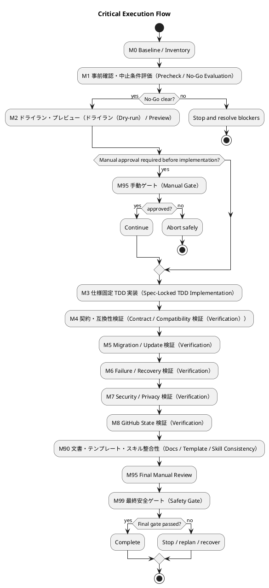

# <ISS_ID> <ISS_TITLE> — Issue 実装計画書（Critical / 安全統制付き実行（Safety-Controlled Execution））

この文書は、承認済みの `requirement.md` と `design.md` を、Critical grade の変更として安全に実行するための計画書である。

Critical gradeでは、単に実装してテストを通すだけでは不十分である。TDDでロジックの正しさを確認し、dry-run / compatibility / migration / recovery / 手動（manual） gate で安全性を確認する。

---

## 0. 文書の位置づけ

### この文書が定義すること

- このCritical Issueをどの順序で実装・検証・適用するか
- どのマイルストーン（Milestone）で何を安全に確認するか
- どのTDD Cycleでロジックを検証するか
- どの安全ゲート（Safety Gate）を通過する必要があるか
- どの手動（manual） gateを通過する必要があるか
- migration / update / rollback / forward-only をどう扱うか
- ユーザー作成物（user-authored artifacts）をどう保護するか
- partial failure / recoveryをどう検証するか
- セキュリティ・プライバシー（security / privacy） / credential / GitHub state をどう確認するか
- `report.md` にどの証拠を残すか
- 実装・適用を停止するNo-Go条件

### 計画 Criticalの原則（Critical Plan）

- 安全性が実装速度より優先される
- 破壊的変更は、明示的に設計され、手動（manual） gateを通過しない限り実行しない
- ユーザー作成物（user-authored artifacts）を暗黙に削除・上書き・移動しない
- dry-run可能なものは、原則としてdry-runを先に実行する
- partial failureがあり得る場合、recovery pathを先に定義する
- rollback不能な場合は、forward-only strategyと手動（manual） approvalを必須にする
- セキュリティ・プライバシー（security / privacy） / credentialに関係する場合、出力・ログ・reportへの漏洩を防ぐ
- GitHub state mutationがある場合、対象と変更内容を事前に明示し、手動（manual） approvalを通す
- 実装中にNo-Go条件へ該当した場合、即停止する

---

## 1. 実行 Critical開始条件（Critical Execution Readiness）

### 必須入力（Required Inputs）

| 作業成果物（Artifact） | 状態 | 確認事項 |
|---|---|---|
| `requirement.md` | 下書き / 承認済み（draft / approved） | AC、BH、CON、Critical判定材料がある |
| `design.md` | 下書き / 承認済み（draft / approved） | 安全契約（Safety Contract）、Risk 統制（Control）、手動ゲート（Manual Gate）、Transition Designがある |
| `report.md` | 存在 / 欠落（exists / missing） | 実行証拠の記録先がある |
| 親Epic design | 確認済み / N/A（reviewed / N/A） | 継承すべき制約が確認済み |
| 親Initiative design | 確認済み / N/A（reviewed / N/A） | 戦略的制約に矛盾しない |
| ADR / architecture docs | 確認済み / N/A（reviewed / N/A） | 上位判断が必要な場合に確認済み |
| Security / privacy policy | 確認済み / N/A（reviewed / N/A） | 関連制約が確認済み |
| ポリシー（GitHub policy） | 確認済み / N/A（reviewed / N/A） | GitHub state mutationがある場合に確認済み |
| 既存テスト（Existing tests） | 確認済み / N/A（reviewed / N/A） | 既存保証と回帰範囲が把握されている |
| Existing workspace inventory | 確認済み / N/A（reviewed / N/A） | 変更・保護対象が把握されている |

### 計画開始条件（Plan）

- [ ] `requirement.md` が承認済み、または実装計画作成に十分な状態である
- [ ] `design.md` が承認済み、または計画への引き渡し（Plan Handoff）が記載済みである
- [ ] No-Go条件が残っていない
- [ ] リスク Critical要約（Critical Risk Summary）が記載されている
- [ ] 安全契約（Safety Contract）が定義されている
- [ ] 保護対象（Protected Assets）が列挙されている
- [ ] migration / update / rollback / forward-only方針が明示されている
- [ ] partial failure / recovery方針が明示されている
- [ ] セキュリティ・プライバシー（security / privacy） / credential影響が確認されている
- [ ] GitHub state mutationの有無が確認されている
- [ ] 手動（manual） gateが定義されている
- [ ] `report.md` への証拠記録方針がある

### 中止条件確認（No-Go）

| 中止条件識別子（No-Go ID） | 条件 | 状態 | 対応 |
|---|---|---|---|
| NG-001 | 影響範囲が不明である | 通過 / blocked（clear / blocked） | ... |
| NG-002 | destructive operationの有無が不明である | 通過 / blocked（clear / blocked） | ... |
| NG-003 | ユーザー作成物（user-authored artifact）の保護方針が不明である | 通過 / blocked（clear / blocked） | ... |
| NG-004 | rollbackまたはforward-only方針が不明である | 通過 / blocked（clear / blocked） | ... |
| NG-005 | partial failure時の状態が不明である | 通過 / blocked（clear / blocked） | ... |
| NG-006 | セキュリティ・プライバシー（security / privacy）影響が不明である | 通過 / blocked（clear / blocked） | ... |
| NG-007 | GitHub state mutationの有無が不明である | 通過 / blocked（clear / blocked） | ... |
| NG-008 | 手動（manual） gateの承認者が不明である | 通過 / blocked（clear / blocked） | ... |
| NG-009 | 上位判断が未承認である | 通過 / blocked（clear / blocked） | ... |
| NG-010 | 失敗時の復旧方法がない | 通過 / blocked（clear / blocked） | ... |

---

## 2. 実行 Critical戦略（Critical Execution Strategy）

```text
受け入れ Critical範囲（Acceptance Envelope）
└── 安全統制付き実行（Safety-Controlled Execution）
    ├── M0 Baseline / Inventory
    ├── M1 事前確認・中止条件評価（Precheck / No-Go Evaluation）
    ├── M2 ドライラン・プレビュー（ドライラン（Dry-run） / Preview）
    ├── M3 仕様固定 TDD 実装（Spec-Locked TDD Implementation）
    ├── M4 契約・互換性検証（Contract / Compatibility 検証（Verification））
    ├── M5 移行・更新・遷移検証（Migration / Update / Transition 検証（Verification））
    ├── M6 失敗・部分失敗・復旧検証（Failure / Partial Failure / Recovery 検証（Verification））
    ├── M7 セキュリティ・プライバシー・認証情報検証（Security / Privacy / Credential 検証（Verification））
    ├── M8 GitHub 状態変更検証（GitHub State Mutation 検証（Verification））
    ├── M90 文書・テンプレート・スキル整合性（Docs / Template / Skill Consistency）
    ├── M95 手動承認・レビューゲート（Manual Approval / Review Gates）
    └── M99 最終安全ゲート（Safety Gate）
```

### TDD の Red 方針（TDD Red Policy）

| Red種別 | 許容数 | 扱い |
|---|---:|---|
| Intentional outer Red | 最大1 | マイルストーン（Milestone）のguiding testとして許容 |
| Intentional inner Red | 最大1 | 現在の実行中の TDD サイクル（Active TDD Cycle）のみ |
| Existing regression Red | 0 | 発生したら即停止 |
| Contract Red | 最大1 | contract変更対象のCycleのみ |
| Compatibility Red | 最大1 | compatibility検証Cycleのみ |
| Migration ドライラン（Dry-run） Red | 最大1 | migration設計確認のCycleのみ |
| Recovery Red | 最大1 | failure / recovery検証Cycleのみ |
| Security / Privacy Red | 0 | 発見したら即停止・設計確認 |
| Unknown Red | 0 | 原因を確認するまで実装へ進まない |

Red代替証跡（Red Alternative）:

| 対象 | Red分類 | 理由 | 代替証拠 |
|---|---|---|---|
| ... | migration-dry-run-first / 手動（manual）-required | ... | ... |

---

## 3. 範囲・保護対象・変更面（対象範囲（Scope）, Protected Assets, and Change Surface）

### 許可変更面（Allowed Change Surface）

| 種別 | パス・対象（Path / Target） | 許可する変更 | 関連設計識別子（Design ID） |
|---|---|---|---|
| コード（code） | ... | ... | `DES-...` |
| テスト（tests） | ... | ... | `DES-...` |
| 文書（docs） | ... | ... | `DES-...` |
| テンプレート（templates） | ... | ... | `DES-...` |
| スキル群（skills） | ... | ... | `DES-...` |
| scripts | ... | ... | `DES-...` |
| metadata | ... | ... | `DES-...` |
| contracts | ... | ... | `CTR-...` |
| migration/update | ... | ... | `MIG-...` |
| GitHub state | ... | ... | `GH-...` |

### 禁止変更（Forbidden Changes）

| 対象 | 禁止理由 | 必要になった場合の対応 |
|---|---|---|
| ... | ... | stop / no-go / escalate / 後続（follow-up） / ADR |

### 保護対象（Protected Assets）

| Asset 識別子（ID） | 対象 | 種別 | 保護方針 | 変更可否 |
|---|---|---|---|---|
| PA-001 | ... | user-authored / generated / external / metadata / secret | preserve / backup / read-only / 手動（manual）-gated | いいえ / gateあり / はい（no / gated / yes） |
| PA-002 | ... | ... | ... | ... |

### 提供側・利用側反映（Provider / Consumer）

| 対象 | 変更要否 | 対応 |
|---|---|---|
| `src/spec_dock/assets/...` | はい / いいえ / 不明（yes / no / unknown） | ... |
| ワークスペース（root `spec-dock/...`） | はい / いいえ / 不明（yes / no / unknown） | ... |
| generated consumer workspace | はい / いいえ / 不明（yes / no / unknown） | ... |
| existing user workspace | はい / いいえ / 不明（yes / no / unknown） | ... |

---

## 4. 実行フロー概要（Execution Flow Overview）



---

## 5. 受け入れ Critical範囲（Acceptance Envelope）

### 受け入れ成果（Acceptance Outcomes）

| 成果識別子（Outcome ID） | 内容 | 関連AC | 関連設計識別子（Design ID） | 完了証拠 |
|---|---|---|---|---|
| OUT-001 | ... | `AC-...` | `DES-...` | `EVD-...` |
| OUT-002 | ... | `AC-...` | `DES-...` | `EVD-...` |

### 安全成果（Safety Outcomes）

| Safety 成果識別子（Outcome ID） | 内容 | 関連安全識別子（Safety ID） | 関連Risk | 完了証拠 |
|---|---|---|---|---|
| SOUT-001 | ... | `SAFE-...` | `RISK-...` | `EVD-...` |
| SOUT-002 | ... | `SAFE-...` | `RISK-...` | `EVD-...` |

### 起きてはいけないこと（Must Not Happen）

| 識別子（ID） | 内容 | 検証方法 |
|---|---|---|
| MNH-001 | ユーザー作成物（user-authored artifact）を無断上書きしない | ドライラン / 差分 / 手動確認（dry-run / diff / manual） |
| MNH-002 | secretをreport.mdやCLI outputへ出力しない | 点検（inspect） / security check |
| MNH-003 | partial failure後にworkspaceを読み取り不能にしない | 失敗注入・復旧（failure injection / recovery） |
| MNH-004 | GitHub stateを承認なしに変更しない | dry-run / 手動（manual） gate |
| MNH-005 | destructive migrationを自動実行しない | migration gate |

---

## 6. 安全固定クロージャ一覧（Safety-Locked クロージャ（Closure） Index）

Requirement クロージャ（Closure）:

| クロージャ識別子（Closure ID） | 要件識別子（Requirement ID） | 設計識別子（Design ID） | 閉じる内容 | 検証レベル（Verification Level） | 報告証跡（Report Evidence） |
|---|---|---|---|---|---|
| CLOS-001 | AC-001 | DES-001 | ... | unit・CLI・テンプレート・文書 | `report.md#...` |

Safety クロージャ（Closure）:

| Safety クロージャ識別子（Closure ID） | 安全識別子（Safety ID） | リスク識別子（Risk ID） | 統制識別子（Control ID） | 閉じる内容 | 検証（Verification） | 報告証跡（Report Evidence） |
|---|---|---|---|---|---|---|
| SAFE-CLOS-001 | SAFE-001 | RISK-001 | CTRL-001 | ... | ドライラン・手動・復旧（dry-run / 手動（manual） / recovery） | `report.md#...` |

Contract クロージャ（Closure）:

| Contract クロージャ識別子（Closure ID） | Contract 識別子（ID） | 内容 | 検証（Verification） | 報告証跡（Report Evidence） |
|---|---|---|---|---|
| CTR-CLOS-001 | `CTR-...` | ... | 契約・互換性（契約・互換性（contract / compatibility）） | `report.md#...` |

Migration / Transition クロージャ（Closure）:

| Migration クロージャ識別子（Closure ID） | Migration / Transition 識別子（ID） | 内容 | 検証（Verification） | 報告証跡（Report Evidence） |
|---|---|---|---|---|
| MIG-CLOS-001 | `MIG-...` | ... | ドライラン / migration / rollback（dry-run / migration / rollback） | `report.md#...` |

Recovery クロージャ（Closure）:

| Recovery クロージャ識別子（Closure ID） | Failure / Recovery 識別子（ID） | 内容 | 検証（Verification） | 報告証跡（Report Evidence） |
|---|---|---|---|---|
| REC-CLOS-001 | `REC-...` | ... | 失敗注入・復旧（failure injection / recovery） | `report.md#...` |

---

## 7. リスク統制実行表（Risk-統制（Control） Execution Matrix）

| リスク識別子（Risk ID） | リスク（Risk） | 統制識別子（Control ID） | 実行マイルストーン（Milestone） | 検証（Verification） | 報告証跡（Report Evidence） |
|---|---|---|---|---|---|
| RISK-001 | ... | CTRL-001 | M2 / M5 / M6 | dry-run / recovery | `report.md#...` |
| RISK-002 | ... | CTRL-002 | M7 | security check | `report.md#...` |

---

## 8. 振る舞い・安全バックログ（Behavior and Safety Backlog）

| バックログ識別子（ID）Backlog ID） | 種別 | マイルストーン（Milestone） | 振る舞い / Safety保証 | 関連クロージャ（Closure） | 依存 | 優先度 | 状態 |
|---|---|---|---|---|---|---|---|
| B-001 | 振る舞い（behavior） | M3 | ... | `CLOS-...` | none | high | ready |
| SAFE-B-001 | safety | M2 | dry-runで差分を確認できる | SAFE-`CLOS-...` | none | high | planned |
| COMP-B-001 | compatibility | M4 | 旧形式を読み取れる | CTR-`CLOS-...` | B-001 | high | planned |
| MIG-B-001 | 移行（migration） | M5 | migration dry-runが安全に完了する | MIG-`CLOS-...` | SAFE-B-001 | high | planned |
| REC-B-001 | recovery | M6 | partial failureから復旧できる | REC-`CLOS-...` | MIG-B-001 | high | planned |

---

## 9. 実行中の Critical 作業項目（Active Critical Work Item）

- Work ID:
  - `B-...` / SAFE-`B-...` / MIG-`B-...` / REC-`B-...`
- 種別:
  - behavior / safety / 契約・互換性（契約・互換性（contract / compatibility）） / migration / recovery / security / GitHub / docs
- 関連マイルストーン（Milestone）:
  - M...
- 関連クロージャ（Closure）:
  - `CLOS-...`
- 関連Risk:
  - `RISK-...`
- 関連統制（Control）:
  - `CTRL-...`
- 関連設計識別子（Design ID）:
  - `DES-...`
- なぜ次に実行するか:
  - ...
- 分割判断:
  - one-cycle / split-required / gate-required / 手動（manual）-required

Work Acceptance:

- Given:
  - ...
- When:
  - ...
- Then:
  - ...
- Safety expectation:
  - ...
- 観測点:
  - ...

Work 対象範囲（Scope）:

| 項目 | 内容 |
|---|---|
| Allowed paths | ... |
| Forbidden paths | ... |
| Protected assets | ... |
| Required precheck | ... |
| Required dry-run | ... |
| Required 手動（manual） gate | ... |
| Required tests / checks | ... |
| Report証跡記録先（Report evidence destination） | ... |
| Stop conditions | ... |

---

## 10. 実行中の TDD・安全サイクル（Active TDD / Safety Cycle）

- Cycle ID:
  - CRIT-CYCLE-...
- Parent Work:
  - `B-...` / SAFE-`B-...`
- Cycle type:
  - red-green-refactor / characterization / contract-first / compatibility-first / migration-dry-run-first / failure-injection-first / recovery-first / security-review-first / github-dry-run-first / 点検（inspect）-only / 手動（manual）-required
- Related クロージャ（Closure）:
  - `CLOS-...`
- Related Safety クロージャ（Closure）:
  - SAFE-`CLOS-...`
- Related Risk:
  - `RISK-...`
- 関連設計識別子（Design ID）:
  - `DES-...`

Hypothesis:

```text
...
```

Evidence Plan:

- Evidence分類:
  - red-required / dry-run-required / failure-injection-required / security-review-required / 手動（manual）-required / 点検（inspect）-only / not-applicable
- 期待するRed / dry-run / failure理由:
  - ...
- 期待と異なる場合の対応:
  - stop / repair test / replan / no-go / escalate

Safety Evidence:

| 対象 | 検証方法 | 期待結果 | 報告先（Report Destination） |
|---|---|---|---|
| Protected asset | ... | no overwrite / no delete | `report.md#...` |
| ドライラン（Dry-run） | ... | intended diff only | `report.md#...` |
| Migration | ... | non-destructive / approved | `report.md#...` |
| Recovery | ... | recoverable | `report.md#...` |
| セキュリティ・プライバシー（Security / privacy） | ... | no leak / no unsafe output | `report.md#...` |
| 外部状態変更（GitHub mutation） | ... | no mutation without gate | `report.md#...` |

Minimal Safe Change Boundary:

- Allowed implementation boundary:
  - ...
- Allowed write boundary:
  - ...
- Protected assets:
  - ...
- Do not perform destructive operation:
  - ...
- Must remain compatible with:
  - ...

---

## 11. マイルストーン計画（マイルストーン（Milestone） Plans）

### M0: ベースライン・棚卸し（Baseline / Inventory）

| Check | コマンド（Command） / Evidence | 期待結果 | 報告先（Report Destination） |
|---|---|---|---|
| Target inventory | ... | target listed | `report.md#...` |
| Protected asset inventory | ... | protected assets listed | `report.md#...` |
| Current contract 基準（baseline） | ... | current shape recorded | `report.md#...` |
| Current metadata 基準（baseline） | ... | current shape recorded | `report.md#...` |
| Current test 基準（baseline） | `...` | pass / 既知失敗を記録済み | `report.md#...` |
| GitHub state 基準（baseline） | ... | current state recorded / N/A | `report.md#...` |

- commit:
  - commit候補: このマイルストーンの成果をレビュー可能な単位としてコミットする
  - commit前確認:
    - [ ] このマイルストーンの差分だけで意味が通る
    - [ ] 必要な検証が完了している
    - [ ] `report.md` に証跡がある
    - [ ] 次のマイルストーンの未完了差分が混ざっていない

### M1: 事前確認・中止条件評価（Precheck / No-Go Evaluation）

| Precheck 識別子（ID） | 内容 | 結果 | 報告先（Report Destination） |
|---|---|---|---|
| PRE-001 | destructive operation有無 | 通過 / blocked（clear / blocked） | `report.md#...` |
| PRE-002 | ユーザー作成物（user-authored artifact）保護 | 通過 / blocked（clear / blocked） | `report.md#...` |
| PRE-003 | rollback / forward-only方針 | 通過 / blocked（clear / blocked） | `report.md#...` |
| PRE-004 | セキュリティ・プライバシー（security / privacy）影響 | 通過 / blocked（clear / blocked） | `report.md#...` |
| PRE-005 | GitHub mutation影響 | 通過 / blocked（clear / blocked） | `report.md#...` |

- commit:
  - commit候補: このマイルストーンの成果をレビュー可能な単位としてコミットする
  - commit前確認:
    - [ ] このマイルストーンの差分だけで意味が通る
    - [ ] 必要な検証が完了している
    - [ ] `report.md` に証跡がある
    - [ ] 次のマイルストーンの未完了差分が混ざっていない

### M2: ドライラン・プレビュー（ドライラン（Dry-run） / Preview）

| ドライラン（Dry-run） 識別子（ID） | 対象 | 方法 | 期待結果 | 報告先（Report Destination） |
|---|---|---|---|---|
| DRY-001 | ... | ... | no write / expected diff | `report.md#...` |
| DRY-002 | ... | ... | protected assets untouched | `report.md#...` |

- commit:
  - commit候補: このマイルストーンの成果をレビュー可能な単位としてコミットする
  - commit前確認:
    - [ ] このマイルストーンの差分だけで意味が通る
    - [ ] 必要な検証が完了している
    - [ ] `report.md` に証跡がある
    - [ ] 次のマイルストーンの未完了差分が混ざっていない

### M3: 仕様固定 TDD 実装（Spec-Locked TDD Implementation）

| Work 識別子（ID） | 内容 | クロージャ（Closure） | 状態 |
|---|---|---|---|
| B-001 | ... | `CLOS-...` | planned |
| B-XXX | 必要に応じて連番で追加する。`XXX` は実IDへ置換するか削除する。 | `CLOS-...` | planned |

- commit:
  - commit候補: このマイルストーンの成果をレビュー可能な単位としてコミットする
  - commit前確認:
    - [ ] このマイルストーンの差分だけで意味が通る
    - [ ] 必要な検証が完了している
    - [ ] `report.md` に証跡がある
    - [ ] 次のマイルストーンの未完了差分が混ざっていない

### M4: 契約・互換性検証（Contract / Compatibility 検証（Verification））

| Contract 識別子（ID） | 対象 | 期待状態 | 検証 |
|---|---|---|---|
| CTR-001 | ... | ... | ... |

- commit:
  - commit候補: このマイルストーンの成果をレビュー可能な単位としてコミットする
  - commit前確認:
    - [ ] このマイルストーンの差分だけで意味が通る
    - [ ] 必要な検証が完了している
    - [ ] `report.md` に証跡がある
    - [ ] 次のマイルストーンの未完了差分が混ざっていない

### M5: 移行・更新・遷移検証（Migration / Update / Transition 検証（Verification））

| ステップID（Step ID） | 内容 | 破壊的変更なし確認 | Manual ゲート（Gate） | 報告先（Report Destination） |
|---|---|---|---|---|
| MIG-STEP-001 | inventory | はい（yes） | いいえ（no） | `report.md#...` |
| MIG-STEP-002 | dry-run | はい（yes） | いいえ（no） | `report.md#...` |
| MIG-STEP-003 | apply | はい / いいえ（yes / no） | はい / いいえ（yes / no） | `report.md#...` |

- commit:
  - commit候補: このマイルストーンの成果をレビュー可能な単位としてコミットする
  - commit前確認:
    - [ ] このマイルストーンの差分だけで意味が通る
    - [ ] 必要な検証が完了している
    - [ ] `report.md` に証跡がある
    - [ ] 次のマイルストーンの未完了差分が混ざっていない

### M6: 失敗・部分失敗・復旧検証（Failure / Partial Failure / Recovery 検証（Verification））

| Failure 識別子（ID） | 条件 | 検証方法 | 期待結果 | 報告先（Report Destination） |
|---|---|---|---|---|
| FAIL-001 | ... | ... | ... | `report.md#...` |

- commit:
  - commit候補: このマイルストーンの成果をレビュー可能な単位としてコミットする
  - commit前確認:
    - [ ] このマイルストーンの差分だけで意味が通る
    - [ ] 必要な検証が完了している
    - [ ] `report.md` に証跡がある
    - [ ] 次のマイルストーンの未完了差分が混ざっていない

### M7: セキュリティ・プライバシー・認証情報検証（Security / Privacy / Credential 検証（Verification））

| 確認識別子（ID）Check ID） | 内容 | 方法 | 期待結果 | 報告先（Report Destination） |
|---|---|---|---|---|
| SEC-001 | secretsが出力されない | 点検（inspect） / test | pass | `report.md#...` |
| SEC-002 | private dataがreportに出ない | 点検（inspect） | pass | `report.md#...` |

- commit:
  - commit候補: このマイルストーンの成果をレビュー可能な単位としてコミットする
  - commit前確認:
    - [ ] このマイルストーンの差分だけで意味が通る
    - [ ] 必要な検証が完了している
    - [ ] `report.md` に証跡がある
    - [ ] 次のマイルストーンの未完了差分が混ざっていない

### M8: GitHub 状態変更検証（GitHub State Mutation 検証（Verification））

GitHub state mutationがない場合は `N/A` と記述する。

| 変更ID（Mutation ID） | 対象 | 変更（Mutation） | ドライラン（Dry-run） | Manual ゲート（Gate） | 報告先（Report Destination） |
|---|---|---|---|---|---|
| GH-001 | Issue / Label / Comment / PR | ... | required / N/A | required / N/A | `report.md#...` |

- commit:
  - commit候補: このマイルストーンの成果をレビュー可能な単位としてコミットする
  - commit前確認:
    - [ ] このマイルストーンの差分だけで意味が通る
    - [ ] 必要な検証が完了している
    - [ ] `report.md` に証跡がある
    - [ ] 次のマイルストーンの未完了差分が混ざっていない

### M90: 文書・テンプレート・スキル整合性（Docs / Template / Skill Consistency）

| 対象 | 必要な対応 | 状態 |
|---|---|---|
| 文書（docs） | ... | planned |
| テンプレート（templates） | ... | planned |
| スキル群（skills） | ... | planned |

- commit:
  - commit候補: このマイルストーンの成果をレビュー可能な単位としてコミットする
  - commit前確認:
    - [ ] このマイルストーンの差分だけで意味が通る
    - [ ] 必要な検証が完了している
    - [ ] `report.md` に証跡がある
    - [ ] 次のマイルストーンの未完了差分が混ざっていない

### M95: 手動承認・レビューゲート（Manual Approval / Review Gates）

| 手動ゲート（Manual Gate） 識別子（ID） | 必須タイミング | 必要証拠 | 承認者（Approver） | 状態 |
|---|---|---|---|---|
| MG-001 | before implementation | risk summary / design approval | ... | 未完了（pending） |
| MG-002 | before migration apply | migration preview / rollback plan | ... | 未完了（pending） |
| MG-003 | before GitHub mutation | mutation preview | ... | 未完了（pending） |
| MG-004 | before final completion | 最終証跡（final evidence） | ... | 未完了（pending） |

- commit:
  - commit候補: このマイルストーンの成果をレビュー可能な単位としてコミットする
  - commit前確認:
    - [ ] このマイルストーンの差分だけで意味が通る
    - [ ] 必要な検証が完了している
    - [ ] `report.md` に証跡がある
    - [ ] 次のマイルストーンの未完了差分が混ざっていない

---

## 12. 検証 Critical段階（検証（Verification） Ladder）

| レベル（Level） | 名称 | 目的 | コマンド（Command） / Evidence |
|---|---|---|---|
| L1 | Active Cycle Focused | 現在のCycleだけを確認 | `...` |
| L2 | Local Regression | 近接範囲の回帰確認 | `...` |
| L3 | 対象範囲（Scope）回帰（範囲回帰（対象範囲（Scope） Regression）） | Issue 対象scope全体の確認 | `...` |
| L4 | Contract Check | contract互換性確認 | `...` |
| L5 | Compatibility Check | 旧形式・既存workspace確認 | `...` |
| L6 | ドライラン・プレビュー（ドライラン（Dry-run） / Preview） | 書き込み前確認 | `...` |
| L7 | Migration / Transition | migration / state確認 | `...` |
| L8 | Failure / Recovery | 失敗・復旧確認 | `...` |
| L9 | Security / Privacy | 機微情報・権限確認 | `...` |
| L10 | GitHub 変更（Mutation） | GitHub状態変更確認 | `...` |
| L11 | Static / Lint / Type | 静的検証 | `...` |
| L12 | Docs / Template / Skill | 整合性確認 | `...` |
| L13 | Manual Review | 人間承認 | ... |
| L14 | 最終安全ゲート（Safety Gate） | Issue 最終確認 | ... |

---

## 13. ゲート計画（Gate Plans）

### 契約ゲート（Contract Gate）

| Contract 識別子（ID） | 対象 | ゲート（Gate） | コマンド（Command） / Evidence | 期待結果（Expected） |
|---|---|---|---|---|
| CTR-001 | ... | CTR-GATE-001 | `...` | ... |

### 安全ゲート（Safety Gate）

| 安全ゲート（Safety Gate） 識別子（ID） | 対象 | 検証（Verification） | 期待結果（Expected） | 報告証跡（Report Evidence） |
|---|---|---|---|---|
| SAFE-GATE-001 | ユーザー作成物（user-authored artifact） 保護 | dry-run / diff | no overwrite | `report.md#...` |
| SAFE-GATE-002 | destructive operation prevention | 点検（inspect） / precheck | blocked unless approved | `report.md#...` |

### 移行・更新・遷移ゲート（Migration / Update / Transition Gate）

| 移行識別子（ID）Migration ID） | 対象 | モード（Mode） | ドライラン（Dry-run） | Manual ゲート（Gate） | 報告証跡（Report Evidence） |
|---|---|---|---|---|---|
| MIG-001 | ... | none / non-destructive / destructive / forward-only | required / N/A | required / N/A | `report.md#...` |

### セキュリティ・プライバシーゲート（Security / Privacy Gate）

| 確認識別子（ID）Check ID） | 対象 | 方法 | 期待結果（Expected） | 報告証跡（Report Evidence） |
|---|---|---|---|---|
| SEC-001 | secrets | 点検（inspect） / test | not logged | `report.md#...` |

### GitHub 状態変更ゲート（GitHub State Mutation Gate）

| 変更ID（Mutation ID） | 対象 | 変更（Mutation） | ドライラン（Dry-run） | Manual ゲート（Gate） | 報告証跡（Report Evidence） |
|---|---|---|---|---|---|
| GH-001 | Issue / Label / Comment / PR | ... | required / N/A | required / N/A | `report.md#...` |

---

## 14. 委任契約（Delegation Contract）

| Step / Work | 委任ロール（Delegated Role） | 許可パス（Allowed Paths） | レビュー観点（Reviewer Focus） | 報告先（Report Destination） |
|---|---|---|---|---|
| `B-...` | dev-coder / doc-writer / reviewer / safety-reviewer / none | ... | code / spec / safety / contract | `report.md#...` |

Delegation requirements:

- Input docs:
  - requirement.md
  - design.md
  - plan.md
- Forbidden changes:
  - ...
- Protected assets:
  - ...
- Required precheck:
  - ...
- Required dry-run:
  - ...
- Required 手動（manual） gate:
  - ...
- Stop conditions:
  - ...

---

## 15. 報告証跡対応（報告証跡（Report Evidence） Mapping）

| 証跡ID（Evidence ID） | 対象 | 報告節（Report Section） | 記録内容 |
|---|---|---|---|
| EVD-001 | Baseline / Inventory | `report.md#...` | ... |
| EVD-002 | Precheck / No-Go | `report.md#...` | ... |
| EVD-003 | ドライラン・プレビュー（ドライラン（Dry-run） / Preview） | `report.md#...` | ... |
| EVD-004 | Red / Alternative Evidence | `report.md#...` | ... |
| EVD-005 | Green検証（Green Verification） | `report.md#...` | ... |
| EVD-006 | Contract Evidence | `report.md#...` | ... |
| EVD-007 | Compatibility Evidence | `report.md#...` | ... |
| EVD-008 | Migration / Update Evidence | `report.md#...` | ... |
| EVD-009 | Rollback / Forward-only Evidence | `report.md#...` | ... |
| EVD-010 | Failure / Recovery Evidence | `report.md#...` | ... |
| EVD-011 | Security / Privacy Evidence | `report.md#...` | ... |
| EVD-012 | GitHub 変更（Mutation） Evidence | `report.md#...` | ... |
| EVD-013 | 手動ゲート（Manual Gate） Evidence | `report.md#...` | ... |
| EVD-014 | Review Evidence | `report.md#...` | ... |
| EVD-015 | 最終安全ゲート（Safety Gate） | `report.md#...` | ... |

---

## 16. 修正・停止・中止ルール（Amendment, Stop, and No-Go Rules）

即時停止条件（Immediate Stop Conditions）:

- [ ] 承認済みDesignの安全契約（Safety Contract）を変更したくなる
- [ ] public / shared contract変更が想定を超える
- [ ] migrationが破壊的になる
- [ ] rollback / recoveryが成立しない
- [ ] compatibilityを保てない
- [ ] ユーザー作成物（user-authored artifact）を保護できない
- [ ] secret / private dataが出力される可能性がある
- [ ] GitHub mutationが想定を超える
- [ ] 手動（manual） gateを通せない
- [ ] partial failureを安全に扱えない
- [ ] 中止条件（No-Go Conditions）に該当する

停止後の対応（Stop）:

| 状況 | 対応 |
|---|---|
| 安全契約（Safety Contract）変更が必要 | 設計書（design.md）を更新し手動（manual） review |
| Migrationが破壊的 | 手動（manual） gate / split issue / no-go |
| Security / privacy影響 | security review / no-go |
| User artifact保護不可 | no-go / redesign |
| GitHub mutation不明 | dry-run / 手動（manual） review / no-go |
| 外部判断が必要 | 上位文書（Epic・Initiative・ADR）へ昇格 |

---

## 17. 文書・テンプレート・スキル影響解消（Docs / Template / Skill 影響（Impact） Resolution）

| 対象 | 影響 | 必要な対応 | 報告証跡（Report Evidence） |
|---|---|---|---|
| 文書（docs） | はい / いいえ / 不明（yes / no / unknown） | ... | `report.md#...` |
| テンプレート（templates） | はい / いいえ / 不明（yes / no / unknown） | ... | `report.md#...` |
| スキル群（skills） | はい / いいえ / 不明（yes / no / unknown） | ... | `report.md#...` |
| ワークフロー文書（workflow docs） | はい / いいえ / 不明（yes / no / unknown） | ... | `report.md#...` |
| 提供資産（provider assets） | はい / いいえ / 不明（yes / no / unknown） | ... | `report.md#...` |
| 検証workspace（dogfooding workspace） | はい / いいえ / 不明（yes / no / unknown） | ... | `report.md#...` |

---

## 18. 手動承認とレビューゲート（Manual Approval and Review Gates）

### 必須手動ゲート（Required 手動ゲート（Manual Gate）s）

| 手動ゲート（Manual Gate） 識別子（ID） | 必須タイミング | 必要証拠 | 承認者（Approver） | 状態 |
|---|---|---|---|---|
| MG-001 | before implementation | risk summary / design approval | ... | 未完了（pending） |
| MG-002 | before dry-run apply | dry-run preview | ... | 未完了（pending） |
| MG-003 | before migration apply | migration preview / rollback plan | ... | 未完了（pending） |
| MG-004 | before GitHub mutation | mutation preview | ... | 未完了（pending） |
| MG-005 | before final completion | 最終証跡（final evidence） | ... | 未完了（pending） |

### 必須レビュー（Required Reviews）

| Review 識別子（ID） | Review対象 | Reviewer | Focus | Blocking |
|---|---|---|---|---|
| REV-001 | requirement alignment | ... | AC / BH / CON | はい（yes） |
| REV-002 | risk / control | ... | risk coverage | はい（yes） |
| REV-003 | design contract | ... | safety / compatibility / migration | はい（yes） |
| REV-004 | plan | ... | gates / no-go / evidence | はい（yes） |
| REV-005 | 実装差分（implementation diff） | ... | safety / tests / docs | はい（yes） |
| REV-006 | セキュリティ・プライバシー（security / privacy） | ... | sensitive data / credential | はい / いいえ（yes / no） |
| REV-007 | 最終report（final report） | ... | 証跡完全性（evidence completeness） | はい（yes） |

---

## 19. 最終安全ゲート（Final Safety Gate）

### 必須最終確認（Required Final Checks）

| Check | コマンド（Command） / Evidence | 期待結果（Expected） | 報告先（Report Destination） |
|---|---|---|---|
| Requirement closure | 点検（inspect） closure index | all closed | `report.md#...` |
| Risk統制closure（Risk control closure） | 点検（inspect） risk-control matrix | すべて統制済み | `report.md#...` |
| Safety contract compliance | 点検（inspect） SAFE IDs | 違反なし | `report.md#...` |
| Focused tests | `...` | pass | `report.md#...` |
| Contract checks | `...` | pass | `report.md#...` |
| Compatibility checks | `...` | pass | `report.md#...` |
| ドライラン（Dry-run） evidence | `...` / report | complete | `report.md#...` |
| Migration / update checks | `...` | pass / N/A | `report.md#...` |
| Rollback / forward-only checks | `...` / review | accepted | `report.md#...` |
| Failure / recovery checks | `...` | pass / N/A | `report.md#...` |
| Security / privacy checks | `...` / review | pass / N/A | `report.md#...` |
| GitHub mutation checks | `...` / review | pass / N/A | `report.md#...` |
| Docs / template / skill checks | `...` | pass / N/A | `report.md#...` |
| Manual gates | approval records | approved | `report.md#...` |
| Final review | ... | approved | `report.md#...` |

- static analysis / lint:
  - 実行対象: このリポジトリで設定されている静的解析、lint、format check
  - pass条件: 既知の許容済み例外を除き成功する
- tests:
  - 実行対象: 単体テスト、およびこのIssueの影響範囲に必要な統合テスト / CLIテスト / regression test
  - pass条件: すべて成功する
  - 追加観点: compatibility / migration dry-run / recovery / security privacy / GitHub state mutation / scaffold への影響がある場合は必要な安全検証を含める
  - 実行できない検証がある場合: 未実施理由、代替確認、残リスクを `report.md` に記録する
- report:
  - [ ] 実行したコマンド、結果、未実施の理由を `report.md` に記録する
  - [ ] PR 作成後の GitHub Actions を、基礎的な lint / test 失敗の初回検出場所にしていない
- commit:
  - commit候補: このマイルストーンの成果をレビュー可能な単位としてコミットする
  - commit前確認:
    - [ ] 静的解析 / lint が完了している
    - [ ] 必要なテストが完了している
    - [ ] `report.md` に証跡がある
    - [ ] 未完了差分が混ざっていない

最終終了契約（Final Exit Contract）:

- [ ] すべてのRequirement クロージャ識別子（Closure ID）が完了している
- [ ] すべてのSafety クロージャ識別子（Closure ID）が完了している
- [ ] すべてのRisk 統制（Control）が完了している
- [ ] すべてのContract クロージャ識別子（Closure ID）が完了している
- [ ] すべてのMigration / Transition クロージャ識別子（Closure ID）が完了している
- [ ] すべてのRecovery クロージャ識別子（Closure ID）が完了している
- [ ] すべてのマイルストーン（Milestone）が完了している
- [ ] ドライラン・プレビュー（ドライラン（Dry-run） / Preview） evidenceがある
- [ ] Migration / Update / Transitionが必要な場合、検証済み
- [ ] Rollbackまたはforward-only方針が承認済み
- [ ] Failure / Recoveryが検証済み
- [ ] Security / Privacy / Credential確認が完了
- [ ] GitHub mutationがある場合、安全に検証・承認済み
- [ ] 必要な手動ゲート（Manual Gate）がすべて承認済み
- [ ] Report evidenceが記録済み
- [ ] 残余リスクが承認済み
- [ ] No-Go条件に該当していない

---

## 20. フォローアップ候補（Follow-up Candidates）

| 識別子（ID） | 内容 | 理由 | 推奨先 |
|---|---|---|---|
| FU-001 | ... | ... | Issue / Epic / ADR |
| FU-002 | ... | ... | Issue / Epic / ADR |

---

## 21. 計画 Critical承認チェックリスト（Plan Approval Checklist）

- [ ] requirement.mdのAC / BH / CONがクロージャ（Closure） Indexへ対応している
- [ ] design.mdの安全契約（Safety Contract）がPlanに反映されている
- [ ] design.mdのRisk 統制（Control）がPlanに反映されている
- [ ] design.mdの契約差分（Contract Delta）が契約ゲート（Contract Gate）へ反映されている
- [ ] design.mdの移行アーキテクチャ（Transition Architecture）がマイルストーン（Milestone）へ反映されている
- [ ] design.mdのMigration / Rollback / RecoveryがGateへ反映されている
- [ ] design.mdのSecurity / Privacy方針がGateへ反映されている
- [ ] design.mdの手動ゲート（Manual Gate）がPlanに反映されている
- [ ] No-Go条件が明確である
- [ ] 保護対象（Protected Assets）が明確である
- [ ] ドライラン・プレビュー（ドライラン（Dry-run） / Preview）が計画されている
- [ ] destructive operationがある場合、手動（manual） gateがある
- [ ] ユーザー作成物（user-authored artifact）保護が計画されている
- [ ] partial failure / recoveryが計画されている
- [ ] rollbackまたはforward-onlyが計画されている
- [ ] 報告証跡（Report Evidence） Destinationが明示されている
- [ ] 手動ゲート（Manual Gate）が必要箇所にある
- [ ] Review Gateがある

---

## 22. 変更履歴

| 日付（Date） | 変更（Change） | 理由（Reason） | 作成者（Author） |
|---|---|---|---|
| YYYY-MM-DD | 初稿（Initial draft） | ... | ... |
