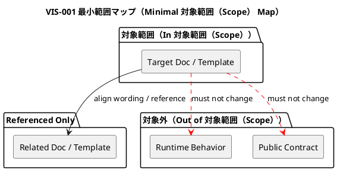

# <ISS_ID> <ISS_TITLE> — Issue 設計書（Lite）

この文書は、`lite` grade のIssueに対する軽量な設計記録である。

`lite` は設計不要を意味しない。
このIssueが軽量設計で十分である理由、変更範囲、変更しない領域、影響がないことの確認、検証方針を明示する。

詳細な設計判断、契約設計、migration設計、TDDサイクル設計が必要になった場合、このIssueは `standard` 以上へ引き上げる。

---

## 0. 文書の位置づけ

### この文書が定義すること

- このIssueが `lite` grade で十分である理由
- このIssueで変更する対象
- このIssueで変更しない対象
- 実行時振る舞い（runtime behavior）、public contract、migration、security/privacy に影響しないことの確認
- 軽量な設計判断
- 必要な検証方針
- `plan.md` への引き渡し

### この文書が定義しないこと

- 新しいドメインモデル
- Aggregate / Entity / Value Object の設計
- Application Service / Repository / Port / Adapter の設計
- public CLI / API / Event / Schema contract の設計
- migration / compatibility / rollback strategy
- セキュリティ・プライバシー（security / privacy） / authorization design
- 詳細なRed-Green-Refactorサイクル

### 設計コミットメント

| タグ | 意味 | 変更条件 |
|---|---|---|
| `[N]` | 実装が必ず従う軽量設計契約 | 設計書の更新が必要 |
| `[P]` | 現時点の軽量な設計仮説 | 意味論を維持すれば実装中に変更可能 |
| `[I]` | 理解のための例示 | 実装を拘束しない |
| `[O]` | 未解決事項 | 指定された段階までに解決する |
| `[E]` | この Issue の判断範囲外 | 上位文書（Epic・Initiative・ADR）へ昇格する |

---

## 1. 等級 Lite（Lite Grade）確認

### 1.1 Liteとして扱う理由

- 推奨grade:
  - `lite`
- liteで十分な理由:
  - ...
- 等級standard以上が不要な理由:
  - ...
- 主な変更対象:
  - ...
- 想定される検証:
  - ...

### 1.2 Liteの前提

このIssueは、次をすべて満たす必要がある。

- [ ] 文書のみ（docs-only）、または実行時振る舞い（runtime behavior）を変えない軽微な変更である
- [ ] 公開 CLI 契約（public CLI contract）を変更しない
- [ ] 公開 API 契約（public API contract）を変更しない
- [ ] Event / message / schema contractを変更しない
- [ ] テンプレート契約（template contract）を変更しない、または文言・説明のみの変更である
- [ ] ワークスペース scaffold結果の構造を変更しない
- [ ] `.meta.json`、`.assurance.json`、`.agent/*.json` の意味を変更しない
- [ ] sync / validate / active / lifecycle の挙動を変更しない
- [ ] migrationまたは既存ファイル変換を伴わない
- [ ] セキュリティ・プライバシー（security / privacy） / secret / credential に影響しない
- [ ] 切り戻し（rollback）が容易である
- [ ] 複数Issue、Epic、Initiativeにまたがる設計判断を含まない

### 1.3 証跡 Liteゲート（Lite Evidence Gate）

| 確認項目 | 結果 | 根拠 |
|---|---|---|
| 実行時振る舞い変更なし（実行時振る舞い（runtime behavior）） | はい / いいえ / 不明（yes / no / unknown） | ... |
| 公開契約変更なし（public contract） | はい / いいえ / 不明（yes / no / unknown） | ... |
| 移行不要（migration） | はい / いいえ / 不明（yes / no / unknown） | ... |
| セキュリティ・プライバシー影響なし（security/privacy） | はい / いいえ / 不明（yes / no / unknown） | ... |
| ロールバック容易（rollback） | はい / いいえ / 不明（yes / no / unknown） | ... |
| 文書・テンプレートの局所変更に留まる（docs/template） | はい / いいえ / 不明（yes / no / unknown） | ... |

`no` または `unknown` が残る場合は、原則として `standard` 以上へ引き上げる。

### 1.4 等級引き上げガード（Grade Escalation Guard）

次が判明した場合、作業を停止してgradeを引き上げる。

- [ ] 実行時振る舞い（runtime behavior）を変更する
- [ ] 新しい実装ロジックを追加する
- [ ] 既存テストの期待値変更が必要になる
- [ ] public contractを変更する
- [ ] テンプレート契約（template contract）を変更する
- [ ] scaffold結果に影響する
- [ ] sync / validate / active / lifecycleに影響する
- [ ] metadataやgenerated indexに影響する
- [ ] migrationまたは既存ファイル変換が必要になる
- [ ] セキュリティ・プライバシー（security / privacy） / secret / credential に関係する
- [ ] ユーザー作成物を自動削除・自動上書きする

### 1.5 引き上げ結果（Escalation）

- Escalation要否:
  - なし / standard / strict / critical / unknown
- 理由:
  - ...
- 必要な対応:
  - ...

---

## 2. 設計意図

### 2.1 変更の目的

- ...
- ...

### 2.2 軽量設計で十分な理由

- ...
- ...

### 2.3 採用する方針

- `[N]` ...
- `[N]` ...
- `[P]` ...

### 2.4 採用しない方針

| 方針 | 採用しない理由 |
|---|---|
| ... | ... |

---

## 3. 正本・根拠（Normative Sources）

| 種別 | パス・識別子（Path / ID） | 関連箇所 | このIssueへの意味 |
|---|---|---|---|
| 課題要件（Issue Requirement） | `requirement.md` | `AC-...` / `BH-...` / `CON-...` | ... |
| エピック設計（Epic Design） | ... | ... | ... |
| イニシアチブ設計（Initiative Design） | ... | ... | ... |
| ADR（意思決定記録） | ... | ... | ... |
| 現行文書（Current docs） | ... | ... | ... |
| 現行テンプレート（Current template） | ... | ... | ... |
| 既存テスト（Existing tests） | ... | ... | ... |
| 作業成果物・調査（Artifact / research） | ... | ... | ... |

### 3.1 矛盾または不明点

Liteでは、Blockingな矛盾や不明点を残したまま進めない。

| 識別子（ID） | 内容 | 影響 | 対応 |
|---|---|---|---|
| OQ-001 | ... | ... | 解決 / 引き上げ / 延期（resolve / escalate / defer） |

---

## 4. 要件から設計への追跡（Requirement-to-Design Traceability）

| 要件識別子（Requirement ID） | 内容の要約 | 設計メモ識別子（Design Note ID） | 扱い |
|---|---|---|---|
| AC-001 | ... | LDES-001 | ... |
| AC-002 | ... | LDES-002 | ... |
| CON-001 | ... | LDES-003 | ... |

---

## 5. 変更範囲

### 5.1 対象範囲（In 対象範囲（Scope））

| 対象 | 変更内容 | 理由 |
|---|---|---|
| ... | ... | ... |

### 5.2 対象外（Out of 対象範囲（Scope））

- ...
- ...

### 5.3 変更しないもの（Unchanged / Must Not Change）

| 対象 | 変更しない理由 |
|---|---|
| ... | ... |

### 5.4 許可変更面（Allowed Change Surface）

| 種別 | パス・対象（Path / Target） | 許可する変更 |
|---|---|---|
| 文書（docs） | ... | ... |
| テンプレート（template） | ... | ... |
| コメント・文言（comment / wording） | ... | ... |
| テスト（test） | ... | ... |
| その他（other） | ... | ... |

### 5.5 禁止変更（Forbidden Changes）

| 対象 | 禁止理由 | 必要になった場合の対応 |
|---|---|---|
| ... | ... | 等級 等級 standard へ引き上げ / strict / critical |

---

## 6. 現状（Current State）

### 6.1 現在の状態

- 現在の記述:
  - ...
- 現在の問題:
  - ...
- 現在の制約:
  - ...

### 6.2 参照対象

| 種別 | パス・対象（Path / Target） | 現在の役割 |
|---|---|---|
| 文書（docs） | ... | ... |
| テンプレート（template） | ... | ... |
| スキル（skill） | ... | ... |
| テスト（test） | ... | ... |
| コード（code） | ... | ... |

---

## 7. 目標設計メモ（目標設計メモ（Target Design Note））

### 7.1 設計メモ一覧（Design Note）

| 設計メモ識別子（Design Note ID） | 種別 | 現在（Current） | 目標（Target） | 固定度 |
|---|---|---|---|---|
| LDES-001 | 文書・文言（docs / wording） | ... | ... | `[N]` |
| LDES-002 | テンプレート文面（template text） | ... | ... | `[N]` |
| LDES-003 | 明確化（clarification） | ... | ... | `[P]` |

### 7.2 目標の要約（Target）

- ...
- ...

### 7.3 非目標（Non-Target）

- ...
- ...

---

## 8. 任意の視覚メモ（Optional Visual Note）

LiteではPlantUML図は通常不要である。
ただし、人間レビューで範囲や関係を誤解しやすい場合は、最小限の図を入れてよい。

### 8.1 図を使うか

- PlantUML図:
  - required / optional / not-needed
- 理由:
  - ...

### 8.2 VIS-001: 最小範囲マップ（Minimal 対象範囲（Scope） Map）

必要な場合のみ使用する。不要なら削除する。

---

## 9. 契約・実行時・メタデータ影響確認（Contract / Runtime / Metadata 影響（Impact） Check）

| 項目 | 影響 | 理由 |
|---|---|---|
| 実行時振る舞い（Runtime behavior） | なし / 不明（none / unknown） | ... |
| 公開CLI契約（Public CLI contract） | なし / 不明（none / unknown） | ... |
| 公開API契約（Public API contract） | なし / 不明（none / unknown） | ... |
| イベント・メッセージ・schema契約（Event / message / schema contract） | なし / 不明（none / unknown） | ... |
| テンプレート契約（Template contract） | なし / 不明（none / unknown） | ... |
| ワークスペースscaffold構造（Workspace scaffold structure） | なし / 不明（none / unknown） | ... |
| `.meta.json` | なし / 不明（none / unknown） | ... |
| `.assurance.json` | なし / 不明（none / unknown） | ... |
| `.agent/*.json` | なし / 不明（none / unknown） | ... |
| コマンド群（sync / validate / active / lifecycle） | なし / 不明（none / unknown） | ... |
| 外部連携（GitHub integration） | なし / 不明（none / unknown） | ... |

`unknown` が残る場合は、`standard` 以上へ引き上げるか、実装計画前に確認する。

---

## 10. セキュリティ・プライバシー確認（Security / Privacy Check）

| 項目 | 影響 | 理由 |
|---|---|---|
| 認証 | なし / 不明（none / unknown） | ... |
| 認可 | なし / 不明（none / unknown） | ... |
| 機密情報（secret / token / credential） | なし / 不明（none / unknown） | ... |
| 個人情報 / 機微情報 | なし / 不明（none / unknown） | ... |
| ログ出力 | なし / 不明（none / unknown） | ... |
| 外部API権限（GitHub API） | なし / 不明（none / unknown） | ... |

影響がある、または不明な場合は `critical` への引き上げを検討する。

---

## 11. 互換性・ロールバック確認（Compatibility / Rollback Check）

### 11.1 互換性（Compatibility）

- 既存利用者への影響:
  - なし / 不明（none / unknown）
- 既存workspaceへの影響:
  - なし / 不明（none / unknown）
- 既存テンプレート利用者への影響:
  - なし / 不明（none / unknown）
- 既存docs参照への影響:
  - なし / 不明（none / unknown）

### 11.2 ロールバック（Rollback）

- rollback方法:
  - commit revert / file restore / N/A / other
- 切り戻し（rollback）困難な点:
  - なし / ...
- 切り戻し（rollback）困難な点がある場合の対応:
  - escalate / redesign / split issue

---

## 12. 検証への含意（検証（Verification） Implications）

Liteでは、検証は軽量でよいが、**何を確認すれば安全か** は明示する。

| 設計メモ識別子（Design Note ID） | 検証すべき内容 | 推奨検証レベル（Verification Level） | 報告証跡（Report Evidence） |
|---|---|---|---|
| LDES-001 | ... | 文書 / 点検 / grep / 手動（manual） | `report.md#...` |
| LDES-002 | ... | テンプレート / 点検 / 手動（template / 点検 / 手動（点検（inspect） / 手動（manual））） | `report.md#...` |
| LDES-003 | ... | 文書 / 手動（docs / 手動（manual）） | `report.md#...` |

検証レベル（Verification Level）:

- `docs`: 文書整合性の確認
- `template`: テンプレート出力・構造の確認
- `点検（inspect）`: diffまたはファイル内容の目視確認
- `grep`: 文字列・参照・旧表現の残存確認
- `手動（manual）`: 人間による確認
- `test`: 既存テストまたは軽量テスト
- `none`: 変更性質上不要。ただし理由を記述する

---

## 13. 計画への引き渡し（Plan Handoff）

### 13.1 固定軽量設計メモ（Fixed Lightweight Design Notes）

`plan.md` と実装が必ず守る軽量設計契約。

- `LDES-...`
- `LDES-...`

### 13.2 推奨チェックリスト項目（Suggested Checklist Items）

| チェックリスト種（Checklist Seed）ID | 内容 | 関連Requirement | 関連設計メモ（Design Note） |
|---|---|---|---|
| CK-SEED-001 | ... | `AC-...` | `LDES-...` |
| CK-SEED-002 | ... | `AC-...` | `LDES-...` |

### 13.3 推奨検証（Suggested 検証（Verification））

- ...
- ...

### 13.4 停止・引き上げ条件（Stop / Escalation Triggers）

- [ ] 実行時振る舞い（runtime behavior）変更が必要になった
- [ ] 公開契約（public contract）変更が必要になった
- [ ] テンプレート契約（template contract）変更が必要になった
- [ ] sync / validate / active / lifecycleに影響することが分かった
- [ ] migrationまたは既存ファイル変換が必要になった
- [ ] セキュリティ・プライバシー（security / privacy）影響が見つかった
- [ ] 変更範囲が複数artifactに広がり、設計判断が必要になった
- [ ] 既存テストの期待値変更が必要になった
- [ ] 要件の期待値を変更したくなった
- [ ] 証跡 Liteゲート（Lite Evidence Gate）を満たせなくなった

---

## 14. 未確定事項（Open Questions）

Liteでは、BlockingなOpen Questionを残したまま実装へ進まない。

### 未解決事項 OQ-001:

- 質問:
  - ...
- 影響:
  - requirement / design / plan / implementation / test / release
- 解決期限:
  - before plan / before implementation / can defer
- 推奨:
  - ...
- 解決状態:
  - open / resolved / escalated

---

## 15. 設計 Lite承認チェックリスト（Design Approval Checklist）

`approved` にする前に確認する。

### 要件対応（Requirement）

- [ ] 関連ACがDesign Noteへ対応している
- [ ] 関連CONが軽量設計制約として扱われている
- [ ] 未対応要件識別子（Requirement ID）が残っていない、または理由が明記されている

### 妥当性 Lite

- [ ] `lite` gradeで十分な理由が明記されている
- [ ] 実行時振る舞い（runtime behavior）変更がない
- [ ] public contract変更がない
- [ ] migrationがない
- [ ] セキュリティ・プライバシー（security / privacy）影響がない
- [ ] 切り戻し（rollback）が容易である
- [ ] 証跡 Liteゲート（Lite Evidence Gate）を満たしている

### 範囲（対象範囲（Scope））

- [ ] 対象範囲（In 対象範囲（Scope））が明確である
- [ ] 対象外（Out of 対象範囲（Scope））が明確である
- [ ] Must Not Changeが明確である
- [ ] 許可変更面（Allowed Change Surface）が最小である
- [ ] 禁止変更（Forbidden Changes）が明示されている

### 実装計画への引き渡し

- [ ] 固定軽量設計メモ（Fixed Lightweight Design Notes）が列挙されている
- [ ] 推奨チェックリスト項目（Suggested Checklist Items）がある
- [ ] 推奨検証（Suggested 検証（Verification））がある
- [ ] 停止・引き上げ条件（Stop / Escalation Triggers）が明示されている

---

## 16. 変更履歴

| 日付（Date） | 変更（Change） | 理由（Reason） | 作成者（Author） |
|---|---|---|---|
| YYYY-MM-DD | 初稿（Initial draft） | ... | ... |
