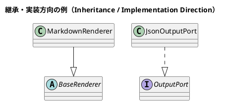
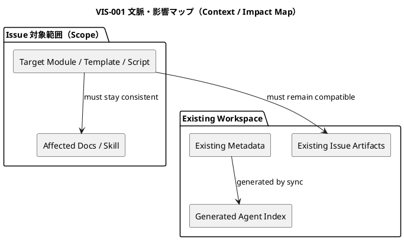
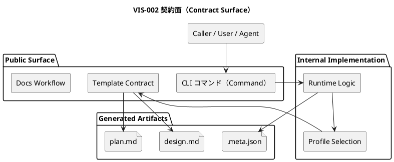
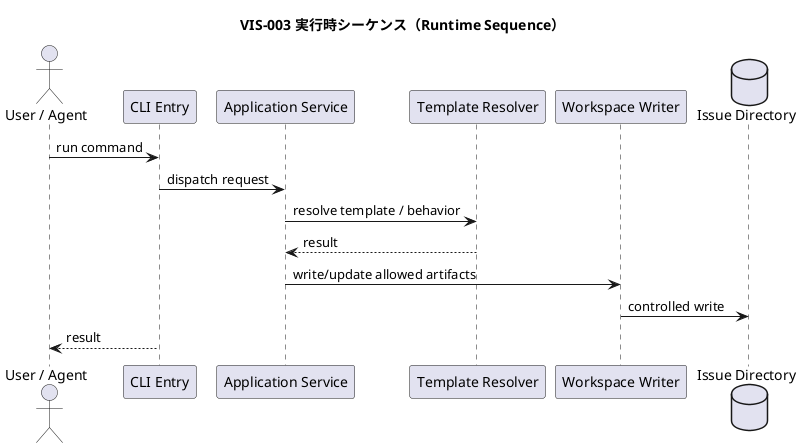
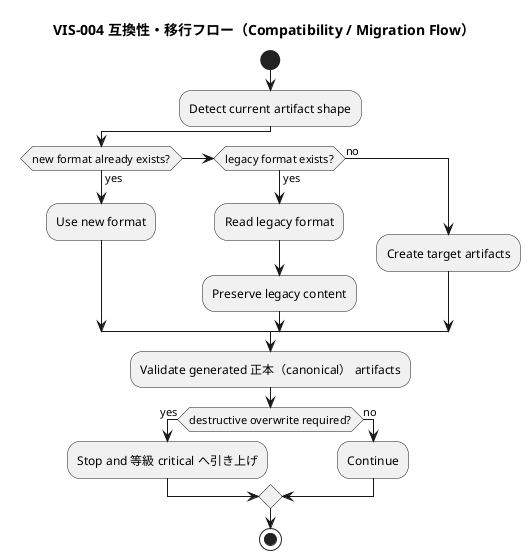

# <ISS_ID> <ISS_TITLE> — Issue 設計書（Strict）

この文書は、Issue要件を実装計画へ落とす前に、この Issue 固有の **設計契約、責任配置、互換性、契約差分、移行・失敗時の扱い、検証上の含意** を定義する。

`strict` gradeでは、通常の局所実装よりも強い設計保証が必要である。特に、公開挙動、テンプレート契約（template contract）、workflow / skill、metadata、sync / validate、既存workspace互換性、migration、複数Issueに影響する設計判断を扱う。

この文書は実装手順書ではない。実装順序、TDDサイクル、具体的なテストケース一覧、変更ファイルの詳細な作業順は `plan.md` で扱う。

---

## 0. 文書の位置づけ

### この文書が定義すること

- この Issue 固有の設計契約
- 上位設計から継承する制約
- public / shared contractへの影響
- 互換性維持方針
- migration / update / coexistence が必要な場合の設計方針
- failure / recovery / rollback の扱い
- docs / テンプレート（templates） / スキル・ワークフロー（skills / workflow） / metadata への影響
- 実装計画で検証すべき設計保証
- 人間が設計構造を理解するための任意のPlantUML図

### 等級 Strict（Strict Grade）の基本姿勢

`strict` は、次のようなIssueを対象にする。

- 公開CLI挙動に影響する
- scaffold結果またはテンプレート契約（template contract）に影響する
- workflow / skill / agent導線に影響する
- sync / validate / active / lifecycle挙動に影響する
- metadataまたはgenerated indexに影響する
- 既存workspaceとの互換性を明示する必要がある
- migrationまたは既存ファイル変換が必要だが、破壊的・不可逆ではない
- Standardより強いreview gateと検証証拠が必要である

### 引き上げ Critical（Critical Escalation）

次のいずれかが判明した場合、このIssueは `critical` へ引き上げる。

- セキュリティ・プライバシー（security / privacy） / secret / credential に関係する
- データ損失または破壊的変更のリスクがある
- GitHub上の状態変更を伴う
- 既存workspace layoutの大規模移行を伴う
- rollback不能またはforward-only migrationになる
- 手動確認なしに進めると危険である
- ユーザー作成物を自動削除・自動上書きする

### 設計コミットメント

| タグ | 意味 | 変更条件 |
|---|---|---|
| `[N]` | 実装が必ず従う設計契約 | 設計書の更新・再承認が必要 |
| `[P]` | 現時点の有力な設計仮説 | 意味論を維持すればTDD中に変更可能 |
| `[I]` | 理解のための例示 | 実装を拘束しない |
| `[O]` | 未解決事項 | 指定された段階までに解決する |
| `[E]` | この Issue の判断範囲外 | 上位文書（Epic・Initiative・ADR）へ昇格する |

---

## 1. 等級 Strict（Strict Grade）確認

### 1.1 Strictとして扱う理由

- 推奨grade:
  - `strict`
- strictにする理由:
  - ...
- Standardでは不足する理由:
  - ...
- Criticalまでは不要な理由:
  - ...
- 主な変更対象:
  - ...
- 主なリスク:
  - ...
- 想定される検証:
  - ...

### 1.2 Strict 開始条件（Trigger）確認

- [ ] 公開CLI挙動を変更する
- [ ] scaffold結果に影響する
- [ ] テンプレート契約（template contract）を変更する
- [ ] workflow / skill / agent導線を変更する
- [ ] sync / validate / active / lifecycle挙動を変更する
- [ ] metadataまたはgenerated indexに影響する
- [ ] 既存workspaceとの互換性を考慮する必要がある
- [ ] migrationまたは既存ファイル変換が必要である
- [ ] 複数Issueが依存する設計判断を含む
- [ ] rollback / compatibility / coexistence を明示する必要がある

### 1.3 引き上げ Criticalガード（Critical Escalation Guard）

| 条件 | 該当 | 理由 |
|---|---|---|
| セキュリティ・プライバシー（security / privacy） / secret / credential に関係する | はい / いいえ / 不明（yes / no / unknown） | ... |
| データ損失リスクがある | はい / いいえ / 不明（yes / no / unknown） | ... |
| 破壊的変更である | はい / いいえ / 不明（yes / no / unknown） | ... |
| GitHub上の状態変更を伴う | はい / いいえ / 不明（yes / no / unknown） | ... |
| rollback不能またはforward-only migrationである | はい / いいえ / 不明（yes / no / unknown） | ... |
| 既存workspace layoutを大規模移行する | はい / いいえ / 不明（yes / no / unknown） | ... |

---

## 2. 設計要約（Executive Design Summary）

### 2.1 このIssueで変わること

- ...
- ...

### 2.2 このIssueで変えないこと

- ...
- ...

### 2.3 主要な設計契約

- `[N]` ...
- `[N]` ...

### 2.4 最大のリスク

| リスク（Risk） | 対応する設計方針 |
|---|---|
| ... | ... |

---

## 3. 設計意図

- 問題:
  - ...
- 現状の制約:
  - ...
- 要件上必要な変化:
  - ...
- 互換性上の制約:
  - ...
- 既存利用者・既存workspaceへの影響:
  - ...

採用する設計方針:

- `[N]` ...
- `[N]` ...
- `[P]` ...

採用しない方針:

| 方針 | 採用しない理由 | 備考 |
|---|---|---|
| ... | ... | ... |

---

## 4. 正本・根拠（Normative Sources）

| 種別 | パス・識別子（Path / ID） | 関連箇所 | このIssueへの意味 |
|---|---|---|---|
| 課題要件（Issue Requirement） | `requirement.md` | `AC-...` / `BH-...` / `CON-...` | ... |
| エピック設計（Epic Design） | ... | ... | ... |
| イニシアチブ設計（Initiative Design） | ... | ... | ... |
| ADR（意思決定記録） | ... | ... | ... |
| アーキテクチャ規則（Architecture Rule） | ... | ... | ... |
| 現行文書（Current docs） | ... | ... | ... |
| 既存コードパターン（Existing code pattern） | ... | ... | ... |
| 既存テスト（Existing tests） | ... | ... | ... |
| 作業成果物・調査（Artifact / research） | ... | ... | ... |

正本の優先順位: ADR / architecture rule → Initiative design → Epic design → Issue requirement → Issue design → Issue plan → artifacts。

---

## 5. 要件から設計への追跡（Requirement-to-Design Traceability）

| 要件識別子（Requirement ID） | 内容の要約 | 設計識別子（Design ID） | 設計上の扱い | 備考 |
|---|---|---|---|---|
| AC-001 | ... | DES-001 | ... | ... |
| AC-002 | ... | DES-002 | ... | ... |
| BH-001 | ... | DES-003 | ... | ... |
| CON-001 | ... | DES-004 | ... | ... |
| REQ-XXX | 必要に応じて要件・振る舞い・制約を連番で追加する。`XXX` は実IDへ置換するか削除する。 | DES-... | ... | ... |

### 要件へ戻すべき事項

| 識別子（ID） | 内容 | 要件への影響 | 対応 |
|---|---|---|---|
| REQ-BACK-001 | ... | ... | update requirement / clarify / escalate |

---

## 6. 判断範囲と昇格（Decision Radius / Escalation）

| 判断識別子（Decision ID） | 判断 | 所有/委譲/昇格 | 理由 | 関連設計識別子（Design ID） |
|---|---|---|---|---|
| DEC-001 | ... | 所有（owned） | ... | `DES-...` |
| DEL-001 | ... | 実装へ委任（delegated to implementation） | ... | `DES-...` |
| ESC-001 | ... | 上位文書（Epic・Initiative・ADR） | ... | `DES-...` |

ADR候補:

| ADR候補 | 理由 | このIssueでの扱い |
|---|---|---|
| ... | ... | ADR 作成 / 延期 / 不要（create ADR / defer / not needed） |

---

## 7. 継承制約と変更禁止領域

- `[N]` ...
- `[N]` ...

| 対象 | 変更しない理由 | 必要になった場合の対応 |
|---|---|---|
| ... | ... | 停止して再計画 / escalate / 後続（follow-up） |

---

## 8. 現状と影響面（Current State and 影響（Impact） Surface）

### 8.1 現在の構造

| 種別 | パス・対象（Path / Target） | 現在の責務 | 備考 |
|---|---|---|---|
| 文書（docs） | ... | ... | ... |
| テンプレート（template） | ... | ... | ... |
| script / CLI | ... | ... | ... |
| スキル（skill） | ... | ... | ... |
| metadata | ... | ... | ... |
| テスト（test） | ... | ... | ... |
| コード（code） | ... | ... | ... |

### 8.2 影響面（影響（Impact） Surface）

| 影響面（Surface） | 影響 | 理由 | 対応 |
|---|---|---|---|
| CLI behavior | はい / いいえ / 不明（yes / no / unknown） | ... | ... |
| テンプレート契約（Template contract） | はい / いいえ / 不明（yes / no / unknown） | ... | ... |
| ワークスペースscaffold（Workspace scaffold） | はい / いいえ / 不明（yes / no / unknown） | ... | ... |
| Runtime script | はい / いいえ / 不明（yes / no / unknown） | ... | ... |
| Agent skill | はい / いいえ / 不明（yes / no / unknown） | ... | ... |
| Docs workflow | はい / いいえ / 不明（yes / no / unknown） | ... | ... |
| Metadata / sync | はい / いいえ / 不明（yes / no / unknown） | ... | ... |
| Validate rules | はい / いいえ / 不明（yes / no / unknown） | ... | ... |
| Existing workspaces | はい / いいえ / 不明（yes / no / unknown） | ... | ... |

---

## 9. 目標設計契約（Target Design Contract）

| 設計識別子（Design ID） | 種別 | 現在（Current） | 目標（Target） | 固定度 |
|---|---|---|---|---|
| DES-001 | 振る舞い（behavior） | ... | ... | `[N]` |
| DES-002 | 責任（responsibility） | ... | ... | `[N]` |
| DES-003 | contract | ... | ... | `[N]` |
| DES-004 | compatibility | ... | ... | `[N]` |
| DES-005 | 移行（migration） | ... | ... | `[P]` |
| DES-006 | 検証（verification） | ... | ... | `[N]` |

Contractual Guarantees:

| 保証識別子（Guarantee ID） | 保証内容 | 関連設計識別子（Design ID） |
|---|---|---|
| GUAR-001 | ... | `DES-...` |
| GUAR-002 | ... | `DES-...` |

---

## 10. 視覚的な設計概要（Visual Design Overview）

PlantUML図は必須ではない。ただし、contract surface、metadata flow、migration/update、failure/recoveryがある場合は図示を推奨する。

クラス図で継承・実装関係を表す場合は、親クラス・抽象クラス・インターフェースを上側、子クラス・実装クラスを下側に置く。PlantUMLでは原則 `Child --|> Parent` または `Implementation ..|> Interface` の形で記述し、見た目として矢印が下から上へ向くようにする。

### 図表一覧（Diagram Index）

| 図識別子（Diagram ID） | 種類 | 固定度 | 目的 | 関連設計識別子（Design ID） |
|---|---|---|---|---|
| VIS-001 | context / component | `[P]` | 変更対象と影響範囲を示す | `DES-...` |
| VIS-002 | contract surface | `[N]` | contract変更点を示す | `DES-...` |
| VIS-003 | sequence | `[P]` | 実行時協調を示す | `DES-...` |
| VIS-004 | compatibility / migration flow | `[P]` | 移行・互換性を示す | `DES-...` |

### VIS-001: 文脈・影響マップ（Context / Impact Map）

### VIS-002: 契約面（Contract Surface）

### VIS-003: 実行時シーケンス（Runtime Sequence）

### VIS-004: 互換性・移行フロー（Compatibility / Migration Flow）

---

## 11. 振る舞い設計（Behavioral Design）

### 振る舞い設計 DES-BEH-001:

- 固定度:
  - `[N]`
- 関連Requirement:
  - `AC-...`
  - `BH-...`
- 関連Diagram:
  - `VIS-...`
- 開始条件（Trigger）:
  - ...
- Actor / Caller:
  - ...
- Preconditions:
  - ...
- Decision rules:
  - ...
- Postconditions:
  - ...
- Observable result:
  - ...
- Compatibility expectation:
  - ...
- Failures:
  - ...
- Must not happen:
  - ...

---

## 12. 責任と境界モデル（Responsibility and Boundary Model）

| 構成要素・作業成果物（Building Block / Artifact） | 責任 | 禁止事項（Must Not Do） | 関連設計識別子（Design ID） | 関連図（Diagram） |
|---|---|---|---|---|
| ... | ... | ... | `DES-...` | `VIS-...` |

| 判断 | 所有者 | 理由 |
|---|---|---|
| ... | ... | ... |

| From | To | 許可 | 理由 |
|---|---|---|---|
| ... | ... | はい / いいえ（yes / no） | ... |

---

## 13. インターフェース・契約設計（Interface / Contract Design）

### 13.1 契約影響要約（Contract 影響（Impact） Summary）

| Contract種別 | 影響 | 互換性 | 備考 |
|---|---|---|---|
| 公開CLI契約（Public CLI contract） | なし / 互換 / 変更あり / 不明（none / compatible / changed / unknown） | 互換 / 破壊的 / N/A（compatible / breaking / N/A） | ... |
| 公開API契約（Public API contract） | なし / 互換 / 変更あり / 不明（none / compatible / changed / unknown） | 互換 / 破壊的 / N/A（compatible / breaking / N/A） | ... |
| イベント・メッセージ契約（Event / message contract） | なし / 互換 / 変更あり / 不明（none / compatible / changed / unknown） | 互換 / 破壊的 / N/A（compatible / breaking / N/A） | ... |
| テンプレート契約（Template contract） | なし / 互換 / 変更あり / 不明（none / compatible / changed / unknown） | 互換 / 破壊的 / N/A（compatible / breaking / N/A） | ... |
| メタデータ・生成インデックス（Metadata / generated index） | なし / 互換 / 変更あり / 不明（none / compatible / changed / unknown） | 互換 / 破壊的 / N/A（compatible / breaking / N/A） | ... |
| ワークスペースscaffold（Workspace scaffold） | なし / 互換 / 変更あり / 不明（none / compatible / changed / unknown） | 互換 / 破壊的 / N/A（compatible / breaking / N/A） | ... |
| エージェントskill振る舞い（Agent skill behavior） | なし / 互換 / 変更あり / 不明（none / compatible / changed / unknown） | 互換 / 破壊的 / N/A（compatible / breaking / N/A） | ... |

### 13.2 契約差分（Contract Delta）

| 契約識別子（ID）Contract ID） | 対象 | 現在（Current） | 目標（Target） | 互換性 | 固定度 |
|---|---|---|---|---|---|
| CTR-001 | ... | ... | ... | 互換 / 破壊的 / N/A（compatible / breaking / N/A） | `[N]` |
| CTR-002 | ... | ... | ... | 互換 / 破壊的 / N/A（compatible / breaking / N/A） | `[N]` |

Breaking Change Check:

- Breaking change:
  - はい / いいえ / 不明（yes / no / unknown）
- Breaking changeがない理由:
  - ...
- Breaking changeが必要な場合の対応:
  - escalate / split issue / ADR / critical

---

## 14. データ・状態・メタデータ・ワークスペース差分（Data / State / Metadata / Workspace Delta）

| 対象 | 現在（Current） | 目標（Target） | 互換性 | 関連図（Diagram） |
|---|---|---|---|---|
| ... | ... | ... | ... | `VIS-...` |

| 作業成果物（Artifact） | 影響 | 互換性 | 備考 |
|---|---|---|---|
| `.meta.json` | なし / 変更あり / 不明（なし / 変更あり / 不明（none / changed / unknown）） | 互換 / N/A（compatible / N/A） | ... |
| `.assurance.json` | なし / 変更あり / 不明（なし / 変更あり / 不明（none / changed / unknown）） | 互換 / N/A（compatible / N/A） | ... |
| `.agent/index*.json` | なし / 変更あり / 不明（なし / 変更あり / 不明（none / changed / unknown）） | 互換 / N/A（compatible / N/A） | ... |
| `.agent/tree*.json` | なし / 変更あり / 不明（なし / 変更あり / 不明（none / changed / unknown）） | 互換 / N/A（compatible / N/A） | ... |
| テンプレート（templates） | なし / 変更あり / 不明（なし / 変更あり / 不明（none / changed / unknown）） | 互換 / N/A（compatible / N/A） | ... |
| 文書（docs） | なし / 変更あり / 不明（なし / 変更あり / 不明（none / changed / unknown）） | 互換 / N/A（compatible / N/A） | ... |
| スキル群（skills） | なし / 変更あり / 不明（なし / 変更あり / 不明（none / changed / unknown）） | 互換 / N/A（compatible / N/A） | ... |

Workspace Layout 影響（Impact）:

| 項目 | 影響 | 対応 |
|---|---|---|
| 新規ディレクトリ | はい / いいえ / 不明（yes / no / unknown） | ... |
| 既存ディレクトリrename | はい / いいえ / 不明（yes / no / unknown） | critical escalation if destructive |
| 既存ファイル移動 | はい / いいえ / 不明（yes / no / unknown） | ... |
| 既存ユーザー作成物への影響 | はい / いいえ / 不明（yes / no / unknown） | ... |
| legacy path対応 | required / not required / unknown | ... |

---

## 15. 互換性・移行・更新設計（Compatibility / Migration / Update Design）

### 15.1 互換性方針（Compatibility Strategy）

- 互換性方針:
  - preserve existing behavior / additive change / alias support / deprecation / other
- 旧形式の読み取り:
  - はい / いいえ / 不明（yes / no / unknown）
- 新形式の生成:
  - はい / いいえ / 不明（yes / no / unknown）
- 旧形式と新形式の共存:
  - はい / いいえ / 不明（yes / no / unknown）
- deprecationが必要:
  - はい / いいえ / 不明（yes / no / unknown）
- user-facing noticeが必要:
  - はい / いいえ / 不明（yes / no / unknown）

### 15.2 移行中状態（Transitional State）

| State 識別子（ID） | 状態 | 有効性 | 備考 |
|---|---|---|---|
| TS-001 | current only | valid / invalid | ... |
| TS-002 | current + target coexist | valid / invalid | ... |
| TS-003 | target only | valid / invalid | ... |

### 15.3 ロールバック方針（Rollback Strategy）

- rollback可能:
  - はい / いいえ / 不明（yes / no / unknown）
- rollback方法:
  - ...
- rollbackで戻せないもの:
  - ...
- rollback不能な場合:
  - 等級 critical へ引き上げ / forward-only design / ADR

---

## 16. 失敗・復旧設計（Failure / Recovery Design）

| Failure 識別子（ID） | 条件 | 期待される扱い | 状態変更 | Recovery | 観測点 |
|---|---|---|---|---|---|
| FAIL-001 | ... | ... | なし / 部分的 / rollback / N/A（none / partial / rollback / N/A） | ... | ... |
| FAIL-002 | ... | ... | なし / 部分的 / rollback / N/A（none / partial / rollback / N/A） | ... | ... |

Partial Failure:

- 部分成功が発生しうる:
  - はい / いいえ / 不明（yes / no / unknown）
- 部分成功時の状態:
  - ...
- 検出方法:
  - ...
- 回復方法:
  - ...

Error / Diagnostic Design:

| エラー識別子（ID）Error ID） | 条件 | メッセージ・診断方針（Message / Diagnostic） | 終了コード・状態（Exit Code / Status） |
|---|---|---|---|
| ERR-001 | ... | ... | ... |

---

## 17. セキュリティ・プライバシー確認（Security / Privacy Check）

Strictでは、セキュリティ・プライバシー（security / privacy） sensitiveな変更が判明した場合は原則 `critical` へ引き上げる。

| 項目 | 影響 | 備考 |
|---|---|---|
| 認証 | なし / 不明（none / unknown） / affected | ... |
| 認可 | なし / 不明（none / unknown） / affected | ... |
| 機密情報（secret / token / credential） | なし / 不明（none / unknown） / affected | ... |
| 個人情報 / 機微情報 | なし / 不明（none / unknown） / affected | ... |
| ログ出力 | なし / 不明（none / unknown） / affected | ... |
| 外部API権限（GitHub API） | なし / 不明（none / unknown） / affected | ... |

---

## 18. 観測性・診断・証跡設計（Observability / Diagnostics / Evidence Design）

| 証跡ID（Evidence ID） | 観測対象 | 証拠の種類 | 関連設計識別子（Design ID） | 関連Diagram |
|---|---|---|---|---|
| EVD-001 | ... | test / CLI output / file diff / docs diff / 手動（manual） review | `DES-...` | `VIS-...` |
| EVD-002 | ... | contract check / compatibility check / migration dry-run | `DES-...` | `VIS-...` |

Reportに残すべき証拠:

- Red / alternative evidence:
  - ...
- Green verification:
  - ...
- Compatibility evidence:
  - ...
- Migration / update evidence:
  - ...
- Failure / recovery evidence:
  - ...
- Review evidence:
  - ...

---

## 19. 文書・テンプレート・スキル・ワークフロー影響（Docs / Template / Skill / Workflow 影響（Impact））

| パス（Path） | 更新理由 | 必須 |
|---|---|---|
| ... | ... | はい / いいえ（yes / no） |

提供側・利用側反映（Provider / Consumer）:

| 対象 | 影響 | 対応 |
|---|---|---|
| `src/spec_dock/assets/...` | はい / いいえ / 不明（yes / no / unknown） | ... |
| ワークスペース（root `spec-dock/...`） | はい / いいえ / 不明（yes / no / unknown） | ... |

Documentation Consistency Contract:

- `[N]` docsは新しいcontractと矛盾してはいけない
- `[N]` テンプレート（templates）とworkflow docsは同じgrade名・artifact名を使う
- `[N]` skill導線は正本（canonical） artifactを誤って上書きしない

---

## 20. 検討した代替案（Alternatives Considered）

| Alternative 識別子（ID） | 代替案 | 利点 | 欠点 | 採否 |
|---|---|---|---|---|
| ALT-001 | ... | ... | ... | adopted / rejected |
| ALT-002 | ... | ... | ... | adopted / rejected |

---

## 21. 実装へ委譲する設計仮説（Design Hypotheses Left to Implementation）

| Hypothesis 識別子（ID） | 内容 | 制約 | 判断タイミング |
|---|---|---|---|
| HYP-001 | ... | ... | during implementation / during refactor |

実装中に変更してはいけないもの:

- `[N]` ...
- `[N]` ...

---

## 22. 検証への含意（検証（Verification） Implications）

| 設計識別子（Design ID） | 検証すべき内容 | 推奨検証レベル（Verification Level） | 報告証跡（Report Evidence） | 関連図（Diagram） |
|---|---|---|---|---|
| DES-001 | ... | unit / integration / CLI / 文書・テンプレート（docs / template） / contract / 手動（manual） | `EVD-...` | `VIS-...` |
| DES-002 | ... | compatibility / migration / failure recovery | `EVD-...` | `VIS-...` |

検証レベル（Verification Level）:

- `unit`, `integration`, `CLI`, `docs`, `template`, `contract`, `compatibility`, `migration`, `failure-recovery`, `手動（manual）`

---

## 23. レビュー方針（Review Strategy）

| Review対象 | Reviewer | 必須 | Focus |
|---|---|---|---|
| requirement alignment | ... | はい / いいえ（yes / no） | AC / BH / CON |
| design contract | ... | はい / いいえ（yes / no） | compatibility / responsibility / contract |
| plan | ... | はい / いいえ（yes / no） | TDD / verification / stop rules |
| implementation | ... | はい / いいえ（yes / no） | 差分 / テスト / 契約（差分 / テスト（diff / tests） / contract） |
| 文書・テンプレート（docs / template） / skill | ... | はい / いいえ（yes / no） | consistency |
| 最終report（final report） | ... | はい / いいえ（yes / no） | 証跡完全性（evidence completeness） |

Review Blocking Conditions:

- 引き上げ Critical（Critical Escalation）条件に該当する
- public contract変更が曖昧
- migration方針が曖昧
- rollback方針が曖昧
- failure / recoveryが未定義
- verification evidenceが不足
- designとrequirementが対応していない

---

## 24. 計画への引き渡し（Plan Handoff）

### 24.1 固定設計契約（Fixed Design Contracts）

- `DES-...`
- `CTR-...`
- `COMP-...`
- `MIG-...`
- GUAR-...

### 24.2 振る舞いバックログ種（Behavior Backlog Seeds）

| 種識別子（Seed ID） | 振る舞い / 成果 | 関連設計識別子（Design ID） | 関連Requirement | 関連Diagram |
|---|---|---|---|---|
| B-SEED-001 | ... | `DES-...` | `AC-...` | `VIS-...` |

### 24.3 必須ゲート（Required Gates）

| ゲート識別子（ID）Gate ID） | 検証内容 | 理由 | 報告証跡（Report Evidence） |
|---|---|---|---|
| GATE-001 | ... | ... | `EVD-...` |
| COMP-GATE-001 | ... | ... | `EVD-...` |
| REC-GATE-001 | ... | ... | `EVD-...` |

### 24.4 停止・再計画条件（Stop / Replan Triggers）

- [ ] Redの理由が設計上の想定と異なる
- [ ] 要件の期待値を変更したくなる
- [ ] public contract変更が想定より大きい
- [ ] migrationが破壊的になる
- [ ] セキュリティ・プライバシー（security / privacy）影響が見つかる
- [ ] 既存workspace互換性を保てない
- [ ] ユーザー作成物（user-authored artifact）を安全に保護できない
- [ ] 引き上げ Critical（Critical Escalation）条件を満たした

---

## 25. 未確定事項（Open Questions）

### 未解決事項 OQ-001:

- 質問:
  - ...
- 影響:
  - requirement / design / plan / implementation / test / release
- 解決期限:
  - before plan / before implementation / can defer
- 推奨:
  - ...
- 解決状態:
  - open / resolved / escalated

---

## 26. 図表レビューチェックリスト（Diagram Review Checklist）

- [ ] 各図にDiagram IDがある
- [ ] 各図に固定度 `[N] / [P] / [I]` が明示されている
- [ ] 各図が設計識別子（Design ID）と対応している
- [ ] 図だけにしか存在しない設計契約がない
- [ ] compatibility / migration / failure経路が必要に応じて図示されている
- [ ] 図が実装詳細を過剰に固定していない

---

## 27. 設計 Strict承認チェックリスト（Design Approval Checklist）

- [ ] すべての関連ACが設計識別子（Design ID）へ対応している
- [ ] すべての関連BHが振る舞い設計（Behavioral Design）へ反映されている
- [ ] `strict` gradeにする理由が明記されている
- [ ] 引き上げ Critical（Critical Escalation）条件を確認した
- [ ] 契約影響要約（Contract 影響（Impact） Summary）が埋まっている
- [ ] compatibility方針が明記されている
- [ ] migration要否が明記されている
- [ ] rollback方針が記載されている
- [ ] failure / recoveryが扱われている
- [ ] docs / テンプレート（templates） / skillsが矛盾していない
- [ ] 検証への含意（検証（Verification） Implications）がある
- [ ] 必須ゲート（Required Gates）が計画への引き渡し（Plan Handoff）へ渡されている

---

## 28. 変更履歴

| 日付（Date） | 変更（Change） | 理由（Reason） | 作成者（Author） |
|---|---|---|---|
| YYYY-MM-DD | 初稿（Initial draft） | ... | ... |
