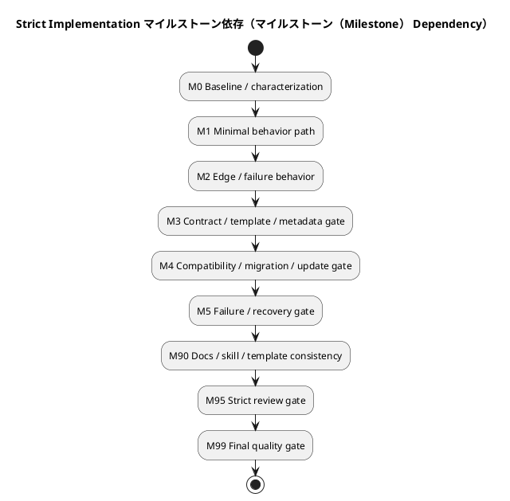

# <ISS_ID> <ISS_TITLE> — Issue 実装計画書（Strict / 仕様固定TDD（Spec-Locked TDD））

この文書は、承認済みの `requirement.md` と `design.md` を、TDDに沿って実行可能な **マイルストーン（Milestone）、振る舞いバックログ（Behavior Backlog）、TDD Cycle、契約ゲート（Contract Gate）、Compatibility Gate、失敗・復旧ゲート（Failure / Recovery Gate）、Review Gate、報告証跡（Report Evidence）** へ変換する。

`strict` gradeでは、通常の実装計画よりも、以下を強く管理する。

- 要件・設計・実装・検証の追跡可能性
- 公開挙動または共有contractへの影響
- 既存workspace / 既存artifactとの互換性
- docs / テンプレート（templates） / スキル・ワークフロー（skills / workflow） の整合性
- migration / update / coexistence が必要な場合の安全性
- failure / partial failure / recovery の扱い
- レビューgate（reviewer gate）と最終証跡（final evidence）

---

## 0. 文書の位置づけ

この文書は planned executable workflow contract である。実行中の観測結果、Red / Green / Refactor の実績、逸脱、追加判断、互換性検証、review結果は `report.md` に記録する。

この文書は新しい要件・新しい設計契約・上位設計の再定義を行わない。

Critical条件が判明したら即停止する。

---

## 1. 計画開始条件（Plan Readiness）

### 必須入力（Required Inputs）

| 作業成果物（Artifact） | 状態 | 確認事項 |
|---|---|---|
| `requirement.md` | 下書き / 承認済み（draft / approved） | AC、BH、CON、等級（Grade）判定材料がある |
| `design.md` | 下書き / 承認済み（draft / approved） | 固定設計契約（Fixed Design Contracts）、契約差分（Contract Delta）、検証への含意（検証（Verification） Implications）がある |
| `report.md` | 存在 / 欠落（exists / missing） | 実行証拠の記録先がある |
| 親Epic design | 確認済み / N/A（reviewed / N/A） | 継承すべき制約が確認済み |
| 親Initiative design | 確認済み / N/A（reviewed / N/A） | 戦略的制約に矛盾しない |
| ADR / architecture docs | 確認済み / N/A（reviewed / N/A） | 関連制約が確認済み |
| Contract docs | 確認済み / N/A（reviewed / N/A） | 変更または互換性確認が必要なcontractが把握されている |

### 計画開始条件（Plan）

- [ ] `requirement.md` が承認済み、または実装計画作成に十分な状態である
- [ ] `design.md` が承認済み、または計画への引き渡し（Plan Handoff）が記載済みである
- [ ] 未解決のBlocking Open Questionがない
- [ ] Issue Gradeが `strict` として妥当である
- [ ] 引き上げ Critical（Critical Escalation）条件を確認済みである
- [ ] 契約差分（Contract Delta）が明示されている
- [ ] 互換性方針（Compatibility Strategy）が明示されている
- [ ] Migration / Updateが必要な場合、その方針が明示されている
- [ ] Failure / Recoveryの扱いがdesign.mdで定義されている
- [ ] `report.md` への証拠記録方針がある

---

## 2. 実装戦略（Implementation Strategy）

このIssueでは、**Spec-Locked TDD** を採用する。

`Spec-Locked` とは、承認済みの要件・設計契約・contract・互換性方針を、実装都合で変更しないことを意味する。

```text
Issue 受け入れ範囲（Acceptance Envelope）
└── マイルストーン（Milestone）
    ├── 振る舞いバックログ（Behavior Backlog） Item
    │   └── 実行中の TDD サイクル（Active TDD Cycle）
    ├── 契約ゲート（Contract Gate）
    ├── Compatibility Gate
    ├── Migration / Update Gate
    ├── 失敗・復旧ゲート（Failure / Recovery Gate）
    └── Review Gate
```

### TDD の Red 方針（TDD Red Policy）

| Red種別 | 許容数 | 扱い |
|---|---:|---|
| Intentional outer Red | 最大1 | マイルストーン（Milestone）のguiding testとして許容 |
| Intentional inner Red | 最大1 | 現在の実行中の TDD サイクル（Active TDD Cycle）のみ |
| Existing regression Red | 0 | 発生したら即停止 |
| Contract Red | 最大1 | contract変更対象のCycleのみ |
| Compatibility Red | 最大1 | compatibility検証Cycleのみ |
| Unknown Red | 0 | 原因を確認するまで実装へ進まない |

Red代替証跡（Red Alternative）:

| 対象 | Red分類 | 理由 | 代替証拠 |
|---|---|---|---|
| ... | red-required / contract-first / compatibility-first / migration-dry-run-first / 点検（inspect）-only | ... | ... |

---

## 3. 範囲と変更面（対象範囲（Scope） and Change Surface）

### 許可変更面（Allowed Change Surface）

| 種別 | パス・対象（Path / Target） | 許可する変更 | 関連設計識別子（Design ID） |
|---|---|---|---|
| コード（code） | ... | ... | `DES-...` |
| テスト（tests） | ... | ... | `DES-...` |
| 文書（docs） | ... | ... | `DES-...` |
| テンプレート（templates） | ... | ... | `DES-...` |
| スキル群（skills） | ... | ... | `DES-...` |
| scripts | ... | ... | `DES-...` |
| metadata | ... | ... | `DES-...` |
| contracts | ... | ... | `CTR-...` |

### 禁止変更（Forbidden Changes）

| 対象 | 禁止理由 | 必要になった場合の対応 |
|---|---|---|
| ... | ... | 停止して再計画 / escalate / 後続issue（後続（follow-up） issue） / ADR |

### ユーザー作成物保護（User-authored Artifact Protection）

| 対象 | 保護方針 | 検証 |
|---|---|---|
| 正本文書（正本（canonical） docs） | 保持 / 更新 / N/A（preserve / update / N/A） | ... |
| 作業成果物・議論（artifacts / discussions） | preserve / N/A | ... |
| `.meta.json` | 保持 / 移行 / N/A（preserve / migrate / N/A） | ... |
| `.assurance.json` | 保持 / 移行 / N/A（preserve / migrate / N/A） | ... |
| generated files | 再生成 / 保持 / N/A（regenerate / preserve / N/A） | ... |

---

## 4. 実行概要（Execution Overview）

| マイルストーン（Milestone） 識別子（ID） | 成果 | 主なBehavior / ゲート（Gate） | 検証（Verification） ゲート（Gate） | 状態 |
|---|---|---|---|---|
| M0 | 基準（baseline）確認 | 基準（baseline） / characterization | 基準（baseline） gate | planned |
| M1 | 最小の正常経路 | `B-...` | focused + local | planned |
| M2 | 主要な失敗・境界条件 | `B-...` | focused + regression | planned |
| M3 | contract / template / metadata整合性 | `CTR-...` | contract gate | planned |
| M4 | compatibility / migration / update | `COMP-...` / `MIG-...` | compatibility gate | planned |
| M5 | failure / recovery | FAIL-... / `REC-...` | recovery gate | planned |
| M90 | 文書・テンプレート（docs / template） / skill影響解決 | docs / skill consistency | docs gate | planned |
| M95 | strict review | レビューgate（reviewer gate） | review証跡（review evidence） | planned |
| M99 | final quality gate | all | full verification | planned |



---

## 5. 受け入れ範囲（Acceptance Envelope）

| 成果識別子（Outcome ID） | 内容 | 関連AC | 関連設計識別子（Design ID） | 完了証拠 |
|---|---|---|---|---|
| OUT-001 | ... | `AC-...` | `DES-...` | `EVD-...` |
| OUT-002 | ... | `AC-...` | `DES-...` | `EVD-...` |

Contractual Outcomes:

| 成果識別子（Outcome ID） | Contract | 期待状態 | 証拠 |
|---|---|---|---|
| COUT-001 | `CTR-...` | ... | `EVD-...` |

Compatibility Outcomes:

| 成果識別子（Outcome ID） | 対象 | 期待状態 | 証拠 |
|---|---|---|---|
| COMP-OUT-001 | ... | ... | `EVD-...` |

---

## 6. 仕様固定クロージャ一覧（Spec-Locked クロージャ（Closure） Index）

| クロージャ識別子（Closure ID） | 要件識別子（Requirement ID） | 設計識別子（Design ID） | 閉じる内容 | 検証レベル（Verification Level） | 報告証跡（Report Evidence） |
|---|---|---|---|---|---|
| CLOS-001 | AC-001 | DES-001 | ... | unit・CLI・テンプレート・文書 | `report.md#...` |
| CLOS-002 | AC-002 | DES-002 | ... | 統合・契約（integration / contract） | `report.md#...` |
| CLOS-XXX | 必要に応じて連番で追加する。`XXX` は実IDへ置換するか削除する。 | DES-... | ... | ... | `report.md#...` |

Contract クロージャ（Closure）:

| Contract クロージャ識別子（Closure ID） | Contract 識別子（ID） | 内容 | 検証（Verification） | 報告証跡（Report Evidence） |
|---|---|---|---|---|
| CTR-CLOS-001 | `CTR-...` | ... | 契約・互換性（契約・互換性（contract / compatibility）） | `report.md#...` |

Compatibility クロージャ（Closure）:

| Compatibility クロージャ識別子（Closure ID） | 対象 | 内容 | 検証（Verification） | 報告証跡（Report Evidence） |
|---|---|---|---|---|
| COMP-CLOS-001 | ... | ... | 互換性・移行ドライラン（compatibility / migration dry-run） | `report.md#...` |

---

## 7. 振る舞いバックログ（Behavior Backlog）

| 振る舞い識別子（Behavior ID） | マイルストーン（Milestone） | 振る舞い / 保証 | 関連クロージャ（Closure） | 依存 | 優先度 | 状態 |
|---|---|---|---|---|---|---|
| B-001 | M1 | ... | `CLOS-...` | none | high | ready |
| B-002 | M1 | ... | `CLOS-...` | B-001 | medium | planned |
| B-003 | M2 | ... | `CLOS-...` | B-001 | high | planned |
| B-004 | M3 | contract guarantee ... | CTR-`CLOS-...` | B-002 | high | planned |
| B-XXX | 必要に応じて連番で追加する。`XXX` は実IDへ置換するか削除する。 | ... | `CLOS-...` | ... | ... | planned |
| B-005 | M4 | compatibility guarantee ... | COMP-`CLOS-...` | B-004 | high | planned |

---

## 8. 実行中の振る舞い（Active Behavior）

- 振る舞い識別子（Behavior ID）:
  - `B-...`
- 関連マイルストーン（Milestone）:
  - M...
- 関連クロージャ（Closure）:
  - `CLOS-...`
- 関連Contract クロージャ（Closure）:
  - CTR-`CLOS-...` / N/A
- 関連Compatibility クロージャ（Closure）:
  - COMP-`CLOS-...` / N/A
- 関連設計識別子（Design ID）:
  - `DES-...`
- なぜ次に実行するか:
  - ...
- 分割判断:
  - one-cycle / split-required / unknown

振る舞い受け入れ条件（Behavior Acceptance）:

- Given:
  - ...
- When:
  - ...
- Then:
  - ...
- And:
  - ...
- 観測点:
  - ...

振る舞い範囲（Behavior 対象範囲（Scope））:

| 項目 | 内容 |
|---|---|
| Allowed paths | ... |
| Forbidden paths | ... |
| Required tests / checks | ... |
| Required contract checks | ... |
| Required compatibility checks | ... |
| Report証跡記録先（Report evidence destination） | ... |
| Stop conditions | ... |

---

## 9. 実行中の TDD サイクル（Active TDD Cycle）

### サイクルメタデータ（Cycle Metadata）

- Cycle ID:
  - TDD-...
- Parent Behavior:
  - `B-...`
- Cycle type:
  - red-green-refactor / characterization / contract-first / compatibility-first / migration-dry-run-first / 点検（inspect）-only / 手動（manual）-required
- Related クロージャ（Closure）:
  - `CLOS-...`
- Related Contract クロージャ（Closure）:
  - CTR-`CLOS-...` / N/A
- Related Compatibility クロージャ（Closure）:
  - COMP-`CLOS-...` / N/A
- 関連設計識別子（Design ID）:
  - `DES-...`
- Status:
  - 計画済み / red / green / refactored / 完了 / blocked（planned / red / green / refactored / complete / blocked）

### 振る舞い仮説（Behavioral Hypothesis）

```text
...
```

### テスト・証跡計画（Test / Evidence Plan）

- Red分類:
  - red-required / covered-existing / characterization-first / contract-first / compatibility-first / migration-dry-run-first / 点検（inspect）-only / 手動（manual）-required / not-applicable
- 期待するRed理由:
  - ...
- Redが期待どおりでない場合の対応:
  - stop / repair test / replan / escalate
- 代替証拠:
  - ...

Concrete Test Seed:

- `tc-...`:
  - 前提:
    - ...
  - 操作:
    - ...
  - 期待結果:
    - ...
  - 検証方法:
    - ...
  - 関連Report destination:
    - `report.md#...`

Contract / Compatibility Evidence:

| 対象 | 検証方法 | 期待結果 | 報告先（Report Destination） |
|---|---|---|---|
| Contract | ... | ... | `report.md#...` |
| Compatibility | ... | ... | `report.md#...` |
| Migration / Update | ... | ... | `report.md#...` |

最小 Green 境界（Minimal Green Boundary）:

- Allowed implementation boundary:
  - ...
- Do not change contract:
  - ...
- Must preserve:
  - ...
- Must remain compatible with:
  - ...

---

## 10. マイルストーン計画（マイルストーン（Milestone） Plans）

### M0: ベースライン・特性把握（Baseline / Characterization）

| Check | コマンド（Command） / Evidence | 期待結果 | 報告先（Report Destination） |
|---|---|---|---|
| Existing 集中test（focused test）s | `...` | pass / 既知失敗を記録済み | `report.md#...` |
| Relevant 文書点検（docs inspect）ion | ... | current state understood | `report.md#...` |
| Template / contract 基準（baseline） | ... | current shape recorded | `report.md#...` |
| Compatibility 基準（baseline） | ... | current behavior recorded | `report.md#...` |

- commit:
  - commit候補: このマイルストーンの成果をレビュー可能な単位としてコミットする
  - commit前確認:
    - [ ] このマイルストーンの差分だけで意味が通る
    - [ ] 必要な検証が完了している
    - [ ] `report.md` に証跡がある
    - [ ] 次のマイルストーンの未完了差分が混ざっていない

### M1: 最小振る舞い経路（Minimal Behavior Path）

| 振る舞い識別子（Behavior ID） | 内容 | クロージャ（Closure） | 状態 |
|---|---|---|---|
| B-001 | ... | `CLOS-...` | planned |

Gate:

| ゲート（Gate） | コマンド（Command） / Evidence | 期待結果 | 報告先（Report Destination） |
|---|---|---|---|
| Focused suite | `...` | pass | `report.md#...` |
| Local regression | `...` | pass | `report.md#...` |

- commit:
  - commit候補: このマイルストーンの成果をレビュー可能な単位としてコミットする
  - commit前確認:
    - [ ] このマイルストーンの差分だけで意味が通る
    - [ ] 必要な検証が完了している
    - [ ] `report.md` に証跡がある
    - [ ] 次のマイルストーンの未完了差分が混ざっていない

### M2: 境界・失敗時振る舞い（Edge / Failure Behavior）

| Failure 識別子（ID） | 条件 | 期待される扱い | 報告先（Report Destination） |
|---|---|---|---|
| FAIL-001 | ... | ... | `report.md#...` |

- commit:
  - commit候補: このマイルストーンの成果をレビュー可能な単位としてコミットする
  - commit前確認:
    - [ ] このマイルストーンの差分だけで意味が通る
    - [ ] 必要な検証が完了している
    - [ ] `report.md` に証跡がある
    - [ ] 次のマイルストーンの未完了差分が混ざっていない

### M3: 契約・テンプレート・メタデータゲート（Contract / Template / Metadata Gate）

| Contract 識別子（ID） | 対象 | 期待状態 | 検証 |
|---|---|---|---|
| CTR-001 | ... | ... | ... |

- commit:
  - commit候補: このマイルストーンの成果をレビュー可能な単位としてコミットする
  - commit前確認:
    - [ ] このマイルストーンの差分だけで意味が通る
    - [ ] 必要な検証が完了している
    - [ ] `report.md` に証跡がある
    - [ ] 次のマイルストーンの未完了差分が混ざっていない

### M4: 互換性・移行・更新ゲート（Compatibility / Migration / Update Gate）

| Check | コマンド（Command） / Evidence | 期待結果 | 報告先（Report Destination） |
|---|---|---|---|
| Migrationドライラン（Migration dry-run） | `...` | no destructive change | `report.md#...` |
| Legacy read compatibility | `...` | pass / N/A | `report.md#...` |
| Existing workspace simulation | `...` | pass | `report.md#...` |

- commit:
  - commit候補: このマイルストーンの成果をレビュー可能な単位としてコミットする
  - commit前確認:
    - [ ] このマイルストーンの差分だけで意味が通る
    - [ ] 必要な検証が完了している
    - [ ] `report.md` に証跡がある
    - [ ] 次のマイルストーンの未完了差分が混ざっていない

### M5: 失敗・復旧ゲート（Failure / Recovery Gate）

| Recovery 識別子（ID） | 対象Failure | 期待されるRecovery | 検証 |
|---|---|---|---|
| REC-001 | FAIL-... | ... | ... |

- commit:
  - commit候補: このマイルストーンの成果をレビュー可能な単位としてコミットする
  - commit前確認:
    - [ ] このマイルストーンの差分だけで意味が通る
    - [ ] 必要な検証が完了している
    - [ ] `report.md` に証跡がある
    - [ ] 次のマイルストーンの未完了差分が混ざっていない

### M90: 文書・テンプレート・スキル整合性（Docs / Template / Skill Consistency）

| 対象 | 必要な対応 | 状態 |
|---|---|---|
| 文書（docs） | ... | planned |
| テンプレート（templates） | ... | planned |
| スキル群（skills） | ... | planned |

- commit:
  - commit候補: このマイルストーンの成果をレビュー可能な単位としてコミットする
  - commit前確認:
    - [ ] このマイルストーンの差分だけで意味が通る
    - [ ] 必要な検証が完了している
    - [ ] `report.md` に証跡がある
    - [ ] 次のマイルストーンの未完了差分が混ざっていない

### M95: レビュー Strictゲート（Strict Review Gate）

| Review対象 | Reviewer | Focus | 報告先（Report Destination） |
|---|---|---|---|
| requirement alignment | ... | AC / BH / CON | `report.md#...` |
| design contract | ... | 契約・互換性（契約・互換性（contract / compatibility）） | `report.md#...` |
| plan execution | ... | TDD / gates / stop rules | `report.md#...` |
| 実装差分（implementation diff） | ... | コード / 文書 / テンプレート（code / docs / templates）（templates） | `report.md#...` |

- commit:
  - commit候補: このマイルストーンの成果をレビュー可能な単位としてコミットする
  - commit前確認:
    - [ ] このマイルストーンの差分だけで意味が通る
    - [ ] 必要な検証が完了している
    - [ ] `report.md` に証跡がある
    - [ ] 次のマイルストーンの未完了差分が混ざっていない

---

## 11. 検証段階（検証（Verification） Ladder）

| レベル（Level） | 名称 | 目的 | コマンド（Command） / Evidence |
|---|---|---|---|
| L1 | Active Cycle Focused | 現在のCycleだけを確認 | `...` |
| L2 | Local Module / 作業成果物（Artifact） | 近接範囲の回帰確認 | `...` |
| L3 | 対象範囲（Scope）回帰（範囲回帰（対象範囲（Scope） Regression）） | Issue 対象scope全体の確認 | `...` |
| L4 | Contract / Template / CLI | contractやscaffold挙動確認 | `...` |
| L5 | Compatibility / Migration | 旧形式・既存workspace互換性確認 | `...` |
| L6 | Failure / Recovery | 失敗・復旧経路確認 | `...` |
| L7 | Static / Lint / Type | 静的検証 | `...` |
| L8 | Docs / Skill Consistency | docs・template・skill整合性 | `...` |
| L9 | Strict Review | 人間またはreviewer確認 | `...` |
| L10 | Final ゲート（Gate） | Issue 最終確認 | `...` |

---

## 12. 契約・互換性・復旧ゲート（Contract / Compatibility / Recovery Gates）

契約ゲート（Contract Gate）:

| Contract 識別子（ID） | 対象 | ゲート（Gate） | コマンド（Command） / Evidence | 期待結果（Expected） |
|---|---|---|---|---|
| CTR-001 | ... | CTR-GATE-001 | `...` | ... |

Compatibility Gate:

| Compatibility 識別子（ID） | 対象 | 期待状態 | 検証（Verification） | 報告先（Report Destination） |
|---|---|---|---|---|
| COMP-001 | ... | ... | ... | `report.md#...` |

失敗・復旧ゲート（Failure / Recovery Gate）:

| Failure 識別子（ID） | 条件 | 検証方法 | 期待結果 | 報告先（Report Destination） |
|---|---|---|---|---|
| FAIL-001 | ... | ... | ... | `report.md#...` |

---

## 13. 委任契約（Delegation Contract）

| ステップ・振る舞い（Step / Behavior） | 委任ロール（Delegated Role） | 許可パス（Allowed Paths） | レビュー観点（Reviewer Focus） | 報告先（Report Destination） |
|---|---|---|---|---|
| `B-...` | dev-coder / doc-writer / reviewer / none | ... | code / spec / docs / contract | `report.md#...` |

---

## 14. 報告証跡対応（報告証跡（Report Evidence） Mapping）

| 証跡ID（Evidence ID） | 対象 | 報告節（Report Section） | 記録内容 |
|---|---|---|---|
| EVD-001 | Red / Alternative Evidence | `report.md#...` | ... |
| EVD-002 | Green検証（Green Verification） | `report.md#...` | ... |
| EVD-003 | Contract Evidence | `report.md#...` | ... |
| EVD-004 | Compatibility Evidence | `report.md#...` | ... |
| EVD-005 | Migration / Update Evidence | `report.md#...` | ... |
| EVD-006 | Failure / Recovery Evidence | `report.md#...` | ... |
| EVD-007 | Docs / Template / Skill Evidence | `report.md#...` | ... |
| EVD-008 | Review Evidence | `report.md#...` | ... |
| EVD-009 | Final ゲート（Gate） | `report.md#...` | ... |

---

## 15. 修正・停止ルール（Amendment and Stop Rules）

即時停止条件（Immediate Stop Conditions）:

- [ ] 新しいテストがproduction change前から成功する
- [ ] Red理由が想定と異なる
- [ ] 既存Regressionが失敗した
- [ ] 承認済みDesignのNormative Contractを変更したくなる
- [ ] public / shared contract変更が想定を超える
- [ ] migrationが破壊的になる
- [ ] compatibilityを保てない
- [ ] ユーザー作成物（user-authored artifact）を安全に保護できない
- [ ] セキュリティ・プライバシー（security / privacy）影響が判明する
- [ ] 引き上げ Critical（Critical Escalation）条件を満たす
- [ ] Forbidden changesが必要になる

---

## 16. 文書・テンプレート・スキル影響解消（Docs / Template / Skill 影響（Impact） Resolution）

| 対象 | 影響 | 必要な対応 | 報告証跡（Report Evidence） |
|---|---|---|---|
| 文書（docs） | はい / いいえ / 不明（yes / no / unknown） | ... | `report.md#...` |
| テンプレート（templates） | はい / いいえ / 不明（yes / no / unknown） | ... | `report.md#...` |
| スキル群（skills） | はい / いいえ / 不明（yes / no / unknown） | ... | `report.md#...` |
| ワークフロー文書（workflow docs） | はい / いいえ / 不明（yes / no / unknown） | ... | `report.md#...` |
| 提供資産（provider assets） | はい / いいえ / 不明（yes / no / unknown） | ... | `report.md#...` |
| 検証workspace（dogfooding workspace） | はい / いいえ / 不明（yes / no / unknown） | ... | `report.md#...` |

---

## 17. レビューゲート（Review Gate）

| Review 識別子（ID） | Review対象 | Reviewer | Focus | Blocking |
|---|---|---|---|---|
| REV-001 | requirement alignment | ... | AC / BH / CON | はい / いいえ（yes / no） |
| REV-002 | design contract | ... | 契約・互換性（契約・互換性（contract / compatibility）） / migration | はい / いいえ（yes / no） |
| REV-003 | plan | ... | TDD / gates / stop rules | はい / いいえ（yes / no） |
| REV-004 | 実装差分（implementation diff） | ... | コード / 文書 / テンプレート（code / docs / templates）（templates） / tests | はい / いいえ（yes / no） |
| REV-005 | 最終report（final report） | ... | 証跡完全性（evidence completeness） | はい / いいえ（yes / no） |

---

## 18. 最終品質ゲート（Final Quality Gate）

| Check | コマンド（Command） / Evidence | 期待結果（Expected） | 報告先（Report Destination） |
|---|---|---|---|
| Requirement closure | 点検（inspect） closure index | all closed | `report.md#...` |
| Design contract compliance | 点検（inspect） design IDs | 違反なし | `report.md#...` |
| Focused tests | `...` | pass | `report.md#...` |
| Contract checks | `...` | pass | `report.md#...` |
| Compatibility checks | `...` | pass | `report.md#...` |
| Migration / update checks | `...` | pass / N/A | `report.md#...` |
| Failure / recovery checks | `...` | pass / N/A | `report.md#...` |
| Static checks | `...` | pass | `report.md#...` |
| Docs / template / skill checks | `...` | pass / N/A | `report.md#...` |
| Strict review | ... | approved | `report.md#...` |

- commit:
  - commit候補: このマイルストーンの成果をレビュー可能な単位としてコミットする
  - commit前確認:
    - [ ] このマイルストーンの差分だけで意味が通る
    - [ ] 必要な検証が完了している
    - [ ] `report.md` に証跡がある
    - [ ] 次のマイルストーンの未完了差分が混ざっていない

最終終了契約（Final Exit Contract）:

- [ ] すべてのクロージャ識別子（Closure ID）が完了している
- [ ] すべてのContract クロージャ識別子（Closure ID）が完了している
- [ ] すべてのCompatibility クロージャ識別子（Closure ID）が完了している
- [ ] すべてのマイルストーン（Milestone）が完了している
- [ ] 契約ゲート（Contract Gate）が成功している
- [ ] 互換性・移行・更新ゲート（Compatibility / Migration / Update Gate）が成功している
- [ ] 失敗・復旧ゲート（Failure / Recovery Gate）が成功している
- [ ] Docs / Template / Skill影響が解決済みである
- [ ] Review Gateが完了している
- [ ] Report evidenceが記録済みである
- [ ] 引き上げ Critical（Critical Escalation）条件に該当していない

---

## 19. フォローアップ候補（Follow-up Candidates）

| 識別子（ID） | 内容 | 理由 | 推奨先 |
|---|---|---|---|
| FU-001 | ... | ... | Issue / Epic / ADR |
| FU-002 | ... | ... | Issue / Epic / ADR |

---

## 20. 計画 Strict承認チェックリスト（Plan Approval Checklist）

- [ ] requirement.mdのAC / BH / CONがクロージャ（Closure） Indexへ対応している
- [ ] design.mdの固定設計契約（Fixed Design Contracts）がPlanに反映されている
- [ ] design.mdの契約差分（Contract Delta）が契約ゲート（Contract Gate）へ反映されている
- [ ] design.mdの互換性方針（Compatibility Strategy）がCompatibility Gateへ反映されている
- [ ] design.mdの失敗・復旧設計（Failure / Recovery Design）がRecovery Gateへ反映されている
- [ ] マイルストーン（Milestone）が独立検証可能な成果として定義されている
- [ ] 振る舞いバックログ（Behavior Backlog）が観測可能な振る舞い単位で書かれている
- [ ] 実行中の TDD サイクル（Active TDD Cycle）が一つの振る舞い仮説に絞られている
- [ ] Contract / Compatibility / Recovery Gateが定義されている
- [ ] Stop Conditionsが具体的である
- [ ] Report evidence destinationが明示されている

---

## 21. 変更履歴

| 日付（Date） | 変更（Change） | 理由（Reason） | 作成者（Author） |
|---|---|---|---|
| YYYY-MM-DD | 初稿（Initial draft） | ... | ... |
