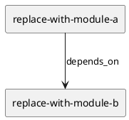

# <ISS_ID> <ISS_TITLE> — 設計（HOW）

> このテンプレートは最小 scaffold です。プロジェクトの目的、作業内容、人間の理解しやすさ、エージェントの実行可能性に合わせて、項目は追加・削除・統合・並べ替えてよい。

## Parent Diagram References
- Epic diagrams:
  - ...
- Initiative diagrams:
  - ...
- reused decisions:
  - ...

## 目的・制約
- 目的:
  - ...
- MUST / MUST NOT:
  - ...
- 非交渉制約:
  - ...
- 前提:
  - ...

## 既存実装 / 規約の理解
- 参照した実装 / docs:
  - ...
- 現状理解:
  - ...
- 採用するパターン:
  - ...
- 採用しないもの:
  - ...
- 影響範囲:
  - ...

## 採用方針 / トレードオフ
- 論点:
  - ...
- 選択肢:
  - ...
- 決定:
  - ...

## 依存関係分析
- module dependency:
  - ...
- class dependency（必要時）:
  - ...
- function dependency（必要時）:
  - ...
- file dependency:
  - ...
- upstream / prerequisite:
  - ...
- downstream / dependent:
  - ...
- 実装起点:
  - 依存の少ないもの / 先に固定すべき interface / 先に通すべき test を書く
- sequencing implications:
  - plan では upstream / prerequisite から順に step を組む

## Module Dependency Diagram
- Question answered:
  - どの module / class / file / function の依存方向を固定し、どこから実装を始めるか
- Scope:
  - ...
- Excluded details:
  - exhaustive call graph / 全 method / 全 import は描かない
- Update trigger:
  - 依存方向、責務境界、実装起点、変更対象 module が変わるとき
- Diagram:
  - N/A: reason

### UML（原則: module dependency / package delta）


## Local Diagram Delta（必要時）
- changed boundary / responsibility / interaction:
  - N/A: reason

## インターフェース契約
- API / function / protocol / data boundary:
  - ...

## Sequence Delta（必要時）
- changed interaction:
  - N/A: reason
- retry / transaction / external API / queue:
  - ...
- UML:
  - 必要な場合だけ追加する。追加時は `phase_design.md` の diagram metadata rule に従う

## Domain Model Delta（必要時）
- parent model refs:
  - ...
- aggregate / entity / value object changes:
  - N/A: reason
- domain event / policy / specification changes:
  - ...
- invariant changes:
  - ...
- UML:
  - 必要な場合だけ追加する。追加時は `phase_design.md` の diagram metadata rule に従う

## クラス / インターフェース詳細設計（必要時）
- Class / Interface:
  - ...
- responsibility:
  - ...
- collaboration:
  - ...
- UML:
  - 必要な場合だけ追加する。追加時は `phase_design.md` の diagram metadata rule に従う

## ディレクトリ / ファイル変更計画
```text
.
|-- src/
|   |-- package/
|   |   |-- new_module.py        # Add: purpose; depends on: ...
|   |   |-- existing_module.py   # Modify: purpose; depends on: ...
|   |   `-- renamed_module.py    # Move/Rename from: src/package/old_module.py; purpose
|   `-- tests/
|       `-- test_new_module.py   # Add/Modify: purpose; depends on: src/package/new_module.py
|-- docs/
|   `-- reference.md             # Read only: purpose
`-- legacy/
    `-- obsolete_file.py         # Delete: purpose; depends on: replacement ready
```

## 要件 → 設計マッピング
- AC-001 -> ...
- EC-001 -> ...
- constraint -> ...

## テスト戦略
- Unit:
  - ...
- Integration:
  - ...
- E2E / manual:
  - ...
- migration / rollback / feature flag if needed:
  - ...

## 要件 / 例外 -> verification mapping
- AC-001 -> ...
- EC-001 -> ...
- constraint -> ...

## リスク / 移行 / ロールバック（必要時）
- ...

## 未確定事項
- Q-001:
  - 質問:
  - 選択肢:
    - A:
      - ...
    - B:
      - ...
  - 推奨案:
    - ...
  - 影響範囲:
    - ...
