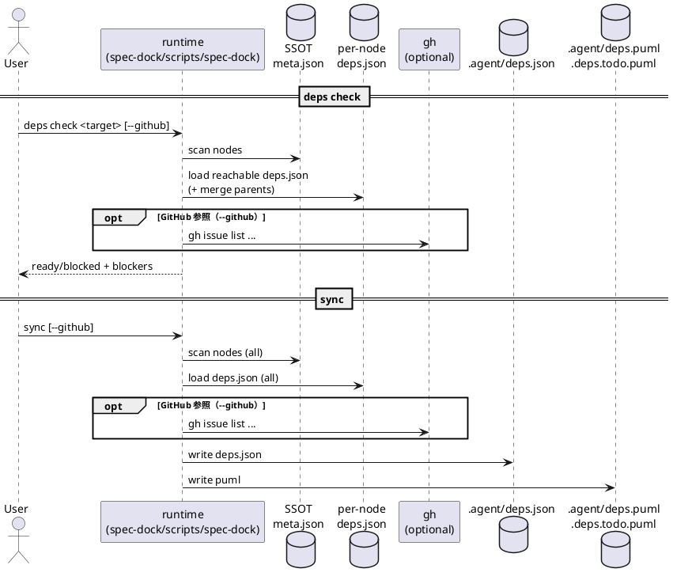
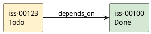
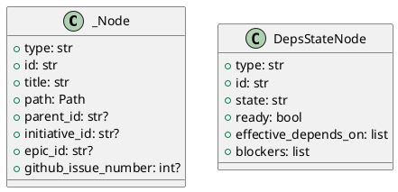

# iss-00009 Issue/Epic/Initiative の依存関係管理（実行可能判定・PlantUML可視化・active setガード） — 設計（HOW）

## 目的・制約（要件から転記・圧縮） (必須)
- 目的:
  - `deps.json`（ノード直下）で依存を定義し、依存グラフを統合して ready/blocked を機械判定できるようにする
  - `sync` で `.agent/deps.json` と PlantUML（全体/Done除外）を生成し、multi-agent で「次にやれること」を共有できるようにする
  - `active set` を依存でガードし、着手順の事故を防ぐ（`--force` で明示的に例外化）
- MUST（要件の中核）:
  - `deps check <target> [--github]` による実行可能判定（依存継承/マージ込み）
  - `sync` による `.agent/deps.json` + `.agent/deps.puml` + `.agent/deps.todo.puml` 生成
  - cycle / 解決不能参照 / 不正スキーマ等はエラーで止める（scope は要件に従う）
- MUST NOT:
  - `meta.json` の変更・スキーマ拡張
  - stdlib 以外の依存追加
  - GitHub Issue の更新（ラベル付与、クローズ等）
- 非交渉制約:
  - runtime script（`spec-dock/scripts/spec-dock`）は stdlib のみ
  - 依存の状態が取れない場合は Unknown として扱い、安全側（blocked）に倒す
- 前提:
  - GitHub issue state（OPEN/CLOSED）の取得は `gh` CLI を利用する（`sync --github` と同等）
  - 依存先は spec ツリー内ノードに限定（未 import の外部 Issue 参照は不可）
  - local-only ノードの Done 付け（手動 override 等）は MVP では扱わない（OUT OF SCOPE）

---

## 既存実装/規約の調査結果（As-Is / 99.9%理解） (必須)
- 参照した規約/実装（根拠）:
  - `src/spec_dock/assets/spec_dock/docs/guide.md`: SSOT/生成物/概念とディレクトリ構造の定義
  - `src/spec_dock/assets/spec_dock/docs/reference_sync.md`: `sync` の入力/出力/挙動（preflight validate, --github enrich, active 推定）
  - `docs/sync-aggregation.md`: `sync` の集計ロジックの補足（open/done/unknown の扱い）
  - `src/spec_dock/assets/spec_dock/scripts/spec-dock`:
    - `_scan_nodes()`（約 L487）: `meta.json` 走査で id→node を構築する（SSOT）
    - `_validate_nodes()`（約 L2163）: meta の整合性チェック（親子・一意性）
    - `_gh_issue_index()`（約 L1813）: `gh issue list` で GitHub state を取得して index 化する
    - `_sync()`（約 L1963）: `.agent/index.json` / `.agent/tree.json` の生成
    - `_active_set()`（約 L1712）: active pointer の更新（依存ガードは未実装）
  - `tests/test_cli.py`: runtime script の既存テストパターン（temp repo + runtime 実行）
- 観測した現状（事実）:
  - 依存関係を表す SSOT/派生物（`deps.json` / `.agent/deps.json` / PlantUML）が存在しない
  - `sync` は meta 走査 +（任意）GitHub enrich により index/tree を生成するが、依存に関する検証・集計は行わない
  - `active set` は依存未解決でも active 化できる
- 採用するパターン（命名/責務/例外/DI/テストなど）:
  - runtime script は 1ファイル完結・stdlibのみ・`RuntimeError` で失敗を表現し、`main()` が `error: ...` で表示する
  - 生成物は `spec-dock/.agent/` 配下へ出力し、git 管理しない（既存方針）
  - CLI ログは `spec-dock: ok (...)` / `spec-dock: (warn) ...` の安定 prefix を使う
- 採用しない/変更しない（理由）:
  - `meta.json` に依存情報を埋め込まない（SSOT を安定させる）
  - GitHub Projects や label で Doing 判定をしない（運用が増え、取得も複雑）
- 影響範囲（呼び出し元/関連コンポーネント）:
  - runtime script:
    - `sync`: 新しい派生物の生成（deps.json / puml）
    - `active set`: ガード（--force）
    - `deps check`: 新規サブコマンド
  - docs: `reference_sync.md` に出力追加、依存定義/運用ガイドの追加
  - tests: `tests/test_cli.py` に依存関連のテスト追加

## 主要フロー（テキスト：AC単位で短く） (任意)
- Flow for AC-001:
  1) `deps check <target>` が `<target>` を node として解決（GitHub番号 or node id）
  2) `<target>` の `deps.json` と上位（epic/initiative）の `deps.json` を読み、実効依存を計算（和集合）
  3) 依存先を解決（node id / GitHub issue number）し、ready/blocked と blockers を出力する（`--json` で機械可読）
- Flow for AC-002:
  1) issue を `deps check` したとき、親 epic/initiative の依存をマージする
  2) 重複は解決後に node id に正規化して排除する（出力順序は決定的）
  3) effective_depends_on / blockers が決定的順序で表示される
- Flow for AC-003:
  1) `deps check <target> --github` が `gh issue list` を実行し、OPEN/CLOSED を取得する（失敗時は warn して Unknown 扱い）
  2) 依存先がすべて Done（CLOSED / epic/initiative は ADR-00005）なら ready=true
  3) 1つでも open/unknown があれば blocked（blockers に列挙）
- Flow for AC-004/005（active set ガード）:
  1) `active set <target>` 実行時に `deps check` 相当の判定を行う
  2) blocked なら失敗し、blockers を表示する
  3) `--force` の場合は warn を出して active 化を継続する
- Flow for AC-006/007/008（sync 生成物）:
  1) `sync` が meta を走査し（必要なら `--github` で state を enrich）、依存グラフを統合する
  2) `.agent/deps.json`（SSOT）を生成する（nodes[].state/ready/effective_depends_on/blockers を含む）
  3) `.agent/deps.puml`（全体）と `.agent/deps.todo.puml`（Done除外）を生成する

### UML（任意） (任意)


## データ・バリデーション（必要最小限） (任意)
- MODEL-001: `deps.json`（ノード直下 / schema_version=1）
  - Fields:
    - `schema_version: int`（必須 / `1` 以外はエラー）
    - `depends_on: list`（任意 / 省略時 `[]`）
  - Constraints/Validation:
    - `depends_on` 要素は node id（`init|epic|iss`）または GitHub issue number（int/数字文字列）
    - 解決後は node id に正規化して重複排除（出力順は決定的）
    - 不明キーは無視（将来拡張）
    - **descendant 依存は禁止**:
      - 例: initiative が配下 epic/issue を depends_on に含める、epic が配下 issue を depends_on に含める
      - 理由: issue/epic は親依存を継承するため、親→子依存は子の自己依存/循環に発展する
      - 扱い: 構造エラー（`deps check`/`sync` ともに exit=1、エラーに deps.json のパス + 依存先 id を含める）
- MODEL-002: `.agent/deps.json`（派生 SSOT / schema_version=1）
  - Fields（最小）:
    - `schema_version: 1`
    - `generated_at: str(ISO-8601)`
    - `active: object|null`（既存の active.json と同形でよい）
    - `nodes: { <id>: { type,id,title,path,state,ready,effective_depends_on,blockers,... } }`
  - Constraints:
    - `nodes[<id>].state` は `done|doing|todo|unknown|blocked`
    - `ready` は「実効依存がすべて Done」のとき true（state とは独立）
    - `effective_depends_on` / `blockers` は node id 配列（決定的順序）
- MODEL-003: `.agent/deps.puml` / `.agent/deps.todo.puml`
  - Constraints:
    - 色分け（state）と凡例を含める
      - done: `#D5E8D4`
      - doing: `#DAE8FC`
      - todo: `#FFF2CC`
      - unknown: `#EEEEEE`
      - blocked: `#F8CECC`
    - todo-only は done ノードを除外する（edge も除外）

### UML（任意） (任意)


## 状態計算（Done/Doing/Todo/Unknown/Blocked と ready） (必須)
- 入力（最小）:
  - spec ツリー（`meta.json` → `_scan_nodes()`）
  - 依存定義（各ノード直下 `deps.json`）
  - active（`spec-dock/.agent/active.json` の leaf。ADR-00002）
  - GitHub issue state index（任意。`gh issue list` の結果）
  - progress（epic/initiative の配下 issue 集計。ADR-00005 の B で使用）
- 依存の解決（ADR-00001/00003）:
  - `depends_on` の各要素は node id 文字列（`init-*`/`epic-*`/`iss-*`）または GitHub issue number（int/数字文字列）
  - node id 文字列は、幅の違い（例: `iss-local-1`）があっても numeric id として解決し、実在する canonical id に正規化する
  - GitHub issue number は spec ツリー内の 1 node に解決できる必要がある（未 import はエラー）
- 実効依存（effective_depends_on）:
  - initiative: 自身の依存のみ
  - epic: 自身 + 親 initiative の依存（和集合）
  - issue: 自身 + 親 epic + 親 initiative の依存（和集合）
  - 重複排除は「解決後（canonical id 化後）」に行い、出力順は決定的（sort key は node id）
- base state（進捗状態: ADR-00002/00005）:
  - issue:
    - Done: GitHub `CLOSED`
    - Todo: GitHub `OPEN`
    - Unknown: `--github` 無し / `github.issue_number` 無し / `gh` 取得失敗 / `gh` 取得漏れ
    - Doing: active leaf と一致（ただし Done が優先）
  - epic/initiative:
    - Done: ADR-00005 の A または B を満たす
      - A: 自身の GitHub issue が `CLOSED`
      - B: `total > 0` かつ `done == total` かつ `open == 0` かつ `unknown == 0`
    - Unknown: GitHub state が取れない（`--github` 無し / `github.issue_number` 無し / `gh` 取得失敗 / `gh` 取得漏れ）
    - Todo: 上記以外（= GitHub `OPEN` かつ Doing ではない）
    - Doing: active leaf と一致（ただし Done が優先）
- ready（実行可能）:
  - `ready = effective_depends_on がすべて Done`（requirement.md の定義どおり。target 自身の Done で短絡しない）
  - 補足:
    - `state` と `ready` は別軸であり、`state=done` でも `ready=false` は起こり得る（依存未解決のままクローズした等）
    - PlantUML は `state` を色分けに使うため、依存不整合の監査が必要な場合は `.agent/deps.json` の `ready/blockers` を見る
- blockers:
  - `blockers = effective_depends_on のうち Done ではないもの`（Todo/Doing/Unknown/Blocked を含む）
- 表示用 state（PlantUML/`.agent/deps.json` の `state`）:
  - Blocked は “表示用の導出状態”（ADR-00002）。state を 1つに畳むため、以下の優先順位で `state` を決める:
    1) Done
    2) Blocked（`ready == false`）
    3) Doing
    4) Todo
    5) Unknown
  - これにより、`--force` 等で依存未解決のまま active 化されたノードは Blocked 表示になり、順番違反を可視化できる。

## 判断材料/トレードオフ（Decision / Trade-offs） (任意)
- 論点: Doing 判定をどうするか
  - 選択肢A: active leaf のみ（採用）
  - 選択肢B: GitHub label / Projects status（不採用）
  - 決定: A（ADR-00002）
  - 理由: 取得/運用コストが低く、壊れにくい
- 論点: 依存の統合生成を `sync` に寄せるか
  - 決定: `sync` に統合して毎回生成（ADR-00004）
  - 理由: “sync を回せば派生状態が最新” を最優先する

## インターフェース契約（ここで固定） (任意)
### API（ある場合）
- 該当なし（CLI のみ）

### CLI（コマンド/引数/出力/終了コード）
#### `deps check`
- 形式:
  - `./spec-dock/scripts/spec-dock deps check <target> [--github] [--gh-limit N] [--json]`
- `target`:
  - `123` / `#123` / URL（GitHub issue number として解釈）または node id（`iss-00123` 等）
- `--github`:
  - `gh issue list` で GitHub state（OPEN/CLOSED）を取得し、Done 判定に使用する
  - `gh` 取得に失敗した場合は `spec-dock: (warn) ...` を出し、Unknown として継続（安全側で blocked になりやすい）
- `--gh-limit`:
  - `gh issue list --limit`（default は `sync` と同じ `10000`）
  - `--github` 指定時に「node がリンクしている GitHub issue が取得できていない」場合は warn（`--gh-limit` 調整ヒント）し、Unknown として扱う
- 出力（text, default）:
  - ready のとき: `spec-dock: ok (deps check) target=<id> ready=true blockers=0`
  - blocked のとき: `spec-dock: blocked (deps check) target=<id> ready=false blockers=<n>` + ブロッカー一覧
- 出力（`--json`）:
  - schema（最小）:
    - `schema_version: 1`
    - `target: <id>`
    - `ready: bool`
    - `effective_depends_on: [<id>...]`
    - `blockers: [<id>...]`
    - `nodes: { <id>: { state, ready } }`（依存先の state 表示用。MVP は依存先+target に限定して良い）
    - `warnings: [str...]`（常に出力。空なら `[]`。安定した観測のため code 形式を推奨）
      - codes（MVP）:
        - `gh_fetch_failed`
        - `gh_index_incomplete`
  - 出力チャネル:
    - stdout は JSON のみ（パースを壊さない）
    - 人間向け warn は stderr（必要なら `warnings[]` と同内容を重複してもよい）
- 終了コード:
  - `0`: ready（実行可能）
  - `3`: blocked（依存未解決 / Unknown 含む）
  - `1`: 構造エラー（deps.json 不正、解決不能参照、cycle など）
  - `2`: 引数エラー（`argparse`。blocked と衝突しないよう reserved）

#### `active set`（ガード/force）
- 追加フラグ:
  - `./spec-dock/scripts/spec-dock active set <target> [--checkout] [--force|-f] [--github] [--gh-limit N]`
- 挙動:
  - 内部的に `deps check <target>` 相当の判定を行う（scope は到達可能な部分グラフ）
  - blocked かつ `--force` なし: 失敗（exit=3）。active は更新しない。ブロッカーと `--force` のヒントを表示
  - blocked かつ `--force`: warn（ブロッカーを列挙）を出して継続し、active を更新
  - `--github`: `deps check --github` 相当（判定根拠を GitHub state に寄せる）
  - `--gh-limit`: `gh issue list --limit`（default は `sync` と同じ `10000`）
  - 派生物整合（best-effort）:
    - `spec-dock/.agent/active.json` が SSOT
    - `spec-dock/.agent/index.json` / `spec-dock/.agent/tree.json` が存在する場合は、`active` フィールドのみ更新して整合させる（node 情報は再生成しない。GitHub enrich の上書きを避ける）
  - 注意: **`active set` は `sync` を自動実行しない**（GitHub enrich 済み派生物の上書きを防ぐため）。依存グラフ派生物（deps.*）の更新は `sync` に寄せる。

#### `sync`（生成物）
- 追加生成物（git 管理しない）:
  - `spec-dock/.agent/deps.json`
  - `spec-dock/.agent/deps.puml`
  - `spec-dock/.agent/deps.todo.puml`
- `sync` の失敗条件:
  - deps 構造エラー（不正 JSON / 不正 schema / 解決不能参照 / 自己依存 / cycle / descendant 依存）はエラーで停止（要件どおり）
- `sync --github` の `gh` 取得失敗時:
  - warn + Unknown 扱いで継続（構造エラーではないため）
- `sync --force` との関係（既存仕様の整理）:
  - `--force` は meta の preflight validate を握りつぶして index/tree を生成するためのデバッグ用 escape hatch
  - deps 構造エラーがある場合も、`--force` なら warn を出して継続し、**index/tree は更新する**
    - ただし deps 派生物（`.agent/deps.json` / `.puml`）は **削除** して「最新が無い」ことを明確にする（古い派生物の誤用を防ぐ）
    - warn code は安定させる（例: `deps_preflight_failed`）
    - このケースの終了コードは `0`（force による劣化成功）。機械判定は warn code または deps 派生物の有無で行う

### 終了コード実装メモ（runtime script） (必須)
- 現状: runtime script の `main()` は例外を捕捉して常に `exit=1` で失敗する（blocked を `3` にできない）。
- 方針:
  - `deps check` / `active set` は “blocked” を通常のエラーとは別扱いにし、ハンドラが `int` を返すことで `0/3/1` を実現する（例外は構造エラーのみ）。
  - `main()` はコマンドハンドラの返り値（`int|None`）を尊重して終了コードを決定する。

### 関数・クラス境界（重要なものだけ）
- IF-001: `spec-dock/scripts/spec-dock::_load_deps_json(path: Path) -> dict`
  - Input: `deps.json` のパス
  - Output: 検証済み dict（`schema_version`, `depends_on` を含む）
  - Errors: JSON parse / schema 不正（EC-002/007）
- IF-002: `spec-dock/scripts/spec-dock::_resolve_dep_ref(nodes, ref, *, src_path) -> str`
  - Input: `ref`（node id 文字列 or 数字）
  - Output: 依存先 node id（canonical）
  - Errors: 解決不能 / 曖昧解決（EC-006）
- IF-003: `spec-dock/scripts/spec-dock::_effective_depends_on(nodes, node_id, direct_map) -> list[str]`
  - Input: ノードと direct deps（解決済み）
  - Output: 実効依存（親依存マージ済み / 重複排除 / 決定的順序）
- IF-004: `spec-dock/scripts/spec-dock::_validate_deps_cycles(nodes, deps_map, *, scope) -> None`
  - Input: deps edge（node -> effective deps）
  - Output: None
  - Errors: cycle 検出（EC-004。`A -> B -> ... -> A` を最低1経路表示）
  - Scope:
    - `sync`: 全体グラフ
    - `deps check` / `active set`: `<target>` から依存を辿った推移閉包（到達可能な部分グラフ）
- IF-005: `spec-dock/scripts/spec-dock::_build_deps_state(...) -> dict`
  - Input: nodes, active, GitHub issue_index（任意）
  - Output: `.agent/deps.json` と同型の dict
- IF-006: `spec-dock/scripts/spec-dock::_render_deps_puml(deps_state, *, todo_only: bool) -> str`
  - Input: deps_state（`.agent/deps.json`）
  - Output: PlantUML テキスト
- IF-007: `spec-dock/scripts/spec-dock::_patch_derived_active_fields(specdock_dir: Path, *, active: dict) -> None`
  - Input: `spec-dock/.agent/active.json` と同形の dict
  - Behavior: `.agent/index.json` / `.agent/tree.json` が存在する場合に `active` フィールドのみ更新（node の再生成はしない）

### UML（任意） (任意)


### 実装単位（クラス追加しない）
- runtime script は既存の `_Node` dataclass を再利用し、deps は関数群 + dict で扱う（実装コストと複雑性を抑える）

### 例外/エラー契約（重要なものだけ） (任意)
- ERR-001: `deps.json` JSON parse error
  - 発生条件: JSON が壊れている（EC-002）
  - 返し方: `RuntimeError("Invalid JSON: <path>: <reason>")`
- ERR-002: `deps.json` schema error
  - 発生条件: `schema_version!=1` / `depends_on` が配列でない / 要素型不正（EC-007）
  - 返し方: `RuntimeError("Invalid deps schema: <path>: <reason>")`
- ERR-003: unresolved/ambiguous dependency reference
  - 発生条件: node id が存在しない / GitHub issue number が spec ツリーに無い or 複数一致（EC-006）
  - 返し方: `RuntimeError("Unresolved dependency: <ref> (in <path>)")`
- ERR-004: cycle detected
  - 発生条件: cycle（EC-004）
  - 返し方: `RuntimeError("Dependency cycle detected: A -> B -> ... -> A")`
- ERR-006: invalid descendant dependency
  - 発生条件: `deps.json` が自分の配下（descendant）ノードを `depends_on` に含めている（EC-009）
  - 返し方（例）: `RuntimeError("Invalid dependency: <src> cannot depend on its descendant <dst> (in <deps.json path>)")`
- ERR-005: blocked（active set のみ）
  - 発生条件: `active set` 対象が blocked かつ `--force` なし（AC-004）
  - 返し方: `spec-dock: blocked (active set) ...` を出し、exit=3（例外ではなく終了コードで表現）
- WARN-001: GitHub state 取得失敗（`--github` 指定時）
  - 発生条件: `gh` 未インストール/未認証/通信失敗など（EC-008）
  - 返し方: `spec-dock: (warn) failed to fetch GitHub issue states; treating as unknown: <reason>`
  - 復旧ヒント（出力に含める）:
    - `sync --github` の実行、`--gh-limit` 調整、`gh auth status` の確認
- WARN-002: GitHub issue index が不完全（`--gh-limit` 不足など）
  - 発生条件: `--github` 指定時に、`github.issue_number` を持つ node が `gh issue list` の結果に存在しない
  - 返し方: `spec-dock: (warn) GitHub issue states are incomplete; treating missing issues as unknown: ...`
  - 復旧ヒント（出力に含める）:
    - `--gh-limit` の増加、`sync --github` の再実行

## 変更計画（ファイルパス単位） (必須)
- 追加（Add）:
  - （任意）`src/spec_dock/assets/spec_dock/docs/reference_deps.md`: 依存定義/コマンド/生成物のリファレンス
- 変更（Modify）:
  - `src/spec_dock/assets/spec_dock/scripts/spec-dock`: deps 機能の実装（sync 出力追加 / deps check / active set ガード）
  - `src/spec_dock/assets/spec_dock/docs/reference_sync.md`: `sync` の生成物に deps を追記
  - `src/spec_dock/assets/spec_dock/docs/guide.md`: 依存機能の導線（どこに何が生成されるか）
  - `tests/test_cli.py`: deps 機能のテスト追加（AC/EC を担保）
- 削除（Delete）:
  - 該当なし
- 移動/リネーム（Move/Rename）:
  - 該当なし
- 参照（Read only / context）:
  - `spec-on-dev/requirement.md`: AC/EC と固定仕様の参照
  - `spec-on-dev/adrs/*.md`: ADR 決定事項の参照

## マッピング（要件 → 設計） (必須)
- AC-001/002/003 → `spec-dock/scripts/spec-dock` の `deps check`（IF-001〜004）
- AC-004/005 → `spec-dock/scripts/spec-dock` の `active set --force`（ERR-005）
- AC-006/007/008 → `spec-dock/scripts/spec-dock` の `_sync()` 拡張（IF-005/006）
- EC-001/002/006/007 → deps パース/解決（IF-001/002、ERR-001〜003）
- EC-003/004 → 自己依存/循環（IF-004、ERR-004）
- EC-005/008 → Unknown を blocker 扱い + `--force` で回避（状態モデル/ガード）
- EC-009 → descendant 依存の検出（MODEL-001 / ERR-006、direct deps 解決段階で fail-fast）
- EC-010 → `sync --force` の deps preflight 失敗時ハンドリング（deps 派生物削除 + warn code）
- 非交渉制約（stdlib/非破壊/meta不変更）→ 実装を runtime script 内に閉じ、`.agent/` 出力に限定する

## テスト戦略（最低限ここまで具体化） (任意)
- 追加/更新するテスト:
  - Unit（runtime script を subprocess 実行するテスト）: `tests/test_cli.py` に追加（既存と同方式）
- GitHub 取得の stub:
  - `tests/test_cli.py` に `gh issue list` を返す stub を追加する（既存の `gh issue view` stub と同様に `PATH` を差し替える）
  - 返す JSON は `[{number: 1, state: \"OPEN\"|\"CLOSED\", ...}, ...]` の最小でよい（runtime script の `_gh_issue_index()` に合わせる）
- 観測点（契約）:
  - `deps check`:
    - exit: `0|3|1`（ready/blocked/error）
    - stdout/stderr: `--json` の schema と `warnings[]`（code）、text 出力の prefix
  - `active set`:
    - blocked のとき active.json が不変（`--force` なし）
    - `--force` ありは active.json が更新され、warn が出る
  - `sync`:
    - `.agent/deps.json` / `.agent/deps.puml` / `.agent/deps.todo.puml` が生成され、最小契約を満たす
- どのAC/ECをどのテストで保証するか:
  - AC-001/002/003 → `tests/test_cli.py::test_deps_check_ready_and_blocked`（仮）
  - AC-004/005 → `tests/test_cli.py::test_active_set_blocked_requires_force`（仮）
  - AC-004 派生物整合（best-effort）→ `tests/test_cli.py::test_active_set_updates_index_tree_active_only`（仮）
  - AC-006/007/008 → `tests/test_cli.py::test_sync_generates_deps_and_puml`（仮）
  - EC-002/007 → `tests/test_cli.py::test_deps_json_schema_errors_fail`（仮）
  - EC-004 → `tests/test_cli.py::test_deps_cycle_detected`（仮）
  - EC-004（到達不能 cycle 非対象）→ `tests/test_cli.py::test_deps_check_ignores_unreachable_cycle`（仮）
  - EC-003 → `tests/test_cli.py::test_deps_self_dependency_fails`（仮）
  - EC-006 → `tests/test_cli.py::test_deps_unresolved_ref_fails`（仮）
  - EC-008 → `tests/test_cli.py::test_deps_github_fetch_failure_warns_and_blocks`（仮）
  - EC-009 → `tests/test_cli.py::test_deps_descendant_dependency_fails`（仮）
  - EC-010 → `tests/test_cli.py::test_sync_force_skips_deps_on_deps_error`（仮）
  - WARN-002（`--gh-limit` 不足）→ `tests/test_cli.py::test_deps_github_index_incomplete_warns_and_blocks`（仮）
  - ADR-00005（`total==0` 例外）→ `tests/test_cli.py::test_epic_total_zero_is_not_done_by_aggregation`（仮）
  - ADR-00005（A による Done）→ `tests/test_cli.py::test_epic_total_zero_closed_is_done_by_rule_a`（仮）

### テストマトリクス（AC/EC → テスト） (任意)
- AC-001:
- Unit: temp repo で `deps.json` を配置し、`deps check` の出力（ready/blocked + blockers）と exit code（`0/3/1`）を確認
- EC-001:
- Unit: `deps.json` 不在の node が依存なしとして扱われること
- EC-002/007:
  - Unit: 壊れた JSON / schema_version 不正 / depends_on 型不正が、対象ファイルパスと理由つきで失敗すること
- EC-003:
  - Unit: 自己依存（`depends_on` に自分自身）がエラーになること
- EC-004:
  - Unit: cycle（`A -> B -> ... -> A`）が検出され、最低1経路が出力されること（scope は `sync` と `deps check` でそれぞれ）
  - Unit: 到達不能な cycle は `deps check <target>` の失敗要因にしないこと（scope 差分の回帰防止）
- EC-006:
  - Unit: 未 import の GitHub issue number / 存在しない node id が「ref + 定義元 deps.json パス」つきで失敗すること
- EC-008:
  - Unit: `gh` 取得失敗時に warn が出て Unknown 扱い（安全側で blocked）になり、復旧ヒント（`sync --github` / `--gh-limit` / `gh auth status`）が出ること
- ADR-00005:
  - Unit: epic/initiative の `total==0` では B を満たさず、依存先にした場合に ready にならないこと
  - Unit: epic/initiative 自身の GitHub issue が `CLOSED` の場合は、`total==0` でも A により Done になること
- 非交渉制約（requirement.md）をどう検証するか:
  - 制約: stdlib のみ
    - 検証方法: `pyproject.toml` 依存追加無し、runtime script 内完結
  - 制約: `meta.json` 不変更
    - 検証方法: deps 機能は `deps.json` / `.agent/*` のみを読む/書く（テストで meta の差分が出ないこと）
- 実行コマンド（該当するものを記載）:
  - `python -m unittest discover -v`
- 変更後の運用（必要なら）:
  - 移行手順: 依存が必要なノードにだけ `deps.json` を追加する（ファイルが無ければ依存なし）
  - ロールバック: `deps.json` を削除すれば依存は無効化される（派生物は `sync` で再生成）

## リスク/懸念（Risks） (任意)
- R-001: local-only 運用では Unknown が多くなり blocked が増える（影響: `--force` 常用化 / 対応: OUT OF SCOPE として割り切り、将来 override を検討）
- R-002: `--gh-limit` 不足で Unknown が増え誤 blocked になる（影響: 着手が止まる / 対応: 復旧手順をメッセージ・docs に明記）
- R-003: 依存が増えると PlantUML が巨大化し可読性が落ちる（影響: 可視化の価値低下 / 対応: todo-only と凡例、必要なら将来フィルタ機能）

## 未確定事項（TBD） (必須)
- 該当なし（要件側で決定済み）

---

## ディレクトリ/ファイル構成図（変更点の見取り図） (任意)
```text
<repo-root>/
├── src/spec_dock/assets/spec_dock/
│   ├── scripts/spec-dock                      # Modify（deps 実装）
│   └── docs/
│       ├── reference_sync.md                  # Modify（出力追加）
│       └── reference_deps.md                  # Add（任意）
└── tests/test_cli.py                          # Modify（deps テスト追加）
```

## 省略/例外メモ (必須)
- 該当なし
