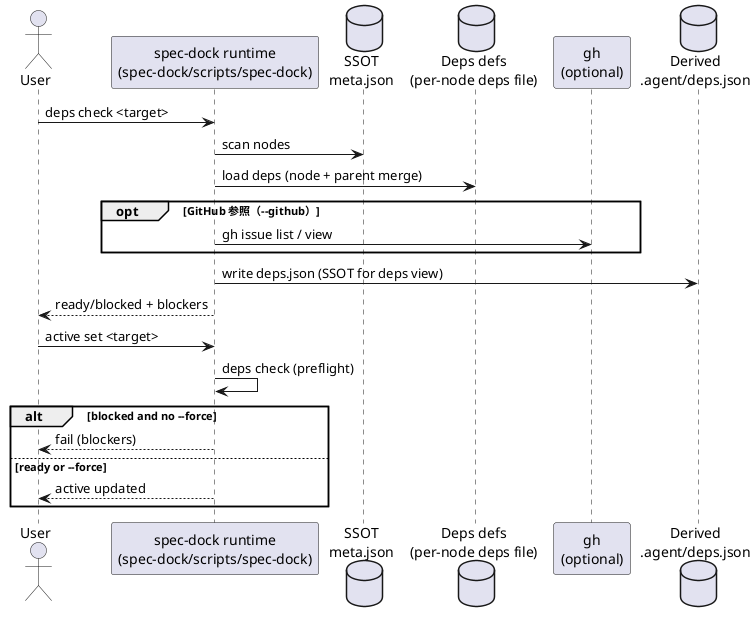

# iss-00009 Issue/Epic/Initiative の依存関係管理（実行可能判定・PlantUML可視化・active setガード） — 要件定義（WHAT / WHY）

## 目的（ユーザーに見える成果 / To-Be） (必須)
- spec-dock の Issue / Epic / Initiative 間の依存関係を、`meta.json` とは別ファイルで定義し、統合・可視化・実行可能判定できるようにする。
- 依存が未解決の対象は原則「着手不可」として扱い、`active set` 時にブロック（`--force` で解除）できるようにする。
- 全体の依存グラフを PlantUML として生成し、人間/エージェントが「次に着手できる作業」を一目で判断できる状態にする。

## 背景・現状（As-Is / 調査メモ） (必須)
- 現状の挙動（事実）:
  - spec-dock の SSOT は `spec-dock/initiatives/**/meta.json`（initiative/epic/issue）であり、`sync` が `.agent/index.json` / `.agent/tree.json` を生成する（git 管理しない）。
  - `sync --github` の場合のみ `gh issue list` を用いて GitHub Issue の `OPEN/CLOSED` を取得し、issue の状態を `open/done/unknown` として集計する。
  - `active set <target>` は active pointer を更新するが、依存関係の概念が無いため「依存未解決でも active にできる」。
- 現状の課題（困っていること）:
  - 複数の Codex CLI / エージェントが同時並行で作業する際、依存があるタスクを誤って先に着手したり、マージ順を誤るリスクが高い。
  - 依存関係が分散（人間の記憶/メモ/口頭）しており、全体の依存グラフを一貫して可視化できない。
  - タスクが「着手可能か」を機械的に判定できず、`active set` がガードにならない。
- 再現手順（最小で）:
  1) 任意の issue を `./spec active set <target>` で active にする
  2) その issue が未完了の別 issue に依存していても、ブロックされずに active 化できる（依存という概念自体が存在しない）
- 観測点（どこを見て確認するか）:
  - CLI: `./spec-dock/scripts/spec-dock`（runtime script）
  - State: `spec-dock/.agent/{active.json,index.json,tree.json}`
  - Active pointers: `spec-dock/active/**`
- 実際の観測結果（貼れる範囲で）:
  - Input/Operation: `active set` / `sync --github`
  - Output/State: 依存に関する出力・状態ファイル・可視化は存在しない
- 情報源（ヒアリング/調査の根拠）:
  - Issue/チケット: GitHub Issue #9
  - ドキュメント:
    - `README.md`（概要・コマンド）
    - `src/spec_dock/assets/spec_dock/docs/guide.md`（SSOT/生成物/概念）
    - `src/spec_dock/assets/spec_dock/docs/reference_sync.md`（sync の挙動）
    - `docs/sync-aggregation.md`（sync 集計の補足）
  - コード:
    - `src/spec_dock/assets/spec_dock/scripts/spec-dock`（runtime script）
      - `_scan_nodes()` / `_write_meta()`（SSOT 走査・メタ）
      - `_sync()`（index/tree 生成・GitHub enrich）
      - `_active_set()`（active 設定）
      - `_gh_issue_index()`（GitHub 状態取得）

## 対象ユーザー / 利用シナリオ (任意)
- 主な利用者（ロール）:
  - 複数エージェント（Codex CLI 等）で並行実装する開発者
  - 仕様ツリー（initiative/epic/issue）を運用する人間のメンテナ
- 代表的なシナリオ:
  - シナリオA: 次に着手する issue を探す
    - `deps check` で ready/blocked を確認し、blocked の場合はブロッカーを把握して上位から順に片付ける。
  - シナリオB: active 化時にガードする
    - エージェントが `active set` する際に依存未解決なら失敗し、`--force` の明示がない限り着手順違反を防ぐ。
  - シナリオC: 全体の依存グラフを共有する
    - PlantUML を生成し、Done/Doing/Todo など状態で色分けした依存グラフを見て作業分担する。

### UML（任意） (任意)

## スコープ（暴走防止のガードレール） (必須)
- MUST（必ずやる）:
  - 依存関係を `meta.json` とは別ファイルで「ノード単位」に定義できる（initiative/epic/issue）。
  - 依存関係を全体で統合し、ツールが参照する SSOT（派生状態）を生成できる（例: `spec-dock/.agent/deps.json`）。
  - 任意の target（issue/epic/initiative）を指定して「実行可能（依存クリア）か」を判定し、未解決依存（ブロッカー）を出力できる。
  - 依存グラフを PlantUML として生成できる（全体版 + Done 除外版）。
  - `active set` はデフォルトで依存未解決をブロックし、`-f/--force` で強制できる。
  - 依存の継承（マージ）:
    - issue の実効依存 = issue 自身 + 親 epic + 親 initiative の依存の和集合
    - epic の実効依存 = epic 自身 + 親 initiative の依存の和集合
- MUST NOT（絶対にやらない／追加しない）:
  - `meta.json` のスキーマ変更や、既存 `meta.json` の自動書き換え（依存を埋め込まない）。
  - runtime script に stdlib 以外の依存を追加（導入先で動かなくなるため）。
  - GitHub Issue の更新（ラベル付け、状態変更、本文編集など）を自動で行う。
- OUT OF SCOPE:
  - GitHub Projects の Status 等（In Progress 等）の厳密な参照（MVP では扱わない/要相談）。
  - 依存関係を編集するための専用 UI / TUI（まずはファイル編集で十分）。
  - 依存の自動解決（例: PR マージで自動的に依存を消す等）。
  - local-only ノード（`*-local-*` / `github.issue_number` 無し）の Done 付け（手動 override / マーカー等）

## 境界（Always / Ask / Never） (必須)
- Always（常に守る）:
  - 依存定義は「人間が読み書きできる」シンプルな形式にする。
  - 依存解決判定は観測可能（出力に根拠を含める）にする。
  - 既存コマンドの互換性を壊さない（新機能は後方互換で追加）。
- Ask（迷ったら相談）:
  - 状態モデル拡張（Doing を GitHub label / Projects status で判定する等）を追加する場合
  - spec ツリー外（未 import）の GitHub Issue を “外部ノード” として依存に含めたい場合
- Never（絶対にしない）:
  - `meta.json` を依存管理の入れ物として使う（目的外拡張）。
  - エラーを黙殺して “なんとなく動く” 状態にする（依存は順序を決めるので曖昧さは危険）。

## 決定事項（ADR） (必須)
- ADR-00001: 依存定義は `deps.json`（JSON）で管理する
- ADR-00002: 状態モデルは GitHub state + active のみ（MVP）
- ADR-00003: 依存先は spec ツリー内ノードに限定（外部 Issue は MVP では不可）
- ADR-00004: 依存の統合 SSOT / PlantUML は `sync` の生成物として毎回生成する
- ADR-00005: epic/initiative の Done は「親 issue CLOSED」または「配下 issue 全部 Done」

## 仕様（固定ルール） (必須)
### 依存定義（`deps.json`）
- 置き場所: initiative/epic/issue ノード直下の `deps.json`
- スキーマ:
  - `schema_version: 1`（必須。`1` 以外はエラー）
  - `depends_on: [...]`（任意。省略時は `[]` として扱う）
    - 要素: node id 文字列（`init-*`/`epic-*`/`iss-*`）または GitHub issue number（整数、または数字文字列）
    - 不正な要素（例: `null` / `true` / `-1` / `{}` / `\"\"`）はエラー
  - 不明なキーは無視する（将来拡張のため）
- ファイルが無い場合: `depends_on=[]`（依存なし）

### 依存の継承（実効依存）
- initiative: 自身の `depends_on` のみ
- epic: 自身 + 親 initiative（和集合）
- issue: 自身 + 親 epic + 親 initiative（和集合）

### 依存指定の解決（MVP）
- node id 指定: spec ツリー内のノードへ解決できること（存在しない id はエラー）
- GitHub issue number 指定: spec ツリー内の `github.issue_number=<num>` のノードへ一意に解決できること（未 import はエラー）
- 正規化:
  - 数字文字列は trim して GitHub issue number として解釈する
  - 解決後は node id に正規化してから重複排除する（同一ノードを `iss-00123` と `123` で二重指定しても 1 件として扱う）
  - 出力順序は決定的にする（例: node id の数値順、同値なら辞書順）※テストの安定性のため

### 状態モデル（MVP）
- Done: GitHub `CLOSED`
- Doing: `spec-dock/.agent/active.json` の leaf（`issue` > `epic` > `initiative`）
- Todo: GitHub `OPEN` かつ Doing ではない
- Unknown: GitHub 未参照 / `github.issue_number` 無し / `gh` で見つからない
- Blocked: 依存が未解決（open/unknown 等）で ready ではない（導出状態）

### 状態取得（MVP）
- GitHub state（OPEN/CLOSED）は `gh` CLI を用いて取得する（`sync --github` と同等）
- `gh` が利用できない/取得できない場合は Unknown として扱う（安全側で blocked）

### epic/initiative の Done 判定（依存評価用）
- Done = A または B
  - A: 自身の GitHub Issue が `CLOSED`
    - 注意: 子 issue が未完了でも Done になり得る（運用オーバーライド）。依存ガードの意味を薄めないよう運用で注意する。
  - B: 配下 issue がすべて Done（`total > 0` かつ `done == total` かつ `open == 0` かつ `unknown == 0`）
    - 例外: `total == 0` の場合は B を満たさない（自動 Done を防ぐ）。この場合は A のみで Done を判定する。

### ready（実行可能）判定
- ready = 実効依存がすべて Done
- Unknown は “未解決” として扱う（安全側）

### 派生状態（`sync` の生成物）
- `sync` は依存関係も統合し、以下を `spec-dock/.agent/` に生成する（git 管理しない）:
  - `deps.json`（依存グラフの統合 SSOT。エージェントが ready/blocked を機械判定できる形）
  - `deps.puml`（全体: Done を含む）
  - `deps.todo.puml`（todo-only: Done を除外）

### 依存グラフ検証（MVP）
- 目的: 依存管理は「着手順」のガードなので、曖昧さ/壊れた定義は原則エラーで止める
- 検査項目:
  - `deps.json` のパース/スキーマ不正
  - 解決不能参照（存在しない id / 未 import の GitHub issue number）
  - 自己依存
  - 循環依存（cycle）
- 検査範囲:
  - `sync`: 依存グラフ全体
  - `deps check <target>` / `active set <target>`: `<target>` の実効依存から到達可能な部分グラフ

### `active set` ガード（MVP）
- `active set <target>` は、依存チェック（`deps check <target>` 相当）を事前に行う
  - blocked の場合: デフォルトで失敗し、ブロッカーを表示する
  - `-f/--force` の場合: blocked でも警告を出した上で強制的に active 化する

## 非交渉制約（守るべき制約） (必須)
- runtime script（`spec-dock/scripts/spec-dock`）は stdlib のみで完結すること。
- `meta.json`（SSOT）は依存管理のために変更しないこと。
- 生成物は既存方針に合わせ、git 管理しない領域（例: `spec-dock/.agent/`）に出力すること（導入先の `.gitignore` により保護）。
- 依存未解決の判定に必要な情報が得られない場合（例: GitHub 未参照で状態が unknown）は、安全側（blocked 扱い）に倒すこと。
- `active set` の既存フローを壊さない（`--force` で回避可能にする）。

## 前提（Assumptions） (必須)
- `github.issue_number` は initiative/epic/issue 全体で一意である（既存仕様）。
- 依存管理は “番号/ID を列挙するだけ” の運用で十分である（編集 UI は不要）。
- GitHub の状態（OPEN/CLOSED）を用いて “Done” を判定する運用が主である。

## 判断材料/トレードオフ（Decision / Trade-offs） (任意)
- 論点: “実施中（In Progress）” をどのシグナルで判定するか
  - 選択肢A: active のみ（最小・壊れにくい）
  - 選択肢B: GitHub label / Projects status（表現力は上がるが運用と取得が複雑）
  - 決定: A（ADR-00002）

## リスク/懸念（Risks） (任意)
- R-001: 依存定義が増えると循環依存が発生しやすい（影響: 判定不能/永遠に blocked / 可視化崩壊 / 対応: cycle 検出と明確なエラー）
- R-002: 状態判定（done/doing/todo）が曖昧だと誤判定する（影響: 誤ってブロック/誤って着手 / 対応: MVP はシンプルにして、判定根拠を出力）
- R-003: GitHub enrich 依存が強いと offline で運用できない（影響: unknown が増え blocked になる / 対応: `--force` と “unknown の扱い” を明文化）

## 受け入れ条件（観測可能な振る舞い） (必須)
- AC-001:
  - Actor/Role: 開発者 / エージェント
  - Given: initiative/epic/issue ノード配下に依存定義ファイルが存在する（または不存在）
  - When: `deps check <target>` を実行する
  - Then: <target> の実効依存（自分+上位マージ）が解決され、ready/blocked とブロッカー一覧が出力される
  - 観測点: CLI 標準出力 / 終了コード
- AC-002:
  - Actor/Role: 開発者 / エージェント
  - Given: issue が依存を持ち、親 epic / initiative も依存を持つ
  - When: issue を `deps check` する
  - Then: issue の実効依存に、親 epic / initiative の依存が含まれる（和集合・重複なし）
  - 観測点: CLI 出力（依存一覧）
- AC-003:
  - Actor/Role: 開発者 / エージェント
  - Given: 依存先の GitHub state が取得できる（`--github` または同等の enrich）
  - When: `deps check <target> --github` を実行する
  - Then: 依存先がすべて CLOSED（Done）なら ready、1つでも OPEN/unknown なら blocked と判定される
  - 観測点: CLI 出力（依存ごとの state）/ 終了コード
- AC-004:
  - Actor/Role: エージェント
  - Given: <target> が blocked（依存未解決）
  - When: `active set <target>` を実行する
  - Then: active 化されずに失敗し、未解決依存（ブロッカー）が提示される
  - 観測点: `spec-dock/.agent/active.json` が更新されない / CLI のエラー出力 / 終了コード
- AC-005:
  - Actor/Role: エージェント
  - Given: <target> が blocked（依存未解決）
  - When: `active set <target> --force`（または `-f`）を実行する
  - Then: 依存ガードを無視して active 化できる（ただし警告として blocked 情報は出力される）
  - 観測点: `spec-dock/.agent/active.json` の更新 / CLI 出力（warn）
- AC-006:
  - Actor/Role: 開発者
  - Given: 依存定義が複数ノードに存在する
  - When: `sync` を実行する（例: `sync` / `sync --github`）
  - Then: 依存の統合 SSOT（`spec-dock/.agent/deps.json`）が生成され、少なくとも以下を満たす
    - `schema_version: 1`
    - `generated_at` が存在する
    - `nodes[<id>]` に `state`（文字列）と `ready`（真偽値）が含まれる
    - `nodes[<id>]` に `effective_depends_on` と `blockers`（配列）が含まれる
  - 観測点: `spec-dock/.agent/deps.json`（内容）
- AC-007:
  - Actor/Role: 開発者
  - Given: 依存定義が複数ノードに存在する
  - When: `sync` を実行する（例: `sync` / `sync --github`）
  - Then: PlantUML（全体版: `spec-dock/.agent/deps.puml`）が生成され、状態（done/doing/todo/unknown/blocked）で色分けされる
  - 観測点: `spec-dock/.agent/deps.puml`（内容）
- AC-008:
  - Actor/Role: 開発者
  - Given: done のノードが存在する
  - When: `sync` を実行する（例: `sync` / `sync --github`）
  - Then: todo-only（Done 除外版: `spec-dock/.agent/deps.todo.puml`）が生成される（未実施/実施中のみ）
  - 観測点: `spec-dock/.agent/deps.todo.puml`（内容）

### 入力→出力例 (任意)
- EX-001:
  - Input: `deps check iss-00123 --github`
  - Output（概念）:
    - `ready: false`
    - `blocked_by: [iss-00100, epic-00077]`
    - `depends_on: [iss-00100(done), epic-00077(open)]`

## 例外・エッジケース（仕様として固定） (必須)
- EC-001:
  - 条件: 依存定義ファイルが存在しない
  - 期待: 依存なしとして扱う（ready 判定は他条件に依存）
  - 観測点: `deps check` の依存一覧が空
- EC-002:
  - 条件: 依存定義ファイルが壊れている（JSON parse error 等）
  - 期待: コマンドは失敗し、どのファイルが壊れているかを明示する
  - 観測点: CLI エラー出力（ファイルパス）/ 終了コード != 0
- EC-003:
  - 条件: 依存先が自分自身を指す
  - 期待: validate エラーとして失敗する（自己依存は禁止）
  - 観測点: CLI エラー出力（id）/ 終了コード != 0
- EC-004:
  - 条件: 循環依存（cycle）が存在する
  - 期待: コマンドは失敗し、cycle の経路を少なくとも1つ `A -> B -> ... -> A` の形式で表示する
  - 観測点: CLI エラー出力 / 終了コード != 0
- EC-005:
  - 条件: 依存先の状態が判定できない（unknown）
  - 期待: 安全側（未解決）として扱い、blocked にする（`--force` で回避可能）
  - 観測点: `deps check` の blocked 判定 / `active set` のブロック
- EC-006:
  - 条件: `deps.json` の依存指定が解決できない（存在しない node id / 未 import の GitHub issue number）
  - 期待: コマンドは失敗し、どの依存指定がどのファイルにあるかを明示する
  - 観測点: CLI エラー出力（依存指定 + ファイルパス）/ 終了コード != 0
- EC-007:
  - 条件: `deps.json` のスキーマが不正（例: `schema_version` が 1 ではない、`depends_on` が配列ではない）
  - 期待: コマンドは失敗し、どのファイルがどの理由で不正かを明示する
  - 観測点: CLI エラー出力（ファイルパス + 理由）/ 終了コード != 0
- EC-008:
  - 条件: GitHub state を取得できない（例: `gh` 未インストール、未認証、通信不可、`--gh-limit` 不足で取得漏れ）
  - 期待: Unknown として扱い blocked になる（安全側）。ただし原因と復旧手順（例: `sync --github` / `--gh-limit` 調整）を表示する
  - 観測点: `deps check` の blocked 判定 / CLI 出力

## 用語（ドメイン語彙） (必須)
- TERM-001: 依存（depends_on） = あるノードを着手/active 化する前に完了している必要がある他ノード
- TERM-002: 実効依存（effective deps） = 自分の依存 + 上位（親 epic / 親 initiative）の依存をマージしたもの
- TERM-003: ブロッカー（blockers） = 実効依存のうち未解決（open/unknown 等）のもの
- TERM-004: Done =
  - issue: GitHub Issue が `CLOSED`
  - epic/initiative: ADR-00005 の Done 判定（A または B）

## 未確定事項（TBD / 要確認） (必須)
- 該当なし（ADR-00001〜00005 で決定済み）

## Definition of Ready（着手可能条件） (必須)
- [ ] 目的が 1〜3行で明確になっている
- [ ] MUST/MUST NOT/OUT OF SCOPE が書けている
- [ ] Always/Ask/Never が書けている
- [ ] AC/EC が観測可能（テスト可能）な形になっている
- [ ] 観測点（UI/HTTP/DB/Log など）または確認方法が明記されている
- [ ] 未確定事項が「質問/選択肢/推奨案/影響範囲」で整理されている

## 完了条件（Definition of Done） (必須)
- すべてのAC/ECが満たされる
- 未確定事項が解消される（残す場合は「残す理由」と「合意」を明記）
- MUST NOT / OUT OF SCOPE を破っていない

## 省略/例外メモ (必須)
- 該当なし
