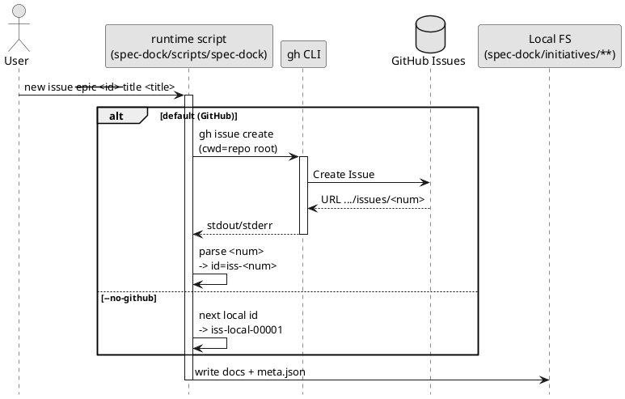

# GitHub 連携（`gh`）の挙動

このドキュメントは、`new {initiative,epic,issue}` が **GitHub Issue を自動作成する**挙動を、コーディングエージェント向けに明確化するためのものです。

## 結論

- `new {initiative,epic,issue}` はデフォルトで **`gh issue create` を実行**します。
- spec-dock は owner/repo を自前で解決しません。
  - `gh` を導入先リポジトリの root で実行し、対象リポジトリの解決は **`gh` に委譲**します。
- GitHub を使わない場合は `--no-github` を明示し、ID は `*-local-*` 名前空間で採番します。
- `--slug` は **安全な文字のみ**許可します（空白や `!` などは禁止）
  - 許可: Unicode の英数字 + `-` `_` `.`
  - 追加制約: **小文字のみ**（大文字を含む場合はエラー）

## 1) 実行されるコマンド（概要）

### 1.1 Issue 作成（デフォルト）

```bash
gh issue create --title "<title>" --body "<body>"
```

- `--title` と `--body` を必ず渡す（非対話）
- `cwd` は導入先リポジトリ root
- `gh` の出力に含まれる URL から `/issues/<num>` を抽出し、`<num>` を ID に使用
  - 例: GitHub #123 → `iss-00123` / `epic-00123` / `init-00123`

### 1.2 既存 Issue への紐づけ（作成しない）

`--github-issue 123` を渡すと、GitHub Issue は作成せず、番号だけ紐づけます。

```bash
./spec-dock/scripts/spec-dock new issue --epic 124 --title "..." --github-issue 123
```

### 1.3 Issue ブランチ checkout（`active set <github_issue_number>`）

GitHub Issue 番号から **ブランチ作成/checkout → active 設定 → sync** まで一括で行えます。

```bash
./spec-dock/scripts/spec-dock active set 123
```

内部的に実行されるコマンド（概要）:

```bash
gh issue checkout 123
```

注意:
- 安全のため、**未コミット/未追跡の変更がある場合はエラーで中断**します（作業を保護するため）
- 仕様ツリー内に `github.issue_number == 123` のノードが存在しない場合もエラーになります

補足:
- `active set iss-00123` のようにノードIDで直接指定した場合でも、そのノードが GitHub Issue に紐づいていれば checkout します（initiative/epic/issue 共通）。

### 1.4 既存 Issue の取り込み（`import`）

既に存在する GitHub Issue を、spec-dock の SSOT（`meta.json`）として取り込む場合は `import` を使います。

```bash
./spec-dock/scripts/spec-dock import issue 123 --title "Add refresh token" --epic epic-local-00001
```

内部的に実行されるコマンド（概要）:

```bash
gh issue view 123 --json number,url
```

注意:
- `import` は GitHub Issue を作成/更新しません（読み取りのみ）。
- `--title` は必須です（GitHub title は取り込みません）。
- `import` は checkout/branch 操作をしません。
- `import` は active の「選択」を更新しません（`active set` は実行しません）。
- `import` 後は `sync --no-update-active` 相当（`update_active=false`）を実行し、`.agent/index.json` / `.agent/tree.json` を更新します。
- URL を target に渡せますが、URL は **issue 番号抽出にのみ使用**します（owner/repo は無視します）。
  - そのため **別リポジトリの Issue URL を貼っても**、同じ番号の「現リポジトリの Issue」として扱われ得ます（cross-repo は対象外）。

## 2) 「どのリポジトリに作るか」はどう決まるか

spec-dock は `--repo owner/repo` を指定しません。  
そのため、**対象リポジトリは `gh` の解釈で決まります**。

代表的な解決材料（`gh` 側）:
- カレントディレクトリが Git リポジトリであること
- `git remote` の URL（GitHub の owner/repo を含む）
- 必要に応じて `GH_REPO` 等の環境変数
- `gh auth`（認証）状態と権限

## 3) `--no-github`（ローカルのみ）

GitHub が使えない場合（GitHub リポジトリが無い、`gh` 未導入、認証不可など）は、明示的に `--no-github` を使います。

- `gh` は実行しません
- ID は衝突回避のため `*-local-*` 名前空間になります
  - `init-local-00001` / `epic-local-00001` / `iss-local-00001`

## 4) PlantUML（内部処理のイメージ）



## 5) よくある失敗

- `gh` が無い: `new` がエラー → `gh` を導入するか `--no-github`
- GitHub リポジトリとして解決できない / 権限がない: `gh issue create` が失敗 → `git remote` / `gh auth` を確認
