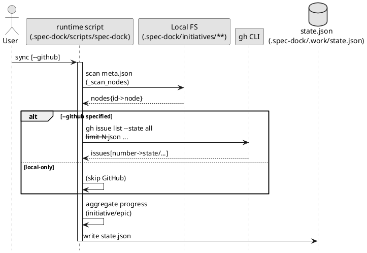

# Sync（状態集計）の仕組み

対象コマンド:

```bash
./.spec-dock/scripts/spec-dock sync [--github] [--gh-limit N]
```

## 0. 結論

`sync` は **ローカルの仕様ツリー**（`.spec-dock/initiatives/**/meta.json`）を正として必ず走査し、  
`--github` を付けた場合だけ **GitHub Issue の状態を `gh` で取得して enrich（補強）**します。

- `sync`（デフォルト）: ローカル集計のみ（open/done は `unknown`）
- `sync --github`: ローカル集計 + GitHub enrich（`github.issue_number` があるものだけ判定可能）

出力:
- `.spec-dock/.work/state.json`（生成物 / git 管理しない）

## 1. 何を入力として、何を出力するか

### 入力（ローカル: 常に）
- `.spec-dock/initiatives/**/meta.json`（永続メタ）
- `.spec-dock/.work/current.json`（存在すれば active の SSOT）

### 入力（GitHub: 任意）
- `gh issue list ...` の結果（`--github` の時だけ）

### 出力（生成物）
- `.spec-dock/.work/state.json`
  - ノード索引（id→情報）
  - 親子関係（children）
  - initiative/epic の progress（配下 issue の集計）
  - active（current.json の内容）

## 2. PlantUML（処理フロー）



## 3. 重要な注意点

- `--github` は **読み取りのみ**です（GitHub に Issue を作成/更新しません）。
- `github.issue_number` が無いノード（例: `iss-local-0001`）は、`--github` を付けても状態は `unknown` のままです。
- `--gh-limit` が小さいと一覧に載らず `unknown` になります（古い Issue がある場合は上げてください）。

