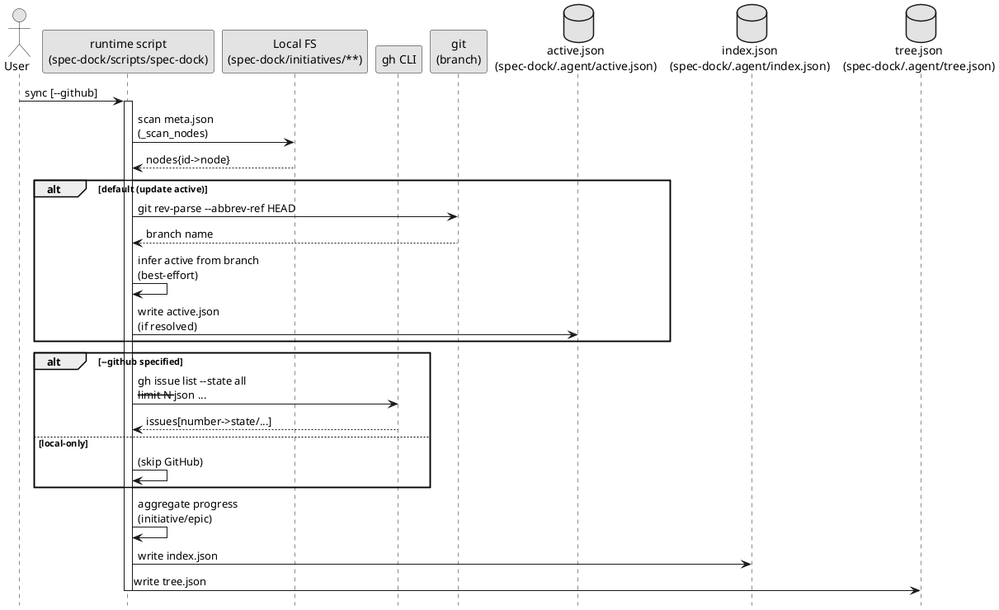

# Sync（状態集計）の仕組み

対象コマンド:

```bash
./spec-dock/scripts/spec-dock sync [--github] [--gh-limit N] [--no-update-active]
```

## 0. 結論

`sync` は **ローカルの仕様ツリー**（`spec-dock/initiatives/**/meta.json`）を正として必ず走査し、  
`--github` を付けた場合だけ **GitHub Issue の状態を `gh` で取得して enrich（補強）**します。

- `sync`（デフォルト）: ローカル集計のみ（open/done は `unknown`）
- `sync --github`: ローカル集計 + GitHub enrich（`github.issue_number` があるものだけ判定可能）
- `sync`（デフォルト）: さらに、**現在ブランチ名から active を推定して更新**します（best-effort）
  - ブランチ名に `iss-00123` のような id、または `123-foo` / `issue-123-foo` / `#123` のような番号が含まれ、
    それが仕様ツリー内のノードに **一意に対応**する場合のみ更新します
  - 解決できない場合は active を変更しません（警告のみ / もしくは黙って維持）
- `sync --no-update-active`: ブランチ名からの active 更新を行いません（index/tree 生成のみ）

出力:
- `spec-dock/.agent/index.json`（生成物 / git 管理しない, フラット索引）
- `spec-dock/.agent/tree.json`（生成物 / git 管理しない, ネスト表示）
- `spec-dock/active/*`（生成物 / git 管理しない, symlink または `.path` + `context-pack.md`）

## 1. 何を入力として、何を出力するか

### 入力（ローカル: 常に）
- `spec-dock/initiatives/**/meta.json`（永続メタ）
- `spec-dock/.agent/active.json`（存在すれば active の SSOT）
- 現在ブランチ名（デフォルト。`--no-update-active` で無効化）

### 入力（GitHub: 任意）
- `gh issue list ...` の結果（`--github` の時だけ）

### 出力（生成物）
- `spec-dock/.agent/index.json`（index）
  - ノード索引（id→情報）
  - 親子関係（children）
  - initiative/epic の progress（配下 issue の集計）
  - active（active.json の内容）
- `spec-dock/.agent/tree.json`（tree）
  - initiative→epic→issue のネスト表示（各ノードは `index.json` と同じスキーマ）
  - active（active.json の内容）

## 2. PlantUML（処理フロー）



## 3. 重要な注意点

- `--github` は **読み取りのみ**です（GitHub に Issue を作成/更新しません）。
- `github.issue_number` が無いノード（例: `iss-local-00001`）は、`--github` を付けても状態は `unknown` のままです。
- `--gh-limit` が小さいと一覧に載らず `unknown` になります（古い Issue がある場合は上げてください）。
 - `spec-dock/active/`（active pointers）
   - `spec-dock/active/{initiative,epic,issue}`（symlink または `.path`）
   - `spec-dock/active/context-pack.md`（エージェント入口）
