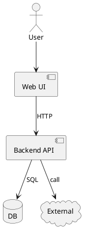
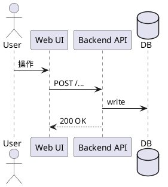
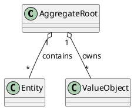
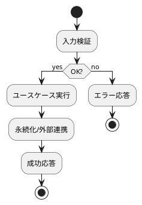
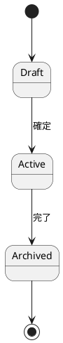
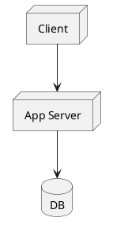
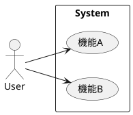
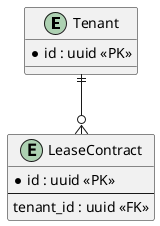

# <FEATURE_ID> <FEATURE_NAME> — 設計（HOW）

## 目的・制約（要件から転記・圧縮） (必須)
- 目的: ...
- MUST: ...
- MUST NOT: ...
- 非交渉制約: ...
- 前提: ...

---

## 既存実装/規約の調査結果（As-Is / 95%理解） (必須)
- 参照した規約/実装（根拠）:
  - `<path/to/doc_or_agents>`: <見た理由 / 採用するルール>
  - `<path/to/file>`: <見た理由 / 仕様を決めている箇所（関数/クラス/行番号）>
- 観測した現状（事実）:
  - ...
- 採用するパターン（命名/責務/例外/DI/テストなど）:
  - ...
- 採用しない/変更しない（理由）:
  - ...
- 影響範囲（呼び出し元/関連コンポーネント）:
  - ...

## 主要フロー（テキスト：AC単位で短く） (任意)
- Flow for AC-001:
  1) ...
  2) ...
  3) ...
- Flow for AC-002:
  1) ...
  2) ...
  3) ...

## データ・バリデーション（必要最小限） (任意)
- MODEL-001: <Entity/DTO/Table名>
  - Fields: ...
  - Constraints/Validation: ...
- ...

## 判断材料/トレードオフ（Decision / Trade-offs） (任意)
- 論点: ...
  - 選択肢A: ...（Pros/Cons）
  - 選択肢B: ...（Pros/Cons）
  - 決定: ...
  - 理由: ...

## インターフェース契約（ここで固定） (任意)
### API（ある場合）
- API-001: `<METHOD> <PATH>`
  - Request: ...
  - Response: ...
  - Errors: ...

### 関数・クラス境界（重要なものだけ）
- IF-001: `<module>::<function/class signature>`
  - Input: ...
  - Output: ...
  - Errors/Exceptions: ...

## 変更計画（ファイルパス単位） (必須)
- 追加（Add）:
  - `<path/to/new_file>`: <役割 / 責務>
- 変更（Modify）:
  - `<path/to/existing_file>`: <何をどう変えるか>
- 削除（Delete）:
  - `<path/to/obsolete_file>`: <なぜ削除するか>
- 移動/リネーム（Move/Rename）:
  - `<from>` → `<to>`: <目的>
- 参照（Read only / context）:
  - `<path/to/reference_file>`: <読む理由>

## マッピング（要件 → 設計） (必須)
- AC-001 → API-001, IF-001, `<path/...>`
- EC-001 → `<path/...>`（エラー処理の場所）
- 非交渉制約 → どの設計で満たすか（例: キャッシュ、冪等、監査ログなど）

## テスト戦略（最低限ここまで具体化） (任意)
- 追加/更新するテスト:
  - Unit: ...
  - Integration: ...
  - Frontend: ...
- どのAC/ECをどのテストで保証するか:
  - AC-001 → `<test_file_path>::<test_name>`
  - EC-001 → ...
- 非交渉制約（requirement.md）をどう検証するか:
  - 制約: ...
    - 検証方法（テスト/計測点/ログ/運用確認など）: ...
- 実行コマンド（該当するものを記載）:
  - ...
- 変更後の運用（必要なら）:
  - 移行手順: ...
  - ロールバック: ...
  - Feature flag: ...

## リスク/懸念（Risks） (任意)
- R-001: <リスク>（影響: ... / 対応: ...）
- R-002: ...

## 未確定事項（TBD） (必須)
- Q-001:
  - 質問: TBD ...
  - 選択肢:
    - A: ...
    - B: ...
  - 推奨案（暫定）: ...
  - 影響範囲: AC-___ / API-___ / IF-___ / `<path/...>` / テスト / ...
- Q-002:
  - 質問: TBD ...
  - 選択肢:
    - A: ...
    - B: ...
  - 推奨案（暫定）: ...
  - 影響範囲: ...

---

## ディレクトリ/ファイル構成図（変更点の見取り図） (任意)
```text
<repo-root>/
├── <bounded-context-or-module>/
│   └── <subdir>/
│       ├── <path/to/new_file>        # Add
│       ├── <path/to/existing_file>   # Modify
│       ├── <path/to/obsolete_file>   # Delete
│       ├── <from>                    # Move/Rename (from)
│       └── <to>                      # Move/Rename (to)
```

## UML図（PlantUML） (任意)
### コンポーネント図（境界/責務/依存の俯瞰）


### シーケンス図（時系列・IFのやり取り）


### クラス図（主要ドメイン概念・責務）


### アクティビティ図（主要フロー）


### 状態マシン図（状態を持つドメインがある場合）


### 配置図（デプロイ/ノード構成）


### ユースケース図（機能境界とアクター）


### ER図（テーブル関係）


## 省略/例外メモ (必須)
- 該当なし
