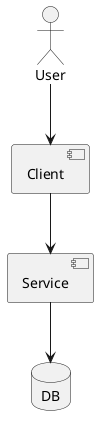

# <INIT_ID> <INIT_TITLE> — 設計（HOW）

## システム境界 / 依存（Context） (必須)
- ...

## 契約（外部I/F・データ境界） (必須)
- ...

## 非機能（NFR）設計（性能/可用性/監査/セキュリティ） (必須)
- ...

## 主要リスクと軽減策 (必須)
- ...

## 未確定事項（TBD） (必須)
- ...

## UML図（必要なら） (任意)

