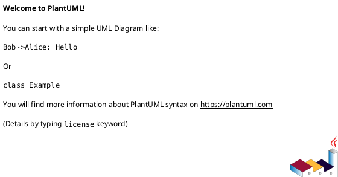

# iss-00007 スコープ配下に子ノード作成用スクリプトを自動生成 + 補足資料ディレクトリ追加 — 設計（HOW）

## 目的・制約（要件から転記・圧縮） (必須)
- 目的:
  - 各スコープ配下での子ノード作成を、タイトル1引数の“自然なコマンド”で完結させる（人間/エージェントの手戻り削減）。
  - Initiative/Epic/Issue の各レイヤーに、ADR以外の補足資料置き場を `artifacts/` として統一する。
- MUST:
  - Initiative配下 `epics/` に `new-epic` を自動配置（タイトル1引数）。
  - Epic配下 `issues/` に `new-issue` を自動配置（タイトル1引数）。
  - Initiative/Epic/Issue の `adrs/` に `new-adr` を自動配置（タイトル1引数）。
  - Initiative/Epic/Issue の各スコープに `artifacts/` を自動生成（共通構造）。
  - Initiative/Epic/Issue の `artifacts/` に `artifacts/_template.md` を配置する（空ディレクトリ回避 + 運用ガイド）。
  - 新規生成されるノード/配下ディレクトリにテンプレ由来の `README.md` を生成しない（SSOTは `requirement.md` / `design.md` / `plan.md` / `report.md` と `artifacts/_template.md`）。
- MUST NOT:
  - `new {initiative,epic,issue,adr}` の既存仕様（ID、生成先、GitHub連携）を破壊しない。
  - `jq` 等の外部依存を追加しない（runtime script は stdlib のまま）。
  - `spec-dock update` で `spec-dock/initiatives/**` を上書きしない（マイグレーションしない）。
- 非交渉制約:
  - 対象OSは macOS/Linux のみ（Windowsは対象外）。
  - 生成スクリプトは “タイトル1引数のみ” を厳守（余計な引数はエラー）。
- 前提:
  - このIssueでは既存ノードへの後追い配布はしない（新規作成ノードのみ）。

---

## 既存実装/規約の調査結果（As-Is / 99.9%理解） (必須)
- 参照した規約/実装（根拠）:
  - `src/spec_dock/assets/spec_dock/scripts/spec-dock`: runtime script 本体（`new/*` の生成フロー、テンプレ適用、`meta.json`、ADR生成、`gh` 依存などの挙動確認）
  - `src/spec_dock/cli.py`: installer（`init/update` が assets を `spec-dock/` に同期する範囲と前提の確認）
  - `src/spec_dock/assets/spec_dock/templates/**`: 生成物の雛形（initiative/epic/issue の現行構造、`issue` のみ `artifacts/`/`discussions/` がある点の確認）
  - `src/spec_dock/assets/spec_dock/docs/guide.md`: ツリー構造と SSOT/生成物の前提確認
  - `src/spec_dock/assets/codex_skills/spec-driven-tdd-workflow/SKILL.md`: エージェント運用の導線（`discussions/` 前提の記述がある点の確認）
- 観測した現状（事実）:
  - ノード作成は `templates/{initiative,epic,issue}` を `*_copy_template_tree()` でコピーし、最後に `meta.json` を書く。
  - `*_copy_template_tree()` はテキストを再書き込みするため、テンプレ側にスクリプトを置いても実行権限が落ちる（chmodしない限り `./new-epic` が動かない）。
  - initiative/epic には `artifacts/` が無い。issue は `artifacts/` と `discussions/` があり、補足資料の置き場がレイヤー間で不統一。
  - `README.md` が複数階層に存在し、生成物でも増殖しやすい（SSOTと二重管理になり得る）。
  - 同梱Skillが「調査/ヒアリング資料は `discussions/` に置く」前提のままのため、このまま `artifacts/` 統一すると不整合が出る。
- 採用するパターン（命名/責務/例外/DI/テストなど）:
  - “導線” はテンプレに寄せる（新規ノード作成時に自動で置けるものは templates に置く）。
  - 生成スクリプトは POSIX shell（`/usr/bin/env bash`）で実装し、`meta.json` は `python3` で最小限パースする（外部依存なし）。
  - 生成スクリプトは runtime script `spec-dock/scripts/spec-dock` を呼ぶだけにして、ビジネスロジックを重複しない。
  - 実行権限は runtime 側のテンプレコピー処理で一律に面倒を見る（shebangを持つファイルは `+x` にする）。
- 採用しない/変更しない（理由）:
  - 既存の `new` サブコマンドを増やしたり、引数仕様を変えない（導線は追加ファイルで提供）。
  - 既存ノード（`spec-dock/initiatives/**`）へ後追いでスクリプトを配る仕組みは入れない（運用が固まっていないため）。
- 影響範囲（呼び出し元/関連コンポーネント）:
  - `src/spec_dock/assets/spec_dock/scripts/spec-dock`（テンプレコピー処理の小変更）
  - `src/spec_dock/assets/spec_dock/templates/**`（雛形の追加/修正）
  - `tests/test_cli.py`（新しい生成物の存在と挙動確認）
  - （任意）`src/spec_dock/assets/spec_dock/docs/guide.md`（構造説明の更新）

## 主要フロー（テキスト：AC単位で短く） (任意)
- Flow for AC-001:
  1) `spec-dock/initiatives/<init>/epics/new-epic "<title>"` を実行
  2) `new-epic` が `../meta.json` を読み initiative id を取得し、localなら `--no-github` を付与
  3) `spec-dock/scripts/spec-dock new epic --initiative <id> --title "<title>" [...]` を実行し、配下に epic が作成される
- Flow for AC-002:
  1) `spec-dock/initiatives/<init>/epics/<epic>/issues/new-issue "<title>"` を実行
  2) `new-issue` が `../meta.json` を読み epic id を取得し、localなら `--no-github` を付与
  3) `spec-dock/scripts/spec-dock new issue --epic <id> --title "<title>" [...]` を実行し、配下に issue が作成される
- Flow for AC-003:
  1) `<scope>/adrs/new-adr "<title>"` を実行
  2) `new-adr` が `../meta.json` を読み scope type/id を取得し、`--initiative/--epic/--issue` を選ぶ
  3) `spec-dock/scripts/spec-dock new adr --<scope> <id> --title "<title>"` を実行し、配下に ADR md が作成される
- Flow for EC-002:
  1) GitHubスコープ（親idが `*-local-*` ではない）で `new-epic/new-issue` を実行
  2) `gh` が見つからない場合、`new-epic/new-issue` が明確なメッセージで失敗し、次を提示する
     - `gh` をインストールして再実行
     - 明示的に local-only を選ぶ直接コマンド（`--no-github` 付き）

### UML（任意） (任意)


## データ・バリデーション（必要最小限） (任意)
- 該当なし（FS上のテンプレ構造追加と、CLIラッパースクリプトのみ）

### UML（任意） (任意)


## 判断材料/トレードオフ（Decision / Trade-offs） (任意)
- 論点1: 補足資料ディレクトリ名（`artifacts` / `discussions` / 別名）
  - 選択肢A: `artifacts/`
    - Pros: 既に issue で使われている、ADR（決定）と役割が被りにくい、中立で包含範囲が広い
    - Cons: “議論メモ” という意図が名前からは弱い（`artifacts/_template.md` のテンプレで補う）
  - 選択肢B: `discussions/`
    - Pros: “調査/議論ログ” という意図は強い
    - Cons: ADR（意思決定）と概念が近く、運用が二重化しやすい
  - 選択肢C: `notes/` / `materials/` / `evidence/`
    - Pros: 意図をより絞れる可能性
    - Cons: 既存の issue `artifacts/` とズレる（移行/説明コスト）
  - 決定: `artifacts/`
  - 理由: 既存構造と整合しつつ、ADRと役割分担が明確で、将来の運用ブレを最小化できる
- 論点2: 生成スクリプトの方式（ID埋め込み vs `meta.json` 解析）
  - 選択肢A（ID埋め込み）:
    - Pros: スクリプト単体で完結（jsonパース不要）
    - Cons: 生成物がスコープごとに差分を持ちやすく、テンプレ置換の失敗がバグになり得る
  - 選択肢B（meta解析）:
    - Pros: スクリプト本体は固定でただコピーすればよい、SSOT（meta.json）を参照して常に正しいid/typeを使える
    - Cons: `python3` が必要（ただし runtime script 自体が `python3` 前提なので追加依存にはなりにくい）
  - 決定: meta解析
  - 理由: 安定性と保守性（同一スクリプトの再利用）を優先
- 論点3: スクリプト名（拡張子）
  - 選択肢A: 拡張子なし（`new-epic`）
  - 選択肢B: `.sh`（`new-epic.sh`）
  - 決定: 拡張子なし
  - 理由: “自然なコマンド” として実行しやすい（`./new-epic "<title>"`）

## インターフェース契約（ここで固定） (任意)
### スクリプトI/F（固定）
- 共通仕様:
  - 引数:
    - 受け取る引数はタイトル1つのみ（0個/2個以上は usage を出して失敗）
    - タイトルのバリデーション/正規化は runtime script に委譲する（ラッパーでは改変しない）
  - `meta.json`:
    - 常に `../meta.json` を読む（`new-epic` は initiative の、`new-issue` は epic の、`new-adr` は scope の `meta.json`）
    - `../meta.json` が無い/壊れている場合は fail-fast し、修復先（`../meta.json`）を明示する
  - runtime script 解決（cwd不問）:
    - 探索起点は “実行時cwd” ではなく “スクリプト自身の配置場所” とする（`dirname "$0"`）。
    - `dirname "$0"` を絶対パス化したディレクトリから親ディレクトリへ向かって探索し、最初に見つかった `<dir>/spec-dock/scripts/spec-dock` を採用する（最も近いものを採用）。
    - 絶対パス化の手段（追加依存なし）:
      - 推奨（互換重視）: `script_dir="$(cd "$(dirname "$0")" >/dev/null 2>&1 && pwd -P)"`
      - 参考（`dirname` が `--` をサポートする環境）: `script_dir="$(cd -- "$(dirname -- "$0")" >/dev/null 2>&1 && pwd -P)"`
    - 探索の打ち切り条件:
      - ルート（`/`）まで到達した場合
      - 50階層探索しても見つからない場合（安全弁）
    - 見つからない場合は fail-fast し、stderr に次を含める:
      - 「runtime script が見つからない」旨
      - 探索起点（`dirname "$0"` の解決結果）
      - 対処: `spec-dock init` / `spec-dock update` の再実行、または `spec-dock/` 導入状態の確認
  - GitHubモード判定（`new-epic/new-issue`）:
    - 親idに `-local-` を含む場合は local とみなし `--no-github` を付与する（子も local に揃える）
    - それ以外は GitHubモードとして `gh` が必要（ただし自動フォールバックはしない）
- `new-epic "<title>"`
  - 受け取る引数: タイトル1つのみ
  - 成功: exit 0（runtime script の stdout をそのまま出す）
  - 失敗:
    - 引数不正（0個/2個以上）: usage を stderr に出して exit != 0
    - GitHubスコープで `gh` 不在: 次を stderr に出して exit != 0
      - 対応1: `gh` をインストールして再実行
      - 対応2: 明示的に local-only を選ぶ直接コマンド（`--no-github` 付き）
        - 注: これは “GitHub親の下に local 子を作る” という混在で、意図がある場合のみ明示的に選ぶ（ラッパーは自動フォールバックしない）
- `new-issue "<title>"` / `new-adr "<title>"` も同様

### 関数・クラス境界（重要なものだけ）
- IF-001: `spec-dock/scripts/spec-dock::_copy_template_tree(src_dir, dest_dir, replacements)`
  - Input: テンプレディレクトリ、出力先、置換辞書
  - Output: FSへコピー
  - 追加の責務: 生成したファイルのうち shebang を持つものは `+x` を付与する
- IF-002: `new-epic` / `new-issue` / `new-adr`（生成スクリプト）
  - Input: タイトル1引数 + `../meta.json`
  - Output: runtime script 呼び出し（子ノード生成）

### UML（任意） (任意)


### クラス/インターフェース詳細設計（主要なもの） (任意)
- 該当なし（スクリプト/テンプレの追加が主）

### 例外/エラー契約（重要なものだけ） (任意)
- 該当なし（上の「スクリプトI/F（固定）」に集約）

## 変更計画（ファイルパス単位） (必須)
- 追加（Add）:
  - `src/spec_dock/assets/spec_dock/templates/initiative/epics/new-epic`: initiative配下で epic をタイトル1引数で作るラッパー
  - `src/spec_dock/assets/spec_dock/templates/epic/issues/new-issue`: epic配下で issue をタイトル1引数で作るラッパー
  - `src/spec_dock/assets/spec_dock/templates/initiative/adrs/new-adr`: initiativeスコープで ADR を作るラッパー
  - `src/spec_dock/assets/spec_dock/templates/epic/adrs/new-adr`: epicスコープで ADR を作るラッパー
  - `src/spec_dock/assets/spec_dock/templates/issue/adrs/new-adr`: issueスコープで ADR を作るラッパー
  - `src/spec_dock/assets/spec_dock/templates/initiative/artifacts/_template.md`: 補足資料（調査/議論メモ）用テンプレ（READMEの代替。空ディレクトリ回避も兼ねる）
  - `src/spec_dock/assets/spec_dock/templates/epic/artifacts/_template.md`: 補足資料（調査/議論メモ）用テンプレ（READMEの代替。空ディレクトリ回避も兼ねる）
- 変更（Modify）:
  - `src/spec_dock/assets/spec_dock/scripts/spec-dock`: テンプレコピー後に shebang ファイルへ `+x` を付与
  - `src/spec_dock/assets/spec_dock/templates/issue/artifacts/_template.md`: 既存テンプレの内容更新（補足資料の置き場所/粒度/例を示す）
  - `src/spec_dock/assets/codex_skills/spec-driven-tdd-workflow/SKILL.md`: `discussions/` 前提をやめ、補足資料は `artifacts/` へ置くように更新（既存ノードに `discussions/` が残っている場合のレガシー注記も追加）
  - `tests/test_cli.py`: 新規生成物（スクリプト/`artifacts/`）の存在と、localモードでの動作をテスト追加
- 削除（Delete）:
  - `src/spec_dock/assets/spec_dock/templates/issue/discussions/`: `discussions/_template.md` を `artifacts/_template.md` へ移設した上で、テンプレからディレクトリ自体を削除する（新規生成で `discussions/` を作らない根拠）
  - `src/spec_dock/assets/spec_dock/templates/{initiative,epic,issue}/README.md`: 仕様書と二重管理になりやすいREADMEを新規生成に含めない
  - `src/spec_dock/assets/spec_dock/templates/initiative/epics/README.md`: 同上（READMEは生成しない）
  - `src/spec_dock/assets/spec_dock/templates/epic/issues/README.md`: 同上（READMEは生成しない）
  - `src/spec_dock/assets/spec_dock/templates/{initiative,epic,issue}/adrs/README.md`: 同上（READMEは生成しない）
  - `src/spec_dock/assets/spec_dock/templates/{initiative,epic,issue}/artifacts/README.md`: `_template.md` に置き換える（READMEは生成しない）
- 移動/リネーム（Move/Rename）:
  - `src/spec_dock/assets/spec_dock/templates/issue/discussions/_template.md` → `src/spec_dock/assets/spec_dock/templates/issue/artifacts/_template.md`: 既存テンプレ内容を `artifacts/` に寄せる
- 参照（Read only / context）:
  - `src/spec_dock/assets/spec_dock/docs/guide.md`: 構造説明の整合を取る必要がある場合に参照

## マッピング（要件 → 設計） (必須)
- AC-001 → `src/spec_dock/assets/spec_dock/templates/initiative/epics/new-epic`, `src/spec_dock/assets/spec_dock/scripts/spec-dock`
- AC-002 → `src/spec_dock/assets/spec_dock/templates/epic/issues/new-issue`, `src/spec_dock/assets/spec_dock/scripts/spec-dock`
- AC-003 → `src/spec_dock/assets/spec_dock/templates/*/adrs/new-adr`, `src/spec_dock/assets/spec_dock/scripts/spec-dock:_new_adr`
- AC-004 → `src/spec_dock/assets/spec_dock/templates/{initiative,epic,issue}/artifacts/**`, `src/spec_dock/assets/spec_dock/templates/issue/discussions/`（Delete）
- AC-005 → `new-epic/new-issue`（親idのlocal判定→`--no-github` 付与）
- AC-006（実行可能） → `src/spec_dock/assets/spec_dock/scripts/spec-dock`（shebangファイルのchmod）+ テンプレ上の `new-*` 配置
- AC-007（README非生成） → `src/spec_dock/assets/spec_dock/templates/**/README.md`（Delete）+ `tests/test_cli.py`（非存在テスト）
- EC-001/EC-004（引数不正） → 各 `new-*` スクリプト側で usage を出して失敗
- EC-002（gh不可） → `new-epic/new-issue` が `gh` の存在を検査して失敗 + 直接コマンド提示
- EC-005（meta.json欠落/破損） → `new-*` が `../meta.json` を検査して fail-fast + 修復先提示
- EC-006（runtime script 不在） → `new-*` が探索に失敗して fail-fast + `spec-dock init/update` 案内
- 非交渉制約（stdlib維持） → jsonパースは `python3 -c`、外部ツール依存なし

## テスト戦略（最低限ここまで具体化） (任意)
- 追加/更新するテスト:
  - Unit:
    - `new initiative --no-github` で生成される `epics/new-epic` の存在確認
    - `test -x` によるラッパー実行権限の確認（`new-epic/new-issue/new-adr`）
    - `epics/new-epic "<title>"` 実行で `epic-local-*` が作成されること（local伝播）
    - `issues/new-issue "<title>"` 実行で `iss-local-*` が作成されること（local伝播）
    - `adrs/new-adr "<title>"` 実行で `adr-00001-*.md` が作成されること
    - initiative/epic/issue に `artifacts/` が生成されること
    - initiative/epic/issue の `artifacts/_template.md` が生成されること（空ディレクトリ回避 + 運用ガイド）
    - 新規生成された issue に `discussions/` が生成されないこと（`artifacts/` に統合されること。例: `assertFalse((issue_dir / "discussions").exists())`）
    - 新規生成された initiative/epic/issue 配下に `README.md` が生成されないこと（例: `assertEqual([], list(node_dir.rglob("README.md")))`）
    - `../meta.json` の欠落/破損でラッパーが fail-fast すること
    - `spec-dock/scripts/spec-dock` が見つからない場合にラッパーが fail-fast し、案内文言が出ること（EC-006。テストでは runtime script を一時的にリネーム/退避して再現する）
  - Integration: 該当なし（ghを使うGitHub統合は本Issueではテスト対象外）
- どのAC/ECをどのテストで保証するか:
  - AC-001 → `tests/test_cli.py::test_new_epic_wrapper_creates_local_epic`（新規追加）
  - AC-002 → `tests/test_cli.py::test_new_issue_wrapper_creates_local_issue`（新規追加）
  - AC-003 → `tests/test_cli.py::test_new_adr_wrapper_creates_adr`（新規追加）
  - AC-004 → `tests/test_cli.py::test_new_nodes_include_artifacts_dir`（新規追加。`discussions/` 非生成も同テストで観測）
  - EC-006 → `tests/test_cli.py::test_wrapper_fails_when_runtime_not_found`（新規追加）
  - EC-001/EC-004 → 各ラッパーの引数不正で exit != 0（必要なら追加）

### テストマトリクス（AC/EC → テスト） (任意)
- 実行コマンド:
  - `python -m unittest -v`

## リスク/懸念（Risks） (任意)
- R-001: テンプレコピー後に実行権限が付与されずスクリプトが動かない（対応: runtime 側で shebang 判定 + chmod）
- R-002: `meta.json` が壊れている/欠落している場合にラッパーが動かない（対応: 明確なエラーで fail-fast。修復先（meta.json）を提示）
- R-003: GitHubスコープで `gh` が無い場合に作れない（対応: 直接コマンドを提示して失敗）

## 未確定事項（TBD） (必須)
- （該当なし）

---

## ディレクトリ/ファイル構成図（変更点の見取り図） (任意)
```text
spec-dock/
└── initiatives/
    └── init-.../
        ├── artifacts/                 # Add (initiative)
        │   └── _template.md           # Add (READMEは生成しない)
        ├── adrs/
        │   └── new-adr                # Add
        └── epics/
            └── new-epic               # Add
            └── epic-.../
                ├── artifacts/         # Add (epic)
                │   └── _template.md   # Add (READMEは生成しない)
                ├── adrs/
                │   └── new-adr        # Add
                └── issues/
                    └── new-issue      # Add
                    └── iss-.../
                        ├── artifacts/ # Keep/Modify (issue)
                        │   └── _template.md
                        └── adrs/
                            └── new-adr  # Add
```

## 省略/例外メモ (必須)
- 該当なし

## 将来メモ（スコープ外） (任意)
- 既存ノードへ `artifacts/` や `new-*` を後追いで配布したいニーズは高確率で出るため、将来的に `spec-dock/scripts/spec-dock` に「既存ノードへ wrapper/artifacts を追加する明示コマンド」を検討する余地がある（今回は新規生成のみ対象）。
