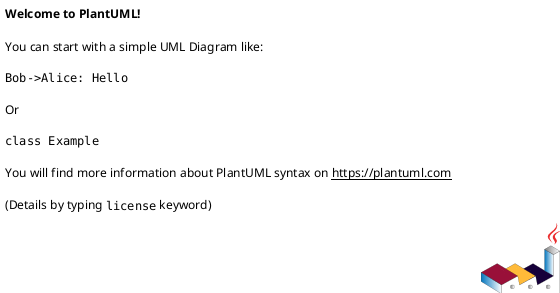

# iss-00007 スコープ配下に子ノード作成用スクリプトを自動生成 + 補足資料ディレクトリ追加 — 実装計画（TDD: Red → Green → Refactor）

## この計画で満たす要件ID (必須)
- 対象AC: AC-001, AC-002, AC-003, AC-004, AC-005, AC-006
- 対象EC: EC-001, EC-002, EC-003, EC-004, EC-005, EC-006
- 対象制約:
  - macOS/Linux のみ（Windowsは対象外）
  - 生成スクリプトはタイトル1引数のみ（追加引数は禁止）
  - 新規生成では `discussions/` を生成しない（`artifacts/` に統合）
  - 既存ノードは移行しない（後追い配布/マイグレーションはOUT OF SCOPE）

## ステップ一覧（観測可能な振る舞い） (必須)
- [ ] S01: 新規生成されたノードに `artifacts/` が存在し、issue に `discussions/` が生成されない（Skill/READMEの導線も `artifacts/` に統一）
- [ ] S02: テンプレ上に wrapper（`new-*`）が配置され、生成物の wrapper が実行可能（`+x`）である
- [ ] S03: `new-epic/new-issue/new-adr "<title>"` が local モードで子ノードを作成できる
- [ ] S04: wrapper が引数不正（0個/2個以上）で usage を出して失敗する
- [ ] S05: wrapper が `../meta.json` 欠落/破損、runtime script 未発見で fail-fast する
- [ ] S06: GitHubモードで `gh` 不在なら明確に案内して失敗する（自動フォールバックしない）

### UML（任意） (任意)

### 要件 ↔ ステップ対応表 (必須)
- AC-004 → S01
- MUST（同梱Skillの導線を `artifacts/` に統一）→ S01
- AC-006 → S02
- AC-001 → S03
- AC-002 → S03
- AC-003 → S03
- AC-005 → S03
- EC-001 → S04
- EC-004 → S04
- EC-005 → S05
- EC-006 → S05
- EC-002 → S06
- EC-003 → S03（スペースを含むタイトルが壊れず渡ること。記号の可否は既存バリデーションに従う）
- 非交渉制約（macOS/Linuxのみ、追加依存なし、既存ノード非移行）→ S01-S06（各ステップで逸脱しない）

---

## 実装ステップ（各ステップは“観測可能な振る舞い”を1つ） (必須)

### S01 — 新規生成されたノードに `artifacts/` が存在し、issue に `discussions/` が生成されない（Skill/READMEの導線も `artifacts/` に統一） (必須)
- 対象: AC-004 + MUST（同梱Skill更新）
- 設計参照:
  - 対象IF/API: templates 更新（`temp-spec/design.md` の変更計画 Add/Modify/Delete）
  - 対象テスト: `tests/test_cli.py::test_new_nodes_include_artifacts_dir`（更新）+ `tests/test_cli.py::test_new_nodes_do_not_generate_discussions_dir`（新規 or 既存へ統合）
- このステップで「追加しないこと（スコープ固定）」:
  - runtime script の引数仕様変更
  - 既存ノードへの後追い配布（マイグレーション）

#### update_plan（着手時に登録） (必須)
- [ ] `update_plan` に、このステップの作業ステップ（調査/Red/Green/Refactor/品質ゲート/報告/コミット）を登録した
- 登録例:
  - （調査）既存挙動/影響範囲の確認、設計参照の確認
  - （Red）失敗するテストの追加/修正
  - （Green）最小実装
  - （Refactor）整理
  - （品質ゲート）format/lint/test
  - （報告）`./spec-dock/active/issue/report.md` 更新
  - （コミット）このステップの区切りでコミット

#### 期待する振る舞い（テストケース） (必須)
- Given: `spec-dock init` 済みのテスト用リポジトリがある
- When: `spec-dock/scripts/spec-dock new initiative/epic/issue --no-github ...` でノードを作成する
- Then:
  - initiative/epic/issue に `artifacts/` が存在する
  - 新規 issue に `discussions/` が存在しない
  - `issue/artifacts/_template.md` が存在する（旧 `discussions/_template.md` の統合先）
  - `.agents/skills/spec-driven-tdd-workflow/SKILL.md` が存在し、補足資料の置き場として `artifacts/` を案内している（`discussions/` はレガシー注記）
- 観測点: FS（ディレクトリ/ファイルの存在）
- 追加/更新するテスト:
  - Modify: `tests/test_cli.py::test_new_*` 系（`artifacts/` 生成と `discussions/` 非生成の観測を追加）
  - Modify: `tests/test_cli.py::test_init_creates_expected_structure`（Skillファイルの存在と文言の観測を追加）

#### Red（失敗するテストを先に書く） (任意)
- 期待する失敗:
  - initiative/epic に `artifacts/` が無い
  - issue に `discussions/` が生成される
  - `issue/artifacts/_template.md` が無い

#### Green（最小実装） (任意)
- 変更予定ファイル:
  - Add:
    - `src/spec_dock/assets/spec_dock/templates/initiative/artifacts/README.md`
    - `src/spec_dock/assets/spec_dock/templates/epic/artifacts/README.md`
    - `src/spec_dock/assets/spec_dock/templates/issue/artifacts/_template.md`
  - Modify:
    - `src/spec_dock/assets/spec_dock/templates/initiative/README.md`
    - `src/spec_dock/assets/spec_dock/templates/epic/README.md`
    - `src/spec_dock/assets/spec_dock/templates/issue/README.md`（レガシー注記を含む）
    - `src/spec_dock/assets/spec_dock/templates/issue/artifacts/README.md`（補足資料の説明を拡張）
    - `src/spec_dock/assets/codex_skills/spec-driven-tdd-workflow/SKILL.md`（補足資料の置き場を `artifacts/` に統一 + レガシー注記）
  - Delete:
    - `src/spec_dock/assets/spec_dock/templates/issue/discussions/`
- 追加する概念（このステップで導入する最小単位）:
  - 生成物の共通補足資料置き場 = `artifacts/`
- 実装方針（最小で。余計な最適化は禁止）:
  - テンプレ構造の変更のみで MUST（`discussions/` 非生成）を満たす（runtime へ新規分岐は入れない）

#### Refactor（振る舞い不変で整理） (任意)
- 目的:
  - README/Skillの文言揺れを減らし、運用の混乱を避ける
- 変更対象:
  - `src/spec_dock/assets/spec_dock/templates/**/README.md`

#### ステップ末尾（省略しない） (必須)
- [ ] 期待するテスト（必要ならフォーマット/リンタ）を実行し、成功した
- [ ] `./spec-dock/active/issue/report.md` に実行コマンド/結果/変更ファイルを記録した
- [ ] `update_plan` を更新し、このステップの作業ステップを完了にした
- [ ] コミットした（エージェント）

---

### S02 — テンプレ上に wrapper（`new-*`）が配置され、生成物の wrapper が実行可能（`+x`）である (必須)
- 対象: AC-006
- 設計参照:
  - 対象IF/API: IF-001（`_copy_template_tree` の shebang 判定 + chmod）
  - 対象テスト: `tests/test_cli.py::test_wrappers_are_executable`（新規）
- このステップで「追加しないこと（スコープ固定）」:
  - wrapper の機能実装（子ノード作成）は次ステップ（S03）

#### update_plan（着手時に登録） (必須)
- [ ] `update_plan` に、このステップの作業ステップ（調査/Red/Green/Refactor/品質ゲート/報告/コミット）を登録した

#### 期待する振る舞い（テストケース） (必須)
- Given: テンプレ上に `new-*`（shebang付き）が存在する（このステップで追加する）
- When: runtime でノードを生成する（initiative/epic/issue）
- Then:
  - `epics/new-epic` / `issues/new-issue` / `adrs/new-adr` が生成されている
  - それらが `test -x` で真になる
- 観測点: FS（実行ビット）
- 追加/更新するテスト: `tests/test_cli.py::test_wrappers_are_executable`

#### Red（失敗するテストを先に書く） (任意)
- 期待する失敗:
  - `new-*` が `-rw-r--r--` になっていて実行できない

#### Green（最小実装） (任意)
- 変更予定ファイル:
  - Add:
    - `src/spec_dock/assets/spec_dock/templates/initiative/epics/new-epic`（中身は最小スタブでよい。次ステップでロジック実装）
    - `src/spec_dock/assets/spec_dock/templates/epic/issues/new-issue`（同上）
    - `src/spec_dock/assets/spec_dock/templates/initiative/adrs/new-adr`（同上）
    - `src/spec_dock/assets/spec_dock/templates/epic/adrs/new-adr`（同上）
    - `src/spec_dock/assets/spec_dock/templates/issue/adrs/new-adr`（同上）
  - Modify:
    - `src/spec_dock/assets/spec_dock/scripts/spec-dock`（コピー後、shebangを持つファイルへ `chmod +x`）
    - `src/spec_dock/assets/spec_dock/templates/initiative/epics/README.md`（`new-epic` の導線）
    - `src/spec_dock/assets/spec_dock/templates/epic/issues/README.md`（`new-issue` の導線）
    - `src/spec_dock/assets/spec_dock/templates/initiative/adrs/README.md`（`new-adr` の導線）
    - `src/spec_dock/assets/spec_dock/templates/epic/adrs/README.md`（`new-adr` の導線）
    - `src/spec_dock/assets/spec_dock/templates/issue/adrs/README.md`（`new-adr` の導線）
- 実装方針:
  - テキスト再書き込みで落ちた実行ビットだけを回復する（shebang判定で限定）

#### ステップ末尾（省略しない） (必須)
- [ ] 期待するテストを実行し、成功した
- [ ] `./spec-dock/active/issue/report.md` を更新した
- [ ] `update_plan` を更新し、このステップの作業ステップを完了にした
- [ ] コミットした（エージェント）

---

### S03 — `new-epic/new-issue/new-adr "<title>"` が local モードで子ノードを作成できる (必須)
- 対象: AC-001, AC-002, AC-003, AC-005, EC-003
- 設計参照:
  - 対象IF/API: スクリプトI/F（`../meta.json` 解析、runtime 解決、local 判定）
  - 対象テスト:
    - `tests/test_cli.py::test_new_epic_wrapper_creates_local_epic`（新規）
    - `tests/test_cli.py::test_new_issue_wrapper_creates_local_issue`（新規）
    - `tests/test_cli.py::test_new_adr_wrapper_creates_adr`（新規）
- このステップで「追加しないこと（スコープ固定）」:
  - wrapper の引数拡張（タイトル以外のフラグ追加）

#### update_plan（着手時に登録） (必須)
- [ ] `update_plan` に登録した

#### 期待する振る舞い（テストケース） (必須)
- Given: local initiative / local epic / local issue が作成済みで、各所に `new-*` がある
- When:
  - `epics/new-epic "JWT Auth"` を実行する
  - `issues/new-issue "Add refresh token"` を実行する
  - `adrs/new-adr "Token rotation strategy"` を実行する
- Then:
  - epic/issue が local ID（`*-local-*`）で作成される（`--no-github` が自動付与される）
  - ADR md が `adrs/adr-00001-*.md` として作成される
- 観測点: FS（生成パス、`meta.json`、ADRファイル名）

#### Red（失敗するテストを先に書く） (任意)
- 期待する失敗:
  - wrapper が存在しない/実行できない
  - wrapper が `meta.json` を読めず親IDが渡せない
  - wrapper が runtime を見つけられない/実行できない

#### Green（最小実装） (任意)
- 変更予定ファイル:
  - Modify:
    - `src/spec_dock/assets/spec_dock/templates/initiative/epics/new-epic`
    - `src/spec_dock/assets/spec_dock/templates/epic/issues/new-issue`
    - `src/spec_dock/assets/spec_dock/templates/initiative/adrs/new-adr`
    - `src/spec_dock/assets/spec_dock/templates/epic/adrs/new-adr`
    - `src/spec_dock/assets/spec_dock/templates/issue/adrs/new-adr`
- 実装方針:
  - wrapper は bash（`set -euo pipefail`）で、`python3 -c` で `../meta.json` を最小限パース
  - local 判定: 親IDに `-local-` を含むなら `--no-github` を付与
  - runtime 解決: `dirname "$0"` 起点で親探索し `spec-dock/scripts/spec-dock` を見つける

#### ステップ末尾（省略しない） (必須)
- [ ] 期待するテストを実行し、成功した
- [ ] `./spec-dock/active/issue/report.md` を更新した
- [ ] `update_plan` を更新し、このステップの作業ステップを完了にした
- [ ] コミットした（エージェント）

---

### S04 — wrapper が引数不正（0個/2個以上）で usage を出して失敗する (必須)
- 対象: EC-001, EC-004
- 設計参照:
  - 対象テスト: `tests/test_cli.py::test_wrappers_reject_invalid_args`（新規）
- このステップで「追加しないこと（スコープ固定）」:
  - 追加引数を許容する仕様変更

#### update_plan（着手時に登録） (必須)
- [ ] `update_plan` に登録した

#### 期待する振る舞い（テストケース） (必須)
- Given: wrapper が生成済み
- When: `new-*` を 0引数 / 2引数以上で実行する
- Then: stderr に usage を出して exit != 0
- 観測点: exit code / stderr

#### Green（最小実装） (任意)
- 変更予定ファイル:
  - Modify: `src/spec_dock/assets/spec_dock/templates/**/new-*`（引数個数チェック、usage）

#### ステップ末尾（省略しない） (必須)
- [ ] 期待するテストを実行し、成功した
- [ ] `./spec-dock/active/issue/report.md` を更新した
- [ ] `update_plan` を更新し、このステップの作業ステップを完了にした
- [ ] コミットした（エージェント）

---

### S05 — wrapper が `../meta.json` 欠落/破損、runtime script 未発見で fail-fast する (必須)
- 対象: EC-005, EC-006
- 設計参照:
  - 対象テスト:
    - `tests/test_cli.py::test_wrapper_fails_when_meta_missing_or_invalid`（新規）
    - `tests/test_cli.py::test_wrapper_fails_when_runtime_not_found`（新規）
- このステップで「追加しないこと（スコープ固定）」:
  - 自動修復（meta再生成）や自動 init/update の実行

#### update_plan（着手時に登録） (必須)
- [ ] `update_plan` に登録した

#### 期待する振る舞い（テストケース） (必須)
- Given:
  - `../meta.json` を削除/破損させたスコープがある
  - または `spec-dock/scripts/spec-dock` を一時的に退避した環境がある
- When: wrapper を実行する
- Then: 明確なメッセージで fail-fast し、修復先/対処（`../meta.json` や `spec-dock init/update`）を案内する
- 観測点: exit code / stderr

#### Green（最小実装） (任意)
- 変更予定ファイル:
  - Modify: `src/spec_dock/assets/spec_dock/templates/**/new-*`（検査とエラーメッセージ）

#### ステップ末尾（省略しない） (必須)
- [ ] 期待するテストを実行し、成功した
- [ ] `./spec-dock/active/issue/report.md` を更新した
- [ ] `update_plan` を更新し、このステップの作業ステップを完了にした
- [ ] コミットした（エージェント）

---

### S06 — GitHubモードで `gh` 不在なら明確に案内して失敗する（自動フォールバックしない） (必須)
- 対象: EC-002
- 設計参照:
  - 対象テスト: `tests/test_cli.py::test_wrapper_fails_without_gh_in_github_mode`（新規）
- このステップで「追加しないこと（スコープ固定）」:
  - wrapper の自動フォールバック（暗黙に `--no-github` を付ける）

#### update_plan（着手時に登録） (必須)
- [ ] `update_plan` に登録した

#### 期待する振る舞い（テストケース） (必須)
- Given: 親スコープが GitHubモード（`*-local-*` ではない）である
- When: `gh` が PATH 上に無い状態で `new-epic/new-issue` を実行する
- Then: stderr に次を含めて fail-fast する
  - 対応1: `gh` をインストールして再実行
  - 対応2: 明示的に local-only を選び、直接コマンド（`spec-dock/scripts/spec-dock new ... --no-github`）を実行（混在は明示選択のみ）

#### Green（最小実装） (任意)
- 変更予定ファイル:
  - Modify: `src/spec_dock/assets/spec_dock/templates/**/new-{epic,issue}`（`command -v gh` 検査と案内文）

#### ステップ末尾（省略しない） (必須)
- [ ] 期待するテストを実行し、成功した
- [ ] `./spec-dock/active/issue/report.md` を更新した
- [ ] `update_plan` を更新し、このステップの作業ステップを完了にした
- [ ] コミットした（エージェント）

---

## 未確定事項（TBD） (必須)
- 該当なし

## 完了条件（Definition of Done） (必須)
- 対象AC/ECがすべて満たされ、テストで保証されている
- MUST NOT / OUT OF SCOPE を破っていない
- 品質ゲート（フォーマット/リント/テストのうち該当するもの）が満たされている

## 省略/例外メモ (必須)
- 該当なし
