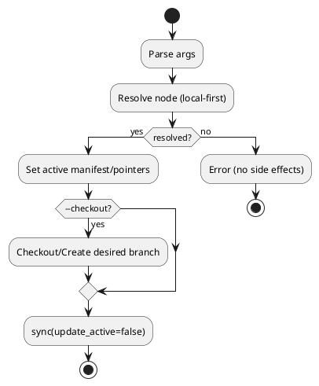

# iss-local-00002 active set の処理分離と checkout 制御の明確化 — 実装計画（TDD: Red → Green → Refactor）

## この計画で満たす要件ID (必須)
- 対象AC: AC-001, AC-002, AC-003, AC-004, AC-005
- 対象EC: EC-001, EC-002, EC-003
- 対象制約（該当があれば）:
  - local-first 解決
  - 未解決ターゲットで副作用ゼロ
  - 不可逆 Git 操作を追加しない

## ステップ一覧（観測可能な振る舞い） (必須)
- [ ] S01: `active set` オプションを明確化（`--checkout/--no-checkout`）
- [ ] S02: target 解決を local-first + fail-fast に統一
- [ ] S03: active 設定を checkout より先に実行
- [ ] S04: checkout 処理を独立関数として後段化
- [ ] S05: テストを新仕様へ更新・追加
- [ ] S06: README/docs を新挙動へ更新

### UML（任意） (任意)

### 要件 ↔ ステップ対応表 (必須)
- AC-001/AC-002 → S02, S03
- AC-003/AC-004 → S01, S04
- AC-005 → S02
- EC-001 → S02, S05
- EC-002/EC-003 → S04, S05
- 非交渉制約 → S02, S03, S04

---

## 実装ステップ（各ステップは“観測可能な振る舞い”を1つ） (必須)

### S01 — CLI で checkout ポリシーを明示できる (必須)
- 対象: AC-003 / AC-004
- 設計参照:
  - 対象IF/API: API-001, IF-001
  - 対象テスト: `tests/test_cli.py::test_active_set_rejects_legacy_flags`（関連確認）
- このステップで「追加しないこと（スコープ固定）」:
  - `sync` コマンド仕様変更はしない

#### update_plan（着手時に登録） (必須)
- [ ] `update_plan` に、このステップの作業ステップを登録した

#### 期待する振る舞い（テストケース） (必須)
- Given: `active set` 実行
- When: `--checkout` / `--no-checkout` を指定
- Then: parser が解釈し、`_active_set` に checkout モードが渡る
- 観測点（UI/HTTP/DB/Log など）: CLI help, 実行時挙動
- 追加/更新するテスト: `tests/test_cli.py` の active set 系

#### Red（失敗するテストを先に書く） (任意)
- 期待する失敗:
  - `--checkout` 指定時の期待挙動に未対応で fail

#### Green（最小実装） (任意)
- 変更予定ファイル:
  - Modify: `src/spec_dock/assets/spec_dock/scripts/spec-dock`
- 実装方針:
  - `argparse` に mutually exclusive group を追加

#### Refactor（振る舞い不変で整理） (任意)
- 目的:
  - help 文言と既存エラーヒントの整合性を取る

#### ステップ末尾（省略しない） (必須)
- [ ] 期待するテストを実行し、成功した
- [ ] `update_plan` を更新し、このステップを完了にした

---

### S02 — target 解決を local-first + fail-fast に統一する (必須)
- 対象: AC-001 / AC-002 / AC-005 / EC-001
- 設計参照:
  - 対象IF/API: IF-002
  - 対象テスト: `tests/test_cli.py::test_active_set_github_issue_number_requires_linked_node`（更新）
- このステップで「追加しないこと（スコープ固定）」:
  - GitHub API 呼び出し追加はしない

#### 期待する振る舞い（テストケース） (必須)
- Given: 数値 target
- When: 対応ノードが未存在/重複
- Then: 即時エラー、branch/active 不変
- 観測点: stderr, current branch, active manifest

---

### S03 — active 設定を先行実行する (必須)
- 対象: AC-001 / AC-002
- 設計参照:
  - 対象IF/API: IF-001
  - 対象テスト: initiative/epic placeholder 系テスト
- このステップで「追加しないこと（スコープ固定）」:
  - branch 推論による active 変更を追加しない

#### 期待する振る舞い（テストケース） (必須)
- Given: 解決済み node
- When: `active set <target>` 実行
- Then: active が更新され、`sync(update_active=false)` 後も保持される
- 観測点: `spec-dock/.agent/active.json`, `spec-dock/active/context-pack.md`

---

### S04 — checkout を独立後段処理にする (必須)
- 対象: AC-003 / AC-004 / EC-002 / EC-003
- 設計参照:
  - 対象IF/API: IF-003
  - 対象テスト: branch 変更系 active set テスト群
- このステップで「追加しないこと（スコープ固定）」:
  - 破壊的 git コマンドの導入

#### 期待する振る舞い（テストケース） (必須)
- Given: `--checkout` 指定
- When: active 更新後に checkout 実行
- Then: desired branch へ移動（fallback 含む）
- 観測点: `git rev-parse --abbrev-ref HEAD`, stderr warn

---

### S05 — テストを新仕様に合わせて更新する (必須)
- 対象: AC-001..005 / EC-001..003
- 設計参照:
  - 対象テスト: `tests/test_cli.py`（active set 範囲）
- このステップで「追加しないこと（スコープ固定）」:
  - active set 以外の広範囲リファクタ

#### 期待する振る舞い（テストケース） (必須)
- Given: 既存 active set テスト
- When: 新仕様へ書き換え
- Then: no-checkout default / checkout opt-in / fail-fast を検証できる
- 実行コマンド:
  - `python -m unittest tests.test_cli -k active_set`

---

### S06 — ドキュメントを新挙動へ更新する (必須)
- 対象: AC-003 / AC-004（運用説明）
- 設計参照:
  - 対象IF/API: API-001
  - 対象ファイル: `README.md`, `src/spec_dock/assets/spec_dock/docs/guide.md`, `src/spec_dock/assets/spec_dock/docs/reference_github.md`
- このステップで「追加しないこと（スコープ固定）」:
  - 新機能追加

#### 期待する振る舞い（テストケース） (必須)
- Given: ユーザーが README/docs を読む
- When: active set の説明を見る
- Then: デフォルト no-checkout と明示 checkout の使い分けが理解できる

---

## 未確定事項（TBD） (必須)
- Q-001:
  - 質問: checkout 失敗時に active 成功をどう表示するか
  - 選択肢:
    - A: 非0終了 + `active was updated` を明示
    - B: warning のみで0終了
  - 推奨案（暫定）: A
  - 影響範囲: S04, S05, docs
- Q-002:
  - 質問: `--no-checkout` を常に表示するか（デフォルトでも明示可能にするか）
  - 選択肢:
    - A: 明示可能（推奨）
    - B: 省略（`--checkout` のみ）
  - 推奨案（暫定）: A
  - 影響範囲: S01, docs, CLI UX

## 完了条件（Definition of Done） (必須)
- 対象AC/ECがすべて満たされ、テストで保証されている
- MUST NOT / OUT OF SCOPE を破っていない
- 品質ゲート（テスト）が満たされている
- README/docs が実装挙動と一致している

## 省略/例外メモ (必須)
- 該当なし
