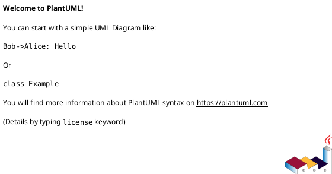

# iss-00007 スコープ配下に子ノード作成用スクリプトを自動生成 + 補足資料ディレクトリ追加 — 要件定義（WHAT / WHY）

## 目的（ユーザーに見える成果 / To-Be） (必須)
- 人間/エージェントが「いま見ているスコープ」配下へ、親ID指定なしで `new epic` / `new issue` / `new adr` を最小引数（タイトル1つ）で実行できる。
- Initiative/Epic/Issue の各レイヤーに、ADR以外の補足資料を置ける共通ディレクトリが存在し、置き場所に迷わない。

## 背景・現状（As-Is / 調査メモ） (必須)
- 現状の挙動（事実）:
  - initiative配下の `epics/` には `README.md` のみがあり、Epic追加は手動で `./spec-dock/scripts/spec-dock new epic --initiative <init-id> ...` を実行する必要がある: `src/spec_dock/assets/spec_dock/templates/initiative/epics/README.md`
  - epic配下の `issues/` も同様に `README.md` のみで、Issue追加は手動で `./spec-dock/scripts/spec-dock new issue --epic <epic-id> ...` を実行する必要がある: `src/spec_dock/assets/spec_dock/templates/epic/issues/README.md`
  - issue配下には `artifacts/` と `discussions/` が存在するが、initiative/epic には存在しない: `src/spec_dock/assets/spec_dock/templates/issue/artifacts/README.md`, `src/spec_dock/assets/spec_dock/templates/issue/discussions/_template.md`
  - ADRは各スコープ配下の `adrs/` にMarkdownファイルとして作成される（`meta.json` は持たない）: `src/spec_dock/assets/spec_dock/scripts/spec-dock:816`
- 現状の課題（困っていること）:
  - 子ノード作成時に親IDの指定が毎回必要で、特にエージェントは「どのIDが親か」を都度探索しがちで手戻り/ミスが起きる。
  - ADR以外の補足資料の置き場がレイヤー間で不統一（issueにしかない）で、initiative/epic の議論ログや図をどこへ置くべきか迷う。
- 再現手順（最小で）:
  1) `new initiative` を実行し、生成された `epics/` を開く
  2) `README.md` しかなく、`new epic` をタイトルだけで実行できる導線がない
- 観測点（どこを見て確認するか）:
  - FS: `spec-dock/initiatives/**` 配下の生成物（ディレクトリ/スクリプト/README）
  - CLI: `spec-dock/scripts/spec-dock new ...` の実行結果（生成パス、`meta.json` の内容、ADRファイル名）
- 実際の観測結果（貼れる範囲で）:
  - Input/Operation: `./spec-dock/scripts/spec-dock new initiative ...` → `epics/README.md` のみが生成される
  - Output/State: `new epic` には `--initiative <id>` が必須で、親IDを省略できない
- 情報源（ヒアリング/調査の根拠）:
  - Issue/チケット: https://github.com/chemitaro/spec-dock/issues/7
  - ドキュメント: `src/spec_dock/assets/spec_dock/docs/guide.md`
  - コード: `src/spec_dock/assets/spec_dock/scripts/spec-dock`（`_new_initiative` / `_new_epic` / `_new_issue` / `_new_adr` とテンプレ適用を確認）

## 対象ユーザー / 利用シナリオ (任意)
- 主な利用者（ロール）:
  - spec-dock を使って仕様ツリーを運用する開発者（人間）
  - 仕様ツリーを読んで作業するコーディングエージェント
- 代表的なシナリオ:
  - initiative配下の `epics/` で `./new-epic "<title>"` を実行して epic を追加する
  - epic配下の `issues/` で `./new-issue "<title>"` を実行して issue を追加する
  - 任意スコープ配下の `adrs/` で `./new-adr "<title>"` を実行して ADR を追加する
  - initiative/epic/issue の補足資料ディレクトリに、図/ログ/議論メモ/調査ノートを格納する

### UML（任意） (任意)

## スコープ（暴走防止のガードレール） (必須)
- MUST（必ずやる）:
  - Initiative配下 `epics/` に、Epic作成用スクリプト `new-epic` を自動配置する（引数はタイトル1つのみ）
  - Epic配下 `issues/` に、Issue作成用スクリプト `new-issue` を自動配置する（引数はタイトル1つのみ）
  - Initiative/Epic/Issue の `adrs/` に、ADR作成用スクリプト `new-adr` を自動配置する（引数はタイトル1つのみ）
  - Initiative/Epic/Issue の各スコープに、ADR以外の補足資料ディレクトリ `artifacts/` を1つ配置する（共通構造）
  - `new-epic/new-issue/new-adr` は `meta.json` を解析して親ID/スコープ種別を取得し、利用者が親IDを渡さずに済む
  - Localスコープ（親idが `*-local-*`）では、`new-epic/new-issue` は自動で `--no-github` を付けて子も local に揃える
  - 生成スクリプトは内部的に既存の runtime script `spec-dock/scripts/spec-dock` を呼び、ロジックを重複しない
- MUST NOT（絶対にやらない／追加しない）:
  - 既存の `new {initiative,epic,issue,adr}` の振る舞い（ID規則、生成先、GitHub連携）を壊さない
  - `jq` 等の新しい外部依存を必須にしない（runtime script は stdlib のまま）
  - 既存のユーザー仕様ツリー（`spec-dock/initiatives/**`）を update で勝手に書き換える仕組みは入れない（必要なら別コマンドとして明示）
- OUT OF SCOPE:
  - 既存ノード全件への後追いマイグレーション
  - GitHub Projects 等への連携拡張

## 境界（Always / Ask / Never） (必須)
- Always（常に守る）:
  - スクリプトは「どのディレクトリで実行しても動く」ように、スクリプト自身のパスを起点に `spec-dock/scripts/spec-dock` を解決する
  - 引数のタイトルはスペースを含めても安全に扱う（クォート徹底）
  - 引数は「タイトル1つのみ」。余計なフラグや追加引数は受け取らず、使い方を表示して失敗する
  - 破壊的なGit操作（強制更新/履歴改変/削除）を行わない
- Ask（迷ったら相談）:
  - （該当なし）
- Never（絶対にしない）:
  - `spec-dock update` でユーザーの `spec-dock/initiatives/**` 配下を上書きする
  - 既存ノード配下のファイルを自動で削除/移動する（マイグレーションを暗黙に走らせない）

## 非交渉制約（守るべき制約） (必須)
- 例: 既存API互換を維持する
- 例: 依存追加はしない（必要なら要件に明記）
- 例: セキュリティ/プライバシー要件（ログ、マスキング、権限制御など）
- 例: 性能（p95など）やSLO
- runtime script（`spec-dock/scripts/spec-dock`）は stdlib のまま（追加依存なし）
- 生成スクリプトは最小インターフェース（タイトル1引数）を守る

## 前提（Assumptions） (必須)
- 対象OSは macOS/Linux のみ（Windowsは対象外）
- 利用者は `spec-dock/scripts/spec-dock` が存在するリポジトリ内で作業している
- Epic/Issue 作成は既存仕様どおり「デフォルトはGitHub Issue作成（gh利用）」である
- `--no-github` を付けることでローカルのみ作成できる（現状仕様）

## 判断材料/トレードオフ（Decision / Trade-offs） (任意)
- 論点1: 生成スクリプトにIDを「埋め込む」か「`meta.json` を解析」するか
  - 選択肢A（ID埋め込み）: テンプレ置換で `<INIT_ID>` 等を書き込む
  - 選択肢B（meta解析）: スクリプトが親ディレクトリの `meta.json` を読んでIDを取得する
  - 決定: B（meta解析）
  - 理由:
    - ID/種別のSSOTは `meta.json` なので、実行時に常に正しい情報を参照できる
    - スクリプト本体は固定で「ただコピーするだけ」にでき、テンプレ置換や生成物の差分が減る
    - JSONパースは `python3` を用いる（runtime script が既に `python3` 前提なので追加依存になりにくい）
- 論点2: 補足資料ディレクトリの統一名
  - 選択肢A: `artifacts/`（証跡/図/ログ断片/調査メモをまとめる。ADRは別に残す）
  - 選択肢B: `discussions/`（議論/調査の置き場。ただしADRと概念が近く重複しやすい）
  - 選択肢C: 別名（例: `materials/`, `evidence/`, `notes/`）
  - 決定: A（`artifacts/`）
  - 理由（定性的）:
    - ADRは「決定の記録」であり、補足資料は「決定や実装の根拠となる素材/証跡」。役割を名前で分離したい
    - `discussions/` は“議論=意思決定プロセス”を想起させ、ADRと運用が被って二重管理になりやすい
    - `artifacts/` は中立で包含範囲が広く、図/ログ/スクショ/調査メモ（Markdown）まで受け止められる

## リスク/懸念（Risks） (任意)
- R-001: 生成スクリプトが実行権限を持たず、`./new-epic` が実行できない（影響: 導線が死ぬ / 対応: 生成時にchmod、または `bash ./new-epic ...` で回避）
- R-003: `gh` が使えない環境で GitHub 親スコープ配下の作成が失敗する（影響: 実行が止まる / 対応: エラーメッセージで「直接コマンドを実行せよ」を明確に案内する）

## 受け入れ条件（観測可能な振る舞い） (必須)
- AC-001:
  - Actor/Role: 開発者（人間/エージェント）
  - Given: `new initiative` で作成した initiative ノードがある
  - When: initiative配下 `epics/` に配置された `new-epic` を `new-epic "<title>"` で実行する
  - Then: 同initiative配下に epic ノードが1つ追加される（`meta.json` が生成される）
  - 観測点（UI/HTTP/DB/Log など）: FS（`spec-dock/initiatives/**/epics/epic-*/meta.json`）、CLI stdout
- AC-002:
  - Actor/Role: 開発者（人間/エージェント）
  - Given: `new epic` で作成した epic ノードがある
  - When: epic配下 `issues/` に配置された `new-issue` を `new-issue "<title>"` で実行する
  - Then: 同epic配下に issue ノードが1つ追加される（`meta.json` が生成される）
  - 観測点（UI/HTTP/DB/Log など）: FS（`.../issues/iss-*/meta.json`）、CLI stdout
- AC-003:
  - Actor/Role: 開発者（人間/エージェント）
  - Given: initiative/epic/issue のいずれかのノードがある
  - When: そのノード配下 `adrs/` に配置された `new-adr` を `new-adr "<title>"` で実行する
  - Then: 同 `adrs/` 配下に `adr-00001-*.md` 等のADRファイルが追加される
  - 観測点（UI/HTTP/DB/Log など）: FS（`adrs/adr-*.md`）、CLI stdout
- AC-004:
  - Actor/Role: 開発者（人間/エージェント）
  - Given: `new initiative` / `new epic` / `new issue` を実行する
  - When: 生成されたノードディレクトリを確認する
  - Then: ADR以外の補足資料を置ける共通ディレクトリ `artifacts/` が存在する
  - 観測点（UI/HTTP/DB/Log など）: FS（ディレクトリ存在、READMEの文言）
- AC-005:
  - Actor/Role: 開発者（人間/エージェント）
  - Given: 親スコープが local（`*-local-*`）である
  - When: `new-epic` / `new-issue` を実行する
  - Then: 子ノードも local として作成される（`--no-github` が自動で付与される）
  - 観測点（UI/HTTP/DB/Log など）: FS（`epic-local-*` / `iss-local-*`）、CLI stdout

### 入力→出力例 (任意)
- EX-001:
  - Input: `epics/new-epic "JWT Auth"`
  - Output: `epics/epic-000NN-jwt-auth/` が増える（GitHubモードなら `epic-00xxx`、ローカルなら `epic-local-000NN`）
- EX-002:
  - Input: `adrs/new-adr "Token rotation strategy"`
  - Output: `adrs/adr-000NN-token-rotation-strategy.md` が増える

## 例外・エッジケース（仕様として固定） (必須)
- EC-001:
  - 条件: スクリプトにタイトル引数が渡されない
  - 期待: 使い方をstderrに出して失敗（exit code != 0）
  - 観測点（UI/HTTP/DB/Log など）: CLI stderr / exit code
- EC-002:
  - 条件: GitHubモードの親スコープだが `gh` が利用できない
  - 期待: 明確なエラーメッセージで失敗し、直接コマンド（`spec-dock/scripts/spec-dock new ...`）を実行するよう促す
  - 観測点: CLI stderr / exit code
- EC-003:
  - 条件: タイトルにスペースや記号が含まれる
  - 期待: クォートされたタイトルが壊れずに runtime script に渡る（最終的な成否は既存のtitle制約に従う）
  - 観測点: CLI stderr（バリデーションエラーの有無）、生成物
- EC-004:
  - 条件: スクリプトに引数が2つ以上渡される
  - 期待: 使い方をstderrに出して失敗（exit code != 0）
  - 観測点: CLI stderr / exit code

## 用語（ドメイン語彙） (必須)
- TERM-001: スコープ = Initiative/Epic/Issue のいずれかのノード配下で「その配下に閉じる生成」をする単位
- TERM-002: 補足資料ディレクトリ = ADR以外の調査メモ/図/ログ断片/議論資料などを置く共通の置き場
- TERM-003: 生成スクリプト = 各ディレクトリに自動配置される、タイトル1引数で子ノードを作るためのラッパースクリプト

## 未確定事項（TBD / 要確認） (必須)
- 該当なし

## Definition of Ready（着手可能条件） (必須)
- [ ] 目的が 1〜3行で明確になっている
- [ ] MUST/MUST NOT/OUT OF SCOPE が書けている
- [ ] Always/Ask/Never が書けている
- [ ] AC/EC が観測可能（テスト可能）な形になっている
- [ ] 観測点（UI/HTTP/DB/Log など）または確認方法が明記されている
- [ ] 未確定事項が「質問/選択肢/推奨案/影響範囲」で整理されている

## 完了条件（Definition of Done） (必須)
- すべてのAC/ECが満たされる
- 未確定事項が解消される（残す場合は「残す理由」と「合意」を明記）
- MUST NOT / OUT OF SCOPE を破っていない

## 省略/例外メモ (必須)
- 該当なし
