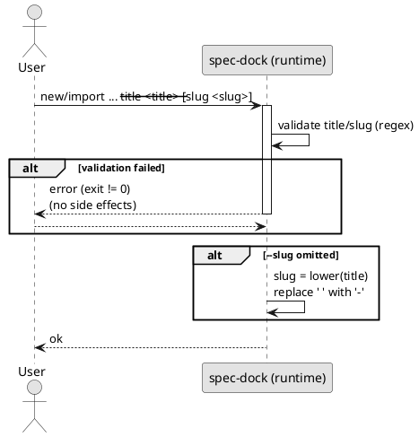

# adr-00001 title/slug 制約（kebab-case slug / 英数字スペース title）

## 結論（Decision） (必須)
- `new/import {initiative,epic,issue}` の入力制約を以下で固定する:
  - `--title`（trim 後）: `^[A-Za-z0-9]+(?: [A-Za-z0-9]+)*$`（英字/数字/スペースのみ）
  - `--slug`（trim 後）: `^[a-z0-9]+(?:-[a-z0-9]+)*$`（kebab-case のみ）
- `--slug` 省略時は、`lower(title)` を取り、半角スペース ` ` を `-` に置換して slug を合成する。
- バリデーションは副作用（FS/GitHub）より前に行い、失敗時は exit != 0 で中断する。
- エラーメッセージは、コーディングエージェントが修正できるように「不正な引数」「期待する正規表現」「OK/NG 例」を含める。

## 背景（Context） (必須)
- `active set` は GitHub 連携ノードで `gh issue checkout` 等を用いて checkout するため、GitHub Issue title が日本語だと日本語ブランチ名が生成され得る（ツールチェーン上の事故要因）。
- 現状の slug 合成/検証は Unicode を許容しており、日本語タイトルから日本語 slug が生成され得る。
- 本 Issue の目的（日本語ブランチ名を残さない）を達成するうえで、node メタデータの `slug` 自体を ASCII で決定的にする必要がある。

### UML（任意） (任意)

## 選択肢（Options considered） (必須)
- Option A（最小変更・互換寄り）:
  - 概要:
    - `--slug` は lowercase ASCII（例: `[a-z0-9._-]`）まで許容し、kebab-case は推奨に留める。
    - `--title` は Printable ASCII のみなど、緩めの ASCII 制約に留める。
  - Pros:
    - 既存運用（`_validate_slug` の思想）に近く、破壊的変更を抑えやすい。
  - Cons:
    - `id-slug` の表記ゆれが残り、ブランチ名やパスの取り回し事故を完全には減らしにくい。

- Option B（強め・運用単純化）:
  - 概要:
    - `--slug` を kebab-case に限定し、`--title` も slug に変換できる形式に限定する。
  - Pros:
    - 表記ゆれが減り、パス/ブランチ名が読みやすく安全になる。
    - ルールが単純で、レビュー/自動化/正規表現前提の運用に載せやすい。
  - Cons:
    - 破壊的変更になり得る（日本語 title、`_`/`.` を含む slug など）。
  - 棄却理由（棄却する場合）:
    - 該当なし（採用）。

## 判断理由（Rationale） (必須)
- ブランチ名・パス名の事故を「生成源（title/slug）」の段階で抑止し、後段での例外処理（transliteration 等）を不要にするため。
- `slug` を kebab-case に限定することで、`id-slug` の見た目と機械可読性が安定し、運用を単純化できるため。

## 影響（Consequences） (必須)
- Positive（良い点）:
  - 日本語 title に起因する日本語ブランチ名/パス名の発生を抑止できる。
  - `slug` の表記ゆれが減り、運用・自動化（正規表現/規約）が安定する。
- Negative / Debt（悪い点 / 将来負債）:
  - 既存ユーザーの入力（日本語 title、kebab-case 以外の slug）を破壊し得る。
- 影響範囲（コード/テスト/運用/データ）:
  - runtime script: `new/import` の title/slug バリデーション、エラーメッセージ
  - 仕様/運用: ルールの周知（リリースノート等）
  - 既存データ: 既存ノードの slug は残り得るため、`active set` では `<id>` へのフォールバックを維持する
- 移行/ロールバック:
  - 移行: `--title` を英語にする、または `--slug` を kebab-case で明示指定する。
  - ロールバック: 制約を緩める場合は Option A 相当へ戻す（ただし運用事故リスクが戻る）。
- Follow-ups（追加の Epic/Issue/ADR）:
  - GitHub Issue #5 の実装・テスト・ドキュメント更新。

## 参考（References） (任意)
- GitHub Issue:
  - https://github.com/chemitaro/spec-dock/issues/5
- 関連仕様:
  - `tmp/issue-5/requirement.md`
  - `tmp/issue-5/discussions/slug-and-branch-naming.md`
