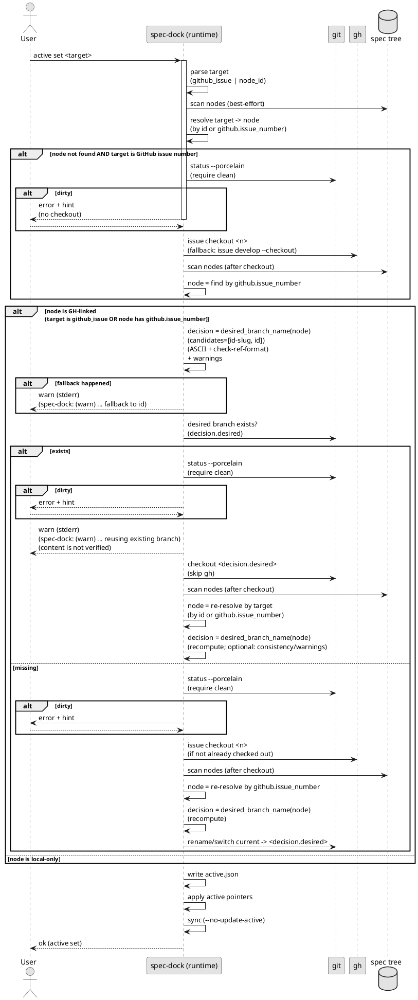
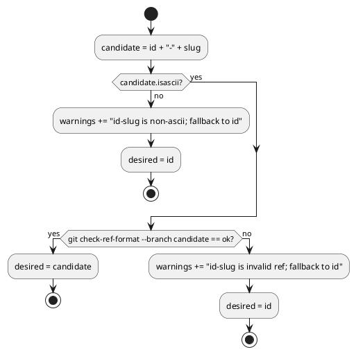
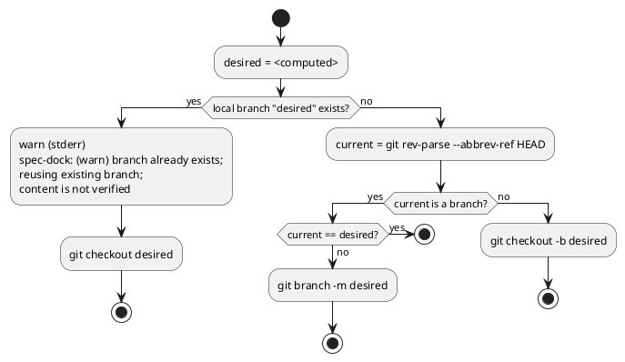
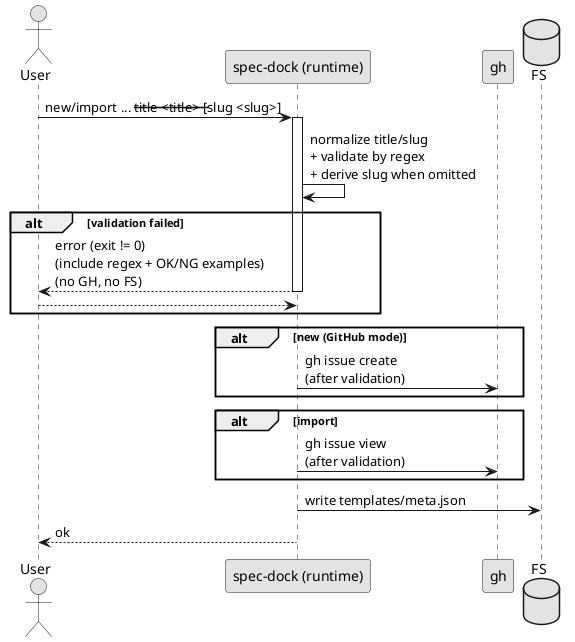
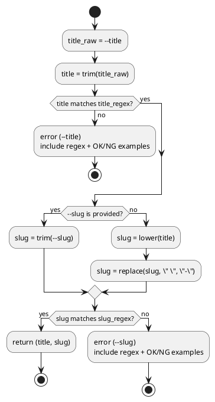
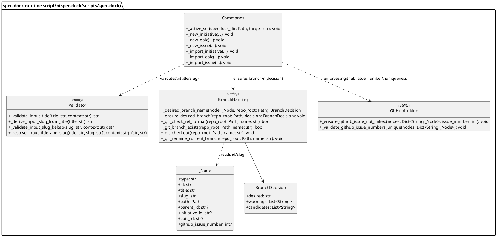
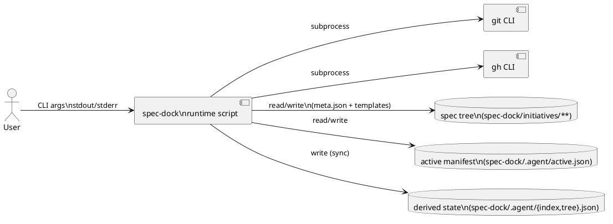
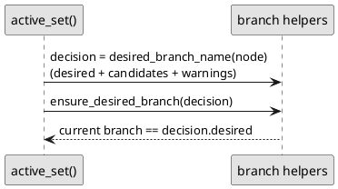

# issue-5 active set の checkout で日本語ブランチ名が生成されるのを防ぐ（id-slug 命名） — 設計（HOW）

## 目的・制約（要件から転記・圧縮） (必須)
- 目的:
  - `active set` の結果として checkout されている current ブランチ名を、node メタデータ（`id` / `slug`）に基づく決定的な形式へ寄せる（原則 `id-slug`、不適合時は `id`）。
  - `new/import {initiative,epic,issue}` の `--title` / `--slug` を「slug に変換できる形式」に制約し、非ASCII/日本語等によるパス・ブランチ名の崩れを生成源で防ぐ。
  - `github.issue_number` の重複リンクを防止/検知し、`active set <github_issue_number|url>` が曖昧にならない状態を保つ（manual test で発見した運用不能状態を潰す）。
- MUST:
  - ブランチ候補の妥当性は `git check-ref-format --branch` に固定して判定する（実装ブレ防止）。
  - `new/import` のバリデーション失敗時は副作用（FS/GitHub）なしで中断する。
  - 既存データにより `id-slug` が不適合でも、`active set` は `<id>` へフォールバックして継続する（warning 出力）。
  - `github.issue_number` は initiative/epic/issue をまたいで一意とし、`new --github-issue` は重複リンクをエラーで拒否する。`validate` は重複リンクを検知してエラーとする。
- MUST NOT:
  - リモートブランチの削除/リネーム/強制更新（force push）を行わない。
  - GitHub Issue 本体（title/body/labels 等）の自動変更を追加しない。
- 非交渉制約:
  - runtime script は stdlib のみ（依存追加なし）。
  - CLI の既存インターフェース（コマンド/引数）を変更しない。
  - `import` は GitHub title を取り込まない（`--title` 必須）。
- 前提:
  - GitHub 連携では `git` と `gh` が利用可能で、`gh auth` 済みである。
  - `active set` の checkout は dirty working tree では拒否する（既存挙動維持）。

---

## 既存実装/規約の調査結果（As-Is / 99.9%理解） (必須)
- 参照した規約/実装（根拠）:
  - `src/spec_dock/assets/spec_dock/docs/reference_github.md`: `new/import/active set` の GitHub 連携の前提と副作用
  - `src/spec_dock/assets/spec_dock/scripts/spec-dock`:
    - `_active_set`（`active set` の checkout/active 更新）: 1497 行付近
    - `_gh_issue_checkout`（`gh issue checkout/develop`）: 1072 行付近
    - `_slugify` / `_validate_slug`（title→slug、slug 検証）: 258/105 行付近
    - `_new_{initiative,epic,issue}`（`new` の title/slug と gh issue create）: 492/564/653 行付近
    - `_import_{initiative,epic,issue}` と `_import_slug`（`import` の title/slug と gh issue view）: 1243/1321/1363/1425 行付近
- 観測した現状（事実）:
  - `active set` は GitHub 紐づきノードで `gh issue checkout` →（失敗時）`gh issue develop --checkout` を実行するが、ブランチ名は指定しない。
    - 結果として `gh` 側の自動命名（Issue title 由来）に依存し、日本語タイトルで日本語ブランチ名が発生し得る。
  - `_slugify` は Unicode `isalnum()` を保持し、`_validate_slug` も Unicode を許容するため、日本語 title → 日本語 slug が通り得る。
    - 重要: 既存の `_validate_slug` は「既存 node / validate / ADR 等の別用途」で使われているため、本件では **置き換えない**（後方互換性のため温存）。入力専用のバリデータを別名で追加する。
  - `new` は（GitHub モードで）`gh issue create` を先に実行し得るため、title/slug の厳格バリデーションを入れる場合は「副作用前」に順序を入れ替える必要がある。
  - `import` は `gh issue view` を先に実行するため、入力バリデーションを「副作用前」に移動する必要がある。
  - `github.issue_number` の一意性は `import` では拒否されているが（`_ensure_github_issue_not_linked`）、`new --github-issue` では現状拒否されず、重複リンクにより `active set <number|url>` が `Ambiguous github.issue_number=...` で失敗し得る（手動テストで再現）。
  - `validate` は現状 `github.issue_number` の重複を検知しないため、`validate` が通るのに `active set` が壊れる状態を作れてしまう。
- 採用するパターン（設計方針）:
  - 失敗は `RuntimeError` を送出し、CLI は exit != 0 で中断する（既存パターン）。
  - `git` / `gh` は `subprocess.run(..., check=True, capture_output=True)` で実行し、失敗時は user-friendly な `RuntimeError` に整形する（既存パターン）。
  - warning/info は `stderr` に出し、成功の `spec-dock: ok (...)` は `stdout` を維持する。
- 採用しない/変更しない:
  - 高度な transliteration（日本語→ローマ字変換）による slug 生成は行わない（OUT OF SCOPE）。
  - 既存 node の slug を自動移行（ディレクトリ名変更）しない（破壊的・範囲外）。
- 影響範囲（呼び出し元/関連コンポーネント）:
  - runtime script（`active/new/import` のみ。`validate/sync/new adr` は必要最小限で影響を避ける）
  - `tests/test_cli.py`（`active set` の checkout スタブ、title/slug バリデーションの副作用なし担保）

## 主要フロー（テキスト：AC単位で短く） (任意)
- Flow for AC-001/002（`active set` で current ブランチ名を確定）:
  - 補足: このフローは GitHub 紐づき（checkout を伴う）場合を想定する。local-only node の `active set` はブランチ操作を行わず、active の更新のみを行う。
  1) 入力 target を解決（GitHub issue number か node id）
  2) 対象 node を解決（scan → id or github.issue_number で特定。必要なら checkout 後に再scan）
  3) 対象 node の `id/slug` から desired branch 候補（`id-slug` → `id`）を決定
  4) desired branch が既存なら、**`gh` checkout をスキップ**し、warning を出してそのブランチを checkout 継続（内容は検証しない）
  5) desired branch が既存でない場合のみ、GitHub 紐づきなら `gh issue checkout/develop` で checkout を行い、ブランチ名を desired へ寄せる（dirty なら中断）
  6) active manifest / pointers を更新し、sync を実行する
- Flow for AC-003〜006/007（`new/import` の title/slug バリデーション）:
  1) `--title` を trim → 正規表現で検証（失敗なら副作用なしで中断）
  2) `--slug` を（指定があれば trim→検証、なければ title から合成→検証）
  3) （GitHub連携で `github.issue_number` が確定する場合）`github.issue_number` の重複リンクを検出してエラー（副作用なし）
  4) 以降の副作用（`gh issue create/view`、FS 生成）を実行する

### UML（シーケンス: active set） (任意)


### UML（アクティビティ: desired branch の決定） (任意)


### UML（アクティビティ: desired branch を成立させる） (任意)


## データ・バリデーション（必要最小限） (任意)
- 入力制約（requirement.md と一致させる）:
  - Title:
    - `title = title.strip()` を正規化として採用し、保存する title は trim 後に統一する。
    - `^[A-Za-z0-9]+(?: [A-Za-z0-9]+)*$` に一致しない場合はエラー（副作用なし）。
  - Slug:
    - `slug = slug.strip()` を正規化として採用。
    - `^[a-z0-9]+(?:-[a-z0-9]+)*$`（kebab-case）に一致しない場合はエラー（副作用なし）。
    - `--slug` 省略時は `lower(title)` を取り、半角スペース ` ` を `-` に置換して slug を合成する。
- 実装メモ（後方互換・安全性）:
  - 入力専用の新規関数（例: `_validate_input_title` / `_validate_input_slug_kebab` / `_derive_input_slug_from_title`）として追加し、既存の `_validate_slug` / `_slugify` は温存する（既存 node / validate / ADR の互換を壊さない）。
- バリデーションエラーのメッセージ方針:
  - どの引数が不正か（`--title` / `--slug`）
  - 期待する正規表現
  - OK/NG 例（コーディングエージェントが即修正できる粒度）
- ブランチ候補の検証:
  - ASCII 判定は `str.isascii()` 相当で固定する。
  - git ブランチ名の妥当性は `git check-ref-format --branch <candidate>` の成功で判定する。

### UML（シーケンス: new/import の副作用前バリデーション） (任意)


### UML（アクティビティ: title→slug 合成とバリデーション） (任意)


## 判断材料/トレードオフ（Decision / Trade-offs） (任意)
- 論点: slug 制約を強めると利便性が落ちる（日本語/記号の title を使えない）
  - 決定: title/slug の正規表現を固定し、入力時点でエラーにする（ADR 参照）
  - 理由: path/ブランチ名が運用事故を起こしやすいため、生成源で止めるのが最小コスト

## インターフェース契約（ここで固定） (任意)
### CLI（外部IF）
- `active set <target>`:
  - target は GitHub issue number（`123` / `#123` / URL）または node id（`iss-00123` 等）
  - GitHub 紐づきの場合 checkout を伴い、最終的な current ブランチ名を desired へ寄せる
  - 既存ブランチ再利用やフォールバック時は stderr に warning を出す
- `new {initiative,epic,issue}` / `import {initiative,epic,issue}`:
  - `--title` / `--slug` の制約違反はエラー（副作用なし）
  - `--slug` 省略時は title から deterministic に合成する
  - `import` は `--title` 必須（GitHub title 取り込みなし）
  - `new --github-issue <n>` は `github.issue_number=<n>` の重複リンクを拒否する（initiative/epic/issue をまたぐ）
  - `validate` は `github.issue_number` の重複リンクをエラーとして検知する

### 関数・クラス境界（重要なものだけ）
- IF-001: `spec-dock::_resolve_input_title_and_slug(title: str, slug: str|None, *, context: str) -> tuple[str, str]`
  - Input: raw title/optional raw slug
  - Output: (normalized_title, normalized_slug)
  - Errors: `RuntimeError`（エラーメッセージに regex と OK/NG 例を含む）
  - Note: 既存の `_validate_slug`（Unicode 許容・別用途）は呼ばず、入力専用バリデータ（kebab-case）を使う
- IF-002: `spec-dock::_desired_branch_name(node: _Node, *, repo_root: Path) -> BranchDecision`
  - Input: node（id/slug）、repo_root（git check-ref-format のため）
  - Output: `BranchDecision`（desired + candidates + warnings）
- IF-003: `spec-dock::_ensure_desired_branch(repo_root: Path, *, decision: BranchDecision) -> None`
  - Input: desired ブランチ名（decision.desired）+ warnings（decision.warnings）
  - Behavior:
    - desired が既存なら checkout して warning（content is not verified）
    - 既存でなければ現在ブランチを desired に寄せる（必要に応じて rename）
  - Errors: git 実行失敗は `RuntimeError`
  - Output: warning は stderr に `spec-dock: (warn)` プレフィクスで出す（安定トークン）
- IF-004: `spec-dock::_ensure_github_issue_not_linked(nodes: dict[str, _Node], *, issue_number: int) -> None`
  - Input: nodes（scan結果）, issue_number（リンクしようとしている GitHub issue 番号）
  - Behavior: initiative/epic/issue のいずれかが `github.issue_number==issue_number` を持つ場合は `RuntimeError` で拒否する
  - Note: `import` に加え、`new --github-issue` でも使用して “運用不能な状態” を生成させない
- IF-005: `spec-dock::_validate_github_issue_numbers_unique(nodes: dict[str, _Node]) -> None`
  - Behavior: ツリー全体で `github.issue_number` が一意でない場合は `RuntimeError`（validateで検知）

### UML（クラス図: 主要データ/責務） (必須)


### UML（コンポーネント図: 外部IF） (必須)


### UML（シーケンス: active_set と branch helpers） (任意)


### 例外/エラー契約（重要なものだけ） (任意)
- ERR-001: Invalid title
  - 発生条件: `--title` が `^[A-Za-z0-9]+(?: [A-Za-z0-9]+)*$` に一致しない
  - 返し方: `RuntimeError`（exit != 0）、副作用なし
- ERR-002: Invalid slug
  - 発生条件: `--slug` が `^[a-z0-9]+(?:-[a-z0-9]+)*$` に一致しない
  - 返し方: `RuntimeError`（exit != 0）、副作用なし
- ERR-003: Duplicate GitHub link
  - 発生条件: `new --github-issue <n>` で、既に `github.issue_number=<n>` を持つ node が存在する
  - 返し方: `RuntimeError`（exit != 0）、副作用なし（エラーに既存 node 一覧を含める）
- WARN-001: Branch fallback
  - 発生条件: `id-slug` が non-ascii または invalid ref で `<id>` にフォールバック
  - 出力: stderr に `spec-dock: (warn)` で始まる warning（理由・候補を含む）
- WARN-002: Branch reuse
  - 発生条件: desired branch が既存のため再利用
  - 出力: stderr に `spec-dock: (warn)` で始まる warning（content is not verified を含む）

## 変更計画（ファイルパス単位） (必須)
- 追加（Add）:
  - （なし）: 依存追加なし・スクリプト内で完結させる
- 変更（Modify）:
  - `src/spec_dock/assets/spec_dock/scripts/spec-dock`:
    - title/slug の正規表現バリデーションを追加（initiative/epic/issue の new/import）
    - 既存の `_validate_slug` は温存し、入力専用のバリデータ/合成関数（例: `_validate_input_slug_kebab`）を別名で追加
    - `new/import` の副作用前にバリデーションが必ず走るよう順序を変更
    - `active set` の checkout 後に desired branch name へ寄せる処理（git helper + warning）
    - `new --github-issue` で `github.issue_number` の重複リンクを拒否する（`import` と整合）
    - `validate` で `github.issue_number` の重複リンクを検知して失敗させる（早期検知）
  - `src/spec_dock/assets/spec_dock/docs/reference_github.md`（必要なら）:
    - `active set` がブランチ名を id/slug に寄せること、warning の意味を追記
  - `tests/test_cli.py`:
    - `active set` の gh スタブと期待ブランチ名の更新
    - `new/import` の title/slug バリデーション（副作用なし）テスト追加
    - `new --github-issue` の重複リンク拒否テスト追加
    - `validate` が `github.issue_number` 重複で失敗するテスト追加
- 削除（Delete）:
  - （なし）
- 移動/リネーム（Move/Rename）:
  - （なし）
- 参照（Read only / context）:
  - `tmp/issue-5/requirement.md`: 仕様の SSOT
  - `tmp/issue-5/adrs/adr-00001-title-slug-kebab-case.md`: 制約の意思決定

## マッピング（要件 → 設計） (必須)
- AC-001/002 → `src/spec_dock/assets/spec_dock/scripts/spec-dock::_active_set` + branch helpers（`git check-ref-format`）
- AC-003/004 → `src/spec_dock/assets/spec_dock/scripts/spec-dock::_new_*` / `_import_*` の副作用前バリデーション
- AC-007 → title→slug 合成ロジック（`_resolve_input_title_and_slug`）
- AC-008 → `_new_*` の `--github-issue` 経路で `_ensure_github_issue_not_linked`
- AC-009 → `_validate_nodes` から `_validate_github_issue_numbers_unique` を呼ぶ
- EC-001/001b → `_desired_branch_name`（ascii/ref 判定）+ warning（stderr）
- EC-005 → `_ensure_desired_branch`（branch exists 判定）+ warning（stderr）
- 非交渉制約（stdlib only / CLI互換 / 副作用なし） → helper 関数を runtime script 内に閉じ、呼び出し順序で担保

## テスト戦略（最低限ここまで具体化） (任意)
- 追加/更新するテスト（`tests/test_cli.py`）:
  - `active set`:
    - GH checkout スタブが作るブランチ名（例: `gh-issue-123`）から、最終的に `iss-00123-<slug>` へ寄ること
    - desired branch が既に存在する場合に warning を出して再利用すること
    - `id-slug` が non-ascii / invalid ref の場合に `<id>` へフォールバックし warning を出すこと
  - `new/import`:
    - `--title` が不正な場合、`gh` が呼ばれず、FS 生成もないこと
    - `import` は title/slug 検証が `gh issue view` より前に行われること（`gh` 呼び出しログで検証）
    - `--slug` 省略時の合成が deterministic（`Add Refresh Token` → `add-refresh-token`）であること
  - `github.issue_number` の一意性:
    - `new --github-issue <n>` が、既にリンク済みの `<n>` を拒否すること（副作用なし）
    - `validate` が `github.issue_number` の重複を検知して失敗すること
- どのAC/ECをどのテストで保証するか:
  - AC-001/002 → `tests/test_cli.py::test_active_set_github_issue_checkout_sets_active`（ブランチ名の期待を更新）
  - AC-003〜006 → 新規テスト追加（`_make_gh_issue_view_stub` の log を使い「呼ばれない/呼ばれる」を検証）
  - EC-001/001b/005 → warning は全文一致ではなく、安定トークンの包含で検証する
    - 例: `spec-dock: (warn)` + `fallback to id` / `reusing existing branch` / `content is not verified`
  - AC-008/AC-009 → `tests/test_cli.py` に重複リンク拒否と validate 失敗のテストを追加
- 実行コマンド:
  - `python -m unittest -q`
- 変更後の運用（必要なら）:
  - 移行手順: 既存運用で日本語 title を使っている場合は、英字/数字/スペースのみの title に変更する（または `--slug` を kebab-case で明示指定）
  - ロールバック: title/slug 制約を緩める場合は ADR の Option A 相当に戻す（ただし運用事故リスクが戻る）

## リスク/懸念（Risks） (任意)
- R-001: 既存ユーザーが日本語 `--title`（または kebab-case 以外の `--slug`）を使っていた場合に破壊的（`new/import` が失敗）
  - 対応: エラーメッセージに OK/NG 例と正規表現を出し、修正可能にする。リリースノートで告知。
- R-002: `gh` バージョン差異（`issue develop --name` の有無等）で checkout 最適化が効かない可能性
  - 対応: `gh issue checkout` + git rename のフォールバックを持つ（最終ブランチ名の要件を満たす）

## 未確定事項（TBD） (必須)
- 該当なし（要件/意思決定は確定）

---

## ディレクトリ/ファイル構成図（変更点の見取り図） (任意)
```text
<repo-root>/
├── src/spec_dock/assets/spec_dock/scripts/spec-dock         # Modify
├── src/spec_dock/assets/spec_dock/docs/reference_github.md  # Modify (optional)
└── tests/test_cli.py                                        # Modify
```

## 省略/例外メモ (必須)
- 該当なし
